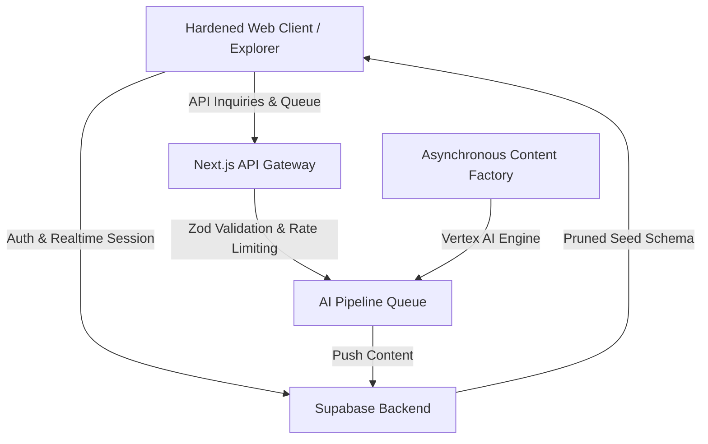

<p align="center">
  
</p>

<h1 align="center">🌌 OpenPrimer</h1>

<p align="center">
  <strong>Universal academic knowledge, finally free, structural, and mentored in real-time by pedagogical AI.</strong>
</p>


---

## 🌟 Our Core Vision

OpenPrimer shifts the paradigm of digital learning by combining structural academic rigor with absolute cognitive personalization:

*   **📖 The Dual-Pane UX:** A split-screen desktop environment. The **Left Pane** serves the pristine, structured academic reference course (parsed MDX, dynamic equations, and diagrams). The **Right Pane** hosts your interactive **AI Pedagogical Tutor**, acting as an active tutor, socratic dialog partner, or pragmatic coach.
*   **🤖 Multi-Personality Tutors:** Specialized AI personalities (e.g., Socratic Coach, Feynman Simplifier, Rigorous Proof Master, Pragmatic Engineer) tailored to your learning style.
*   **⚡ WebLLM + Live Cloud Orchestration:** High-performance client-side inference using `WebLLM` natively inside the browser, with automated fallback to robust remote cloud endpoints.
*   **🛠️ Academic Gamification:** Tracks curriculum completion organically through dynamic *Knowledge Points (KP)*, verified modules, and academic badges.

---

## 🏗️ The Ecosystem

The OpenPrimer ecosystem is designed as a hardened, modern SaaS application distributed across multiple components:



### Key Repositories & Modules

*   **[OpenPrimer](https://github.com/Open-Primer/OpenPrimer)**: The core repository containing:
    *   `/web`: The Next.js web application, interactive explorer, API gateway, and DB controllers.
    *   `/content`: MDX-based academic course modules categorized by level, subject, and discipline.
    *   `/supabase`: Local and deployment-ready Supabase backend schemas, RLS policies, and triggers.
    *   `/mobile`: React Native / Expo application wrapper for on-the-go offline reading.
*   **Asynchronous Content Factory**: Remote Python and Vertex AI pipeline orchestrators that auto-curates, structures, translates, and deposits MDX content directly into our databases.

---

## 🚀 Getting Started

If you want to spin up your own local instance of the OpenPrimer dashboard and explorer:

```bash
# 1. Clone the primary repository
git clone https://github.com/Open-Primer/OpenPrimer.git
cd OpenPrimer/web

# 2. Install dependencies
npm install

# 3. Spin up Supabase & seed your pristine database
node scripts/seed_fresh_database.js

# 4. Start the next-gen development environment
npm run dev
```

---

## 🤝 Join the Academic Revolution

OpenPrimer is built as a **common good** for the future of humanity. We believe that top-tier academic knowledge should be free, interactive, and high-fidelity for every human being on the planet.

*   **Become a Contributor:** Help us write, translate, or curate courses. Check our [Contribution Guidelines](https://github.com/Open-Primer/OpenPrimer/blob/main/docs/CONTRIBUTING.md).
*   **Design AI Tutors:** Implement custom pedagogical logic, system prompts, or WebLLM model adapters.
*   **Star the Repo:** If you believe in democratizing academic education, leave us a star on [OpenPrimer](https://github.com/Open-Primer/OpenPrimer)!

---

*Educational content generated by OpenPrimer is copyleft and intended to remain free, gratis, and accessible to every human being forever.*
