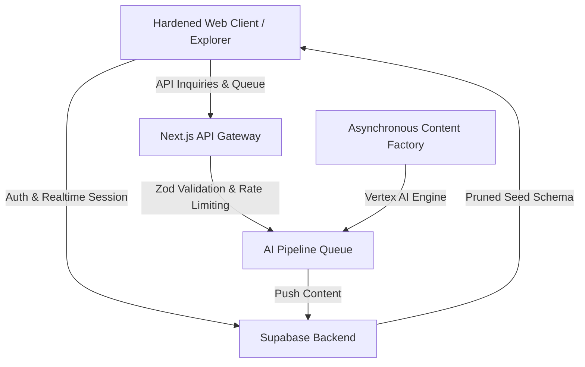

# 🌌 OpenPrimer

> **Universal academic knowledge, finally free, structural, and mentored in real-time by pedagogical AI.**

OpenPrimer is a next-generation open-source SaaS educational platform designed to map, synthesize, and teach the entirety of global academic knowledge—from primary school to graduate-level degrees—through a dual-pane pedagogical environment combined with dedicated AI agents.

---

## 🌟 Vision & Key Paradigms

OpenPrimer shifts the paradigm of digital learning by combining structural rigor with absolute cognitive personalization:

*   **📖 The Dual-Pane UX:** A premium, split-screen desktop environment. The **Left Pane** serves the pristine, structured academic reference course (rendered via parsed MDX, dynamic equations, and diagrams). The **Right Pane** hosts your interactive **AI Pedagogical Tutor**, acting as an active tutor, socratic dialog partner, or pragmatic coach.
*   **🤖 Multi-Personality Tutors:** Seamlessly switch between specialized AI personalities (e.g., Socratic Coach, Direct Synthesizer, Gamified Companion, Feynman Simplifier, Rigorous Proof Master, Pragmatic Engineer) depending on your current learning needs.
*   **⚡ WebLLM + Live Cloud Orchestration:** Experience high-performance client-side inference using `WebLLM` natively inside the browser, with automated fallback to robust remote cloud endpoints.
*   **🛠️ Academic Gamification:** Tracks curriculum completion organically through dynamic *Knowledge Points (KP)*, verified modules, and academic badges.

---

## 🏗️ Technical Architecture

OpenPrimer is architected as a hardened, modern SaaS application:



### 1. Hardened Production Security (SaaS Ready)
*   **Row-Level Security (RLS):** Rigorous backend controls applied directly to profiles, curriculum queues, and settings. Admin panels are strictly locked down to administrative identities like the primary administrator.
*   **Dynamic Identity Mapping:** Dynamic layout navbar instantly hydrates user sessions from live Supabase auth sessions, falling back gracefully to standard profiles when offline.
*   **Rate Limiting & Zod Guards:** All client-accessible POST endpoints are protected by rate limiters (20 req/min limit) and validated through strict Zod schemas to block malicious payloads.
*   **No Stale State Cache:** Automated local storage cache purges execute upon login and logout events to prevent stale mock data leaks.

### 2. Admin Cockpit (Curriculum Control Center)
Located under `/admin`, the unified administrator panel allows complete control over the academic trajectory:
*   **Manual Academic Proposal Panel:** A premium dashboard enabling real-time generation of custom content. Queue up new simple courses or full academic curriculums by specifying:
    *   *Title & Discipline* (e.g., Physics, Biology, Math, Economics, Computer Science, Law).
    *   *Academic Level* (L1, L2, L3, Master).
    *   *Initial Language* (EN, FR, ES, DE, ZH).
    *   *Initial Pedagogical Tutor & Pipeline Priority*.
*   **Automated Queue Tracking:** Track real-time progress of scheduled and active generations in the AI compilation pipeline.

### 3. Asynchronous Content Factory
A remote Python & Vertex AI pipeline orchestrator that auto-curates, structures, translates, and deposits MDX content directly into the catalog schemas.

---

## 🚀 Quick Start Guide

### Repository Structure
*   `/web`: Next.js frontend, API gateway, DB controllers, and the interactive simulator.
*   `/content`: MDX-based academic content categorized by level, subject, and module.
*   `/supabase`: Local and deployment-ready Supabase backend schemas.
*   `/mobile`: React Native / Expo application wrapper for on-the-go offline reading.

---

### Setup & Installation

#### 1. Setup Environment
Ensure you have Node.js 18+ and dynamic environment variables configured.
```bash
# Clone the repository
git clone https://github.com/OpenPrimer/OpenPrimer.git
cd OpenPrimer/web

# Install dependencies
npm install
```

#### 2. Seed Pristine Database
OpenPrimer comes with automated utilities to instantly deploy a pristine database complete with academic badges, system languages, AI tutors, and security policies:
```bash
# Initialize & Seed Database (Run seed script)
node scripts/seed_fresh_database.js
```

#### 3. Run Development Server
```bash
npm run dev
```
Open [http://localhost:3000](http://localhost:3000) to view the application.

---

## 🛠️ Infrastructure Maintenance Tools

OpenPrimer includes dedicated maintenance scripts in `web/scripts/` to ensure robust infrastructure control:

| Script | Purpose |
|---|---|
| `seed_fresh_database.js` | Drops, rebuilds, and seeds the Supabase database with production tables, default personalites, RLS, and admin accounts. |
| `backup_db.ps1` | Creates a comprehensive backup copy of your local or production database schema and data. |

---

## 🤝 Contributing & Documentation

OpenPrimer is a **common good** built for the future of humanity. Explore our master technical manuals for integration:
*   **[Core Architecture & AI Ecosystem](docs/ARCHITECTURE.md)**: Deep dive into the multi-agent system, GitOps synchronization pipelines, and AI self-healing security.
*   **[Infrastructure & Setup Guide](docs/SETUP_GUIDE.md)**: Step-by-step credentials configuration (OAuth, Supabase, Resend, Cloudflare R2) and mobile client building.
*   **[Pedagogical Philosophy](docs/PEDAGOGY.md)**: Syllabus structure, ECTS mechanics, Bloom's 2-Sigma research, and Socratic/Feynman active coaching guides.
*   **[Operational Handbook & Contributing](docs/OPERATIONS.md)**: Administrative Cockpit controls, token cost tracker limits, and open-source contribution code-styles.

## 📝 License
This project is licensed under the MIT License - see the [LICENSE](LICENSE) file for details. Generated educational content is copyleft and intended to remain free, gratis, and accessible to every human being forever.
