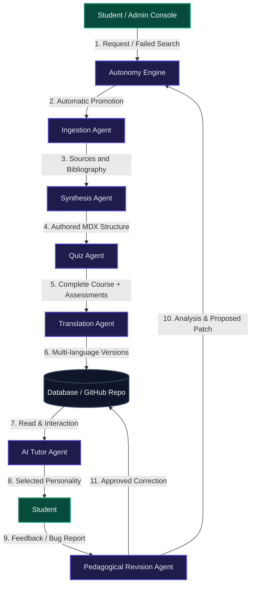

# 🤖 Multi-Agent Architecture of the OpenPrimer Ecosystem

This document details the operation, precise roles, and dynamic interactions of all the **Artificial Intelligence Agents** that power the OpenPrimer platform.

---

## 🗺️ Global Agentic Flow Overview

OpenPrimer utilizes a network of specialized agents orchestrated in a reactive loop. The agents collaborate to generate new courses, validate their pedagogical relevance, translate them, correct student-reported errors, and adapt instruction in real time.



---

## 🕵️ Detailed Description of AI Agents

### 1. 🗂️ Ingestion Agent
*   **Primary Role**: Literature research, extraction, and structuring of primary academic sources.
*   **Operation**: This agent is activated when a course creation is promoted in the pipeline. It performs semantic calls on open academic databases (arXiv, bioRxiv, Europe PMC, OpenAlex, PubChem, PDB, etc.) to extract certified resources compliant with academic standards.
*   **Interactions**: It compiles a list of reliable sources and course outlines (original syllabi) which it transmits directly to the **Synthesis Agent**.

### 2. 📝 Synthesis Agent
*   **Primary Role**: Structured writing of course chapters in MDX format (Markdown enriched with React components).
*   **Operation**: Drawing on Feynman's pedagogical method (simplifying complex concepts using analogy), it drafts the scientific content. It ensures strict semantic tags are introduced and interactive components are integrated (e.g., molecular simulators, vector graphics).
*   **Interactions**: Once written, the raw course is sent to the **Quiz Agent** to inject the evaluation.

### 3. 🎯 Quiz & Assessment Agent (Quiz Agent)
*   **Primary Role**: Generation of self-assessment mini-quizzes and final exams.
*   **Operation**: It analyzes the MDX content produced by the Synthesis Agent, identifies key concepts, and designs multiple-choice questions (MCQs) or practical exercises. It ensures that incorrect answers include smart explanatory hints.
*   **Interactions**: It seals the final MDX file with the assessment metadata and saves it in the database, notifying the **Translation Agent**.

### 4. 🌐 Multi-Language Translation Agent (Translation Agent)
*   **Primary Role**: Full and instantaneous translation of the entire corpus into 5 target languages (English, French, Spanish, German, Chinese).
*   **Operation**: It ensures high-fidelity technical localization. Scientific terms, mathematical formulas (LaTeX), and code structures are never altered, while descriptions and lessons are adapted to linguistic subtleties.
*   **Interactions**: It updates the translation dicitonary in the database and delivers the finished course to the GitHub repository.

### 5. 🛠️ Pedagogical Revision & Correction Agent (Pedagogical Revision Agent)
*   **Primary Role**: Automatic handling of comments and error reports made by students.
*   **Operation**: This agent continuously listens to the `Feedback API`. As soon as a lesson receives a low rating or an error report is sent (e.g., "The Bohr constant is incorrect in Chapter 2"), it analyzes the error, proposes a corrective patch, and after approval by a human curator in the *Curriculum Control Center*, automatically updates the MDX code.
*   **Interactions**: It interacts with the course database to apply the fixes and cleans up report logs once resolved.

### 6. 💬 Interactive Tutoring & Personalities Agent (AI Tutor Agent)
*   **Primary Role**: Real-time conversational support for the student via the interactive sidebar.
*   **Operation**: It adapts to the active page read by the student to provide targeted explanations. Depending on the active personality chosen by the student or administrator (e.g., *Socratic*, *Direct*, or *Gamified*), its system prompt style changes dramatically to guide the student without giving the solution directly.
*   **Interactions**: It consumes user data to encourage progress and escalates the most frequent questions to the **Curriculum Autonomy Engine** in case of widespread misunderstanding.

### 7. ⚖️ Curriculum Autonomy Engine
*   **Primary Role**: Predictive analysis of student demand and self-governance of the academic catalog.
*   **Operation**: It monitors the backlog of failed searches (`dbService.getSearchHistory()`). As soon as a missing discipline or topic (e.g., *Stellar Astrophysics*) crosses the threshold configured by the administrator, this agent makes the unilateral decision to add it to the generation queue and assign the task to the **Ingestion Agent**.
*   **Interactions**: It governs the entire generation queue (Pipeline Queue) and controls the automatic or manual archiving of courses based on obsolescence or validation rates.

---

## ⚡ Interaction Mechanisms and Feedback Loops

```
┌────────────────────────────────────────────────────────┐
│               CATALOG AUTONOMY LOOP                    │
│                                                        │
│  [Failed Searches] ──> [Autonomy Engine]               │
│                                 │ (If threshold met)   │
│                                 ▼                      │
│                          [Pipeline Queue]              │
│                                 │                      │
│                                 ▼                      │
│                         [Content Generation]           │
│                   (Ingestion -> Synthesis -> Quiz)     │
│                                 │                      │
│                                 ▼                      │
│                         [Translation Engine]           │
│                                 │                      │
│                                 ▼                      │
│                         [Course publ. in 5 lang.]      │
└────────────────────────────────────────────────────────┘
```

1.  **Reactive Creation Loop**: The student searches for a non-existent topic. The **Autonomy Engine** spots it. If it reaches the threshold (e.g., 5 requests), the engine launches the generation chain (Ingestion ──> Synthesis ──> Quiz ──> Translation). The course is online in minutes without any human intervention.
2.  **Autonomous Correction Loop**: The student reports an inaccuracy in a course to the **AI Tutor Agent**. The **Pedagogical Revision Agent** immediately writes a patch. If the tutor validates the correction or the curator approves it, the file is updated on GitHub and translation caches are refreshed.
3.  **Cost Containment Loop (Cost Tracker)**: Every Vertex AI token consumed by the **AI Tutor Agent** or the **Translation Agent** is recorded by the agent's cost-tracking API. If a student abuses the calls, the agent flags the profile and can recommend temporary suspension to the administrator to protect the institution's budget.

---

## 🛠️ Agents Technical Specifications

| Agent | LLM Model | Decision Mode | MCP Tools / APIs |
| :--- | :--- | :--- | :--- |
| **Ingestion** | Gemini 2.5 Flash | Semantic Autonomous | OpenAlex API, bioRxiv API, PubMed |
| **Synthesis** | Gemini 2.5 Pro | Template-driven | MDX Parser |
| **Quiz** | Gemini 2.5 Flash | Analytical | MCQ Validator |
| **Translation** | DeepL / Vertex Translation | Deterministic | Dictionary Lock Engine |
| **Pedagogical Revision** | Gemini 2.5 Pro | Reactive on feedback | GitHub API, Diff Match |
| **AI Tutor** | Gemini 2.5 Flash | Contextual conversational | Context Provider Engine |
| **Autonomy Engine** | Heuristic Logic | Threshold-based decision | LocalStorage DB Service |

---

> [!TIP]
> **Administrator Recommendation**: To optimize the ecosystem's performance, it is suggested to maintain the automatic promotion threshold between **3 and 8 failed searches**. A threshold lower than 3 can saturate the queue with isolated or accidental queries, while a threshold higher than 8 can slow down the adaptability of the catalog to immediate student needs.
