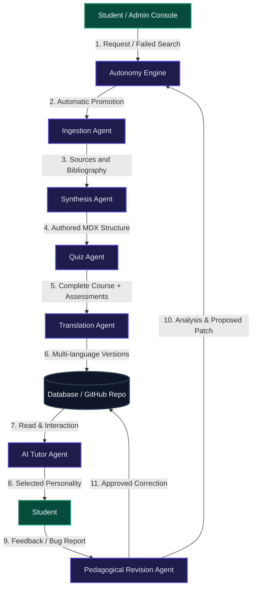
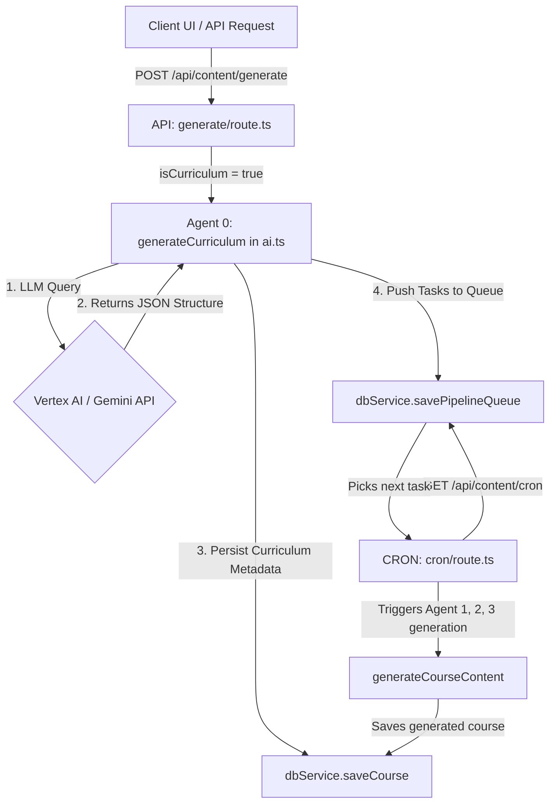

# 🏛️ OpenPrimer Master Technical Architecture
## Deep-Dive System Design, Multi-Agent AI Ecosystem & Self-Healing GitOps

This document details the software infrastructure, database-decoupled local-first synchronization pipelines, multi-agent AI framework, and cryptographic self-healing governance systems that power the **OpenPrimer** academic repository.

---

## 1. Global Architectural Blueprint

OpenPrimer utilizes a hybrid decoupled system. The public GitHub repository serves as a permanent version-controlled source of truth for course syllabi (in MDX formats), while the Supabase PostgreSQL database acts as the high-availability state machine for active student sessions, analytics, and metadata.

```
   ┌────────────────────────────────────────────────────────┐
   │                PUBLIC GITHUB REPOSITORY                │
   │            (/content folder, .mdx format)             │
   └───────────────▲────────────────────────▲───────────────┘
                   │                        │
       [Step A: REST API (PUT/DEL)]         │ [Step B: Webhook PUSH]
                   │                        │
   ┌───────────────┴────────────────────────┴───────────────┐
   │               NEXT.JS WEB APPLICATION                  │
   │           (Hosted on Vercel, Free Tier)                │
   └───────────────┬────────────────────────────────────────┘
                   │
                   ▼
   ┌────────────────────────────────────────────────────────┐
   │            SUPABASE & CLOUDFLARE R2 BUCKET             │
   │      (Relational metadata & Object R2 Storage)         │
   └────────────────────────────────────────────────────────┘
```

---

## 2. Dynamic Content Factory & Multi-Agent AI Ecosystem

OpenPrimer deploys a coordinated team of autonomous AI agents designed to handle course generation, translation, correction, and student tutoring under coordinated pipelines.



### Precise Roles of AI Agents & In-Engine Flow (0 to 4)
OpenPrimer structures the course generation pipeline into a strictly ordered, decoupled chain of 5 dedicated autonomous agents:

1.  **🎓 Agent 0 (Curriculum Architect / Planner):** 
    *   **Scope & Input**: Triggered when initiating a new major pathway (with `isCurriculum: true`). Takes the curriculum title and level (e.g., `L1 Philosophy`) and target language.
    *   **Operation**: Queries the model to generate a rich, cohesive curriculum map containing modules, titles, Descriptions, volume (hrs), subjects, and mandatory/optional status.
    *   **Output**: Immediately saves the parent curriculum metadata and bulk-inserts individual lesson-generation tasks into the `task_queue` database table to be picked up by the background worker.

2.  **📋 Agent 1 & 2 (Course & Pedagogical Planner):**
    *   **Scope & Input**: Triggered per-course during CRON task processing. Takes the course name, academic level, and target language.
    *   **Operation**: Evaluates the discipline against our cognitive matrix (Deductive, Empirical, Discursive, or Engineering) and student age groups (CP-CM2 to University L3). 
    *   **Output**: Synthesizes a structured JSON blueprint specifying:
        *   An ordered list of lessons.
        *   All lesson widgets / pre-requisites (`prerequisites`, `diagnosticQuiz`, `learningObjectives`, `finalEvaluation`, `glossary`, `whatsNext`).
        *   A list of highly curated **scholarly bibliographies/references** (verified against Crossref and Google Books).
        *   Active learning interactive components matching the discipline (e.g., `<FunctionPlotter />` for math/physics, `<CodeSandbox />` for CS, `<Mermaid />` flowcharts for history, `<StructureViewer3D />` for biology/chemistry).

3.  **✍️ Agent 3 (Academic Writer):**
    *   **Scope & Input**: Takes the lesson title, level, target language, and the Agent 1 & 2 pre-generated widgets and references.
    *   **Operation**: Drafts the complete, dense, high-academic-density narrative text. Operates strictly under Socratic & Feynman heuristics to simplify concepts into clear language.
    *   **Formatting Rules**:
        *   MUST integrate the pre-generated widget anchors exactly once using the bracketed string syntax: `[[WIDGET:prerequisites]]`, `[[WIDGET:diagnosticQuiz]]`, etc.
        *   MUST cite the pre-generated bibliography references inline inside the narrative using standard markdown link syntax (e.g. `[1](#ref-1)`, `[2](#ref-2)`), placed right next to facts or claims.

4.  **🔍 Agent 4 (Verifier/Critic Agent):**
    *   **Scope & Input**: Operates as a strict quality gate, reviewing the compiled course draft before persistence.
    *   **Operation**: Evaluates the draft against our multi-checkpoint verification checklist (Zero-Placeholder, Academic Density, Structural Completeness, Multimedia Density, Assessment Integrity, existing artwork checks).
    *   **Critic Relaxation (Unused References)**: Crucially, Agent 4 **never** rejects a lesson draft (approved remains `true`) under the pretext that a pre-generated reference was not cited inline, as unused references are handled automatically post-critique.
    *   **Feedback Loop**: If checks fail, Agent 4 returns a critique, looping back to Agent 3 (Academic Writer) to expand or correct (maximum of 3 attempts).

---

### Programmatic Post-Processing & Stitching Layer
Once the Verifier/Critic Agent (Agent 4) approves the drafted narrative text, the system bypasses the LLM and runs a programmatic, deterministic **Stitching Layer** (`stitchLessonContent` in `web/src/lib/ai.ts`) to merge the narrative and pre-generated widgets:

```mermaid
graph TD
    Narrative[Agent 3 Narrative Text] --> Stitch[Stitching Layer: stitchLessonContent]
    Widgets[Agent 1 & 2 Widget JSON] --> Stitch
    Stitch --> Scan[Scan inline citations via getCitedReferenceNumbers]
    
    Scan -->|Cited Items| Cited[Format under '### Références' with [X] standard numbers]
    Scan -->|Unused Items| Uncited[Format under '#### Lectures complémentaires' as plain, unnumbered bullets]
    
    Cited --> Final[Complete MDX Page persisted to DB]
    Uncited --> Final
```

1.  **Widget Injections**: The bracketed widget anchors (e.g. `[[WIDGET:prerequisites]]`) inside the narrative are replaced by fully rendered React elements populated with the structured JSON data.
2.  **References Parsing & Footnoting**:
    *   The stitcher scans the narrative using a regex-based helper `getCitedReferenceNumbers` to identify which references were actually cited inline (`[X](#ref-X)`).
    *   **Cited References**: Placed under the primary `### Références` (or `### References`) heading. They maintain standard brackets (`[1]`, `[2]`), which our interactive compiler on the frontend transforms into beautiful, clickable bottom-of-the-page footnotes with automatic scroll-jump back-links.
    *   **Unused References**: Programmatically and silently demoted. They are formatted as **plain, unnumbered bullet points** and grouped under `#### Lectures complémentaires` (or `#### Further Reading`), without brackets, link highlights, or jump links, representing supplemental reading.
    *   **Zero-Citations Fallback**: If zero references were cited, all references are listed under the main `### Références` heading as plain, unnumbered bullets, ensuring no broken interactive link anchors can ever render.

---

### Media Discovery, Wikimedia Commons, & Zero-AI-Fallback Policy
To maintain absolute academic, scientific, and factual accuracy, OpenPrimer enforces a strict visual asset discovery and rendering policy:

1.  **Strict "No Fallback to AI" Policy**:
    *   Using AI image generation (`generate_image` or external Pollinations API) is **STRICTLY PROHIBITED** for all factual, scientific, and historical assets (such as molecular structures, chemical reactions, physical models, maps, country flags, monuments, and historical portraits/paintings).
    *   If a genuine, legal, copyright-free image is not available from our database or public sources, **do not display any image** and **do not attempt to generate an AI fallback**. Simply omit the image entirely.

2.  **Wikimedia Commons & Wikipedia Search Strategy**:
    *   The `media-resolver.ts` engine uses a multi-step, robust image resolver (`fetchWikipediaImage`):
        *   **Step A (Wikimedia Commons Search)**: Queries the Wikimedia Commons search API (media namespace 6) with the asset name. If a direct high-quality `.jpg`, `.png`, or `.svg` is found, it is resolved immediately.
        *   **Step B (Wikipedia Page Search)**: If direct search fails, it fallbacks to a fuzzy page query against the localized Wikipedia Search API.
        *   **Step C (Wikipedia Original Image Fetch)**: Retrieves the primary original source image of the matched page.
        *   **Step D (English Wiki Fallback)**: If localized searches fail, it runs the query against the English Wikipedia API as a final fallback.
    *   Factual images are classified automatically via `isFactualMedia` to prevent utilizing generic decorative images for academic/scientific concepts.

---

### YouTube Video Scraping vs. Official API
Rather than using the official *YouTube Data API v3*, OpenPrimer implements a custom, highly reliable, recursive scrape and parse engine (`searchYouTubeVideo` in `web/src/lib/media-resolver.ts` and `ai.ts`):

#### Why do we avoid the official YouTube Data API?
*   **Quota Limits**: The YouTube Data API v3 enforces a default daily limit of **10,000 units**. A single search query costs **100 units**, meaning a server is capped at just **100 video searches per day** across all users. For a collaborative academic engine generating full courses, this quota is exhausted in minutes.
*   **API Key Friction**: The official API requires each local developer to register a Google Cloud Console project, configure OAuth/API credentials, and maintain API keys. This introduces significant setup friction.
*   **Decoupled & Unlimited**: Scraping the public YouTube search results directly requires **zero API keys/registration** and has **zero quota limits**, enabling unlimited academic video enrichment out of the box.

#### How does our search YouTube scraping work?
1.  **Request & User-Agent**: Performs a fast HTTP GET request to `https://www.youtube.com/results?search_query=[Query]` mimicking a modern web browser.
2.  **`ytInitialData` Extraction**: Extracts the client-side JavaScript initialization object `ytInitialData = {...}` embedded in the HTML response. If the simple regex fails, a brace-matching recursive parser extracts the exact JSON substring.
3.  **Recursive Renderer Parser (`findRenderers`)**: Recursively traverses the parsed object to locate all `videoRenderer` nodes. It extracts the `videoId`, `title`, and approximates the `viewCount` text (handling international abbreviations like `k` for thousands, `m` for millions).
4.  **Popularity Sorting & Validation**:
    *   Takes the top 5 results, sorts them by `viewCount` descending (ensuring the most popular, high-quality, and active educational content is selected).
    *   Calls a fast, lightweight validation probe (`validateYouTubeVideo` calling `oembed`) to ensure the selected video ID exists, is public, and is not a dead link or template placeholder.

---

### Detailed Curriculum Ingestion Workflow (Agent 0 & Queue Scheduler)

The initiation of academic pathways is orchestrated in a decoupled, queue-centric model to prevent request timeouts and support large-scale program generation.



#### Detailed Workflow:
1. **Trigger & Initiation**: When a user or system event triggers curriculum generation via the client app or API endpoint `POST /api/content/generate` (with payload `isCurriculum: true`), `generateCurriculum` runs.
2. **Pathways Planning**: Agent 0 queries the configured AI provider (Vertex AI with Google AI Studio fallback) using the curriculum name, academic level (e.g., `L1`), and target language. It receives a JSON outline listing constituent courses, descriptions, subjects, mandatory/optional status, and credit hours.
3. **Curriculum Metadata Persistence**: The parent curriculum is immediately registered in the database (`courses` table) with the `is_curriculum` flag set to `true` and `child_courses` initially empty.
4. **Queue Enqueueing & UUID Resolution**: The child courses parsed from Agent 0's response are mapped to individual generation tasks (`type: 'generation'`) and added to the database's `task_queue` table. To avoid `23502` NULL constraint failures on the `id` column in PostgreSQL, the `savePipelineQueue` method inside `supabase-provider.ts` automatically generates custom UUIDs for any incoming task objects lacking a unique primary key before running bulk inserts.
5. **CRON Processing Loop**: The background scheduler (`GET /api/content/cron`) queries the `task_queue` table, sorts pending tasks by priority, locks the next available task (changing status to `running`), and triggers the downstream course generation engine (Agents 1, 2, and 3) to compile the rich MDX content. A **SQL concurrency gate** in `claim_next_task()` enforces the maximum number of simultaneously running workers (configurable via `maxConcurrentWorkers` in `system_parameters`, default: 2).
6. **Rate-Limited Vertex AI Calls**: All Vertex AI calls pass through a **token-bucket rate limiter** (default: 8 RPM) and an **inter-lesson throttle delay** (default: 5 s between lessons) to stay within API quotas. See [`docs/RATE_LIMITING.md`](./RATE_LIMITING.md) for full configuration details.
7. **MDX Validation & Bibliography Alignment**: During synthesis, the generator performs a Crossref and Google Books API verification on bibliography references to de-hallucinate scholarly links and replace them with real DOIs. The generated lesson is also checked for MDX compilation readiness using `next-mdx-remote/serialize`. If parsing fails, a dynamic `sanitizeMdxFallback` procedure runs to escape unclosed custom React tags or braces before final DB persistence.
8. **Automated Child-Course Association (Post-Completion Hook)**: Upon successful completion of a child-course generation task, the CRON handler reads the `parentCurriculumSlug` field embedded in the task's `description` JSON payload. It then resolves the parent curriculum's `id` from the `courses` table by matching the slug, and atomically appends the newly-generated child course's `id` to the parent's `child_courses` integer array via `dbService.saveCourse`. This ensures the student curriculum dashboard can always resolve and drill down into the enrolled curriculum's constituent modules without manual data entry.

#### Environment Variables Hoisting Guard
To support direct command-line script execution (e.g. `npx tsx scripts/run_agent_zero.ts` or diagnostic queries) without Next.js Webpack wrapping, we implement a dedicated environment pre-loader script (`scripts/env-loader.ts`). This script is imported at the absolute entry point of any standalone runner script. It parses and exposes variables from `.env.local` before the main ES6 import hoisting can trigger early, unconfigured database client instantiation.

#### CLI Maintenance & Repair Scripts

Because Vercel serverless functions enforce a strict execution timeout ceiling that makes it unreliable to run long background pipelines end-to-end, the following dedicated CLI scripts live under `web/scripts/` and are designed to be executed locally (or from a long-running machine) to maintain and repair the curriculum pipeline:

| Script | Command | Purpose |
|---|---|---|
| `process_tasks.ts` | `npx tsx scripts/process_tasks.ts` | Pulls all `queued` tasks from `task_queue`, processes them sequentially, and writes the generated course content plus child-course association to the database. Bypasses HTTP timeout limits entirely. |
| `fix_child_courses.ts` | `npx tsx scripts/fix_child_courses.ts` | Scans all `completed` tasks that carry a `parentCurriculumSlug` payload and retroactively populates the `child_courses` array on their parent curricula. Use this as a repair tool if the automated hook in the CRON handler missed any associations due to server restarts or transient errors. |

**Prerequisite:** Ensure `.env.local` is populated and run `npm run env-loader` (or prefix with `import './scripts/env-loader'`) before executing any script that uses Supabase credentials.


---

## 3. Sovereign Hybrid Authoring & Sync Scripts

Developers and content creators can work offline locally in their favorite editor using file-based markdown. We provide synchronization scripts inside the `web/` workspace to bridge the local directory with Supabase:

### A. Publishing Local MDX Files to Supabase
```bash
cd web
npm run db:import-mdx
```
Traverses `/content`, extracts metadata using `gray-matter`, and upserts each file into the PostgreSQL `lessons` table (`ON CONFLICT DO UPDATE`).

### B. Exporting Production Lessons to Local MDX Files
```bash
cd web
npm run db:export-mdx
```
Queries the `lessons` table and reconstructs the correct nested hierarchy in `/content/[level]/[subject]/[courseSlug]/[lessonSlug].[lang].mdx`.

### C. Large Seed Files Security (Git LFS)
To prevent repository bloating from raw PostgreSQL backup scripts, the repository's `.gitattributes` tracks database seeds via **Git LFS (Large File Storage)**:
```ini
web/src/lib/supabase_seed.sql filter=lfs diff=lfs merge=lfs -text
*.sql filter=lfs diff=lfs merge=lfs -text
```

---

## 4. Webhook Sync, Cryptographic Guardrails & Self-Healing

When files are committed directly to GitHub, a real-time webhook pipeline processes the change, runs AI validation checks, and automatically heals the repository if malicious or broken code is detected.

```
[Push Event on GitHub]
          │
          ▼
[POST /api/webhooks/github-sync] (Validates HMAC SHA-256 Signature)
          │
          ▼
[validatePedagogicalContent (Guardrail Checks)]
          │
      ┌───┴───────────────────────┐
      ▼ (Non-Conforming)          ▼ (Approved Content)
[AI Refusal & Self-Healing]    [Sync Database & Bump Course Version]
      │                                   │
      ├─> Log to refused_revisions        └─> Upsert Lesson to Supabase
      │                                       Increment course version (+1)
      └─> Revert Commit to GitHub
          (Restaure last valid file)
```

### A. HMAC SHA-256 Webhook Verification
The Next.js API route `/api/webhooks/github-sync` enforces strict signature matching using a secret shared key (`GITHUB_WEBHOOK_SECRET`). Unauthorized attempts receive a `401 Unauthorized` response immediately.

### B. The Anti-Sabotage Validation Guardrail
The pedagogical validation engine performs the following heuristic checks:
*   **Truncation Guard:** Rejects files containing under 150 characters to prevent content erasure.
*   **Structure Guard:** Parses frontmatter metadata to block corrupted files.
*   **Malicious Injections:** Scans for forbidden patterns (`<script`, `eval(`, etc.) or dummy placeholders ("Lorem Ipsum").

### C. Self-Healing Active Protection
If a push contains malicious revisions, the engine **cancels database updates**, logs a high-priority report in `refused_revisions`, and triggers an immediate **Corrective Counter-Commit** on GitHub:
*   *For existing files:* Overwrites the corrupted commit on GitHub with the clean validated content stored in Supabase.
*   *For unverified new files:* Commits a deletion to instantly purge the file from the main branch.

---

## 🧱 Project Directory Tree

```
OpenPrimer/
├── docs/             # Consolidated master technical manuals
│   ├── ARCHITECTURE.md  # Core Architecture, Agents, & GitOps Sync
│   ├── SETUP_GUIDE.md   # Deployment, Environment, R2 & Mobile config
│   ├── PEDAGOGY.md      # Syllabus Metrics, Socratic & Feynman design
│   ├── OPERATIONS.md    # Operations, Cost management & Contributing
│   └── RATE_LIMITING.md # Vertex AI quota, token bucket & concurrency config
├── content/          # Local MDX template files for authors
├── generator/        # Ingestion & Synthesis core generators (Python)
├── mobile/           # Mobile app client (React Native / Flutter)
└── web/              # Primary Next.js Application Core
    ├── scripts/      # CLI maintenance & repair utilities
    │   ├── env-loader.ts        # .env.local pre-loader for standalone scripts
    │   ├── process_tasks.ts     # Sequential task queue processor (CLI)
    │   ├── fix_child_courses.ts # Retroactive child-course association repair
    │   └── alter_profiles.ts    # Database migration (profiles accessibility cols)
    ├── src/
    │   ├── app/                 # Next.js App Router pages & API routes
    │   │   └── api/content/cron/route.ts  # Background CRON with auto-association hook
    │   ├── lib/
    │   │   ├── db.ts            # Unified dbService facade (mock + Supabase)
    │   │   ├── db/supabase-provider.ts    # Supabase implementation
    │   │   └── supabase_schema.sql        # Canonical PostgreSQL schema
    │   └── components/          # Shared React UI components
    └── public/                  # Static assets
```

---

## 5. Database Schema Notes

### `courses` Table — Curriculum Linkage
The `child_courses` column (`INTEGER[]`) on the `courses` table is the authoritative source for parent-child curriculum relationships:
- Parent curricula have `is_curriculum = true` and a non-empty `child_courses` array.
- Child course IDs are appended atomically by the CRON association hook (step 7) or retroactively by `fix_child_courses.ts`.
- The student curriculum dashboard (`/profile/curriculum`) reads this array to resolve and render drill-down module cards.

### `profiles` Table — Accessibility Preferences
The following columns were added via `scripts/alter_profiles.ts` migration (June 2026) to persist per-user accessibility state server-side:

| Column | Type | Default | Purpose |
|---|---|---|---|
| `reduce_motion` | BOOLEAN | `false` | Disables UI animations |
| `dyslexia_friendly` | BOOLEAN | `false` | Switches to dyslexia-optimized font |
| `fine_visual_controls` | BOOLEAN | `false` | Enlarges academic text baseline |
| `tutor_enabled` | BOOLEAN | `true` | Shows/hides floating AI tutor icon |
| `colorblind_theme` | VARCHAR(100) | `'none'` | Applies CSS color-correction filter |

These are synced in real-time from the `/profile/settings` page via the `syncAccessibilityToCloud()` helper, which writes directly to the `profiles` table using the Supabase JS client.

---

## 6. Internationalization (i18n) Architecture

OpenPrimer implements a **two-tier localization system** that cleanly separates compile-time static dictionaries from runtime dynamic translations.

### Supported Locales

| Code | Language | Script | Direction | Detection Method |
|------|----------|--------|-----------|-----------------|
| `EN` | English | Latin | LTR | Default fallback |
| `FR` | French | Latin | LTR | Browser locale / IP (FR, MC, GP…) |
| `ES` | Spanish | Latin | LTR | Browser locale / IP (ES, MX, CO…) |
| `DE` | German | Latin | LTR | Browser locale / IP (DE, AT, CH, LI) |
| `ZH` | Chinese | CJK | LTR | Browser locale / IP (CN, TW, HK) |
| `PT` | Portuguese | Latin | LTR | Browser locale / IP (PT, BR, AO…) |
| `AR` | Arabic | Arabic | **RTL** | Browser locale / IP (SA, EG, DZ…) |
| `HI` | Hindi | Devanagari | LTR | Browser locale / IP (IN) |
| `UR` | Urdu | Nastaliq | **RTL** | Browser locale / IP (PK) |

### Tier 1 — Static Compiled Dictionaries

Statically bundled into the JavaScript client at build time. No network round-trip required.

*   **Source files:**
    -   `web/src/app/admin/curriculum/strings.ts` — Master dictionary for the Admin Curriculum Control Center (`CURRICULUM_STRINGS`, `COCKPIT_DICTIONARY`, `LOCALIZED_POPUPS`, `EXTRA_TOOLTIP_STRINGS`).
    -   `web/src/lib/translations.ts` — Shared global UI dictionary (`DYNAMIC_UI_STRINGS`, `ADMIN_STRINGS`, academic level & discipline label helpers).
*   **Scope:** EN, FR, ES, DE, ZH are always statically available. PT, AR, HI, UR are also statically embedded in the Admin dashboard dictionaries.
*   **Fallback rule:** All dictionary lookups use `dict[lang] || dict.EN` — if a key is missing in a locale, it silently degrades to English. This prevents placeholder UI errors.

### Tier 2 — Dynamic DB-Fetched Translations

For languages beyond the five static ones, a lazy-loading mechanism fetches translations at runtime.

*   **Trigger:** `LanguageContext.tsx` — when the active language changes to a non-static code, it fires `GET /api/translate/ui?lang={code}`.
*   **Storage:** Responses are written to the in-memory `DYNAMIC_UI_STRINGS[langCode]` map and cached for the session.
*   **Academic metadata:** `translateMetadataForLanguage()` in `strings.ts` dynamically translates academic levels, disciplines, Socratic game labels, and philosophical quotes via the Google Translate API and caches results in `localStorage`.

### RTL Layout Support

Arabic (`AR`) and Urdu (`UR`) trigger automatic RTL layout switching:

```typescript
// LanguageContext.tsx — applied on every language change
const isRtl = ['AR', 'UR'].includes(language.toUpperCase());
document.documentElement.dir = isRtl ? 'rtl' : 'ltr';
document.documentElement.lang = language.toLowerCase();
```

This propagates to all CSS `dir`-aware properties (`margin-inline-start`, `text-align`, flexbox) without requiring component-level changes.

### Language Auto-Detection (Two-Layer Engine)

1.  **Layer 1 (Synchronous):** Reads `navigator.language`, extracts the ISO 639-1 code, and sets the UI language instantly if it matches a supported locale.
2.  **Layer 2 (Async — IP Geolocation):** Calls `https://ipapi.co/json/` to refine the detected language based on country code — particularly useful for disambiguating browser locale vs. user geography (e.g., a French speaker in Brazil who should get PT).

Priority order: `op_user_profile.preferredLang` → `localStorage.openprimer_lang` → cookie → IP geolocation → browser locale → `EN`.

### Zero-Placeholder Parity Rule

A strict **zero-placeholder constraint** is enforced across all admin dictionaries: every string key present in the EN block must have a corresponding entry in every other language block. When adding new UI labels, always update **all** language blocks simultaneously. The `COCKPIT_DICTIONARY` (large, ~300 keys) falls back gracefully to EN for PT/AR/HI/UR where dynamic content labels are not yet fully translated.
