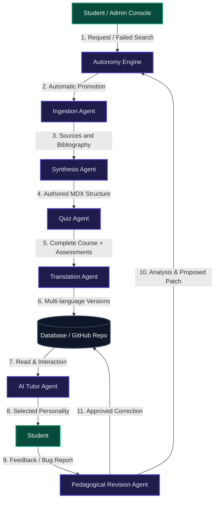

# 🏛️ OpenPrimer Master Technical Architecture
## Deep-Dive System Design, Multi-Agent AI Ecosystem & Self-Healing GitOps

This document details the software infrastructure, database-decoupled local-first synchronization pipelines, multi-agent AI framework, and cryptographic self-healing governance systems that power the **OpenPrimer** academic repository.

---

## 1. Global Architectural Blueprint

OpenPrimer utilizes a hybrid decoupled system. The public GitHub repository serves as a permanent version-controlled source of truth for course syllabi (in MDX formats), while the Supabase PostgreSQL database acts as the high-availability state machine for active student sessions, analytics, and metadata.

```
   ┌────────────────────────────────────────────────────────┐
   │                PUBLIC GITHUB REPOSITORY                │
   │            (/content folder, .mdx format)             │
   └───────────────▲────────────────────────▲───────────────┘
                   │                        │
       [Step A: REST API (PUT/DEL)]         │ [Step B: Webhook PUSH]
                   │                        │
   ┌───────────────┴────────────────────────┴───────────────┐
   │               NEXT.JS WEB APPLICATION                  │
   │           (Hosted on Vercel, Free Tier)                │
   └───────────────┬────────────────────────────────────────┘
                   │
                   ▼
   ┌────────────────────────────────────────────────────────┐
   │            SUPABASE & CLOUDFLARE R2 BUCKET             │
   │      (Relational metadata & Object R2 Storage)         │
   └────────────────────────────────────────────────────────┘
```

---

## 2. Dynamic Content Factory & Multi-Agent AI Ecosystem

OpenPrimer deploys a coordinated team of autonomous AI agents designed to handle course generation, translation, correction, and student tutoring under LangChain-orchestrated pipelines.



### Precise Roles of AI Agents
1.  **🎓 Agent 0 (Curriculum Planner / Architect):** Structures complete curriculum pathways (defining modules, subject, volume, credit weights, mandatory vs elective status, and master/course descriptions) by learning from real-world online curricula.
2.  **📋 Agent 1 & 2 (Course & Pedagogical Planner):** Profiles the target discipline according to its cognitive matrix (Deductive, Empirical, Discursive, or Engineering) and adapts the chapter outline to the student's age group (CP-CM2 to L3). Outputs a structured JSON blueprint specifying cognitive artifacts and technical depth guidelines for each lesson.
3.  **✍️ Agent 3 (Academic Writer):** Generates dense, comprehensive, professional MDX course content with LaTeX, component blocks (`<Prerequisites>`, `<DiagnosticQuiz>`, `<Epistemology>`, `<Quiz>`), respecting Socratic/Feynman heuristics and strict anti-placeholder constraints.
4.  **🔍 Agent 4 (Verifier/Critic):** Quality gate agent checking the generated MDX content for zero-placeholder and academic density compliance. Employs a revision feedback loop (max 3 cycles) to correct and refine sections before persistence.
5.  **💬 Interactive Socratic Tutor Agent:** Powers the student's conversation sidebar. Adjusts prompt personas (Socratic, Direct, Gamified) dynamically depending on the user's focus mode, guiding rather than giving answers.
6.  **🌐 Translation Agent:** Multi-lingual translator localizing course MDX payloads into **FR**, **ES**, **DE**, and **ZH** without altering mathematical LaTeX markup or React code blocks.
7.  **⚖️ Autonomy Engine:** Runs threshold-based logic over failed searches. If a missing discipline accumulates enough requests, the engine initiates automatic queue generation without human oversight.

---

## 3. Sovereign Hybrid Authoring & Sync Scripts

Developers and content creators can work offline locally in their favorite editor using file-based markdown. We provide synchronization scripts inside the `web/` workspace to bridge the local directory with Supabase:

### A. Publishing Local MDX Files to Supabase
```bash
cd web
npm run db:import-mdx
```
Traverses `/content`, extracts metadata using `gray-matter`, and upserts each file into the PostgreSQL `lessons` table (`ON CONFLICT DO UPDATE`).

### B. Exporting Production Lessons to Local MDX Files
```bash
cd web
npm run db:export-mdx
```
Queries the `lessons` table and reconstructs the correct nested hierarchy in `/content/[level]/[subject]/[courseSlug]/[lessonSlug].[lang].mdx`.

### C. Large Seed Files Security (Git LFS)
To prevent repository bloating from raw PostgreSQL backup scripts, the repository's `.gitattributes` tracks database seeds via **Git LFS (Large File Storage)**:
```ini
web/src/lib/supabase_seed.sql filter=lfs diff=lfs merge=lfs -text
*.sql filter=lfs diff=lfs merge=lfs -text
```

---

## 4. Webhook Sync, Cryptographic Guardrails & Self-Healing

When files are committed directly to GitHub, a real-time webhook pipeline processes the change, runs AI validation checks, and automatically heals the repository if malicious or broken code is detected.

```
[Push Event on GitHub]
          │
          ▼
[POST /api/webhooks/github-sync] (Validates HMAC SHA-256 Signature)
          │
          ▼
[validatePedagogicalContent (Guardrail Checks)]
          │
      ┌───┴───────────────────────┐
      ▼ (Non-Conforming)          ▼ (Approved Content)
[AI Refusal & Self-Healing]    [Sync Database & Bump Course Version]
      │                                   │
      ├─> Log to refused_revisions        └─> Upsert Lesson to Supabase
      │                                       Increment course version (+1)
      └─> Revert Commit to GitHub
          (Restaure last valid file)
```

### A. HMAC SHA-256 Webhook Verification
The Next.js API route `/api/webhooks/github-sync` enforces strict signature matching using a secret shared key (`GITHUB_WEBHOOK_SECRET`). Unauthorized attempts receive a `401 Unauthorized` response immediately.

### B. The Anti-Sabotage Validation Guardrail
The pedagogical validation engine performs the following heuristic checks:
*   **Truncation Guard:** Rejects files containing under 150 characters to prevent content erasure.
*   **Structure Guard:** Parses frontmatter metadata to block corrupted files.
*   **Malicious Injections:** Scans for forbidden patterns (`<script`, `eval(`, etc.) or dummy placeholders ("Lorem Ipsum").

### C. Self-Healing Active Protection
If a push contains malicious revisions, the engine **cancels database updates**, logs a high-priority report in `refused_revisions`, and triggers an immediate **Corrective Counter-Commit** on GitHub:
*   *For existing files:* Overwrites the corrupted commit on GitHub with the clean validated content stored in Supabase.
*   *For unverified new files:* Commits a deletion to instantly purge the file from the main branch.

---

## 🧱 Project Directory Tree

```
OpenPrimer/
├── docs/             # Consolidated master technical manuals
│   ├── ARCHITECTURE.md  # Core Architecture, Agents, & GitOps Sync
│   ├── SETUP_GUIDE.md   # Deployment, Environment, R2 & Mobile config
│   ├── PEDAGOGY.md      # Syllabus Metrics, Socratic & Feynman design
│   └── OPERATIONS.md    # Operations, Cost management & Contributing
├── content/          # Local MDX template files for authors
├── generator/        # Ingestion & Synthesis core generators (Python)
├── mobile/           # Mobile app client (React Native / Flutter)
└── web/              # Primary Next.js Application Core
```
