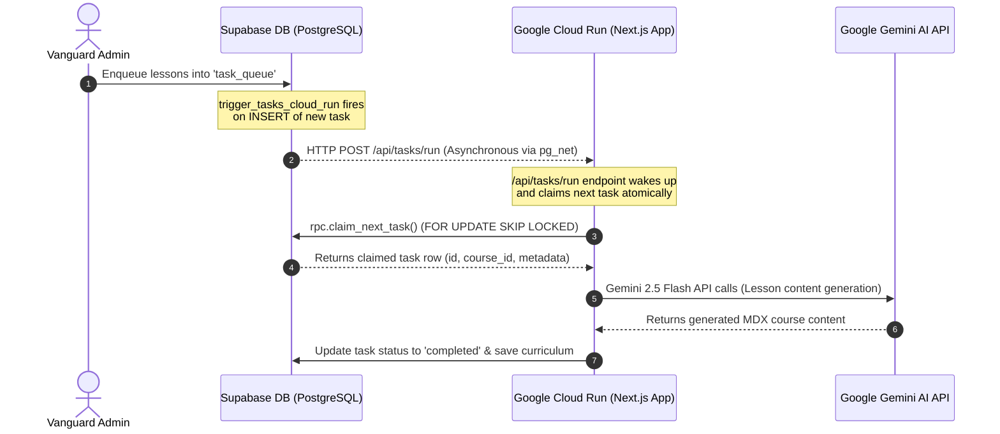

# ☁️ Google Cloud Run Serverless Task processing Deployment Guide (Scenario 2)

This guide documents the architecture, configuration, deployment, and automation of the **Serverless Task Worker** on **Google Cloud Run** for **OpenPrimer**. 

This system allows fully automated, concurrency-safe, and highly-scalable background execution of humanities course lesson generation tasks.

---

## 🏗️ Architecture Overview

The system runs completely asynchronously and automatically through database events:



### Key Architectural Safeguards:
1. **Concurrency Lock (`claim_next_task`)**: To prevent two worker instances or API requests from processing the same task, the database uses a PostgreSQL Row-Level Locking function `claim_next_task()`. It selects the next pending task using `FOR UPDATE SKIP LOCKED` and sets its status to `processing` in a single atomic transaction.
2. **Defensive Webhook Trigger**: The trigger `trigger_tasks_cloud_run` on the `task_queue` table uses the Supabase asynchronous `pg_net` extension (`http_post()`). If `pg_net` is not installed or available (e.g., in local testing/sandbox), the trigger safely degrades without crashing.
3. **API Key Security**: The Cloud Run worker endpoint (`/api/tasks/run`) is gated by a shared secret (`CRON_SECRET` or `cronSecret` in `system_parameters`) passed in the `Authorization: Bearer <secret>` header to prevent unauthorized callers from triggering generations.

---

## 🛠️ Step 1: Local Environment Validation

Ensure you have the Google Cloud SDK (`gcloud`) and Docker installed on your development machine, and you are authenticated correctly.

1. **Verify your active GCP account**:
   ```powershell
   gcloud auth list
   ```
   *Verify that your active account (e.g. `silvere.martinmichiellot@gmail.com`) is highlighted with an asterisk.*

2. **Verify active GCP project**:
   We will deploy to your active project **`antigravity-498615`** (Credits project).
   Set your CLI context:
   ```powershell
   gcloud config set project antigravity-498615
   ```

3. **Enable GCP APIs**:
   Ensure Cloud Run, Cloud Build, and Artifact Registry are enabled:
   ```powershell
   gcloud services enable run.googleapis.com cloudbuild.googleapis.com artifactregistry.googleapis.com --project=antigravity-498615
   ```

---

## 📦 Step 2: Set Up Artifact Registry Repository

Before building the container, create a Docker repository inside Google Artifact Registry to store your built production images.

Run the following command to create a repository named `openprimer-repo` in your preferred region (e.g., `us-central1` or `europe-west9`):

```powershell
gcloud artifacts repositories create openprimer-repo `
    --repository-format=docker `
    --location=europe-west9 `
    --description="Docker repository for OpenPrimer Web App" `
    --project=antigravity-498615
```

---

## 🏗️ Step 3: Remote Build using Cloud Build

Since Next.js requires compiling and packing, Google Cloud Build provides a highly efficient remote build system without needing Docker running locally on your machine.

We have provided a Dockerfile in `web/Dockerfile` that builds and compiles the Next.js production build. To trigger a remote build and push the container to your registry, run from the `web` folder:

```powershell
gcloud builds submit --tag europe-west9-docker.pkg.dev/antigravity-498615/openprimer-repo/web-app:latest --project=antigravity-498615
```

---

## 🚀 Step 4: Deploying to Google Cloud Run

Once the container image is built and pushed to Artifact Registry, deploy it directly to Google Cloud Run as a serverless container service.

```powershell
gcloud run deploy openprimer-worker `
    --image=europe-west9-docker.pkg.dev/antigravity-498615/openprimer-repo/web-app:latest `
    --platform=managed `
    --region=europe-west9 `
    --allow-unauthenticated `
    --port=3000 `
    --set-env-vars="NEXT_PUBLIC_SUPABASE_URL=https://cayylzaasyqqpvuezufy.supabase.co,CRON_SECRET=MySuperSecretCronSecret123!" `
    --set-secrets="SUPABASE_SERVICE_ROLE_KEY=SUPABASE_SERVICE_ROLE_KEY:latest,GEMINI_API_KEY=GEMINI_API_KEY:latest" `
    --project=antigravity-498615
```

> [!NOTE]
> * **Secrets Integration**: The `--set-secrets` parameter binds production secrets directly from Google Secret Manager (`Secret Manager API` must be enabled). Alternatively, for initial deployment simplicity, you can pass them as standard environment variables using `--set-env-vars` (e.g., `--set-env-vars="...,SUPABASE_SERVICE_ROLE_KEY=ey...,GEMINI_API_KEY=AI..."`).

---

## 🔗 Step 5: Connecting Supabase to Cloud Run

After successful deployment, Google Cloud Run will output a Service URL (e.g., `https://openprimer-worker-xxxxx-ew.a.run.app`). 

To activate the automatic trigger loop, you must register this service URL and your secret inside Supabase's parameters.

1. Navigate to **SQL Editor** in your Supabase Dashboard.
2. Insert or update the configuration inside the `system_parameters` table:
   ```sql
   -- Register the Cloud Run API worker endpoint URL
   INSERT INTO system_parameters (key, value)
   VALUES ('cloudRunUrl', 'https://openprimer-worker-xxxxx-ew.a.run.app/api/tasks/run')
   ON CONFLICT (key) DO UPDATE SET value = EXCLUDED.value;

   -- Register the security gate bearer token
   INSERT INTO system_parameters (key, value)
   VALUES ('cronSecret', 'MySuperSecretCronSecret123!')
   ON CONFLICT (key) DO UPDATE SET value = EXCLUDED.value;
   ```

Now, any time a task is created or enqueued inside Supabase, the database webhook trigger will wake up your Cloud Run worker asynchronously to complete generation!

---

## 🔄 Step 6: Automated GitHub Continuous Deployment (CI/CD)

To fully automate deployments so that pushing to `master` automatically updates Cloud Run:

1. Under your GitHub Repository > **Settings** > **Secrets and variables** > **Actions**, create a new secret named `GCP_SA_KEY` containing a GCP Service Account JSON key with Cloud Build Editor, Cloud Run Developer, and Service Account User roles.
2. Create `.github/workflows/deploy-gcp.yml` in your codebase:
   ```yaml
   name: Deploy to Google Cloud Run

   on:
     push:
       branches:
         - master

   jobs:
     deploy:
       runs-on: ubuntu-latest
       steps:
         - name: Checkout Code
           uses: actions/checkout@v3

         - name: Authenticate to GCP
           uses: google-github-actions/auth@v1
           with:
             credentials_json: ${{ secrets.GCP_SA_KEY }}

         - name: Set up Cloud SDK
           uses: google-github-actions/setup-gcloud@v1

         - name: Configure Docker for Artifact Registry
           run: |
             gcloud auth configure-docker europe-west9-docker.pkg.dev --quiet

         - name: Build and Push Container
           run: |
             gcloud builds submit ./web --tag europe-west9-docker.pkg.dev/antigravity-498615/openprimer-repo/web-app:latest

         - name: Deploy to Cloud Run
           run: |
             gcloud run deploy openprimer-worker \
               --image=europe-west9-docker.pkg.dev/antigravity-498615/openprimer-repo/web-app:latest \
               --platform=managed \
               --region=europe-west9 \
               --port=3000 \
               --set-env-vars="NEXT_PUBLIC_SUPABASE_URL=https://cayylzaasyqqpvuezufy.supabase.co,CRON_SECRET=${{ secrets.CRON_SECRET }}" \
               --set-env-vars="SUPABASE_SERVICE_ROLE_KEY=${{ secrets.SUPABASE_SERVICE_ROLE_KEY }},GEMINI_API_KEY=${{ secrets.GEMINI_API_KEY }}"
   ```
