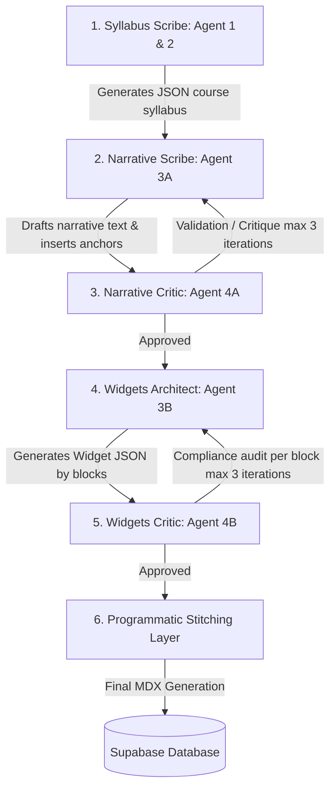

# 💸 Operational Costs & AI Architecture Guide

This document presents a detailed analysis of the operational cost structure of **OpenPrimer**, covering the three fundamental pillars of our Artificial Intelligence pipeline: **content generation**, **pedagogical revision**, and **academic translation**.

It serves as a financial roadmap for platform administration, describing the strict Model Routing Policy, observed real-world costs, and optimization mechanisms implemented to maximize budget efficiency on Google Cloud Vertex AI.

---

## 1. Model Mapping & Pricing (Vertex AI)

OpenPrimer deploys a strict Model Routing Policy that assigns each task to the most suitable model based on quality and cost. The applied Vertex AI rates are as of **June 2026** (expressed per million input and output tokens).

| AI Model | Primary Role | Input Price (per 1M) | Output Price (per 1M) | Usage Justification |
| :--- | :--- | :---: | :---: | :--- |
| **Gemini 2.5 Flash** | Mass automation pipeline | **$0.075** | **$0.300** | Optimal balance. Used for narrative generation, translation, and tutor chat. |
| **Gemini 2.5 Pro** | Deep revision & Ingestion research | **$1.250** | **$10.000** | Superior academic quality required for complex structural corrections. |
| **Gemini 3.5 Flash** | Manual Admin Widget Workshop | **$1.500** | **$9.000** | High performance and visual creativity for custom interactive widget authoring. |
| **Gemini 2.0 Flash Lite** | Micro-tasks & Compilations | **$0.0375** | **$0.150** | Ultra-cost-effective model for lightweight metadata and badge compile tasks. |

> [!WARNING]
> **Absolute Model Routing Rule:** The **Gemini 3.5 Flash** model is strictly reserved for the manual Admin Widget Workshop (`widgets_workshop`). It must not be used in any automated pipeline steps (generation, revision, or translation) to prevent budget overruns.

---

## 2. Pillar 1: Automated Generation (`course_generation`)

Generating a complete course operates as a collaborative multi-agent workflow, decoupled into multiple stages to overcome context limits and output token constraints.

### A. Workflow and Involved Agents

### B. Consumption and Theoretical Cost Estimation
Standard generation of a lesson (course chapter) relies entirely on **Gemini 2.5 Flash**.

*   **Token estimation per lesson (average nominal call):**
    *   **Input**: ~2,000 tokens
    *   **Output**: ~8,000 tokens (high-density academic text of 3,000 to 5,000 words)
*   **Theoretical nominal call cost calculation:**
    \[\text{Input Cost} = \frac{2,000}{1,000,000} \times \$0.075 = \$0.00015\]
    \[\text{Output Cost} = \frac{8,000}{1,000,000} \times \$0.300 = \$0.00240\]
    \[\text{Total Theoretical Cost} = \mathbf{\$0.00255}\ \text{per lesson}\ (\approx 0.255\ \text{cents})\]

### C. Observed Real-World Production Costs (Concrete 7-Chapter Example)
During a real execution of the pipeline for a dense university-level course (such as *"Introduction to Classical Opera: Art, Acoustics, and Dramaturgy"* consisting of 7 chapters and a final evaluation), the system handles multiple review iterations, narrative critiques (Stage 4A), and complex widget audits (Stage 4B):

*   **Total tokens consumed (Full course - 7 chapters):**
    *   Request tokens (Prompt Tokens): ~400,000
    *   Generated tokens (Candidates Tokens): ~120,000
*   **Total Real Generation Cost:**
    \[\text{Cost} = (400,000 \times \$0.000000075) + (120,000 \times \$0.000000300) = \$0.03 + \$0.036 = \mathbf{\$0.066}\ (\approx 6.6\ \text{cents})\]

> [!TIP]
> Even with multi-agent critique and correction loops, the actual cost of a complete 7-chapter university course, written at an undergraduate L2 level, is **less than 10 cents (USD)** due to the extreme efficiency of Gemini 2.5 Flash!

---

## 3. Pillar 2: Pedagogical Revision (`course_revision`)

OpenPrimer's revision system is triggered when students or educators flag errors, assign low ratings, or provide pedagogical feedback.

### A. Analysis and Qualification (Agent 5 - Qualifying Agent)
Upon trigger, **Agent 5** evaluates history and decides the scope:
1.  **Local Revision**: Confined to a specific section, glossary, or quiz parameter.
2.  **Global Revision**: Requires a complete or structural rewrite.

### B. Local Revision Pricing
Local revision modifies only the targeted text blocks or widget configurations.
*   **Model**: `gemini-2.5-flash`
*   **Tokens**: Low volume (<4,000 input, <1,500 output)
*   **Estimated Cost**: **<$0.00075** per local intervention.

### C. Global Revision Pricing (Deep Pedagogical Patch)
When a course requires major academic restructuring, the system can call **Gemini 2.5 Pro** to guarantee absolute conceptual rigor.

*   **Model**: `gemini-2.5-pro`
*   **Sliding-Window Mechanism**: To prevent cost inflation and bypass output limits, the preprocessor slices the lesson into cohesive sections and rewrites them sequentially.
*   **Cost calculation on heavy context (Example: 20,000 input tokens, 4,000 output tokens):**
    \[\text{Input (Pro)} = \frac{20,000}{1,000,000} \times \$1.25 = \$0.025\]
    \[\text{Output (Pro)} = \frac{4,000}{1,000,000} \times \$10.00 = \$0.040\]
    \[\text{Deep Revision Cost} \approx \mathbf{\$0.065}\ (\approx 6.5\ \text{cents per lesson})\]

---

## 4. Pillar 3: Academic Translation (`course_translation`)

OpenPrimer offers native multilingual support (9 languages with LTR/RTL layout switching). The translation pipeline must strictly preserve MDX syntax and React interactive component structures.

### A. Full Course Translation (`course_translation`)
This process translates entire database-persisted lessons using **Gemini 2.5 Flash** at a very low temperature (`0.1`) to enforce strict formatting.

*   **Token estimation per lesson (complete MDX):**
    *   **Input**: ~8,000 tokens (Original MDX + structure instructions)
    *   **Output**: ~7,000 tokens (Translated MDX)
*   **Theoretical nominal translation cost calculation per lesson:**
    \[\text{Cost} = \left(\frac{8,000}{1,000,000} \times \$0.075\right) + \left(\frac{7,000}{1,000,000} \times \$0.300\right) = \$0.0006 + \$0.0021 = \mathbf{\$0.0027}\ (\approx 0.27\ \text{cents})\]

For a complete 7-chapter course, translating into a new language costs roughly **$0.019 (less than 2 cents)**.

### B. Batch Translation of Metadata (`batch_translate`)
For badges, disciplines, categories, and UI labels.
*   **Model**: `gemini-2.5-flash`
*   **Tokens**: ~1,500 input, ~1,200 output
*   **Cost**: ~**$0.00047** per metadata translation batch.

---

## 5. Free Services, Variable Costs & Unknown Risks

While OpenPrimer's operations are powered by paid AI models, many services essential to the user experience are **entirely free**, while others present **unknown and unpredictable volume costs**.

### A. Entirely Free Services ($0.00)

Several key components of the architecture do not generate API or infrastructure costs:

1.  **Static UI Dictionaries (Tier 1)**:
    *   All interface translations for primary languages (EN, FR, ES, DE, ZH) and static Admin cockpit dictionaries are compiled directly into the client JavaScript bundle at build-time.
    *   Their rendering and processing do not trigger any paid network or API requests.
2.  **Programmatic Stitching Layer**:
    *   Merging the pre-generated widget JSON objects into the narrative MDX lesson template is executed locally via deterministic TypeScript code (`stitchLessonContent` in `web/src/lib/ai.ts`).
    *   This crucial operation requires no AI calls and runs at zero cost.
3.  **Database Hosting (Supabase)**:
    *   Storing courses, lessons, student profiles, and achievements utilizes free tiers. Database storage limits are preserved through automatic telemetry and log cleaning scripts.

### B. Variable Costs and Unknown Risks (Student Tutor Usage)

The primary uncertainty in the platform's budget lies in real-world user interactions.

1.  **Interactive AI Tutor (`tutor_chat`) — Known unit cost, but unknown total volume**:
    *   Each student message to the tutor requires a request to Gemini 2.5 Flash, including lesson context and discussion history.
    *   **Controlled Unit Cost**: An average exchange of 4,000 input and 800 output tokens costs **$0.00054** (or 0.054 cents).
    *   **Unknown Total Cost**: Individual student behavior is unpredictable. A highly curious student may query the tutor dozens of times a day, accumulating large prompts. Across hundreds of students, the aggregate cost becomes a **significant unknown variable**.
2.  **Mitigating the Unknown with Quotas**:
    *   To eliminate this financial risk, OpenPrimer includes a cost controller that enforces a strict daily token quota per student profile, blocking abusive behaviors and keeping the maximum monthly budget perfectly predictable.

---

## 6. Cost Summary by User Action

The table below summarizes the pre-computed costs configured in the OpenPrimer admin interface (`ai-config.ts`), representing the nominal estimates for each type of system task.

| System Task | Task ID | Model Used | Input Tokens (Est.) | Output Tokens (Est.) | Estimated Cost (USD) |
| :--- | :--- | :--- | :---: | :---: | :---: |
| **Course Generation** | `course_generation` | Gemini 2.5 Flash | 2,000 | 8,000 | **$0.00255** |
| **Widget Placement** | `widget_placement` | Gemini 2.5 Flash | 4,000 | 4,000 | **$0.00150** |
| **Widget Workshop** | `widgets_workshop` | Gemini 3.5 Flash | 6,000 | 6,000 | **$0.06300** |
| **Course Translation** | `course_translation` | Gemini 2.5 Flash | 8,000 | 7,000 | **$0.00270** |
| **AI Tutor Chat** | `tutor_chat` | Gemini 2.5 Flash | 4,000 | 800 | **$0.00054** |
| **Batch Translation** | `batch_translate` | Gemini 2.5 Flash | 1,500 | 1,200 | **$0.00047** |
| **Badge Compilation** | `badge_compile` | Gemini 2.0 Flash Lite | 1,200 | 800 | **$0.00017** |

---

## 7. AI Budget Optimization Heuristics

To prevent cost inflation and token waste, OpenPrimer's architecture integrates several layers of control and budget protection.

### A. Model Parameter Tuning (Flash Booster)
The system configures precise generation parameters per task:
*   **Academic writing (Scribe)**: Temperature `0.35`, frequency penalty `0.25`, Top-P `0.85`, max output `8192` (reduces verbose lexical stagnation and limits token waste).
*   **Structural tasks (Syllabus, Widgets, JSON Audits)**: Temperature `0.1` (or `0.0` where required) to enforce strict determinism and eliminate syntax corruptions.
*   **Translation & Localization**: Temperature `0.1` to preserve MDX structures without modifying code.

### B. Abuse Prevention & Quota Control
*   **Daily Quotas**: Every student is capped with a daily token allowance for conversational interactions (`tutor_chat`).
*   **Profile Restrictions**: Suspicious or highly repetitive patterns trigger automatic access restrictions and log a warning on the admin panel.
*   **Database Vacuuming**: Granular Retention Sliders allow the admin to prune expired log entries to remain within Supabase's free storage tier limits.
