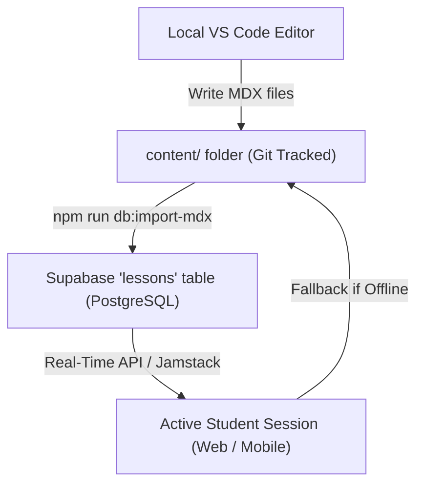

# OpenPrimer Hybrid Content Architecture & Synchronization

This document outlines the **Sovereign Hybrid Content Pipeline** of OpenPrimer. It bridges file-based **Git-powered local authoring (Markdown/MDX)** with a **dynamic, live-rendered PostgreSQL database (`lessons` table)** in Supabase.

---

## 1. Architectural Concept

To achieve maximum reliability, high developer productivity, and Zero-Latency production speed, OpenPrimer adopts a hybrid Content decoupling strategy:



### Sovereign Roles
1. **The Database (`lessons` table)**: This is the **Source of Truth** for production deployments. Content generated autonomously by the pedagogical AI agents is written directly here.
2. **The Local Directory (`content/` folder)**: This is the **Local Authoring Environment** for developers and content creators. It also serves as the absolute local fallback (offline sandbox mode).

---

## 2. Storage Mode Comparisons

| Metric | Static Storage (`content/` files) | Database Storage (PostgreSQL `lessons`) |
| :--- | :--- | :--- |
| **Primary Use** | Local development, Offline Sandbox, Git-versioned templates. | Production, Real-time AI Generation/Translation, Dynamic Student progression. |
| **Authoring Experience** | Write standard Markdown files inside VS Code with full Git history. | Direct AI generation via backend, or administrative dashboard inputs. |
| **Offline Sandbox Mode** | Supported. Active when offline flag is enabled or Supabase is unreachable. | Requires active internet connection to query Supabase API. |
| **Sync Commands** | Commit to Git / Push to GitHub repository. | Run `npm run db:import-mdx` to publish local changes. |

---

## 3. Database Sync & Maintenance Tools

We provide twin synchronization scripts inside the `web/` workspace folder to perfectly bridge these two storage modes:

### A. Importing Local MDX Files into Supabase
If you author new lessons locally under `content/` and want to publish them instantly to your live Supabase database without manual input:
```bash
cd web
npm run db:import-mdx
```
* **How it works**: The script recursively traverses `content/`, parses each `.mdx` file, extracts frontmatter variables (such as title, level, subject) using `gray-matter`, and perform a clean database **Upsert** (`ON CONFLICT DO UPDATE`) in the `lessons` table.

### B. Exporting Supabase Database Lessons to Git MDX
If your dynamic pedagogical AI generator has written new lessons or translations directly into your production database, and you want to pull them down into your local directory to commit them to GitHub:
```bash
cd web
npm run db:export-mdx
```
* **How it works**: The script queries all active courses and active rows from the `lessons` table, matches course slugs to reconstruct the correct filesystem hierarchy (`content/[level]/[subject]/[courseSlug]/[lessonSlug].[lang].mdx`), and writes clean `.mdx` files onto your disk.

---

## 4. Switching Over & Offline Fallback Mechanics

The content rendering engine (`web/src/lib/content.ts`) is designed to handle failure states gracefully, protecting both production stability and offline developer capabilities:

1. **Production Mode (DB First)**:
   * When loading a course navigation tree (`getNavigationTree`) or rendering a lesson page (`getPageContent`), the application queries the Supabase database.
   * On success, the live database row is compiled using `next-mdx-remote` and served instantly.

2. **Offline Mode / Database Unreachable (File Fallback)**:
   * If the Supabase database connection fails, is unpopulated, or the environment is offline, the engine **automatically falls back to traversing and reading the local `content/` directory**.
   * If the directory is also empty, it triggers the JIT dynamic page synthesizer with localized server health indicators, ensuring the user is never faced with 404 errors or hard crashes.

---

## 5. Security & GitHub Safe Storage (Git LFS)

Because dynamic exports of PostgreSQL tables (`supabase_seed.sql`) can grow very rapidly over time, we track all SQL exports using **Git LFS (Large File Storage)**. 

The repository's `.gitattributes` tracks large SQL artifacts safely:
```ini
web/src/lib/supabase_seed.sql filter=lfs diff=lfs merge=lfs -text
*.sql filter=lfs diff=lfs merge=lfs -text
```
This guarantees you will **never** hit GitHub's 100MB file push restriction when backing up your academic database.
