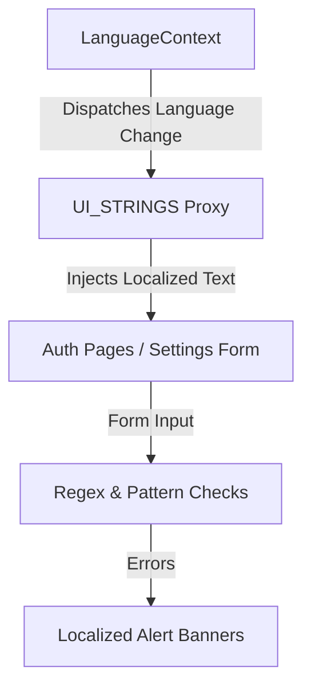
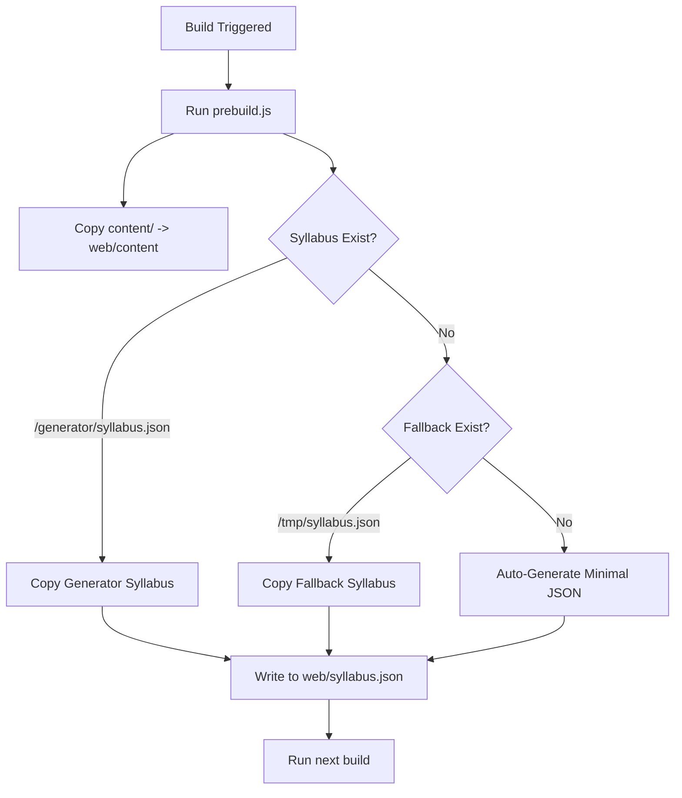

# OpenPrimer Admin Handbook: Security & Localization Protocols

Welcome to the **OpenPrimer Academic Repository Admin Handbook**. This document serves as the absolute single source of truth for the localization system, security policies, and build data pipeline maintenance of the OpenPrimer global education platform.

---

## 🌐 1. Multilingual Localization Protocol

OpenPrimer achieves global academic sovereignty by translating certified curriculum elements and UI interactions into the 5 most spoken global languages: **English (EN), French (FR), Spanish (ES), German (DE), and Chinese (ZH)**.



### The `UI_STRINGS` Architecture
All static global UI strings reside in the `STATIC_UI_STRINGS` dictionary inside `web/src/components/RefinedUI.tsx`. Access to this dictionary is governed by a proxy-based wrapper `UI_STRINGS` that ensures safe, runtime-fallback access.

#### Core Rules for Adding/Modifying UI Strings:
1. **Linguistic Symmetry**: Every new key **must** be implemented concurrently across all 5 language blocks (`EN`, `FR`, `ES`, `DE`, `ZH`). Failing to do so breaks UI symmetry.
2. **Regex-Protected Input Strings**: Form-level validation strings must reference localized strings directly to prevent untranslated validation errors.

### Localized Validation & Placeholder Keys
The registration, login, and profile settings pages utilize a set of standardized localized key definitions to handle form inputs and inline error messaging:

| Key | English (EN) | French (FR) | Spanish (ES) | German (DE) | Chinese (ZH) |
| :--- | :--- | :--- | :--- | :--- | :--- |
| `invalid_name` | Please enter a valid name (2-60 characters, letters/spaces/hyphens only). | Veuillez entrer un nom valide (2 à 60 caractères, lettres/espaces/tirets uniquement). | Por favor, introduzca un nombre válido (2-60 caracteres, solo letras/espacios/guiones). | Bitte geben Sie einen gültigen Namen ein (2-60 Zeichen, nur Buchstaben/Leerzeichen/Bindestriche). | 请输入名字（2-60个字符，仅限字母/空格/连字符）。 |
| `invalid_email` | Please enter a valid email address. | Veuillez entrer une adresse email valide. | Por favor, introduzca una dirección de correo electrónico válida. | Bitte geben Sie eine gültige E-Mail-Adresse ein. | 请输入有效的电子邮件地址。 |
| `email_placeholder` | `john.doe@email.com` | `jean.dupont@email.com` | `juan.perez@email.com` | `hans.mueller@email.com` | `zhang.san@email.com` |
| `all_fields_required` | Please fill in all required fields. | Veuillez remplir tous les champs requis. | Por favor, rellene todos los campos requeridos. | Bitte füllen Sie alle erforderlichen Felder aus. | 请填写所有必填字段。 |

---

## 🔒 2. Security & Form Validation Protocol

OpenPrimer deploys a multi-layered defense system to secure administrative configurations, registration forms, and user profiles.

### Strict Input Restrictions

All form fields must be length-limited and validated both on the client and server side to block buffer overflow or denial-of-service attempts:

- **First / Last Name**: Max **60 characters**, matching regex: `/^[a-zA-ZÀ-ÿ\s\-']{2,60}$/`.
- **Email Address**: Max **60 characters**, matching email format: `/^[^\s@]+@[^\s@]+\.[^\s@]+$/`.
- **Password**: Max **60 characters**, matching `PASSWORD_REGEX` requirements.

### Password Complexity Enforcer
Passwords must satisfy the following strict requirements defined by the platform's security standard:
- Minimum length: **12 characters**.
- Must contain at least one **lowercase letter**.
- Must contain at least one **uppercase letter**.
- Must contain at least one **digit / number**.
- Must contain at least one **special character** (e.g., `@$!%*?&#^+=._-[]{}()`).

```typescript
const PASSWORD_REGEX = /^(?=.*[a-z])(?=.*[A-Z])(?=.*\d)(?=.*[@$!%*?&#^+=._\-\[\]{}()]).{12,}$/;
```

### Rate Limiting Safeguards
To secure registration endpoints against automated dictionary attacks or script spam:
* **Max Attempts**: 3 validation submissions.
* **Window**: 120 seconds (2 minutes).
* **Action**: Submissions exceeding this threshold are blocked client-side, displaying a dynamically calculated localized wait timer countdown.

---

## ⚙️ 3. Production Build Data Pipeline Maintenance

The OpenPrimer compiler depends on a highly optimized asset staging process configured in `web/prebuild.js`. This script prepares markdown files (`content/`) and academic metadata (`syllabus.json`) prior to Next.js build-time execution.



### Self-Healing `syllabus.json` Copy Pipeline
To prevent remote build crashes in serverless continuous integration (CI/CD) environments where the `generator` module directory might not be checked out, the prebuild script operates on a self-healing fallback matrix:

1. **Primary Target**: Looks for standard compiler syllabus file at `../generator/syllabus.json`.
2. **First Fallback**: Looks for system-cached database export at `../tmp/syllabus.json`.
3. **Second Fallback (Self-Healing)**: Automatically generates a clean, valid template structure (`{ University: { Bachelor: { L1: {} } } }`) directly to `web/syllabus.json` to guarantee a warning-free compile.

> [!TIP]
> This self-healing architecture eliminates persistent data pipeline compilation warnings and ensures the platform can compile seamlessly on serverless runtimes like Vercel, Netlify, or Hugging Face Spaces.

### MDX Page Resolution & Dynamic Academic Generator Fallbacks
When a user requests a course or lesson page:
1. `web/src/lib/content.ts` attempts to load the database-backed course contents first.
2. If offline, it attempts to load static local files (`content/<level>/<subject>/<course>/<lesson>.<lang>.mdx`).
3. If the requested language version does not exist, it falls back to sibling version directories to search for available translations.
4. If no files exist, it triggers the **Sovereign Dynamic Generator** to generate a premium-styled MDX lesson template on-the-fly, styled with beautiful typography and custom alerts to wow the user.

---

### Verification and Commands Cheat Sheet
To manually trigger the content validation and pipeline updates:

* **Compile Content & Syllabus**:
  ```powershell
  node prebuild.js
  ```
* **Run Production Build**:
  ```powershell
  npm run build
  ```
* **Verify Database Exports**:
  ```powershell
  node export_db.js
  ```

---

*This handbook is maintained by the Core Systems Administration team. All modifications to localization frameworks or security policies must align with the parameters described herein.*
