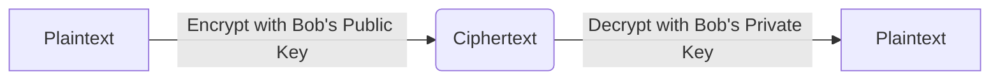

<Prerequisites items={[
  "Lesson 2: Symmetric Encryption & Entropy",
  "Modular Arithmetic (modulo arithmetic and congruences)",
  "Basic Group Theory (notions of fields and cyclic groups)"
]} />

# 3. Public Key Cryptography & Key Exchange

Symmetric cryptography is highly secure and fast, but it suffers from a fundamental flaw: the **key distribution problem**. If Alice and Bob want to communicate securely, how can they agree on a shared secret key in the first place if they have never met, and are communicating over an insecure connection?

In 1976, Whitfield Diffie and Martin Hellman published a revolutionary paper that solved this dilemma. In this lesson, we will study the mathematical foundations of **Asymmetric Cryptography** (Public-Key Cryptography) and analyze the elegant **Diffie-Hellman Key Exchange protocol**.

<Objectives>
  <Knowledge>
    * Understand the difference between symmetric and asymmetric cryptography.
    * Explain the key distribution problem and how public-key cryptography solves it.
    * Explain the mathematical structure of the Diffie-Hellman Key Exchange.
    * Define the Discrete Logarithm Problem (DLP) and why it acts as a one-way function.
  </Knowledge>
  <Skills>
    * Mathematically execute a Diffie-Hellman key exchange with small prime parameters.
    * Formulate modular exponentiations using fast modular exponentiation algorithms.
  </Skills>
  <Attitudes>
    * Appreciate how mathematical asymmetry can be used to construct secure communications.
    * Recognize the historical and physical significance of the Diffie-Hellman breakthrough.
  </Attitudes>
</Objectives>

---

## Symmetric vs. Asymmetric Architectures

In symmetric cryptography, both parties share a single, secret key used for both encryption and decryption. In asymmetric cryptography, each party has a **keypair**:
- A **Public Key**, which can be freely distributed to anyone.
- A **Private Key**, which must be kept strictly secret by its owner.

If Alice wants to send a secret message to Bob:
1. Alice encrypts the message using Bob's **Public Key**.
2. Only Bob's matching **Private Key** can decrypt that ciphertext.

---

## The Mathematical Foundation: One-Way Functions

The security of asymmetric cryptography rests on **trapdoor one-way functions**. These are mathematical operations that are extremely easy to calculate in one direction, but practically impossible to reverse unless you possess a specific piece of auxiliary information, known as the "trapdoor."

### Prime Fields and Generator Elements
Let \(p\) be a large prime number. The set of integers modulo \(p\):
\[\mathbb{F}_p = \mathbb{Z}_p = \{0, 1, 2, \dots, p-1\}\]
form a finite mathematical field under modulo addition and multiplication. 

The multiplicative group of this field, denoted \(\mathbb{Z}_p^*\), consists of all integers coprime to \(p\). It is a **cyclic group**, meaning there exists a generator element \(g \in \mathbb{Z}_p^*\) such that every element in the group can be written as \(g^a \pmod p\) for some integer \(a\).

### The Discrete Logarithm Problem (DLP)
Given a prime \(p\), a generator \(g\), and an exponent \(a\), computing:
\[A = g^a \pmod p\]
is computationally trivial (even for 2048-bit numbers) using modular exponentiation.

However, given \(A\), \(g\), and \(p\), finding the integer \(a\) such that:
\[g^a \equiv A \pmod p\]
is incredibly difficult. This is the **Discrete Logarithm Problem (DLP)**, the mathematical barrier protecting many modern cryptographic protocols.

<DiagnosticQuiz questions={[
  {
    q: "If p=17 and g=3, what is the value of A = g^4 mod p?",
    options: ["13", "12", "81", "1"],
    correctIndex: 0,
    explanation: "3^4 = 81. We divide 81 by 17: 81 = 17 * 4 + 13. Thus, 81 mod 17 = 13."
  }
]} />

---

## The Diffie-Hellman Key Exchange Protocol

The Diffie-Hellman protocol allows Alice and Bob to establish a shared secret key over an eavesdropped connection without exchanging the key itself.

### The Protocol Algorithm
1. **Public Parameters Selection**: Alice and Bob agree on a large prime \(p\) and a generator \(g\). These values are public and can be intercepted by Eve.
2. **Private Key Generation**:
   - Alice chooses a private secret integer \(a\).
   - Bob chooses a private secret integer \(b\).
3. **Public Key Computation & Exchange**:
   - Alice computes her public key \(A = g^a \pmod p\) and sends it to Bob.
   - Bob computes his public key \(B = g^b \pmod p\) and sends it to Alice.
4. **Shared Secret Derivation**:
   - Alice receives \(B\) and computes the shared secret \(s\):
     \[s = B^a \pmod p = (g^b)^a \pmod p = g^{ab} \pmod p\]
   - Bob receives \(A\) and computes the shared secret \(s\):
     \[s = A^b \pmod p = (g^a)^b \pmod p = g^{ab} \pmod p\]

Both Alice and Bob have calculated the same value \(s\), which they can now use as the key for symmetric encryption! Eve, who only knows \(g, p, A,\) and \(B\), cannot compute \(g^{ab} \pmod p\) without solving the Discrete Logarithm Problem to find \(a\) or \(b\).

---

## Interactive Code Sandbox: Execute Diffie-Hellman

Below, execute a Diffie-Hellman Key Exchange with small prime numbers to trace the mathematical calculations step-by-step.

<CodeSandbox 
  code={`// Modular exponentiation utility: (base^exp) % mod
function modExp(base, exp, mod) {
  let result = 1n;
  base = BigInt(base) % BigInt(mod);
  exp = BigInt(exp);
  const m = BigInt(mod);
  while (exp > 0n) {
    if (exp % 2n === 1n) result = (result * base) % m;
    base = (base * base) % m;
    exp = exp / 2n;
  }
  return Number(result);
}

const p = 997; // Large prime
const g = 2;   // Generator

// Alice's parameters
const a = 123; // Alice's secret key
const A = modExp(g, a, p); // Alice's public key

// Bob's parameters
const b = 456; // Bob's secret key
const B = modExp(g, b, p); // Bob's public key

// Shared Secret derivation
const sAlice = modExp(B, a, p);
const sBob = modExp(A, b, p);

console.log("Public Prime p:  ", p);
console.log("Public Generator g:", g);
console.log("Alice's Public A:  ", A);
console.log("Bob's Public B:    ", B);
console.log("Alice's derived s: ", sAlice);
console.log("Bob's derived s:   ", sBob);
console.log("Secrets Match?     ", sAlice === sBob);
`}
  language="javascript"
  title="Diffie-Hellman Math Simulator"
/>

---

<SolvedExercise title="Diffie-Hellman Protocol Trace">
  **Problem:**
  Let \(p = 23\) and \(g = 5\).
  - Alice chooses private key \(a = 6\).
  - Bob chooses private key \(b = 15\).
  Show the values exchanged and verify the shared secret.

  **Solution:**
  1. Alice computes public key \(A\):
     \[A = 5^6 \pmod{23} = 15625 \pmod{23} = 8\]
  2. Bob computes public key \(B\):
     \[B = 5^{15} \pmod{23} = 19\]
  3. Alice receives \(B = 19\) and computes shared secret \(s\):
     \[s = B^a \pmod{23} = 19^6 \pmod{23} = 2\]
  4. Bob receives \(A = 8\) and computes shared secret \(s\):
     \[s = A^b \pmod{23} = 8^{15} \pmod{23} = 2\]

  Both Alice and Bob successfully derive the shared secret \(s = 2\).
</SolvedExercise>

---

<Quiz mode="standard">
  <Question q="If Eve intercepts Bob's public key B and Alice's public key A, why can't she just multiply them to get the shared secret?" explanation="Multiplying Bob's and Alice's public keys gives (g^a) * (g^b) = g^(a+b) mod p. The shared secret is g^(ab) mod p. Multiplying public keys does not yield the exponent multiplication, demonstrating why the protocol is secure.">
    <Option text="Multiplying them yields g^(a+b) mod p, which is mathematically different from the shared secret g^(ab) mod p." correct={true} />
    <Option text="Because multiplying modular integers is extremely slow." correct={false} />
    <Option text="Because A and B are decimal floating-point numbers." correct={false} />
    <Option text="Because public keys are encrypted with the secret key of the CA." correct={false} />
  </Question>
</Quiz>

---

## Card Sort: Asymmetric Matching

Match the key exchange terms with their functions.

<CardSort pairsString="Private Key:Used by Alice to decrypt messages encrypted with her public key||Public Key:Used by Bob to encrypt messages meant for Alice||Trapdoor:Auxiliary information that makes inverting a function easy||DLP:The computational problem that prevents Eve from discovering secrets" />

---

<WhatsNext items={[
  "In Lesson 4, we will explore the mathematical structure of the most famous asymmetric cryptosystem: the RSA Cryptosystem."
]} />

<References>
  * **Diffie, W., & Hellman, M.** (1976). *New Directions in Cryptography*. IEEE Transactions on Information Theory.
  * **Menezes, A. J., van Oorschot, P. C., & Vanstone, S. A.** (1996). *Handbook of Applied Cryptography*. CRC Press.
</References>
