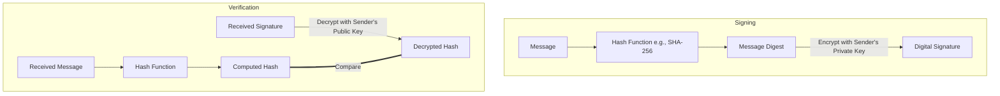

<Prerequisites items={[
  "Lesson 3: Public Key Cryptography & Key Exchange",
  "Euler's Totient Theorem",
  "Extended Euclidean Algorithm"
]} />

# 4. The RSA Cryptosystem & Digital Signatures

While Diffie-Hellman revolutionized key exchange, it did not provide a general mechanism for encrypting files or signing documents. In 1977, Ron Rivest, Adi Shamir, and Leonard Adleman introduced **RSA**, the first fully realized public-key cryptosystem.

RSA relies on a different mathematical problem than Diffie-Hellman: the **computational difficulty of factoring the product of two large prime numbers**. In this lesson, we will dissect the elegant mathematics of RSA and understand how it forms the basis of both modern encryption and **digital signatures**.

<Objectives>
  <Knowledge>
    * State the prime factorization problem that secures the RSA algorithm.
    * Explain Euler's totient function \(\phi(n)\) and how it is used in RSA.
    * Describe the mathematical process of RSA key generation, encryption, and decryption.
    * Explain how digital signatures provide authenticity and non-repudiation.
  </Knowledge>
  <Skills>
    * Calculate public and private RSA exponents for small prime factors.
    * Execute RSA encryption and decryption operations mathematically.
    * Use Euler's totient function to compute the number of coprimes of a number.
  </Skills>
  <Attitudes>
    * Appreciate the simplicity and power of modular arithmetic in solving complex cryptographic goals.
    * Grasp the absolute necessity of choosing sufficiently large prime factors to prevent factoring attacks.
  </Attitudes>
</Objectives>

---

## The Mathematical Foundation: Prime Factorization

The mathematical security of RSA is based on the **Factoring Problem**. While it is computationally trivial to multiply two large prime numbers \(p\) and \(q\) to get a composite number \(n = pq\), it is extremely difficult to do the reverse: given a large composite number \(n\), finding its prime factors \(p\) and \(q\) is one of the hardest problems in computer science.

### Euler's Totient Function \(\phi(n)\)
Euler's totient function, \(\phi(n)\), measures the number of positive integers less than or equal to \(n\) that are relatively prime (coprime) to \(n\).

For any prime number \(p\):
\[\phi(p) = p - 1\]

Since the totient function is multiplicative, if \(n = pq\) is the product of two distinct primes \(p\) and \(q\), then:
\[\phi(n) = \phi(p)\phi(q) = (p-1)(q-1)\]

<DiagnosticQuiz questions={[
  {
    q: "Calculate Euler's totient function \phi(15) for n = 3 * 5.",
    options: ["15", "14", "8", "6"],
    correctIndex: 2,
    explanation: "phi(15) = phi(3) * phi(5) = (3 - 1) * (5 - 1) = 2 * 4 = 8. There are 8 numbers coprime to 15: 1, 2, 4, 7, 8, 11, 13, 14."
  }
]} />

---

## The RSA Algorithm

RSA consists of three distinct phases: **Key Generation**, **Encryption**, and **Decryption**.

### 1. Key Generation
1. Select two distinct, massive prime numbers \(p\) and \(q\).
2. Compute their product:
   \[n = pq\]
   The number \(n\) is called the **modulus**.
3. Compute the totient:
   \[\phi(n) = (p-1)(q-1)\]
4. Choose an integer \(e\) (the **public exponent**) such that:
   \[1 < e < \phi(n) \quad \text{and} \quad \gcd(e, \phi(n)) = 1\]
   (Typically, \(e = 65537\) is chosen in real-world implementations).
5. Compute the secret exponent \(d\) (the **private exponent**) as the multiplicative inverse of \(e\) modulo \(\phi(n)\):
   \[d \equiv e^{-1} \pmod{\phi(n)}\]
   This is computed using the **Extended Euclidean Algorithm**, satisfying the relation:
   \[ed \equiv 1 \pmod{\phi(n)}\]

- **Public Key**: \((e, n)\)
- **Private Key**: \((d, n)\) (The prime factors \(p\) and \(q\) must also be securely destroyed).

### 2. Encryption
Given a plaintext message \(m\) represented as an integer such that \(0 \le m < n\), the ciphertext \(c\) is computed as:
\[c = m^e \pmod n\]

### 3. Decryption
Given a ciphertext \(c\), the plaintext \(m\) is recovered using the private exponent \(d\):
\[m = c^d \pmod n\]

### Proof of Correctness
The correctness of RSA is guaranteed by **Euler's Theorem**, which states that if \(\gcd(m, n) = 1\), then:
\[m^{\phi(n)} \equiv 1 \pmod n\]

Since \(ed \equiv 1 \pmod{\phi(n)}\), we can write \(ed = k\cdot\phi(n) + 1\) for some integer \(k\). Thus:
\[c^d \equiv (m^e)^d \equiv m^{ed} \equiv m^{k\cdot\phi(n) + 1} \equiv (m^{\phi(n)})^k \cdot m \equiv (1)^k \cdot m \equiv m \pmod n\]

---

## Interactive Code Sandbox: Run RSA Keygen

Below, execute a complete RSA key generation and message transmission trace using small prime numbers in Javascript.

<CodeSandbox 
  code={`// Finding multiplicative inverse via Extended Euclidean Algorithm
function modInverse(e, phi) {
  let [a, b] = [BigInt(e), BigInt(phi)];
  let [x0, x1] = [0n, 1n];
  let temp_phi = b;
  
  while (a > 1n) {
    let q = a / b;
    let r = a % b;
    a = b;
    b = r;
    let next_x = x1 - q * x0;
    x1 = x0;
    x0 = next_x;
  }
  if (x1 < 0n) x1 += temp_phi;
  return Number(x1);
}

// Modular exponentiation: (base^exp) % mod
function modExp(base, exp, mod) {
  let result = 1n;
  base = BigInt(base) % BigInt(mod);
  exp = BigInt(exp);
  const m = BigInt(mod);
  while (exp > 0n) {
    if (exp % 2n === 1n) result = (result * base) % m;
    base = (base * base) % m;
    exp = exp / 2n;
  }
  return Number(result);
}

// 1. Prime Selection
const p = 61;
const q = 53;
const n = p * q; // Modulus
const phi = (p - 1) * (q - 1); // Totient

// 2. Choose public exponent e
const e = 17; // coprime to phi (3120)

// 3. Compute private exponent d
const d = modInverse(e, phi);

// 4. Encrypt and Decrypt Message
const message = 42; // Numeric representation
const ciphertext = modExp(message, e, n);
const decrypted = modExp(ciphertext, d, n);

console.log("Primes Selected: p =", p, ", q =", q);
console.log("Modulus n:       ", n);
console.log("Totient phi(n):  ", phi);
console.log("Public Exponent e:", e);
console.log("Private Exponent d:", d);
console.log("------------------------");
console.log("Original Message:  ", message);
console.log("Ciphertext:        ", ciphertext);
console.log("Decrypted Message: ", decrypted);
`}
  language="javascript"
  title="RSA Cryptosystem Simulator"
/>

---

<SolvedExercise title="Numerical RSA Construction">
  **Problem:**
  Let \(p = 3\) and \(q = 11\).
  1. Calculate \(n\) and \(\phi(n)\).
  2. For \(e = 3\), compute the private exponent \(d\).
  3. Encrypt message \(m = 7\).
  4. Decrypt the resulting ciphertext to verify.

  **Solution:**
  1. Modulus and Totient:
     \[n = 3 \times 11 = 33\]
     \[\phi(n) = (3-1) \times (11-1) = 2 \times 10 = 20\]
  2. Compute Private Exponent \(d\):
     \[d \cdot e \equiv 1 \pmod{\phi(n)} \implies d \cdot 3 \equiv 1 \pmod{20}\]
     Since \(3 \times 7 = 21 \equiv 1 \pmod{20}\), the private exponent is:
     \[d = 7\]
  3. Encryption of \(m = 7\):
     \[c = m^e \pmod n = 7^3 \pmod{33} = 343 \pmod{33}\]
     Dividing 343 by 33 gives 10 with a remainder of 13. Thus:
     \[c = 13\]
  4. Decryption of \(c = 13\):
     \[m' = c^d \pmod n = 13^7 \pmod{33}\]
     Let's compute \(13^7 \pmod{33}\) using modular squares:
     - \(13^1 \equiv 13 \pmod{33}\)
     - \(13^2 = 169 \equiv 4 \pmod{33}\)
     - \(13^4 \equiv 4^2 \equiv 16 \pmod{33}\)
     - \(13^7 = 13^4 \times 13^2 \times 13^1 = 16 \times 4 \times 13 = 832\)
     - \(832 = 33 \times 25 + 7 \equiv 7 \pmod{33}\).

  The decrypted message is \(m' = 7\), matching the original message.
</SolvedExercise>

---

## Digital Signatures: Integrity and Authenticity

Asymmetric cryptography can also be used in reverse to create **Digital Signatures**, providing **integrity** (proving the message has not been altered) and **non-repudiation** (proving the sender actually sent it).

Instead of encrypting with the recipient's public key, the sender **encrypts a hash of the message with their own private key**.

### The Signing and Verification Process

If the decrypted hash matches the computed hash of the received message, the signature is valid. This mathematically proves that the message was written by the owner of the private key and has not been altered in transit!

---

## Unsolved Exercise: Challenge Question
Test your understanding of Euler's totient mathematics.

<UnsolvedExercise 
  question="Compute the value of \(\phi(77)\) where \(n = 77 = 7 \times 11\)." 
  correctAnswer={60} 
  tolerance={0.01} 
  solution="For n = pq, phi(n) = (p-1)(q-1). Here, p=7 and q=11, so phi(77) = (7-1)(11-1) = 6 * 10 = 60." 
/>

---

<Quiz mode="standard">
  <Question q="If Alice wants to encrypt a message to Bob AND sign it to prove she is the sender, what is the correct key sequence?" explanation="Alice first signs the message with her own private key (authenticity), and then encrypts the message + signature with Bob's public key (confidentiality). Only Bob can decrypt it, and Bob uses Alice's public key to verify the signature.">
    <Option text="Encrypt with Bob's private key, then sign with Alice's public key." correct={false} />
    <Option text="Sign with Alice's private key, then encrypt with Bob's public key." correct={true} />
    <Option text="Encrypt with Bob's public key, then sign with Bob's private key." correct={false} />
    <Option text="Sign with Alice's public key, then encrypt with Alice's private key." correct={false} />
  </Question>
</Quiz>

---

## Card Sort: RSA Parameters

Match the RSA parameters with their roles.

<CardSort pairsString="n (Modulus):The public value representing the product p*q||d (Private Exponent):The private exponent used to decrypt ciphertexts||e (Public Exponent):The public exponent used to encrypt plaintexts||phi(n):Euler's totient of n representing count of coprime elements" />

---

<WhatsNext items={[
  "In Lesson 5, you will undergo the Final Summative Evaluation to test your overall mastery of cryptography."
]} />

<References>
  * **Rivest, R. L., Shamir, A., & Adleman, L.** (1978). *A Method for Obtaining Digital Signatures and Public-Key Cryptosystems*. Communications of the ACM.
  * **Stinson, D. R.** (2006). *Cryptography: Theory and Practice*. CRC Press.
</References>
