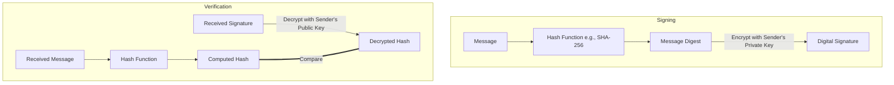

# 4. El Criptosistema RSA y Firmas Digitales

Aunque Diffie-Hellman revolucionó el intercambio de claves, no proporcionó un mecanismo general para cifrar archivos o firmar documentos. En 1977, Ron Rivest, Adi Shamir y Leonard Adleman introdujeron **RSA**, el primer criptosistema de clave pública completamente realizado.

RSA se basa en un problema matemático diferente al de Diffie-Hellman: la **dificultad computacional de factorizar el producto de dos números primos grandes**. En esta lección, analizaremos las elegantes matemáticas de RSA y comprenderemos cómo forma la base tanto del cifrado moderno como de las **firmas digitales**.

<Objectives>
  <Knowledge>
    <ul className="list-disc pl-4 space-y-1">
      <li>Enunciar el problema de factorización prima que asegura el algoritmo RSA.</li>
      <li>Explicar la función totiente de Euler $\phi(n)$ y cómo se utiliza en RSA.</li>
      <li>Describir el proceso matemático de generación de claves, cifrado y descifrado de RSA.</li>
      <li>Explicar cómo las firmas digitales proporcionan autenticidad y no repudio.</li>
    </ul>
  </Knowledge>
  <Skills>
    <ul className="list-disc pl-4 space-y-1">
      <li>Calcular los exponentes RSA públicos y privados para factores primos pequeños.</li>
      <li>Ejecutar operaciones de cifrado y descifrado RSA matemáticamente.</li>
      <li>Usar la función totiente de Euler para calcular el número de coprimos de un número.</li>
    </ul>
  </Skills>
  <Attitudes>
    <ul className="list-disc pl-4 space-y-1">
      <li>Apreciar la simplicidad y el poder de la aritmética modular para resolver objetivos criptográficos complejos.</li>
      <li>Comprender la necesidad absoluta de elegir factores primos suficientemente grandes para prevenir ataques de factorización.</li>
    </ul>
  </Attitudes>
</Objectives>

---
## El Fundamento Matemático: Factorización Prima

La seguridad matemática de RSA se basa en el **Problema de la Factorización**. Si bien es computacionalmente trivial multiplicar dos números primos grandes $p$ y $q$ para obtener un número compuesto $n = pq$, es extremadamente difícil hacer lo contrario: dado un número compuesto grande $n$, encontrar sus factores primos $p$ y $q$ es uno de los problemas más difíciles en ciencias de la computación.

### Función Totiente de Euler $\phi(n)$
La función totiente de Euler, $\phi(n)$, mide el número de enteros positivos menores o iguales a $n$ que son primos relativos (coprimos) a $n$.

Para cualquier número primo $p$:
$$\phi(p) = p - 1$$

Dado que la función totiente es multiplicativa, si $n = pq$ es el producto de dos primos distintos $p$ y $q$, entonces:
$$\phi(n) = \phi(p)\phi(q) = (p-1)(q-1)$$

---

## El Algoritmo RSA

RSA consta de tres fases distintas: **Generación de Claves**, **Cifrado** y **Descifrado**.

### 1. Generación de Claves
1. Seleccione dos números primos distintos y grandes $p$ y $q$.
2. Calcule su producto:
   $$n = pq$$
   El número $n$ se llama **módulo**.
3. Calcule el totiente:
   $$\phi(n) = (p-1)(q-1)$$
4. Elija un entero $e$ (el **exponente público**) tal que:
   $$1 < e < \phi(n) \quad \text{and} \quad \gcd(e, \phi(n)) = 1$$
   (Típicamente, se elige $e = 65537$ en implementaciones del mundo real).
5. Calcule el exponente secreto $d$ (el **exponente privado**) como el inverso multiplicativo de $e$ módulo $\phi(n)$:
   $$d \equiv e^{-1} \pmod{\phi(n)}$$
   Esto se calcula utilizando el **Algoritmo Extendido de Euclides**, satisfaciendo la relación:
   $$ed \equiv 1 \pmod{\phi(n)}$$

- **Clave Pública**: $(e, n)$
- **Clave Privada**: $(d, n)$ (Los factores primos $p$ y $q$ también deben ser destruidos de forma segura).

### 2. Cifrado
Dado un mensaje en texto plano $m$ representado como un entero tal que $0 \le m < n$, el texto cifrado $c$ se calcula como:
$$c = m^e \pmod n$$

### 3. Descifrado
Dado un texto cifrado $c$, el texto plano $m$ se recupera utilizando el exponente privado $d$:
$$m = c^d \pmod n$$

### Prueba de Correctitud
La correctitud de RSA está garantizada por el **Teorema de Euler**, que establece que si $\gcd(m, n) = 1$, entonces:
$$m^{\phi(n)} \equiv 1 \pmod n$$

Dado que $ed \equiv 1 \pmod{\phi(n)}$, podemos escribir $ed = k\cdot\phi(n) + 1$ para algún entero $k$. Así:
$$c^d \equiv (m^e)^d \equiv m^{ed} \equiv m^{k\cdot\phi(n) + 1} \equiv (m^{\phi(n)})^k \cdot m \equiv (1)^k \cdot m \equiv m \pmod n$$

---
## Sandbox de Código Interactivo: Ejecutar Generación de Claves RSA

A continuación, ejecute un seguimiento completo de la generación de claves RSA y la transmisión de mensajes utilizando números primos pequeños en Javascript.

<CodeSandbox code={`// Finding multiplicative inverse via Extended Euclidean Algorithm
function modInverse(e, phi) {
  let [a, b] = [BigInt(e), BigInt(phi)];
  let [x0, x1] = [0n, 1n];
  let temp_phi = b;
  
  while (a /> 1n) {
    let q = a / b;
    let r = a % b;
    a = b;
    b = r;
    let next_x = x1 - q * x0;
    x1 = x0;
    x0 = next_x;
  }
  if (x1 < 0n) x1 += temp_phi;
  return Number(x1);
}

// Modular exponentiation: (base^exp) % mod
function modExp(base, exp, mod) {
  let result = 1n;
  base = BigInt(base) % BigInt(mod);
  exp = BigInt(exp);
  const m = BigInt(mod);
  while (exp > 0n) {
    if (exp % 2n === 1n) result = (result * base) % m;
    base = (base * base) % m;
    exp = exp / 2n;
  }
  return Number(result);
}

// 1. Prime Selection
const p = 61;
const q = 53;
const n = p * q; // Modulus
const phi = (p - 1) * (q - 1); // Totient

// 2. Choose public exponent e
const e = 17; // coprime to phi (3120)

// 3. Compute private exponent d
const d = modInverse(e, phi);

// 4. Encrypt and Decrypt Message
const message = 42; // Numeric representation
const ciphertext = modExp(message, e, n);
const decrypted = modExp(ciphertext, d, n);

console.log("Primes Selected: p =", p, ", q =", q);
console.log("Modulus n:       ", n);
console.log("Totient phi(n):  ", phi);
console.log("Public Exponent e:", e);
console.log("Private Exponent d:", d);
console.log("------------------------");
console.log("Original Message:  ", message);
console.log("Ciphertext:        ", ciphertext);
console.log("Decrypted Message: ", decrypted);
`}
  language="javascript"
  title="RSA Cryptosystem Simulator"
/>

---

<SolvedExercise title="Numerical RSA Construction">
  **Problema:**
  Sean $p = 3$ y $q = 11$.
  1. Calcule $n$ y $\phi(n)$.
  2. Para $e = 3$, calcule el exponente privado $d$.
  3. Cifre el mensaje $m = 7$.
  4. Descifre el texto cifrado resultante para verificar.

  **Solución:**
  1. Módulo y Totiente:
     $$n = 3 \times 11 = 33$$
     $$\phi(n) = (3-1) \times (11-1) = 2 \times 10 = 20$$
  2. Calcule el Exponente Privado $d$:
     $$d \cdot e \equiv 1 \pmod{\phi(n)} \implies d \cdot 3 \equiv 1 \pmod{20}$$
     Dado que $3 \times 7 = 21 \equiv 1 \pmod{20}$, el exponente privado es:
     $$d = 7$$
  3. Cifrado de $m = 7$:
     $$c = m^e \pmod n = 7^3 \pmod{33} = 343 \pmod{33}$$
     Dividir 343 entre 33 da 10 con un resto de 13. Por lo tanto:
     $$c = 13$$
  4. Descifrado de $c = 13$:
     $$m' = c^d \pmod n = 13^7 \pmod{33}$$
     Calculemos $13^7 \pmod{33}$ usando cuadrados modulares:
     - $13^1 \equiv 13 \pmod{33}$
     - $13^2 = 169 \equiv 4 \pmod{33}$
     - $13^4 \equiv 4^2 \equiv 16 \pmod{33}$
     - $13^7 = 13^4 \times 13^2 \times 13^1 = 16 \times 4 \times 13 = 832$
     - $832 = 33 \times 25 + 7 \equiv 7 \pmod{33}$.

  El mensaje descifrado es $m' = 7$, coincidiendo con el mensaje original.
</SolvedExercise>
## Firmas Digitales: Integridad y Autenticidad

La criptografía asimétrica también puede usarse a la inversa para crear **Firmas Digitales**, proporcionando **integridad** (demostrando que el mensaje no ha sido alterado) y **no repudio** (demostrando que el remitente realmente lo envió).

En lugar de cifrar con la clave pública del destinatario, el remitente **cifra un hash del mensaje con su propia clave privada**.

### El Proceso de Firma y Verificación

Si el hash descifrado coincide con el hash calculado del mensaje recibido, la firma es válida. ¡Esto prueba matemáticamente que el mensaje fue escrito por el propietario de la clave privada y no ha sido alterado en tránsito!

---
## Ejercicio sin resolver: Pregunta de desafío
Pon a prueba tu comprensión de las matemáticas de la función totiente de Euler.

<UnsolvedExercise 
  question="Compute the value of $\phi(77)$ where $n = 77 = 7 \times 11$." 
  correctAnswer={60} 
  tolerance={0.01} 
  solution="For n = pq, phi(n) = (p-1)(q-1). Here, p=7 and q=11, so phi(77) = (7-1)(11-1) = 6 * 10 = 60." 
/>

---

<Quiz mode="standard">
  <Question q="¿Si Alice quiere cifrar un mensaje para Bob Y firmarlo para probar que ella es la remitente, cuál es la secuencia de claves correcta?" explanation="Alice primero firma el mensaje con su propia clave privada (autenticidad), y luego cifra el mensaje + firma con la clave pública de Bob (confidencialidad). Solo Bob puede descifrarlo, y Bob usa la clave pública de Alice para verificar la firma.">
  <Option text="Cifrar con la clave privada de Bob, luego firmar con la clave pública de Alice." correct={false} />
  <Option text="Firmar con la clave privada de Alice, luego cifrar con la clave pública de Bob." correct={true} />
  <Option text="Cifrar con la clave pública de Bob, luego firmar con la clave privada de Bob." correct={false} />
  <Option text="Firmar con la clave pública de Alice, luego cifrar con la clave privada de Alice." correct={false} />
</Question>
</Quiz>

---
## Clasificación de Tarjetas: Parámetros RSA

Empareja los parámetros RSA con sus roles.

<CardSort pairsString="n (Modulus):The public value representing the product p*q||d (Private Exponent):The private exponent used to decrypt ciphertexts||e (Public Exponent):The public exponent used to encrypt plaintexts||phi(n):Euler's totient of n representing count of coprime elements" />

---

<WhatsNext itemsBase64="W10=" />