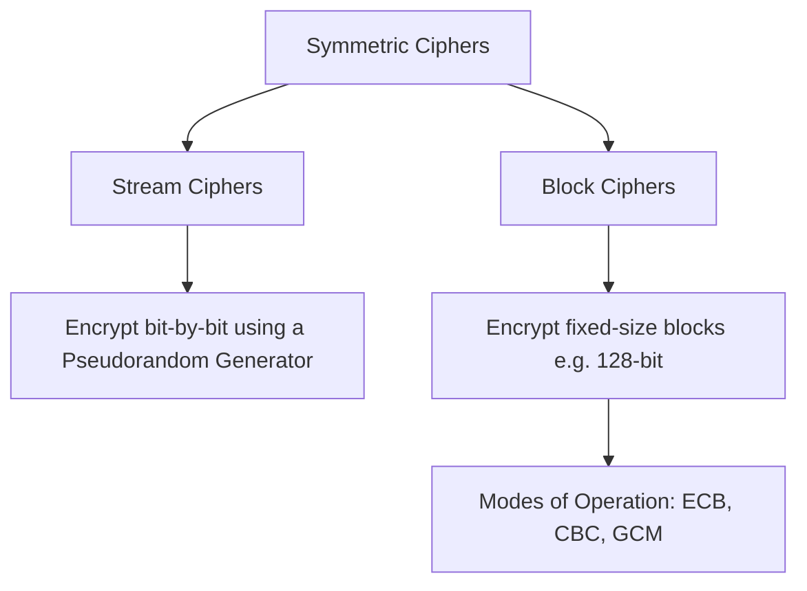

<Prerequisites items={[
  "Lesson 1: Historical Ciphers & Foundations",
  "Basic probability theory (independent events, expected value)",
  "Binary logic (XOR operator and truth tables)"
]} />

# 2. Symmetric Encryption & Entropy

Symmetric cryptography represents the workhorse of modern communications. Unlike classical shift and substitution schemes, modern symmetric ciphers operate on bits rather than alphabetic letters, and are backed by rigorous information-theoretic or complexity-theoretic security claims.

In this lesson, we will explore the boundaries of information security. We will mathematically analyze the only cipher that achieves **perfect secrecy**—the One-Time Pad—and study how practical modern symmetric algorithms like the **Advanced Encryption Standard (AES)** balance efficiency and security in the real world.

<Objectives>
  <Knowledge>
    * Define Shannon Entropy and its relevance to cryptographic uncertainty.
    * Explain the concept of perfect secrecy and prove it mathematically for the One-Time Pad.
    * Contrast stream ciphers and block ciphers.
    * Understand the structural layout of the Advanced Encryption Standard (AES).
  </Knowledge>
  <Skills>
    * Compute Shannon entropy for a given probability distribution of messages.
    * Perform bitwise exclusive-OR (XOR) operations for encryption and decryption.
    * Contrast block cipher modes of operation (ECB vs. CBC).
  </Skills>
  <Attitudes>
    * Appreciate the elegant synthesis of information theory and computer science.
    * Recognize why security rests on key secrecy rather than algorithm secrecy (Kerckhoffs's Principle).
  </Attitudes>
</Objectives>

---

## Shannon Entropy and Information Theory

Claude Shannon, the father of information theory, introduced the concept of **information entropy** in 1948. Entropy measures the average amount of uncertainty or surprise in a random variable.

### Mathematical Definition
Let \(X\) be a discrete random variable with a finite alphabet \(\mathcal{X}\) and probability mass function \(P(X)\). The Shannon entropy \(H(X)\) in bits is defined as:
\[H(X) = -\sum_{x \in \mathcal{X}} P(X=x) \log_2 P(X=x)\]

If a message is completely predictable, its entropy is 0. If it is a uniformly distributed random choice of \(N\) possibilities, its entropy is \(\log_2(N)\).

<DiagnosticQuiz questions={[
  {
    q: "If a cryptographic key is chosen uniformly at random from a keyspace of size 256, what is its Shannon entropy?",
    options: ["256 bits", "8 bits", "1 bit", "128 bits"],
    correctIndex: 1,
    explanation: "For a uniform distribution over a keyspace of size N, the entropy is log2(N). Here, log2(256) = 8 bits."
  }
]} />

---

## The One-Time Pad and Perfect Secrecy

The One-Time Pad (OTP) was patented by Gilbert Vernam in 1919. It is the only cryptographic system that is mathematically unbreakable, achieving what Shannon termed **perfect secrecy**.

### Mathematical Proof of Perfect Secrecy
An encryption scheme has **perfect secrecy** if the probability distribution of the plaintext is completely independent of the ciphertext. Mathematically, for all messages \(m \in \mathcal{M}\) and ciphertexts \(c \in \mathcal{C}\):
\[P(M = m \mid C = c) = P(M = m)\]

In other words, intercepting the ciphertext gives Eve exactly **zero** new information about the original message, even if Eve has infinite computing power.

### Mechanism of the One-Time Pad
The One-Time Pad operates on binary strings. Given a plaintext \(m \in \{0, 1\}^n\) and a key \(k \in \{0, 1\}^n\) chosen uniformly at random, the encryption is:
\[c = m \oplus k\]
where \(\oplus\) represents the bitwise exclusive-OR (XOR) operator. Decryption is identical:
\[m = c \oplus k\]

### XOR Truth Table
| \(A\) | \(B\) | \(A \oplus B\) |
| :---: | :---: | :------------: |
| 0 | 0 | 0 |
| 0 | 1 | 1 |
| 1 | 0 | 1 |
| 1 | 1 | 0 |

<SocraticInput 
  question="Why can the One-Time Pad key never be reused to encrypt a second message?" 
  idealAnswer="If a key is used twice (c1 = m1 XOR k, c2 = m2 XOR k), an attacker can compute c1 XOR c2, which equals m1 XOR m2. This completely eliminates the random key k, revealing structural or statistical relations between the plaintexts and allowing linguistic reconstruction." 
  customCriteriaString="Must explain that XORing two ciphertexts cancels out the key (c1 XOR c2 = m1 XOR m2), revealing the relation between plaintexts."
/>

---

## Modern Symmetric Encryption: Stream vs. Block

Because the One-Time Pad requires a key that is at least as long as the message and can never be reused, it is highly impractical for daily internet use. Modern symmetric cryptography relies on two major design architectures.

### 1. Stream Ciphers
Stream ciphers mimic the One-Time Pad by generating a long, pseudorandom keystream from a short, fixed-length seed key. Encryption is performed by XORing the plaintext stream with this keystream. (e.g., RC4, ChaCha20).

### 2. Block Ciphers
Block ciphers split the plaintext into fixed-size blocks (usually 128 bits) and encrypt each block as a unit using a complex, iterative mathematical function. The most famous block cipher is **AES**.

---

## The Advanced Encryption Standard (AES)

AES, selected by NIST in 2001 after a global competition, is based on a **Substitution-Permutation Network (SPN)**. It operates on a \(4 \times 4\) column-major order matrix of bytes, termed the *state*.

### The Four Steps of an AES Round
AES-128 performs 10 rounds of four mathematical transformations:
1. **SubBytes**: A non-linear byte substitution using a mathematically optimized lookup table (S-Box) to achieve confusion.
2. **ShiftRows**: A transposition step where the last three rows of the state matrix are cyclically shifted to achieve diffusion.
3. **MixColumns**: A linear mixing operation operating on the columns of the state, using matrix multiplication in Galois Field \(GF(2^8)\).
4. **AddRoundKey**: A simple XOR of the state with a round key derived from the master key.

---

## Block Cipher Modes of Operation

Because block ciphers encrypt fixed-size blocks (e.g., 128 bits), we need a **Mode of Operation** to handle messages of arbitrary lengths.

### Electronic Codebook (ECB) Mode
In ECB mode, each block is encrypted independently with the same key:
\[c_i = E(p_i, k)\]
**WARNING: ECB is highly insecure.** If two plaintext blocks are identical, their ciphertexts will be identical, preserving visual patterns (the classic "AES Penguin" vulnerability).

### Cipher Block Chaining (CBC) Mode
To prevent ECB's vulnerability, CBC mode XORs each plaintext block with the previous ciphertext block before encryption, using an **Initialization Vector (IV)** for the first block:
\[c_i = E(p_i \oplus c_{i-1}, k)\]

<Quiz mode="standard">
  <Question q="Which block cipher mode allows parallel encryption of blocks?" explanation="CTR (Counter) mode encrypts counter values and XORs them with the plaintext, meaning each block is independent and can be encrypted in parallel. CBC requires the previous ciphertext block, making encryption strictly sequential.">
    <Option text="Cipher Block Chaining (CBC) mode" correct={false} />
    <Option text="Electronic Codebook (ECB) and Counter (CTR) modes" correct={true} />
    <Option text="Output Feedback (OFB) mode" correct={false} />
    <Option text="Cipher Feedback (CFB) mode" correct={false} />
  </Question>
</Quiz>

---

## Card Sort: Symmetric Concepts Match

Match the modern symmetric encryption terms with their descriptions.

<CardSort pairsString="AES:Substitution-Permutation Network standard||Entropy:Measurement of system uncertainty and surprise||ECB Mode:Insecure mode that leaks structural plaintext patterns||One-Time Pad:Symmetric cipher that achieves perfect mathematical secrecy" />

---

<WhatsNext items={[
  "In Lesson 3, we will cross the boundary into Public-Key Cryptography, studying the Diffie-Hellman Key Exchange and public/private keys."
]} />

<References>
  * **Shannon, C. E.** (1948). *A Mathematical Theory of Communication*. Bell System Technical Journal.
  * **Daemen, J., & Rijmen, V.** (2002). *The Design of Rijndael: AES - The Advanced Encryption Standard*. Springer-Verlag.
</References>
