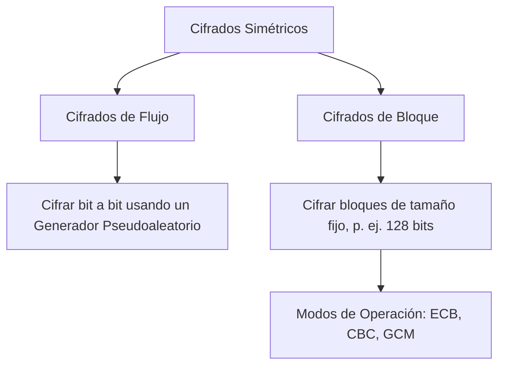

# 2. Cifrado Simétrico y Entropía

La criptografía simétrica representa el caballo de batalla de las comunicaciones modernas. A diferencia de los esquemas clásicos de desplazamiento y sustitución, los cifrados simétricos modernos operan con bits en lugar de letras alfabéticas, y están respaldados por rigurosas afirmaciones de seguridad basadas en la teoría de la información o la teoría de la complejidad.

En esta lección, exploraremos los límites de la seguridad de la información. Analizaremos matemáticamente el único cifrado que logra la **seguridad perfecta**—el One-Time Pad—y estudiaremos cómo los algoritmos simétricos modernos y prácticos, como el **Estándar de Cifrado Avanzado (AES)**, equilibran la eficiencia y la seguridad en el mundo real.

<Objectives>
  <Knowledge>
    <ul className="list-disc pl-4 space-y-1">
      <li>Definir la Entropía de Shannon y su relevancia para la incertidumbre criptográfica.</li>
      <li>Explicar el concepto de seguridad perfecta y demostrarlo matemáticamente para el One-Time Pad.</li>
      <li>Contrastar los cifrados de flujo y los cifrados de bloque.</li>
      <li>Comprender la estructura del Estándar de Cifrado Avanzado (AES).</li>
    </ul>
  </Knowledge>
  <Skills>
    <ul className="list-disc pl-4 space-y-1">
      <li>Calcular la entropía de Shannon para una distribución de probabilidad de mensajes dada.</li>
      <li>Realizar operaciones bit a bit de OR exclusivo (XOR) para cifrado y descifrado.</li>
      <li>Contrastar los modos de operación de cifrado por bloques (ECB vs. CBC).</li>
    </ul>
  </Skills>
  <Attitudes>
    <ul className="list-disc pl-4 space-y-1">
      <li>Apreciar la elegante síntesis de la teoría de la información y la informática.</li>
      <li>Reconocer por qué la seguridad se basa en el secreto de la clave y no en el secreto del algoritmo (Principio de Kerckhoffs).</li>
    </ul>
  </Attitudes>
</Objectives>
## Entropía de Shannon y Teoría de la Información

Claude Shannon, el padre de la teoría de la información, introdujo el concepto de **entropía de la información** en 1948. La entropía mide la cantidad promedio de incertidumbre o sorpresa en una variable aleatoria.

### Definición Matemática
Sea $X$ una variable aleatoria discreta con un alfabeto finito $\mathcal{X}$ y función de masa de probabilidad $P(X)$. La entropía de Shannon $H(X)$ en bits se define como:
$$H(X) = -\sum_{x \in \mathcal{X}} P(X=x) \log_2 P(X=x)$$

Si un mensaje es completamente predecible, su entropía es 0. Si es una elección aleatoria uniformemente distribuida de $N$ posibilidades, su entropía es $\log_2(N)$.

---

## El One-Time Pad y la Secrecía Perfecta

El One-Time Pad (OTP) fue patentado por Gilbert Vernam en 1919. Es el único sistema criptográfico que es matemáticamente irrompible, logrando lo que Shannon denominó **secrecía perfecta**.

### Prueba Matemática de la Secrecía Perfecta
Un esquema de cifrado tiene **secrecía perfecta** si la distribución de probabilidad del texto plano es completamente independiente del texto cifrado. Matemáticamente, para todos los mensajes $m \in \mathcal{M}$ y textos cifrados $c \in \mathcal{C}$:
$$P(M = m \mid C = c) = P(M = m)$$

En otras palabras, interceptar el texto cifrado le da a Eve exactamente **cero** información nueva sobre el mensaje original, incluso si Eve tiene una capacidad de cómputo infinita.

### Mecanismo del One-Time Pad
El One-Time Pad opera con cadenas binarias. Dado un texto plano $m \in \{0, 1\}^n$ y una clave $k \in \{0, 1\}^n$ elegida uniformemente al azar, el cifrado es:
$$c = m \oplus k$$
donde $\oplus$ representa el operador OR exclusivo (XOR) a nivel de bits. El descifrado es idéntico:
$$m = c \oplus k$$

### Tabla de Verdad XOR
| $A$ | $B$ | $A \oplus B$ |
| :---: | :---: | :------------: |
| 0 | 0 | 0 |
| 0 | 1 | 1 |
| 1 | 0 | 1 |
| 1 | 1 | 0 |

<SocraticInput 
  question="¿Por qué nunca se debe reutilizar la clave de la Libreta de Un Solo Uso (One-Time Pad) para cifrar un segundo mensaje?" 
  idealAnswer="Si una clave se usa dos veces (c1 = m1 XOR k, c2 = m2 XOR k), un atacante puede calcular c1 XOR c2, lo cual equivale a m1 XOR m2. Esto elimina por completo la clave aleatoria k, revelando relaciones estructurales o estadísticas entre los textos planos y permitiendo la reconstrucción lingüística." 
  customCriteriaString="Debe explicar que aplicar XOR a dos textos cifrados cancela la clave (c1 XOR c2 = m1 XOR m2), revelando la relación entre los textos planos."
/>

---
## Cifrado Simétrico Moderno: Flujo vs. Bloque

Dado que la Libreta de Un Solo Uso (One-Time Pad) requiere una clave que sea al menos tan larga como el mensaje y nunca pueda reutilizarse, es muy poco práctica para el uso diario de internet. La criptografía simétrica moderna se basa en dos arquitecturas de diseño principales.

### 1. Cifrados de Flujo
Los cifrados de flujo imitan la Libreta de Un Solo Uso (One-Time Pad) generando una secuencia de clave pseudoaleatoria larga a partir de una clave semilla corta y de longitud fija. El cifrado se realiza aplicando XOR a la secuencia de texto plano con esta secuencia de clave. (p. ej., RC4, ChaCha20).

### 2. Cifrados de Bloque
Los cifrados de bloque dividen el texto plano en bloques de tamaño fijo (normalmente 128 bits) y cifran cada bloque como una unidad utilizando una función matemática compleja e iterativa. El cifrado de bloque más famoso es **AES**.

---
## El Estándar de Cifrado Avanzado (AES)

AES, seleccionado por el NIST en 2001 después de una competición global, se basa en una **Red de Sustitución-Permutación (SPN)**. Opera sobre una matriz de bytes de $4 \times 4$ en orden principal por columnas, denominada el *estado*.

### Los Cuatro Pasos de una Ronda AES
AES-128 realiza 10 rondas de cuatro transformaciones matemáticas:
1.  **SubBytes**: Una sustitución de bytes no lineal utilizando una tabla de búsqueda (S-Box) optimizada matemáticamente para lograr confusión.
2.  **ShiftRows**: Un paso de transposición donde las últimas tres filas de la matriz de estado se desplazan cíclicamente para lograr difusión.
3.  **MixColumns**: Una operación de mezcla lineal que opera sobre las columnas del estado, utilizando multiplicación de matrices en el Campo de Galois $GF(2^8)$.
4.  **AddRoundKey**: Una simple operación XOR del estado con una clave de ronda derivada de la clave maestra.

---
## Modos de Operación de Cifrado por Bloques

Dado que los cifradores por bloques cifran bloques de tamaño fijo (por ejemplo, 128 bits), necesitamos un **Modo de Operación** para manejar mensajes de longitudes arbitrarias.

### Modo Libro de Códigos Electrónico (ECB)
En el modo ECB, cada bloque se cifra de forma independiente con la misma clave:
$$c_i = E(p_i, k)$$
**ADVERTENCIA: ECB es altamente inseguro.** Si dos bloques de texto plano son idénticos, sus textos cifrados serán idénticos, preservando patrones visuales (la clásica vulnerabilidad del "Pingüino AES").

### Modo Encadenamiento de Bloques de Cifrado (CBC)
Para prevenir la vulnerabilidad de ECB, el modo CBC aplica una operación XOR a cada bloque de texto plano con el bloque de texto cifrado anterior antes del cifrado, utilizando un **Vector de Inicialización (IV)** para el primer bloque:
$$c_i = E(p_i \oplus c_{i-1}, k)$$

<Quiz mode="standard">
  <Question q="¿Qué modo de cifrado por bloques permite el cifrado paralelo de bloques?" explanation="El modo CTR (Contador) cifra valores de contador y los combina con el texto plano mediante XOR, lo que significa que cada bloque es independiente y puede cifrarse en paralelo. CBC requiere el bloque de texto cifrado anterior, lo que hace que el cifrado sea estrictamente secuencial.">
  <Option text="Modo Encadenamiento de Bloques de Cifrado (CBC)" correct={false} />
  <Option text="Modos Libro de Códigos Electrónico (ECB) y Contador (CTR)" correct={true} />
  <Option text="Modo Retroalimentación de Salida (OFB)" correct={false} />
  <Option text="Modo Retroalimentación de Cifrado (CFB)" correct={false} />
</Question>
</Quiz>

---
## Clasificación de Tarjetas: Coincidencia de Conceptos Simétricos

Empareja los términos modernos de cifrado simétrico con sus descripciones.

<CardSort pairsString="AES:Estándar basado en una Red de Sustitución-Permutación||Entropía:Medida de la incertidumbre y sorpresa del sistema||Modo ECB:Modo inseguro que filtra patrones estructurales del texto plano||Libreta de Un Solo Uso:Cifrado simétrico que logra el secreto matemático perfecto" />

---

<WhatsNext itemsBase64="W10=" />