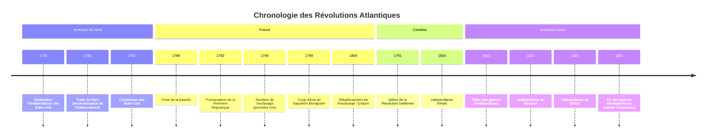

<Prerequisites itemsBase64="W3sidGl0bGUiOiJMZXMgTHVtacOocmVzIGV0IGxldXJzIGlkw6llcyBwb2xpdGlxdWVzIiwic2x1ZyI6Imxlcy1sdW1pZXJlcy1pZGVlcy1wb2xpdGlxdWVzIiwibGV2ZWwiOiJMeWPDqWUiLCJzdWJqZWN0IjoiSGlzdG9pcmUifSx7InRpdGxlIjoiTCdBbmNpZW4gUsOpZ2ltZSBldCBzZXMgc3RydWN0dXJlcyBzb2NpYWxlcyIsInNsdWciOiJhbmNpZW4tcmVnaW1lLXN0cnVjdHVyZXMtc29jaWFsZXMiLCJsZXZlbCI6Ikx5Y8OpZSIsInN1YmplY3QiOiJIaXN0b2lyZSJ9LHsidGl0bGUiOiJMZXMgZ3JhbmRlcyBwdWlzc2FuY2VzIGV1cm9ww6llbm5lcyBhdSBYVklJSWUgc2nDqGNsZSIsInNsdWciOiJncmFuZGVzLXB1aXNzYW5jZXMtZXVyb3BlZW5uZXMteHZpaWllIiwibGV2ZWwiOiJMeWPDqWUiLCJzdWJqZWN0IjoiSGlzdG9pcmUifV0=" />

<DiagnosticQuiz question="Quelle etait la caracteristique principale du système politique francais avant la Revolution de 1789?" options="Une monarchie constitutionnelle avec un parlement fort|||Une monarchie absolue de droit divin|||Une république fédérale avec une large autonomie régionale|||Un État socialiste basé sur la propriété collective" correctIndex="1" targetSectionId="contexte-pre-revolutionnaire" sectionTitle="Contexte des Revolutions" />

## Introduction : Contexte et enjeux de l'ère des révolutions
La fin du XVIIIe siècle et le début du XIXe siècle marquent une période charnière dans l'histoire mondiale, souvent désignée comme l'« ère des révolutions » (Hobsbawm, 1962). Ce cours se propose d'explorer les profondes transformations qui ont secoué l'espace atlantique – englobant l'Europe occidentale et les Amériques – entre environ 1770 et 1830. Il s'agit d'une période de ruptures majeures, où les structures politiques, sociales et économiques héritées de l'Ancien Régime sont remises en question, voire balayées, par des mouvements d'une ampleur inédite.

<Mermaid caption="Figure 1 : " id="timeline_revolutions_atlantic" name="timeline revolutions atlantic" term="timeline revolutions atlantic"/>timeline revolutions atlantic
Chronologie indicative des principales révolutions atlantiques.

Au cœur de ces bouleversements se trouvent plusieurs concepts fondamentaux dont la signification est alors redéfinie. La <ConceptLink id="revolution" name="revolution" term="revolution">révolution</ConceptLink>, au-delà d'un simple changement de régime, désigne désormais un processus radical de transformation politique et sociale, souvent violent, visant à refonder l'ordre existant sur de nouvelles bases idéologiques. L'idée de <ConceptLink id="nation" name="nation" term="nation">nation</ConceptLink> émerge comme une communauté politique et culturelle unie, détentrice de la légitimité du pouvoir, en opposition aux dynasties monarchiques. Cette nouvelle conception de la nation est intrinsèquement liée à celle de la <ConceptLink id="souverainete" name="souverainete" term="souverainete">souveraineté</ConceptLink>, qui passe du monarque de droit divin au peuple ou à la nation elle-même. Enfin, la <ConceptLink id="citoyennete" name="citoyennete" term="citoyennete">citoyenneté</ConceptLink> se substitue progressivement au statut de sujet, conférant aux individus des droits et des devoirs au sein de la nouvelle entité politique, et impliquant une participation, même limitée, à la vie publique.

| Caractéristique | Ancien Régime (avant 1770) | Ère des Révolutions (1770-1830) |
| :-------------- | :-------------------------- | :------------------------------ |
| **Source de la légitimité** | Droit divin du monarque | Souveraineté du peuple/nation |
| **Structure sociale** | Sociétés d'ordres (clergé, noblesse, tiers état) avec privilèges | Idéal d'égalité juridique, fin des privilèges, émergence de classes sociales |
| **Forme de gouvernement** | Monarchie absolue ou tempérée | Républiques, monarchies constitutionnelles |
| **Statut des individus** | Sujets du roi | Citoyens avec droits et devoirs |
| **Économie** | Mercantilisme, corporatisme, agriculture dominante | Libéralisme économique, début de l'industrialisation |

<Image caption="Figure 2 :" unresolved={true} />map atlantic revolutions
Carte de l'espace atlantique au tournant des XVIIIe et XIXe siècles, mettant en évidence les foyers révolutionnaires.

La problématique générale de ce cours sera d'analyser comment ces révolutions atlantiques ont profondément transformé les sociétés et les systèmes politiques de leur temps, donnant naissance à de nouvelles nations et redéfinissant durablement les rapports de pouvoir, tant à l'intérieur des États qu'entre eux. Comment ces idéaux de liberté et d'égalité ont-ils été mis en œuvre, et avec quelles limites ? Quelles furent les conséquences à long terme de cette ère de bouleversements sur la construction de l'État moderne et l'émergence d'une nouvelle géopolitique mondiale ?

<Objectives>
  <Knowledge>
    <ul className="list-disc pl-4 space-y-1">
      <li>analyser les causes profondes et les déclencheurs des révolutions atlantiques (fin XVIIIe - début XIXe).</li>
      <li>Évaluer l'influence des idéologies des Lumières sur les transformations politiques et sociales de l'époque.</li>
      <li>Comparer les caractéristiques principales des processus de construction nationale émergents en Europe.</li>
    </ul>
  </Knowledge>
  <Skills>
    <ul className="list-disc pl-4 space-y-1">
      <li>analyser des documents historiques primaires (déclarations, constitutions, correspondances) de l'ère révolutionnaire.</li>
      <li>Évaluer la pertinence de différentes interprétations historiographiques concernant la naissance des nations.</li>
      <li>Construire une argumentation structurée sur les continuités et ruptures politiques de cette période.</li>
    </ul>
  </Skills>
  <Attitudes>
    <ul className="list-disc pl-4 space-y-1">
      <li>Développer une approche critique face aux récits nationaux et aux mythes fondateurs de cette période.</li>
      <li>Apprécier la complexité des processus de transformation politique et sociale à l'échelle mondiale.</li>
      <li>Manifester une curiosité intellectuelle pour les débats historiographiques contemporains sur l'ère des révolutions.</li>
    </ul>
  </Attitudes>
</Objectives>

## Les racines des bouleversements : Idées, crises et contestations
L'émergence de ces mouvements révolutionnaires n'est pas le fruit du hasard, mais la convergence de causes profondes, intellectuelles, économiques, sociales et politiques, qui ont sapé les fondements de l'<Glossary id="ancien_regime" name="Ancien Regime" term="Ancien Regime">Ancien Régime</Glossary>.

L'héritage des <ConceptLink id="lumieres" name="Lumieres" term="Lumieres">Lumières</ConceptLink> constitue le terreau intellectuel de ces révolutions. Au XVIIIe siècle, des philosophes comme John Locke, Jean-Jacques Rousseau ou Montesquieu diffusent des idées nouvelles qui remettent en question l'absolutisme monarchique et les privilèges. Ils prônent la liberté individuelle, l'égalité des droits, la séparation des pouvoirs, la tolérance religieuse et la souveraineté du peuple. Ces concepts, largement diffusés par les livres, les salons et les gazettes, nourrissent une critique grandissante des institutions en place et offrent un cadre théorique aux aspirations réformatrices, puis révolutionnaires (Rémond, 1974-1977).

<Biography id="rousseau" name="rousseau" term="rousseau">rousseau</Biography>

| Penseur des Lumières | Idées Clés | Impact sur les Révolutions |
| :------------------ | :-------- | :------------------------ |
| **John Locke** | Droits naturels (vie, liberté, propriété), contrat social, droit de résistance à l'oppression | Influence majeure sur la Déclaration d'Indépendance américaine et les principes libéraux |
| **Montesquieu** | Séparation des pouvoirs (législatif, exécutif, judiciaire), équilibre des forces | Fondement des constitutions modernes, notamment américaine et française |
| **Jean-Jacques Rousseau** | Souveraineté populaire, volonté générale, égalité civile, contrat social | Inspiration pour la démocratie directe et la notion de nation souveraine |
| **Voltaire** | Tolérance religieuse, liberté d'expression, critique de l'absolutisme et de l'Église | Combat pour les libertés fondamentales, influence sur les droits de l'homme |

Parallèlement, les sociétés de l'époque sont traversées par de graves crises économiques et sociales. Les famines sont récurrentes, les prix des denrées alimentaires augmentent, et les inégalités sont criantes. La majeure partie de la population, notamment les paysans et les ouvriers urbains, vit dans la pauvreté, tandis que la noblesse et le clergé jouissent de privilèges fiscaux et sociaux exorbitants. Cette situation génère un profond ressentiment et une frustration croissante, particulièrement en France où la pression fiscale est lourde et inégalement répartie.

<Image caption="Figure 3 :" unresolved={true} />ancien regime inegalites
Représentation allégorique des inégalités sociales sous l'Ancien Régime.

Enfin, les tensions politiques et fiscales sont exacerbées dans les empires coloniaux et les monarchies européennes. Au sein des colonies britanniques d'Amérique, la politique fiscale de Londres, perçue comme arbitraire (« no taxation without representation »), conduit à une rupture et à la Guerre d'Indépendance. En France, les dépenses excessives de la monarchie, notamment pour soutenir la guerre d'indépendance américaine, creusent un déficit abyssal. Les tentatives de réforme fiscale se heurtent à l'opposition des corps privilégiés, paralysant l'État et alimentant la contestation. Ces prémices de contestations, d'abord isolées, se transforment progressivement en mouvements collectifs, préparant le terrain aux explosions révolutionnaires.

## La Révolution américaine : Un modèle républicain et ses limites

La Révolution américaine, souvent perçue comme le prélude aux grandes transformations politiques de la fin du XVIIIe siècle, est née d'un conflit entre les treize colonies britanniques d'Amérique du Nord et leur métropole. Les causes profondes résident dans la volonté de Londres d'accroître son contrôle et ses revenus sur les colonies après la guerre de Sept Ans (1756-1763), notamment par des taxes jugées illégitimes par les colons, qui n'étaient pas représentés au Parlement britannique. Le slogan « *No taxation without representation* » (pas d'impôts sans représentation) cristallise ce sentiment d'injustice, menant à des événements emblématiques comme le *Boston Tea Party* en 1773.

<Mermaid caption="Figure 4 : " id="timeline_rev_americaine" name="timeline rev americaine" term="timeline rev americaine"/>timeline rev americaine
Chronologie simplifiée des événements majeurs de la Révolution américaine.

Le conflit armé éclate en 1775. Malgré l'infériorité militaire initiale, les colons, menés par <RealPerson id="george_washington" name="George Washington" term="George Washington">George Washington</RealPerson>, bénéficient du soutien crucial de la France, désireuse de prendre sa revanche sur la Grande-Bretagne. Le 4 juillet 1776, le Congrès continental adopte la <ConceptLink id="declaration_independance" name="Declaration d'independance" term="Declaration d'independance" unresolved={true}>Déclaration d'indépendance</ConceptLink>, rédigée principalement par Thomas Jefferson. Ce texte fondateur proclame des principes universels inspirés des Lumières : le droit à la vie, à la liberté et à la recherche du bonheur, ainsi que le droit des peuples à disposer d'eux-mêmes et à renverser un gouvernement tyrannique.

<Image caption="Figure 5 :" unresolved={true} />declaration independance
Représentation de la signature de la Déclaration d'indépendance des États-Unis.

Après la victoire décisive de Yorktown en 1781 et la signature du traité de Paris en 1783, les États-Unis d'Amérique deviennent la première <ConceptLink id="republique_moderne" name="republique moderne" term="republique moderne" unresolved={true}>république moderne</ConceptLink> indépendante. La Constitution de 1787 établit un système fédéral, avec une séparation stricte des pouvoirs (exécutif, législatif, judiciaire) et un équilibre entre les États et le gouvernement central. Ce modèle républicain, fondé sur la souveraineté populaire et les droits individuels, constitue une rupture majeure avec les monarchies européennes et devient une source d'inspiration pour de nombreux mouvements révolutionnaires à travers le monde <Biography name="Marie Curie" dates="1867-1934" description="Marie Skodowska Curie etait une physicienne et chimiste polonaise et naturalisee francaise qui a mene des recherches pionnieres sur la radioactivite. Elle fut la premiere femme a recevoir un prix Nobel, la premiere personne et la seule femme a recevoir le prix Nobel deux fois, et la seule personne a recevoir le prix Nobel dans deux domaines scientifiques differents. Parmi ses realisations figurent le developpement de la théorie de la radioactivite, des techniques d'isolement des isotopes radioactifs, et la decouverte de deux éléments, le polonium et le radium. Sous sa direction, les premieres etudes mondiales sur le traitement des neoplasmes a l'aide d'isotopes radioactifs ont ete menees. Elle a fonde les Instituts Curie a Paris et a Varsovie, qui demeurent aujourd'hui des centres majeurs de recherche medicale. Pendant la Premiere Guerre mondiale, elle a developpe des unites de radiographie mobiles pour offrir des services de radiographie aux hopitaux de campagne. Ses travaux ont jete les bases de la physique et de la chimie nucleaires modernes." wikipediaUrl="https://en.wikipedia.org/wiki/Marie_Curie" />.

Cependant, ce modèle républicain naissant est marqué par des limites et des contradictions profondes. L'<Glossary id="esclavage" name="esclavage" term="esclavage">esclavage</Glossary> des populations africaines, bien que dénoncé par certains Pères fondateurs, est maintenu et inscrit dans la Constitution, reflétant les intérêts économiques des États du Sud. Des millions d'individus sont ainsi privés des droits et libertés proclamés par la Déclaration d'indépendance. De même, les droits des Amérindiens sont largement ignorés ; la fondation de la nation américaine s'accompagne d'une expansion territoriale qui se fait au détriment des populations autochtones, souvent par la violence et la spoliation de leurs terres . Ces exclusions fondamentales révèlent les tensions inhérentes à la construction d'une nation fondée sur des idéaux de liberté tout en perpétuant des injustices systémiques.

<Biography id="george_washington" name="george washington" term="george washington">george washington</Biography>

## La Révolution française et l'onde de choc napoléonienne

La Révolution française, débutant en 1789, représente une transformation politique et sociale d'une ampleur sans précédent en Europe, dont les échos se feront sentir pendant des décennies <Biography name="Marie Curie" dates="1867-1934" description="Marie Skodowska Curie etait une physicienne et chimiste polonaise et naturalisee francaise qui a mene des recherches pionnieres sur la radioactivite. Elle fut la premiere femme a recevoir un prix Nobel, la premiere personne et la seule femme a recevoir le prix Nobel deux fois, et la seule personne a recevoir le prix Nobel dans deux domaines scientifiques differents. Parmi ses realisations figurent le developpement de la théorie de la radioactivite, des techniques d'isolement des isotopes radioactifs, et la decouverte de deux éléments, le polonium et le radium. Sous sa direction, les premieres etudes mondiales sur le traitement des neoplasmes a l'aide d'isotopes radioactifs ont ete menees. Elle a fonde les Instituts Curie a Paris et a Varsovie, qui demeurent aujourd'hui des centres majeurs de recherche medicale. Pendant la Premiere Guerre mondiale, elle a developpe des unites de radiographie mobiles pour offrir des services de radiographie aux hopitaux de campagne. Ses travaux ont jete les bases de la physique et de la chimie nucleaires modernes." wikipediaUrl="https://en.wikipedia.org/wiki/Marie_Curie" />. Face à une crise financière et sociale aiguë, <RealPerson id="louis_xvi" name="Louis XVI" term="Louis XVI">Louis XVI</RealPerson> convoque les États généraux en mai 1789. Rapidement, les députés du <Glossary id="tiers_etat" name="Tiers Etat" term="Tiers Etat">Tiers État</Glossary>, rejoints par certains membres du clergé et de la noblesse, se proclament Assemblée nationale et prêtent le serment du Jeu de Paume, s'engageant à rédiger une Constitution.

<Image caption="Figure 6 :" unresolved={true} />prise bastille
La prise de la Bastille le 14 juillet 1789, événement symbolique du début de la Révolution française.

La prise de la Bastille le 14 juillet 1789 marque le début de la révolte populaire. En août, l'Assemblée nationale abolit les privilèges féodaux et adopte la <ConceptLink id="declaration_droits_homme" name="Declaration des Droits de l'Homme et du Citoyen" term="Declaration des Droits de l'Homme et du Citoyen">Déclaration des Droits de l'Homme et du Citoyen</ConceptLink> (DDHC), un texte universel qui proclame l'égalité de tous devant la loi, la liberté d'expression, la souveraineté de la nation et la séparation des pouvoirs.

<Audio id="declaration_droits" name="declaration droits" term="declaration droits"  url="https://cayylzaasyqqpvuezufy.supabase.co/storage/v1/object/public/course-media/audio_723ea9323934185ffdffd0e9856662f3.mp3"/>declaration droits
Extrait audio de la Déclaration des Droits de l'Homme et du Citoyen de 1789.

La Révolution traverse ensuite plusieurs phases de radicalisation. Après une période de monarchie constitutionnelle (1789-1792), la chute de la monarchie en 1792 conduit à la proclamation de la Première République. La Convention nationale, dominée par les Montagnards, instaure la <ConceptLink id="terreur" name="Terreur" term="Terreur">Terreur</ConceptLink> (1793-1794), une période de répression politique intense sous la houlette de figures comme <RealPerson id="robespierre" name="Maximilien de Robespierre" term="Maximilien de Robespierre">Maximilien de Robespierre</RealPerson>, visant à défendre la Révolution contre ses ennemis intérieurs et extérieurs. L'abolition de l'esclavage dans les colonies en 1794 témoigne de cette radicalisation des principes révolutionnaires.

<Biography id="robespierre" name="robespierre" term="robespierre">robespierre</Biography>

Après la chute de Robespierre en 1794, le Directoire (1795-1799) tente de stabiliser la situation, mais est marqué par l'instabilité politique et les difficultés économiques. C'est dans ce contexte qu'émerge <RealPerson id="napoleon_bonaparte" name="Napoleon Bonaparte" term="Napoleon Bonaparte">Napoléon Bonaparte</RealPerson>, qui prend le pouvoir par le coup d'État du 18 Brumaire (9 novembre 1799), instaurant le Consulat.

<Biography id="napoleon" name="napoleon" term="napoleon">napoleon</Biography>

Sous le Consulat puis l'Empire (1804-1815), Napoléon consolide et diffuse les acquis de la Révolution tout en établissant un régime autoritaire. Le <Glossary id="code_civil" name="Code Civil" term="Code Civil">Code Civil</Glossary> (1804), par exemple, systématise le droit de propriété, l'égalité civile et la laïcité de l'État, influençant durablement les législations européennes. Les guerres napoléoniennes, bien que destructrices, contribuent à l'expansion des idées révolutionnaires (liberté, égalité, nationalisme) à travers l'Europe, ébranlant les vieilles monarchies et stimulant des mouvements nationaux et libéraux. Cependant, cette expansion suscite également de fortes résistances, notamment en Espagne et en Russie, où l'occupation française alimente un sentiment national anti-français, posant les jalons des futurs mouvements nationalistes du XIXe siècle <Biography name="Marie Curie" dates="1867-1934" description="Marie Skodowska Curie etait une physicienne et chimiste polonaise et naturalisee francaise qui a mene des recherches pionnieres sur la radioactivite. Elle fut la premiere femme a recevoir un prix Nobel, la premiere personne et la seule femme a recevoir le prix Nobel deux fois, et la seule personne a recevoir le prix Nobel dans deux domaines scientifiques differents. Parmi ses realisations figurent le developpement de la théorie de la radioactivite, des techniques d'isolement des isotopes radioactifs, et la decouverte de deux éléments, le polonium et le radium. Sous sa direction, les premieres etudes mondiales sur le traitement des neoplasmes a l'aide d'isotopes radioactifs ont ete menees. Elle a fonde les Instituts Curie a Paris et a Varsovie, qui demeurent aujourd'hui des centres majeurs de recherche medicale. Pendant la Premiere Guerre mondiale, elle a developpe des unites de radiographie mobiles pour offrir des services de radiographie aux hopitaux de campagne. Ses travaux ont jete les bases de la physique et de la chimie nucleaires modernes." wikipediaUrl="https://en.wikipedia.org/wiki/Marie_Curie" />.

<Video id="revolution_francaise" name="revolution francaise" term="revolution francaise" />revolution francaise

## L'émergence des nations et les autres révolutions atlantiques
Les répercussions des révolutions américaine et française ne se limitent pas à l'Europe ou à l'Amérique du Nord. Elles se propagent à travers l'espace atlantique, inspirant d'autres mouvements de libération et de construction nationale, souvent dans des contextes sociaux et raciaux bien plus complexes.

Un cas emblématique est celui de la Révolution haïtienne (1791-1804), qui représente un tournant majeur dans l'histoire mondiale. Unique en son genre, elle est la seule révolte d'esclaves couronnée de succès, aboutissant à la création d'un État indépendant. Dans la colonie française de Saint-Domingue, la plus riche des Caraïbes, les idéaux de liberté et d'égalité de la Révolution française résonnent avec une force particulière parmi la population asservie. Sous la direction de figures charismatiques comme <RealPerson id="toussaint_louverture" name="Toussaint Louverture" term="Toussaint Louverture">Toussaint Louverture</RealPerson>, les esclaves se soulèvent en 1791, luttant non seulement pour l'indépendance mais aussi et surtout pour l'abolition de l'esclavage, un principe que la France révolutionnaire avait elle-même proclamé en 1794 avant de le rétablir sous <RealPerson id="napoleon_bonaparte" name="Napoleon" term="Napoleon">Napoléon</RealPerson>. La victoire haïtienne en 1804, face aux armées coloniales françaises, espagnoles et britanniques, est une affirmation radicale de l'universalisme des droits humains, étendant la citoyenneté et la liberté à tous, sans distinction de couleur ou de statut social.

<Biography id="toussaint_louverture" name="toussaint louverture" term="toussaint louverture">toussaint louverture</Biography>

<Image caption="Figure 7 :" unresolved={true} />haitian revolution
La bataille de Vertières, dernière confrontation majeure de la Révolution haïtienne en 1803, symbolisant la victoire des esclaves révoltés.

Parallèlement, le début du XIXe siècle voit l'émergence de vastes mouvements d'indépendance en Amérique latine. L'affaiblissement de l'Espagne, occupée par les troupes napoléoniennes, crée un vide de pouvoir propice à l'éclosion des aspirations autonomistes des créoles, descendants d'Européens nés sur le continent américain. Inspirés par les Lumières et les exemples américain et français, des leaders comme <RealPerson id="simon_bolivar" name="Simon Bolivar" term="Simon Bolivar">Simón Bolívar</RealPerson> au nord et <RealPerson id="jose_de_san_martin" name="Jose de San Martin" term="Jose de San Martin">José de San Martín</RealPerson> au sud mènent des campagnes militaires épiques pour libérer les vice-royautés espagnoles. Entre 1810 et 1825, une mosaïque de nouvelles républiques voit le jour, de la Grande Colombie à l'Argentine, en passant par le Mexique et le Pérou.

<Biography id="simon_bolivar" name="simon bolivar" term="simon bolivar">simon bolivar</Biography>

Ces processus de construction nationale partagent des points communs, notamment l'affirmation de la <ConceptLink id="souverainete_nationale" name="souverainete nationale" term="souverainete nationale">souveraineté nationale</ConceptLink> et l'adoption de constitutions républicaines. Cependant, ils présentent aussi des spécificités marquées. La Révolution haïtienne se distingue par sa dimension profondément sociale et raciale, remettant en cause l'ordre colonial et esclavagiste dans ses fondements mêmes. En Amérique latine, si l'indépendance politique est acquise, les structures sociales héritées de la colonisation, notamment la domination des élites créoles et la persistance de l'exploitation des populations indigènes et métisses, sont souvent maintenues, voire renforcées. La fragmentation politique et les conflits internes qui suivent les indépendances témoignent des défis inhérents à la construction de nations stables et inclusives dans cette région. Ces révolutions atlantiques, bien qu'interconnectées par la circulation des idées et des événements, ont ainsi produit des trajectoires et des héritages distincts, façonnant durablement la géopolitique mondiale.

<Mermaid caption="Figure 8 : " id="timeline_atlantic_revolutions" name="timeline atlantic revolutions" term="timeline atlantic revolutions"/>timeline atlantic revolutions

Chronologie des événements majeurs des révolutions atlantiques, mettant en lumière leurs simultanéités et décalages.

## Conclusion
La période des révolutions atlantiques, s'étendant de la fin du XVIIIe au début du XIXe siècle, marque une rupture fondamentale avec l'<ConceptLink id="ancien_regime" name="Ancien Regime" term="Ancien Regime">Ancien Régime</ConceptLink> et jette les bases du monde contemporain. Ses apports majeurs sont indéniables : elle a consacré l'affirmation des principes de souveraineté nationale et de citoyenneté, déplaçant le pouvoir du monarque vers la nation et l'individu. La naissance de nouvelles entités étatiques, des États-Unis aux républiques latino-américaines en passant par Haïti, a remodelé la carte politique mondiale et popularisé l'idée de l'État-nation comme forme d'organisation politique légitime. Ces révolutions ont également diffusé des idéaux de liberté, d'égalité et de droits de l'homme, qui, malgré leurs limites initiales, ont continué à inspirer les mouvements sociaux et politiques des siècles suivants.

Cependant, l'héritage de ces révolutions est aussi profondément contradictoire. L'universalisme proclamé par la Déclaration des Droits de l'Homme et du Citoyen s'est souvent heurté à des exclusions flagrantes, notamment envers les femmes, les populations colonisées et les esclaves, dont la liberté n'a été acquise qu'au prix de luttes acharnées et sanglantes, comme en Haïti. Les idéaux de liberté ont été indissociables de périodes de violence intense, de guerres civiles et de conflits internationaux, soulignant la tension constante entre les aspirations démocratiques et les réalités du pouvoir. Ces contradictions, entre les promesses d'un monde nouveau et les persistances des inégalités, entre l'affirmation des droits et la brutalité des moyens, continuent de façonner les débats sur la démocratie, la justice sociale et l'identité nationale, témoignant de la portée durable de cette ère révolutionnaire sur l'histoire politique mondiale.

<WhatsNext itemsBase64="W3sidGl0bGUiOiJMYSBSZXZvbHV0aW9uIGZyYW5jYWlzZSIsImRlc2NyaXB0aW9uIjoiVW5lIGV0dWRlIGNsYXNzaXF1ZSBldCBhcHByb2ZvbmRpZSBkZXMgY2F1c2VzLCBkdSBkZXJvdWxlbWVudCBldCBkZXMgY29uc2VxdWVuY2VzIGRlIGxhIFJldm9sdXRpb24gZnJhbmNhaXNlLCBvZmZyYW50IHVuZSBwZXJzcGVjdGl2ZSBoaXN0b3Jpb2dyYXBoaXF1ZSByaWNoZS4iLCJzbHVnIjoibGEtcmV2b2x1dGlvbi1mcmFuY2Fpc2UiLCJzdWJqZWN0IjoiIiwibGV2ZWwiOiIifV0=" />
## Auto-évaluation

<Quiz durationLimit={420}>
    <Question q="Quelle date marque traditionnellement le debut de la Revolution francaise?" explanation="La prise de la Bastille le 14 juillet 1789 est symboliquement consideree comme le debut de la Revolution francaise, bien que les Etats generaux aient ete convoques plus tot.">
  <Option text="14 juillet 1789" correct={true} />
  <Option text="5 mai 1789" correct={false} />
  <Option text="20 juin 1789" correct={false} />
  <Option text="10 aout 1792" correct={false} />
</Question>
    <Question q="Quel philosophe des Lumieres a fortement influence les idees revolutionnaires, notamment avec sa théorie de la separation des pouvoirs?" explanation="Montesquieu, avec son ouvrage &quot;De l'esprit des lois&quot;, a theorise la separation des pouvoirs (legislatif, executif, judiciaire), une idee fondamentale pour les constitutions revolutionnaires.">
  <Option text="Jean-Jacques Rousseau" correct={false} />
  <Option text="Voltaire" correct={false} />
  <Option text="Montesquieu" correct={true} />
  <Option text="Denis Diderot" correct={false} />
</Question>
    <Question q="Quel est l'impact majeur du Code civil (Code Napoleon) promulgue en 1804?" explanation="Le Code civil a consolide les acquis de la Revolution en matiere de droit civil, garantissant l'egalite devant la loi, la propriete privee et la laicite de l'Etat, et a servi de modele a de nombreux pays.">
  <Option text="Il a retabli les privileges de la noblesse" correct={false} />
  <Option text="Il a unifie et rationalise le droit francais" correct={true} />
  <Option text="Il a aboli la propriete privee" correct={false} />
  <Option text="Il a instaure le suffrage universel" correct={false} />
</Question>
    <Question q="Quel fut l'objectif principal du Congres de Vienne (1814-1815)?" explanation="Le Congres de Vienne visait a redessiner la carte de l'Europe apres les guerres napoleoniennes, en restaurant les dynasties legitimes et en creant un système d'equilibre pour prevenir de nouvelles hegemonies.">
  <Option text="Etablir une republique europeenne" correct={false} />
  <Option text="Restaurer l'ordre monarchique et l'equilibre des puissances en Europe" correct={true} />
  <Option text="Soutenir les mouvements nationalistes" correct={false} />
  <Option text="Abolir l'esclavage dans les colonies" correct={false} />
</Question>
    <Question q="Quel concept politique emerge fortement a l'ere des revolutions et conduit a la formation de nouveaux Etats-nations?" explanation="Le nationalisme, l'idee qu'une nation est une communaute unie par une langue, une culture ou une histoire commune et qu'elle a droit a son propre Etat, a ete une force motrice majeure des transformations politiques de cette periode.">
  <Option text="Le feodalisme" correct={false} />
  <Option text="L'imperialisme" correct={false} />
  <Option text="Le nationalisme" correct={true} />
  <Option text="L'absolutisme" correct={false} />
</Question>
    <Question q="Quelle periode de la Revolution francaise est caracterisee par une repression politique intense et l'execution de nombreux opposants?" explanation="La Terreur (1793-1794), sous l'impulsion du Comite de salut public et de figures comme Robespierre, fut une periode de violence politique extreme visant a eliminer les ennemis de la Revolution.">
  <Option text="La Grande Peur" correct={false} />
  <Option text="Le Directoire" correct={false} />
  <Option text="La Terreur" correct={true} />
  <Option text="Le Consulat" correct={false} />
</Question>
    <Question q="Quel document fondamental, adopte en aout 1789, proclame les principes de liberte, d'egalite et de souverainete nationale?" explanation="La Declaration des droits de l'homme et du citoyen est un texte fondateur de la Revolution francaise, inspire des Lumieres, qui enonce les droits naturels et inalienables de l'individu et les principes de la souverainete nationale.">
  <Option text="La Constitution de l'an I" correct={false} />
  <Option text="La Declaration des droits de la femme et de la citoyenne" correct={false} />
  <Option text="La Declaration des droits de l'homme et du citoyen" correct={true} />
  <Option text="Le Serment du Jeu de paume" correct={false} />
</Question>
</Quiz>

### Glossaire

- **Ancien Régime** : Système politique et social en vigueur en France du XVIe au XVIIIe siècle, caractérisé par une monarchie absolue de droit divin, une société d'ordres (clergé, noblesse, tiers état) et des privilèges héréditaires.
- **Code civil (Code Napoléon)** : Recueil de lois civiles promulgué en 1804 sous Napoléon Bonaparte, qui unifie le droit français et consacre les principes fondamentaux de la Révolution tels que l'égalité devant la loi, la propriété privée et la laïcité de l'État.
- **Nationalisme** : Idéologie politique qui affirme l'existence et la primauté d'une nation, souvent basée sur une identité culturelle, linguistique ou historique commune, et qui vise à l'autonomie, à l'unité ou à la puissance de cette nation.
- **Souveraineté nationale** : Principe politique selon lequel la souveraineté, c'est-à-dire le pouvoir suprême, appartient à la nation, entité collective et indivisible, et non au monarque. Elle est exercée par des représentants élus.

### Références

<References itemsBase64="W3sibnVtIjoxLCJ0ZXh0IjoiRG95bGUsIFdpbGxpYW0uIDIwMDEuIMKrIFRoZSBGcmVuY2ggUmV2b2x1dGlvbjogQSBWZXJ5IFNob3J0IEludHJvZHVjdGlvbiDCuy4gT3hmb3JkOiBPeGZvcmQgVW5pdmVyc2l0eSBQcmVzcy4iLCJzY2hvbGFyVXJsIjoiaHR0cHM6Ly9ib29rcy5nb29nbGUuY29tL2Jvb2tzP3E9RG95bGUlMjAlMjJUaGUlMjBGcmVuY2glMjBSZXZvbHV0aW9uJTIyJTIwMjAwMSIsInNjaG9sYXJUZXh0IjoiR29vZ2xlIEJvb2tzIiwiaXNVbnVzZWQiOnRydWV9LHsibnVtIjoyLCJ0ZXh0IjoiRWxsaXMsIEdlb2ZmcmV5LiAxOTk3LiDCqyBOYXBvbGVvbiDCuy4gTG9uZG9uOiBMb25nbWFuLiIsInNjaG9sYXJVcmwiOiJodHRwczovL2Jvb2tzLmdvb2dsZS5jb20vYm9va3M/cT1FbGxpcyUyMCUyMk5hcG9sZW9uJTIyJTIwMTk5NyIsInNjaG9sYXJUZXh0IjoiR29vZ2xlIEJvb2tzIiwiaXNVbnVzZWQiOnRydWV9LHsibnVtIjozLCJ0ZXh0IjoiRnVyZXQsIEZyYW7Dp29pcy4gMTk5Ni4gwqsgVGhlIEZyZW5jaCBSZXZvbHV0aW9uLCAxNzcwLTE4MTQgwrsuIFRyYW5zbGF0ZWQgYnkgQW50b25pYSBOZXZpbGwuIE1hbGRlbiwgTUE6IEJsYWNrd2VsbCBQdWJsaXNoaW5nLiIsInNjaG9sYXJVcmwiOiJodHRwczovL2Jvb2tzLmdvb2dsZS5jb20vYm9va3M/cT1GdXJldCUyMCUyMlRoZSUyMEZyZW5jaCUyMFJldm9sdXRpb24lMjIlMjAxOTk2Iiwic2Nob2xhclRleHQiOiJHb29nbGUgQm9va3MiLCJpc1VudXNlZCI6dHJ1ZX0seyJudW0iOjQsInRleHQiOiJIb2JzYmF3bSwgRXJpYyBKLiAxOTYyLiDCqyBUaGUgQWdlIG9mIFJldm9sdXRpb246IEV1cm9wZSAxNzg5LTE4NDggwrsuIExvbmRvbjogV2VpZGVuZmVsZCAmYW1wOyBOaWNvbHNvbi4iLCJzY2hvbGFyVXJsIjoiaHR0cHM6Ly9ib29rcy5nb29nbGUuY29tL2Jvb2tzP3E9SG9ic2Jhd20lMjAlMjJUaGUlMjBBZ2UlMjBvZiUyMFJldm9sdXRpb24lMjIlMjAxOTYyIiwic2Nob2xhclRleHQiOiJHb29nbGUgQm9va3MiLCJpc1VudXNlZCI6dHJ1ZX0seyJudW0iOjUsInRleHQiOiJLaXNzaW5nZXIsIEhlbnJ5IEEuIDE5NTcuIMKrIEEgV29ybGQgUmVzdG9yZWQ6IE1ldHRlcm5pY2gsIENhc3RsZXJlYWdoLCBhbmQgdGhlIFByb2JsZW1zIG9mIFBlYWNlLCAxODEyLTIyIMK7LiBCb3N0b246IEhvdWdodG9uIE1pZmZsaW4uIiwic2Nob2xhclVybCI6Imh0dHBzOi8vYm9va3MuZ29vZ2xlLmNvbS9ib29rcz9xPUtpc3NpbmdlciUyMCUyMkElMjBXb3JsZCUyMFJlc3RvcmVkJTIyJTIwMTk1NyIsInNjaG9sYXJUZXh0IjoiR29vZ2xlIEJvb2tzIiwiaXNVbnVzZWQiOnRydWV9LHsibnVtIjo2LCJ0ZXh0IjoiTWljaGVsIFZvdmVsbGUuIDE5OTIuIMKrIExhIFLDqXZvbHV0aW9uIGZyYW7Dp2Fpc2UgwrsuIiwic2Nob2xhclVybCI6Imh0dHBzOi8vYm9va3MuZ29vZ2xlLmNvbS9ib29rcz9xPU1pY2hlbCUyMFZvdmVsbGUlMjAlMjJMYSUyMFIlQzMlQTl2b2x1dGlvbiUyMGZyYW4lQzMlQTdhaXNlJTIyJTIwMTk5MiIsInNjaG9sYXJUZXh0IjoiR29vZ2xlIEJvb2tzIiwiaXNVbnVzZWQiOnRydWV9LHsibnVtIjo3LCJ0ZXh0IjoiSmVhbiBUdWxhcmQuIDE5ODcuIMKrIE5hcG9sw6lvbiDCuy4iLCJzY2hvbGFyVXJsIjoiaHR0cHM6Ly9ib29rcy5nb29nbGUuY29tL2Jvb2tzP3E9SmVhbiUyMFR1bGFyZCUyMCUyMk5hcG9sJUMzJUE5b24lMjIlMjAxOTg3Iiwic2Nob2xhclRleHQiOiJHb29nbGUgQm9va3MiLCJpc1VudXNlZCI6dHJ1ZX0seyJudW0iOjgsInRleHQiOiJBbm5lLU1hcmllIFRoaWVzc2UuIDE5OTkuIMKrIEwnaW52ZW50aW9uIGRlIGxhIG5hdGlvbiBtb2Rlcm5lIMK7LiIsInNjaG9sYXJVcmwiOiJodHRwczovL2Jvb2tzLmdvb2dsZS5jb20vYm9va3M/cT1Bbm5lLU1hcmllJTIwVGhpZXNzZSUyMCUyMkwnaW52ZW50aW9uJTIwZGUlMjBsYSUyMG5hdGlvbiUyMG1vZGVybmUlMjIlMjAxOTk5Iiwic2Nob2xhclRleHQiOiJHb29nbGUgQm9va3MiLCJpc1VudXNlZCI6dHJ1ZX1d" />