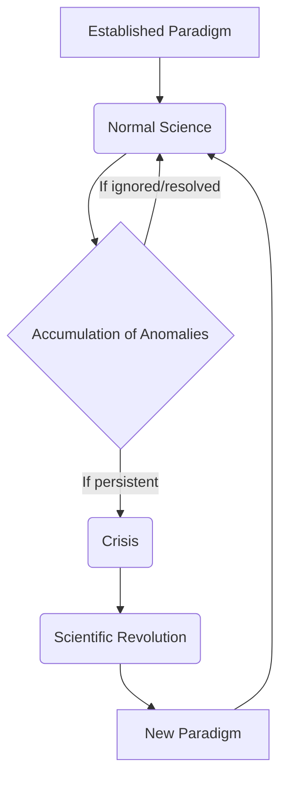

<Prerequisites itemsBase64="W3sidGl0bGUiOiJJbnRyb2R1Y3Rpb24gw6AgbGEgcGhpbG9zb3BoaWUiLCJzbHVnIjoiaW50cm9kdWN0aW9uLXBoaWxvc29waGllIiwibGV2ZWwiOiJVbml2ZXJzaXR5IFllYXIgMSIsInN1YmplY3QiOiJQaGlsb3NvcGhpZSJ9LHsidGl0bGUiOiJQZW5zw6llIGNyaXRpcXVlIGV0IGFyZ3VtZW50YXRpb24iLCJzbHVnIjoicGVuc2VlLWNyaXRpcXVlLWFyZ3VtZW50YXRpb24iLCJsZXZlbCI6IlVuaXZlcnNpdHkgWWVhciAxIiwic3ViamVjdCI6Ik3DqXRob2RvbG9naWUifV0=" />

<DiagnosticQuiz question="What is the main characteristic that distinguishes a scientific approach from a non-scientific approach, according to a general philosophical perspective?" options="The use of advanced technologies.|||The search for absolute truth.|||The ability to be falsified by experience.|||Adherence to established dogmas." sectionTitle="Introduction to the Problem of Demarcation" correctIndex="2" targetSectionId="introduction-demarcation" />

## Introduction: The Problem of Demarcation in the Philosophy of Science

The fundamental question underlying all reflection on the nature of scientific knowledge is that of **demarcation**. How do we distinguish what belongs to science from what does not? This question, far from being a mere semantic dispute, constitutes a crucial issue for the philosophy of science and, more broadly, for society. It is about understanding the criteria that allow us to separate scientific theories from metaphysical doctrines, pseudo-sciences (such as astrology or certain forms of psychoanalysis), or even simple beliefs.

The stakes of this problem are manifold. For the philosophy of science, it allows for defining its object of study and understanding the mechanisms of knowledge production and validation. For society, a clear distinction is essential for evaluating the credibility of claims, guiding evidence-based public policies, and promoting critical thinking in the face of unfounded discourse. Indeed, science is often perceived as the most reliable and objective form of knowledge, hence the importance of being able to identify what deserves this appellation.

In this lesson, we will explore the answers provided by several major figures in 20th-century epistemology. We will begin with the influential proposal of **Karl Popper** and his criterion of falsifiability. We will then examine the perspectives of **Thomas Kuhn** and **Paul Feyerabend**, who questioned the possibility of a universal and timeless demarcation criterion, paving the way for a more complex and historicized understanding of science.

<Objectives>
  <Knowledge>
    <ul className="list-disc pl-4 space-y-1">
      <li>analyze the main characteristics and historical stakes of the demarcation problem in the philosophy of science.</li>
      <li>Evaluate the relevance and limits of the criteria of scientificity proposed by different epistemologists.</li>
      <li>Distinguish scientific approaches from pseudo-scientific or non-scientific approaches by relying on theoretical frameworks.</li>
    </ul>
  </Knowledge>
  <Skills>
    <ul className="list-disc pl-4 space-y-1">
      <li>Apply epistemological criteria to evaluate the scientificity of a given theory or practice.</li>
      <li>Analyze philosophical texts dealing with the demarcation problem to extract key arguments.</li>
      <li>Develop a critical argument on the contemporary challenges posed by pseudoscience.</li>
    </ul>
  </Skills>
  <Attitudes>
    <ul className="list-disc pl-4 space-y-1">
      <li>Develop intellectual curiosity for the foundations and methods of scientific knowledge.</li>
      <li>Adopt a critical and reflective stance towards unverified or pseudo-scientific claims.</li>
      <li>Value methodological rigor and intellectual honesty in the pursuit of truth.</li>
    </ul>
  </Attitudes>
</Objectives>
## Karl Popper and the Criterion of Falsifiability
Karl Popper's (1902-1994) reflection on demarcation stemmed from his dissatisfaction with the dominant criteria of scientificity of his time, particularly inductivism and verificationism. **Inductivism** postulates that scientific theories are derived from a large number of particular observations, which then allow for the generalization of universal laws. However, as David Hume had already pointed out, no amount of singular observations can logically guarantee the truth of a universal law: the sun has risen every day until now, but that does not prove it will rise tomorrow.

**Verificationism**, promoted notably by the Vienna Circle and logical positivists, proposed that the meaning of a proposition lies in its method of empirical verification. A theory would be scientific if it could be confirmed by experience. Popper criticized this approach by pointing out that many theories, including pseudo-sciences like astrology or Freudian psychoanalysis, could always find *a posteriori* "proofs" or "confirmations" to support their claims. These theories seemed to explain every event, making their refutation impossible and, paradoxically, depriving them of any real scientific content.

Faced with these limitations, Popper proposed the **criterion of falsifiability** (or refutability) as a principle of demarcation. For a theory to be scientific, it must be formulated in such a way that it is possible to test it empirically and, potentially, to refute it. In other words, a scientific theory must take risks: it must make precise and bold predictions which, if proven false, would lead to the abandonment or modification of the theory. Falsifiability is not a criterion of truth, but a criterion of scientificity. A falsifiable theory is not necessarily false, but it is *testable*.

Popper illustrates this idea with striking examples. **Astrology**, according to him, is not falsifiable because its predictions are often vague or can be reinterpreted to fit any event. Similarly, Freud's **psychoanalysis** or **Marxism** in some of its formulations were criticized by Popper for their ability to explain any behavior or historical event *after the fact*, without ever being able to be disproven by a contrary observation. In contrast, **Einstein's theory of relativity** is an example of a scientific theory because it made very specific predictions (such as the deflection of starlight by the sun's gravitational field) that could have been falsified by observation. The fact that these predictions were confirmed strengthened the theory, but what makes it scientific is its *capacity to be falsified*.

The implications of this approach for the scientific method are profound. Science, for Popper, does not progress through the accumulation of verified truths, but through the **elimination of errors**. The scientist does not seek to confirm their theory, but to subject it to the most rigorous tests possible, actively seeking to refute it. This process of "conjectures and refutations" (or trial and error) is the engine of scientific progress. Scientific theories are therefore always provisional, hypotheses that have not yet been falsified, but which could be at any moment by a new experiment or observation.

After exploring Karl Popper's perspective on scientific demarcation through falsifiability, it is essential to turn to other approaches that have profoundly challenged this view, particularly by integrating historical and sociological dimensions.
## Thomas Kuhn and the Notion of Paradigm
Thomas Kuhn, in his major work *La structure des révolutions scientifiques*, proposes a radically different vision of scientific development, moving away from the idea of linear and cumulative progress. For Kuhn, science does not progress solely through the accumulation of discoveries or the refutation of isolated hypotheses, but through periods of stability punctuated by major ruptures.

At the heart of his theory is the notion of **paradigm**. A paradigm is not simply a theory or a set of laws; it is a disciplinary matrix shared by a scientific community at a given time. It encompasses a set of theories, laws, experimental techniques, values, problems deemed relevant, and exemplary solutions that serve as models. It is a conceptual and methodological framework that guides research and defines what is considered 'good science'.

Most scientific activity takes place under the regime of **normal science**. During this period, scientists work *within* an established paradigm. Their task is to solve 'puzzles' or 'enigmas' that the paradigm itself has defined, using the tools and concepts it provides. Normal science is a problem-solving activity, not a questioning of foundations. Anomalies, i.e., observations that do not align with the paradigm's predictions, are generally ignored, explained by minor adjustments, or considered failures of the experimenter rather than of the paradigm itself.

However, the accumulation of persistent and increasingly difficult-to-ignore anomalies can lead to a **crisis**. When confidence in the paradigm's ability to solve fundamental problems erodes, the scientific community enters a period of uncertainty and intense debate. This crisis can ultimately lead to a **scientific revolution**. A scientific revolution is a paradigm shift, a complete overturning of the worldview and scientific practices. It is not a cumulative process where the old is simply improved; rather, it is a 'conversion' or a 'Gestalt switch,' where old problems are seen in a new light, and new problems emerge.

The notion of paradigm and scientific revolution challenges Popperian demarcation and the idea of linear progress in several ways. Firstly, normal science, as described by Kuhn, is not primarily focused on falsification. On the contrary, scientists strive to make reality conform to the paradigm, not to refute it. Falsification, if it occurs, is initially treated as an anomaly, and it is only its accumulation that can potentially trigger a crisis. Secondly, paradigms are often **incommensurable**: they cannot be directly compared on neutral ground, as they define their own criteria of validity, their own problems, and their own solutions. This means that the transition from one paradigm to another is not necessarily progress towards a greater 'truth' or a better approximation of reality, but rather a change in the way of seeing and questioning the world. Scientific progress, for Kuhn, is therefore more a succession of 'better' puzzle solutions within changing frameworks than a continuous march towards objective truth.

To better understand the dynamics of scientific development according to Kuhn, here is a comparison between normal science and scientific revolution, followed by a diagram illustrating the paradigmatic cycle.

| Characteristic | Normal Science | Scientific Revolution |
| :-------------------------- | :-------------------------------------------------- | :---------------------------------------------------- |
| **Main Objective** | Solving 'puzzles' within the existing paradigm | Replacing one paradigm with a new one |
| **Nature of Activity** | Cumulative, problem-solving, 'puzzle-solving' | Non-cumulative, rupture, 'Gestalt switch' |
| **Attitude towards Anomalies** | Ignored, explained by minor adjustments, or considered experimenter failures | Accumulation of persistent anomalies, source of crisis |
| **Role of Paradigm** | Stable conceptual and methodological framework | Questioning and replacement of the framework |
| **Progress** | Progress within the paradigm (puzzle-solving) | Progress through change of perspective (incommensurability) |

## Paul Feyerabend: Against Method and Epistemological Anarchism
Pushing the critique of scientific rationality and demarcation to its extreme, Paul Feyerabend, in his provocative work *Contre la méthode*, develops a position of **epistemological anarchism**. Feyerabend rejects the very idea that there can be a universal and rational scientific method that guarantees the progress of knowledge. For him, any attempt to define fixed and universal rules for science is not only futile but also detrimental to creativity and the advancement of knowledge.

His famous slogan, « tout est bon » (*anything goes*), summarizes his radical critique. Feyerabend argues that historically, major scientific advancements have not adhered to a rigorous method, but have often proceeded through audacious violations of established rules, through opportunism, intuition, and even irrationality. He cites examples such as Galileo, who used rhetorical arguments and unconfirmed theories to defend his worldview, or the coexistence of astrology and astronomy in certain eras. For Feyerabend, imposing a single method would stifle innovation and limit the intellectual freedom of scientists.

Feyerabend's **epistemological anarchism** implies that science is not superior to other forms of knowledge (myths, religions, arts, traditional knowledge) by virtue of an intrinsically more rational or more effective method. He considers it one tradition among others, with its own dogmas, its own prejudices, and its own limitations. He advocates for a separation of science and the state, to prevent science from becoming a dominant and oppressive ideology.

The implications of this position for scientific rationality and the problem of demarcation are profound. If « tout est bon » (*anything goes*), then there is no longer a distinctive criterion to separate science from non-science. Demarcation becomes an illusory problem, as there is no fixed boundary or universal method to defend. Scientific rationality, far from being a monolithic entity, is deconstructed into a multitude of contextual and often contradictory practices. Feyerabend invites us to embrace methodological and theoretical pluralism, where freedom and creativity take precedence over conformity to arbitrary rules. His thought is an invitation to caution against all forms of dogmatism, including that which would adorn itself with the trappings of science.

To better contextualize Feyerabend's radical position, here is a comparison with a more traditional view of science.

| Characteristic | Traditional View of Science (e.g., Popper) | Epistemological Anarchism (Feyerabend) |
| :-------------------------- | :--------------------------------------------------- | :---------------------------------------------------- |
| **Scientific Method** | Unique, universal, rational (e.g., falsification) | No universal method, « tout est bon » (*anything goes*) |
| **Scientific Progress** | Linear, cumulative, by elimination of errors | Non-linear, opportunistic, by violations of rules |
| **Science/Other Knowledge Relationship** | Science superior by its method and rationality | Science is one tradition among others, no intrinsic superiority |
| **Demarcation Criterion** | Exist (e.g., falsifiability) | Illusory, no fixed boundary or universal method |
| **Role of Rationality** | Fundamental, guides research | Often hindering, creativity takes precedence |
## Contemporary Debates and Limits of the Demarcation Problem
The confrontation of the theses of Popper, Kuhn, and Feyerabend reveals the scope and complexity of the demarcation problem, transforming the quest for a unique criterion into a profound philosophical debate on the very nature of scientific knowledge. Karl Popper, with his proposal of falsifiability, sought to establish a clear and logical dividing line, distinguishing science by its capacity to be refuted. For him, scientific progress is rational and cumulative, proceeding by the elimination of false theories. Thomas Kuhn, on the other hand, introduced a historical and sociological perspective, showing that science progresses not through linear accumulation, but through "scientific revolutions" that see the replacement of one "paradigm" by another. This vision highlights the incommensurability of theories and the role of non-purely logical factors (social, psychological) in scientific change, making demarcation more contextual and less universal. Finally, Paul Feyerabend, pushing criticism to its extreme, challenged the very existence of a universal and superior scientific method, advocating an "epistemological anarchism" where "anything goes." For Feyerabend, science is one tradition among others, and the search for a demarcation criterion is an illusory and potentially dogmatic undertaking.

To better understand the nuances of these approaches, the following table compares their positions on scientific demarcation:

| Philosopher | Demarcation Criterion | Nature of Scientific Progress | Limitations/Implications |
| :--------- | :--------------------- | :----------------------------- | :------------------- |
| Karl Popper | Falsifiability (refutability) | Rational, cumulative, by elimination of errors | Struggles to account for "normal science"; idealization of scientific practice. |
| Thomas Kuhn | Paradigm shift (revolution) | Non-linear, discontinuous, by ruptures (scientific revolutions) | Potential relativism; difficulty in explaining inter-paradigmatic progress. |
| Paul Feyerabend | No universal criterion ("anything goes") | Anarchic, creative, without a unique method | Risk of confusion between science and non-science; radical critique of scientific rationality. |

These fundamental divergences highlight the inherent limits and difficulties in the search for a unique and universal demarcation criterion. Scientific practice is too diverse, historically contingent, and contextually dependent to be confined to a rigid definition. Attempts to define science by a set of necessary and sufficient conditions encounter historical counter-examples or the arbitrary exclusion of legitimate disciplines. For example, Popperean falsifiability struggles to account for Kuhnian normal science, where scientists work to solve puzzles within an established paradigm rather than to refute it. Similarly, Kuhn's approach, though more nuanced, has been criticized for its potential relativism and the difficulty in explaining inter-paradigmatic progress. Feyerabend's radical position, though provocative, has the merit of reminding us that creativity and intellectual freedom are essential drivers of discovery, often beyond prescribed methodological frameworks.

Current perspectives on the nature of science tend to move away from the quest for a strict demarcation criterion in favor of a more nuanced and pluralistic understanding. Rather than seeking an "essence" of science, many contemporary epistemologists adopt a more pragmatic and descriptive approach. They recognize the plurality of scientific methods, adapted to various objects of study and disciplinary contexts. Science is now often understood as a complex enterprise, characterized by a set of "family resemblances" (to borrow a Wittgensteinian analogy) rather than by defined and exclusive properties. These resemblances include commitment to empirical observation, the formulation of testable hypotheses, the revisability of theories, critical discussion within peer communities, and a certain form of rationality, even if it is not always that of pure logic. The focus is on the dynamics of scientific practices, their evolution, and their interaction with social, technological, and ethical contexts. The problem of demarcation does not disappear, but it transforms: it is less about drawing an insurmountable line than about understanding the mechanisms by which certain forms of knowledge acquire epistemic authority and recognized reliability, while remaining open to criticism and revision.

## Conclusion
This journey through the theories of Popper, Kuhn, and Feyerabend has highlighted the complexity and persistent challenges posed by the question "What is science?". Initially formulated as a problem of demarcation aimed at distinguishing science from pseudoscience by a logical and universal criterion, this problem has progressively become richer and more complex. From Popperian falsifiability, which offered an elegant but sometimes reductionist solution, we moved to Kuhn's historicist and sociological vision, which revealed the importance of paradigms, revolutions, and non-strictly rational factors. Finally, Feyerabend's epistemological anarchism radically questioned the very idea of a unique and superior scientific method, advocating for methodological pluralism and creative freedom. These different approaches, though contradictory, converge to show that there is no simple or monolithic definition of science, and that its nature is intrinsically dynamic and evolving.

The definition of science thus remains an open and dynamic debate, essential for understanding its role and limits in the contemporary world. In the age of information and disinformation, the ability to distinguish reliable scientific knowledge from unfounded claims is more crucial than ever. However, this distinction can no longer rely on a single, timeless criterion, but must be based on a nuanced understanding of scientific practices, their contexts, their plural methods, and their self-correction mechanisms. Science is a human enterprise, subject to error, the influence of values, and social constraints, but also endowed with a unique capacity to generate reliable knowledge and transform our understanding of the world. Recognizing this complexity also means recognizing the need for constant critical vigilance, both towards pseudoscientific claims and towards any dogmatism that would adorn itself with the trappings of science.

<WhatsNext itemsBase64="W10=" />
## Self-assessment

<Quiz durationLimit={600}>
    <Question q="What is the central problem of demarcation in the philosophy of science?" explanation="The problem of demarcation aims to establish a criterion to distinguish what belongs to science from what does not, particularly pseudo-sciences or metaphysical systems.">
  <Option text="Distinguishing science from technology." correct={false} />
  <Option text="Distinguishing science from non-science (including pseudo-science and metaphysics)." correct={true} />
  <Option text="Determining the validity of scientific theories." correct={false} />
  <Option text="Separating natural sciences from humanities." correct={false} />
</Question>
    <Question q="According to Karl Popper, what is the main criterion that distinguishes a scientific theory from a non-scientific theory?" explanation="Karl Popper proposed falsifiability as a criterion of demarcation. A theory is scientific if it can be potentially refuted by experience.">
  <Option text="Its empirical verifiability." correct={false} />
  <Option text="Its ability to be confirmed by numerous observations." correct={false} />
  <Option text="Its falsifiability (or refutability)." correct={true} />
  <Option text="Its internal logical consistency." correct={false} />
</Question>
    <Question q="What is a 'paradigm' according to Thomas Kuhn?" explanation="For Kuhn, a paradigm is a disciplinary matrix that encompasses theories, methods, values, and examples of solved problems that are shared by a scientific community.">
  <Option text="An isolated scientific hypothesis." correct={false} />
  <Option text="A set of fundamental laws and theories accepted by a scientific community at a given time, including methods and values." correct={true} />
  <Option text="A crucial experiment that validates a theory." correct={false} />
  <Option text="A mathematical model for predicting phenomena." correct={false} />
</Question>
    <Question q="What is the main criticism leveled against inductivism as a foundation of science?" explanation="The problem of induction, highlighted by Hume, is that it is impossible to logically justify the transition from particular observations to universal general laws.">
  <Option text="It does not allow for the formulation of universal laws." correct={false} />
  <Option text="It is too costly in terms of experimentation." correct={false} />
  <Option text="The problem of induction: no finite quantity of observations can guarantee the truth of a universal generalization." correct={true} />
  <Option text="It is incompatible with deductive logic." correct={false} />
</Question>
    <Question q="Among the following propositions, which one is an example of pseudo-science according to Popper's criteria?" explanation="Astrology is often cited by Popper as an example of pseudo-science because its predictions are formulated in such a way as to be irrefutable, or are so vague that they can always be interpreted as true.">
  <Option text="Einstein's theory of relativity." correct={false} />
  <Option text="Astrology." correct={true} />
  <Option text="Evolutionary biology." correct={false} />
  <Option text="Quantum physics." correct={false} />
</Question>
    <Question q="What role do 'scientific revolutions' play in Thomas Kuhn's theory?" explanation="Scientific revolutions are episodes of non-cumulative development during which an old paradigm is replaced in whole or in part by a new one, incompatible with the old.">
  <Option text="They are minor adjustments within an existing paradigm." correct={false} />
  <Option text="They represent a radical, often non-cumulative, paradigm shift." correct={true} />
  <Option text="They confirm the validity of a paradigm." correct={false} />
  <Option text="They are periods of research stagnation." correct={false} />
</Question>
    <Question q="What criterion did the logical positivists of the Vienna Circle emphasize for the meaning of scientific statements?" explanation="Logical positivists argued that the meaning of a scientific statement lies in its method of empirical verification. If a statement cannot be verified (even in principle) by experience, it is considered cognitively meaningless.">
  <Option text="Narrative coherence." correct={false} />
  <Option text="Empirical verifiability." correct={true} />
  <Option text="Philosophical intuition." correct={false} />
  <Option text="Agreement with sacred texts." correct={false} />
</Question>
    <Question q="Which of these statements is closest to Popper's position regarding 'truth' in science?" explanation="Popper believed that science can never prove the truth of a theory, but that it progresses by eliminating false theories through falsification, thus approaching truth without ever definitively reaching it.">
  <Option text="Science aims to prove the absolute truth of its theories." correct={false} />
  <Option text="Science can never reach truth, only increasingly falsifiable and not yet falsified theories." correct={true} />
  <Option text="Truth is subjective and depends on the scientist." correct={false} />
  <Option text="Truth is determined by the consensus of the scientific community." correct={false} />
</Question>
</Quiz>

### Glossary

- **Epistemology** : A branch of philosophy that studies scientific knowledge, its methods, foundations, nature, and scope. It questions what we can know and how we know it.
- **Falsifiability** : A criterion proposed by Karl Popper, according to which a theory is scientific if it can be potentially refuted or invalidated by observation or experimentation. A non-falsifiable theory is not considered scientific.
- **Logical Positivism** : A philosophical movement of the early 20th century, notably the Vienna Circle, which held that only empirically or analytically verifiable propositions are meaningful. They proposed verifiability as a criterion of demarcation.
- **Paradigm** : A concept introduced by Thomas Kuhn, referring to a set of theories, methods, values, and practices shared by a scientific community at a given time, which guides research and problem-solving.
- **Problem of Demarcation** : A fundamental question in the philosophy of science that aims to establish a criterion to distinguish science from non-science, pseudoscience, or metaphysics.

### References

<References itemsBase64="W3sibnVtIjoxLCJ0ZXh0IjoiTW9uc2lldXIgUGhpLiAyMDE4LiDCqyBRdSdlc3QtY2UgcXVlIGxhIHNjaWVuY2UgPyAodmlkw6lvKSDCuy4iLCJzY2hvbGFyVXJsIjoiaHR0cHM6Ly9ib29rcy5nb29nbGUuY29tL2Jvb2tzP3E9TW9uc2lldXIlMjBQaGklMjAlMjJRdSdlc3QlMjIlMjAyMDE4Iiwic2Nob2xhclRleHQiOiJHb29nbGUgQm9va3MiLCJpc1VudXNlZCI6dHJ1ZX1d" />