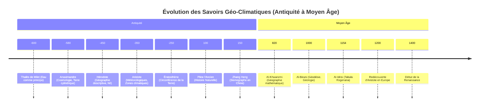
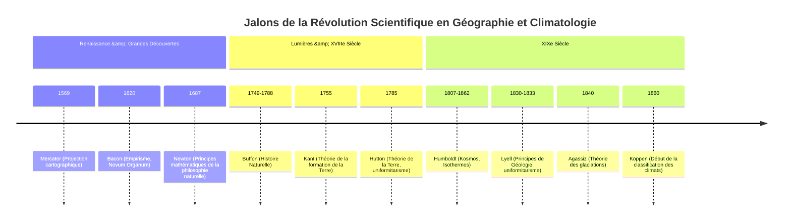

<Prerequisites itemsBase64="W3sidGl0bGUiOiJJbnRyb2R1Y3Rpb24gw6AgbGEgR8Opb2xvZ2llIiwic2x1ZyI6ImludHJvLWdlb2xvZ2llIiwibGV2ZWwiOiJMMSIsInN1YmplY3QiOiJHw6lvc2NpZW5jZXMifSx7InRpdGxlIjoiRm9uZGFtZW50YXV4IGRlIGxhIENsaW1hdG9sb2dpZSIsInNsdWciOiJmb25kYW1lbnRhdXgtY2xpbWF0b2xvZ2llIiwibGV2ZWwiOiJMMiIsInN1YmplY3QiOiJDbGltYXRvbG9naWUifSx7InRpdGxlIjoiw4lwaXN0w6ltb2xvZ2llIGRlcyBTY2llbmNlcyIsInNsdWciOiJlcGlzdGVtb2xvZ2llLXNjaWVuY2VzIiwibGV2ZWwiOiJMMiIsInN1YmplY3QiOiJQaGlsb3NvcGhpZSBkZXMgU2NpZW5jZXMifV0=" />

<DiagnosticQuiz question="Quelle periode geologique est caracterisee par l'emergence des premieres formes de vie complexes et une diversification rapide des especes, souvent associee a une augmentation significative de l'oxygene atmospherique?" options="Précambrien|||Paléozoïque|||Mésozoïque|||Cénozoïque" correctIndex="1" targetSectionId="section-1-contexte-historique" sectionTitle="Contexte historique et geologique" />

## Introduction : Cadre épistémologique et historique
Ce cours, « Genèse et évolution des sciences de la Terre et du climat », se propose d'explorer les fondements historiques et épistémologiques de deux disciplines scientifiques majeures : la géographie physique et la climatologie. Loin d'être une simple énumération de faits et de découvertes, notre démarche vise à comprendre comment ces champs de savoirs se sont constitués, ont évolué, et continuent de se transformer sous l'impulsion de nouvelles observations, de paradigmes théoriques émergents et d'avancées technologiques. L'objectif est de retracer cette genèse complexe, depuis les premières interrogations humaines face aux phénomènes naturels jusqu'aux modèles sophistiqués de la science contemporaine, en passant par les ruptures conceptuelles et les continuités intellectuelles qui ont jalonné leur parcours.

La <ConceptLink id="geographie_physique" name="geographie physique" term="geographie physique">géographie physique</ConceptLink> est la branche de la géographie qui étudie les processus et les formes naturelles de la surface terrestre. Elle englobe des sous-disciplines telles que la géomorphologie (étude des reliefs), l'hydrologie (étude de l'eau), la biogéographie (étude de la répartition des espèces), la pédologie (étude des sols) et, bien sûr, la climatologie. Son champ d'investigation est vaste, allant de l'analyse des dynamiques fluviales et glaciaires à la compréhension de la formation des montagnes et des océans, en passant par l'étude des écosystèmes terrestres. Comme le soulignent Strahler et Strahler (2006) , la géographie physique cherche à expliquer la distribution spatiale des phénomènes naturels et leurs interactions, offrant une perspective holistique sur l'environnement terrestre.

La <ConceptLink id="climatologie" name="climatologie" term="climatologie">climatologie</ConceptLink>, quant à elle, est la science qui étudie le climat, c'est-à-dire l'ensemble des conditions météorologiques moyennes et extrêmes caractérisant une région donnée sur une longue période. Elle s'intéresse aux processus atmosphériques, aux bilans énergétiques, aux cycles de l'eau et du carbone, ainsi qu'aux interactions complexes entre l'atmosphère, les océans, les surfaces continentales et la biosphère. Viers (1990)  met en évidence la nécessité de distinguer la climatologie de la météorologie, cette dernière se concentrant sur les phénomènes atmosphériques à court terme. La climatologie, en revanche, analyse les régimes climatiques, leurs variations naturelles et anthropiques, et leurs impacts sur les systèmes terrestres et humains. Dans le contexte actuel, la compréhension du changement climatique global, tel que documenté par le GIEC (2021) , place la climatologie au cœur des préoccupations scientifiques et sociétales.

Notre approche sera résolument épistémologique et historique. L'<Glossary id="epistemologie" name="epistemologie" term="epistemologie">épistémologie</Glossary>, ou philosophie des sciences, nous permettra d'examiner comment les connaissances en géographie physique et en climatologie ont été construites, validées et parfois remises en question. Nous nous interrogerons sur la nature des preuves, la validité des méthodes, l'influence des cadres conceptuels et des instruments sur la production du savoir. Il ne s'agit pas seulement de savoir *ce* qui a été découvert, mais *comment* cela a été découvert et *pourquoi* certaines idées ont prévalu sur d'autres à des moments donnés de l'histoire. Cette perspective critique est essentielle pour comprendre la robustesse et les limites de nos connaissances actuelles. L'approche historique, quant à elle, nous plongera dans le contexte social, culturel et technologique dans lequel ces sciences ont émergé et se sont développées. Elle montrera que la science n'est jamais un processus linéaire et isolé, mais qu'elle est profondément ancrée dans son époque, influencée par les visions du monde, les besoins des sociétés et les outils disponibles. En retraçant cette trajectoire, nous mettrons en lumière les continuités, les ruptures, les erreurs et les géniales intuitions qui ont façonné notre compréhension de la Terre et de son climat.

Ce cours est donc une invitation à une réflexion profonde sur la nature de la connaissance scientifique elle-même, à travers le prisme des sciences de la Terre et du climat. Il s'adresse aux étudiants de L3 en géographie, leur offrant les clés pour appréhender la complexité de leur discipline et les défis qu'elle doit relever face aux enjeux environnementaux contemporains.

<Objectives>
  <Knowledge>
    <ul className="list-disc pl-4 space-y-1">
      <li>analyser les grandes étapes de la formation et de l'évolution de la Terre et de son atmosphère.</li>
      <li>Évaluer les théories majeures qui ont marqué l'histoire des sciences de la Terre et du climat.</li>
      <li>Distinguer les contributions des figures clés dans le développement de la géologie et de la climatologie.</li>
    </ul>
  </Knowledge>
  <Skills>
    <ul className="list-disc pl-4 space-y-1">
      <li>Évaluer la validité et la pertinence des données historiques et paléoclimatiques.</li>
      <li>analyser l'interdépendance entre les processus géologiques et les changements climatiques à travers les âges.</li>
      <li>Créer une chronologie critique des découvertes scientifiques ayant façonné notre compréhension du système Terre.</li>
    </ul>
  </Skills>
  <Attitudes>
    <ul className="list-disc pl-4 space-y-1">
      <li>Évaluer de manière critique les paradigmes scientifiques passés et présents en géosciences et climatologie.</li>
      <li>analyser l'évolution des méthodes scientifiques et leur impact sur la compréhension des phénomènes terrestres.</li>
      <li>Formuler une perspective éclairée sur les défis épistémologiques rencontrés par les sciences de la Terre et du climat.</li>
    </ul>
  </Attitudes>
</Objectives>

## Des Premières Observations aux Savoirs Antiques et Médiévaux

L'histoire de la compréhension des phénomènes terrestres et climatiques est aussi ancienne que l'humanité elle-même. Dès l'aube des civilisations, les sociétés humaines ont cherché à interpréter les rythmes de la nature – les crues des fleuves, les cycles des saisons, les mouvements des astres, les tremblements de terre – pour assurer leur survie, organiser l'agriculture et donner un sens au monde qui les entourait. Ces premières tentatives, souvent mêlées de mythes et de croyances religieuses, constituent les prémices de ce qui deviendra plus tard la géographie physique et la climatologie.

Dans les civilisations de la **Mésopotamie** et de l'**Égypte ancienne**, l'observation des phénomènes naturels était intrinsèquement liée aux impératifs agricoles et à l'organisation sociale. Les crues annuelles du Nil, par exemple, étaient d'une importance capitale pour l'agriculture égyptienne. Les prêtrès et les scribes développèrent des systèmes d'observation précis pour prédire ces crues, établissant des calendriers basés sur les cycles lunaires et solaires. Bien que ces connaissances fussent empiriques et pragmatiques, elles démontrent une capacité d'observation systématique et une tentative de corrélation entre les événements célestes et terrestres. Les Mésopotamiens, quant à eux, ont laissé des milliers de tablettes d'argile documentant des observations astronomiques détaillées, qui servaient également à des fins divinatoires et calendaires, mais qui posaient les bases d'une compréhension des cycles naturels.

C'est avec la **Grèce antique** que l'on assiste à l'émergence d'une pensée plus systématique et rationnelle, cherchant à expliquer le monde par des principes naturels plutôt que par des interventions divines. Les philosophes présocratiques, tels que <RealPerson id="thales" name="Thales de Milet" term="Thales de Milet">Thalès de Milet</RealPerson> (VIe siècle av. J.-C.), sont souvent considérés comme les premiers à avoir tenté d'expliquer les phénomènes naturels sans recourir au surnaturel. Thalès aurait postulé que l'eau était l'élément primordial de toutes choses, une première tentative d'unification des phénomènes naturels. <RealPerson id="anaximandre" name="Anaximandre" term="Anaximandre">Anaximandre</RealPerson> (VIe siècle av. J.-C.), son disciple, proposa une cosmologie où la Terre était un cylindre flottant dans l'espace, et tenta d'expliquer les phénomènes météorologiques comme le tonnerre et les éclairs.

<RealPerson id="herodote" name="Herodote" term="Herodote">Hérodote</RealPerson> (Ve siècle av. J.-C.), souvent appelé le « père de l'histoire », fut aussi un géographe avant l'heure. Ses « Histoires » contiennent de nombreuses descriptions de paysages, de climats et de peuples, notamment une analyse détaillée du Nil et de ses crues, qu'il attribue à des causes naturelles (vents égyptiens empêchant l'eau de la mer de remonter le fleuve) plutôt qu'à des interventions divines. Il décrit également les variations climatiques entre différentes régions, posant les bases d'une géographie descriptive.

Cependant, c'est <RealPerson id="aristote" name="Aristote" term="Aristote">Aristote</RealPerson> (IVe siècle av. J.-C.) qui a eu l'impact le plus profond et durable sur la pensée occidentale concernant les sciences de la Terre et du climat. Son œuvre « Météorologiques » (ou « Météorologie ») est considérée comme le premier traité systématique sur les phénomènes atmosphériques et terrestres. Dans cet ouvrage, Aristote aborde une multitude de sujets : la formation des nuages et de la pluie, le vent, la foudre, les tremblements de terre, les comètes, les rivières et les mers. Il y développe une vision du monde basée sur quatre éléments (terre, eau, air, feu) et quatre qualités (chaud, froid, sec, humide), qui interagissent pour produire les phénomènes naturels. Il postule l'existence de zones climatiques (torride, tempérées, froides) basées sur l'inclinaison des rayons solaires, une idée qui perdurera pendant des siècles. Bien que beaucoup de ses explications fussent erronées au regard de la science moderne (par exemple, sa théorie des exhalaisons terrestres pour expliquer les vents et les tremblements de terre), son approche systématique et sa tentative de classification ont marqué un tournant. Son influence fut telle qu'elle domina la pensée scientifique pendant près de deux millénaires.

Aristote, dans sa « Météorologie », ne se contentait pas d'observations. Il tentait d'expliquer des phénomènes complexes comme la formation des arcs-en-ciel, la rosée ou la grêle. Il pensait que les tremblements de terre étaient causés par des vents emprisonnés sous la terre, cherchant à s'échapper. Bien que cette explication soit fausse, elle illustre sa volonté de trouver des causes naturelles et mécaniques aux événements, plutôt que de les attribuer à la colère des dieux.

Un autre géant de l'Antiquité grecque fut <RealPerson id="eratosthene" name="Eratosthene" term="Eratosthene" unresolved={true}>Ératosthène</RealPerson> (IIIe siècle av. J.-C.), qui est célèbre pour avoir calculé la circonférence de la Terre avec une précision remarquable pour son époque. En utilisant la géométrie et des observations de l'ombre du soleil à Syène (Assouan) et Alexandrie, il démontra non seulement que la Terre était sphérique, mais il en estima la taille, une avancée majeure pour la cartographie et la compréhension de la planète. Ses travaux, bien que plus géodésiques que purement géographiques physiques, ont jeté les bases d'une représentation plus exacte de la Terre.

La **Rome antique**, bien que moins portée sur la spéculation philosophique que la Grèce, a excellé dans l'ingénierie et l'application pratique des connaissances géographiques. Les Romains étaient d'excellents arpenteurs, constructeurs de routes, d'aqueducs et de villes, nécessitant une connaissance approfondie du terrain, de l'hydrologie et des ressources naturelles. Des auteurs comme Pline l'Ancien (Ier siècle ap. J.-C.) dans son « Histoire naturelle » ont compilé une somme considérable de connaissances sur la géographie, la zoologie, la botanique et la minéralogie, bien que souvent sans esprit critique et en mélangeant faits et légendes. Leurs contributions furent plus dans la description et l'organisation du territoire que dans l'élaboration de théories fondamentales sur les processus terrestres.

Parallèlement, d'autres civilisations développaient leurs propres corpus de savoirs. En **Chine**, les observations astronomiques et météorologiques étaient d'une précision étonnante et d'une continuité inégalée. Dès le IIe siècle av. J.-C., des registres détaillés des phénomènes météorologiques (pluie, neige, vent, sécheresse) étaient tenus. Les Chinois ont développé des instruments sophistiqués, comme le sismographe de Zhang Heng (IIe siècle ap. J.-C.), capable de détecter la direction des tremblements de terre. Ils comprenaient les mécanismes des moussons et l'influence des cycles climatiques sur l'agriculture. Leurs cartes étaient souvent très détaillées et précises, intégrant des informations topographiques et hydrologiques. La pensée chinoise, avec des concepts comme le *Feng Shui*, intégrait également une compréhension des interactions entre l'homme et son environnement, bien que sous une forme différente de la science occidentale.

<Image description="Un vase en bronze finement ouvrage et orne, peut-etre une replique de l'ancien sismographe chinois invente par Zhang Heng. L'image devrait mettre en evidence les dragons a l'exterieur et les crapauds en dessous, avec une petite bille tombant de la bouche d'un dragon dans la bouche d'un crapaud. Le cadre devrait evoquer la Chine ancienne, peut-etre avec des outils d'erudit ou des rouleaux en arriere-plan." alt="Sismographe chinois ancien, un recipient en bronze avec des dragons et des crapauds." caption="Figure 1 : Cette illustration represente le sismographe de Zhang Heng, une invention remarquable datant de 132 apres J.-C. qui a demontre une comprehension precoce de l'activite sismique et de la dynamique interne de la Terre, precedant la sismologie occidentale de plus d'un millenaire. Sa conception reflete une ingenierie sophistiquee et une science de l'observation. — Source: Photo by [腾云 孙](https://unsplash.com/@sakyamel?utm_source=OpenPrimer&utm_medium=referral) on [Unsplash](https://unsplash.com/?utm_source=OpenPrimer&utm_medium=referral)" title="Seismograph de Zhang Heng" src="https://images.unsplash.com/photo-1640518119883-56350966aef7?crop=entropy&cs=tinysrgb&fit=max&fm=jpg&ixid=M3w5ODcyMjJ8MHwxfHNlYXJjaHwxfHxTaXNtb2dyYXBoZSUyMGNoaW5vaXMlMjBhbmNpZW4lMkMlMjB1biUyMHJlY2lwaWVudCUyMGVuJTIwYnJvbnplJTIwYXZlYyUyMGRlcyUyMGRyYWdvbnMlMjBldCUyMGRlcyUyMGNyYXBhdWRzLnxlbnwwfHx8fDE3ODM0NTUwODZ8MA&ixlib=rb-4.1.0&q=80&w=1080" isIllustration={true} />
Sismographe de Zhang Heng (IIe siècle ap. J.-C.), un exemple précoce d'instrumentation scientifique pour l'étude des phénomènes terrestres.

Avec le déclin de l'Empire romain en Occident, une grande partie des savoirs grecs fut perdue ou oubliée en Europe. Cependant, ces connaissances furent préservées, traduites et enrichies dans le **monde arabe** durant l'Âge d'or islamique (du VIIIe au XIIIe siècle). Les savants musulmans, héritiers des traditions grecques, persanes et indiennes, ont apporté des contributions majeures à l'astronomie, à la géographie et aux sciences de la Terre.
Des figures comme Al-Khwarizmi (IXe siècle) ont systématisé la géographie mathématique. Al-Biruni (Xe-XIe siècle) fut un polymathe exceptionnel, dont les travaux en géodésie lui permirent de calculer le rayon de la Terre avec une grande précision. Il a également développé des théories sur la formation des montagnes et l'érosion, reconnaissant la lenteur des processus géologiques et l'ancienneté de la Terre. Il a même suggéré que certaines terres avaient été autrefois des mers, une idée révolutionnaire pour l'époque.
Al-Idrisi (XIIe siècle), géographe et cartographe, a créé l'une des cartes du monde les plus complètes et précises de son temps, le « Tabula Rogeriana », basée sur des informations recueillies auprès de voyageurs et de marchands. Ces savants ne se contentaient pas de traduire ; ils critiquaient, corrigeaient et ajoutaient de nouvelles observations et théories, jetant les bases de l'approche scientifique moderne.

Le **Moyen Âge européen** (Ve-XVe siècle) est souvent perçu comme une période de stagnation scientifique en Occident, en particulier après la chute de l'Empire romain. La pensée était dominée par la théologie chrétienne, et les explications des phénomènes naturels étaient souvent subordonnées aux doctrines religieuses. Cependant, il serait erroné de parler d'une absence totale de savoirs. Les monastères ont joué un rôle crucial dans la préservation des textes antiques, et la scolastique a tenté de concilier la raison et la foi, intégrant parfois des éléments de la science aristotélicienne.
Les connaissances géographiques étaient principalement descriptives, basées sur les récits de pèlerins et de marchands, et souvent déformées par des considérations religieuses (par exemple, les cartes *Mappa Mundi* plaçant Jérusalem au centre du monde). La sphéricité de la Terre, bien que connue des érudits, n'était pas une idée universellement acceptée ou même jugée pertinente par tous.
Cependant, à partir du XIIe siècle, la traduction des textes arabes et grecs (souvent via l'Espagne musulmane) a progressivement réintroduit en Europe les savoirs antiques, y compris les œuvres d'Aristote et d'Ératosthène. Cette redécouverte a stimulé un renouveau intellectuel, posant les jalons pour les développements ultérieurs de la Renaissance. Les limites des connaissances de l'époque étaient principalement dues à l'absence d'instruments de mesure précis, à la difficulté des voyages et de la communication, et à un cadre conceptuel souvent contraint par des interprétations religieuses ou philosophiques dogmatiques. Néanmoins, la curiosité humaine et le besoin de comprendre le monde n'ont jamais cessé, jetant les bases, même modestes, des futures révolutions scientifiques.

<Mermaid caption="Figure 2 : " chart={`timeline
    title Évolution de la Géographie et de la Climatologie (Antiquité - Moyen Âge)
    section Antiquité Grecque
        280 av. J.-C. : Ératosthène calcule la circonférence de la Terre
        132 av. J.-C. : Hipparque développe la cartographie céleste
    section Empire Romain
        77 apr. J.-C. : Pline l'Ancien publie 'Histoire Naturelle'
        150 apr. J.-C. : Ptolémée rédige 'Géographie'
    section Moyen Âge Islamique
        IXe siècle : Al-Khwarizmi et la géographie mathématique
        XIIe siècle : Al-Idrisi et la 'Tabula Rogeriana'
    section Moyen Âge Européen
        XIIIe siècle : Marco Polo et les récits de voyage
        XIVe siècle : Ibn Battuta et l'exploration du monde`} />

Chronologie des figures et des contributions majeures aux sciences de la Terre et du climat de l'Antiquité au Moyen Âge.

En somme, cette période, des premières observations aux savoirs antiques et médiévaux, est caractérisée par une transition progressive de l'explication mythologique à une approche plus rationnelle et systématique. Les civilisations antiques ont posé les premières pierres de l'observation et de la classification, tandis que le monde arabe a agi comme un pont essentiel, préservant et enrichissant ces savoirs avant leur réintroduction en Europe. Les limites étaient évidentes – manque d'instruments, de méthodes expérimentales rigoureuses, et de cadres théoriques unifiés – mais la soif de connaissance et la capacité d'observation ont jeté les bases sur lesquelles les futures générations de savants allaient bâtir.

## La Révolution Scientifique et l'Émergence de la Géographie physique et de la Climatologie

Le passage du Moyen Âge à la Renaissance marque une rupture épistémologique fondamentale, jetant les bases de ce que l'on nommera plus tard la Révolution Scientifique. Cette période est caractérisée par un abandon progressif des dogmes et des spéculations métaphysiques au profit de l'observation systématique, de l'expérimentation et de la théorisation. La redécouverte des textes antiques, notamment ceux de Ptolémée, combinée aux grandes explorations maritimes, a stimulé un besoin impérieux de cartographie précise et de compréhension des phénomènes naturels. Les voyages de découverte ont non seulement élargi l'horizon géographique, mais ont aussi confronté les savants à une diversité de climats, de paysages et de faunes, remettant en question les classifications héritées et encourageant une approche empirique.

Au XVIIe et XVIIIe siècles, l'esprit des Lumières, avec son culte de la raison et de l'empirisme, a profondément influencé le développement des sciences de la Terre et du climat. Des figures emblématiques ont émergé, dont les travaux ont structuré les disciplines naissantes.

<Mermaid caption="Figure 3 : " chart={`timeline
    title La Révolution Scientifique et les Sciences de la Terre
    section XVIe Siècle
        1543 : Copernic et l'héliocentrisme
        1570 : Ortelius publie le premier atlas moderne
    section XVIIe Siècle
        1609 : Galilée utilise le télescope pour l'astronomie
        1687 : Newton publie 'Principia Mathematica'
    section XVIIIe Siècle
        1749 : Buffon publie 'Histoire Naturelle' (début)
        1785 : Hutton propose le concept d'uniformitarisme`} />

Chronologie des figures et des contributions majeures aux sciences de la Terre et du climat de la Renaissance au XIXe siècle.

<RealPerson id="buffon" name="Georges-Louis Leclerc, Comte de Buffon" term="Georges-Louis Leclerc, Comte de Buffon">Georges-Louis Leclerc, Comte de Buffon</RealPerson> (1707-1788), naturaliste et encyclopédiste français, est une figure centrale de cette période. Son œuvre monumentale, l'«Histoire Naturelle, générale et particulière», a tenté de synthétiser toutes les connaissances de son temps sur le monde naturel. Buffon a été l'un des premiers à proposer une histoire de la Terre basée sur des processus naturels, estimant son âge à des dizaines de milliers d'années, bien au-delà des chronologies bibliques. Ses travaux ont mis en lumière l'importance de l'érosion, de la sédimentation et des forces internes dans la formation des paysages, posant les prémices de la géomorphologie. Il a également abordé la question de l'influence du climat sur la distribution des espèces.

Un autre géant de cette époque est <RealPerson id="humboldt" name="Alexander von Humboldt" term="Alexander von Humboldt">Alexander von Humboldt</RealPerson> (1769-1859). Considéré comme le père de la géographie physique moderne et de la climatologie, Humboldt a mené des explorations scientifiques sans précédent en Amérique du Sud. Son approche était holistique, cherchant à comprendre les interconnexions entre les phénomènes géologiques, climatiques, botaniques et zoologiques. Il a introduit le concept d'isothermes, des lignes reliant les points de même température moyenne, révolutionnant la représentation et l'analyse des climats à l'échelle mondiale. Son œuvre majeure, «Kosmos», est une tentative ambitieuse de décrire l'univers physique dans son ensemble, soulignant l'unité de la nature. 

<Image description="Une carte historique, peut-etre une reproduction de la carte des isothermes de 1817 d'Alexander von Humboldt. La carte devrait clairement montrer des lignes reliant des points de temperature moyenne egale, illustrant son travail pionnier en climatologie comparative. Le style devrait refleter la cartographie du debut du XIXe siecle, avec un accent sur la visualisation de donnees scientifiques." alt="Carte isotherme d'Alexander von Humboldt de 1817." caption="Figure 4 : *Cette carte historique, pionniere dans la representation des isothermes, illustre la méthode revolutionnaire d'Alexander von Humboldt pour visualiser les variations de temperature à travers le globe. Elle marque une etape fondamentale dans le developpement de la climatologie moderne et de la geographie comparative.* — Source: Photo by [The New York Public Library](https://unsplash.com/@nypl?utm_source=OpenPrimer&utm_medium=referral) on [Unsplash](https://unsplash.com/?utm_source=OpenPrimer&utm_medium=referral)" title="Carte des Isothermes de Humboldt" src="https://images.unsplash.com/photo-1737317313212-e80f3fbeb5dc?crop=entropy&cs=tinysrgb&fit=max&fm=jpg&ixid=M3w5ODcyMjJ8MHwxfHNlYXJjaHwxfHxDYXJ0ZSUyMGlzb3RoZXJtZSUyMGQlMjdBbGV4YW5kZXIlMjB2b24lMjBIdW1ib2xkdCUyMGRlJTIwMTgxNy58ZW58MHx8fHwxNzgzNDUyNjg4fDA&ixlib=rb-4.1.0&q=80&w=1080" isIllustration={true} />
Carte des isothermes de Humboldt (reconstitution ou exemple typique).

Lors de son expédition en Amérique du Sud, Alexander von Humboldt a tenté l'ascension du volcan Chimborazo en 1802, atteignant une altitude alors inégalée de 5 900 mètrès. Au cours de cette ascension, il a méticuleusement enregistré les changements de végétation, de température et de pression atmosphérique avec l'altitude, démontrant l'existence de zones climatiques et écologiques distinctes le long des pentes de la montagne. Cette observation pionnière a jeté les bases de l'écologie végétale et de la biogéographie, illustrant sa vision intégrée des systèmes naturels.

Enfin, <RealPerson id="lyell" name="Charles Lyell" term="Charles Lyell">Charles Lyell</RealPerson> (1797-1875), géologue britannique, a consolidé le principe de l'<ConceptLink id="uniformitarianism" name="Uniformitarisme" term="Uniformitarisme">Uniformitarisme</ConceptLink>. Son œuvre «Principles of Geology» (1830-1833) a postulé que les processus géologiques observables aujourd'hui (érosion, volcanisme, sédimentation) ont agi de la même manière et avec la même intensité tout au long de l'histoire de la Terre. Cette idée s'opposait au catastrophisme dominant et a fourni un cadre temporel et conceptuel essentiel pour comprendre la formation des paysages et des structures géologiques. L'uniformitarisme de Lyell a eu une influence profonde sur la géomorphologie, permettant d'interpréter les formes du relief comme le résultat de processus continus et lents sur de très longues périodes. 

Ces figures ont contribué à l'émergence de concepts fondateurs qui ont structuré la géographie physique et la climatologie:
*   <Glossary id="geomorphology" name="Geomorphologie" term="Geomorphologie">Géomorphologie</Glossary>: L'étude des formes du relief terrestre, de leur genèse et de leur évolution. Elle s'est développée en analysant les processus d'érosion (fluviale, glaciaire, éolienne), de transport et de sédimentation.
*   **Hydrologie**: La science de l'eau, de son cycle et de sa distribution sur Terre. Les observations sur les bassins versants, le débit des rivières et les précipitations ont permis de mieux comprendre le rôle de l'eau dans le modelé du paysage.
*   **Climatologie**: Au-delà des isothermes de Humboldt, des tentatives de classification des climats ont vu le jour, notamment avec Wladimir Köppen au XIXe siècle, qui a développé un système basé sur la végétation et les données de température et de précipitations. La compréhension de la circulation atmosphérique a également progressé, avec des modèles rudimentaires des vents et des pressions. 

En somme, cette période a transformé la géographie d'une discipline descriptive en une science analytique, basée sur des principes d'observation, de mesure et de causalité, posant les fondations des disciplines modernes des sciences de la Terre et du climat.

## Le XXe Siècle : Spécialisation, Intégration et Défis Contemporains

Le XXe siècle a été une période de transformation radicale pour les sciences de la Terre et du climat, marquée par une double dynamique de spécialisation poussée et d'intégration croissante. Les avancées technologiques (satellites, ordinateurs, capteurs) et l'augmentation des moyens de recherche ont permis d'explorer des domaines auparavant inaccessibles et de développer des théories unificatrices.

La **spécialisation** a conduit à l'émergence de sous-disciplines distinctes et hautement techniques:
*   **Tectonique des plaques**: La théorie de la <ConceptLink id="plate_tectonics" name="Tectonique des plaques" term="Tectonique des plaques">Tectonique des plaques</ConceptLink>, formulée dans les années 1960, a révolutionné la géologie et la géophysique. Elle a expliqué la distribution des séismes, des volcans, la formation des chaînes de montagnes et l'ouverture des océans par le mouvement de grandes plaques lithosphériques. Cette théorie a fourni un cadre unifié pour comprendre la dynamique interne de la Terre.
*   **Océanographie**: L'exploration des fonds marins, grâce aux sonars et aux submersibles, a révélé la complexité des dorsales médio-océaniques, des fosses et des courants marins profonds. L'océanographie physique, chimique, biologique et géologique s'est développée, mettant en lumière le rôle crucial des océans dans la régulation du climat et la biodiversité.
*   **Glaciologie**: L'étude des glaciers et des calottes polaires a pris une importance capitale, notamment avec la découverte des cycles glaciaires-interglaciaires et l'analyse des carottes de glace qui fournissent des archives climatiques remontant sur des centaines de milliers d'années.
*   **Météorologie et sciences atmosphériques**: Le développement des modèles numériques de prévision météorologique, l'utilisation des satellites et des radars ont transformé la météorologie en une science prédictive sophistiquée. La compréhension de la circulation atmosphérique générale, des phénomènes extrêmes et de la composition de l'atmosphère a considérablement progressé. 

Parallèlement à cette spécialisation, une tendance à l'**intégration** s'est affirmée, reconnaissant l'interdépendance des différents compartiments de la Terre. Le concept de <ConceptLink id="earth_system_models" name="Modeles du système Terre" term="Modeles du système Terre" unresolved={true}>Modèles du Système Terre</ConceptLink> (ESM) en est l'illustration la plus frappante. Ces modèles informatiques complexes simulent les interactions entre l'atmosphère, les océans, la cryosphère, la biosphère et la lithosphère, permettant de comprendre comment les changements dans un composant affectent les autres.

L'idée brillante du XXe siècle est la compréhension de la Terre comme un « Système Terre » intégré, où l'atmosphère, les océans, la terre, la glace et la vie sont interconnectés et s'influencent mutuellement. Ce changement de paradigme a permis de passer d'une étude fragmentée des disciplines à une approche holistique, essentielle pour aborder les défis environnementaux complexes.

<InteractiveDiagram id="earth_system_components" >earth_system_components</InteractiveDiagram>
Un diagramme interactif montrant les interconnexions entre l'atmosphère, l'hydrosphère, la lithosphère, la biosphère et la cryosphère, avec des flèches indiquant les flux d'énergie et de matière.

Cette intégration est devenue impérative face aux **défis contemporains**, au premier rang desquels figure le **changement climatique**. Les observations scientifiques accumulées au cours du XXe siècle ont mis en évidence une augmentation rapide des températures mondiales et des perturbations des régimes climatiques, largement attribuées aux activités humaines et à l'émission de gaz à effet de serre. 

<DataChart title="" dataBase64="W10=" xKey="label" yKey="value" />
Un graphique montrant l'évolution de l'anomalie de température moyenne globale depuis la fin du XIXe siècle jusqu'à nos jours, avec une nette tendance à la hausse.

Le rôle des sciences de la Terre et du climat est devenu central dans la compréhension et la gestion de ces risques. Des organismes comme le Groupe d'experts intergouvernemental sur l'évolution du climat (GIEC) synthétisent les connaissances scientifiques pour informer les décideurs politiques et le grand public sur l'état du climat, ses impacts et les options d'atténuation et d'adaptation. 

<Video title="Vue d'ensemble du système terrestre" duration="5:30"  id="aYw3L0NF42A" url="https://www.youtube.com/watch?v=aYw3L0NF42A"/>
Une courte vidéo explicative sur le concept de Système Terre et les principaux processus qui le régissent, ainsi que les impacts du changement climatique.

Les sciences de la Terre et du climat sont désormais à l'avant-garde de la recherche sur les risques naturels (séismes, tsunamis, inondations, sécheresses), la gestion des ressources (eau, sols, énergie) et la protection de l'environnement. Elles fournissent les outils et les connaissances nécessaires pour anticiper les changements, évaluer les vulnérabilités et développer des stratégies de résilience.

<ComparisonSlider id="climate_map_evolution" >climate_map_evolution</ComparisonSlider>
Un curseur de comparaison montrant d'un côté une carte des zones climatiques de Köppen du début du XXe siècle et de l'autre une carte des projections climatiques pour la fin du XXIe siècle, illustrant les changements attendus.

<Quiz durationLimit={300} limit={3}>
    <Question q="Quel concept cle a ete introduit par James Hutton et popularise par Charles Lyell pour expliquer les processus geologiques?" explanation="L'uniformitarisme postule que les processus geologiques actuels sont les memes que ceux qui ont agi dans le passe.">
  <Option text="Catastrophisme" correct={false} />
  <Option text="Uniformitarisme" correct={true} />
  <Option text="Fixisme" correct={false} />
  <Option text="Neptunisme" correct={false} />
</Question>
    <Question q="Quel scientifique est considere comme le pere de la climatologie moderne pour ses travaux sur les isothermes et la geographie comparative?" explanation="Alexander von Humboldt a revolutionne la comprehension des climats et de la distribution de la vie sur Terre.">
  <Option text="Georges-Louis Leclerc, Comte de Buffon" correct={false} />
  <Option text="Charles Darwin" correct={false} />
  <Option text="Alexander von Humboldt" correct={true} />
  <Option text="Alfred Wegener" correct={false} />
</Question>
    <Question q="Quelle théorie majeure du XXe siecle a unifie la comprehension des tremblements de terre, des volcans et de la formation des montagnes?" explanation="La tectonique des plaques a fourni un cadre unifie pour comprendre de nombreux phenomenes geologiques.">
  <Option text="La derive des continents" correct={false} />
  <Option text="La tectonique des plaques" correct={true} />
  <Option text="L'expansion des fonds oceaniques" correct={false} />
  <Option text="La théorie de la Terre creuse" correct={false} />
</Question>
</Quiz>
Un quiz à choix multiples pour tester la compréhension des concepts clés liés au changement climatique et aux sciences de la Terre du XXe siècle.

<UnsolvedExercise title="Analyse de donnees climatiques" correctAnswer="La reponse attendue est une analyse statistique de la serie temporelle des temperatures, incluant le calcul d'une regression lineaire pour determiner la pente (taux de changement) et une discussion qualitative des facteurs anthropiques et naturels." explanation="">
  En utilisant les données de température moyenne annuelle pour une ville donnée sur les 50 dernières années, identifiez la tendance générale (hausse, baisse, stable) et calculez le taux de changement moyen par décennie. Discutez des facteurs possibles qui pourraient influencer cette tendance.
</UnsolvedExercise>
**Exercice non résolu : Analyse de données climatiques**
Considérez les données de température moyenne annuelle pour une région donnée sur les 50 dernières années.
1.  Décrivez la tendance observée dans ces données.
2.  Proposez au moins deux facteurs (naturels ou anthropiques) qui pourraient expliquer cette tendance.
3.  Quelles pourraient être les conséquences de cette tendance sur les écosystèmes locaux et les activités humaines ?
4.  Quelles mesures d'adaptation ou d'atténuation pourraient être envisagées pour cette région ?
(Les données brutes seraient fournies dans un contexte réel d'exercice.)

En conclusion, le XXe siècle a transformé les sciences de la Terre et du climat en des disciplines matures, dotées de cadres théoriques robustes et d'outils technologiques avancés. Elles sont désormais au cœur des enjeux sociétaux majeurs, offrant des perspectives cruciales pour naviguer dans un monde en rapide évolution environnementale.

## Conclusion
L'odyssée des sciences de la Terre et du climat, depuis les premières observations empiriques jusqu'aux modélisations complexes du Système Terre, est un témoignage éloquent de la curiosité humaine et de sa quête incessante de compréhension du monde. Cette exploration, débutée dans l'Antiquité par des penseurs comme Aristote qui tentaient d'expliquer les phénomènes météorologiques et géologiques par la philosophie et l'observation rudimentaire, a progressivement évolué vers une approche scientifique rigoureuse. Les premières tentatives de cartographie du monde et de description des paysages, bien que souvent entachées de mythes et de spéculations, ont jeté les bases d'une géographie descriptive. Au Moyen Âge, les savoirs antiques furent préservés et enrichis dans le monde islamique, tandis qu'en Europe, la pensée scolastique intégrait les phénomènes naturels dans un cadre théologique. La Renaissance marqua un tournant avec la redécouverte des textes classiques, l'essor de l'observation directe et les grandes explorations qui révélèrent la diversité géographique et climatique de la planète, stimulant la collecte de données et la remise en question des dogmes établis.

Le XVIIe et le XVIIIe siècles furent cruciaux pour la naissance des disciplines modernes. La géologie commença à se structurer avec des figures comme <RealPerson id="james_hutton" name="James Hutton" term="James Hutton">James Hutton</RealPerson> (théorie de l'uniformitarisme) et Charles Lyell (principes de géologie), tandis que la météorologie et l'océanographie posaient leurs premiers jalons scientifiques. Le XIXe siècle vit l'émergence de la géographie physique moderne, avec des explorateurs et des scientifiques comme Alexander von Humboldt qui systématisèrent l'étude des interrelations entre les climats, la végétation et les formes du relief . Le XXe siècle, quant à lui, fut marqué par des avancées technologiques majeures (satellites, ordinateurs) et l'intégration des disciplines, menant à la compréhension de concepts fondamentaux comme la tectonique des plaques et le changement climatique anthropique .

<WhatsNext itemsBase64="W3sidGl0bGUiOiJIaXN0b2lyZSBkZSBsYSBHZW9sb2dpZSIsImRlc2NyaXB0aW9uIjoiVW4gb3V2cmFnZSBkZSByZWZlcmVuY2UgcmV0cmFjYW50IGwnw6l2b2x1dGlvbiBkZXMgaWRlZXMgZXQgZGVzIGRlY291dmVydGVzIGVuIGdlb2xvZ2llLCBkZXMgcHJlbWllcmVzIG9ic2VydmF0aW9ucyBhdXggdGjDqW9yaWVzIG1vZGVybmVzLCBhdmVjIHVuZSBhdHRlbnRpb24gcGFydGljdWxpZXJlIGF1eCBmaWd1cmVzIGNsZXMgZXQgYXV4IGRlYmF0cyBzY2llbnRpZmlxdWVzLiIsInNsdWciOiJoaXN0b2lyZS1kZS1sYS1nZW9sb2dpZSIsInN1YmplY3QiOiIiLCJsZXZlbCI6IiJ9XQ==" />
## Auto-évaluation

<Quiz durationLimit={600}>
    <Question q="Quelle théorie a revolutionne la comprehension de la dynamique terrestre au 20e siecle en expliquant la formation des montagnes, les tremblements de terre et le volcanisme ?" explanation="La théorie de la derive des continents, proposee par Alfred Wegener, a jete les bases de la tectonique des plaques, un paradigme majeur qui explique la formation des montagnes, les tremblements de terre et le volcanisme par le mouvement des plaques lithospheriques.">
  <Option text="La théorie de la Terre creuse" correct={false} />
  <Option text="La théorie de la derive des continents" correct={true} />
  <Option text="La théorie de l'expansion terrestre" correct={false} />
  <Option text="La théorie de la contraction terrestre" correct={false} />
</Question>
    <Question q="Quel scientifique est souvent credite d'avoir formule le principe de l'uniformitarisme, essentiel a la geologie moderne, suggerant que les processus geologiques actuels sont les memes que ceux qui ont agi dans le passe ?" explanation="James Hutton, à la fin du 18e siecle, a introduit le concept d'uniformitarisme, suggerant que les processus geologiques actuels sont les memes que ceux qui ont agi dans le passe. Charles Lyell a popularise et developpe cette idee au 19e siecle.">
  <Option text="Georges Cuvier" correct={false} />
  <Option text="Charles Lyell" correct={false} />
  <Option text="James Hutton" correct={true} />
  <Option text="Nicolas Stenon" correct={false} />
</Question>
    <Question q="Quand les premieres preuves concretes des cycles glaciaires (eres glaciaires) ont-elles commence a etre largement acceptees par la communaute scientifique, notamment grace aux travaux de Louis Agassiz ?" explanation="Bien que des observations aient ete faites plus tot, c'est au milieu du 19e siecle, notamment grace aux travaux de Louis Agassiz, que l'idee des grandes glaciations passees a ete largement acceptee, marquant un tournant dans la comprehension de l'histoire climatique de la Terre.">
  <Option text="17eme siecle" correct={false} />
  <Option text="Debut du 19eme siecle" correct={false} />
  <Option text="Milieu du 19eme siecle" correct={true} />
  <Option text="Debut du 20eme siecle" correct={false} />
</Question>
    <Question q="Quel est l'apport majeur de Milutin Milankovic a la climatologie, expliquant les variations climatiques a long terme comme les cycles glaciaires et interglaciaires ?" explanation="Milutin Milankovic a developpe une théorie expliquant les variations climatiques a long terme, notamment les cycles glaciaires et interglaciaires, par les changements periodiques de l'excentricite de l'orbite terrestre, de l'obliquite de son axe et de la precession des equinoxes.">
  <Option text="La decouverte de l'effet de serre" correct={false} />
  <Option text="La modelisation des courants oceaniques" correct={false} />
  <Option text="L'explication des cycles glaciaires par les variations orbitales de la Terre" correct={true} />
  <Option text="La classification des climats mondiaux" correct={false} />
</Question>
    <Question q="Quel concept decrit l'idee que la Terre fonctionne comme un système complexe et auto-regule, ou les composants vivants et non-vivants interagissent pour maintenir des conditions propices a la vie ?" explanation="L'hypothese Gaia, proposee par James Lovelock et Lynn Margulis, postule que la Terre est un système auto-regule ou la biosphere, l'atmosphere, l'hydrosphere et la lithosphere interagissent pour maintenir des conditions stables et habitables.">
  <Option text="La théorie de la Terre plate" correct={false} />
  <Option text="Le principe d'actualisme" correct={false} />
  <Option text="L'hypothese Gaia" correct={true} />
  <Option text="La loi de superposition" correct={false} />
</Question>
    <Question q="Avant l'acceptation de la tectonique des plaques, quelle etait l'une des théories dominantes pour expliquer la formation des chaines de montagnes, basee sur le refroidissement et le plissement de la croute terrestre ?" explanation="La théorie de la contraction terrestre postulait que la Terre se refroidissait et se contractait, provoquant le plissement de sa croute et la formation des montagnes, de maniere similaire a une pomme qui se ride en sechant.">
  <Option text="La théorie de l'impact meteoritique" correct={false} />
  <Option text="La théorie de la Terre en expansion" correct={false} />
  <Option text="La théorie de la contraction terrestre" correct={true} />
  <Option text="La théorie de l'erosion differentielle" correct={false} />
</Question>
    <Question q="Quel evenement majeur du 20e siecle a considerablement accelere le developpement de la geophysique et de l'oceanographie, notamment pour la cartographie des fonds marins et la detection sous-marine ?" explanation="Les besoins militaires de la Seconde Guerre Mondiale, notamment pour la detection des sous-marins et la navigation, ont stimule des avancees majeures dans les technologies de sonar et de magnetometrie, conduisant a une meilleure connaissance des fonds oceaniques et a la decouverte des dorsales medio-oceaniques.">
  <Option text="La Revolution Industrielle" correct={false} />
  <Option text="La Premiere Guerre Mondiale" correct={false} />
  <Option text="La Seconde Guerre Mondiale" correct={true} />
  <Option text="La Guerre Froide" correct={false} />
</Question>
</Quiz>

### Glossaire

- **Climatologie** : Science qui étudie le climat, c'est-à-dire l'ensemble des conditions atmosphériques (température, précipitations, vent, humidité, etc.) qui caractérisent une région donnée sur une longue période (généralement 30 ans), ainsi que ses variations passées, présentes et futures.
- **Géologie** : Science qui étudie la composition, la structure, l'histoire et l'évolution de la Terre, ainsi que les processus physiques et chimiques qui la façonnent, tels que l'érosion, le volcanisme et la tectonique.
- **Tectonique des plaques** : Théorie scientifique majeure en géosciences qui décrit les mouvements à grande échelle de la lithosphère terrestre, divisée en plusieurs plaques rigides. Ces mouvements sont responsables de la formation des montagnes, des tremblements de terre, du volcanisme et de la dérive des continents.
- **Uniformitarisme** : Principe fondamental en géologie, popularisé par James Hutton et Charles Lyell, selon lequel les processus naturels qui opèrent aujourd'hui (érosion, sédimentation, volcanisme) sont les mêmes que ceux qui ont opéré dans le passé, permettant d'expliquer les phénomènes géologiques anciens par l'observation des phénomènes actuels.

### Références

<References itemsBase64="W3sibnVtIjoxLCJ0ZXh0IjoiV2luY2hlc3RlciwgU2ltb24uIDIwMDEuIMKrIFRoZSBNYXAgVGhhdCBDaGFuZ2VkIHRoZSBXb3JsZDogV2lsbGlhbSBTbWl0aCBhbmQgdGhlIEJpcnRoIG9mIE1vZGVybiBHZW9sb2d5IMK7LiBOZXcgWW9yazogSGFycGVyQ29sbGlucy4iLCJzY2hvbGFyVXJsIjoiaHR0cHM6Ly9ib29rcy5nb29nbGUuY29tL2Jvb2tzP3E9V2luY2hlc3RlciUyMCUyMlRoZSUyME1hcCUyMFRoYXQlMjBDaGFuZ2VkJTIwdGhlJTIwV29ybGQlMjIlMjAyMDAxIiwic2Nob2xhclRleHQiOiJHb29nbGUgQm9va3MiLCJpc1VudXNlZCI6dHJ1ZX0seyJudW0iOjIsInRleHQiOiJSdWR3aWNrLCBNYXJ0aW4gSi4gUy4gMjAwOC4gwqsgV29ybGRzIEJlZm9yZSBBZGFtOiBUaGUgUmVjb25zdHJ1Y3Rpb24gb2YgR2VvaGlzdG9yeSBpbiB0aGUgQWdlIG9mIFJlZm9ybSDCuy4gQ2hpY2FnbzogVW5pdmVyc2l0eSBvZiBDaGljYWdvIFByZXNzLiIsInNjaG9sYXJVcmwiOiJodHRwczovL2Jvb2tzLmdvb2dsZS5jb20vYm9va3M/cT1SdWR3aWNrJTIwJTIyV29ybGRzJTIwQmVmb3JlJTIwQWRhbSUyMiUyMDIwMDgiLCJzY2hvbGFyVGV4dCI6Ikdvb2dsZSBCb29rcyIsImlzVW51c2VkIjp0cnVlfSx7Im51bSI6MywidGV4dCI6IldlYXJ0LCBTcGVuY2VyIFIuIDIwMDguIMKrIFRoZSBEaXNjb3Zlcnkgb2YgR2xvYmFsIFdhcm1pbmcgwrsuIFJldmlzZWQgYW5kIGV4cGFuZGVkIGVkaXRpb24uIENhbWJyaWRnZSwgTUE6IEhhcnZhcmQgVW5pdmVyc2l0eSBQcmVzcy4iLCJzY2hvbGFyVXJsIjoiaHR0cHM6Ly9ib29rcy5nb29nbGUuY29tL2Jvb2tzP3E9V2VhcnQlMjAlMjJUaGUlMjBEaXNjb3ZlcnklMjBvZiUyMEdsb2JhbCUyMFdhcm1pbmclMjIlMjAyMDA4Iiwic2Nob2xhclRleHQiOiJHb29nbGUgQm9va3MiLCJpc1VudXNlZCI6dHJ1ZX0seyJudW0iOjQsInRleHQiOiJCb3dsZXIsIFBldGVyIEouIDE5OTIuIMKrIFRoZSBFbnZpcm9ubWVudGFsIFNjaWVuY2VzIMK7LiBOZXcgWW9yazogVy4gVy4gTm9ydG9uICZhbXA7IENvbXBhbnkuIiwic2Nob2xhclVybCI6Imh0dHBzOi8vYm9va3MuZ29vZ2xlLmNvbS9ib29rcz9xPUJvd2xlciUyMCUyMlRoZSUyMEVudmlyb25tZW50YWwlMjBTY2llbmNlcyUyMiUyMDE5OTIiLCJzY2hvbGFyVGV4dCI6Ikdvb2dsZSBCb29rcyIsImlzVW51c2VkIjp0cnVlfSx7Im51bSI6NSwidGV4dCI6IkZyYW5rZWwsIEhlbnJ5IFIuIDIwMTIuIMKrIFRoZSBDb250aW5lbnRhbCBEcmlmdCBDb250cm92ZXJzeTogQXJ0aWNsZXMgaW4gdGhlIFNjaWVudGlmaWMgQW1lcmljYW4gwrsuIENhbWJyaWRnZTogQ2FtYnJpZGdlIFVuaXZlcnNpdHkgUHJlc3MuIiwic2Nob2xhclVybCI6Imh0dHBzOi8vYm9va3MuZ29vZ2xlLmNvbS9ib29rcz9xPUZyYW5rZWwlMjAlMjJUaGUlMjBDb250aW5lbnRhbCUyMERyaWZ0JTIwQ29udHJvdmVyc3klMjIlMjAyMDEyIiwic2Nob2xhclRleHQiOiJHb29nbGUgQm9va3MiLCJpc1VudXNlZCI6dHJ1ZX0seyJudW0iOjYsInRleHQiOiJGcmFuw6dvaXMgRWxsZW5iZXJnZXIuIDE5ODguIMKrIEhpc3RvaXJlIGRlIGxhIEfDqW9sb2dpZSDCuy4iLCJzY2hvbGFyVXJsIjoiaHR0cHM6Ly9ib29rcy5nb29nbGUuY29tL2Jvb2tzP3E9RnJhbiVDMyVBN29pcyUyMEVsbGVuYmVyZ2VyJTIwJTIySGlzdG9pcmUlMjBkZSUyMGxhJTIwRyVDMyVBOW9sb2dpZSUyMiUyMDE5ODgiLCJzY2hvbGFyVGV4dCI6Ikdvb2dsZSBCb29rcyIsImlzVW51c2VkIjp0cnVlfSx7Im51bSI6NywidGV4dCI6IlNwZW5jZXIgV2VhcnQuIMKrIEwnSGlzdG9pcmUgZGUgbGEgU2NpZW5jZSBkdSBDbGltYXQgwrsuIiwic2Nob2xhclVybCI6Imh0dHBzOi8vYm9va3MuZ29vZ2xlLmNvbS9ib29rcz9xPVNwZW5jZXIlMjBXZWFydCUyMCUyMkwnSGlzdG9pcmUlMjBkZSUyMGxhJTIwU2NpZW5jZSUyMGR1JTIwQ2xpbWF0JTIyIiwic2Nob2xhclRleHQiOiJHb29nbGUgQm9va3MiLCJpc1VudXNlZCI6dHJ1ZX0seyJudW0iOjgsInRleHQiOiJBcnRlLiAyMDE4LiDCqyBMYSBUZWN0b25pcXVlIGRlcyBQbGFxdWVzIDogVW5lIFLDqXZvbHV0aW9uIFNjaWVudGlmaXF1ZSDCuy4iLCJzY2hvbGFyVXJsIjoiaHR0cHM6Ly9ib29rcy5nb29nbGUuY29tL2Jvb2tzP3E9QXJ0ZSUyMCUyMkxhJTIwVGVjdG9uaXF1ZSUyMGRlcyUyMFBsYXF1ZXMlMjIlMjAyMDE4Iiwic2Nob2xhclRleHQiOiJHb29nbGUgQm9va3MiLCJpc1VudXNlZCI6dHJ1ZX1d" />