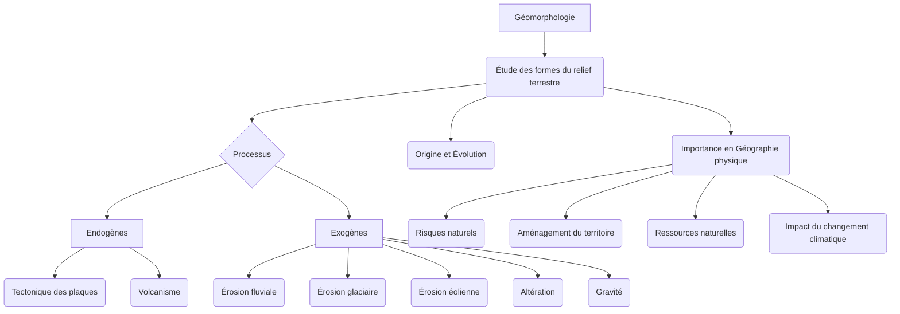

<Prerequisites itemsBase64="W3sidGl0bGUiOiJJbnRyb2R1Y3Rpb24gw6AgbGEgR8Opb2dyYXBoaWUgcGh5c2lxdWUiLCJzbHVnIjoiaW50cm9kdWN0aW9uLWdlb2dyYXBoaWUtcGh5c2lxdWUiLCJsZXZlbCI6IlVuaXZlcnNpdHkgWWVhciAyIC8gQmFjaGVsb3IgMm5kIFllYXIgKEwyKSIsInN1YmplY3QiOiJHw6lvZ3JhcGhpZSBwaHlzaXF1ZSJ9LHsidGl0bGUiOiJQcmluY2lwZXMgZGUgR8Opb2xvZ2llIEfDqW7DqXJhbGUiLCJzbHVnIjoicHJpbmNpcGVzLWdlb2xvZ2llLWfDqW7DqXJhbGUiLCJsZXZlbCI6IlVuaXZlcnNpdHkgWWVhciAyIC8gQmFjaGVsb3IgMm5kIFllYXIgKEwyKSIsInN1YmplY3QiOiJHw6lvbG9naWUifV0=" />

<DiagnosticQuiz question="Quelle est la principale distinction entre les processus geomorphologiques endogenes et exogenes?" options="Les processus endogènes sont liés aux forces internes de la Terre, tandis que les processus exogènes sont liés aux forces externes.|||Les processus endogènes agissent uniquement sur les roches magmatiques, tandis que les processus exogènes agissent sur toutes les roches.|||Les processus endogènes sont toujours destructeurs du relief, tandis que les processus exogènes sont toujours constructeurs.|||Les processus endogènes sont rapides et violents, tandis que les processus exogènes sont lents et continus." correctIndex="0" targetSectionId="introduction-processus-geom" sectionTitle="Introduction aux processus geomorphologiques" />


## Introduction à la Géomorphologie
La géomorphologie, du grec *gê* (Terre), *morphê* (forme) et *logos* (étude), est la science qui étudie les formes du relief terrestre, leur origine, leur évolution et les processus qui les façonnent. Elle se positionne au carrefour de la géographie physique, de la géologie et des sciences de l'environnement, cherchant à comprendre la dynamique complexe des paysages qui nous entourent. Loin d'être une simple description des formes, la géomorphologie analyse les interactions entre les forces internes de la Terre (endogènes) et les agents externes (exogènes) qui sculptent continuellement la surface de notre planète [[WIDGET:Citation:5]].

L'objet d'étude de la géomorphologie est vaste et englobe toutes les échelles spatiales et temporelles, des microformes (comme les rides de sable) aux macroformes (chaînes de montagnes, bassins océaniques). Elle s'intéresse non seulement aux formes actuelles, mais aussi à leur histoire passée (géomorphologie historique) et à leur évolution future, souvent en lien avec les changements climatiques et les activités humaines (géomorphologie appliquée et environnementale) [[WIDGET:Citation:2]].

L'importance de la géomorphologie en géographie physique est fondamentale. Elle fournit les clés pour comprendre la répartition des ressources naturelles, les risques géologiques (séismes, éruptions volcaniques, glissements de terrain, inondations), l'aménagement du territoire, et même l'évolution des écosystèmes. La connaissance des processus géomorphologiques est indispensable pour la gestion des littoraux, la planification urbaine, l'ingénierie civile et la prévision des impacts du changement climatique sur les paysages (GIEC, 2021) [[WIDGET:Citation:6]].

Ce cours de géomorphologie, destiné aux étudiants de Licence 3, a pour objectifs principaux de :
* Maîtriser les concepts fondamentaux et le vocabulaire spécifique de la géomorphologie.
* Comprendre les principaux processus endogènes et exogènes qui modèlent le relief terrestre.
* Identifier et analyser les grandes formes de relief associées à ces processus.
* Développer une approche systémique de l'étude des paysages, intégrant les interactions entre les différentes composantes du système Terre.
* Acquérir les outils méthodologiques pour l'analyse géomorphologique sur le terrain et à partir de données cartographiques ou satellitaires.

Nous aborderons dans un premier temps les forces internes de la Terre, responsables de la construction et de la déformation majeure du relief. Ces <ConceptLink id="processus_endogenes" name="processus endogenes" term="processus endogenes" unresolved={true}>processus endogènes</ConceptLink>, tels que la tectonique des plaques et le volcanisme, sont les architectes des grandes structures topographiques. Dans un second temps, nous explorerons les processus externes, ou <Glossary id="processus_exogenes" name="processus exogenes" term="processus exogenes">processus exogènes</Glossary>, comme l'érosion par l'eau, le vent, la glace et la gravité, qui sculptent et modifient ces structures initiales, créant une diversité infinie de paysages.

<Mermaid caption="Figure 1 : " chart={`graph TD; A[Géomorphologie] --/> B(Processus Endogènes); A --> C(Processus Exogènes); B --> D{Tectonique des plaques}; B --> E{Volcanisme}; B --> F{Séismes}; C --> G{Érosion}; C --> H{Transport}; C --> I{Sédimentation}; G --> J[Eau]; G --> K[Vent]; G --> L[Glace];`} />


*Aperçu des domaines d'étude et des processus clés en géomorphologie.*

<Objectives>
  <Knowledge>
    <ul className="list-disc pl-4 space-y-1">
      <li>analyser les principaux processus endogènes et exogènes qui façonnent le relief terrestre.</li>
      <li>Évaluer l'impact des facteurs climatiques et lithologiques sur la dynamique géomorphologique.</li>
      <li>Distinguer les différentes formes de relief résultant de l'interaction entre ces processus.</li>
    </ul>
  </Knowledge>
  <Skills>
    <ul className="list-disc pl-4 space-y-1">
      <li>Appliquer des méthodes d'analyse spatiale pour cartographier et interpréter les formes de relief.</li>
      <li>Élaborer des schémas conceptuels illustrant l'évolution des paysages géomorphologiques.</li>
      <li>Critiquer des études de cas de régions spécifiques pour identifier les processus dominants.</li>
    </ul>
  </Skills>
  <Attitudes>
    <ul className="list-disc pl-4 space-y-1">
      <li>Développer une appréciation critique de la complexité et de la dynamique des systèmes géomorphologiques.</li>
      <li>Adopter une démarche scientifique rigoureuse dans l'observation et l'interprétation des phénomènes géomorphologiques.</li>
      <li>Reconnaître l'importance de la géomorphologie dans la gestion des risques naturels et l'aménagement du territoire.</li>
    </ul>
  </Attitudes>
</Objectives>

## Les Processus Endogènes et la Construction du Relief
Les processus endogènes sont les forces motrices internes de la Terre qui génèrent et modifient le relief à grande échelle. Ils sont alimentés par l'énergie thermique interne de la planète, issue de la désintégration radioactive d'éléments dans le manteau et le noyau, ainsi que de la chaleur résiduelle de la formation de la Terre. Ces mécanismes sont responsables de la création des continents, des océans, des chaînes de montagnes et des grandes fosses océaniques, constituant ainsi l'ossature fondamentale sur laquelle les processus exogènes viendront ensuite agir [[WIDGET:Citation:5]].

### La Tectonique des Plaques

La théorie de la <ConceptLink id="tectonique_plaques" name="tectonique des plaques" term="tectonique des plaques">tectonique des plaques</ConceptLink> est le paradigme unificateur de la géologie moderne. Elle postule que la lithosphère terrestre est fragmentée en un certain nombre de plaques rigides (environ une douzaine de plaques majeures et de nombreuses plaques mineures) qui flottent et se déplacent lentement sur l'asthénosphère, une couche plus ductile du manteau supérieur. Ces mouvements, de l'ordre de quelques centimètrès par an, sont entraînés par les courants de convection du manteau [[WIDGET:Citation:2]].

L'idée d'une dérive des continents fut initialement proposée par ] au début du XXe siècle, mais ne fut largement acceptée qu'à partir des années 1960 avec l'accumulation de preuves géophysiques (paléomagnétisme, expansion des fonds océaniques, répartition des séismes et volcans).


*L'hypothèse de la dérive des continents d'Alfred Wegener, publiée en 1912, fut initialement accueillie avec scepticisme par la communauté scientifique. L'une des principales critiques était l'absence d'un mécanisme plausible pour expliquer le mouvement des continents. Ce n'est qu'avec les découvertes de l'expansion des fonds océaniques et des zones de subduction dans les années 1950 et 1960 que la théorie de la tectonique des plaques, offrant ce mécanisme manquant, a pu s'imposer, révolutionnant notre compréhension de la dynamique terrestre.*

Les interactions entre ces plaques sont à l'origine de la majeure partie de l'activité géologique et géomorphologique de notre planète. On distingue trois principaux types de frontières de plaques :

1.  **Les zones de divergence (ou dorsales médio-océaniques) :**
    *   Dans ces zones, les plaques s'écartent l'une de l'autre. Le magma provenant du manteau remonte, crée de la nouvelle croûte océanique et forme des chaînes de montagnes sous-marines appelées dorsales océaniques.
    *   Ce processus, appelé <Glossary id="expansion_oceanique" name="expansion des fonds oceaniques" term="expansion des fonds oceaniques">expansion des fonds océaniques</Glossary>, est associé à un volcanisme effusif (basaltique) et à une sismicité modérée.
    *   Exemple : La dorsale médio-atlantique, où l'Islande est une manifestation émergée de cette activité.

2.  **Les zones de convergence (ou zones de subduction et de collision) :**
    *   Ici, les plaques se rapprochent. Selon la nature des croûtes impliquées (océanique ou continentale), les phénomènes diffèrent :
        *   **Subduction océanique-océanique ou océanique-continentale :** Une plaque océanique, plus dense, plonge sous une autre plaque (océanique ou continentale) dans le manteau. Ce processus génère des fosses océaniques profondes, un volcanisme explosif (arcs insulaires ou chaînes volcaniques continentales) et une sismicité intense et profonde.
            *   Exemples : La fosse des Mariannes (océanique-océanique), la cordillère des Andes (océanique-continentale).
        *   **Collision continentale-continentale :** Lorsque deux plaques continentales entrent en collision, aucune ne peut subduire significativement en raison de leur faible densité. Il en résulte un plissement et un épaississement considérable de la croûte, formant de vastes chaînes de montagnes (orogenèse). Le volcanisme est rare, mais la sismicité est très forte.
            *   Exemple : La chaîne de l'Himalaya, résultant de la collision entre la plaque indienne et la plaque eurasienne.

3.  **Les zones de coulissage (ou failles transformantes) :**
    *   Les plaques glissent horizontalement l'une par rapport à l'autre, sans création ni destruction significative de croûte.
    *   Ces zones sont caractérisées par une forte sismicité superficielle et l'absence de volcanisme.
    *   Exemple : La faille de San Andreas en Californie.

Pour mieux appréhender les spécificités de chaque type de frontière, le tableau comparatif ci-dessous en synthétise les caractéristiques principales :

| Caractéristique | Zone de Divergence (Dorsale) | Zone de Convergence (Subduction/Collision) | Zone de Coulissage (Faille Transformante) |
| :-------------- | :---------------------------- | :---------------------------------------- | :---------------------------------------- |
| **Mouvement**   | Écartement des plaques        | Rapprochement des plaques                 | Glissement latéral des plaques            |
| **Forces**      | Extension                     | Compression                               | Cisaillement                              |
| **Croûte**      | Création (océanique)          | Destruction (subduction) / Épaississement (collision) | Ni création, ni destruction             |
| **Formes de Relief** | Dorsales océaniques, rifts, volcans effusifs | Fosses océaniques, arcs insulaires, chaînes de montagnes (volcaniques ou collision) | Failles linéaires, décalages de relief |
| **Volcanisme**  | Fréquent (effusif)            | Fréquent (explosif, subduction) / Rare (collision) | Absent                                    |
| **Sismicité**   | Modérée, superficielle        | Intense, profonde (subduction) / Très forte (collision) | Forte, superficielle                      |
| **Exemples**    | Dorsale médio-atlantique      | Fosse des Mariannes, Andes, Himalaya      | Faille de San Andreas                     |

<Image caption="Figure 2 :" src="https://cayylzaasyqqpvuezufy.supabase.co/storage/v1/object/public/course-media/img_35087451fcc2201de7aa8fb18fc7ba03.jpeg" fallbackUrl="https://fr.wikipedia.org/wiki/Figure_2_%3A" unresolved={true} />tectonic plates map
*Carte mondiale des principales plaques tectoniques et des types de frontières associées. On observe clairement la corrélation entre ces frontières et la distribution des volcans et des séismes.*

#### Manifestations de la Tectonique des Plaques sur le Relief

Les mouvements des plaques tectoniques sont les principaux moteurs de la <ConceptLink id="orogenese" name="orogenese" term="orogenese">orogenèse</ConceptLink>, c'est-à-dire la formation des chaînes de montagnes.
*   **Orogenèse de subduction :** Les chaînes de montagnes volcaniques (arcs volcaniques) se forment au-dessus des zones de subduction. Le magma généré par la fusion partielle de la plaque subduite remonte à la surface, créant des volcans et des massifs intrusifs. Les contraintes compressives entraînent également le plissement et le chevauchement des roches.
*   **Orogenèse de collision :** C'est le type d'orogenèse le plus spectaculaire, produisant les plus hautes montagnes du monde. La collision continentale entraîne un raccourcissement et un épaississement crustal intense, avec des plis, des failles inverses et des nappes de charriage.

Les **failles** sont des fractures de la croûte terrestre le long desquelles il y a eu un mouvement relatif des blocs rocheux. Elles sont omniprésentes et peuvent être classées selon le sens du mouvement :
*   **Failles normales :** Résultent d'une extension (divergence), le bloc supérieur (toit) s'affaisse par rapport au bloc inférieur (mur).
*   **Failles inverses :** Résultent d'une compression (convergence), le bloc supérieur remonte par rapport au bloc inférieur. Les chevauchements sont des failles inverses à faible pendage.
*   **Failles décrochantes (ou transformantes) :** Résultent d'un cisaillement, les blocs glissent horizontalement l'un par rapport à l'autre.

Les **séismes** (ou tremblements de terre) sont des libérations brusques d'énergie accumulée le long des failles, sous forme d'ondes sismiques. Ils sont particulièrement fréquents et intenses aux frontières de plaques, mais peuvent aussi survenir à l'intérieur des plaques (sismicité intraplaque). L'intensité d'un séisme est mesurée par des échelles comme la magnitude de Richter ou de moment, et ses effets par l'échelle de Mercalli modifiée. Les séismes peuvent provoquer des glissements de terrain, des tsunamis et des modifications importantes du relief.


*Ce graphique illustre la distribution mondiale de la fréquence et de la magnitude des séismes sur une période donnée, mettant en évidence la concentration de l'activité sismique le long des frontières de plaques tectoniques.*

### Le Volcanisme et son Rôle dans la Formation des Paysages

Le volcanisme est l'ensemble des phénomènes liés à la remontée de magma (roche en fusion) depuis l'intérieur de la Terre vers la surface, où il est appelé lave. C'est un processus géomorphologique majeur qui crée des formes de relief distinctives et contribue à la formation de nouvelles terres.

#### Types d'Éruptions Volcaniques

Les types d'éruptions sont principalement contrôlés par la composition du magma, en particulier sa teneur en silice et en gaz dissous, qui détermine sa viscosité :
1.  **Éruptions effusives (ou hawaïennes) :**
    *   Magma basaltique, pauvre en silice, très fluide et peu chargé en gaz.
    *   La lave s'écoule facilement, formant de vastes coulées.
    *   Volcans de type bouclier, aux pentes douces.
    *   Exemple : Les volcans d'Hawaï.

2.  **Éruptions explosives (ou péléennes, vulcaniennes, pliniennes) :**
    *   Magma andésitique ou rhyolitique, riche en silice, visqueux et très chargé en gaz.
    *   Les gaz s'échappent difficilement, provoquant des explosions violentes qui projettent des cendres, des lapilli et des bombes volcaniques.
    *   Volcans de type stratovolcan (ou volcan composite), aux pentes raides et coniques.
    *   Exemple : Le Vésuve, le Mont Saint Helens.

3.  **Éruptions phréatomagmatiques :**
    *   Interaction entre le magma et l'eau (nappe phréatique, lac, mer), entraînant des explosions particulièrement violentes dues à la vaporisation rapide de l'eau.
    *   Peut former des maars (cratères d'explosion).

#### Formes Volcaniques

Le volcanisme crée une grande variété de formes de relief, des plus imposantes aux plus discrètes :
*   **Volcans boucliers :** Vastes édifices aux pentes douces, formés par l'accumulation de coulées de lave très fluides. Ex : Mauna Loa (Hawaï).
*   **Stratovolcans (ou volcans composites) :** Volcans coniques aux pentes raides, construits par l'alternance de coulées de lave visqueuses et de dépôts pyroclastiques (cendres, ponces). Ex : Fuji-yama, Etna.
*   **Caldeiras :** Vastes dépressions circulaires résultant de l'effondrement du toit d'une chambre magmatique vidée après une éruption majeure. Ex : Santorin.
*   **Dômes de lave :** Masses de lave très visqueuse qui s'accumulent au-dessus de la cheminée volcanique, formant un dôme.
*   **Maars :** Cratères d'explosion peu profonds, souvent remplis d'eau, formés par des éruptions phréatomagmatiques.
*   **Plateaux basaltiques (ou trapps) :** Vastes étendues de lave fluide qui s'épanchent par des fissures, recouvrant de grandes surfaces. Ex : Trapps du Deccan (Inde).
*   **Intrusions volcaniques :** Formes créées par la solidification du magma sous la surface, qui peuvent être exposées par l'érosion ultérieure (dykes, sills, laccolites, batholites).

Le volcanisme joue un rôle crucial dans le cycle géochimique de la Terre, libérant des gaz dans l'atmosphère et apportant de nouveaux matériaux à la surface, contribuant ainsi à la fertilité des sols volcaniques.


*Vérifiez votre compréhension des processus endogènes avec ce quiz interactif.*

<SolvedExercise id="plate_velocity_calculation" name="plate velocity calculation" term="plate velocity calculation">plate velocity calculation</SolvedExercise>
*Exercice résolu : Calcul de la vitesse de déplacement d'une plaque tectonique.*
**Problème :** La dorsale médio-atlantique s'étend à un taux moyen de 2,5 cm par an. Estimez la distance totale dont l'Amérique du Sud s'est éloignée de l'Afrique depuis le début de l'ouverture de l'océan Atlantique il y a environ 180 millions d'années.
**Solution :**
1.  **Convertir le temps en années :** 180 millions d'années = 180 000 000 ans.
2.  **Convertir le taux d'expansion en kilomètrès par an :** 2,5 cm/an = 0,025 m/an = 0,000025 km/an.
3.  **Calculer la distance totale :** Distance = Taux d'expansion × Temps
    Distance = 0,000025 km/an × 180 000 000 ans = 4500 km.
**Réponse :** L'Amérique du Sud s'est éloignée de l'Afrique d'environ 4500 km depuis le début de l'ouverture de l'Atlantique.

<UnsolvedExercise id="volcanic_landforms" name="volcanic landforms" term="volcanic landforms">volcanic landforms</UnsolvedExercise>
*Exercice non résolu : Identification des formes volcaniques.*
**Question :** Observez attentivement une carte topographique ou une image satellite d'une région volcanique (par exemple, la Chaîne des Puys en France ou la région des Cascades aux États-Unis). Identifiez et décrivez au moins trois formes de relief volcaniques distinctes (par exemple, un stratovolcan, un dôme de lave, un maar, une coulée de lave, une caldeira) et expliquez brièvement les processus éruptifs qui ont pu les former.

Les processus endogènes, tels que la tectonique des plaques et le volcanisme, sont les architectes primaires des grandes structures du relief terrestre, créant montagnes, fosses océaniques et plateaux volcaniques. Cependant, ces formes initiales sont constamment modifiées, sculptées et démantelées par une autre catégorie de forces : les processus exogènes. Ces derniers opèrent à la surface de la Terre, sous l'influence directe de l'atmosphère, de l'hydrosphère et de la biosphère, et sont largement alimentés par l'énergie solaire et la gravité [[WIDGET:Citation:1]]. Ils sont les agents de l'altération, de l'érosion, du transport et de la sédimentation, travaillant sans relâche pour niveler les reliefs et redistribuer les matériaux à travers le globe.


## Les Processus Exogènes et l'Évolution des Paysages

Les processus exogènes englobent l'ensemble des phénomènes qui transforment la surface terrestre sous l'action des agents externes. Ils sont cruciaux pour comprendre la dynamique des paysages et leur évolution à différentes échelles de temps et d'espace. Ces processus peuvent être classés en trois catégories principales : l'altération, l'érosion et le transport des sédiments, qui interagissent de manière complexe pour sculpter les formes terrestres [[WIDGET:Citation:2]].

### L'Altération (Weathering)

L'altération est la désintégration et la décomposition des roches à la surface de la Terre. C'est la première étape du cycle géomorphologique, préparant les matériaux rocheux à être érodés et transportés. On distingue trois types principaux d'altération : physique, chimique et biologique.

#### Altération physique (ou Mécanique)

L'altération physique implique la fragmentation des roches sans changement de leur composition chimique. Elle est particulièrement efficace dans les environnements où les variations de température et d'humidité sont importantes.

*   **Gélifraction (ou Cryoclastie) :** C'est le processus le plus connu d'altération physique. L'eau s'infiltre dans les fissures et les pores des roches, puis gèle. En se transformant en glace, l'eau augmente de volume d'environ 9%, exerçant une pression considérable sur les parois rocheuses, ce qui provoque leur éclatement. Ce phénomène est prédominant dans les régions froides et de haute altitude, où les cycles gel-dégel sont fréquents <Glossary id="gelifraction" name="Gelifraction" term="Gelifraction">Gélifraction</Glossary>.
*   **Thermoclastie :** Elle résulte des variations de température qui entraînent des dilatations et contractions différentielles des minéraux au sein d'une roche, ou entre la surface et l'intérieur de la roche. Dans les déserts, les écarts thermiques journaliers peuvent être extrêmes, provoquant la fragmentation des roches par desquamation ou exfoliation (détachement de couches superficielles).
*   **Haloclastie (ou Cristallisation de sels) :** Dans les environnements arides ou côtiers, l'évaporation de l'eau chargée en sels minéraux (chlorure de sodium, gypse, etc.) conduit à la cristallisation de ces sels dans les pores et fissures des roches. La croissance des cristaux exerce une pression qui désagrège la roche, similaire à la gélifraction.
*   **Décompression (ou Déchargement) :** Lorsque des roches profondes sont exposées à la surface par l'érosion des matériaux sus-jacents, la diminution de la pression lithostatique entraîne leur dilatation et la formation de fissures parallèles à la surface (diaclases de décompression), souvent observées sur les dômes granitiques.
*   **Hydratation/Déshydratation :** Certains minéraux, comme les argiles, peuvent absorber ou perdre de l'eau, entraînant des changements de volume qui fragilisent la roche.

#### Altération Chimique

L'altération chimique implique la décomposition des roches par des réactions chimiques, transformant les minéraux originaux en de nouveaux minéraux ou en ions dissous. L'eau est le principal agent de l'altération chimique, souvent enrichie en dioxyde de carbone (CO2) ou en acides organiques.

*   **Dissolution :** C'est le processus par lequel certains minéraux se dissolvent directement dans l'eau. Les roches carbonatées (calcaires, dolomies) sont particulièrement sensibles à la dissolution par l'eau de pluie légèrement acide (chargée en CO2 atmosphérique, formant de l'acide carbonique). Ce processus est à l'origine des paysages karstiques (grottes, dolines, lapiaz).
*   **Hydrolyse :** Réaction de l'eau avec les minéraux silicatés (feldspaths, micas), les transformant en minéraux argileux et libérant des ions en solution. C'est un processus majeur dans la décomposition des roches granitiques et métamorphiques, particulièrement dans les climats chauds et humides.
*   **Oxydation :** Réaction des minéraux contenant du fer (pyroxènes, amphiboles, olivine) avec l'oxygène de l'air ou de l'eau, formant des oxydes de fer (rouille). Ce processus donne souvent une coloration rougeâtre aux roches et aux sols.
*   **Carbonatation :** Réaction du dioxyde de carbone dissous dans l'eau avec des minéraux, notamment le calcium des calcaires, pour former du bicarbonate de calcium soluble. Ce processus est une forme spécifique de dissolution.

#### Altération Biologique

L'altération biologique est l'action des organismes vivants sur les roches. Elle peut être mécanique ou chimique.

*   **Action mécanique :** Les racines des arbres et des plantes peuvent s'infiltrer dans les fissures des roches et les élargir en croissant, provoquant leur fragmentation. Les animaux fouisseurs peuvent également désagréger les sols et les roches superficielles.
*   **Action chimique :** Les lichens, les mousses et les bactéries produisent des acides organiques qui peuvent attaquer chimiquement les minéraux des roches. La décomposition de la matière organique dans le sol libère également des acides humiques qui contribuent à l'altération chimique.

<Image caption="Figure 3 :" src="https://cayylzaasyqqpvuezufy.supabase.co/storage/v1/object/public/course-media/img_5ff0613a6c0ec533fd4f1dae0212de25.jpeg" fallbackUrl="https://fr.wikipedia.org/wiki/Figure_3_%3A" unresolved={true} />weathering types diagram
Diagramme illustrant les différents types d'altération (physique, chimique, biologique) et leurs mécanismes d'action sur les roches.

L'altération est un processus fondamental qui prépare le terrain pour l'érosion. Les trois types d'altération interagissent souvent, et leur efficacité dépend fortement du climat, de la nature de la roche, de la topographie et de la présence de végétation [[WIDGET:Citation:3]].

### L'Érosion

L'érosion est l'enlèvement et le transport des matériaux altérés ou non altérés par des agents dynamiques tels que l'eau, la glace, le vent et la gravité. Elle se distingue de l'altération par le mouvement des matériaux.

#### Érosion Fluviale

L'érosion fluviale est l'action des cours d'eau. C'est l'un des agents géomorphologiques les plus puissants et les plus répandus.

*   **Mécanismes :**
    *   **Abrasion :** Les particules transportées par le courant frottent contre le lit et les berges, les usant progressivement.
    *   **Corrosion (ou Dissolution) :** L'eau du fleuve dissout les minéraux solubles des roches du lit et des berges.
    *   **Cavitation :** La formation et l'implosion de bulles d'air dans l'eau en mouvement rapide peuvent générer des forces suffisantes pour arracher des fragments de roche.
    *   **Arrachement (ou Détachement hydraulique) :** La force du courant peut directement arracher des fragments de roche ou de sédiments non consolidés.
*   **Formes de relief :**
    *   **Vallées en V :** Caractéristiques des cours supérieurs des rivières, où l'érosion verticale est dominante.
    *   **Gorges et canyons :** Vallées profondes et étroites, souvent creusées dans des roches résistantes.
    *   **Méandres :** Boucles sinueuses formées dans les cours moyens et inférieurs, où l'érosion latérale et le dépôt sont importants.
    *   **Terrasses fluviales :** Anciens lits majeurs abandonnés par l'encaissement du fleuve, témoignant des variations du niveau de base ou des changements climatiques.
    *   **Plaines alluviales :** Vastes étendues de dépôts sédimentaires formées par les crues des rivières.

#### Érosion Glaciaire

L'érosion glaciaire est l'action des glaciers et des calottes glaciaires. Elle est extrêmement efficace et a façonné des paysages entiers dans les régions polaires et de haute montagne.

*   **Mécanismes :**
    *   **Arrachement (ou Plucking) :** La glace gèle dans les fissures des roches, puis en se déplaçant, elle arrache des blocs rocheux.
    *   **Abrasion glaciaire :** Les roches et sédiments emprisonnés dans la base du glacier frottent contre le substrat rocheux, le polissant et le striant (stries glaciaires).
*   **Formes de relief :**
    *   **Vallées en U :** Caractéristiques des vallées glaciaires, élargies et approfondies par le passage du glacier.
    *   **Cirques glaciaires :** Amphithéâtrès rocheux creusés par les glaciers de cirque en tête de vallée.
    *   **Arêtes et pics pyramidaux (horns) :** Formés par l'érosion de plusieurs cirques adjacents.
    *   **Fjords :** Anciennes vallées glaciaires envahies par la mer après la fonte des glaciers.
    *   **Roches moutonnées :** Formes asymétriques polies par l'abrasion glaciaire sur le côté amont et arrachées sur le côté aval.

#### Érosion Éolienne

L'érosion éolienne est l'action du vent, prédominante dans les régions arides et semi-arides, ainsi que sur les littoraux sableux.

*   **Mécanismes :**
    *   **Déflation :** Le vent emporte les particules fines (sable, limon, argile) non consolidées de la surface, laissant derrière lui les éléments plus grossiers.
    *   **Abrasion éolienne (ou Corrasion) :** Les particules de sable transportées par le vent frottent contre les roches, les usant et les polissant. L'abrasion est plus intense près du sol.
*   **Formes de relief :**
    *   **Déserts de regs :** Vastes étendues de galets et de graviers laissés après la déflation des particules fines.
    *   **Yardangs :** Crêtes rocheuses allongées, sculptées par l'abrasion éolienne dans des roches tendres.
    *   **Piedestals (ou Cheminées de fée) :** Blocs rocheux surmontant un socle plus étroit, résultant de l'abrasion différentielle.
    *   **Alvéoles et taffonis :** Petites cavités creusées dans les roches par l'action combinée du vent et de l'altération.

#### Érosion Marine

L'érosion marine est l'action des vagues, des courants et des marées le long des côtes.

*   **Mécanismes :**
    *   **Abrasion :** Les vagues projettent des sédiments (galets, sable) contre les falaises et le fond marin, les usant.
    *   **Corrosion :** L'eau de mer dissout les minéraux solubles des roches côtières.
    *   **Choc hydraulique :** La force des vagues qui se brisent contre les falaises peut exercer une pression énorme, arrachant des blocs de roche.
    *   **Compression de l'air :** L'air piégé dans les fissures des falaises est comprimé par les vagues, puis se détend, contribuant à l'élargissement des fissures.
*   **Formes de relief :**
    *   **Falaises :** Parois rocheuses abruptes résultant du recul de la côte sous l'action des vagues.
    *   **Plates-formes d'abrasion marine :** Surfaces rocheuses planes situées à la base des falaises, découvertes à marée basse.
    *   **Grottes marines, arches et stacks :** Formes sculptées par l'érosion différentielle le long des falaises.
    *   **Plages :** Accumulations de sédiments (sable, galets) résultant de l'équilibre entre l'apport sédimentaire et l'érosion.

### Le Transport des Sédiments

Le transport est le déplacement des matériaux érodés depuis leur lieu d'origine vers des zones de dépôt. La capacité de transport d'un agent (eau, vent, glace) dépend de sa vitesse et de son énergie.

*   **Transport fluvial :**
    *   **Solution :** Ions dissous dans l'eau.
    *   **Suspension :** Particules fines (limons, argiles) maintenues en suspension par la turbulence de l'eau.
    *   **Saltation :** Particules de taille moyenne (sable) qui se déplacent par bonds successifs le long du lit.
    *   **Charriage (ou Traction) :** Particules plus grosses (galets, blocs) roulées ou glissées sur le fond.
*   **Transport glaciaire :** Les glaciers transportent des sédiments de toutes tailles (du limon aux blocs rocheux) à leur surface, à l'intérieur et à leur base. Ces dépôts non triés sont appelés tills ou moraines.
*   **Transport éolien :**
    *   **Suspension :** Particules très fines (poussières, limons) transportées sur de longues distances.
    *   **Saltation :** Particules de sable qui se déplacent par bonds près du sol.
    *   **Charriage :** Particules plus grosses roulées sur le sol.
*   **Transport marin :** Les courants marins et les vagues transportent les sédiments le long des côtes (dérive littorale) et sur le plateau continental.

### Interaction des Processus Exogènes

L'altération, l'érosion et le transport ne sont pas des processus isolés, mais interagissent de manière dynamique et continue. L'altération fragilise la roche, la rendant plus susceptible à l'érosion. L'érosion enlève les matériaux altérés, exposant de nouvelles surfaces à l'altération. Le transport redistribue ces matériaux, qui peuvent ensuite être déposés et former de nouvelles roches sédimentaires, fermant ainsi le cycle géologique.

Ces interactions sont fortement modulées par le climat, la nature des roches, la topographie et l'activité humaine. Par exemple, un climat humide et chaud favorisera l'altération chimique, tandis qu'un climat froid et humide accentuera la gélifraction et l'érosion glaciaire. La présence de végétation peut ralentir l'érosion en stabilisant les sols, mais peut aussi contribuer à l'altération biologique [[WIDGET:Citation:4]].

<Mermaid caption="Figure 4 : " id="exogenous_processes_flowchart" name="exogenous processes flowchart" term="exogenous processes flowchart"/>exogenous processes flowchart
```mermaid
graph TD
    A[Roches Mères] -->|Altération physique, Chimique, Biologique| B(Matériaux Altérés)
    B -->|Érosion (Eau, Vent, Glace, Vagues)| C(Sédiments en Mouvement)
    C -->|Transport| D(Sédiments Transportés)
    D -->|Diminution d'Énergie| E(Dépôt / Sédimentation)
    E -->|Diagenèse| F[Roches Sédimentaires]
    F -->|Soulèvement Tectonique| A
    style A fill:#f9f,stroke:#333,stroke-width:2px
    style F fill:#f9f,stroke:#333,stroke-width:2px
    style B fill:#ccf,stroke:#333,stroke-width:2px
    style C fill:#ccf,stroke:#333,stroke-width:2px
    style D fill:#ccf,stroke:#333,stroke-width:2px
    style E fill:#ccf,stroke:#333,stroke-width:2px
```


Diagramme conceptuel des processus exogènes, illustrant le cycle de l'altération, de l'érosion, du transport et de la sédimentation.

La compréhension de ces interactions est essentielle pour la <ConceptLink id="geomorphologie_dynamique" name="geomorphologie dynamique" term="geomorphologie dynamique" unresolved={true}>géomorphologie dynamique</ConceptLink>, qui étudie l'évolution des formes de relief au fil du temps. Les modèles de <ConceptLink id="cycle_geomorphologique" name="cycle geomorphologique" term="cycle geomorphologique" unresolved={true}>cycle géomorphologique</ConceptLink>, développés par des géographes comme <RealPerson id="william_morris_davis" name="William Morris Davis" term="William Morris Davis">William Morris Davis</RealPerson> et plus tard critiqués et affinés par d'autres comme <RealPerson id="walther_penck" name="Walther Penck" term="Walther Penck">Walther Penck</RealPerson>, tentent de systématiser cette évolution en fonction des processus endogènes et exogènes [[WIDGET:Citation:5]].

## Les Principales Formes du Relief Terrestre

Les processus exogènes, agissant sur les structures créées par les forces endogènes, donnent naissance à une incroyable diversité de formes de relief. Ces formes sont le résultat d'un équilibre dynamique entre les forces de construction (tectonique, volcanisme) et les forces de destruction (altération, érosion).

### Les Montagnes

Les montagnes sont des reliefs positifs de grande ampleur, caractérisés par des pentes fortes et des altitudes élevées. Bien que leur origine soit principalement tectonique (plissement, faille, volcanisme), leur morphologie finale est profondément sculptée par les processus exogènes.

*   **Chaînes de montagnes jeunes (ex: Alpes, Himalaya) :** Ces massifs sont le théâtre d'une intense activité géomorphologique. L'altitude favorise la gélifraction et l'érosion glaciaire, créant des vallées en U, des cirques, des arêtes vives et des pics acérés. L'érosion fluviale y est également très active, creusant des vallées profondes et transportant d'énormes quantités de sédiments vers les plaines adjacentes. La forte énergie du relief et la présence de glaciers accélèrent le démantèlement des roches.
*   **Massifs anciens (ex: Massif Central, Appalaches) :** Ces montagnes, formées lors d'orogenèses plus anciennes, ont subi des millions d'années d'érosion. Leurs sommets sont souvent arrondis, leurs pentes adoucies, et leurs vallées plus ouvertes. Les glaciers ont pu y laisser des traces lors des périodes glaciaires, mais l'érosion fluviale et l'altération sont les processus dominants aujourd'hui. On y observe souvent des reliefs résiduels (buttes, inselbergs) témoignant de l'<ConceptLink id="erosion_differencielle" name="erosion differentielle" term="erosion differentielle" unresolved={true}>érosion différentielle</ConceptLink> des roches plus résistantes.

La dynamique évolutive des montagnes est un équilibre entre le soulèvement tectonique et l'érosion. Tant que le soulèvement est plus rapide que l'érosion, la montagne grandit. Lorsque l'érosion prend le dessus, la montagne s'abaisse et s'adoucit.

### Les Plaines et Plateaux

Les plaines et les plateaux sont des formes de relief caractérisées par des altitudes généralement faibles et des pentes douces pour les plaines, ou des surfaces relativement planes mais élevées pour les plateaux.

*   **Plaines :**
    *   **Plaines alluviales :** Formées par l'accumulation de sédiments (alluvions) déposés par les fleuves lors des crues. Elles sont souvent très fertiles et densément peuplées (ex: Plaine du Gange, Bassin Parisien).
    *   **Plaines côtières :** Situées le long des littoraux, elles peuvent être formées par l'accumulation de sédiments marins ou fluviaux, ou par l'émersion d'anciens fonds marins.
    *   **Plaines structurales :** Résultent de l'érosion de roches sédimentaires horizontales ou faiblement inclinées, où les couches tendres ont été érodées plus rapidement que les couches dures.
*   **Plateaux :**
    *   **Plateaux structuraux :** Surfaces planes et élevées, souvent constituées de couches rocheuses horizontales ou légèrement inclinées, qui ont été soulevées et peu érodées (ex: Colorado Plateau).
    *   **Plateaux volcaniques :** Formés par l'accumulation de vastes coulées de lave fluides (ex: Trapps du Deccan, Plateaux du Columbia).
    *   **Plateaux érodés :** Anciens massifs montagneux fortement érodés, dont il ne reste que des surfaces résiduelles plus ou moins planes.

Les plaines et plateaux sont des zones où l'érosion est moins intense que dans les montagnes, mais où l'altération et le transport des sédiments sont toujours actifs. Les rivières y creusent des vallées, et les processus d'altération contribuent à la formation des sols.

### Les Littoraux

Les littoraux sont les zones de contact entre la terre et la mer, caractérisées par une dynamique géomorphologique intense et complexe, influencée par les vagues, les courants, les marées, le vent et les apports sédimentaires continentaux.

*   **Plages :** Accumulations de sédiments (sable, galets) le long de la côte. Leur morphologie est en constante évolution, façonnée par l'énergie des vagues, la direction des courants et la disponibilité des sédiments. Elles peuvent être érodées lors des tempêtes et reconstruites par temps calme.
*   **Falaises :** Parois rocheuses abruptes résultant de l'érosion marine. Leur recul est un processus continu, influencé par la nature de la roche, la présence de failles, l'énergie des vagues et les processus d'altération subaériens.
*   **Deltas :** Formes de dépôt créées à l'embouchure des fleuves, où les sédiments transportés par le fleuve s'accumulent lorsque le courant ralentit au contact de la mer. Leur forme (en patte d'oie, lobée, digité) dépend de l'équilibre entre l'apport sédimentaire fluvial et l'action des vagues et des courants marins (ex: Delta du Nil, Delta du Mississippi).
*   **Estuaires :** Embouchures de fleuves où l'eau douce se mélange à l'eau de mer, souvent caractérisées par des marées importantes et des dépôts de vase.
*   **Cordons littoraux, flèches et tombolos :** Formes d'accumulation de sable et de galets, créées par la dérive littorale.
*   **Lagunes et étangs côtiers :** Plans d'eau séparés de la mer par des cordons littoraux.

Les littoraux sont des environnements très dynamiques et sensibles aux changements climatiques, notamment l'élévation du niveau marin et l'augmentation de la fréquence et de l'intensité des tempêtes [[WIDGET:Citation:6]].

### Les Déserts

Les déserts sont des régions caractérisées par une aridité extrême, où l'eau est un facteur limitant pour la végétation et où l'érosion éolienne joue un rôle prépondérant, bien que l'érosion fluviale intermittente (lors de crues soudaines) puisse aussi être très efficace.

*   **Dunes :** Accumulations de sable transporté par le vent. Il existe de nombreux types de dunes, dont la forme dépend de la direction et de la force du vent, de la disponibilité du sable et de la présence de végétation (ex: barkhanes, dunes transversales, dunes longitudinales).
*   **Regs (déserts de pierres) :** Vastes étendues de galets et de graviers, formées par la déflation éolienne qui emporte les particules fines, laissant les éléments plus grossiers en place.
*   **Hamadas (déserts rocheux) :** Plateaux rocheux dénudés, souvent polis par l'abrasion éolienne et l'altération thermique.
*   **Ergs (déserts de sable) :** Vastes mers de dunes.
*   **Yardangs et mesas/buttes :** Formes d'érosion différentielle sculptées par le vent dans des roches de résistances variées. Les yardangs sont allongés dans le sens du vent, tandis que les mesas et buttes sont des reliefs tabulaires isolés.

La dynamique des déserts est fortement influencée par le régime des vents et les rares épisodes pluvieux. Les paysages désertiques sont en constante évolution, avec des dunes qui migrent et des surfaces rocheuses qui sont lentement sculptées par le vent et les variations de température.

En conclusion, les processus exogènes sont les sculpteurs infatigables de la surface terrestre. Agissant en synergie, ils démantèlent les reliefs, transportent les matériaux et les déposent, créant ainsi la diversité des paysages que nous observons. La compréhension de ces processus est fondamentale pour la géomorphologie et permet d'appréhender la complexité et la dynamique évolutive de notre planète.

## Conclusion
Ce cours de géomorphologie a exploré la diversité et la dynamique des formes de relief terrestre, en mettant en lumière l'interaction complexe entre les processus endogènes et exogènes. Nous avons d'abord abordé les forces internes de la Terre, les processus <Glossary id="endogenes" name="endogenes" term="endogenes">endogènes</Glossary>, qui sont les architectes primaires de la surface terrestre. La tectonique des plaques, le volcanisme, les séismes et l'orogenèse sont les moteurs de la création des grandes structures topographiques, des chaînes de montagnes majestueuses aux vastes plaines, en passant par les fosses océaniques profondes. Ces forces, agissant sur des échelles de temps géologiques, fournissent la matière première et l'énergie nécessaires à la sculpture des paysages.

Ensuite, nous nous sommes penchés sur les processus <Glossary id="exogenes" name="exogenes" term="exogenes">exogènes</Glossary>, ces agents externes qui, sous l'influence de l'atmosphère, de l'hydrosphère et de la biosphère, modèlent sans relâche les formes créées par les forces internes. L'altération, qu'elle soit physique, chimique ou biologique, fragilise les roches. L'érosion, par l'action de l'eau (fluviale, glaciaire, marine), du vent (éolienne) et de la gravité, déplace les matériaux. Enfin, le transport et la sédimentation redistribuent ces matériaux, créant des dépôts et des formes de relief spécifiques comme les deltas, les dunes ou les moraines. Des géomorphologues comme <RealPerson id="tricart" name="Jean Tricart" term="Jean Tricart">Jean Tricart</RealPerson> ont largement contribué à la compréhension de ces interactions complexes [[WIDGET:Citation:3]].


Un jalon historique dans la compréhension de cette dynamique fut la théorie du « cycle d'érosion » proposée par William Morris Davis à la fin du XIXe siècle. Bien que simplifiée et critiquée par la suite pour son caractère déterministe et son approche unilineaire, cette conceptualisation a marqué une étape fondamentale en systématisant l'idée que les paysages évoluent à travers des stades successifs (jeunesse, maturité, vieillesse) sous l'action des processus exogènes, après un soulèvement initial. Elle a posé les bases d'une approche dynamique de la géomorphologie, influençant des générations de chercheurs.

L'essence de la <Glossary id="geomorphologie" name="geomorphologie" term="geomorphologie">géomorphologie</Glossary> réside dans la compréhension de l'interdépendance fondamentale entre ces deux catégories de processus. Les reliefs que nous observons sont le résultat d'un équilibre dynamique, souvent temporaire, entre la construction endogène et la destruction/sculpture exogène. Une chaîne de montagnes s'élève sous l'effet de la tectonique, mais elle est simultanément attaquée par les glaciers, les rivières et le vent, qui la démantèlent et transportent ses sédiments vers les bassins de dépôt. Cette interaction constante assure l'évolution perpétuelle des paysages terrestres, qui ne sont jamais statiques mais toujours en transition.

<Mermaid caption="Figure 5 : " id="process_interaction_diagram" name="process interaction diagram" term="process interaction diagram"/>process interaction diagram
Diagramme illustrant l'interdépendance des processus endogènes et exogènes dans la formation et l'évolution des paysages terrestres.

<SolvedExercise id="landscape_evolution_sequence" name="landscape évolution sequence" term="landscape évolution sequence">landscape évolution sequence</SolvedExercise>
**Exercice Résolu : Évolution d'un Paysage Montagneux**

**Question :** Considérons une chaîne de montagnes nouvellement formée par des processus orogéniques intenses. Décrivez la séquence des principaux processus exogènes qui agiront sur cette chaîne au cours des millions d'années, et les formes de relief caractéristiques qui en résulteront à chaque étape.

**Solution :**
L'évolution d'un paysage montagneux est le résultat d'une interaction complexe et séquentielle de processus exogènes.

| Étape | Processus Exogènes Dominants | Formes de Relief Caractéristiques |
| :---- | :--------------------------- | :------------------------------- |
| 1     | Altération (physique, chimique, biologique) | Fragmentation des roches, formation de régolithe, éboulis |
| 2     | Érosion et Transport Fluvial/Glaciaire | Incision de vallées en V (fluvial) ou en U (glaciaire), cirques, arêtes, cornes, transport de sédiments |
| 3     | Mouvements de Masse (gravité) | Glissements de terrain, coulées de boue, éboulements, talus d'éboulis |
| 4     | Dénudation et Aplanissement | Réduction progressive de l'altitude et de la rugosité, élargissement des vallées, formation de plaines alluviales, deltas, et à terme, pénéplaines ou niveaux de base |

Aujourd'hui, la géomorphologie est confrontée à des défis majeurs, exacerbés par l'influence croissante des activités humaines sur les systèmes terrestres, une ère souvent qualifiée d']. Le changement climatique, en particulier, modifie les régimes hydrologiques, accélère la fonte des glaciers et des calottes polaires, intensifie les événements météorologiques extrêmes et provoque l'élévation du niveau marin [[WIDGET:Citation:6]]. Ces changements ont des répercussions directes sur les processus géomorphologiques : augmentation de l'érosion côtière, intensification des crues et des glissements de terrain, expansion des zones désertiques, et déstabilisation du pergélisol.


Ce graphique illustre l'évolution du niveau marin global moyen depuis 1900, mettant en évidence l'accélération récente de cette élévation, un facteur clé de l'intensification de l'érosion côtière et de la submersion marine.

<Image caption="Figure 6 :" src="https://cayylzaasyqqpvuezufy.supabase.co/storage/v1/object/public/course-media/img_f4fd2f351e2933eeae6181a90e3d8cef.svg" unresolved={true} />coastal erosion climate change
Exemple d'érosion côtière accélérée, un phénomène exacerbé par l'élévation du niveau marin et l'intensification des tempêtes dues au changement climatique.

La gestion des risques naturels, tels que les inondations, les mouvements de terrain et l'érosion côtière, devient ainsi une préoccupation centrale de la géomorphologie appliquée. Comprendre la dynamique des processus et la vulnérabilité des territoires est essentiel pour l'aménagement du territoire, la planification urbaine et la mise en place de stratégies d'adaptation et d'atténuation. La géomorphologie ne se contente plus d'expliquer le passé et le présent des paysages ; elle est devenue une discipline prospective, indispensable pour anticiper les évolutions futures et construire des sociétés plus résilientes face aux défis environnementaux globaux.

<UnsolvedExercise id="climate_adaptation_strategies" name="climate adaptation strategies" term="climate adaptation strategies">climate adaptation strategies</UnsolvedExercise>
**Exercice Non Résolu : Stratégies d'Adaptation Géomorphologique**

**Question :** La région côtière de la Nouvelle-Aquitaine (France) est particulièrement vulnérable à l'érosion et à la submersion marine, phénomènes exacerbés par le changement climatique. En vous basant sur les principes de la géomorphologie et les défis actuels, proposez trois stratégies d'adaptation ou d'atténuation spécifiques pour cette région, en justifiant leur pertinence géomorphologique.


<Summary itemsString="La géomorphologie est l'étude scientifique des formes du relief terrestre, de leur origine, de leur évolution et des processus qui les façonnent.|||Nous avons exploré les processus endogènes, tels que la tectonique des plaques et le volcanisme, qui créent les grandes structures du relief comme les chaînes de montagnes et les fosses océaniques.|||Parallèlement, les processus exogènes, incluant l'érosion (fluviale, glaciaire, éolienne, marine) et la sédimentation, modifient et sculptent ces formes initiales, créant vallées, deltas, dunes et falaises.|||La compréhension de l'interaction complexe entre ces forces internes et externes est fondamentale pour interpréter les paysages que nous observons et anticiper leurs évolutions.|||Enfin, l'impact anthropique sur les formes du relief, de l'urbanisation à l'agriculture, a été souligné comme un facteur géomorphologique de plus en plus prépondérant, modifiant significativement les dynamiques naturelles." />

<WhatsNext itemsBase64="W3sidGl0bGUiOiJHZW9tb3JwaG9sb2dpZTogUmVsaWVmcywgY2xpbWF0cywgaG9tbWVzIiwiZGVzY3JpcHRpb24iOiJVbiBvdXZyYWdlIGRlIHJlZmVyZW5jZSBjb21wbGV0IGNvdXZyYW50IGxlcyBwcmluY2lwZXMgZm9uZGFtZW50YXV4IGRlIGxhIGdlb21vcnBob2xvZ2llLCBsZXMgcHJvY2Vzc3VzIGV0IGxlcyBmb3JtZXMgZHUgcmVsaWVmLCBhdmVjIHVuZSBhdHRlbnRpb24gcGFydGljdWxpZXJlIGF1eCBpbnRlcmFjdGlvbnMgZW50cmUgbGUgY2xpbWF0IGV0IGwnYWN0aXZpdGUgaHVtYWluZS4iLCJzbHVnIjoiZ2VvbW9ycGhvbG9naWUtcmVsaWVmcy1jbGltYXRzLWhvbW1lcyIsInN1YmplY3QiOiIiLCJsZXZlbCI6IiJ9XQ==" />

## Auto-évaluation

<Quiz durationLimit={900}>
    <Question q="Qu'est-ce que la geomorphologie ?" explanation="La geomorphologie est une branche de la geographie physique et de la geologie qui se consacre a l'etude des formes du relief terrestre, de leur origine, de leur évolution et des processus (endogenes et exogenes) qui les modifient.">
  <Option text="L'etude des climats passes." correct={false} />
  <Option text="La science qui etudie les formes du relief terrestre et les processus qui les faconnent." correct={true} />
  <Option text="L'analyse de la composition chimique des roches." correct={false} />
  <Option text="La discipline qui s'interesse a la distribution de la vegetation." correct={false} />
</Question>
    <Question q="Parmi les processus suivants, lequel est considere comme un processus endogene majeur ?" explanation="Les processus endogenes sont ceux qui proviennent de l'interieur de la Terre, comme le volcanisme, la tectonique des plaques et les seismes, et qui sont responsables de la creation de reliefs majeurs.">
  <Option text="L'erosion eolienne." correct={false} />
  <Option text="Le volcanisme." correct={true} />
  <Option text="L'alteration chimique." correct={false} />
  <Option text="Le transport fluvial." correct={false} />
</Question>
    <Question q="Quel est le principal agent responsable de la formation des vallees en 'U' ?" explanation="Les vallees glaciaires, ou vallees en 'U', sont caracteristiques de l'erosion intense exercee par les glaciers, qui elargissent et approfondissent les vallees preexistantes.">
  <Option text="Les rivieres." correct={false} />
  <Option text="Les glaciers." correct={true} />
  <Option text="Le vent." correct={false} />
  <Option text="Les mouvements de masse." correct={false} />
</Question>
    <Question q="Qu'est-ce qu'un meandre ?" explanation="Les meandres sont des sinuosites formees par les rivieres dans les plaines alluviales, resultant de l'erosion sur la rive concave et de la sedimentation sur la rive convexe.">
  <Option text="Une accumulation de sediments au fond d'un lac." correct={false} />
  <Option text="Une courbe prononcee dans le cours d'une riviere." correct={true} />
  <Option text="Une formation rocheuse due a l'erosion eolienne." correct={false} />
  <Option text="Un type de volcan sous-marin." correct={false} />
</Question>
    <Question q="Lequel de ces termes decrit le mieux le processus de desintegration des roches sur place, sans transport significatif ?" explanation="L'alteration, ou meteorisation, est l'ensemble des processus physiques, chimiques et biologiques qui desintegrent et decomposent les roches a la surface de la Terre, les rendant plus vulnerables a l'erosion.">
  <Option text="L'erosion." correct={false} />
  <Option text="La sedimentation." correct={false} />
  <Option text="L'alteration (meteorisation)" correct={true} />
  <Option text="Le transport." correct={false} />
</Question>
    <Question q="Quelle forme de relief est typiquement associee aux zones desertiques et a l'action du vent ?" explanation="Les dunes sont des accumulations de sable formees par le vent (processus eolien) dans les environnements desertiques ou cotiers.">
  <Option text="Les deltas." correct={false} />
  <Option text="Les moraines." correct={false} />
  <Option text="Les dunes." correct={true} />
  <Option text="Les fjords." correct={false} />
</Question>
    <Question q="Les failles et les plis sont des structures geologiques principalement dues a quels types de processus ?" explanation="Les failles et les plis sont des deformations de la croute terrestre resultant des forces compressives ou extensives associees a la tectonique des plaques.">
  <Option text="Processus fluviaux." correct={false} />
  <Option text="Processus glaciaires." correct={false} />
  <Option text="Processus tectoniques." correct={true} />
  <Option text="Processus d'alteration." correct={false} />
</Question>
    <Question q="Quel est l'impact principal du climat sur les processus geomorphologiques ?" explanation="Le climat (temperature, precipitations, vent) est un facteur majeur qui controle l'intensite et la nature des processus geomorphologiques, comme l'alteration chimique dans les climats humides ou l'erosion eolienne dans les climats arides.">
  <Option text="Il determine uniquement la couleur des roches." correct={false} />
  <Option text="Il influence la vitesse et le type d'alteration et d'erosion." correct={true} />
  <Option text="Il n'a aucun impact significatif." correct={false} />
  <Option text="Il controle la profondeur des oceans." correct={false} />
</Question>
    <Question q="La construction de barrages et la deforestation sont des exemples d'influences sur le relief terrestre par :" explanation="Les activites humaines (anthropiques) telles que la construction, l'agriculture, la deforestation et l'urbanisation ont un impact considerable sur les paysages et les processus geomorphologiques.">
  <Option text="Les processus volcaniques." correct={false} />
  <Option text="Les processus glaciaires." correct={false} />
  <Option text="Les activites anthropiques." correct={true} />
  <Option text="Les mouvements isostatiques." correct={false} />
</Question>
</Quiz>

### Glossaire

- **Géomorphologie** : Discipline scientifique qui étudie les formes du relief terrestre, leur origine, leur évolution, leur classification et les processus (endogènes et exogènes) qui les façonnent. Elle est une branche de la géographie physique.
- **Processus endogène** : Ensemble des forces et phénomènes géologiques internes à la Terre (tectonique des plaques, volcanisme, séismes, orogenèse) qui sont responsables de la création des grandes structures du relief (chaînes de montagnes, fosses océaniques, plateaux).
- **Processus exogène** : Ensemble des phénomènes externes à la Terre (érosion, transport, sédimentation, altération) causés par des agents climatiques (eau, vent, glace, gravité) qui modifient et sculptent les formes du relief créées par les processus endogènes.
- **Relief** : L'ensemble des formes et des inégalités de la surface terrestre, résultant de l'action combinée des processus endogènes et exogènes. Il peut être positif (montagnes, collines) ou négatif (vallées, dépressions) et varie en échelle et en complexité.


### Références

<References itemsBase64="W3sibnVtIjoxLCJ0ZXh0IjoiRGVycnVhdSwgTWF4LiAxOTg4LiBQcsOpY2lzIGRlIGfDqW9tb3JwaG9sb2dpZS4gNWUgw6lkLiBQYXJpczogTWFzc29uLiIsInNjaG9sYXJVcmwiOiJodHRwczovL2Jvb2tzLmdvb2dsZS5jb20vYm9va3M/cT1EZXJydWF1JTIwJTIyUHIlQzMlQTljaXMlMjBkZSUyMGclQzMlQTlvbW9ycGhvbG9naWUlMjIlMjAxOTg4Iiwic2Nob2xhclRleHQiOiJHb29nbGUgQm9va3MiLCJpc1VudXNlZCI6ZmFsc2V9LHsibnVtIjoyLCJ0ZXh0IjoiSHVnZ2V0dCwgUmljaGFyZCBKLiAyMDExLiBGdW5kYW1lbnRhbHMgb2YgR2VvbW9ycGhvbG9neS4gM3JkIGVkLiBMb25kb246IFJvdXRsZWRnZS4iLCJzY2hvbGFyVXJsIjoiaHR0cHM6Ly9ib29rcy5nb29nbGUuY29tL2Jvb2tzP3E9SHVnZ2V0dCUyMCUyMkZ1bmRhbWVudGFscyUyMG9mJTIwR2VvbW9ycGhvbG9neSUyMiUyMDIwMTEiLCJzY2hvbGFyVGV4dCI6Ikdvb2dsZSBCb29rcyIsImlzVW51c2VkIjpmYWxzZX0seyJudW0iOjMsInRleHQiOiJHb3VkaWUsIEFuZHJldyBTLiwgZWQuIDIwMDQuIEVuY3ljbG9wZWRpYSBvZiBHZW9tb3JwaG9sb2d5LiBMb25kb246IFJvdXRsZWRnZS4iLCJzY2hvbGFyVXJsIjoiaHR0cHM6Ly9ib29rcy5nb29nbGUuY29tL2Jvb2tzP3E9R291ZGllJTIwJTIyRW5jeWNsb3BlZGlhJTIwb2YlMjBHZW9tb3JwaG9sb2d5JTIyJTIwMjAwNCIsInNjaG9sYXJUZXh0IjoiR29vZ2xlIEJvb2tzIiwiaXNVbnVzZWQiOmZhbHNlfSx7Im51bSI6NCwidGV4dCI6IlN1bW1lcmZpZWxkLCBNaWNoYWVsIEEuIDE5OTEuIEdsb2JhbCBHZW9tb3JwaG9sb2d5OiBBbiBJbnRyb2R1Y3Rpb24gdG8gdGhlIFN0dWR5IG9mIExhbmRmb3Jtcy4gSGFybG93LCBFbmdsYW5kOiBMb25nbWFuIFNjaWVudGlmaWMgJmFtcDsgVGVjaG5pY2FsLiIsInNjaG9sYXJVcmwiOiJodHRwczovL2Jvb2tzLmdvb2dsZS5jb20vYm9va3M/cT1TdW1tZXJmaWVsZCUyMCUyMkdsb2JhbCUyMEdlb21vcnBob2xvZ3klMjIlMjAxOTkxIiwic2Nob2xhclRleHQiOiJHb29nbGUgQm9va3MiLCJpc1VudXNlZCI6ZmFsc2V9LHsibnVtIjo1LCJ0ZXh0IjoiUGllcnJlIEVzdGllbm5lLCBBbGFpbiBHb2RhcmQuIDIwMDcuIMKrIEfDqW9tb3JwaG9sb2dpZTogUmVsaWVmcywgY2xpbWF0cywgaG9tbWVzIMK7LiIsInNjaG9sYXJVcmwiOiJodHRwczovL2Jvb2tzLmdvb2dsZS5jb20vYm9va3M/cT1QaWVycmUlMjBFc3RpZW5uZSUyMCUyMkclQzMlQTlvbW9ycGhvbG9naWUlMjIlMjAyMDA3Iiwic2Nob2xhclRleHQiOiJHb29nbGUgQm9va3MiLCJpc1VudXNlZCI6ZmFsc2V9LHsibnVtIjo2LCJ0ZXh0IjoiwqsgR8Opb21vcnBob2xvZ2llIC0gRW5jeWNsb3DDqWRpZSBkZSBsJ2Vudmlyb25uZW1lbnQgwrsgKDIwMjMpLiIsInNjaG9sYXJVcmwiOiJodHRwczovL2Jvb2tzLmdvb2dsZS5jb20vYm9va3M/cT0lMjJHJUMzJUE5b21vcnBob2xvZ2llJTIyJTIwMjAyMyIsInNjaG9sYXJUZXh0IjoiR29vZ2xlIEJvb2tzIiwiaXNVbnVzZWQiOmZhbHNlfSx7Im51bSI6NywidGV4dCI6IkplYW4tUGllcnJlIEJyYXZhcmQuIDIwMTAuIMKrIEwnw6l2b2x1dGlvbiBkZXMgcGF5c2FnZXMgOiB1bmUgYXBwcm9jaGUgZ8Opb21vcnBob2xvZ2lxdWUgwrsuIiwic2Nob2xhclVybCI6Imh0dHBzOi8vYm9va3MuZ29vZ2xlLmNvbS9ib29rcz9xPUplYW4tUGllcnJlJTIwQnJhdmFyZCUyMCUyMkwnJUMzJUE5dm9sdXRpb24lMjBkZXMlMjBwYXlzYWdlcyUyMiUyMDIwMTAiLCJzY2hvbGFyVGV4dCI6Ikdvb2dsZSBCb29rcyIsImlzVW51c2VkIjp0cnVlfV0=" />
