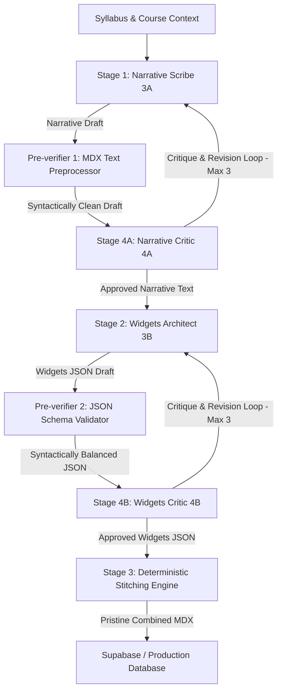

# Agent 3: Academic Scribe & Widgets Architect Architecture Guide

Agent 3 is a highly sophisticated, decoupled curriculum generator responsible for producing rich, publication-grade academic lesson content (MDX) and interactive components. It operates inside an inverted, decoupled pipeline designed to enforce extreme academic density, factual integrity, and visual/pedagogical excellence.

---

## 1. High-Level Pipeline Architecture (Narrative-First, Widgets-Second)

To ensure perfect alignment between the written course paragraphs and generated assessments, the pipeline operates in a sequence where the text is drafted first, and the matching widgets are designed second:

---

## 2. Detailed Stages

### Stage 1: Narrative Scribe (Agent 3A)
* **Goal**: Writes the complete academic narrative text, weaving custom and standard bracketed placeholder tags `[[WIDGET:id]]` directly into the text.
* **Prompt Pruning (Discipline-Aware)**:
  - The database widgets catalog is dynamically filtered based on the course's discipline (e.g., if a course is a *Formal Science*, we omit biology simulators; if it is a *Humanities* course, we omit mathematical plotting canvases).
  - This keeps the catalog highly compact, preventing context pollution and hallucinatory widget placements.
* **Pure English Prompts (0 French)**:
  - All prompt texts, system instructions, and schemas are strictly written in 100% pure English. No French translations or dual instructions remain inside the prompts.

### Pre-verifier 1: MDX Text Preprocessor & Corrector
- A deterministic parser runs on the generated narrative text to balance parentheses on double-bracketed links, strip stray code fences, check formatting of figures, and pre-clean the MDX text.

### Stage 4A: Narrative Critic (Agent 4A)
- A specialized critique loop focused **solely** on narrative quality, academic tone, target word count (3,000-5,000 words), mini-bios, hover-cards, and visual assets density.
- Operates with a loop of up to 3 attempts. Once approved, the narrative text is locked.

### Stage 2: Widgets Architect (Agent 3B)
* **Goal**: Receives the *approved* narrative text from Stage 1, parses and extracts all placed `[[WIDGET:id]]` anchors, and generates a validated JSON object conforming to `lessonWidgetsSchema` to define every single one of those anchors.
* **Semantic Alignment**: Because the writer already formulated the claims and introduction, the Widgets Architect can generate highly accurate diagnostic/summative quizzes, learning objectives, glossaries, and bibliographical references tailored perfectly to the narrative.
* **Curation-First Matchmaker Mandate**: 
  - To maintain absolute technical accuracy and robustness, Agent 1/2/3 do not write complex dynamic JavaScript code or simulators from scratch.
  - Instead, the stage queries the discipline-filtered `widgets_catalog.json` and acts as a **Matchmaker**, choosing pre-designed, curated widgets (e.g., `<DataChart />`, `<FunctionPlotter />`, `<BioSimulator />`, etc.).
  - It sets their `props` to an empty object `{}` so their pre-configured behaviors are resolved programmatically at runtime.
* **Budget Limits**: Enforces a strict budget of **at most 2 database-curated widgets per course** and **at most 1 database-curated widget per lesson**, with **zero duplication** (never repeating a widget ID that was already used earlier in the course).
* **Simple Discursive Components**: It can freely generate reliable, on-the-fly text components like:
  - `Quiz`: Multi-choice diagnostic/summative questions.
  - `FillInBlanks`: Structured sentence completions.
  - `SolvedExercise`: Worked mathematical or scientific problems.
  - `UnsolvedExercise`: Conceptual questions with answers and rationales.

### Pre-verifier 2: JSON Schema Validator & Corrector
- A robust validator and auto-corrector parsing the JSON to ensure all required fields are present, array lengths are valid, and correct option indices are in range before passing it to the widgets critic.

### Stage 4B: Widgets Critic (Agent 4B)
- A specialized critique loop auditing only the pedagogical accuracy, question formatting, reference formatting (disciplinary citation style like APA 7 or Chicago), and database-curated properties of the JSON.
- Operates with a loop of up to 3 attempts. Once approved, the widgets JSON is locked.

### Stage 3: Deterministic Stitching Engine
* **Goal**: Programmatically merges the pre-approved narrative text and pre-approved widgets JSON.
* **Rationale**: Because both modules have been verified and approved in isolation, this stitching stage is **completely deterministic** and requires **zero AI critique loops**. It instantly outputs pristine, production-ready React-MDX.

---

## 3. Reference Files & Artifacts

### Prompts (Inputs)
- **Stage 1 (Narrative Scribe Prompt)**: Located inside `web/src/lib/ai.ts` as `narrativePrompt` and archived as [agent3_stage1_narrative_prompt.md](file:///c:/Silvere/Encours/Developpement/OpenPrimer/web/drafts_revisions/agent3_stage1_narrative_prompt.md).
- **Stage 2 (Widgets Architect Prompt)**: Located inside `web/src/lib/ai.ts` as `widgetsPrompt` and archived as [agent3_stage2_widgets_prompt.md](file:///c:/Silvere/Encours/Developpement/OpenPrimer/web/drafts_revisions/agent3_stage2_widgets_prompt.md).
- **Stage 4A (Narrative Critic Prompt)**: Located inside `web/src/lib/ai.ts` as `narrativeCriticPrompt` and archived as [agent4a_narrative_critic_prompt.md](file:///c:/Silvere/Encours/Developpement/OpenPrimer/web/drafts_revisions/agent4a_narrative_critic_prompt.md).
- **Stage 4B (Widgets Critic Prompt)**: Located inside `web/src/lib/ai.ts` as `widgetsCriticPrompt` and archived as [agent4b_widgets_critic_prompt.md](file:///c:/Silvere/Encours/Developpement/OpenPrimer/web/drafts_revisions/agent4b_widgets_critic_prompt.md).

### Schemas (JSON validation structures)
- **Widgets Schema**: Enforces the JSON structure of Stage 2, located inside `web/src/lib/ai.ts` as `lessonWidgetsSchema` and archived as [agent3_widgets_schema.json](file:///c:/Silvere/Encours/Developpement/OpenPrimer/web/drafts_revisions/agent3_widgets_schema.json).
- **Verifier Schema**: Enforces the JSON structure of the Stage 4 validation reports, located inside `web/src/lib/ai.ts` as `verificationSchema` and archived as [agent4_verification_schema.json](file:///c:/Silvere/Encours/Developpement/OpenPrimer/web/drafts_revisions/agent4_verification_schema.json).

### Outputs (Produced Files)
- **Production Data**: The final compiled and approved lesson MDX text and structured interactive components JSON are uploaded directly to the Supabase PostgreSQL database under the `public.lessons` table.
- **Reference Files (Drafts & Examples)**: Full, high-density MDX lesson drafts are archived as reference points in `web/drafts_revisions/` (e.g., `agent3_final_chapter_1_...mdx`).
