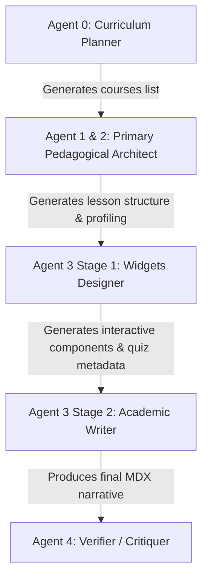

# 📐 OpenPrimer Multi-Agent JSON Schemas

This document centralizes the exact structural JSON schemas used by all agents in the OpenPrimer generation pipeline, preserved and validated in `web/drafts_revisions/`.

---

## 🗺️ Pipeline Architecture Schema Map



---

## 1. 🗂️ Agent 0 (Curriculum Planner)
* **File Reference**: [`agent0_curriculum_schema.json`](file:///C:/Silvere/Encours/Developpement/OpenPrimer/web/drafts_revisions/agent0_curriculum_schema.json)
* **Role**: Defines the high-level curriculum description and maps out the list of constituent courses/modules for a given discipline and academic level.

```json
{
  "$schema": "http://json-schema.org/draft-07/schema#",
  "title": "Agent 0 Curriculum Schema",
  "type": "object",
  "properties": {
    "description": {
      "type": "string",
      "description": "Comprehensive, professional academic overview of the entire curriculum."
    },
    "courses": {
      "type": "array",
      "items": {
        "type": "object",
        "properties": {
          "title": { "type": "string", "description": "Explicit academic title of the course/module." },
          "subject": { "type": "string", "description": "Broad subject or discipline (e.g., Mathematics, Cognitive Sciences)." },
          "volume": { "type": "string", "description": "Estimated volume or contact hours (e.g., '30 hours')." },
          "type": { "type": "string", "enum": ["mandatory", "optional"] },
          "description": { "type": "string", "description": "Course-level summary detailing goals and scope." }
        },
        "required": ["title", "subject", "volume", "type", "description"]
      }
    }
  },
  "required": ["description", "courses"]
}
```

---

## 2. 🏛️ Agent 1 & 2 (Primary Pedagogical Architect)
* **File Reference**: [`agent1_2_syllabus_schema.json`](file:///C:/Silvere/Encours/Developpement/OpenPrimer/web/drafts_revisions/agent1_2_syllabus_schema.json)
* **Role**: Analyzes the disciplinary epistemological DNA and plans the sequential lessons (chapters list), defining target level strategies, expected cognitive artifacts, and technical depths.

```json
{
  "$schema": "http://json-schema.org/draft-07/schema#",
  "title": "Agent 1 & 2 Syllabus Schema",
  "type": "object",
  "properties": {
    "courseContext": {
      "type": "object",
      "properties": {
        "discipline": { "type": "string" },
        "description": { "type": "string" },
        "epistemologicalMatrix": { 
          "type": "string", 
          "enum": ["Déductive", "Empirique", "Discursive", "Ingénierie"] 
        },
        "targetLevel": { "type": "string" },
        "pedagogicalStrategy": { "type": "string", "description": "Explanation of the custom teaching approach." }
      },
      "required": ["discipline", "description", "epistemologicalMatrix", "targetLevel", "pedagogicalStrategy"]
    },
    "lessons": {
      "type": "array",
      "items": {
        "type": "object",
        "properties": {
          "title": { "type": "string" },
          "slug": { "type": "string" },
          "cognitiveArtifact": { "type": "string", "description": "Interactive learning anchor (e.g., 'Schéma d'anatomie légendé')" },
          "technicalDepth": { "type": "string", "description": "Detailed guidelines to direct the writing agent." }
        },
        "required": ["title", "slug", "cognitiveArtifact", "technicalDepth"]
      }
    }
  },
  "required": ["courseContext", "lessons"]
}
```

---

## 3. 🧩 Agent 3 Stage 1 (Widgets Designer)
* **File Reference**: [`agent3_widgets_schema.json`](file:///C:/Silvere/Encours/Developpement/OpenPrimer/web/drafts_revisions/agent3_widgets_schema.json)
* **Role**: Produces the structured, interactive "WFTA" (Widgets First, Text After) pedagogical components—including prerequisites, diagnostic quizzes, learning objectives, custom interactive tools (hotspots, sandboxes, function plotters), conclusion points, somatic final evaluations, glossary terms, and bibliography.

```json
{
  "$schema": "http://json-schema.org/draft-07/schema#",
  "title": "Agent 3 Stage 1 Widgets Schema",
  "type": "object",
  "properties": {
    "prerequisites": {
      "type": "object",
      "properties": {
        "items": {
          "type": "array",
          "items": {
            "type": "object",
            "properties": {
              "title": { "type": "string" },
              "slug": { "type": "string" },
              "level": { "type": "string" },
              "subject": { "type": "string" }
            },
            "required": ["title", "slug", "level", "subject"]
          }
        }
      },
      "required": ["items"]
    },
    "diagnosticQuiz": {
      "type": "object",
      "properties": {
        "question": { "type": "string" },
        "options": { "type": "array", "items": { "type": "string" } },
        "correctIndex": { "type": "integer" },
        "targetSectionId": { "type": "string" },
        "sectionTitle": { "type": "string" }
      },
      "required": ["question", "options", "correctIndex", "targetSectionId", "sectionTitle"]
    },
    "learningObjectives": {
      "type": "object",
      "properties": {
        "knowledge": { "type": "array", "items": { "type": "string" } },
        "skills": { "type": "array", "items": { "type": "string" } },
        "attitudes": { "type": "array", "items": { "type": "string" } }
      },
      "required": ["knowledge", "skills", "attitudes"]
    },
    "interactiveComponents": {
      "type": "array",
      "items": {
        "type": "object",
        "properties": {
          "id": { "type": "string" },
          "componentType": { "type": "string" },
          "sectionAnchor": { "type": "string" },
          "props": { "type": "object" }
        },
        "required": ["id", "componentType", "sectionAnchor", "props"]
      }
    },
    "whatsNext": {
      "type": "object",
      "properties": {
        "steps": {
          "type": "array",
          "items": {
            "type": "object",
            "properties": {
              "title": { "type": "string" },
              "description": { "type": "string" },
              "slug": { "type": "string" }
            },
            "required": ["title", "description", "slug"]
          }
        }
      },
      "required": ["steps"]
    },
    "conclusionSummary": {
      "type": "object",
      "properties": {
        "items": { "type": "array", "items": { "type": "string" } }
      },
      "required": ["items"]
    },
    "finalEvaluation": {
      "type": "object",
      "properties": {
        "type": { "type": "string" },
        "props": { "type": "object" }
      },
      "required": ["type", "props"]
    },
    "glossary": {
      "type": "array",
      "items": {
        "type": "object",
        "properties": {
          "term": { "type": "string" },
          "definition": { "type": "string" }
        },
        "required": ["term", "definition"]
      }
    },
    "references": {
      "type": "array",
      "items": { "type": "string" }
    }
  },
  "required": [
    "prerequisites",
    "diagnosticQuiz",
    "learningObjectives",
    "interactiveComponents",
    "whatsNext",
    "conclusionSummary",
    "finalEvaluation",
    "glossary",
    "references"
  ]
}
```

---

## 4. 🔍 Agent 4 (Verifier / Critiquer)
* **File Reference**: [`agent4_verification_schema.json`](file:///C:/Silvere/Encours/Developpement/OpenPrimer/web/drafts_revisions/agent4_verification_schema.json)
* **Role**: Evaluates the finished MDX lesson narrative and code layout against strict compilation guidelines, educational standards, and factual accuracy. Reports validation results and feedback.

```json
{
  "$schema": "http://json-schema.org/draft-07/schema#",
  "title": "Agent 4 Verification Schema",
  "type": "object",
  "properties": {
    "approved": {
      "type": "boolean",
      "description": "True if content is 100% compliant, false if compilation errors or structural violations exist."
    },
    "critique": {
      "type": "string",
      "description": "Detailed breakdown of the audit, highlighting line-level issues, spelling errors, or invalid component props."
    }
  },
  "required": ["approved", "critique"]
}
```
