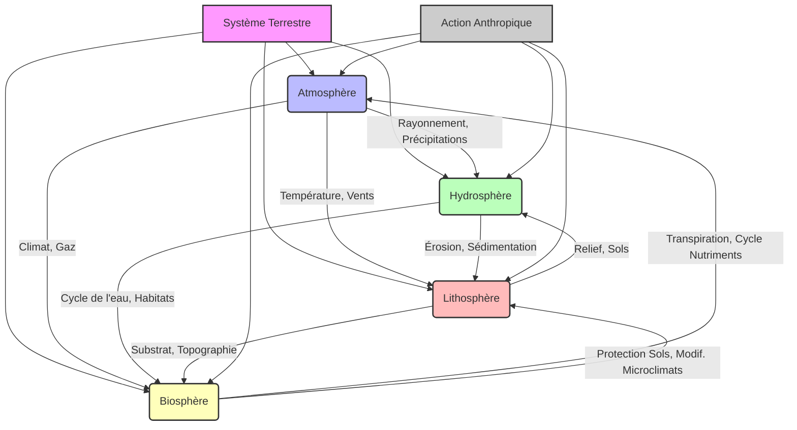

## Introduction à l'Évaluation Terminale

L'évaluation terminale du cours de Géographie physique et climatologie constitue une étape cruciale de votre parcours en Licence 3. Son objectif principal est de mesurer votre capacité à synthétiser et à appliquer les connaissances acquises tout au long du semestre, mais aussi à démontrer une compréhension approfondie des mécanismes et des interrelations qui façonnent notre environnement terrestre. Loin d'être une simple restitution de faits, cet examen vise à évaluer votre esprit critique, votre aptitude à l'analyse spatiale et temporelle, ainsi que votre maîtrise des concepts fondamentaux de la discipline.

Cette évaluation revêt une importance capitale pour plusieurs raisons. Premièrement, elle représente la culmination de vos apprentissages en géographie physique et climatologie, consolidant les bases nécessaires à la poursuite d'études en Master ou à l'intégration dans des parcours professionnels exigeant une expertise environnementale. Deuxièmement, elle vous prépare aux exigences méthodologiques et rédactionnelles des examens universitaires de haut niveau. Enfin, la réussite de cette épreuve atteste de votre capacité à appréhender la complexité des systèmes naturels et des enjeux environnementaux contemporains, compétences essentielles pour tout géographe.

Le format général de l'examen sera le suivant :
*   **Durée :** L'épreuve s'étendra sur une période de trois (3) heures.
*   **Types de questions :** L'examen combinera plusieurs types de questions pour évaluer différentes facettes de vos compétences :
    *   **Questions de synthèse (dissertation) :** Une question principale nécessitant une argumentation structurée, l'intégration de concepts variés et la mobilisation d'exemples pertinents.
    *   **Questions à réponses courtes :** Des questions ciblées pour vérifier la maîtrise de définitions, de mécanismes spécifiques ou de classifications.
    *   **Analyse de documents :** Il pourra s'agir d'une carte topographique, d'un profil en long, d'un diagramme climatique (climogramme), d'une image satellite, ou d'un texte scientifique, nécessitant une interprétation et une analyse critique.
    *   **Schémas ou croquis :** La réalisation de schémas explicatifs ou de croquis de synthèse pour illustrer des processus ou des organisations spatiales.
*   **Barème :** La répartition des points sera clairement indiquée sur le sujet. Généralement, la question de synthèse aura le poids le plus important, reflétant l'exigence de démonstration d'une compréhension globale et intégrée du cours.

Cette évaluation terminale est conçue pour synthétiser l'ensemble des apprentissages du cours de Géographie physique et climatologie. Elle vous demandera de tisser des liens entre les différentes composantes de la Terre – l'atmosphère, l'hydrosphère, la lithosphère et la biosphère – et de comprendre comment elles interagissent pour former des paysages et des climats variés. Il ne s'agit pas d'une simple juxtaposition de connaissances, mais bien d'une démonstration de votre capacité à adopter une [[WIDGET:ConceptLink:approche_systemique:approche systémique]] face aux phénomènes géographiques et environnementaux.

## Rappel des Concepts Fondamentaux et Thématiques Clés

Le cours de Géographie physique et climatologie a exploré les dynamiques complexes qui façonnent la surface de notre planète et son enveloppe gazeuse. L'évaluation terminale portera sur les grandes thématiques et les concepts essentiels abordés, en insistant sur les interconnexions entre ces notions pour une compréhension holistique et systémique.

### Géographie Physique : Les Fondements de la Terre Solide et Liquide

La géographie physique se concentre sur l'étude des processus naturels qui modèlent le relief, l'hydrosphère et la biosphère.

*   **Géomorphologie : L'Architecture de la Terre**
    La géomorphologie est la science qui étudie les formes du relief terrestre et les processus qui les créent, les modifient et les détruisent [ref3], [ref5]. Vous devrez maîtriser :
    *   **Les processus endogènes :** La tectonique des plaques (subduction, divergence, collision), le volcanisme et les séismes, responsables de la création des grandes structures du relief (chaînes de montagnes, fosses océaniques, rifts).
    *   **Les processus exogènes :** L'altération (physique, chimique, biologique) et l'érosion (fluviale, glaciaire, éolienne, marine). Comprendre comment ces agents sculptent les paysages, créent des vallées, des deltas, des dunes ou des falaises.
    *   **Les formes de relief :** Identification et explication de la genèse des principaux types de reliefs (montagnes, plateaux, plaines, littoraux, karsts).
    *   **La dynamique fluviale :** Le cycle d'érosion fluviale, les profils en long, les méandres, les terrasses alluviales, les deltas.
    *   **La dynamique glaciaire :** La formation des glaciers, l'érosion et l'accumulation glaciaires (cirques, vallées en U, moraines).

*   **Hydrologie : Le Cycle de l'Eau et ses Manifestations**
    L'hydrologie étudie la distribution, la circulation et les propriétés de l'eau sur Terre. Les concepts clés incluent :
    *   **Le cycle de l'eau :** Comprendre les étapes (évaporation, condensation, précipitations, ruissellement, infiltration, transpiration) et les réservoirs (océans, atmosphère, glaciers, eaux souterraines, lacs, rivières).
    *   **Les bassins versants :** Définition, délimitation et rôle dans l'organisation des réseaux hydrographiques.
    *   **Les régimes hydrologiques :** L'influence des facteurs climatiques et géomorphologiques sur le débit des cours d'eau.
    *   **Les eaux souterraines :** Aquifères, nappes phréatiques, leur rôle et leur vulnérabilité.
    *   **Les zones humides :** Leur importance écologique et hydrologique.

[[WIDGET:Image:cycle_eau_global]]
*Légende : Représentation schématique du cycle global de l'eau, illustrant les principaux réservoirs et flux entre l'atmosphère, les continents et les océans.*

*   **Biogéographie : La Vie et ses Milieux**
    La biogéographie examine la répartition des espèces et des écosystèmes à la surface du globe, ainsi que les facteurs qui l'influencent [ref2].
    *   **Les facteurs de répartition :** L'influence du climat (température, précipitations), du sol (édaphisme), du relief et de l'action anthropique sur la distribution de la flore et de la faune.
    *   **Les biomes terrestres et aquatiques :** Caractérisation des grandes zones biogéographiques (forêts tropicales, déserts, toundras, prairies, écosystèmes marins et d'eau douce).
    *   **La biodiversité :** Ses enjeux, les menaces (déforestation, changement climatique, pollution) et les stratégies de conservation.

### Climatologie : L'Enveloppe Atmosphérique et ses Variations

La climatologie est l'étude des climats, de leurs mécanismes, de leur répartition et de leurs évolutions.

*   **Dynamique Atmosphérique : Le Moteur du Climat**
    *   **Composition et structure de l'atmosphère :** Les différentes couches (troposphère, stratosphère, etc.) et leur rôle.
    *   **Bilan énergétique terrestre :** Le rayonnement solaire, l'albédo, l'effet de serre naturel et son rôle fondamental pour la vie.
    *   **Circulation générale atmosphérique :** Les cellules de Hadley, Ferrel et polaires, les courants-jets, les hautes et basses pressions. Comprendre comment ces mécanismes distribuent la chaleur et l'humidité à l'échelle planétaire [ref1], [ref4].
    *   **Masses d'air et fronts :** Leur formation, leurs caractéristiques et leur rôle dans la météorologie des régions tempérées.
    *   **Phénomènes météorologiques extrêmes :** Cyclones tropicaux, tornades, vagues de chaleur, inondations.

*   **Les Climats du Monde : Diversité et Classification**
    *   **Facteurs des climats :** Latitude, altitude, continentalité, courants marins, exposition.
    *   **Classifications climatiques :** Maîtrise des principes de la classification de [[WIDGET:RealPerson:koppen:Wladimir Köppen]] et des grands types de climats qu'elle identifie (climats tropicaux, arides, tempérés, froids, polaires).
    *   **Caractéristiques régionales :** Description des principaux climats (équatorial, désertique, méditerranéen, continental, océanique, montagnard, polaire) et de leurs spécificités.

*   **Changements Climatiques : Enjeux et Perspectives**
    *   **Causes naturelles et anthropiques :** Les variations orbitales, l'activité solaire, le volcanisme versus les émissions de gaz à effet de serre d'origine humaine.
    *   **L'effet de serre anthropique :** Les principaux gaz à effet de serre (CO2, CH4, N2O) et leurs sources.
    *   **Conséquences des changements climatiques :** Élévation du niveau marin, acidification des océans, intensification des événements météorologiques extrêmes, impact sur la biodiversité et les écosystèmes, sécurité alimentaire et migrations [ref6].
    *   **Le rôle du [[WIDGET:ConceptLink:giec:GIEC]] :** Comprendre le rôle de cette organisation dans l'évaluation scientifique du changement climatique.

### Interconnexions et Approche Systémique

Un aspect fondamental de cette évaluation sera votre capacité à démontrer les interconnexions entre ces différentes composantes. Par exemple :
*   Comment le climat influence-t-il les processus géomorphologiques (érosion glaciaire, éolienne) et la répartition de la végétation (biomes) ?
*   Comment la géomorphologie (relief, bassins versants) conditionne-t-elle l'hydrologie et les régimes fluviaux ?
*   Comment les changements climatiques impactent-ils l'hydrologie (fonte des glaciers, sécheresses) et la biogéographie (déplacement des aires de répartition, extinctions) ?
*   L'action humaine, en modifiant les paysages (déforestation, urbanisation) ou en altérant le climat, a des répercussions en cascade sur l'ensemble de ces systèmes.

[[WIDGET:Mermaid:interconnexions_geo_clim]]

*Légende : Diagramme conceptuel illustrant les interconnexions fondamentales entre les sphères du système terrestre (Atmosphère, Hydrosphère, Lithosphère, Biosphère) et l'influence de l'action anthropique.*

[[WIDGET:Quiz:concepts_fondamentaux_quiz]]