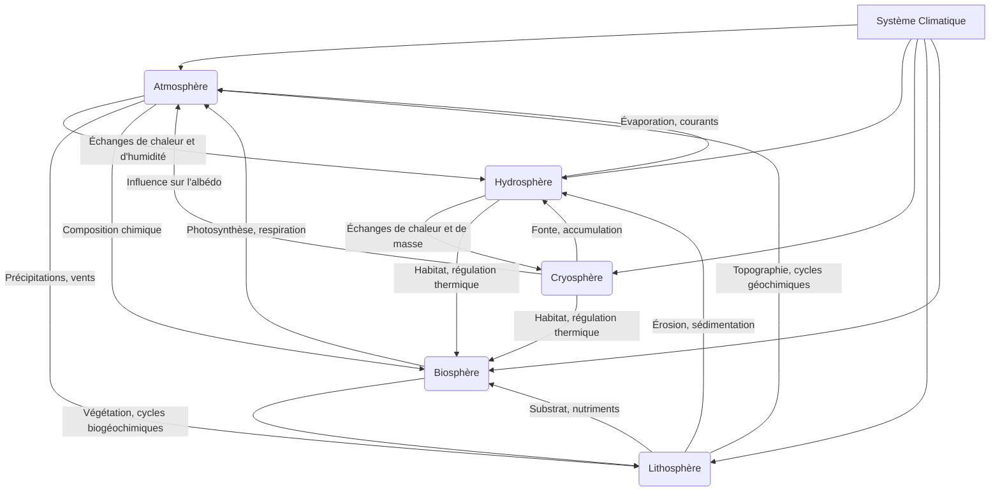

## Introduction au système climatique terrestre

Le climat de la Terre n'est pas une entité statique ou isolée, mais plutôt la manifestation dynamique d'un [[WIDGET:ConceptLink:systeme_climatique:système climatique]] complexe et interconnecté. Ce système englobe l'ensemble des interactions entre cinq composantes majeures: l'atmosphère, l'hydrosphère, la cryosphère, la lithosphère et la biosphère. Chacune de ces sphères joue un rôle crucial dans la régulation et la variation du climat global, et leurs interactions mutuelles déterminent les conditions météorologiques et climatiques que nous observons [ref1].

L'**atmosphère**, cette enveloppe gazeuse qui entoure notre planète, est le moteur principal des phénomènes météorologiques et le régulateur thermique essentiel. L'**hydrosphère** comprend toutes les formes d'eau sur Terre – océans, lacs, rivières, eaux souterraines – et agit comme un gigantesque réservoir de chaleur et un acteur majeur du cycle de l'eau. La **cryosphère**, quant à elle, regroupe les glaces et neiges permanentes (calottes polaires, glaciers, pergélisol), influençant l'albédo planétaire et le niveau des mers. La **lithosphère**, la couche solide externe de la Terre (continents et fonds océaniques), façonne les reliefs, influence les circulations atmosphériques et océaniques, et participe aux cycles biogéochimiques. Enfin, la **biosphère**, l'ensemble des êtres vivants, modifie la composition atmosphérique (photosynthèse, respiration), influence les cycles de l'eau et de l'énergie, et altère les surfaces terrestres [ref2].

Comprendre le climat de la Terre et ses variations, qu'elles soient naturelles ou anthropiques, nécessite une approche systémique. Au cœur de cette compréhension se trouvent les bilans énergétiques et la composition atmosphérique. Le flux d'énergie solaire entrant et la manière dont il est absorbé, réfléchi et réémis par la Terre, ainsi que la présence de gaz à effet de serre dans l'atmosphère, sont les déterminants fondamentaux du régime thermique de notre planète. Les déséquilibres dans ces bilans peuvent entraîner des changements climatiques significatifs, comme l'illustrent les rapports du [[WIDGET:RealPerson:giec:GIEC]] [ref6].

[[WIDGET:Mermaid:climate_system_components]]

*Diagramme conceptuel des interactions entre les composantes du système climatique terrestre.*

## Le bilan énergétique terrestre: flux et transferts

Le moteur principal de l'ensemble du système climatique terrestre est l'énergie solaire. Le Soleil émet un [[WIDGET:ConceptLink:rayonnement_solaire:rayonnement solaire]] sous forme d'ondes électromagnétiques, dont une partie atteint la Terre. Ce rayonnement incident est la source quasi exclusive de l'énergie qui anime les processus atmosphériques, océaniques et biosphériques [ref4]. Cependant, toute l'énergie solaire n'est pas absorbée par la Terre. Une fraction est réfléchie vers l'espace, tandis que le reste est absorbé par l'atmosphère, les océans et les surfaces terrestres.

Le concept d'[[WIDGET:Glossary:albedo:albédo]] est crucial pour comprendre ce processus. L'albédo représente la proportion de rayonnement solaire incident qui est réfléchie par une surface. Les surfaces claires, comme les calottes glaciaires et les nuages, ont un albédo élevé (réfléchissent beaucoup d'énergie), tandis que les surfaces sombres, comme les océans ou les forêts, ont un albédo faible (absorbent beaucoup d'énergie). L'albédo moyen de la Terre est d'environ 30%, ce qui signifie que 30% du rayonnement solaire est directement renvoyé vers l'espace [ref2].

L'énergie solaire absorbée par la Terre (environ 70%) réchauffe la surface et l'atmosphère. En réponse à ce réchauffement, la Terre émet à son tour de l'énergie sous forme de rayonnement terrestre (ou infrarouge) vers l'espace. Cet équilibre entre l'énergie solaire entrante et le rayonnement terrestre sortant est fondamental pour maintenir une température moyenne relativement stable à la surface de la planète. C'est ce que l'on appelle l'équilibre radiatif global.

Cependant, ce processus est modulé par la présence de certains gaz dans l'atmosphère, connus sous le nom de gaz à [[WIDGET:Glossary:effet_de_serre:effet de serre]]. Ces gaz absorbent une partie du rayonnement infrarouge émis par la Terre et le réémettent dans toutes les directions, y compris vers la surface terrestre. Ce phénomène naturel est essentiel pour la vie sur Terre, car il maintient la température moyenne à environ +15°C, au lieu de -18°C sans cet effet [ref5].

Outre le rayonnement, l'énergie est également transférée au sein du système climatique par des flux de chaleur latente et sensible. Le **flux de chaleur latente** est lié aux changements d'état de l'eau (évaporation, condensation). Lorsque l'eau s'évapore de la surface, elle absorbe de l'énergie (chaleur latente de vaporisation) qui est transportée dans l'atmosphère. Cette énergie est libérée lorsque la vapeur d'eau se condense pour former des nuages et des précipitations. Le **flux de chaleur sensible** correspond au transfert direct de chaleur par conduction et convection entre la surface terrestre et l'atmosphère, sans changement d'état de l'eau. Ces flux jouent un rôle majeur dans la redistribution de l'énergie thermique à l'échelle planétaire, influençant les circulations atmosphériques et océaniques [ref1].

[[WIDGET:Image:earth_energy_balance]]
*Représentation schématique du bilan énergétique de la Terre, montrant les flux de rayonnement solaire incident, de rayonnement réfléchi, de rayonnement terrestre émis et l'influence de l'atmosphère.*