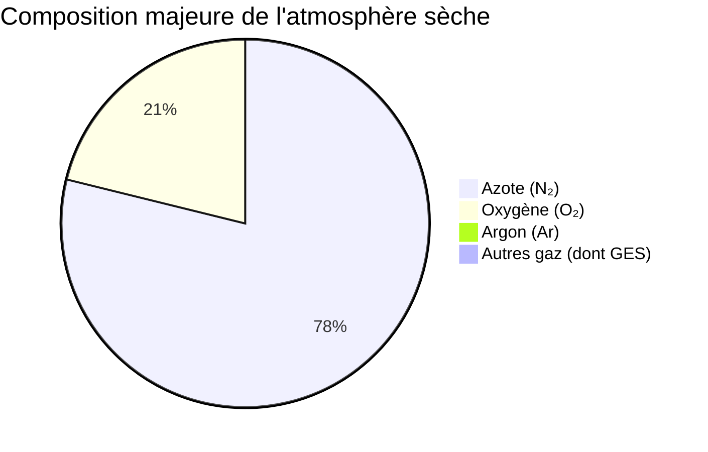

## Composition atmosphérique et rôle des gaz à effet de serre

L'atmosphère terrestre est une enveloppe gazeuse essentielle à la vie, dont la composition est relativement stable dans ses proportions principales. Elle est principalement constituée d'azote (N₂) à environ 78%, d'oxygène (O₂) à 21%, et d'argon (Ar) à près de 0,9% [ref1]. Ces gaz permanents sont chimiquement inertes ou peu réactifs et n'interagissent pas significativement avec le rayonnement infrarouge terrestre. Le 0,1% restant est composé de gaz traces, dont certains jouent un rôle disproportionné dans la régulation thermique de la planète : les [[WIDGET:Glossary:ges:gaz à effet de serre]] (GES).

[[WIDGET:Mermaid:atmospheric_composition_chart]]

*Répartition des principaux gaz constituant l'atmosphère terrestre sèche, hors vapeur d'eau.*

Les principaux GES sont la vapeur d'eau (H₂O), le dioxyde de carbone (CO₂), le méthane (CH₄), le protoxyde d'azote (N₂O) et l'ozone (O₃). Ces gaz ont la particularité d'être transparents au rayonnement solaire de courte longueur d'onde, mais d'absorber et de réémettre le [[WIDGET:ConceptLink:rayonnement_infrarouge:rayonnement infrarouge]] de grande longueur d'onde émis par la surface terrestre chauffée [ref5]. Ce processus est fondamental pour l'effet de serre naturel.

La vapeur d'eau est le GES le plus abondant et le plus puissant, contribuant à environ 60-70% de l'effet de serre naturel. Sa concentration varie considérablement dans l'atmosphère (de 0 à 4%) et est directement liée à la température de l'air. Le dioxyde de carbone (CO₂) est le deuxième contributeur majeur, responsable d'environ 20-25% de l'effet de serre naturel. Bien que sa concentration soit faible (environ 0,04% ou 400 ppm), il est particulièrement préoccupant en raison de son augmentation rapide due aux activités humaines (combustion de combustibles fossiles, déforestation) [ref6]. Le méthane (CH₄), bien que moins abondant que le CO₂, a un pouvoir de réchauffement global (PRG) par molécule bien plus élevé sur une période de 100 ans. Il est émis par des processus naturels (zones humides) et anthropiques (agriculture, élevage, fuites de gaz) [ref6]. Le protoxyde d'azote (N₂O) provient principalement de l'agriculture et des processus industriels, tandis que l'ozone (O₃) stratosphérique est bénéfique (filtre les UV), mais l'ozone troposphérique est un polluant et un GES.

Outre ces GES naturels, des gaz d'origine purement anthropique, comme les chlorofluorocarbures (CFCs) et les hydrofluorocarbures (HFCs), ont été introduits par l'industrie. Bien que leurs concentrations soient faibles, leur pouvoir de réchauffement est extrêmement élevé, et ils contribuent également à la destruction de la couche d'ozone stratosphérique [ref6]. La capacité de ces gaz à absorber et réémettre le rayonnement infrarouge est due à la structure de leurs molécules, qui peuvent vibrer à des fréquences correspondant à celles du rayonnement thermique terrestre. Ce phénomène a été compris dès le XIXe siècle, notamment par [[WIDGET:RealPerson:joseph_fourier:Joseph Fourier]] qui a été le premier à décrire le principe de l'effet de serre [ref5].

## Modélisation simplifiée de l'effet de serre

Pour comprendre le mécanisme fondamental de l'effet de serre, des modèles conceptuels simplifiés sont souvent utilisés. Ces modèles permettent de calculer une température d'équilibre théorique de la Terre dans différentes configurations.

### Modèle du corps noir (Terre sans atmosphère)

Le modèle le plus simple considère la Terre comme un [[WIDGET:Glossary:corps_noir:corps noir]] parfait en équilibre radiatif avec le Soleil, sans atmosphère. Dans ce scénario, la Terre absorbe le rayonnement solaire et émet son propre rayonnement infrarouge vers l'espace. La température d'équilibre peut être calculée en utilisant la [[WIDGET:ConceptLink:loi_stefan_boltzmann:loi de Stefan-Boltzmann]], qui relie la puissance rayonnée par un corps noir à sa température.

En supposant un albédo moyen de la Terre (environ 0,3) et une constante solaire (environ 1361 W/m²), la température d'équilibre théorique de la Terre sans atmosphère serait d'environ -18°C (255 K) [ref2]. Cette valeur est significativement inférieure à la température moyenne observée de +15°C, ce qui met en évidence l'importance de l'atmosphère et de l'effet de serre naturel.

### Modèle à une couche atmosphérique

Pour illustrer l'effet de serre, un modèle conceptuel plus élaboré est le modèle à une couche atmosphérique. Ce modèle simplifie l'atmosphère en une seule couche gazeuse qui est transparente au rayonnement solaire incident mais opaque au rayonnement infrarouge terrestre.

Dans ce modèle, la surface terrestre absorbe le rayonnement solaire et émet du rayonnement infrarouge. La couche atmosphérique absorbe tout le rayonnement infrarouge émis par la surface et réémet à son tour du rayonnement infrarouge à la fois vers l'espace et vers la surface terrestre. Pour maintenir l'équilibre énergétique, la surface doit se réchauffer davantage pour compenser le rayonnement infrarouge réémis par l'atmosphère vers le bas. Ce modèle simple prédit une température de surface terrestre d'environ +30°C, ce qui est supérieur à la température observée.

[[WIDGET:Mermaid:one_layer_model_diagram]]
```mermaid
graph TD
    A[Rayonnement Solaire Incident] --> B{Surface Terrestre}
    B -- Rayonnement IR Émis --> C[Couche Atmosphérique (GES)]
    C -- Rayonnement IR vers l'Espace --> D(Espace)
    C -- Rayonnement IR vers la Surface --> B
    B -- Chaleur Latente/Sensible --> C
```
*Diagramme conceptuel du modèle à une couche atmosphérique, illustrant les flux d'énergie et le rôle de la couche de gaz à effet de serre.*

### Limites des modèles simplifiés

Ces modèles, bien qu'utiles pour illustrer le principe de l'effet de serre, présentent des limites importantes :
*   **Simplification excessive:** Ils ne tiennent pas compte de la structure verticale complexe de l'atmosphère, des variations de concentration des GES, de la présence de nuages, des transferts de chaleur par convection et évaporation, ni des cycles biogéochimiques [ref1].
*   **Homogénéité:** Ils supposent une Terre et une atmosphère homogènes, sans variations géographiques ou saisonnières.
*   **Absence de dynamique:** Ils ignorent les mouvements atmosphériques et océaniques qui redistribuent l'énergie.

Malgré ces simplifications, ils démontrent clairement que la présence de gaz absorbant le rayonnement infrarouge dans l'atmosphère est indispensable pour maintenir la Terre à une température propice à la vie, et que toute modification de la concentration de ces gaz peut altérer cet équilibre thermique [ref6].