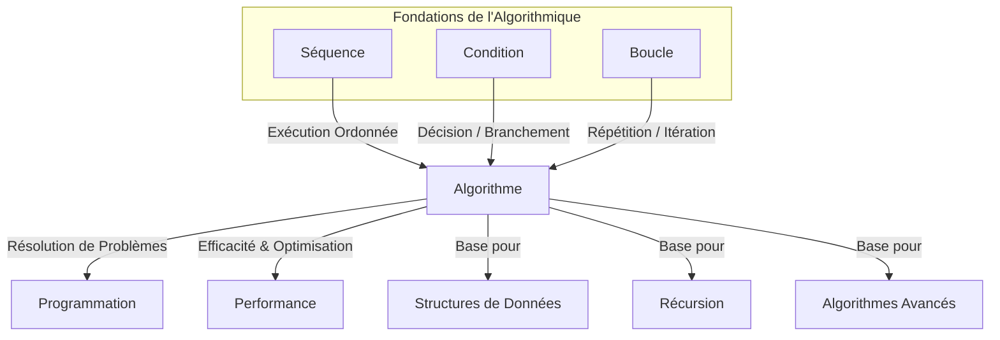

## Conclusion et perspectives

Nous voici arrivés au terme de cette exploration des fondements de l'algorithmique. Après avoir abordé la méthodologie de résolution de problèmes et s'être exercé à travers divers cas pratiques, il est temps de synthétiser les concepts clés et d'entrevoir les horizons futurs de votre apprentissage.

Au cours de cette leçon, nous avons décomposé le processus de construction algorithmique en ses éléments constitutifs les plus fondamentaux : les séquences, les conditions et les boucles. Ces trois types de structures de contrôle, bien que simples en apparence, sont les véritables "briques élémentaires" à partir desquelles tout algorithme, quelle que soit sa complexité, est édifié.

La **séquence** représente l'ordre linéaire et inaltérable dans lequel les instructions sont exécutées. C'est la base même de tout programme, garantissant que chaque étape est traitée dans la chronologie prévue, du début à la fin. Sans une séquence claire, l'exécution d'un algorithme serait chaotique et imprévisible. Elle assure la progression logique et déterministe de l'algorithme.

Les **conditions**, ou structures de choix (comme `Si...Alors...Sinon` ou `Selon`), introduisent la capacité de prise de décision. Elles permettent à l'algorithme de s'adapter dynamiquement aux données d'entrée ou à l'état courant du système. C'est grâce aux conditions que nos algorithmes peuvent réagir différemment selon les scénarios, gérer des cas particuliers, valider des entrées ou orienter le flux d'exécution vers des chemins alternatifs. Cette capacité de branchement est cruciale pour la flexibilité et l'intelligence des programmes.

Enfin, les **boucles**, ou structures itératives (`Tant que`, `Pour`, `Répéter...Jusqu'à`), confèrent à l'algorithme le pouvoir de la répétition. Elles sont indispensables pour traiter des collections de données, effectuer des calculs itératifs, ou répéter une série d'opérations un nombre défini ou indéfini de fois. Les boucles sont le moteur de l'efficacité algorithmique, permettant de réaliser des tâches volumineuses avec un code concis et optimisé, évitant la répétition fastidieuse d'instructions.

L'importance de maîtriser ces trois concepts ne peut être sous-estimée. Ils constituent le socle universel de la pensée algorithmique et de la programmation. Indépendamment du langage de programmation que vous apprendrez par la suite (Python, Java, C++, JavaScript, etc.), vous retrouverez toujours ces mêmes structures de contrôle, parfois sous des syntaxes différentes, mais avec la même logique sous-jacente. Comprendre leur fonctionnement intrinsèque et savoir comment les combiner de manière judicieuse est la clé pour traduire n'importe quel problème du monde réel en une série d'instructions compréhensibles par une machine.

La capacité à décomposer un problème complexe en sous-problèmes, puis à assembler ces briques élémentaires pour construire une solution cohérente et fonctionnelle, est la marque d'un bon concepteur d'algorithmes. C'est un art qui s'acquiert par la pratique assidue et la réflexion critique. Chaque exercice que vous avez abordé était une occasion de renforcer cette intuition, de développer votre logique et d'affiner votre capacité à structurer la pensée.

Considérez ces briques comme les fondations solides sur lesquelles vous allez bâtir des édifices de plus en plus complexes. Sans une compréhension approfondie de ces bases, toute tentative de construire des systèmes plus avancés serait vouée à l'échec. Elles sont le langage commun entre l'humain et la machine, le pont entre une idée abstraite et son exécution concrète.

Pour illustrer cette interconnexion et leur rôle fondamental, voici une représentation schématique de la manière dont ces concepts s'articulent pour former la base de l'algorithmique et ouvrent la voie à des domaines plus avancés :

[[WIDGET:Mermaid:alg_foundations]]

**Perspectives pour la suite de votre apprentissage :**

Ce cours n'est que le premier pas dans votre parcours en algorithmique. Les prochaines étapes vous mèneront vers des concepts plus sophistiqués, mais toujours ancrés dans les principes que vous venez d'acquérir :

1.  **Les Structures de Données :** Un algorithme ne peut exister sans données. La manière dont ces données sont organisées (tableaux, listes chaînées, piles, files, arbres, graphes, etc.) a un impact majeur sur l'efficacité et la complexité des algorithmes qui les manipulent. Vous apprendrez à choisir la structure de données la plus appropriée pour un problème donné.
2.  **La Récursion :** Une technique puissante qui permet de résoudre un problème en le divisant en sous-problèmes similaires de plus petite taille, jusqu'à atteindre un cas de base. C'est une alternative élégante aux boucles pour certaines catégories de problèmes.
3.  **L'Analyse de Complexité :** Au-delà de la simple correction d'un algorithme, il est crucial d'évaluer son efficacité en termes de temps d'exécution et d'espace mémoire requis. L'analyse de complexité (notation Grand O) vous permettra de comparer et d'optimiser vos solutions.
4.  **Les Paradigmes Algorithmiques Avancés :** Vous explorerez des approches de conception plus élaborées comme la "division et conquête" (Divide and Conquer), la "programmation dynamique", les "algorithmes gloutons" (Greedy Algorithms), et bien d'autres, qui sont des stratégies éprouvées pour résoudre des classes spécifiques de problèmes.
5.  **L'Implémentation :** Finalement, vous passerez de la conception en pseudo-code à l'implémentation concrète de vos algorithmes dans un ou plusieurs langages de programmation. C'est là que la théorie rencontre la pratique, et que vous verrez vos algorithmes prendre vie.

En conclusion, les séquences, conditions et boucles ne sont pas de simples outils techniques ; elles sont les piliers de la pensée computationnelle. Leur maîtrise est la pierre angulaire de toute carrière en informatique, vous permettant de concevoir des solutions élégantes et efficaces aux défis numériques de demain. Continuez à pratiquer, à expérimenter et à interroger la logique derrière chaque instruction. C'est ainsi que vous développerez une intuition algorithmique solide et durable.

[[WIDGET:conclusionSummary]]
[[WIDGET:whatsNext]]
[[WIDGET:goingFurther]]
[[WIDGET:finalEvaluation]]