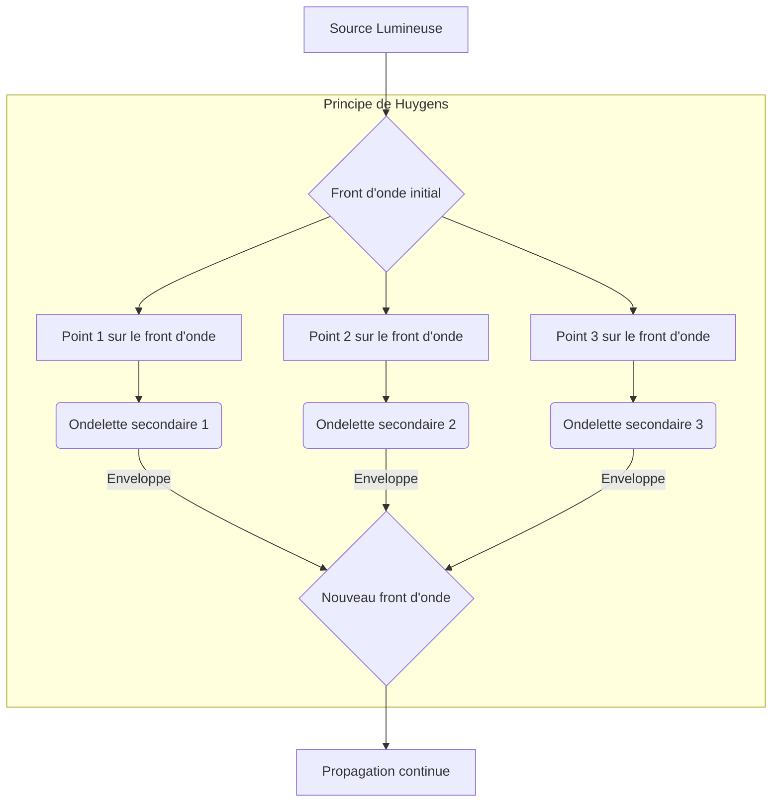
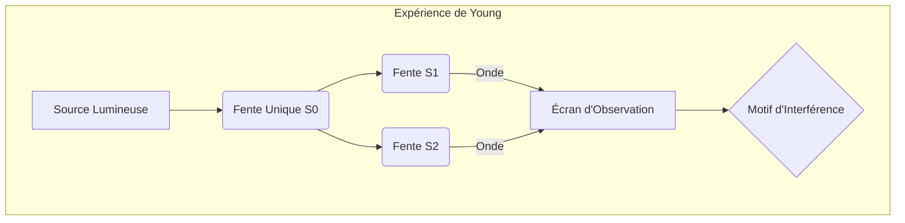

[[WIDGET:prerequisites]]

[[WIDGET:diagnosticQuiz]]

## Introduction : Le Grand Débat sur la Nature de la Lumière

Depuis l'Antiquité, la nature intrinsèque de la lumière a fasciné et interrogé les esprits les plus brillants. Est-elle une particule, une onde, ou quelque chose d'encore plus complexe ? Cette question fondamentale a donné lieu à l'un des débats les plus persistants et les plus fructueux de l'histoire de la physique, un débat qui a façonné notre compréhension non seulement de la lumière elle-même, mais aussi de l'univers dans son ensemble. Au XVIIe siècle, alors que la science moderne commençait à prendre son essor, deux théories majeures ont émergé, chacune portée par des arguments et des observations convaincants : la théorie corpusculaire, défendue avec éloquence par <RealPerson name="Isaac Newton" description="Mathématicien, physicien, astronome, théologien et philosophe anglais, figure emblématique des sciences. (1642-1727)">Isaac Newton</RealPerson>, et la théorie ondulatoire, proposée par <RealPerson name="Christiaan Huygens" description="Mathématicien, physicien et astronome néerlandais, inventeur de l'horloge à pendule. (1629-1695)">Christiaan Huygens</RealPerson>. Ce n'est qu'au début du XIXe siècle que les expériences décisives de <RealPerson name="Thomas Young" description="Médecin, physicien et égyptologue anglais, connu pour ses travaux sur la lumière et le déchiffrement des hiéroglyphes. (1773-1829)">Thomas Young</RealPerson> ont apporté des preuves irréfutables en faveur de la nature ondulatoire de la lumière, marquant un tournant épistémologique majeur. Ce chapitre se propose d'analyser en profondeur l'émergence de cette conception ondulatoire, en retraçant les arguments, les expériences et les figures clés qui ont jalonné cette révolution scientifique.

L'étude de la lumière n'est pas qu'une simple curiosité intellectuelle ; elle est au cœur de nombreuses technologies et de notre capacité à sonder le cosmos. Comprendre comment la lumière se propage, interagit avec la matière et transporte de l'énergie est essentiel pour des domaines aussi variés que l'astronomie, la médecine, l'ingénierie des communications et la physique des matériaux. Les modèles développés pour décrire la lumière ont des implications profondes, non seulement pour la physique optique, mais aussi pour la mécanique quantique et la théorie de la relativité. Le passage d'une vision corpusculaire à une vision ondulatoire, puis à une dualité onde-particule, illustre parfaitement la nature évolutive et auto-correctrice de la démarche scientifique. Nous allons explorer les fondements de ces théories, les raisons de leur adoption ou de leur rejet, et les expériences qui ont permis de trancher, du moins temporairement, en faveur de l'une d'elles. Ce parcours historique est crucial pour apprécier la sophistication des modèles actuels et les défis encore ouverts dans la compréhension de la lumière.

[[WIDGET:learningObjectives]]

## 1. La Théorie Corpusculaire de Newton : Une Lumière Faite de Particules

Au XVIIe siècle, la figure dominante de la science était sans conteste Isaac Newton. Ses travaux sur la mécanique, la gravitation et le calcul ont révolutionné la physique et les mathématiques. Il était donc naturel que ses idées sur la lumière aient un poids considérable. Dans son œuvre majeure, *Opticks*, publiée en 1704, Newton a développé une théorie corpusculaire de la lumière, selon laquelle la lumière est composée de minuscules particules, ou « corpuscules », émises par les corps lumineux [[WIDGET:Citation:newton_opticks:Newton's seminal work on light]]. Ces corpuscules voyageraient en ligne droite à grande vitesse et interagiraient avec la matière selon les lois de la mécanique classique. L'influence de Newton était telle que sa théorie a dominé la pensée scientifique pendant plus d'un siècle, malgré l'existence de théories alternatives.

[[WIDGET:Biography:bio_newton:Isaac Newton (1643-1727), mathématicien, physicien, astronome, théologien et philosophe anglais, figure emblématique des sciences. Ses travaux ont jeté les bases de la mécanique classique et de l'optique moderne.]]

### 1.1. Les Arguments en Faveur de la Théorie Corpusculaire

Newton a avancé plusieurs arguments pour étayer sa théorie, tous ancrés dans une vision mécaniste du monde. Le plus évident était la propagation rectiligne de la lumière, observée depuis l'Antiquité. Les ombres nettes, la formation d'images par des lentilles et des miroirs, et le fait que la lumière ne semble pas « tourner les coins » comme le son, semblaient parfaitement s'expliquer par des particules se déplaçant en ligne droite. Si la lumière était une onde, on s'attendrait à ce qu'elle contourne les obstacles, un phénomène connu sous le nom de diffraction, qui était peu compris ou mal interprété à l'époque. Newton lui-même avait observé des phénomènes de diffraction, mais les avait attribués à des interactions complexes entre les corpuscules et les bords des objets, plutôt qu'à une propriété intrinsèque de la lumière.

Un autre argument clé concernait la réflexion et la réfraction. Newton a proposé que les corpuscules de lumière subissent des forces d'attraction ou de répulsion à la surface des milieux. Lors de la réflexion, les corpuscules rebondiraient élastiquement, conservant leur vitesse mais changeant de direction, ce qui est en accord avec la loi de réflexion (angle d'incidence égal à l'angle de réflexion). Pour la réfraction, il a postulé que les corpuscules étaient attirés par le milieu plus dense (par exemple, l'eau ou le verre), ce qui augmenterait leur vitesse et les ferait dévier vers la normale à la surface. Cette explication, bien que contredisant plus tard les observations sur la vitesse de la lumière dans différents milieux, était cohérente avec la loi de Snell-Descartes et la conservation de la quantité de mouvement des particules [[WIDGET:Citation:snell_descartes_laws:Laws governing reflection and refraction of light]]. La prédiction cruciale de Newton était donc que la lumière se propagerait *plus vite* dans un milieu plus dense.

[[WIDGET:Image:img_newton_prisme:Schéma de la décomposition de la lumière blanche par un prisme, tel qu'observé par Newton, démontrant que la lumière blanche est un mélange de couleurs.]]

Newton a également expliqué la dispersion de la lumière (la séparation des couleurs par un prisme) en suggérant que les corpuscules de différentes couleurs avaient des propriétés différentes (par exemple, des masses ou des vitesses légèrement différentes, ou des forces d'attraction différentes avec le milieu), ce qui les ferait dévier à des angles différents lors de la réfraction. Il a montré que la lumière blanche est un mélange de toutes les couleurs de l'arc-en-ciel, et que chaque couleur est une entité fondamentale qui ne peut être décomposée davantage. Cette découverte, bien que compatible avec une théorie ondulatoire, était interprétée par Newton comme une preuve de la nature distincte des différents types de corpuscules. Enfin, la polarisation de la lumière, découverte par <RealPerson name="Erasmus Bartholinus" description="Scientifique danois, découvreur de la biréfringence du spath d'Islande. (1625-1692)">Erasmus Bartholinus</RealPerson> en 1669, était également un argument pour Newton. Il suggérait que les corpuscules avaient des « côtés » ou des orientations, ce qui expliquerait pourquoi ils pouvaient interagir différemment avec certains cristaux.

### 1.2. Les Limites et les Défis de la Théorie Corpusculaire

Malgré son succès apparent à expliquer de nombreux phénomènes optiques, la théorie corpusculaire de Newton rencontrait des difficultés. L'un des principaux problèmes était l'explication des phénomènes d'interférence et de diffraction, qui, bien que subtils, étaient déjà observés par certains contemporains comme <RealPerson name="Francesco Maria Grimaldi" description="Prêtre jésuite, mathématicien et physicien italien, découvreur de la diffraction de la lumière. (1618-1663)">Francesco Maria Grimaldi</RealPerson>. Newton lui-même avait observé des anneaux colorés (les anneaux de Newton) lors de l'interposition d'une lentille sur une plaque de verre, mais il les avait interprétés comme des « accès de facile réflexion et de facile transmission » des corpuscules, une explication *ad hoc* qui manquait d'élégance et de prédictivité [[WIDGET:Citation:newton_fits:Newton's explanation for interference phenomena]]. Ces « fits » étaient des propriétés périodiques attribuées aux corpuscules, leur permettant d'être alternativement réfléchis ou transmis à intervalles réguliers, une tentative de concilier les observations avec sa théorie sans recourir à la notion d'onde.

De plus, la théorie corpusculaire prédisait que la lumière se propagerait plus rapidement dans les milieux plus denses (comme l'eau ou le verre) que dans l'air ou le vide, afin d'expliquer la réfraction. Cette prédiction allait être contredite expérimentalement bien plus tard par les mesures de la vitesse de la lumière par <RealPerson name="Léon Foucault" description="Physicien français, célèbre pour la démonstration de la rotation de la Terre avec son pendule. (1819-1868)">Léon Foucault</RealPerson> au milieu du XIXe siècle. L'idée que les corpuscules de lumière puissent traverser les uns les autres sans s'affecter, comme cela se produit lorsque deux faisceaux lumineux se croisent, était également difficile à concilier avec une vision purement corpusculaire sans postuler des interactions très faibles ou nulles entre eux, ce qui semblait peu intuitif pour des particules matérielles. Si la lumière était un flux de particules, on s'attendrait à des collisions et des perturbations, ce qui n'est pas observé.

## 2. La Théorie Ondulatoire de Huygens : Une Lumière Faite d'Ondes

Parallèlement aux travaux de Newton, Christiaan Huygens développait une théorie alternative, présentée dans son *Traité de la lumière* en 1690. Huygens proposa que la lumière n'était pas un flux de particules, mais une onde se propageant à travers un milieu omniprésent et invisible qu'il nomma l'éther luminifère [[WIDGET:Citation:huygens_treatise:Huygens' foundational work on wave theory]]. Cette idée était révolutionnaire car elle s'opposait à la vision dominante et aux arguments de Newton, mais elle offrait des explications élégantes pour des phénomènes que la théorie corpusculaire peinait à décrire.

[[WIDGET:Biography:bio_huygens:Christiaan Huygens (1629-1695), mathématicien, physicien et astronome néerlandais. Il est l'auteur du Traité de la lumière, où il expose sa théorie ondulatoire de la lumière et le principe de Huygens.]]

### 2.1. Le Principe de Huygens et la Propagation des Ondes

Le cœur de la théorie de Huygens est son principe, qui stipule que chaque point d'un front d'onde peut être considéré comme une source ponctuelle de nouvelles ondes sphériques élémentaires, appelées ondelettes secondaires. L'enveloppe de toutes ces ondelettes secondaires, à un instant ultérieur, forme le nouveau front d'onde ]. Ce principe permettait d'expliquer la propagation rectiligne de la lumière dans un milieu homogène, ainsi que les phénomènes de réflexion et de réfraction avec une grande cohérence.

Pour la réflexion, le principe de Huygens montre que l'angle d'incidence est égal à l'angle de réflexion. En construisant les ondelettes secondaires à partir d'un front d'onde incident sur une surface réfléchissante, l'enveloppe des ondelettes réfléchies forme un nouveau front d'onde dont la direction respecte la loi de réflexion. Pour la réfraction, il prédit que la lumière ralentit en entrant dans un milieu plus dense, ce qui est en accord avec les observations ultérieures. En effet, si les ondelettes secondaires se propagent plus lentement dans le second milieu, l'enveloppe du front d'onde se courbe vers la normale, expliquant la déviation. Cette prédiction était en opposition directe avec celle de Newton et s'est avérée correcte expérimentalement, bien que la vérification ait pris plus d'un siècle.

Illustration du Principe de Huygens, montrant comment chaque point d'un front d'onde agit comme une source d'ondelettes secondaires, dont l'enveloppe forme le nouveau front d'onde.

### 2.2. Avantages et Difficultés de la Théorie Ondulatoire de Huygens

La théorie de Huygens offrait une explication naturelle pour la réflexion et la réfraction, et surtout, elle pouvait potentiellement expliquer la diffraction et l'interférence, bien que ces phénomènes n'aient pas été pleinement compris ou mesurés avec précision à son époque. L'idée que les ondes pouvaient se superposer sans s'annihiler, mais en s'additionnant ou se soustrayant, était un concept puissant pour expliquer les motifs lumineux complexes. La capacité des ondes à se croiser sans s'affecter mutuellement était également un avantage majeur par rapport à la théorie corpusculaire.

Cependant, la théorie de Huygens se heurtait à plusieurs obstacles. Le plus important était l'absence d'un milieu de propagation évident. L'éther luminifère, bien que postulé, restait une entité hypothétique dont les propriétés devaient être extraordinaires : il devait être extrêmement rigide pour permettre une vitesse de lumière élevée (car la vitesse d'une onde dépend de la rigidité du milieu), mais sans résistance pour ne pas freiner les planètes et les corps célestes dans leur mouvement. De plus, la polarisation de la lumière, découverte par Bartholinus en 1669 avec le spath d'Islande, était difficile à expliquer avec une onde longitudinale (comme le son), qui était le seul type d'onde bien compris à l'époque. Si la lumière était une onde longitudinale, elle ne devrait pas avoir de direction privilégiée de vibration perpendiculaire à sa direction de propagation, ce qui est pourtant ce que la polarisation impliquait. Newton, lui, avait utilisé la polarisation comme un argument contre la nature ondulatoire, arguant que si la lumière était une onde, elle devrait se propager uniformément dans toutes les directions, sans préférence.

## 3. Le Triomphe Temporaire de la Théorie Corpusculaire et les Premiers Doutes

Malgré l'élégance du principe de Huygens, la stature scientifique écrasante de Newton et l'absence de preuves expérimentales définitives en faveur de la nature ondulatoire ont fait que la théorie corpusculaire a dominé le XVIIIe siècle. La plupart des physiciens de l'époque, impressionnés par les succès de la mécanique newtonienne, ont adhéré à sa vision de la lumière. Les phénomènes de diffraction et d'interférence, bien que connus, étaient considérés comme des anomalies ou étaient expliqués de manière complexe et peu satisfaisante par des interactions entre les corpuscules et les bords des obstacles. La force de l'autorité scientifique de Newton était telle qu'elle a longtemps éclipsé les arguments en faveur de la théorie ondulatoire.

Cependant, des voix dissidentes ont commencé à s'élever. Des scientifiques comme Francesco Maria Grimaldi avait déjà décrit la diffraction en 1665, observant que la lumière ne se propageait pas toujours en ligne droite parfaite, mais s'étalait légèrement en contournant les bords des objets. Ces observations, bien que publiées avant Newton et Huygens, n'ont pas eu l'impact qu'elles auraient dû avoir, en partie parce que la notion d'onde était moins développée et moins intuitive pour la lumière. Plus tard, <RealPerson name="Leonhard Euler" description="Mathématicien et physicien suisse, un des plus grands mathématiciens de tous les temps. (1707-1783)">Leonhard Euler</RealPerson> a également défendu une théorie ondulatoire, arguant qu'elle expliquait mieux la dispersion des couleurs et la capacité de la lumière à traverser d'autres faisceaux sans interaction. Il a également suggéré que les différentes couleurs correspondaient à différentes fréquences d'ondes, une idée qui allait devenir fondamentale. Néanmoins, sans une expérience décisive et reproductible qui contredise explicitement la théorie newtonienne, la théorie corpusculaire restait la norme.

## 4. L'Expérience Cruciale de Young : La Preuve de l'Interférence Ondulatoire

Le début du XIXe siècle marque un tournant décisif avec les travaux de Thomas Young. En 1801, Young réalisa une expérience simple mais d'une importance capitale, connue aujourd'hui sous le nom d'expérience des fentes de Young, ou expérience des doubles fentes. Cette expérience a fourni la première preuve expérimentale irréfutable de la nature ondulatoire de la lumière et du phénomène d'interférence ].

### 4.1. Le Dispositif Expérimental de Young

Le dispositif de Young était relativement simple, mais ingénieux dans sa conception pour isoler le phénomène d'interférence. Il utilisait une source de lumière unique (initialement une bougie avec un filtre coloré, puis une source plus cohérente) qui éclairait une première fente étroite (S0). Cette fente agissait comme une source ponctuelle de lumière cohérente (selon le principe de Huygens), assurant que les ondes qui atteindraient les fentes suivantes seraient en phase. La lumière issue de cette première fente éclairait ensuite un écran percé de deux fentes parallèles très rapprochées (S1 et S2). La lumière passant par ces deux fentes était ensuite projetée sur un écran d'observation.

Si la lumière était composée de corpuscules, on s'attendrait à observer deux bandes lumineuses distinctes sur l'écran, correspondant aux projections des deux fentes, avec une zone d'ombre entre elles. Cependant, Young observa un motif d'interférence : une série de franges lumineuses et sombres alternées. Ce motif est la signature caractéristique d'un phénomène ondulatoire, où deux ondes se superposent et interfèrent constructivement (franges lumineuses) ou destructivement (franges sombres) [[WIDGET:Citation:young_results:Description of Young's experimental results]].

Schéma simplifié de l'expérience des fentes de Young, montrant la source, les fentes et le motif d'interférence résultant sur l'écran.

### 4.2. L'Interprétation des Franges d'Interférence

Young a interprété ce motif comme la preuve que la lumière était une onde. Lorsque les ondes issues des deux fentes arrivent en phase sur l'écran (c'est-à-dire que la différence de chemin parcouru est un multiple entier de la longueur d'onde), elles s'additionnent (interférence constructive), créant une frange lumineuse. Lorsque les ondes arrivent en opposition de phase (différence de chemin est un multiple impair de la demi-longueur d'onde), elles s'annulent (interférence destructive), créant une frange sombre. La position des franges dépend de la longueur d'onde de la lumière ($\lambda$), de la distance entre les fentes ($d$), et de la distance entre les fentes et l'écran ($L$).

La condition pour une interférence constructive est que la différence de chemin optique entre les deux ondes soit un multiple entier de la longueur d'onde ($\Delta L = m\lambda$, où $m$ est un entier). Pour une interférence destructive, la différence de chemin optique doit être un multiple impair de la demi-longueur d'onde ($\Delta L = (m + 1/2)\lambda$). En mesurant la distance entre les franges ($i = \frac{\lambda L}{d}$), Young a pu estimer la longueur d'onde de la lumière visible, une première historique [[WIDGET:Citation:young_wavelength:Young's calculation of light wavelength]]. Cette capacité à quantifier une propriété fondamentale de la lumière était une avancée majeure.

### 4.3. L'Impact de l'Expérience de Young

L'expérience de Young a été un coup dur pour la théorie corpusculaire de Newton. Elle a démontré de manière éclatante que la lumière présentait des propriétés ondulatoires qui ne pouvaient être expliquées par des particules. Bien que la communauté scientifique ait mis du temps à accepter pleinement ces résultats, notamment en raison de la forte influence newtonienne et de la difficulté à reproduire l'expérience avec des sources de lumière de l'époque, l'évidence expérimentale était difficile à ignorer. Les travaux de Young ont ouvert la voie à une nouvelle ère de l'optique, où la lumière était désormais majoritairement considérée comme une onde. Ce n'est qu'avec les travaux de <RealPerson name="Augustin-Jean Fresnel" description="Ingénieur et physicien français, pionnier de l'optique ondulatoire. (1788-1827)">Augustin-Jean Fresnel</RealPerson> et <RealPerson name="François Arago" description="Astronome, physicien et homme politique français. (1786-1853)">François Arago</RealPerson> que la théorie ondulatoire a été affinée et a pu expliquer des phénomènes plus complexes comme la polarisation et la diffraction de manière quantitative.

[[WIDGET:DidYouKnow:dyk_young_polymath:Thomas Young était un véritable polymathe, maîtrisant non seulement la physique, mais aussi la médecine, l'égyptologie (il a contribué au déchiffrement de la Pierre de Rosette) et la linguistique.]]

## 5. Le Développement et la Consolidation de la Théorie Ondulatoire

Après Young, la théorie ondulatoire a connu un développement rapide et une consolidation remarquable, principalement grâce aux travaux d'Augustin-Jean Fresnel. Ses contributions ont transformé la théorie qualitative de Huygens en une théorie mathématique rigoureuse, capable de prédictions précises.

### 5.1. La Théorie de Fresnel et la Diffraction

Fresnel a étendu le principe de Huygens pour inclure les effets de diffraction, en considérant que les ondelettes secondaires pouvaient interférer entre elles. Il a formulé des équations mathématiques rigoureuses pour décrire la diffraction et l'interférence, prédisant des phénomènes tels que la tache de Poisson (ou tache d'Arago), un point lumineux au centre de l'ombre d'un disque opaque. Cette prédiction, initialement utilisée par les détracteurs de Fresnel pour tenter de discréditer sa théorie, a été confirmée expérimentalement par Arago, à la surprise générale, devenant ainsi une preuve éclatante de la validité de la théorie ondulatoire [[WIDGET:Citation:poisson_spot:Discovery and explanation of the Poisson spot]]. Ces succès ont solidifié la position de la théorie ondulatoire.

Un autre apport fondamental de Fresnel fut de résoudre le problème de la polarisation. Il a montré que la polarisation de la lumière pouvait être expliquée si la lumière était une onde *transversale*, c'est-à-dire une onde dont les vibrations sont perpendiculaires à la direction de propagation. Cette idée a résolu l'un des problèmes majeurs de la théorie de Huygens, qui avait initialement envisagé des ondes longitudinales (où les vibrations sont parallèles à la direction de propagation). La nature transversale de la lumière expliquait parfaitement pourquoi la lumière pouvait être polarisée dans différentes directions, une impossibilité pour une onde longitudinale [[WIDGET:Citation:fresnel_transverse:Fresnel's theory of transverse light waves]].

### 5.2. L'Éther Luminifère : Un Milieu Problématique

Cependant, la théorie ondulatoire nécessitait toujours l'existence de l'éther luminifère, un milieu hypothétique aux propriétés contradictoires. Il devait être suffisamment rigide pour permettre la propagation rapide des ondes lumineuses (la lumière se propageant à une vitesse immense), mais suffisamment subtil et impondérable pour ne pas offrir de résistance aux corps célestes dans leur mouvement à travers l'espace. De nombreuses expériences ont été conçues pour détecter cet éther, notamment l'expérience de <RealPerson name="Albert Michelson" description="Physicien américain, lauréat du prix Nobel pour ses mesures de la vitesse de la lumière. (1852-1931)">Michelson</RealPerson> et <RealPerson name="Edward Morley" description="Chimiste et physicien américain, connu pour l'expérience de Michelson-Morley. (1838-1923)">Morley</RealPerson> en 1887. Ils ont tenté de mesurer le mouvement de la Terre à travers l'éther en cherchant une variation de la vitesse de la lumière selon la direction de propagation. Les résultats négatifs de cette expérience, qui n'ont montré aucune variation significative, ont semé un doute profond sur l'existence même
