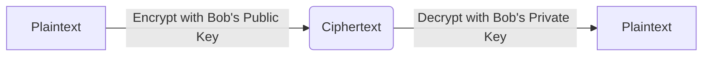

<Prerequisites items={[
  "Lesson 2: Symmetric Encryption & Entropy",
  "Modular Arithmetic (modulo arithmetic and congruences)",
  "Basic Group Theory (notions of fields and cyclic groups)"
]} />

# 3. Criptografía de Clave Pública e Intercambio de Claves

La criptografía simétrica es altamente segura y rápida, pero adolece de un defecto fundamental: el **problema de la distribución de claves**. Si Alice y Bob quieren comunicarse de forma segura, ¿cómo pueden acordar una clave secreta compartida en primer lugar si nunca se han conocido y se están comunicando a través de una conexión insegura?

En 1976, Whitfield Diffie y Martin Hellman publicaron un artículo revolucionario que resolvió este dilema. En esta lección, estudiaremos los fundamentos matemáticos de la **Criptografía Asimétrica** (Criptografía de Clave Pública) y analizaremos el elegante **protocolo de Intercambio de Claves Diffie-Hellman**.

<Objectives>
  <Knowledge>
    * Comprender la diferencia entre criptografía simétrica y asimétrica.
    * Explicar el problema de la distribución de claves y cómo la criptografía de clave pública lo resuelve.
    * Explicar la estructura matemática del Intercambio de Claves Diffie-Hellman.
    * Definir el Problema del Logaritmo Discreto (DLP) y por qué actúa como una función unidireccional.
  </Knowledge>
  <Skills>
    * Ejecutar matemáticamente un intercambio de claves Diffie-Hellman con pequeños parámetros primos.
    * Formular exponenciaciones modulares utilizando algoritmos de exponenciación modular rápida.
  </Skills>
  <Attitudes>
    * Apreciar cómo la asimetría matemática puede utilizarse para construir comunicaciones seguras.
    * Reconocer la importancia histórica y física del avance de Diffie-Hellman.
  </Attitudes>
</Objectives>

---

## Arquitecturas Simétricas vs. Asimétricas

En criptografía simétrica, ambas partes comparten una única clave secreta utilizada tanto para el cifrado como para el descifrado. En criptografía asimétrica, cada parte tiene un **par de claves**:
- Una **Clave Pública**, que puede distribuirse libremente a cualquiera.
- Una **Clave Privada**, que debe ser mantenida estrictamente en secreto por su propietario.

Si Alice quiere enviar un mensaje secreto a Bob:
1. Alice cifra el mensaje usando la **Clave Pública** de Bob.
2. Solo la **Clave Privada** correspondiente de Bob puede descifrar ese texto cifrado.

---

## La Base Matemática: Funciones Unidireccionales

La seguridad de la criptografía asimétrica se basa en **funciones unidireccionales con puerta trasera (trapdoor one-way functions)**. Estas son operaciones matemáticas que son extremadamente fáciles de calcular en una dirección, pero prácticamente imposibles de revertir a menos que se posea una pieza específica de información auxiliar, conocida como la "puerta trasera".

### Campos Primos y Elementos Generadores
Sea \(p\) un número primo grande. El conjunto de enteros módulo \(p\):
\[\mathbb{F}_p = \mathbb{Z}_p = \{0, 1, 2, \dots, p-1\}\]
forma un campo matemático finito bajo la adición y multiplicación módulo.

El grupo multiplicativo de este campo, denotado \(\mathbb{Z}_p^*\), consiste en todos los enteros coprimos con \(p\). Es un **grupo cíclico**, lo que significa que existe un elemento generador \(g \in \mathbb{Z}_p^*\) tal que cada elemento del grupo puede escribirse como \(g^a \pmod p\) para algún entero \(a\).

### El Problema del Logaritmo Discreto (DLP)
Dado un primo \(p\), un generador \(g\) y un exponente \(a\), calcular:
\[A = g^a \pmod p\]
es computacionalmente trivial (incluso para números de 2048 bits) utilizando la exponenciación modular.

Sin embargo, dados \(A\), \(g\) y \(p\), encontrar el entero \(a\) tal que:
\[g^a \equiv A \pmod p\]
es increíblemente difícil. Este es el **Problema del Logaritmo Discreto (DLP)**, la barrera matemática que protege muchos protocolos criptográficos modernos.

<DiagnosticQuiz q="" options="" sectionTitle="" questions={[
  {
    q: "If p=17 and g=3, what is the value of A = g^4 mod p?",
    options: ["13", "12", "81", "1"],
    correctIndex: 0,
    explanation: "3^4 = 81. We divide 81 by 17: 81 = 17 * 4 + 13. Thus, 81 mod 17 = 13."
  }
]} />

---

## El Protocolo de Intercambio de Claves Diffie-Hellman

El protocolo Diffie-Hellman permite a Alice y Bob establecer una clave secreta compartida a través de una conexión interceptada sin intercambiar la clave en sí.

### El Algoritmo del Protocolo
1. **Selección de Parámetros Públicos**: Alice y Bob acuerdan un número primo grande \(p\) y un generador \(g\). Estos valores son públicos y pueden ser interceptados por Eve.
2. **Generación de Clave Privada**:
   - Alice elige un entero secreto privado \(a\).
   - Bob elige un entero secreto privado \(b\).
3. **Cálculo e Intercambio de Clave Pública**:
   - Alice calcula su clave pública \(A = g^a \pmod p\) y se la envía a Bob.
   - Bob calcula su clave pública \(B = g^b \pmod p\) y se la envía a Alice.
4. **Derivación del Secreto Compartido**:
   - Alice recibe \(B\) y calcula el secreto compartido \(s\):
     \[s = B^a \pmod p = (g^b)^a \pmod p = g^{ab} \pmod p\]
   - Bob recibe \(A\) y calcula el secreto compartido \(s\):
     \[s = A^b \pmod p = (g^a)^b \pmod p = g^{ab} \pmod p\]

Tanto Alice como Bob han calculado el mismo valor \(s\), ¡el cual ahora pueden usar como clave para el cifrado simétrico! Eve, quien solo conoce \(g, p, A,\) y \(B\), no puede calcular \(g^{ab} \pmod p\) sin resolver el Problema del Logaritmo Discreto para encontrar \(a\) o \(b\).

---

## Caja de arena de código interactiva: Ejecutar Diffie-Hellman

A continuación, ejecute un intercambio de claves Diffie-Hellman con números primos pequeños para rastrear los cálculos matemáticos paso a paso.

<CodeSandbox code={`// Modular exponentiation utility: (base^exp) % mod
function modExp(base, exp, mod) {
  let result = 1n;
  base = BigInt(base) % BigInt(mod);
  exp = BigInt(exp);
  const m = BigInt(mod);
  while (exp /> 0n) {
    if (exp % 2n === 1n) result = (result * base) % m;
    base = (base * base) % m;
    exp = exp / 2n;
  }
  return Number(result);
}

const p = 997; // Large prime
const g = 2;   // Generator

// Alice's parameters
const a = 123; // Alice's secret key
const A = modExp(g, a, p); // Alice's public key

// Bob's parameters
const b = 456; // Bob's secret key
const B = modExp(g, b, p); // Bob's public key

// Shared Secret derivation
const sAlice = modExp(B, a, p);
const sBob = modExp(A, b, p);

console.log("Public Prime p:  ", p);
console.log("Public Generator g:", g);
console.log("Alice's Public A:  ", A);
console.log("Bob's Public B:    ", B);
console.log("Alice's derived s: ", sAlice);
console.log("Bob's derived s:   ", sBob);
console.log("Secrets Match?     ", sAlice === sBob);
`}
  language="javascript"
  title="Diffie-Hellman Math Simulator"
/>

---

<SolvedExercise title="Diffie-Hellman Protocol Trace">
  **Problema:**
  Sean \(p = 23\) y \(g = 5\).
  - Alice elige la clave privada \(a = 6\).
  - Bob elige la clave privada \(b = 15\).
  Muestre los valores intercambiados y verifique el secreto compartido.

  **Solución:**
  1. Alice calcula la clave pública \(A\):
     \[A = 5^6 \pmod{23} = 15625 \pmod{23} = 8\]
  2. Bob calcula la clave pública \(B\):
     \[B = 5^{15} \pmod{23} = 19\]
  3. Alice recibe \(B = 19\) y calcula el secreto compartido \(s\):
     \[s = B^a \pmod{23} = 19^6 \pmod{23} = 2\]
  4. Bob recibe \(A = 8\) y calcula el secreto compartido \(s\):
     \[s = A^b \pmod{23} = 8^{15} \pmod{23} = 2\]

  Tanto Alice como Bob derivan con éxito el secreto compartido \(s = 2\).
</SolvedExercise>

---

<Quiz mode="standard">
  <Question q="Si Eve intercepta la clave pública B de Bob y la clave pública A de Alice, ¿por qué no puede simplemente multiplicarlas para obtener el secreto compartido?" explanation="Multiplicar las claves públicas de Bob y Alice da (g^a) * (g^b) = g^(a+b) mod p. El secreto compartido es g^(ab) mod p. Multiplicar las claves públicas no produce la multiplicación de los exponentes, lo que demuestra por qué el protocolo es seguro.">
  <Option text="Multiplicarlas produce g^(a+b) mod p, lo cual es matemáticamente diferente del secreto compartido g^(ab) mod p." correct={true} />
  <Option text="Porque multiplicar enteros modulares es extremadamente lento." correct={false} />
  <Option text="Porque A y B son números de coma flotante decimales." correct={false} />
  <Option text="Porque las claves públicas están cifradas con la clave secreta de la CA." correct={false} />
</Question>
</Quiz>

---

## Clasificación de Tarjetas: Emparejamiento Asimétrico

Empareja los términos de intercambio de claves con sus funciones.

<CardSort pairsString="Private Key:Used by Alice to decrypt messages encrypted with her public key||Public Key:Used by Bob to encrypt messages meant for Alice||Trapdoor:Auxiliary information that makes inverting a function easy||DLP:The computational problem that prevents Eve from discovering secrets" />

---

<WhatsNext items={[
  "In Lesson 4, we will explore the mathematical structure of the most famous asymmetric cryptosystem: the RSA Cryptosystem."
]} />

<References>
  * **Diffie, W., & Hellman, M.** (1976). *New Directions in Cryptography*. IEEE Transactions on Information Theory.
  * **Menezes, A. J., van Oorschot, P. C., & Vanstone, S. A.** (1996). *Handbook of Applied Cryptography*. CRC Press.
</References>