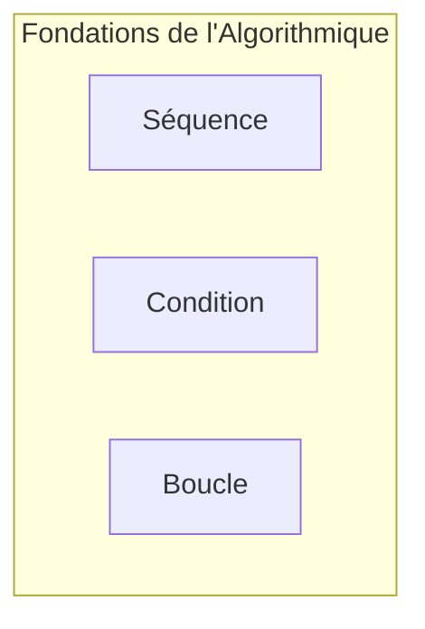

## Introduction aux structures de contrôle

Dans le vaste domaine de l'informatique, la capacité à résoudre des problèmes de manière systématique et efficace est fondamentale. Au cœur de cette capacité réside l'algorithmique, une discipline qui se concentre sur la conception et l'analyse d'algorithmes. Un algorithme peut être défini comme une séquence finie et non ambiguë d'instructions ou d'opérations, destinée à résoudre un problème spécifique ou à accomplir une tâche donnée. Il s'agit, en essence, d'une « recette » détaillée qui, si suivie à la lettre, garantit l'obtention d'un résultat précis à partir d'un ensemble d'entrées. L'efficacité, la correction et la robustesse d'un algorithme sont des critères essentiels de sa qualité.

Ce cours, « Algorithmique fondamentale », a pour objectif principal de vous doter des outils conceptuels nécessaires pour comprendre et maîtriser les fondations de la logique algorithmique. Plus spécifiquement, nous allons explorer les « structures de contrôle », qui sont les piliers sur lesquels sont bâtis tous les algorithmes complexes. Sans structures de contrôle, un algorithme ne serait qu'une simple liste d'instructions exécutées linéairement, incapable de s'adapter à différentes situations, de prendre des décisions ou de répéter des actions.

Les structures de contrôle sont les mécanismes qui dirigent le flux d'exécution d'un algorithme. Elles permettent de spécifier l'ordre dans lequel les instructions sont exécutées, de conditionner l'exécution de certaines instructions à la vérification de critères précis, ou encore de répéter des blocs d'instructions un certain nombre de fois ou tant qu'une condition est vraie. Elles sont absolument essentielles car elles confèrent à l'algorithme sa capacité à modéliser des comportements complexes et à résoudre des problèmes du monde réel qui ne sont jamais purement linéaires.

L'apprentissage de l'algorithmique, et en particulier des structures de contrôle, est la première étape indispensable avant d'aborder la programmation informatique. En effet, un programme n'est rien d'autre que la traduction d'un algorithme dans un langage compréhensible par une machine. Comprendre comment structurer la pensée algorithmique, comment décomposer un problème en étapes logiques et comment orchestrer l'exécution de ces étapes, est une compétence transférable et fondamentale, bien au-delà de tout langage de programmation spécifique. C'est la base sur laquelle vous construirez votre capacité à concevoir des solutions logicielles robustes et performantes. Nous aborderons les trois types fondamentaux de structures de contrôle : la séquence, la condition (ou sélection) et la boucle (ou itération), qui sont les briques élémentaires de toute construction algorithmique.

## La séquence d'instructions

La structure de contrôle la plus simple et la plus fondamentale est la **séquence d'instructions**. Elle représente le mode d'exécution par défaut de tout algorithme. Dans une séquence, les instructions sont exécutées les unes après les autres, dans l'ordre strict où elles sont écrites ou définies. Il n'y a pas de saut, pas de répétition conditionnelle, juste un déroulement linéaire du début à la fin. Chaque instruction est traitée séquentiellement avant de passer à la suivante, garantissant ainsi une progression déterministe et prévisible de l'algorithme.

Imaginez une recette de cuisine : vous ne pouvez pas ajouter le sel avant d'avoir mis l'eau, ni cuire le plat avant de l'avoir préparé. De même, dans un algorithme séquentiel, l'ordre des opérations est crucial et non interchangeable. Chaque étape dépend potentiellement du résultat de l'étape précédente.

Considérons quelques exemples simples pour illustrer ce concept :

**Exemple 1 : Calcul de la surface d'un rectangle**

Pour calculer la surface d'un rectangle, nous avons besoin de sa longueur et de sa largeur. L'algorithme séquentiel pour cette tâche se déroulerait comme suit :

1.  **Instruction 1 :** Demander à l'utilisateur la valeur de la longueur du rectangle.
2.  **Instruction 2 :** Stocker cette valeur dans une variable, par exemple `longueur`.
3.  **Instruction 3 :** Demander à l'utilisateur la valeur de la largeur du rectangle.
4.  **Instruction 4 :** Stocker cette valeur dans une variable, par exemple `largeur`.
5.  **Instruction 5 :** Calculer la surface en multipliant `longueur` par `largeur`.
6.  **Instruction 6 :** Stocker le résultat dans une variable, par exemple `surface`.
7.  **Instruction 7 :** Afficher la valeur de `surface` à l'utilisateur.

Chaque instruction est exécutée une seule fois, dans l'ordre spécifié. Il serait illogique de tenter de calculer la surface avant d'avoir obtenu les valeurs de la longueur et de la largeur.

[[WIDGET:Mermaid:seq_flowchart_area]]
Diagramme de flux illustrant un algorithme séquentiel pour le calcul de l'aire d'un rectangle.

**Exemple 2 : Échange de deux valeurs**

Un problème classique en algorithmique est l'échange du contenu de deux variables. Supposons que nous ayons une variable `A` contenant la valeur 10 et une variable `B` contenant la valeur 20, et que nous voulions que `A` contienne 20 et `B` contienne 10. Une approche naïve qui tenterait `A = B` puis `B = A` échouerait, car la première instruction écraserait la valeur originale de `A` avant qu'elle ne puisse être copiée dans `B`. Pour résoudre ce problème, une troisième variable temporaire est nécessaire, et l'ordre des opérations est vital :

1.  **Instruction 1 :** Déclarer une variable temporaire, par exemple `temp`.
2.  **Instruction 2 :** Copier la valeur de `A` dans `temp`. (Maintenant `temp` contient la valeur originale de `A`).
3.  **Instruction 3 :** Copier la valeur de `B` dans `A`. (Maintenant `A` contient la valeur originale de `B`).
4.  **Instruction 4 :** Copier la valeur de `temp` dans `B`. (Maintenant `B` contient la valeur originale de `A`).

Après ces quatre instructions exécutées séquentiellement, les valeurs de `A` et `B` sont correctement échangées. Cet exemple met en lumière l'importance cruciale de l'ordre dans une séquence : modifier l'ordre des instructions 2, 3 et 4 entraînerait un résultat incorrect.

La séquence est la base de tout algorithme. Même les algorithmes les plus complexes, qui intègrent des conditions et des boucles, sont fondamentalement des assemblages de séquences. Chaque bloc d'instructions à l'intérieur d'une condition ou d'une boucle est lui-même une séquence. La compréhension approfondie de cette structure élémentaire est donc indispensable avant de pouvoir aborder des concepts plus avancés de contrôle de flux. Elle garantit que les opérations sont effectuées dans un ordre logique et prévisible, ce qui est la pierre angulaire de la fiabilité de tout système informatique.

La séquence est la base de tout algorithme. Même les algorithmes les plus complexes, qui intègrent des conditions et des boucles, sont fondamentalement des assemblages de séquences. Chaque bloc d'instructions à l'intérieur d'une condition ou d'une boucle est lui-même une séquence. La compréhension approfondie de cette structure élémentaire est donc indispensable avant de pouvoir aborder des concepts plus avancés de contrôle de flux. Elle garantit que les opérations sont effectuées dans un ordre logique et prévisible, ce qui est la pierre angulaire de la fiabilité de tout système informatique.

## Les structures conditionnelles (Si-Alors-Sinon)

Si les algorithmes séquentiels sont suffisants pour des tâches linéaires et prévisibles, la plupart des problèmes du monde réel exigent une capacité de prise de décision. Un algorithme doit souvent adapter son comportement en fonction de l'état des données ou de certaines conditions rencontrées lors de son exécution. C'est là qu'interviennent les structures conditionnelles, permettant à un algorithme de choisir quelle séquence d'instructions exécuter. Elles introduisent une bifurcation dans le flux d'exécution, rendant les algorithmes dynamiques et réactifs.

La forme la plus simple de structure conditionnelle est le « Si-Alors » (ou If-Then en anglais). Elle permet d'exécuter un bloc d'instructions *seulement si* une certaine condition est vraie. Si la condition est fausse, le bloc d'instructions est simplement ignoré, et l'exécution se poursuit avec l'instruction suivante après la structure conditionnelle.

En pseudo-code, cela se présente comme suit :

Si (condition est vraie) Alors
    // Bloc d'instructions à exécuter
    Instruction A
    Instruction B
Fin Si
// L'exécution continue ici

**Exemple simple de « Si-Alors » :**
Imaginons un algorithme qui affiche un message de bienvenue uniquement si l'utilisateur est majeur.

Algorithme VérifierMajeur
  Variables : age : Entier
  Début
    Afficher « Quel est votre âge ? »
    Lire age
    Si (age >= 18) Alors
      Afficher « Bienvenue sur notre plateforme ! »
    Fin Si
    Afficher « Fin du programme. »
  Fin

Dans cet exemple, si `age` est 17, le message de bienvenue ne s'affiche pas, et le programme passe directement à « Fin du programme. ».

Cependant, il est souvent nécessaire de prévoir une alternative lorsque la condition initiale n'est pas remplie. C'est le rôle de la structure « Si-Alors-Sinon » (If-Then-Else). Elle offre deux chemins d'exécution mutuellement exclusifs : un bloc d'instructions est exécuté si la condition est vraie, et un autre bloc est exécuté si la condition est fausse.

En pseudo-code :

Si (condition est vraie) Alors
    // Bloc d'instructions si la condition est vraie
    Instruction X
    Instruction Y
Sinon
    // Bloc d'instructions si la condition est fausse
    Instruction Z
    Instruction W
Fin Si
// L'exécution continue ici

**Exemple de « Si-Alors-Sinon » :**
Reprenons l'exemple de l'âge, mais cette fois, nous voulons informer l'utilisateur s'il n'est pas majeur.

Algorithme VérifierMajeurAvecAlternative
  Variables : age : Entier
  Début
    Afficher « Quel est votre âge ? »
    Lire age
    Si (age >= 18) Alors
      Afficher « Bienvenue sur notre plateforme ! »
    Sinon
      Afficher « Désolé, l'accès est réservé aux personnes majeures. »
    Fin Si
    Afficher « Fin du programme. »
  Fin

Pour évaluer les conditions, les algorithmes utilisent des **opérateurs de comparaison** et des **opérateurs logiques**.

Les **opérateurs de comparaison** permettent de comparer deux valeurs et de retourner un résultat booléen (Vrai ou Faux) :
*   `=` ou `==` : Égal à (attention à ne pas confondre avec l'affectation `=`)
*   `!=` ou `<>` : Différent de
*   `<` : Inférieur à
*   `>` : Supérieur à
*   `<=` : Inférieur ou égal à
*   `>=` : Supérieur ou égal à

Les **opérateurs logiques** permettent de combiner plusieurs conditions simples pour former des conditions plus complexes :
*   `ET` (AND) : La condition composée est vraie si *toutes* les conditions simples sont vraies.
*   `OU` (OR) : La condition composée est vraie si *au moins une* des conditions simples est vraie.
*   `NON` (NOT) : Inverse la valeur de vérité d'une condition (Vrai devient Faux, Faux devient Vrai).

**Exemple avec opérateurs logiques :**
Déterminer si un nombre est compris entre 10 et 20 (inclus).

Algorithme VerifierIntervalle
  Variables : nombre : Entier
  Début
    Afficher « Entrez un nombre : »
    Lire nombre
    Si (nombre >= 10 ET nombre &lt;= 20) Alors
      Afficher « Le nombre est dans l'intervalle [10, 20]. »
    Sinon
      Afficher « Le nombre n'est PAS dans l'intervalle [10, 20]. »
    Fin Si
  Fin

Les structures conditionnelles peuvent également être imbriquées (un « Si » à l'intérieur d'un autre « Si ») pour gérer des cas de décision plus complexes, bien qu'une imbrication excessive puisse rendre l'algorithme difficile à lire et à maintenir. Dans de tels cas, des structures comme le « Si-Alors-Sinon Si » (If-Then-Else If) ou les structures de « choix multiple » (Switch/Case) peuvent être plus appropriées, mais elles seront abordées dans des leçons ultérieures.

[[WIDGET:Mermaid:conditional_flowchart]]
Diagramme de flux illustrant une structure conditionnelle « Si-Alors-Sinon ».

La maîtrise des structures conditionnelles est fondamentale car elles sont le pilier de la logique décisionnelle dans tout programme informatique, permettant aux algorithmes de réagir intelligemment aux différentes situations et entrées.

## Les boucles 'Tant que'

Au-delà de la simple exécution séquentielle et de la prise de décision conditionnelle, de nombreux problèmes algorithmiques nécessitent la répétition d'un ensemble d'instructions. Par exemple, compter jusqu'à un certain nombre, traiter tous les éléments d'une liste, ou attendre une entrée utilisateur valide sont des tâches qui impliquent des exécutions répétées. C'est le rôle des structures itératives, communément appelées **boucles**. Elles permettent d'exécuter un bloc d'instructions plusieurs fois sans avoir à réécrire le code.

Parmi les types de boucles fondamentaux, la boucle « Tant que » (ou While loop en anglais) est l'une des plus courantes et des plus puissantes. Son principe est simple : un bloc d'instructions est répété *tant qu'une condition spécifiée reste vraie*. La condition est évaluée *avant chaque* exécution du corps de la boucle. Si la condition est vraie, le corps de la boucle est exécuté ; si elle est fausse, la boucle se termine et l'exécution se poursuit avec l'instruction qui suit la boucle.

En pseudo-code, la structure est la suivante :

Tant que (condition est vraie) Faire
    // Bloc d'instructions à répéter
    Instruction X
    Instruction Y
Fin Tant que
// L'exécution continue ici

**Exemple de boucle « Tant que » : Compter jusqu'à N**
Supposons que nous voulions afficher les nombres de 1 à 5.

Algorithme CompterJusquaCinq
  Variables : compteur : Entier
  Début
    compteur &lt;- 1 // Initialisation du compteur
    Tant que (compteur &lt;= 5) Faire
      Afficher compteur
      compteur &lt;- compteur + 1 // Incrémentation du compteur
    Fin Tant que
    Afficher « Comptage terminé. »
  Fin

Dans cet exemple, la variable `compteur` est initialisée à 1. La condition `compteur <= 5` est vérifiée.
1.  `compteur` est 1 (Vrai) : Affiche 1, `compteur` devient 2.
2.  `compteur` est 2 (Vrai) : Affiche 2, `compteur` devient 3.
3.  `compteur` est 3 (Vrai) : Affiche 3, `compteur` devient 4.
4.  `compteur` est 4 (Vrai) : Affiche 4, `compteur` devient 5.
5.  `compteur` est 5 (Vrai) : Affiche 5, `compteur` devient 6.
6.  `compteur` est 6 (Faux) : La boucle se termine.
Le programme affiche ensuite « Comptage terminé. ».

Un aspect crucial de la boucle « Tant que » est la **condition d'arrêt**. Le corps de la boucle doit contenir au moins une instruction qui, à un moment donné, rendra la condition fausse. Si cette condition n'est jamais rendue fausse, la boucle ne se terminera jamais, conduisant à une **boucle infinie**. Une boucle infinie consomme indéfiniment les ressources du système et est une erreur de programmation courante. Dans l'exemple précédent, si nous avions oublié l'instruction `compteur <- compteur + 1`, la condition `compteur <= 5` serait toujours vraie (car `compteur` resterait toujours à 1), et le programme afficherait indéfiniment le nombre 1.

**Exemple de boucle « Tant que » : Saisie de valeur valide**
Un autre usage courant est la validation d'entrée utilisateur, où l'on demande à l'utilisateur de saisir une valeur jusqu'à ce qu'elle respecte un certain critère.

Algorithme SaisieValide
  Variables : note : Entier
  Début
    note &lt;- -1 // Initialisation à une valeur invalide pour entrer dans la boucle
    Tant que (note &lt; 0 OU note > 20) Faire
      Afficher « Veuillez entrer une note entre 0 et 20 : »
      Lire note
    Fin Tant que
    Afficher « La note saisie est :  », note
  Fin

Ici, la boucle continue de demander une note tant que la valeur saisie n'est pas comprise entre 0 et 20. Dès qu'une note valide est entrée, la condition `(note < 0 OU note > 20)` devient fausse, et la boucle s'arrête.

La boucle « Tant que » est particulièrement utile lorsque le nombre d'itérations n'est pas connu à l'avance, mais dépend d'une condition dynamique qui évolue au fur et à mesure de l'exécution de l'algorithme. Elle offre une grande flexibilité pour gérer des scénarios où la répétition est conditionnelle à l'état du système. Comprendre son mécanisme et, surtout, la nécessité d'une condition d'arrêt bien définie est essentiel pour écrire des algorithmes robustes et efficaces.

Alors que la boucle `Tant que` excelle dans les scénarios où le nombre d'itérations est indéterminé et dépend d'une condition dynamique, il existe de nombreuses situations où le nombre de répétitions est connu à l'avance ou lorsque nous devons parcourir systématiquement une collection d'éléments. Pour ces cas, la boucle `Pour` (souvent appelée `For` dans de nombreux langages de programmation) est l'outil algorithmique de choix.

## Les boucles 'Pour'

La boucle `Pour` est une structure de contrôle itérative conçue spécifiquement pour exécuter un bloc d'instructions un nombre prédéfini de fois. Elle est idéale pour les tâches qui impliquent :
1.  **Un nombre fixe d'itérations** : Par exemple, répéter une action 10 fois pour générer une série de données.
2.  **L'itération sur une séquence** : Parcourir tous les éléments d'une liste, d'un tableau ou d'une plage de nombres, comme les indices d'un tableau.

Sa structure typique implique une variable de contrôle (ou compteur) qui est initialisée au début, testée avant chaque itération, et mise à jour (généralement incrémentée ou décrémentée) à la fin de chaque passage.

La syntaxe générale en pseudo-code est la suivante :

Pour (initialisation du compteur ; condition de continuation ; mise à jour du compteur) Faire
    // Bloc d'instructions à répéter
    Instruction A
    Instruction B
Fin Pour
// L'exécution continue ici

Alternativement, pour l'itération sur une plage ou une séquence, on peut trouver une forme simplifiée :

Pour chaque élément dans Séquence Faire
    // Bloc d'instructions utilisant l'élément courant
    Instruction C (avec élément)
Fin Pour

La distinction fondamentale entre `Pour` et `Tant que` réside dans la gestion de la logique d'itération.
*   La boucle `Tant que` est intrinsèquement conditionnelle : elle continue tant qu'une condition est vraie. L'initialisation et la mise à jour de la variable de contrôle (si elle existe) doivent être gérées explicitement avant et à l'intérieur du corps de la boucle. Elle est plus générale et peut, en théorie, simuler n'importe quelle boucle `Pour`.
*   La boucle `Pour` est itérative par nature : elle regroupe l'initialisation, la condition de continuation et la mise à jour du compteur en une seule ligne de déclaration. Cette concision rend le code plus compact et plus lisible pour les itérations dont le cadre est bien défini. Elle est particulièrement adaptée lorsque l'on sait exactement combien de fois la boucle doit s'exécuter ou sur quelle plage de valeurs.

[[WIDGET:Mermaid:for_loop_flow]]

**Exemple 1 : Somme des N premiers entiers**

Considérons le problème de calculer la somme des N premiers entiers positifs (1 + 2 + ... + N). Le nombre d'itérations est clairement défini par la valeur de N.

Algorithme SommeNPremiersEntiers
  Variables : N, i, somme : Entier
  Début
    Afficher « Entrez un entier positif N : »
    Lire N
    somme &lt;- 0 // Initialisation de la somme
    Pour (i &lt;- 1 ; i &lt;= N ; i &lt;- i + 1) Faire
      somme &lt;- somme + i // Ajout de l'entier courant à la somme
    Fin Pour
    Afficher « La somme des  », N, «  premiers entiers est :  », somme
  Fin

Dans cet exemple :
*   `i <- 1` est l'initialisation du compteur `i`.
*   `i <= N` est la condition de continuation. La boucle s'exécute tant que `i` est inférieur ou égal à `N`.
*   `i <- i + 1` est la mise à jour du compteur, exécutée après chaque itération du corps de la boucle.

**Exemple 2 : Affichage d'une table de multiplication**

Un autre cas d'usage courant est l'affichage d'une table de multiplication pour un nombre donné. Par exemple, la table de 7 de 1 à 10.

Algorithme TableDeMultiplication
  Variables : nombre, i : Entier
  Début
    Afficher « Entrez le nombre dont vous voulez la table : »
    Lire nombre
    Pour (i &lt;- 1 ; i &lt;= 10 ; i &lt;- i + 1) Faire
      Afficher nombre, «  x  », i, «  =  », (nombre * i)
    Fin Pour
  Fin

Ici, la boucle `Pour` est parfaitement adaptée car nous savons que nous voulons répéter l'opération de multiplication et d'affichage 10 fois, pour `i` allant de 1 à 10.

La boucle `Pour` est un pilier de la programmation structurée. Maîtriser son utilisation permet d'écrire des algorithmes clairs et efficaces pour des tâches répétitives dont le cadre est bien défini. Elle simplifie la gestion des compteurs et des indices, réduisant ainsi les risques d'erreurs comme les boucles infinies ou les erreurs de bornes (off-by-one errors) qui peuvent survenir plus facilement avec des boucles `Tant que` mal gérées.

## Exercices de conception d'algorithmes

Après avoir exploré les trois piliers fondamentaux de l'algorithmique – les séquences d'instructions, les structures conditionnelles (`Si...Alors...Sinon`) et les boucles (`Tant que`, `Pour`) – il est temps de mettre en pratique ces concepts. La véritable maîtrise de l'algorithmique ne réside pas seulement dans la connaissance de ces briques, mais dans leur capacité à les assembler de manière logique et créative pour résoudre des problèmes concrets.

Ces exercices sont conçus pour vous aider à développer votre pensée algorithmique. L'objectif n'est pas seulement d'obtenir la bonne réponse, mais de comprendre le processus de conception :
1.  **Compréhension du problème** : Qu'est-ce qui est demandé ? Quelles sont les entrées ? Quelles sont les sorties attendues ? Y a-t-il des contraintes ?
2.  **Décomposition** : Comment le problème peut-il être divisé en sous-problèmes plus petits et gérables ?
3.  **Choix des structures** : Quelles briques élémentaires (séquence, condition, boucle) sont les plus appropriées pour chaque partie du problème ?
4.  **Logique de construction** : Comment les briques s'enchaînent-elles ? Comment les variables évoluent-elles ?
5.  **Test** : Pensez à des cas de test simples et complexes pour vérifier la correction de votre algorithme.

Nous vous encourageons à rédiger vos algorithmes en pseudo-code, en vous concentrant sur la logique plutôt que sur les détails syntaxiques d'un langage de programmation spécifique.

**Exercices Pratiques :**

1.  **Détermination du plus grand de trois nombres**
    *   **Problème** : Écrire un algorithme qui lit trois nombres entiers et affiche le plus grand d'entre eux.
    *   **Indices** : Utilisez des structures conditionnelles imbriquées ou une série de comparaisons successives.

2.  **Calcul de la factorielle d'un nombre**
    *   **Problème** : Écrire un algorithme qui demande à l'utilisateur un entier positif `N` et calcule sa factorielle (`N! = 1 * 2 * ... * N`). Si l'utilisateur entre un nombre négatif, l'algorithme doit le lui demander à nouveau jusqu'à ce qu'il saisisse un nombre valide.
    *   **Indices** : Combinez une boucle `Tant que` pour la validation de l'entrée et une boucle `Pour` pour le calcul de la factorielle.

3.  **Vérification de la primalité**
    *   **Problème** : Écrire un algorithme qui demande un entier `N` (supérieur à 1) et détermine s'il est un nombre premier. Un nombre premier est un entier supérieur à 1 qui n'a pas d'autres diviseurs positifs que 1 et lui-même.
    *   **Indices** : Utilisez une boucle `Pour` ou `Tant que` pour tester les diviseurs potentiels. Pensez aux optimisations (par exemple, tester seulement jusqu'à la racine carrée de N).

4.  **Inversion d'une chaîne de caractères**
    *   **Problème** : Écrire un algorithme qui lit une chaîne de caractères et affiche cette chaîne inversée. Par exemple, « Bonjour » doit devenir « ruojnoB ».
    *   **Indices** : Considérez la chaîne comme une séquence de caractères. Utilisez une boucle pour parcourir la chaîne de la fin vers le début.

5.  **Calcul de la moyenne d'une série de notes**
    *   **Problème** : Écrire un algorithme qui demande à l'utilisateur de saisir des notes (entre 0 et 20). La saisie s'arrête lorsque l'utilisateur entre une valeur négative. L'algorithme doit ensuite afficher la moyenne de toutes les notes valides saisies.
    *   **Indices** : Utilisez une boucle `Tant que` pour la saisie répétée. Maintenez un compte du nombre de notes et de leur somme. N'oubliez pas de gérer le cas où aucune note valide n'est saisie.

Ces exercices couvrent un éventail de défis qui nécessitent l'application combinée des concepts vus jusqu'à présent. Prenez le temps de les aborder méthodiquement, en dessinant des organigrammes ou en écrivant des brouillons de pseudo-code avant de finaliser votre solution. C'est par la pratique régulière que l'on développe une intuition algorithmique solide.

## Conclusion
Nous voici arrivés au terme de cette exploration des fondements de l'algorithmique. Après avoir abordé la méthodologie de résolution de problèmes et s'être exercé à travers divers cas pratiques, il est temps de synthétiser les concepts clés et d'entrevoir les horizons futurs de votre apprentissage.

Au cours de cette leçon, nous avons décomposé le processus de construction algorithmique en ses éléments constitutifs les plus fondamentaux : les séquences, les conditions et les boucles. Ces trois types de structures de contrôle, bien que simples en apparence, sont les véritables « briques élémentaires » à partir desquelles tout algorithme, quelle que soit sa complexité, est édifié.

La **séquence** représente l'ordre linéaire et inaltérable dans lequel les instructions sont exécutées. C'est la base même de tout programme, garantissant que chaque étape est traitée dans la chronologie prévue, du début à la fin. Sans une séquence claire, l'exécution d'un algorithme serait chaotique et imprévisible. Elle assure la progression logique et déterministe de l'algorithme.

Les **conditions**, ou structures de choix (comme `Si...Alors...Sinon` ou `Selon`), introduisent la capacité de prise de décision. Elles permettent à l'algorithme de s'adapter dynamiquement aux données d'entrée ou à l'état courant du système. C'est grâce aux conditions que nos algorithmes peuvent réagir différemment selon les scénarios, gérer des cas particuliers, valider des entrées ou orienter le flux d'exécution vers des chemins alternatifs. Cette capacité de branchement est cruciale pour la flexibilité et l'intelligence des programmes.

Enfin, les **boucles**, ou structures itératives (`Tant que`, `Pour`, `Répéter...Jusqu'à`), confèrent à l'algorithme le pouvoir de la répétition. Elles sont indispensables pour traiter des collections de données, effectuer des calculs itératifs, ou répéter une série d'opérations un nombre défini ou indéfini de fois. Les boucles sont le moteur de l'efficacité algorithmique, permettant de réaliser des tâches volumineuses avec un code concis et optimisé, évitant la répétition fastidieuse d'instructions.

L'importance de maîtriser ces trois concepts ne peut être sous-estimée. Ils constituent le socle universel de la pensée algorithmique et de la programmation. Indépendamment du langage de programmation que vous apprendrez par la suite (Python, Java, C++, JavaScript, etc.), vous retrouverez toujours ces mêmes structures de contrôle, parfois sous des syntaxes différentes, mais avec la même logique sous-jacente. Comprendre leur fonctionnement intrinsèque et savoir comment les combiner de manière judicieuse est la clé pour traduire n'importe quel problème du monde réel en une série d'instructions compréhensibles par une machine.

La capacité à décomposer un problème complexe en sous-problèmes, puis à assembler ces briques élémentaires pour construire une solution cohérente et fonctionnelle, est la marque d'un bon concepteur d'algorithmes. C'est un art qui s'acquiert par la pratique assidue et la réflexion critique. Chaque exercice que vous avez abordé était une occasion de renforcer cette intuition, de développer votre logique et d'affiner votre capacité à structurer la pensée.

Considérez ces briques comme les fondations solides sur lesquelles vous allez bâtir des édifices de plus en plus complexes. Sans une compréhension approfondie de ces bases, toute tentative de construire des systèmes plus avancés serait vouée à l'échec. Elles sont le langage commun entre l'humain et la machine, le pont entre une idée abstraite et son exécution concrète.

Pour illustrer cette interconnexion et leur rôle fondamental, voici une représentation schématique de la manière dont ces concepts s'articulent pour former la base de l'algorithmique et ouvrent la voie à des domaines plus avancés :

[[WIDGET:Mermaid:alg_foundations]]

    S -- Exécution Ordonnée --> Algo[Algorithme];
    C -- Décision / Branchement --> Algo;
    B -- Répétition / Itération --> Algo;

    Algo -- Résolution de Problèmes --> Prog[Programmation];
    Algo -- Efficacité &amp; Optimisation --> Perf[Performance];
    Algo -- Base pour --> DS[Structures de Données];
    Algo -- Base pour --> Rec[Récursion];
    Algo -- Base pour --> Adv[Algorithmes Avancés];

**Perspectives pour la suite de votre apprentissage :**

Ce cours n'est que le premier pas dans votre parcours en algorithmique. Les prochaines étapes vous mèneront vers des concepts plus sophistiqués, mais toujours ancrés dans les principes que vous venez d'acquérir :

1.  **Les Structures de Données :** Un algorithme ne peut exister sans données. La manière dont ces données sont organisées (tableaux, listes chaînées, piles, files, arbres, graphes, etc.) a un impact majeur sur l'efficacité et la complexité des algorithmes qui les manipulent. Vous apprendrez à choisir la structure de données la plus appropriée pour un problème donné.
2.  **La Récursion :** Une technique puissante qui permet de résoudre un problème en le divisant en sous-problèmes similaires de plus petite taille, jusqu'à atteindre un cas de base. C'est une alternative élégante aux boucles pour certaines catégories de problèmes.
3.  **L'Analyse de Complexité :** Au-delà de la simple correction d'un algorithme, il est crucial d'évaluer son efficacité en termes de temps d'exécution et d'espace mémoire requis. L'analyse de complexité (notation Grand O) vous permettra de comparer et d'optimiser vos solutions.
4.  **Les Paradigmes Algorithmiques Avancés :** Vous explorerez des approches de conception plus élaborées comme la « division et conquête » (Divide and Conquer), la « programmation dynamique », les « algorithmes gloutons » (Greedy Algorithms), et bien d'autres, qui sont des stratégies éprouvées pour résoudre des classes spécifiques de problèmes.
5.  **L'Implémentation :** Finalement, vous passerez de la conception en pseudo-code à l'implémentation concrète de vos algorithmes dans un ou plusieurs langages de programmation. C'est là que la théorie rencontre la pratique, et que vous verrez vos algorithmes prendre vie.

En conclusion, les séquences, conditions et boucles ne sont pas de simples outils techniques ; elles sont les piliers de la pensée computationnelle. Leur maîtrise est la pierre angulaire de toute carrière en informatique, vous permettant de concevoir des solutions élégantes et efficaces aux défis numériques de demain. Continuez à pratiquer, à expérimenter et à interroger la logique derrière chaque instruction. C'est ainsi que vous développerez une intuition algorithmique solide et durable.

[[WIDGET:conclusionSummary]]
[[WIDGET:whatsNext]]
[[WIDGET:goingFurther]]
[[WIDGET:finalEvaluation]]
