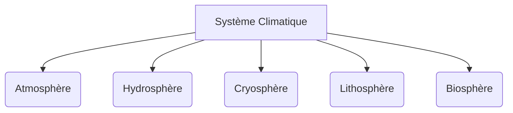

## Introduction aux Changements Climatiques

Le changement climatique représente l'un des défis les plus pressants et complexes de notre époque, impactant de manière fondamentale les systèmes naturels et humains à l'échelle planétaire. En géographie physique et climatologie, son étude est devenue centrale, car elle touche aux interactions dynamiques entre l'atmosphère, l'hydrosphère, la lithosphère et la biosphère – les quatre grandes sphères qui composent le système terrestre <sup id="cite-2" class="scroll-mt-24"><a href="#ref-2">[2]</a></sup>, <sup id="cite-5" class="scroll-mt-24"><a href="#ref-5">[5]</a></sup>. Cette leçon vise à démystifier ce phénomène en explorant ses observations, ses projections futures et ses impacts multidimensionnels.

Historiquement, le climat de la Terre a toujours connu des variations naturelles, alternant entre des périodes glaciaires et interglaciaires sur des échelles de temps géologiques, sous l'influence de facteurs astronomiques (cycles de Milankovitch), volcaniques ou solaires <sup id="cite-1" class="scroll-mt-24"><a href="#ref-1">[1]</a></sup>. Cependant, le terme « changement climatique » tel qu'il est compris aujourd'hui fait spécifiquement référence aux modifications significatives et durables des régimes climatiques mondiaux ou régionaux, observées depuis le milieu du XXe siècle, et dont l'origine est majoritairement attribuée aux activités humaines. Il ne s'agit pas d'une simple variation météorologique à court terme, mais d'une tendance de fond, caractérisée par une augmentation rapide et sans précédent des températures moyennes de la planète et des perturbations associées <sup id="cite-6" class="scroll-mt-24"><a href="#ref-6">[6]</a></sup>.

La climatologie, discipline scientifique dédiée à l'étude du climat et de ses variations <sup id="cite-4" class="scroll-mt-24"><a href="#ref-4">[4]</a></sup>, fournit les outils conceptuels et méthodologiques pour comprendre les mécanismes sous-jacents à ces changements. La géographie physique, quant à elle, s'intéresse aux manifestations spatiales de ces changements, à leurs impacts sur les paysages, les écosystèmes et les ressources naturelles, ainsi qu'aux interactions complexes entre les processus climatiques et les dynamiques géomorphologiques, hydrologiques et biogéographiques <sup id="cite-3" class="scroll-mt-24"><a href="#ref-3">[3]</a></sup>, <sup><a href="#ref-5">[5]</a></sup>. L'importance de cette thématique réside dans sa capacité à remodeler les environnements terrestres, à influencer la distribution des espèces, à modifier les cycles de l'eau et du carbone, et à poser des risques significatifs pour les sociétés humaines.

Cette leçon se structurera autour de trois axes majeurs. Premièrement, nous examinerons les observations et les preuves scientifiques irréfutables du changement climatique, en nous appuyant sur les données recueillies par des milliers de scientifiques à travers le monde et synthétisées notamment par le [[WIDGET:Glossary:giec:Groupe d'experts intergouvernemental sur l'évolution du climat (GIEC)]]. Nous détaillerons les indicateurs clés tels que l'augmentation des températures, la fonte des glaces, l'élévation du niveau marin et l'intensification des événements météorologiques extrêmes. Deuxièmement, nous aborderons les projections climatiques futures, en explorant les différents scénarios d'émissions et leurs conséquences potentielles sur le système terrestre. Enfin, nous analyserons les impacts de ces changements sur les écosystèmes, les ressources en eau, l'agriculture, la santé humaine et les infrastructures, soulignant la nécessité d'actions d'adaptation et d'atténuation.

Comprendre le changement climatique est essentiel pour tout étudiant en géographie physique et climatologie, car il constitue le cadre dans lequel de nombreux autres phénomènes environnementaux doivent être interprétés. C'est une invitation à appréhender la Terre comme un système complexe et interconnecté, où chaque composante influence et est influencée par les autres.

[[WIDGET:Mermaid:systeme_climatique]]


    B -- Échanges de chaleur et d'humidité --> C
    C -- Circulation océanique --> D
    D -- Albedo, fonte --> C
    E -- Volcanisme, altération --> B
    F -- Photosynthèse, respiration --> B
    B -- Précipitations --> E
    C -- Évaporation --> B
    F -- Cycle du carbone --> B
    E -- Stockage carbone --> F

*Description: Diagramme illustrant les principales composantes du système climatique terrestre et leurs interconnexions.*

## Observations et Preuves Scientifiques du Changement Climatique

Les preuves de l'existence d'un changement climatique global sont aujourd'hui accablantes et proviennent d'une multitude d'observations indépendantes, convergentes et cohérentes, analysées et synthétisées par la communauté scientifique internationale, notamment le GIEC <sup><a href="#ref-6">[6]</a></sup>. Ces preuves ne se limitent pas à une simple augmentation de la température, mais englobent une transformation profonde et rapide de l'ensemble du système terrestre.

### 1. Augmentation des Températures Globales

L'indicateur le plus direct et le plus connu du changement climatique est l'augmentation de la température moyenne de la surface terrestre et océanique. Les données instrumentales, collectées depuis le milieu du XIXe siècle, montrent une tendance au réchauffement incontestable. Le GIEC (2021) rapporte que la température moyenne mondiale de surface a augmenté d'environ 1,1 °C par rapport à la période préindustrielle (1850-1900) <sup><a href="#ref-6">[6]</a></sup>. Cette augmentation n'est pas uniforme : les régions polaires, en particulier l'Arctique, se réchauffent à un rythme deux à trois fois plus rapide que la moyenne mondiale, un phénomène connu sous le nom d'[[WIDGET:Glossary:amplification_arctique:amplification arctique]].

Les dix années les plus chaudes jamais enregistrées se sont toutes produites depuis 2005, et les six plus chaudes depuis 2014. Chaque décennie depuis les années 1980 a été plus chaude que la précédente. Ces anomalies thermiques sont mesurées par rapport à une période de référence et sont représentées sous forme de cartes ou de graphiques montrant des écarts positifs de plus en plus marqués.

[[WIDGET:Image:anomalies_temperature]]
*Description: Représentation graphique des anomalies de température moyenne annuelle globale par rapport à une période de référence (par exemple, 1951-1980), montrant une tendance claire au réchauffement sur les dernières décennies.*

### 2. Fonte des Glaces et des Calottes Polaires (Cryosphère)

La cryosphère, qui comprend les glaciers, les calottes glaciaires (Groenland et Antarctique), la banquise arctique et antarctique, le permafrost et la neige, est un indicateur extrêmement sensible du réchauffement climatique.
*   **Glaciers de montagne:** Presque tous les glaciers de montagne du monde reculent et s'amincissent à un rythme accéléré. Leur fonte contribue à l'élévation du niveau marin et affecte les ressources en eau douce de nombreuses régions.
*   **Calottes glaciaires:** Les calottes glaciaires du Groenland et de l'Antarctique perdent de la masse à un rythme croissant. Les observations satellitaires montrent une accélération de la perte de glace, principalement due à la fonte de surface et à l'augmentation du vêlage des icebergs <sup><a href="#ref-6">[6]</a></sup>.
*   **Banquise arctique:** L'étendue de la banquise arctique diminue de manière spectaculaire, en particulier en été. Depuis la fin des années 1970, l'étendue minimale estivale a diminué d'environ 13 % par décennie. La banquise antarctique, bien que plus variable, montre également des signes de changement.
*   **Permafrost:** Le dégel du permafrost (sol gelé en permanence) dans les régions arctiques et subarctiques est une préoccupation majeure. Il libère des gaz à effet de serre (méthane et dioxyde de carbone) piégés depuis des millénaires, créant une boucle de rétroaction positive qui amplifie le réchauffement.

### 3. Élévation du Niveau Marin

L'élévation du niveau marin est une conséquence directe du réchauffement climatique et représente une menace majeure pour les zones côtières basses. Elle est principalement due à deux facteurs <sup><a href="#ref-6">[6]</a></sup>:
*   **Dilatation thermique de l'eau:** L'eau des océans se dilate en se réchauffant. Ce phénomène, appelé ], est le principal contributeur à l'élévation du niveau marin au cours du XXe siècle.
*   **Fonte des glaces terrestres:** La fonte des glaciers de montagne et des calottes glaciaires du Groenland et de l'Antarctique ajoute de l'eau aux océans.

Le taux moyen d'élévation du niveau marin global a été d'environ 1,4 mm/an entre 1901 et 1990, mais il a accéléré pour atteindre 3,7 mm/an entre 2006 et 2018, et même 4,5 mm/an entre 2013 et 2022, selon les dernières estimations.

### 4. Changements dans les Océans

Les océans absorbent une grande partie de la chaleur et du dioxyde de carbone excédentaires produits par les activités humaines, ce qui entraîne des modifications profondes:
*   **Réchauffement des océans:** Les couches supérieures des océans se réchauffent de manière significative. Le GIEC (2021) indique que l'océan a absorbé plus de 90 % de l'excès de chaleur accumulé dans le système climatique depuis les années 1970 <sup><a href="#ref-6">[6]</a></sup>. Ce réchauffement affecte la vie marine, la circulation océanique et la capacité des océans à absorber le CO2.
*   **Acidification des océans:** L'absorption du dioxyde de carbone (CO2) par les océans entraîne une augmentation de leur acidité. Le pH moyen de l'eau de mer a diminué d'environ 0,1 unité depuis le début de l'ère industrielle, ce qui représente une augmentation de 30 % de l'acidité. Ce phénomène menace les organismes marins à coquille ou squelette calcaire, comme les coraux et certains planctons, qui sont à la base de nombreuses chaînes alimentaires marines.
*   **Désoxygénation des océans:** Le réchauffement de l'eau réduit sa capacité à dissoudre l'oxygène, et la stratification accrue des couches d'eau limite le mélange, conduisant à une diminution des niveaux d'oxygène dans de vastes zones océaniques.

### 5. Événements Météorologiques Extrêmes

Le changement climatique modifie la fréquence, l'intensité et/ou la répartition géographique de nombreux événements météorologiques extrêmes <sup><a href="#ref-6">[6]</a></sup>:
*   **Vagues de chaleur:** Leur fréquence et leur intensité augmentent dans la plupart des régions terrestres.
*   **Précipitations intenses:** De nombreuses régions connaissent une augmentation des épisodes de fortes précipitations, entraînant des inondations.
*   **Sécheresses:** Certaines régions sont confrontées à des sécheresses plus longues et plus intenses, affectant l'agriculture et les ressources en eau.
*   **Cyclones tropicaux:** Bien que le nombre total de cyclones ne montre pas de tendance claire à l'échelle mondiale, la proportion de cyclones tropicaux intenses (catégories 4 et 5) a augmenté dans certaines régions.
*   **Incendies de forêt:** Les conditions plus chaudes et plus sèches contribuent à l'augmentation de la fréquence et de l'intensité des incendies de forêt, notamment en Australie, en Californie et en Sibérie.

### 6. Preuves de l'Origine Anthropique du Changement Climatique

Si les observations confirment l'existence d'un réchauffement, la science a également établi avec une certitude quasi absolue que les activités humaines en sont la cause principale.
*   **Concentrations de Gaz à Effet de Serre (GES):**
    *   Les mesures directes des concentrations atmosphériques de CO2, méthane (CH4) et protoxyde d'azote (N2O) montrent une augmentation sans précédent depuis le début de l'ère industrielle (vers 1750). Les concentrations actuelles de CO2 (plus de 420 ppm en 2024) sont les plus élevées depuis au moins 800 000 ans, comme l'attestent les analyses des carottes de glace <sup><a href="#ref-6">[6]</a></sup>.
*   Ces gaz piègent la chaleur dans l'atmosphère, un phénomène naturel appelé ]. Sans lui, la Terre serait une planète gelée et invivable. Cependant, l'augmentation des concentrations de GES due aux activités humaines intensifie cet effet, conduisant à un réchauffement additionnel. Les travaux pionniers de ] à la fin du XIXe siècle avaient déjà posé les bases de cette compréhension.
*   **Signature Isotopique du Carbone:**
    *   L'analyse des isotopes du carbone (carbone-12, carbone-13, carbone-14) dans l'atmosphère fournit une preuve irréfutable de l'origine anthropique de l'augmentation du CO2. Les combustibles fossiles (charbon, pétrole, gaz naturel) sont riches en carbone-12 et dépourvus de carbone-14 (qui a une demi-vie courte). L'augmentation du CO2 atmosphérique s'accompagne d'une diminution du rapport carbone-13/carbone-12 et d'une diminution du carbone-14, ce qui est la signature des émissions de CO2 provenant de la combustion de combustibles fossiles et de la déforestation <sup><a href="#ref-6">[6]</a></sup>.
*   **Modèles Climatiques:**
    *   Les modèles climatiques sont des outils numériques complexes qui simulent le comportement du système climatique terrestre en intégrant les lois de la physique. Lorsque ces modèles sont alimentés uniquement par des forçages naturels (variations solaires, éruptions volcaniques), ils ne parviennent pas à reproduire le réchauffement observé au cours des dernières décennies. En revanche, lorsque les forçages anthropiques (émissions de GES, aérosols) sont inclus, les modèles reproduisent fidèlement la tendance au réchauffement observée <sup><a href="#ref-6">[6]</a></sup>. Cela démontre que les activités humaines sont le facteur dominant du changement climatique actuel.
*   **Bilan Énergétique de la Terre (Forçage Radiatif):**
    *   Le [[WIDGET:ConceptLink:forcage_radiatif:forçage radiatif]] est la mesure de l'influence d'un facteur donné sur le bilan énergétique Terre-atmosphère. Un forçage radiatif positif tend à réchauffer la surface de la Terre, tandis qu'un forçage négatif tend à la refroidir. Le GIEC (2021) estime que le forçage radiatif total dû aux activités humaines depuis 1750 est positif et a augmenté de manière significative, principalement en raison des concentrations croissantes de GES.

En somme, l'ensemble des observations et des preuves scientifiques convergent vers une conclusion unanime : la Terre se réchauffe à un rythme sans précédent, et ce réchauffement est principalement dû aux activités humaines, en particulier l'émission de gaz à effet de serre. Ces conclusions, étayées par des décennies de recherche et des milliers de publications scientifiques, sont synthétisées et validées par le GIEC, dont les rapports constituent la référence la plus complète et la plus fiable sur l'état des connaissances scientifiques concernant le changement climatique <sup><a href="#ref-6">[6]</a></sup>.

[[WIDGET:Quiz:preuves_climatiques]]
*Question: Parmi les indicateurs suivants, lequel n'est PAS une preuve directe du réchauffement climatique d'origine anthropique?*
*Options:*
*   *A) L'augmentation des concentrations atmosphériques de CO2.*
*   *B) La diminution de l'étendue de la banquise arctique en été.*
*   *C) La diminution de la fréquence des éruptions volcaniques.*
*   *D) La signature isotopique du carbone dans l'atmosphère.*
*Correct Answer: C*
*Feedback: La diminution de la fréquence des éruptions volcaniques n'est pas un indicateur direct du réchauffement climatique anthropique. Les éruptions volcaniques sont des phénomènes naturels qui peuvent avoir un effet de refroidissement temporaire sur le climat en émettant des aérosols, mais elles ne sont pas liées à l'origine anthropique du réchauffement actuel. Les autres options sont toutes des preuves directes.*

## Modélisation Climatique, Scénarios et Projections
La compréhension des mécanismes complexes du système climatique terrestre et la prévision de son évolution future reposent en grande partie sur la modélisation climatique. Ces modèles sont des outils numériques sophistiqués qui traduisent les lois fondamentales de la physique, de la chimie et de la biologie en équations mathématiques, simulant ainsi les interactions entre l'atmosphère, les océans, les surfaces continentales, la cryosphère et la biosphère.

### Principes des Modèles Climatiques

Les modèles climatiques, souvent appelés Modèles Couplés de Circulation Générale Atmosphère-Océan (MCGAO ou AOGCM en anglais), représentent le système terrestre comme un ensemble de cellules tridimensionnelles (grilles) couvrant la planète. Pour chaque cellule, des équations décrivant la conservation de l'énergie, de la masse, de la quantité de mouvement et de l'humidité sont résolues numériquement. Ces équations régissent des processus tels que le transfert de chaleur, les mouvements de l'air et de l'eau, les changements de phase de l'eau (évaporation, condensation), et les interactions radiatives avec l'énergie solaire et terrestre [ref1, ref5].

Les composants clés d'un modèle climatique incluent :
*   **L'atmosphère :** Modélisation des vents, de la température, de l'humidité, de la pression, de la formation des nuages et des précipitations.
*   **L'océan :** Simulation des courants marins, des températures, de la salinité, de la formation de glace de mer et des échanges de chaleur et de gaz avec l'atmosphère.
*   **La surface terrestre :** Représentation de la végétation, de l'humidité du sol, de la neige, du ruissellement et des échanges d'énergie et d'eau.
*   **La cryosphère :** Modélisation des glaciers, des calottes glaciaires et du permafrost.
*   **La biosphère :** Intégration des cycles biogéochimiques, notamment le cycle du carbone, pour simuler les échanges de gaz à effet de serre entre les écosystèmes et l'atmosphère (dans les Modèles du Système Terre ou ESMs).

Un défi majeur dans la modélisation est la [[WIDGET:ConceptLink:parametrisation:paramétrisation]] des processus qui se produisent à des échelles spatiales ou temporelles inférieures à la résolution de la grille du modèle (par exemple, la formation des nuages, la convection). Ces processus sont représentés par des relations empiriques basées sur des observations et des théories physiques. La précision de ces paramétrisations est une source importante d'incertitude dans les projections climatiques <sup><a href="#ref-6">[6]</a></sup>.

La validation des modèles est un processus continu et rigoureux. Les modèles sont testés en leur demandant de reproduire le climat passé (rétro-prévision ou « hindcasting ») et en comparant leurs résultats avec les observations historiques et paléoclimatiques. Les modèles actuels sont capables de reproduire avec une grande fidélité les principales caractéristiques du climat observé, y compris le réchauffement récent, mais uniquement lorsque les forçages anthropiques sont inclus <sup><a href="#ref-6">[6]</a></sup>. Le travail pionnier de scientifiques comme [[WIDGET:RealPerson:suki_manabe:Syukuro Manabe]] a été essentiel dans le développement de ces modèles couplés atmosphère-océan, jetant les bases de la modélisation climatique moderne.

### Scénarios d'Émissions et Trajectoires Socio-économiques

La projection des changements climatiques futurs ne dépend pas seulement de la sophistication des modèles, mais aussi des hypothèses concernant les émissions futures de gaz à effet de serre et d'aérosols. Ces émissions sont intrinsèquement liées aux choix socio-économiques, technologiques et politiques des sociétés humaines, qui sont par nature incertains. Pour aborder cette incertitude, la communauté scientifique utilise des scénarios.

Historiquement, le GIEC a utilisé différentes séries de scénarios :
*   **Scénarios SRES (Special Report on Emissions Scenarios) :** Utilisés dans les rapports précédents (jusqu'au 4ème Rapport d'Évaluation, AR4), ils décrivaient différentes trajectoires de développement socio-économique et leurs émissions associées.
*   **Scénarios RCP (Representative Concentration Pathways - Trajectoires Représentatives de Concentration) :** Introduits dans le 5ème Rapport d'Évaluation (AR5), les RCPs se concentrent sur les concentrations de gaz à effet de serre et d'aérosols, ainsi que sur le forçage radiatif qui en résulte, plutôt que sur les émissions elles-mêmes. Quatre RCPs principaux ont été définis, chacun représentant une trajectoire de forçage radiatif en watts par mètre carré (W/m²) d'ici 2100 par rapport aux niveaux préindustriels :
    *   **RCP2.6 :** Scénario d'atténuation stricte, visant à limiter le réchauffement à moins de 2°C. Le forçage radiatif atteint un pic puis diminue à 2.6 W/m² d'ici 2100.
    *   **RCP4.5 :** Scénario d'atténuation modérée, où les émissions culminent vers 2040 puis diminuent. Le forçage radiatif se stabilise à 4.5 W/m² d'ici 2100.
    *   **RCP6.0 :** Scénario d'atténuation plus faible, avec des émissions culminant vers 2080. Le forçage radiatif se stabilise à 6.0 W/m² d'ici 2100.
    *   **RCP8.5 :** Scénario d'émissions très élevées, souvent qualifié de « business-as-usual » ou « sans politique climatique additionnelle ». Le forçage radiatif continue d'augmenter pour atteindre 8.5 W/m² d'ici 2100.

Pour le 6ème Rapport d'Évaluation (AR6), le GIEC a adopté une nouvelle génération de scénarios, les **SSP (Shared Socioeconomic Pathways - Voies Socio-économiques Partagées)**. Les SSPs décrivent cinq grandes trajectoires de développement socio-économique mondial pour le 21ème siècle, chacune présentant des défis différents pour l'atténuation et l'adaptation aux changements climatiques. Ces SSPs sont ensuite combinés avec différents niveaux de forçage radiatif (similaires aux RCPs, mais appelés « niveaux de forçage » ou « scénarios d'émissions ») pour créer un ensemble plus riche et plus intégré de scénarios climatiques <sup><a href="#ref-6">[6]</a></sup>.

Les cinq SSPs sont :
*   **SSP1 (Sustainability – Taking the Green Road) :** Un monde où la durabilité est privilégiée, avec une croissance économique inclusive, une forte coopération internationale, des investissements dans l'éducation et la santé, et une transition rapide vers des technologies vertes. Cela conduit à des défis faibles pour l'atténuation et l'adaptation.
*   **SSP2 (Middle of the Road) :** Un monde où les tendances socio-économiques historiques se poursuivent, avec des progrès lents vers la durabilité, des inégalités persistantes et des défis modérés pour l'atténuation et l'adaptation.
*   **SSP3 (Regional Rivalry – A Rocky Road) :** Un monde fragmenté par le nationalisme, la faible coopération internationale, la croissance économique lente et la forte inégalité. Cela entraîne des défis élevés pour l'atténuation et l'adaptation.
*   **SSP4 (Inequality – A Road Divided) :** Un monde caractérisé par une forte inégalité entre les pays et au sein des pays, avec des régions riches et des régions pauvres. Cela crée des défis faibles pour l'atténuation mais élevés pour l'adaptation.
*   **SSP5 (Fossil-fueled Development – Taking the Highway) :** Un monde axé sur le développement économique rapide et l'exploitation intensive des combustibles fossiles, avec une forte consommation d'énergie et une faible préoccupation pour l'environnement. Cela pose des défis élevés pour l'atténuation mais faibles pour l'adaptation (grâce à une grande richesse).

Ces scénarios permettent d'explorer un large éventail de futurs possibles et d'évaluer les conséquences climatiques de différentes trajectoires de développement humain.

[[WIDGET:Mermaid:ssp_rcp_flow]]
```mermaid
graph TD
    A[Facteurs Socio-économiques] --> B(Développement Démographique)
    A --> C(Croissance Économique)
    A --> D(Développement Technologique)
    A --> E(Politiques Environnementales)

    B & C & D & E --> F{Scénarios Socio-économiques (SSPs)}

    F -- SSP1 (Durabilité) --> G1(Faibles Émissions)
    F -- SSP2 (Voie médiane) --> G2(Émissions Modérées)
    F -- SSP3 (Rivalité Régionale) --> G3(Émissions Élevées)
    F -- SSP4 (Inégalité) --> G4(Émissions Variées)
    F -- SSP5 (Développement Fossile) --> G5(Très Fortes Émissions)

    G1 & G2 & G3 & G4 & G5 --> H{Concentrations de GES et Aérosols}

    H --> I{Forçage Radiatif (W/m²)}

    I -- Ex: 2.6 W/m² (Faible) --> J1(Projections Climatiques Faibles)
    I -- Ex: 8.5 W/m² (Élevé) --> J2(Projections Climatiques Élevées)

    J1 & J2 --> K[Modèles Climatiques]
    K --> L[Projections de Changement Climatique]
```
*Description: Ce diagramme illustre la relation entre les facteurs socio-économiques, les scénarios SSPs, les concentrations de gaz à effet de serre, le forçage radiatif et les projections climatiques. Il montre comment les choix sociétaux influencent les émissions futures, qui à leur tour déterminent l'ampleur du forçage radiatif et, in fine, les changements climatiques projetés.*

### Projections Futures des Changements Climatiques

Les modèles climatiques, alimentés par les scénarios d'émissions (RCPs ou SSPs), fournissent des projections détaillées de l'évolution future du climat. Les conclusions du GIEC (AR6) sont claires et alarmantes <sup><a href="#ref-6">[6]</a></sup> :

*   **Température Globale :** Le réchauffement se poursuivra et s'intensifiera. Selon les scénarios, la température moyenne mondiale pourrait augmenter de 1.5°C à plus de 5°C d'ici 2100 par rapport à la période préindustrielle. Même dans le scénario le plus optimiste (SSP1-1.9), le seuil de 1.5°C pourrait être temporairement dépassé. Le réchauffement sera plus prononcé sur les continents que sur les océans, et l'Arctique continuera de se réchauffer à un rythme deux à trois fois plus rapide que la moyenne mondiale (amplification arctique).

*   **Précipitations :** Les modèles projettent des changements significatifs dans les régimes de précipitations. En général, les régions déjà humides devraient devenir plus humides, tandis que les régions arides devraient s'assécher davantage. Les événements de précipitations extrêmes (pluies intenses) devraient s'intensifier dans la plupart des régions, augmentant les risques d'inondations. Inversement, la fréquence et l'intensité des sécheresses devraient augmenter dans certaines régions, notamment méditerranéennes, subtropicales et semi-arides.

*   **Niveau de la Mer :** La montée du niveau de la mer est inéluctable et se poursuivra pendant des siècles, voire des millénaires, même si les émissions sont réduites. Elle est due principalement à la dilatation thermique de l'eau des océans (qui se réchauffent) et à la fonte des glaciers et des calottes glaciaires (Groenland et Antarctique). Le GIEC projette une élévation moyenne du niveau de la mer de 0.28 à 1.01 mètre d'ici 2100 selon les scénarios, mais des incertitudes subsistent quant à la contribution des calottes glaciaires, qui pourrait potentiellement entraîner une hausse beaucoup plus importante dans les siècles à venir.

*   **Événements Météorologiques Extrêmes :** Une augmentation de la fréquence et de l'intensité des vagues de chaleur est projetée dans presque toutes les régions terrestres. Les saisons des feux de forêt devraient s'allonger et s'intensifier. Les cyclones tropicaux pourraient devenir moins fréquents mais plus intenses, avec des précipitations plus fortes.

*   **Océans :** L'océan continuera de s'acidifier en absorbant le CO2 atmosphérique, menaçant les écosystèmes marins, en particulier les organismes à coquille et les récifs coralliens. Le réchauffement des océans entraînera une désoxygénation (diminution de la teneur en oxygène) et une augmentation des vagues de chaleur marines, avec des conséquences graves pour la biodiversité marine et la pêche.

*   **Cryosphère :** La fonte des glaciers de montagne et des calottes glaciaires se poursuivra, contribuant à la montée du niveau de la mer et affectant les ressources en eau douce. Le dégel du permafrost libérera du carbone et du méthane, créant une boucle de rétroaction positive qui pourrait amplifier le réchauffement.

### Incertitudes Associées aux Projections

Malgré les progrès considérables de la modélisation climatique, des incertitudes subsistent dans les projections futures. Il est crucial de comprendre que l'incertitude ne signifie pas l'ignorance, mais plutôt une gamme de résultats plausibles. Les principales sources d'incertitude sont :

*   **Incertitude sur les scénarios d'émissions :** C'est la source d'incertitude la plus importante pour les projections à long terme (au-delà de quelques décennies). L'évolution future des sociétés humaines, des technologies et des politiques est par nature imprévisible. Les SSPs visent à encadrer cette incertitude, mais ne la suppriment pas.

*   **Incertitude des modèles (réponse du système climatique) :** Différents modèles climatiques, bien que basés sur les mêmes principes physiques, peuvent produire des projections légèrement différentes en raison de leurs structures spécifiques, de leurs paramétrisations et de leurs résolutions. Une source majeure de cette incertitude réside dans la représentation des nuages et de leurs rétroactions, qui peuvent amplifier ou atténuer le réchauffement. L'incertitude sur la ] (l'ampleur du réchauffement pour un doublement du CO2 atmosphérique) en est un exemple clé.

*   **Variabilité climatique interne :** Le système climatique présente une variabilité naturelle intrinsèque (par exemple, les cycles El Niño-Oscillation Australe, l'Oscillation Décennale du Pacifique). Cette variabilité peut masquer ou amplifier temporairement le signal du changement climatique anthropique à l'échelle régionale et sur des périodes plus courtes (quelques années à quelques décennies), rendant les projections à court terme plus difficiles.

*   **Rétroactions du cycle du carbone :** Les interactions entre le climat et les cycles biogéochimiques (par exemple, la capacité des océans et de la biosphère terrestre à absorber le CO2, le dégel du permafrost libérant des gaz à effet de serre) sont complexes et peuvent introduire des rétroactions positives ou négatives qui modifient l'ampleur du réchauffement.

Il est important de noter que ces incertitudes concernent principalement l'ampleur et le rythme exacts des changements, et non la direction générale du réchauffement, qui est robuste et confirmée par toutes les lignes de preuve scientifique <sup><a href="#ref-6">[6]</a></sup>.
## Impacts des Changements Climatiques sur les Systèmes Naturels et Humains
Les changements climatiques observés et projetés ont des répercussions profondes et généralisées sur l'ensemble des systèmes naturels et humains, souvent de manière interconnectée et avec des effets en cascade. Ces impacts sont déjà visibles et s'intensifieront avec l'augmentation du réchauffement, menaçant la stabilité des écosystèmes, la sécurité alimentaire, la santé humaine et la cohésion sociale à l'échelle mondiale.

### Écosystèmes et Biodiversité

Les écosystèmes, qu'ils soient terrestres ou marins, sont particulièrement vulnérables aux changements climatiques. La rapidité des changements dépasse souvent la capacité d'adaptation des espèces, entraînant des déplacements, des déclins de populations et, dans certains cas, des extinctions.

*   **Écosystèmes Terrestres :**
    *   **Déplacement des zones climatiques :** L'augmentation des températures et la modification des régimes de précipitations entraînent un déplacement des zones climatiques vers les pôles et vers des altitudes plus élevées. Cela force les espèces végétales et animales à migrer, mais la vitesse de ce déplacement est souvent trop lente par rapport à celle du changement climatique, conduisant à une perte d'habitat et à une fragmentation des écosystèmes. Par exemple, des forêts tempérées pourraient empiéter sur des toundras, menaçant les espèces adaptées au froid.
    *   **Changements phénologiques :** La [[WIDGET:ConceptLink:phenologie:phénologie]], l'étude des événements cycliques naturels liés aux saisons (floraison, migration, reproduction), est profondément perturbée. Des floraisons précoces ou des migrations décalées peuvent désynchroniser les interactions entre espèces (par exemple, entre les plantes et leurs pollinisateurs, ou entre les proies et leurs prédateurs), affectant la reproduction et la survie <sup><a href="#ref-2">[2]</a></sup>.
    *   **Feux de forêt :** L'augmentation des températures, les sécheresses prolongées et les vents forts créent des conditions propices à des feux de forêt plus fréquents, plus intenses et plus étendus. Des régions comme l'Australie, la Californie, la Sibérie et le bassin amazonien ont connu des méga-feux dévastateurs ces dernières années, détruisant des écosystèmes entiers et libérant d'énormes quantités de carbone dans l'atmosphère.
    *   **Désertification et dégradation des sols :** Dans les régions arides et semi-arides, l'augmentation des températures et la diminution des précipitations exacerbent la désertification, réduisant la productivité des sols et la biodiversité.

*   **Écosystèmes Marins et Côtiers :**
    *   **Récifs coralliens :** Les récifs coralliens sont parmi les écosystèmes les plus menacés. Le réchauffement des océans provoque le blanchissement des coraux, un phénomène où les coraux expulsent les algues symbiotiques dont ils dépendent pour leur survie. L'acidification des océans, due à l'absorption accrue de CO2, réduit la disponibilité des ions carbonate nécessaires à la construction des squelettes coralliens, affaiblissant leur structure et leur croissance.
    *   **Espèces polaires :** La fonte de la banquise arctique menace directement des espèces emblématiques comme l'ours polaire, qui dépend de la glace de mer pour chasser et se reproduire. Les phoques, les morses et d'autres espèces adaptées au froid sont également affectés par la perte de leur habitat.
    *   **Changements dans la distribution des espèces marines :** De nombreuses espèces de poissons et d'invertébrés marins se déplacent vers des eaux plus froides (vers les pôles ou vers des profondeurs plus importantes) en réponse au réchauffement, perturbant les chaînes alimentaires et les pêcheries traditionnelles.
    *   **Mangroves et herbiers marins :** Ces écosystèmes côtiers, cruciaux pour la biodiversité et la protection contre l'érosion, sont menacés par la montée du niveau de la mer et l'augmentation de la fréquence des tempêtes.

[[WIDGET:Image:climate_impact_map]]
*Description: Cette carte illustre les impacts régionaux projetés des changements climatiques sur différents systèmes naturels et humains à travers le monde, incluant les ressources en eau, l'agriculture, la biodiversité et les événements extrêmes.*

### Ressources en Eau

Les changements climatiques altèrent le cycle de l'eau, avec des conséquences majeures sur la disponibilité et la qualité de l'eau douce, essentielle à la vie et aux activités humaines.

*   **Disponibilité de l'eau :** Les modifications des régimes de précipitations entraînent une augmentation de la fréquence et de l'intensité des sécheresses dans certaines régions (par exemple, le bassin méditerranéen, l'Afrique australe, l'ouest des États-Unis) et des inondations dans d'autres (par exemple, l'Asie du Sud-Est, certaines parties de l'Afrique). Cela crée des défis pour l'approvisionnement en eau potable, l'irrigation agricole et la production d'énergie hydroélectrique.
*   **Fonte des glaciers et des neiges :** Les glaciers de montagne et les manteaux neigeux sont des réservoirs naturels d'eau douce qui alimentent de nombreux fleuves importants (par exemple, le Gange, l'Indus, le Mékong, le Rhône). Leur fonte accélérée entraîne initialement une augmentation des débits, mais à long terme, elle réduit considérablement les réserves d'eau, menaçant la sécurité hydrique de milliards de personnes, notamment en Asie.
*   **Qualité de l'eau :** Les inondations peuvent contaminer les sources d'eau potable avec des eaux usées et des polluants. Les sécheresses peuvent concentrer les polluants dans les cours d'eau restants. L'intrusion saline dans les aquifères côtiers due à la montée du niveau de la mer rend l'eau douce impropre à la consommation et à l'agriculture.

### Agriculture et Sécurité Alimentaire

L'agriculture est l'un des secteurs les plus directement affectés par le changement climatique, avec des implications majeures pour la sécurité alimentaire mondiale.

*   **Rendements agricoles :** L'augmentation des températures, les vagues de chaleur, les sécheresses, les inondations et les changements dans la répartition des ravageurs et des maladies réduisent les rendements de nombreuses cultures de base, en particulier dans les régions tropicales et subtropicales déjà vulnérables. Par exemple, des études montrent une baisse des rendements de maïs, de blé et de riz dans de nombreuses régions <sup><a href="#ref-6">[6]</a></sup>.
*   **Zones de culture :** Les zones climatiques favorables à certaines cultures se déplacent, obligeant les agriculteurs à s'adapter en changeant de cultures ou en déplaçant leurs activités, ce qui n'est pas toujours possible.
*   **Élevage et pêche :** Le stress thermique affecte la productivité du bétail. La pêche est perturbée par le réchauffement et l'acidification des océans, qui modifient la distribution et l'abondance des stocks de poissons, menaçant les moyens de subsistance des communautés côtières.
*   **Sécurité alimentaire :** La combinaison de ces facteurs peut entraîner une volatilité accrue des prix alimentaires, une augmentation de la malnutrition et une insécurité alimentaire, particulièrement dans les pays en développement.

## Stratégies d'Adaptation et d'Atténuation
Face à l'ampleur et à l'urgence des changements climatiques, la communauté internationale a développé deux catégories de stratégies complémentaires pour y faire face : l'atténuation et l'adaptation. L'atténuation vise à réduire la cause première du problème en diminuant les émissions de gaz à effet de serre (GES), tandis que l'adaptation cherche à ajuster les systèmes humains et naturels aux impacts déjà inévitables du réchauffement planétaire. Une approche intégrée est essentielle, car même avec des efforts d'atténuation ambitieux, certains impacts climatiques sont déjà en cours et s'intensifieront, nécessitant des mesures d'adaptation robustes <sup><a href="#ref-6">[6]</a></sup>.

[[WIDGET:HistoricalAnecdote:kyoto_protocol_genesis]]
**L'Émergence de la Coopération Climatique Internationale : Le Protocole de Kyoto**
L'idée d'une action internationale coordonnée face au changement climatique n'est pas nouvelle. Dès la fin des années 1980, les scientifiques alertent sur la hausse des concentrations de gaz à effet de serre. Cela conduit à la création du Groupe d'experts intergouvernemental sur l'évolution du climat (GIEC) en 1988 et à l'adoption de la Convention-cadre des Nations unies sur les changements climatiques (CCNUCC) en 1992, lors du Sommet de la Terre à Rio. Le premier accord contraignant pour la réduction des émissions de GES, le Protocole de Kyoto, a été adopté en 1997. Il fixait des objectifs de réduction pour les pays industrialisés, reconnaissant leur responsabilité historique. Bien que son impact direct sur les émissions globales ait été limité et que des pays majeurs comme les États-Unis ne l'aient pas ratifié, Kyoto a posé les bases des négociations climatiques futures, introduisant des mécanismes de marché du carbone et soulignant la nécessité d'une action différenciée entre pays. Il a ouvert la voie à l'Accord de Paris, plus inclusif et ambitieux.

### Stratégies d'Atténuation : Réduire les Émissions de Gaz à Effet de Serre

Les stratégies d'atténuation se concentrent sur la réduction des concentrations de GES dans l'atmosphère, principalement le dioxyde de carbone (CO2), le méthane (CH4) et le protoxyde d'azote (N2O), qui sont les principaux moteurs du réchauffement climatique anthropique. Cela implique une transformation profonde des systèmes énergétiques, industriels, agricoles et d'aménagement du territoire.

#### 1. Transition Énergétique et Décarbonation

La production et la consommation d'énergie sont les plus grandes sources d'émissions de GES. La décarbonation du secteur énergétique est donc une priorité absolue.

*   **Énergies Renouvelables :** Le déploiement massif de sources d'énergie à faible émission de carbone, telles que l'énergie solaire (photovoltaïque et thermique), éolienne (terrestre et offshore), hydroélectrique, géothermique et la biomasse durable, est fondamental. Ces technologies ont vu leurs coûts diminuer drastiquement ces dernières décennies, les rendant compétitives face aux combustibles fossiles dans de nombreuses régions.
*   **Efficacité Énergétique et Sobriété :** Réduire la demande énergétique globale par l'amélioration de l'efficacité dans les bâtiments (isolation, systèmes de chauffage/refroidissement performants), les transports (véhicules électriques, transports en commun, urbanisme compact) et l'industrie (optimisation des processus). La sobriété énergétique, qui implique une modification des comportements et des modes de vie pour consommer moins d'énergie, est également un levier important.
*   **Énergie Nucléaire :** Bien que controversée en raison des questions de sécurité et de gestion des déchets, l'énergie nucléaire est une source d'électricité bas-carbone qui peut jouer un rôle dans la transition énergétique de certains pays.
*   **Captage et Stockage du Carbone (CSC) :** Cette technologie vise à capturer le CO2 émis par les grandes installations industrielles (centrales électriques, cimenteries, aciéries) avant qu'il n'atteigne l'atmosphère, puis à le transporter et à le stocker de manière permanente dans des formations géologiques souterraines. Bien que prometteuse, son déploiement à grande échelle est encore confronté à des défis technologiques, économiques et de perception publique.

#### 2. Réduction des Émissions dans l'Industrie et l'Agriculture

*   **Industrie :** Outre l'efficacité énergétique, l'industrie doit innover pour décarboner ses processus. Cela inclut l'utilisation de l'hydrogène vert, le recyclage des matériaux, l'économie circulaire et le développement de matériaux à faible empreinte carbone (par exemple, ciment bas-carbone).
*   **Agriculture et Utilisation des Terres (UTCATF) :** L'agriculture est une source significative de méthane (élevage, riziculture) et de protoxyde d'azote (engrais azotés). Les stratégies incluent l'amélioration des pratiques agricoles (agriculture de conservation, agroécologie, gestion des effluents d'élevage), la réduction du gaspillage alimentaire et la promotion de régimes alimentaires moins émetteurs. La gestion durable des forêts et la reforestation sont cruciales pour augmenter les puits de carbone naturels. La [[WIDGET:ConceptLink:sequestration_carbone:séquestration du carbone]] dans les sols et la biomasse est une stratégie d'atténuation naturelle essentielle.

#### 3. Cadres Politiques et Coopération Internationale

La mise en œuvre des stratégies d'atténuation nécessite des cadres politiques robustes aux niveaux local, national et international.

*   **Accords Internationaux :** L'Accord de Paris (2015) est un jalon majeur, engageant les pays à soumettre des Contributions Déterminées au Niveau National (CDN) pour limiter le réchauffement bien en dessous de 2°C, et de préférence à 1,5°C, par rapport aux niveaux préindustriels. Ces CDN sont révisées tous les cinq ans pour accroître l'ambition.
*   **Politiques Nationales :** Elles incluent la tarification du carbone (taxes carbone, systèmes d'échange de quotas d'émission), les normes d'efficacité énergétique, les subventions aux énergies renouvelables, les réglementations sur les émissions industrielles et les politiques d'aménagement du territoire favorisant la densification urbaine et les transports durables.
*   **Financement Climat :** Des investissements massifs sont nécessaires pour la transition énergétique et l'innovation technologique. Le financement public et privé, y compris le Fonds vert pour le climat, joue un rôle crucial pour soutenir les pays en développement dans leurs efforts d'atténuation.

[[WIDGET:Mermaid:mitigation_flowchart]]
```mermaid
graph TD
    A[Changement Climatique] --> B{Stratégies d'Atténuation}
    B --> C[Réduction des Émissions de GES]
    C --> D[Transition Énergétique]
    D --> D1[Énergies Renouvelables]
    D --> D2[Efficacité Énergétique]
    D --> D3[Nucléaire]
    C --> E[Décarbonation Industrielle]
    E --> E1[Procédés Bas-Carbone]
    E --> E2[Économie Circulaire]
    C --> F[Agriculture et Forêts]
    F --> F1[Pratiques Agricoles Durables]
    F --> F2[Reforestation/Afforestation]
    F --> F3[Séquestration Carbone Sols]
    C --> G[Technologies de Captage Carbone]
    G --> G1[CSC Industriel]
    G --> G2[DAC (Direct Air Capture)]
    B --> H[Politiques et Coopération]
    H --> H1[Accords Internationaux (ex: Paris)]
    H --> H2[Tarification Carbone]
    H --> H3[Normes et Régulations]
    H --> H4[Financement Climat]
```

*Schéma conceptuel des principales stratégies d'atténuation des changements climatiques.*

#### Enjeux et Défis de l'Atténuation

Les défis de l'atténuation sont multiples :
*   **Coût Économique :** La transition vers une économie bas-carbone implique des investissements initiaux importants, bien que les bénéfices à long terme (réduction des coûts de santé, création d'emplois verts, sécurité énergétique) soient considérables.
*   **Volonté Politique et Résistance :** La dépendance aux combustibles fossiles, les intérêts économiques établis et la difficulté à obtenir un consensus international freinent souvent l'action.
*   **Équité et Justice :** Les pays en développement, qui ont historiquement moins contribué aux émissions mais sont souvent les plus vulnérables, demandent un soutien financier et technologique des pays développés pour leur transition.
*   **Déploiement Technologique :** Certaines technologies clés (CSC, stockage d'énergie à grande échelle) nécessitent encore des avancées et un déploiement rapide.

### Stratégies d'Adaptation : S'Ajuster aux Impacts Inévitables

Même si les émissions de GES étaient stoppées aujourd'hui, les impacts du changement climatique persisteraient pendant des décennies, voire des siècles, en raison de l'inertie du système climatique. L'adaptation est donc indispensable pour réduire la vulnérabilité des sociétés et des écosystèmes face à ces changements.

#### 1. Protection des Infrastructures et Aménagement du Territoire

*   **Protection Côtière :** Face à la montée du niveau de la mer et à l'intensification des tempêtes, des mesures comme la construction de digues, la restauration des mangroves et des dunes, et le rechargement des plages sont mises en œuvre. Dans certains cas, le retrait stratégique des zones les plus exposées (relocalisation) est envisagé.
*   **Infrastructures Résilientes :** Concevoir des bâtiments et des infrastructures de transport (routes, ponts, voies ferrées) capables de résister à des événements extrêmes plus fréquents et intenses (inondations, vagues de chaleur, vents forts). Cela inclut des systèmes de drainage améliorés, des matériaux résistants à la chaleur et des codes de construction adaptés.
*   **Urbanisme et Villes Durables :** Planifier des villes plus vertes, avec davantage d'espaces verts et de toits végétalisés pour réduire les îlots de chaleur urbains, améliorer la gestion des eaux pluviales et favoriser la mobilité douce.

#### 2. Gestion des Ressources Naturelles

*   **Gestion de l'Eau :** Développer des stratégies de gestion de l'eau plus résilientes face aux sécheresses et aux inondations. Cela peut inclure la désalinisation, la réutilisation des eaux usées, la collecte des eaux de pluie, l'amélioration de l'efficacité de l'irrigation, la protection des zones humides et la restauration des bassins versants.
*   **Agriculture et Sécurité Alimentaire :** Adapter les pratiques agricoles aux nouvelles conditions climatiques. Cela comprend l'introduction de cultures résistantes à la sécheresse ou à la chaleur, l'amélioration des systèmes d'irrigation, la diversification des cultures, l'agroforesterie et le développement de systèmes d'alerte précoce pour les agriculteurs.
*   **Protection de la Biodiversité et des Écosystèmes :** Restaurer et protéger les écosystèmes (forêts, zones humides, récifs coralliens) qui fournissent des services écosystémiques essentiels (protection contre les inondations, régulation du climat, habitat pour la faune). L'adaptation basée sur les écosystèmes est une approche qui utilise la nature pour réduire les risques climatiques.

#### 3. Systèmes d'Alerte Précoce et Santé Publique

*   **Systèmes d'Alerte Précoce :** Mettre en place et améliorer les systèmes d'alerte précoce pour les événements météorologiques extrêmes (cyclones, inondations, vagues de chaleur) afin de permettre aux populations de se préparer et de réduire les pertes humaines et matérielles.
*   **Santé Publique :** Renforcer les systèmes de santé pour faire face à l'augmentation des maladies liées à la chaleur, aux maladies à transmission vectorielle (par exemple, dengue, paludisme) dont l'aire de répartition s'étend avec le réchauffement, et aux problèmes de santé mentale liés aux catastrophes climatiques.

[[WIDGET:Image:adaptation_example_seawall]]
*Exemple de digue de protection côtière, une infrastructure d'adaptation face à la montée du niveau de la mer.*

#### Enjeux et Défis de l'Adaptation

*   **Financement :** Les besoins en financement pour l'adaptation sont considérables, en particulier dans les pays en développement. Le fossé entre les besoins et les fonds disponibles reste important.
*   **Limites de l'Adaptation :** Il existe des limites physiques, écologiques et socio-économiques à l'adaptation. Au-delà d'un certain seuil de réchauffement, certains systèmes naturels ou humains pourraient ne plus être capables de s'adapter, conduisant à des pertes et dommages irréversibles.
*   **Équité et Justice :** Les populations les plus vulnérables (pauvres, minorités, populations autochtones) sont souvent les moins responsables du changement climatique mais les plus exposées à ses impacts, et ont le moins de ressources pour s'adapter. L'adaptation doit être socialement juste.
*   **Planification à Long Terme :** L'adaptation nécessite une planification à long terme, souvent difficile à concilier avec les cycles politiques courts.

### Complémentarité des Stratégies d'Atténuation et d'Adaptation

Il est crucial de comprendre que l'atténuation et l'adaptation ne sont pas des alternatives mais des stratégies complémentaires et interdépendantes.
*   **L'atténuation réduit l'ampleur future des impacts climatiques**, diminuant ainsi la nécessité et le coût de l'adaptation à long terme. Sans une atténuation ambitieuse, les efforts d'adaptation deviendront de plus en plus difficiles, coûteux et, à terme, insuffisants.
*   **L'adaptation est essentielle pour faire face aux impacts déjà inévitables**, même avec les scénarios d'atténuation les plus optimistes. Elle permet de protéger les vies, les moyens de subsistance et les écosystèmes.

Ignorer l'une ou l'autre de ces approches serait une erreur stratégique. Les politiques climatiques efficaces intègrent les deux dimensions, en cherchant des synergies et en évitant les actions qui pourraient compromettre l'une au profit de l'autre. Par exemple, le développement de l'agroforesterie est à la fois une stratégie d'atténuation (séquestration du carbone) et d'adaptation (amélioration de la résilience des sols, protection contre l'érosion et la sécheresse).

[[WIDGET:DataChart:mitigation_adaptation_comparison]]
| Caractéristique Clé | Stratégies d'Atténuation | Stratégies d'Adaptation |
| :------------------ | :----------------------- | :---------------------- |
| **Objectif Principal** | Réduire les causes du changement climatique (émissions de GES) | Réduire la vulnérabilité aux impacts du changement climatique |
| **Nature de l'Action** | Préventive, s'attaque à la racine du problème | Réactive, gère les conséquences inévitables ou déjà présentes |
| **Horizon Temporel** | Bénéfices à long terme (décennies à siècles) | Bénéfices à court et moyen terme (immédiat à quelques décennies) |
| **Échelle d'Application** | Majoritairement globale (impact sur le climat planétaire) | Principalement locale et régionale (contexte spécifique) |
| **Exemples d'Actions** | Transition énergétique, efficacité, séquestration carbone, politiques climatiques internationales | Protection côtière, gestion de l'eau, cultures résilientes, systèmes d'alerte précoce |
| **Défis Majeurs** | Coûts initiaux élevés, inertie des systèmes énergétiques, volonté politique, équité internationale | Limites physiques/écologiques, financement, planification à long terme, justice sociale |
| **Mesure de Succès** | Réduction des concentrations de GES, limitation du réchauffement global | Diminution des dommages, amélioration de la résilience, protection des vies et des biens |
*Tableau comparatif des stratégies d'atténuation et d'adaptation face aux changements climatiques.*

[[WIDGET:SolvedExercise:carbon_budget_exercise]]
**Exercice Résolu : Budget Carbone Restant**
**Question :** Le GIEC estime que pour avoir une chance de 67% de limiter le réchauffement à 1,5°C par rapport aux niveaux préindustriels, le budget carbone restant à partir de 2020 était d'environ 400 gigatonnes de CO2 (GtCO2). Si les émissions mondiales annuelles de CO2 d'origine fossile et industrielle sont d'environ 36 GtCO2 (chiffre de 2022), combien d'années nous reste-t-il, à ce rythme d'émissions, avant d'épuiser ce budget ?
**Solution :**
1.  **Budget carbone restant :** 400 GtCO2
2.  **Émissions annuelles :** 36 GtCO2/an
3.  **Années restantes = Budget carbone restant / Émissions annuelles**
    Années restantes = 400 GtCO2 / 36 GtCO2/an ≈ 11,11 ans
**Réponse :** À ce rythme d'émissions, il resterait environ 11 ans avant d'épuiser le budget carbone compatible avec l'objectif de 1,5°C. Cela souligne l'urgence d'une réduction drastique et rapide des émissions.

[[WIDGET:UnsolvedExercise:policy_dilemma]]
**Exercice Non Résolu : Dilemme Politique et Synergies**
**Question :** Imaginez que vous êtes conseiller pour une ville côtière de taille moyenne. La ville est confrontée à la fois à des risques d'inondations accrues dues à la montée du niveau de la mer et à la nécessité de réduire son empreinte carbone. Proposez deux mesures concrètes qui pourraient servir à la fois d'atténuation et d'adaptation, en expliquant comment elles atteignent ces deux objectifs. Discutez des défis potentiels de mise en œuvre de ces mesures dans un contexte urbain.

[[WIDGET:Quiz:mitigation_adaptation_quiz]]

## Conclusion
Cette leçon nous a plongés au cœur d'une des problématiques les plus complexes et urgentes de notre époque : les changements climatiques. Nous avons exploré les observations scientifiques irréfutables qui attestent d'un réchauffement planétaire sans précédent, les projections modélisées qui esquissent des avenirs variés selon nos choix collectifs, et les impacts multidimensionnels qui affectent déjà et continueront de transformer nos systèmes naturels et sociétaux. Enfin, nous avons examiné les stratégies d'atténuation et d'adaptation, outils indispensables pour naviguer dans ce futur incertain.

Les concepts fondamentaux de la géographie physique et de la climatologie ont été au centre de notre compréhension. La [[WIDGET:Glossary:bilan_radiatif:compréhension du bilan radiatif]] terrestre, des cycles biogéochimiques (notamment le cycle du carbone), de la circulation atmosphérique et océanique, et des interactions complexes au sein du système climatique (atmosphère, hydrosphère, cryosphère, biosphère, lithosphère) est essentielle pour saisir les mécanismes du changement climatique. La géographie physique nous a permis d'appréhender la distribution spatiale des phénomènes climatiques, la vulnérabilité différentielle des régions et des populations, et l'interconnexion des systèmes terrestres. Par exemple, la fonte des glaciers, étudiée en glaciologie, a des répercussions directes sur l'hydrologie des bassins versants et la montée du niveau marin, des phénomènes relevant de l'océanographie et de l'hydrologie. Les impacts sur la biodiversité et les écosystèmes renvoient à la biogéographie. La géomorphologie, quant à elle, nous éclaire sur l'évolution des paysages sous l'influence des processus climatiques passés et futurs. L'étude des paléoclimats, à travers des proxies comme les carottes de glace ou les sédiments marins, nous a fourni un contexte historique crucial pour comprendre l'anomalie du réchauffement actuel <sup><a href="#ref-1">[1]</a></sup>, <sup><a href="#ref-2">[2]</a></sup>, <sup><a href="#ref-4">[4]</a></sup>, <sup><a href="#ref-5">[5]</a></sup>.

Les défis futurs sont immenses et exigent une action collective et rapide. Le maintien du réchauffement sous la barre des 1,5°C, objectif de l'Accord de Paris, nécessite une décarbonation profonde et rapide de l'économie mondiale, ce qui implique des transformations technologiques, économiques et sociales sans précédent. Les points de basculement climatiques, tels que la déglaciation irréversible des calottes polaires ou la perturbation des courants océaniques majeurs, représentent des menaces existentielles qui pourraient entraîner des changements abrupts et irréversibles, rendant l'adaptation extrêmement difficile, voire impossible, dans certaines régions. La question de la justice climatique est également centrale : comment assurer une transition équitable qui ne pénalise pas les populations les plus vulnérables et qui reconnaisse la responsabilité historique des pays développés ? La coopération internationale, souvent mise à l'épreuve par les tensions géopolitiques et les intérêts nationaux divergents, est plus que jamais indispensable.

Les perspectives de recherche et d'action sont vastes. La recherche continue d'affiner les modèles climatiques, d'améliorer la compréhension des rétroactions complexes du système Terre, et de développer de nouvelles technologies d'atténuation et d'adaptation. L'interdisciplinarité est la clé, intégrant les sciences naturelles, les sciences sociales, l'économie et l'ingénierie. Pour les géographes, cela signifie approfondir l'analyse spatiale des vulnérabilités et des risques, évaluer l'efficacité des stratégies d'adaptation locales, et contribuer à la planification territoriale résiliente. L'action doit se traduire par des politiques publiques ambitieuses, des innovations technologiques, des investissements massifs dans les solutions durables, et une sensibilisation accrue du public. Chaque individu, chaque communauté, chaque nation a un rôle à jouer dans cette transition vers un avenir plus résilient et durable. L'éducation, comme cette leçon, est un pilier essentiel pour forger une génération consciente des enjeux et capable d'agir. ], climatologue français et ancien vice-président du GIEC, a souvent souligné l'importance de la science pour éclairer la décision politique et l'urgence d'agir.

[[WIDGET:conclusionSummary]]
[[WIDGET:whatsNext]]
[[WIDGET:goingFurther]]
[[WIDGET:finalEvaluation]]
