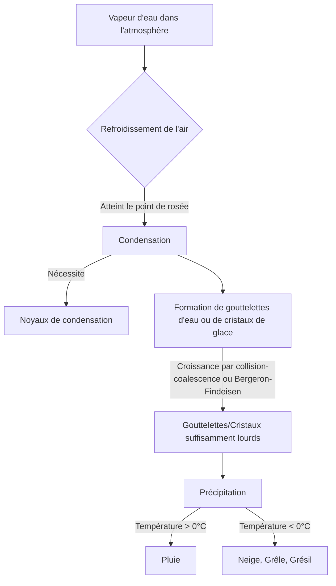
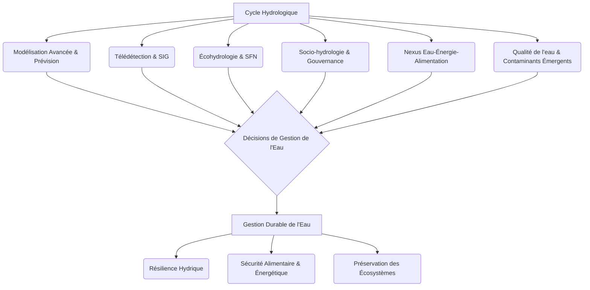

## Introduction au cycle hydrologique et aux ressources en eau
L'eau, cette substance omniprésente et pourtant si souvent tenue pour acquise, est la pierre angulaire de toute vie sur Terre et le moteur essentiel des écosystèmes et des sociétés humaines. Sa disponibilité, sa qualité et sa répartition spatio-temporelle sont des facteurs déterminants pour le développement et la survie des civilisations, ainsi que pour la santé des environnements naturels. Sans eau douce, la biosphère telle que nous la connaissons ne pourrait exister, et les activités humaines, de l'agriculture à l'industrie, en passant par la consommation domestique, seraient impossibles.

L'importance de l'eau douce est multiforme. Pour les écosystèmes, elle est le solvant universel, le milieu de vie pour d'innombrables espèces aquatiques, un régulateur thermique essentiel et un vecteur de nutriments. Les forêts tropicales humides, les zones humides, les rivières et les lacs sont des réservoirs de biodiversité qui dépendent intrinsèquement de cycles hydrologiques stables. La végétation terrestre, quant à elle, puise l'eau du sol pour la photosynthèse et la transpiration, influençant directement les climats locaux et régionaux.

Pour les sociétés humaines, l'eau douce est une ressource stratégique vitale. L'agriculture, qui représente environ 70% de la consommation mondiale d'eau douce, dépend crucialement de l'irrigation pour nourrir une population croissante <sup id="cite-2" class="scroll-mt-24"><a href="#ref-2">[2]</a></sup>. L'industrie utilise l'eau pour le refroidissement, le nettoyage, comme solvant ou matière première. La production d'énergie, notamment l'hydroélectricité, repose sur la force des cours d'eau. La consommation domestique, bien que minoritaire en volume, est indispensable à l'hygiène et à la santé publique. Au-delà de ces usages directs, l'eau est également un élément clé pour le transport fluvial, les loisirs et le maintien de paysages culturels.

Pourtant, malgré son abondance apparente sur la planète (les océans couvrent plus de 70% de la surface terrestre), l'eau douce directement utilisable est une ressource limitée. Seulement environ 2,5% de l'eau mondiale est douce, et la majeure partie de celle-ci est emprisonnée dans les glaciers, les calottes polaires ou les aquifères profonds, la rendant difficilement accessible. Moins de 1% de l'eau douce est facilement disponible dans les lacs, les rivières et les sols. Cette rareté relative, combinée à une demande croissante due à l'augmentation démographique et au développement économique, place l'eau au cœur des défis environnementaux et géopolitiques du XXIe siècle.

[[WIDGET:DataChart:global_water_distribution]]
Distribution mondiale de l'eau, soulignant la faible proportion d'eau douce accessible.

C'est dans ce contexte que la compréhension du [[WIDGET:ConceptLink:cycle_hydrologique:cycle hydrologique]] devient fondamentale. Le cycle hydrologique, également appelé cycle de l'eau, est le processus continu de circulation de l'eau sur, au-dessus et sous la surface de la Terre. Il décrit le mouvement de l'eau entre les différents réservoirs de la planète (océans, atmosphère, continents, biosphère) sous ses trois états (liquide, solide, gazeux). Ce cycle est alimenté par l'énergie solaire, qui provoque l'évaporation, et par la gravité, qui entraîne les précipitations et le ruissellement. Il s'agit d'un système dynamique et interconnecté, où chaque composant influence les autres.

L'étude du cycle hydrologique est essentielle pour la géographie physique et la climatologie, car elle permet de comprendre la distribution de l'eau sur la Terre, les processus qui façonnent les paysages (géomorphologie), les régimes climatiques et les interactions complexes entre l'atmosphère, la lithosphère, l'hydrosphère et la biosphère <sup id="cite-1" class="scroll-mt-24"><a href="#ref-1">[1]</a></sup>, <sup id="cite-5" class="scroll-mt-24"><a href="#ref-5">[5]</a></sup>.

Les enjeux liés à la gestion de l'eau sont multiples et complexes. Ils incluent la pénurie d'eau dans de nombreuses régions du monde, exacerbée par les sécheresses et la surexploitation des ressources. La pollution de l'eau, qu'elle soit d'origine industrielle, agricole ou domestique, dégrade la qualité des écosystèmes aquatiques et rend l'eau impropre à la consommation. Les inondations, de plus en plus fréquentes et intenses dans certaines zones, causent des pertes humaines et matérielles considérables. Le changement climatique, en particulier, modifie profondément le cycle hydrologique, entraînant une intensification des événements extrêmes (sécheresses prolongées, pluies torrentielles), une fonte accélérée des glaciers et des calottes polaires, et une altération des régimes de précipitations et de débits fluviaux <sup id="cite-6" class="scroll-mt-24"><a href="#ref-6">[6]</a></sup>. Ces perturbations ont des répercussions directes sur la sécurité alimentaire, la santé publique, la stabilité économique et la paix sociale.

Pour mieux appréhender la complexité de ces défis, le tableau suivant synthétise les principaux enjeux de la gestion de l'eau:

| Enjeu Majeur | Description | Conséquences |
| :------------ | :---------- | :----------- |
| **Pénurie d'eau** | Disponibilité insuffisante d'eau douce pour répondre aux besoins, exacerbée par la surexploitation et les sécheresses. | Stress hydrique, conflits d'usage, impact sur l'agriculture et l'économie locale. |
| **Pollution de l'eau** | Contamination des ressources en eau par des substances industrielles, agricoles ou domestiques. | Dégradation des écosystèmes aquatiques, risques sanitaires, coûts de traitement élevés. |
| **Inondations** | Débordements des cours d'eau ou accumulation d'eau due à des précipitations intenses, souvent amplifiées par l'urbanisation. | Pertes humaines et matérielles, destruction d'infrastructures, déplacement de populations. |
| **Changement Climatique** | Modification des régimes hydrologiques (précipitations, fonte des glaciers) et intensification des événements extrêmes. | Amplification des sécheresses et inondations, altération des écosystèmes, défis pour la sécurité alimentaire et énergétique. |

La gestion durable de l'eau nécessite une approche intégrée, prenant en compte les aspects écologiques, économiques, sociaux et politiques. Elle implique la conservation des ressources, l'amélioration de l'efficacité de l'utilisation de l'eau, la protection contre la pollution, la gestion des risques naturels et la coopération transfrontalière. Comprendre les mécanismes fondamentaux du cycle hydrologique est la première étape pour développer des stratégies de gestion efficaces et résilientes face aux défis actuels et futurs.

[[WIDGET:HistoricalAnecdote:palissy_water_cycle]]
Les premières intuitions sur le cycle de l'eau ne datent pas d'hier. Au XVIe siècle, le potier et naturaliste français [[WIDGET:RealPerson:bernard_palissy:Bernard Palissy]] fut l'un des premiers à décrire avec précision comment les pluies alimentent les sources et les rivières, contredisant les théories antiques selon lesquelles les eaux souterraines provenaient de la mer. Ses observations empiriques, basées sur l'étude des sources et des forêts, ont jeté les bases de notre compréhension moderne du cycle hydrologique, bien avant que les instruments de mesure ne soient disponibles.

[[WIDGET:Quiz:introduction_hydrology_quiz]]
## Les processus fondamentaux du cycle hydrologique

Le cycle hydrologique est un système complexe et dynamique, caractérisé par une série de processus interdépendants qui décrivent le mouvement de l'eau entre les réservoirs terrestres, atmosphériques et océaniques. Ces processus sont continuellement à l'œuvre, transformant l'eau d'un état à un autre et la transportant d'un lieu à un autre. Comprendre chacun de ces processus est essentiel pour appréhender la dynamique globale du cycle de l'eau et ses implications pour les ressources hydriques.

[[WIDGET:Image:hydrological_cycle_diagram]]
Diagramme schématique du cycle hydrologique, illustrant les principaux processus et réservoirs d'eau.

### 1. Évaporation, Transpiration et Évapotranspiration

L'évaporation est le processus par lequel l'eau passe de l'état liquide à l'état gazeux (vapeur d'eau) et est libérée dans l'atmosphère. C'est un processus clé qui initie le mouvement de l'eau dans le cycle.

*   **Mécanismes**: L'évaporation est principalement alimentée par l'énergie solaire. Lorsque les molécules d'eau à la surface d'un corps liquide (océans, lacs, rivières, sols humides) absorbent suffisamment d'énergie thermique, elles acquièrent une énergie cinétique suffisante pour s'échapper de la surface et devenir de la vapeur d'eau. Ce processus est favorisé par un gradient de pression de vapeur entre la surface de l'eau et l'air ambiant: plus l'air est sec, plus l'évaporation est intense.
*   **Facteurs influençant l'évaporation**:
    *   **Température de l'air et de l'eau**: Une température plus élevée augmente l'énergie cinétique des molécules d'eau, favorisant leur passage à l'état gazeux.
    *   **Humidité relative de l'air**: Un air sec (faible humidité relative) peut absorber plus de vapeur d'eau, augmentant le taux d'évaporation. Un air saturé (100% d'humidité relative) empêche l'évaporation.
    *   **Vitesse du vent**: Le vent emporte la vapeur d'eau accumulée juste au-dessus de la surface, maintenant un gradient de pression de vapeur élevé et favorisant ainsi l'évaporation.
    *   **Surface d'évaporation**: Une plus grande surface exposée à l'air (par exemple, un grand lac par rapport à une petite flaque) permet une évaporation plus importante.
    *   **Salinité de l'eau**: L'eau salée s'évapore moins facilement que l'eau douce, car les liaisons ioniques réduisent la tension de vapeur.
    *   **Pression atmosphérique**: Une pression plus basse peut légèrement augmenter l'évaporation.

La transpiration est un processus biologique par lequel l'eau absorbée par les racines des plantes est transportée vers les feuilles et libérée sous forme de vapeur d'eau dans l'atmosphère à travers de petits pores appelés stomates. C'est l'équivalent de l'évaporation pour le règne végétal.

L'[[WIDGET:Glossary:evapotranspiration:évapotranspiration]] (ET) est le terme collectif désignant la somme de l'évaporation directe de la surface du sol et de la transpiration des plantes. C'est un paramètre hydrologique et climatique crucial, car il représente la quantité totale d'eau retournée à l'atmosphère par ces deux voies.
*   **Évapotranspiration potentielle (ETP)**: C'est la quantité maximale d'eau qui pourrait être évaporée et transpirée par une surface végétalisée si l'approvisionnement en eau était illimité. Elle dépend principalement des facteurs climatiques (rayonnement solaire, température, humidité, vent).
*   **Évapotranspiration réelle (ETR)**: C'est la quantité d'eau réellement évaporée et transpirée, qui est souvent inférieure à l'ETP car elle est limitée par la disponibilité de l'eau dans le sol.

[[WIDGET:SolvedExercise:evapotranspiration_calculation]]
**Exercice Résolu: Calcul de l'Évapotranspiration Potentielle (ETP) selon la formule de Thornthwaite**

La formule de Thornthwaite (1948) est une méthode simple pour estimer l'ETP, basée uniquement sur la température de l'air et la durée du jour. Bien que plus simple que des méthodes comme Penman-Monteith, elle donne une bonne première approximation pour des périodes mensuelles.

La formule est: $ETP = 16 \times \left( \frac{10 \times T}{I} \right)^a$

Où:
*   $ETP$ est l'évapotranspiration potentielle mensuelle en mm.
*   $T$ est la température moyenne mensuelle en °C.
*   $I$ est l'indice thermique annuel, calculé comme la somme des 12 indices mensuels $i$, où $i = (T/5)^{1.514}$ pour chaque mois avec $T > 0°C$. Si $T \le 0°C$, $i=0$.
*   $a$ est un exposant qui dépend de $I$: $a = 0.49239 + 0.01792 \times I - 0.0000771 \times I^2 + 0.000000675 \times I^3$.

**Problème**: Calculez l'ETP pour un mois de juillet où la température moyenne est de 25°C, sachant que l'indice thermique annuel $I$ pour la station est de 100.

**Solution**:
1.  **Calcul de l'exposant $a$**:
    $a = 0.49239 + 0.01792 \times 100 - 0.0000771 \times 100^2 + 0.000000675 \times 100^3$
    $a = 0.49239 + 1.792 - 0.771 + 0.675$
    $a = 2.19$ (arrondi à deux décimales)

2.  **Calcul de l'ETP mensuelle**:
    $ETP = 16 \times \left( \frac{10 \times 25}{100} \right)^{2.19}$
    $ETP = 16 \times \left( \frac{250}{100} \right)^{2.19}$
    $ETP = 16 \times (2.5)^{2.19}$

    Pour calculer $(2.5)^{2.19}$:
    $\ln(2.5^{2.19}) = 2.19 \times \ln(2.5) \approx 2.19 \times 0.916 \approx 2.006$
    $2.5^{2.19} \approx e^{2.006} \approx 7.43$

    $ETP = 16 \times 7.43$
    $ETP \approx 118.88$ mm

**Réponse**: L'évapotranspiration potentielle pour ce mois de juillet est d'environ 119 mm.

### 2. Condensation et Précipitation

La condensation et la précipitation sont les processus par lesquels la vapeur d'eau atmosphérique retourne à la surface de la Terre sous forme liquide ou solide.

#### a. Condensation
La condensation est le processus inverse de l'évaporation, où la vapeur d'eau dans l'atmosphère se transforme en gouttelettes d'eau liquide ou en cristaux de glace. C'est le mécanisme principal de formation des nuages.

*   **Mécanismes**: La condensation se produit lorsque l'air humide est refroidi jusqu'à son [[WIDGET:ConceptLink:point_de_rosee:point de rosée]], c'est-à-dire la température à laquelle l'air devient saturé en vapeur d'eau. Le refroidissement de l'air peut se produire de plusieurs manières:
    *   **Refroidissement adiabatique**: L'air s'élève et se dilate, ce qui entraîne une baisse de température. C'est le mécanisme principal de formation des nuages dans les systèmes convectifs, orographiques ou frontaux.
    *   **Refroidissement par contact**: L'air chaud et humide entre en contact avec une surface froide (par exemple, la formation de rosée ou de brouillard de rayonnement).
    *   **Refroidissement par mélange**: Deux masses d'air de températures et d'humidités différentes se mélangent, pouvant atteindre la saturation.
*   **Noyaux de condensation**: Pour que la vapeur d'eau se condense en gouttelettes, elle a besoin de surfaces microscopiques appelées noyaux de condensation (poussières, pollens, aérosols salins, particules de pollution). Sans ces noyaux, l'air peut devenir sursaturé (humidité relative > 100%) sans que la condensation ne se produise.

#### b. Précipitation
La précipitation est la chute de l'eau condensée de l'atmosphère vers la surface terrestre. Elle peut prendre diverses formes.

*   **Mécanismes**: Une fois que les gouttelettes d'eau ou les cristaux de glace se sont formés dans les nuages par condensation, ils doivent grossir suffisamment pour que leur poids surmonte la résistance de l'air et qu'ils tombent sous l'effet de la gravité. Deux processus principaux sont à l'œuvre:
    *   **Processus de collision-coalescence**: Dans les nuages chauds (température > 0°C), de petites gouttelettes d'eau entrent en collision et fusionnent pour former des gouttelettes plus grandes, qui finissent par tomber.
    *   **Processus de Bergeron-Findeisen**: Dans les nuages froids (température &lt; 0°C), les cristaux de glace se développent aux dépens des gouttelettes d'eau surfondue (liquide à température négative) car la pression de vapeur saturante est plus faible au-dessus de la glace qu'au-dessus de l'eau liquide. Les cristaux grossissent rapidement, puis tombent, fondant en pluie s'ils traversent une couche d'air chaud, ou atteignant le sol sous forme de neige, grêle ou grésil.
*   **Types de précipitations**:
    *   **Pluie**: Forme liquide la plus courante.
    *   **Neige**: Précipitations solides sous forme de cristaux de glace.
    *   **Grêle**: Billes de glace formées dans les cumulonimbus par des courants ascendants et descendants intenses.
    *   **Grésil**: Petites billes de glace translucides ou opaques.
    *   **Brouillard, rosée, givre**: Formes de condensation qui ne sont pas considérées comme des précipitations au sens strict car elles ne tombent pas de l'atmosphère.
*   **Facteurs influençant les précipitations**:
    *   **Masses d'air**: La rencontre de masses d'air de différentes températures et humidités (précipitations frontales).
    *   **Relief (orographie)**: L'ascension forcée de l'air le long des montagnes (précipitations orographiques).
    *   **Convection**: L'ascension rapide de l'air chaud et humide (précipitations convectives, souvent sous forme d'averses orageuses).
    *   **Température atmosphérique**: Détermine si la précipitation sera liquide ou solide.

[[WIDGET:Mermaid:precipitation_flowchart]]


Diagramme de flux montrant les étapes de la condensation et de la précipitation.

### 3. Ruissellement (Superficiel et Hypodermique)

Après que l'eau ait atteint la surface terrestre sous forme de précipitations, une partie s'infiltre dans le sol, une autre est interceptée par la végétation, et le reste s'écoule à la surface ou juste sous la surface. C'est ce qu'on appelle le ruissellement.

#### a. Ruissellement superficiel (ou ruissellement de surface, ou ruissellement hortonien)
Le ruissellement superficiel est l'écoulement de l'eau sur la surface du sol lorsque l'intensité des précipitations dépasse la capacité d'infiltration du sol.

*   **Mécanismes**: Lorsque la pluie tombe sur le sol, une partie est absorbée (infiltration). Si l'intensité de la pluie est supérieure à la vitesse à laquelle le sol peut absorber l'eau, l'excès d'eau commence à s'accumuler à la surface et à s'écouler en nappes minces, puis en petits filets, rejoignant finalement des cours d'eau plus importants. Ce type de ruissellement est souvent associé à des sols peu perméables ou à des pluies intenses.
*   **Facteurs influençant le ruissellement superficiel**:
    *   **Intensité et durée des précipitations**: Des pluies intenses et prolongées augmentent la probabilité et le volume du ruissellement.
    *   **Pente du terrain**: Une pente plus forte favorise un écoulement plus rapide et réduit le temps disponible pour l'infiltration.
    *   **Perméabilité et texture du sol**: Les sols argileux ou compactés ont une faible capacité d'infiltration et génèrent plus de ruissellement que les sols sableux ou bien structurés.
    *   **Végétation**: La couverture végétale intercepte une partie de la pluie, ralentit l'écoulement et protège le sol de l'érosion. Une végétation dense réduit le ruissellement.
    *   **Humidité initiale du sol**: Un sol déjà saturé a une capacité d'infiltration très faible, augmentant le ruissellement.
    *   **Urbanisation**: Les surfaces imperméables (routes, toits) empêchent l'infiltration et augmentent considérablement le ruissellement superficiel, souvent canalisé vers des systèmes de drainage.

#### b. Ruissellement hypodermique (ou écoulement subsuperficiel)
Le [[WIDGET:Glossary:ruissellement_hypodermique:ruissellement hypodermique]] est l'écoulement latéral de l'eau dans les horizons supérieurs du sol, au-dessus d'une couche moins perméable ou imperméable.

*   **Mécanismes**: L'eau s'infiltre d'abord dans le sol, mais au lieu de percoler verticalement vers les nappes phréatiques profondes, elle rencontre une couche de sol moins perméable (par exemple, une couche d'argile compacte ou une roche mère) qui la force à s'écouler latéralement, parallèlement à la surface du sol, mais sous celle-ci. Cet écoulement est généralement plus lent que le ruissellement superficiel mais plus rapide que l'écoulement souterrain profond. Il contribue de manière significative à l'alimentation des cours d'eau, en particulier dans les régions forestières ou montagneuses.
*   **Facteurs influençant le ruissellement hypodermique**:
    *   **Structure et texture du sol**: La présence de couches de sol contrastées en termes de perméabilité est essentielle.
    *   **Topographie**: Les pentes douces favorisent l'écoulement latéral plutôt que l'infiltration verticale profonde.
    *   **Profondeur de la couche imperméable**: Une couche imperméable proche de la surface favorise le ruissellement hypodermique.
    *   **Végétation**: Les racines des plantes peuvent créer des chemins préférentiels pour l'infiltration et l'écoulement subsuperficiel.

[[WIDGET:UnsolvedExercise:runoff_impacts]]
**Exercice Non Résolu: Impact de l'aménagement du territoire sur le ruissellement**

Une petite ville rurale est en pleine expansion. Un projet de développement prévoit de convertir 50 hectares de terres agricoles (champs cultivés avec une bonne couverture végétale) en une zone résidentielle avec des maisons, des routes asphaltées et des parkings.

1.  Décrivez comment cette conversion de l'utilisation des terres est susceptible d'affecter les processus de ruissellement superficiel et d'infiltration dans la zone concernée.
2.  Quelles pourraient être les conséquences hydrologiques (par exemple, en termes de risque d'inondation, de recharge des nappes phréatiques, de qualité de l'eau) pour la ville et les cours d'eau avoisinants?
3.  Proposez au moins trois mesures d'aménagement ou techniques d'ingénierie qui pourraient être mises en œuvre pour atténuer ces impacts négatifs.

### 4. Infiltration

L'infiltration est le processus par lequel l'eau de surface pénètre dans le sol et se déplace vers le bas à travers les pores et les fissures. C'est une étape cruciale qui relie l'eau de surface à l'eau souterraine.

*   **Mécanismes**: L'eau s'infiltre sous l'effet combiné de la gravité et des forces capillaires. La gravité tire l'eau vers le bas, tandis que la capillarité (attraction de l'eau par les petites pores du sol) aide à la distribuer latéralement et verticalement. L'eau infiltrée peut rester dans la zone non saturée du sol (zone d'aération) où elle est disponible pour les plantes, ou continuer à percoler plus profondément pour recharger les nappes phréatiques.
*   **Facteurs influençant l'infiltration**:
    *   **Texture et structure du sol**: Les sols sableux avec de grands pores ont une capacité d'infiltration élevée, tandis que les sols argileux compacts ont une faible capacité. La présence de matière organique et une bonne structure du sol (agrégats) augmentent l'infiltration.
    *   **Humidité initiale du sol**: Un sol sec a une capacité d'infiltration plus élevée qu'un sol déjà humide ou saturé.
    *   **

...Humidité initiale du sol**: Un sol sec a une capacité d'infiltration plus élevée qu'un sol déjà humide ou saturé.
*   **Végétation et couverture du sol**: La végétation intercepte les précipitations, ralentit le ruissellement et favorise l'infiltration grâce à ses racines qui créent des macropores. La litière organique au sol améliore également la structure du sol et sa capacité d'absorption.
*   **Intensité et durée des précipitations**: Si l'intensité des précipitations dépasse la capacité d'infiltration du sol, le surplus d'eau s'écoulera en surface. Des pluies prolongées peuvent saturer le sol, réduisant drastiquement l'infiltration.
*   **Température**: Le gel du sol peut empêcher l'infiltration, tandis que des températures élevées augmentent l'évaporation de l'eau de surface, ce qui peut paradoxalement augmenter la capacité d'infiltration si le sol s'assèche, ou la réduire si la surface devient compacte.
*   **Pente du terrain**: Sur des pentes raides, l'eau a moins de temps pour s'infiltrer et tend à ruisseler davantage.

L'infiltration est un processus fondamental qui alimente les réserves d'eau souterraine, essentielles pour l'approvisionnement en eau potable et le maintien des écosystèmes. La compréhension de ses mécanismes et des facteurs qui l'influencent est cruciale pour la gestion des ressources hydriques et la prévention des risques naturels comme les inondations et les sécheresses.

---

## Bilan hydrique et dynamique des réserves d'eau douce

Le [[WIDGET:ConceptLink:bilan_hydrique:bilan hydrique]] est un concept central en hydrologie, représentant l'équilibre entre les entrées et les sorties d'eau dans un système donné, ainsi que les variations de ses réserves. Il s'exprime généralement par l'équation fondamentale :

**P = E + R + ΔS**

Où :
*   **P** représente les précipitations (pluie, neige, grêle) qui constituent l'apport principal en eau au système.
*   **E** représente l'évapotranspiration, c'est-à-dire la somme de l'évaporation directe depuis les surfaces d'eau et du sol, et de la transpiration des plantes.
*   **R** représente le ruissellement total, incluant le ruissellement superficiel et l'écoulement souterrain qui alimentent les cours d'eau.
*   **ΔS** représente la variation des stocks d'eau dans le système (sol, nappes souterraines, lacs, glaciers, etc.).

L'analyse du bilan hydrique peut être réalisée à différentes échelles spatiales, chacune offrant une perspective unique sur la dynamique de l'eau.

### Analyse du bilan hydrique à différentes échelles

#### 1. À l'échelle du bassin versant

Le bassin versant est l'unité géographique fondamentale pour l'étude hydrologique. Il s'agit d'une zone drainée par un cours d'eau principal et ses affluents, délimitée par une ligne de partage des eaux. À cette échelle, le bilan hydrique permet de comprendre comment l'eau est reçue, stockée et évacuée.

*   **Entrées**: Les précipitations sont la principale entrée. Elles sont mesurées par des pluviomètrès et peuvent varier considérablement en intensité et en répartition spatiale au sein d'un même bassin.
*   **Sorties**:
    *   **Évapotranspiration (E)**: Dépend de facteurs climatiques (température, humidité de l'air, vent, rayonnement solaire) et de la couverture végétale. Elle est souvent la composante la plus difficile à mesurer directement et est estimée par diverses méthodes (par exemple, la méthode de Thornthwaite ou de Penman-Monteith).
    *   **Débit des cours d'eau (R)**: Représente l'eau qui quitte le bassin par le réseau hydrographique. Il est mesuré par des stations hydrométriques et intègre le ruissellement de surface, l'écoulement hypodermique et la contribution des eaux souterraines.
*   **Stockage (ΔS)**: Comprend l'eau stockée dans le sol (humidité du sol), dans les nappes phréatiques, dans les lacs et réservoirs, et sous forme de neige ou de glace. Les variations de ces stocks sont cruciales pour comprendre la réponse hydrologique du bassin aux événements climatiques (sécheresses, crues).

L'étude du bilan hydrique à l'échelle du bassin versant est essentielle pour la gestion locale des ressources en eau, la prévision des crues et des étiages, et l'évaluation de l'impact des aménagements (barrages, déforestation, urbanisation) sur le régime hydrologique <sup><a href="#ref-2">[2]</a></sup>.

#### 2. À l'échelle régionale

À l'échelle régionale, le bilan hydrique agrège les dynamiques de plusieurs bassins versants ou de vastes zones géographiques caractérisées par des conditions climatiques et géomorphologiques similaires. L'objectif est de comprendre les grandes tendances de la disponibilité en eau et les interactions entre les systèmes hydrologiques.

*   **Facteurs régionaux**: Les régimes climatiques (méditerranéen, continental, océanique, tropical) influencent fortement les composantes du bilan. Par exemple, les régions arides ont une évapotranspiration potentielle élevée et des précipitations faibles, conduisant à un bilan déficitaire, tandis que les régions humides présentent souvent un excédent.
*   **Interconnexions**: À cette échelle, les transferts d'eau entre régions (par exemple, via de grands fleuves transfrontaliers ou des aquifères partagés) deviennent significatifs. Les politiques de gestion de l'eau doivent alors prendre en compte ces interdépendances.
*   **Modélisation**: Des modèles hydrologiques régionaux sont utilisés pour simuler les flux d'eau et les stocks sur de grandes surfaces, aidant à la planification des ressources et à l'évaluation des impacts du changement climatique <sup><a href="#ref-6">[6]</a></sup>.

#### 3. À l'échelle globale

Le bilan hydrique global décrit le cycle de l'eau à l'échelle planétaire, mettant en évidence les transferts massifs d'eau entre les océans, l'atmosphère et les continents. Il s'agit d'un système fermé où la quantité totale d'eau est constante, mais où sa répartition et son état changent continuellement.

[[WIDGET:Mermaid:global_water_cycle_balance]]
```mermaid
graph TD
    A[Océans] -->|Évaporation (434 000 km³/an)| B(Atmosphère)
    B -->|Précipitations sur océans (398 000 km³/an)| A
    B -->|Précipitations sur continents (113 000 km³/an)| C(Continents)
    C -->|Évapotranspiration (71 000 km³/an)| B
    C -->|Ruissellement vers océans (42 000 km³/an)| A
    subgraph Réservoirs Continentaux
        C1[Lacs et Rivières]
        C2[Eaux Souterraines]
        C3[Glaciers et Neige]
        C4[Humidité du Sol]
    end
    C --> C1
    C --> C2
    C --> C3
    C --> C4
    C1 <--> C2
    C1 <--> C4
    C3 --> C1
    C4 --> C2
    C2 --> C1
```

Bilan hydrique global simplifié, illustrant les principaux flux entre les océans, l'atmosphère et les continents. Les chiffres sont des ordres de grandeur annuels en km³.

*   **Réservoirs majeurs**:
    *   **Océans**: Contiennent environ 97,5% de l'eau totale de la Terre.
    *   **Glaciers et calottes polaires**: Environ 1,7% de l'eau totale, mais la plus grande réserve d'eau douce.
    *   **Eaux souterraines**: Environ 0,7% de l'eau totale, deuxième plus grande réserve d'eau douce.
    *   **Lacs et rivières**: Une fraction minime (0,01%), mais cruciale pour les écosystèmes et l'humanité.
    *   **Atmosphère et humidité du sol**: Des quantités encore plus faibles, mais des flux très dynamiques.
*   **Flux globaux**: Les principaux flux sont l'évaporation des océans, les précipitations sur les océans et les continents, l'évapotranspiration continentale et le ruissellement continental vers les océans. Ces flux sont à l'origine des grands cycles climatiques et hydrologiques <sup><a href="#ref-1">[1]</a></sup>.
*   **Changement climatique**: À cette échelle, le changement climatique modifie les flux et les stocks d'eau, avec des impacts sur la circulation atmosphérique, la fonte des glaces, l'élévation du niveau marin et la fréquence des événements extrêmes <sup><a href="#ref-6">[6]</a></sup>.

### Dynamique des principales réserves d'eau douce

L'eau douce, bien que ne représentant qu'une faible proportion de l'eau totale de la planète (environ 2,5%), est essentielle à la vie. Sa répartition et sa dynamique sont complexes et interconnectées.

[[WIDGET:Image:global_freshwater_distribution]]
Distribution mondiale des réserves d'eau douce.

#### 1. Eaux de surface

Les eaux de surface comprennent les lacs, les rivières, les zones humides et les réservoirs artificiels. Elles sont les plus accessibles et visibles des réserves d'eau douce.

*   **Lacs**:
    *   **Formation**: Les lacs peuvent se former de diverses manières : par des processus tectoniques (graben, fosses d'effondrement comme le lac Baïkal), par l'activité volcanique (lacs de cratère), par l'action glaciaire (lacs de cirque, lacs de barrage morainique), par dissolution de roches solubles (lacs karstiques), ou par des méandres abandonnés de rivières (lacs de bras mort).
    *   **Rôle hydrologique**: Les lacs agissent comme des régulateurs naturels des débits fluviaux, stockant l'eau pendant les périodes de crue et la restituant pendant les étiages. Ils sont aussi des sites importants d'évaporation.
    *   **Écologie**: Les lacs abritent des écosystèmes aquatiques riches et diversifiés, et sont des sources d'eau pour la faune et la flore.
    *   **Vulnérabilité**: Ils sont sensibles à la pollution, à l'eutrophisation et aux variations climatiques (assèchement).
*   **Rivières et fleuves**:
    *   **Réseaux de drainage**: Les rivières et fleuves constituent les artères du cycle hydrologique continental, collectant l'eau de ruissellement et souterraine des bassins versants et la transportant vers les lacs, les océans ou d'autres systèmes fluviaux.
    *   **Régimes hydrologiques**: Le régime d'un cours d'eau décrit ses variations de débit au cours de l'année. Il est influencé par le climat (régime pluvial), la fonte des neiges (régime nival) ou des glaciers (régime glaciaire), et la géologie du bassin.
    *   **Fonctions**: Ils sont essentiels pour l'approvisionnement en eau, l'irrigation, la navigation, la production d'énergie hydroélectrique et le maintien de la biodiversité. Ils jouent également un rôle majeur dans le transport des sédiments et des nutriments <sup id="cite-3" class="scroll-mt-24"><a href="#ref-3">[3]</a></sup>.

#### 2. Eaux souterraines

Les eaux souterraines représentent la plus grande réserve d'eau douce liquide de la planète, stockée dans les formations géologiques poreuses et perméables appelées aquifères.

*   **Aquifères**:
    *   **Définition**: Un [[WIDGET:Glossary:aquifere:aquifère]] est une formation géologique capable de stocker et de laisser circuler l'eau. Sa capacité dépend de sa porosité (volume des vides) et de sa perméabilité (capacité à laisser passer l'eau).
    *   **Types**:
        *   **Aquifères libres (ou nappes phréatiques)**: La surface de l'eau (niveau piézométrique) est en contact direct avec l'atmosphère via la zone non saturée. Ils sont facilement rechargeables par l'infiltration des précipitations.
        *   **Aquifères captifs (ou nappes artésiennes)**: L'aquifère est confiné entre deux couches imperméables (aquicludes). L'eau y est sous pression, et un forage peut entraîner une remontée spontanée de l'eau (puits artésien). Leur recharge est plus lente et se fait dans des zones d'affleurement lointaines.
    *   **Importance**: Les eaux souterraines sont une source d'eau potable vitale pour des milliards de personnes, en particulier dans les régions arides ou semi-arides. Elles alimentent également les cours d'eau et les zones humides, surtout pendant les périodes de sécheresse.
*   **Nappes phréatiques**:
    *   **Définition**: La nappe phréatique est la surface supérieure de la zone saturée d'un aquifère libre. Son niveau fluctue en fonction de la recharge (précipitations, infiltration) et des prélèvements (pompage, alimentation des cours d'eau).
    *   **Interactions**: Les nappes phréatiques sont en interaction constante avec les eaux de surface. Elles peuvent alimenter les rivières (écoulement de base) ou être rechargées par elles (en période de crue). Elles sont également sensibles à la pollution de surface.

#### 3. Glaces et neige

Les glaces et la neige constituent la plus grande réserve d'eau douce sur Terre, principalement sous forme solide.

*   **Glaciers et calottes polaires**:
    *   **Réservoirs massifs**: Les calottes glaciaires de l'Antarctique et du Groenland, ainsi que les glaciers de montagne, stockent d'énormes quantités d'eau douce. Par exemple, l'Antarctique contient environ 90% de la glace terrestre et 70% de l'eau douce de la planète.
    *   **Rôle climatique**: Ils jouent un rôle crucial dans la régulation du climat global en réfléchissant le rayonnement solaire (effet d'albédo) et en influençant la circulation océanique.
    *   **Approvisionnement en eau**: Dans de nombreuses régions montagneuses (Himalaya, Andes, Alpes), la fonte saisonnière des glaciers est une source d'eau vitale pour l'irrigation, l'hydroélectricité et l'approvisionnement en eau potable.
    *   **Vulnérabilité**: Ils sont extrêmement sensibles au réchauffement climatique, leur fonte accélérée contribuant à l'élévation du niveau de la mer et modifiant les régimes hydrologiques en aval <sup><a href="#ref-6">[6]</a></sup>.
*   **Neige**:
    *   **Stockage saisonnier**: La neige accumulée en hiver représente un stockage temporaire d'eau douce. Sa fonte printanière alimente les cours d'eau et recharge les sols et les nappes.
    *   **Importance hydrologique**: Dans les régions de montagne et les zones tempérées froides, le manteau neigeux est un régulateur essentiel du cycle hydrologique, influençant les débits fluviaux et la disponibilité de l'eau pour l'été.
*   **Permafrost**:
    *   **Définition**: Le permafrost est un sol dont la température reste inférieure ou égale à 0°C pendant au moins deux années consécutives. Il contient d'importantes quantités d'eau sous forme de glace.
    *   **Impact du dégel**: Le dégel du permafrost, induit par le réchauffement climatique, libère de l'eau et des gaz à effet de serre (méthane, CO2), modifie la topographie et l'hydrologie des régions arctiques et subarctiques, et peut affecter la stabilité des infrastructures.

### Interconnexion des réservoirs d'eau douce

L'un des aspects les plus importants du cycle hydrologique est l'interconnexion dynamique de ces différents réservoirs. L'eau n'est jamais statique ; elle est en mouvement constant, passant d'un compartiment à l'autre.

*   **Précipitations et infiltration**: Les précipitations rechargent directement les eaux de surface (lacs, rivières) et, par infiltration, les eaux souterraines et l'humidité du sol.
*   **Interaction surface-souterrain**: Les rivières et les lacs peuvent être alimentés par les nappes phréatiques (phénomène de « drainage » ou « exfiltration ») ou, inversement, recharger les nappes (phénomène d'« infiltration » ou « recharge »). Cette interaction est cruciale pour le maintien des débits d'étiage et des écosystèmes aquatiques.
*   **Fonte des glaces et neige**: La fonte des glaciers et du manteau neigeux alimente les cours d'eau, qui à leur tour peuvent recharger les lacs et les nappes phréatiques en aval. Cette contribution est particulièrement importante pendant les saisons chaudes.
*   **Évapotranspiration**: L'eau des sols, des lacs et des rivières retourne à l'atmosphère par évaporation et transpiration, bouclant ainsi une partie du cycle.

Cette interdépendance signifie que toute perturbation d'un réservoir (par exemple, la surexploitation d'une nappe phréatique, la pollution d'un lac, la fonte d'un glacier) aura des répercussions sur les autres compartiments du système hydrologique. Comprendre ces liens est fondamental pour une gestion durable de l'eau. Le géographe et hydrologiste [[WIDGET:RealPerson:alfred_wegener:Alfred Wegener]] a, bien que plus connu pour sa théorie de la dérive des continents, souligné l'importance de l'observation des phénomènes naturels dans leur globalité, une approche qui résonne avec la vision intégrée du cycle de l'eau.

[[WIDGET:Quiz:water_reservoirs_interconnection]]
**Quiz: Interconnexion des Réservoirs d'Eau Douce**

1.  Quel est le plus grand réservoir d'eau douce sur Terre ?
    a) Les lacs et rivières
    b) Les eaux souterraines
    c) Les glaciers et calottes polaires
    d) L'humidité du sol

2.  Comment les nappes phréatiques peuvent-elles interagir avec les cours d'eau ?
    a) Elles ne peuvent qu'alimenter les cours d'eau.
    b) Elles ne peuvent être rechargées que par les cours d'eau.
    c) Elles peuvent à la fois alimenter et être rechargées par les cours d'eau.
    d) Il n'y a pas d'interaction directe entre les deux.

3.  Quel phénomène climatique est directement lié à la fonte accélérée des glaciers et a un impact sur le niveau des mers ?
    a) Les précipitations extrêmes
    b) Le réchauffement climatique
    c) La désertification
    d) L'eutrophisation

4.  L'équation P = E + R + ΔS représente :
    a) Le bilan énergétique d'un écosystème
    b) Le bilan sédimentaire d'un fleuve
    c) Le bilan hydrique d'un système
    d) Le cycle du carbone

---

## Enjeux contemporains et gestion des ressources en eau

La disponibilité et la qualité de l'eau douce sont devenues des préoccupations majeures à l'échelle mondiale au XXIe siècle. La croissance démographique, le développement économique et les changements climatiques exercent une pression sans précédent sur cette ressource vitale, transformant sa gestion en un défi complexe et multidimensionnel.

### Problématiques de la disponibilité et de la qualité de l'eau douce

#### 1. Disponibilité de l'eau douce

*   **Stress hydrique et pénurie**: Le [[WIDGET:Glossary:stress_hydrique:stress hydrique]] survient lorsque la demande en eau dépasse les ressources disponibles ou lorsque la qualité de l'eau limite son utilisation. La pénurie physique d'eau se manifeste par l'insuffisance des ressources naturelles pour satisfaire les besoins, tandis que la pénurie économique est due à un manque d'investissement dans les infrastructures pour capter, traiter et distribuer l'eau, même si la ressource est physiquement présente. Des régions entières, notamment au Moyen-Orient, en Afrique du Nord, en Asie centrale et dans certaines parties de l'Inde et de la Chine, sont déjà confrontées à un stress hydrique sévère <sup><a href="#ref-6">[6]</a></sup>.
*   **Accès inégal à l'eau potable**: Malgré les progrès, des milliards de personnes n'ont toujours pas accès à des services d'eau potable gérés en toute sécurité. Cet accès inégal est souvent lié à des facteurs socio-économiques, géographiques et politiques, exacerbant les inégalités et les conflits.
*   **Surexploitation des aquifères**: Le pompage excessif des eaux souterraines pour l'agriculture, l'industrie et l'approvisionnement urbain entraîne une baisse des niveaux piézométriques, l'épuisement des nappes fossiles (non renouvelables à l'échelle humaine) et, dans les zones côtières, l'intrusion d'eau salée, rendant l'eau impropre à la consommation ou à l'irrigation. C'est un problème majeur dans des régions comme la Californie, le nord de la Chine ou le bassin du Gange.

#### 2. Qualité de l'eau douce

*   **Pollution agricole**: L'utilisation intensive d'engrais (nitrates, phosphates) et de pesticides dans l'agriculture est une source majeure de pollution diffuse des eaux de surface et souterraines. Ces substances peuvent provoquer l'eutrophisation des lacs et rivières (prolifération d'algues, désoxygénation), et rendre l'eau impropre à la consommation.
*   **Pollution industrielle**: Les rejets industriels non traités ou mal traités contiennent souvent des métaux lourds, des produits chimiques organiques toxiques et d'autres polluants qui contaminent gravement les écosystèmes aquatiques et menacent la santé humaine.
*   **Pollution urbaine**: Les eaux usées domestiques et les eaux de ruissellement urbain (chargées de déchets, d'hydrocarbures, de microplastiques) contribuent à la pollution bactériologique et chimique des cours d'eau et des lacs, en particulier dans les zones où les infrastructures d'assainissement sont insuffisantes.
*   **Salinisation**: Outre l'intrusion marine dans les aquifères côtiers, la salinisation des sols et des eaux peut être causée par une irrigation excessive dans les zones arides, où l'évaporation concentre les sels minéraux.
*   **Impact sur les écosystèmes aquatiques**: La dégradation de la qualité de l'eau a des conséquences directes sur la biodiversité aquatique, entraînant la disparition d'espèces, la perturbation des chaînes alimentaires et la dégradation des services écosystémiques (purification naturelle de l'eau, régulation des crues).

### Impact des activités humaines et des changements climatiques sur le cycle hydrologique

Les activités humaines et le changement climatique sont les principaux moteurs des modifications du cycle hydrologique et des ressources en eau.

#### 1. Impact des activités humaines

*   **Agriculture**: L'agriculture est de loin le plus grand consommateur d'eau douce à l'échelle mondiale, représentant environ 70% des prélèvements. L'irrigation intensive, souvent inefficace, épuise les ressources en eau de surface et souterraines. La déforestation pour l'agriculture modifie également les régimes de ruissellement et d'infiltration.

[[WIDGET:DataChart:global_water_use_by_sector]]

&#123;
  « type »: « pie »,
  « data »: &#123;
« labels »: ,
    « datasets »: [&#123;
      « data »: [70, 20, 10],
      « backgroundColor »: [« #4CAF50 », « #2196F3 », « #FFC107 »]
    &#125;]
  &#125;,
  « options »: &#123;
    « responsive »: true,
    « plugins »: &#123;
      « title »: &#123;
        « display »: true,
        « text »: « Répartition mondiale de l'utilisation de l'eau douce par secteur (estimation) »
      &#125;
    &#125;
  &#125;
&#125;

Répartition mondiale estimée de l'utilisation de l'eau douce par secteur.

*   **Industrie**: Le secteur industriel utilise environ 20% de l'eau douce mondiale, principalement pour le refroidissement, les processus de fabrication et l'élimination des déchets. Les rejets d'eaux usées industrielles non traitées sont une source majeure de pollution.
*   **Urbanisation**: L'expansion urbaine entraîne l'imperméabilisation des sols (routes, bâtiments), ce qui réduit l'infiltration et augmente le ruissellement de surface, aggravant les risques d'inondation et diminuant la recharge des nappes. La concentration de populations génère également d'importants volumes d'eaux usées et de déchets.
*   **Aménagements hydrauliques**: La construction de barrages et de réservoirs modifie les régimes fluviaux naturels, affectant les écosystèmes en aval, la migration des poissons et le transport des sédiments. Bien qu'ils fournissent de l'énergie et régulent l'eau, ils peuvent aussi entraîner des déplacements de populations et des conflits d'usage.

#### 2. Impact des changements climatiques

Le Groupe d'experts intergouvernemental sur l'évolution du climat (GIEC) a clairement établi que le changement climatique modifie le cycle hydrologique mondial <sup><a href="#ref-6">[6]</a></sup>.

*   **Modification des régimes de précipitations**:
    *   **Augmentation des extrêmes**: Les régions déjà humides devraient connaître des précipitations plus intenses, augmentant le risque d'inondations. Les régions arides et semi-arides devraient faire face à des sécheresses plus fréquentes et plus sévères.
    *   **Variabilité accrue**: Une plus grande variabilité interannuelle et intra-annuelle des précipitations rend la planification des ressources en eau plus difficile.
*   **Fonte des glaciers et calottes polaires**: La fonte accélérée des glaciers et des calottes glaciaires contribue à l'élévation du niveau de la mer. À court terme, elle peut augmenter les débits fluviaux dans les régions glaciaires, mais à long terme, elle menace l'approvisionnement en eau des populations qui dépendent de cette source saisonnière.
*   **Augmentation de l'évapotranspiration**: Des températures plus élevées augmentent l'évaporation des surfaces d'eau et la transpiration des plantes, réduisant ainsi la disponibilité nette d'eau douce.
*   **Élévation du niveau de la mer**: L'élévation du niveau de la mer entraîne l'intrusion d'eau salée dans les aquifères côtiers et les estuaires, rendant les ressources en eau douce inutilisables. Cela affecte particulièrement les deltas densément peuplés.
*   **Impact sur la qualité de l'eau**: Les inondations peuvent entraîner le débordement des systèmes d'assainissement et la contamination des sources d'eau. Les sécheresses peuvent concentrer les polluants dans les cours d'eau et les lacs, dégradant la qualité de l'eau.

### Principes et défis de la gestion intégrée de l'eau (GIE)

Face à ces enjeux, la [[WIDGET:ConceptLink:gestion_integree_eau:Gestion Intégrée des Ressources en Eau (GIRE)]] est devenue le cadre de référence international pour une gestion durable de l'eau. Elle vise à coord

## Conclusion
Le cycle hydrologique, moteur fondamental des systèmes terrestres, est au cœur des enjeux environnementaux et sociétaux majeurs de notre siècle. Cette leçon a exploré la dynamique complexe de ce cycle, ses composantes essentielles – évaporation, condensation, précipitation, ruissellement, infiltration et stockage – ainsi que les réservoirs d'eau douce qui en découlent, des glaciers aux nappes phréatiques <sup><a href="#ref-1">[1]</a></sup>, <sup><a href="#ref-2">[2]</a></sup>. Nous avons mis en lumière l'importance vitale de l'eau douce pour la vie et les activités humaines, soulignant sa distribution inégale et sa vulnérabilité croissante.

Les pressions anthropiques exercées sur les ressources en eau sont multiples et s'intensifient. L'agriculture, premier consommateur mondial, l'industrie avec ses besoins en refroidissement et en processus, et l'urbanisation galopante, modifient profondément les bilans hydriques locaux et régionaux, tout en générant des pollutions diffuses et ponctuelles. Les grands aménagements hydrauliques, bien que sources d'énergie et de régulation, altèrent les régimes naturels des cours d'eau et les écosystèmes associés. Parallèlement, les changements climatiques, dont les preuves sont irréfutables selon le [[WIDGET:ConceptLink:giec:GIEC]] <sup><a href="#ref-6">[6]</a></sup>, agissent comme un puissant amplificateur de ces défis. Ils se manifestent par une intensification des événements extrêmes (sécheresses et inondations), une fonte accélérée des glaciers menaçant l'approvisionnement à long terme, une augmentation de l'évapotranspiration réduisant la disponibilité nette d'eau, et une élévation du niveau de la mer entraînant l'intrusion saline dans les aquifères côtiers. Ces perturbations affectent non seulement la quantité mais aussi la qualité de l'eau disponible, rendant la gestion de cette ressource plus complexe et plus urgente que jamais. Face à cette situation, la [[WIDGET:ConceptLink:gestion_integree_eau:Gestion Intégrée des Ressources en Eau (GIRE)]] s'est imposée comme un paradigme indispensable, visant à concilier les usages, préserver les écosystèmes et assurer une répartition équitable.

[[WIDGET:HistoricalAnecdote:water_management_history]]

### Perspectives de recherche futures

La complexité des interactions au sein du cycle hydrologique et la multiplicité des facteurs de stress exigent une recherche scientifique continue et innovante. Plusieurs axes de recherche émergent comme prioritaires pour éclairer les décisions et orienter les actions vers une gestion durable de l'eau.

1.  **Modélisation avancée et prévision hydrologique**:
    La recherche doit se concentrer sur le développement de modèles hydrologiques de nouvelle génération, capables d'intégrer de manière plus fine les processus physiques, chimiques et biologiques, ainsi que les rétroactions anthropiques. Cela inclut l'amélioration des modèles climatiques régionaux (downscaling) pour des prévisions plus précises des précipitations et des températures à des échelles pertinentes pour la gestion de l'eau. L'intégration de l'incertitude dans ces modèles est cruciale pour fournir des scénarios robustes aux décideurs. Des efforts sont également nécessaires pour modéliser les interactions entre les eaux de surface et les eaux souterraines avec une résolution spatiale et temporelle accrue, notamment dans les systèmes karstiques ou les zones alluviales complexes.

2.  **Télédétection et systèmes d'information géographique (SIG)**:
    L'exploitation des données satellitaires offre des opportunités sans précédent pour le suivi du cycle hydrologique à l'échelle mondiale et régionale. La recherche vise à améliorer l'estimation de paramètrès clés tels que l'humidité du sol, l'évapotranspiration, la couverture neigeuse, le volume des glaciers et les variations des niveaux d'eau dans les lacs et les réservoirs. Les avancées dans les capteurs (radar, lidar, gravimétrie comme GRACE) et les algorithmes de traitement permettent de mieux comprendre les flux et les stocks d'eau, y compris les changements dans les nappes phréatiques. L'intégration de ces données avec les SIG permet de créer des outils d'aide à la décision dynamiques pour la surveillance des sécheresses, la prévision des inondations et la planification de l'irrigation.

3.  **Écohydrologie et solutions fondées sur la nature (SFN)**:
    L'écohydrologie étudie les interactions entre les processus hydrologiques et écologiques. La recherche future doit approfondir notre compréhension de la manière dont les écosystèmes (forêts, zones humides, prairies) régulent le cycle de l'eau, filtrent les polluants et atténuent les risques naturels. Cela inclut l'évaluation quantitative de l'efficacité des solutions fondées sur la nature, telles que la restauration des zones humides pour la rétention d'eau et la purification, la reforestation pour la recharge des nappes, ou l'agriculture de conservation pour améliorer l'infiltration. Ces approches, souvent plus résilientes et moins coûteuses que les infrastructures « grises », nécessitent des recherches pour optimiser leur conception et leur mise en œuvre dans divers contextes biogéographiques.

4.  **Socio-hydrologie et gouvernance adaptative**:
    La socio-hydrologie est un domaine émergent qui vise à intégrer les dimensions humaines (comportements, politiques, institutions) dans la modélisation et la compréhension du cycle hydrologique. La recherche doit explorer les dynamiques complexes entre les systèmes hydrologiques et les systèmes sociaux, par exemple comment les décisions de gestion de l'eau influencent les sociétés et comment les sociétés réagissent aux changements hydrologiques. Cela implique le développement de modèles couplés homme-eau et l'étude des mécanismes de gouvernance adaptative, qui permettent d'ajuster les stratégies de gestion en fonction des évolutions environnementales et sociales. La participation des parties prenantes et l'intégration des savoirs locaux sont des axes de recherche importants pour une gestion plus inclusive et efficace.

5.  **Nexus Eau-Énergie-Alimentation**:
    La recherche sur le nexus eau-énergie-alimentation est cruciale pour optimiser l'utilisation des ressources interconnectées. Chaque secteur dépend des deux autres, et les décisions prises dans l'un ont des répercussions sur les autres. Par exemple, la production d'énergie nécessite de l'eau (refroidissement des centrales, hydroélectricité), l'agriculture nécessite de l'eau et de l'énergie (irrigation, fertilisants), et la production d'énergie et d'aliments est essentielle à la vie humaine. La recherche vise à développer des outils d'analyse intégrée pour identifier les synergies, atténuer les compromis et promouvoir des politiques cohérentes qui maximisent la sécurité des trois piliers.

6.  **Qualité de l'eau et contaminants émergents**:
    Au-delà de la quantité, la qualité de l'eau est un enjeu majeur. La recherche doit se concentrer sur la détection, la quantification et l'impact des contaminants émergents (produits pharmaceutiques, microplastiques, pesticides de nouvelle génération) dans les écosystèmes aquatiques et sur la santé humaine. Cela inclut le développement de technologies de traitement innovantes, plus efficaces et moins énergivores, ainsi que l'étude des processus de dégradation naturelle et de bioaccumulation. La compréhension des sources de pollution diffuse et la mise en place de stratégies de prévention efficaces sont également des priorités.


*Flux des priorités de recherche pour la gestion de l'eau.*

### Défis futurs pour une gestion durable de l'eau

Malgré les avancées scientifiques et technologiques, la gestion durable de l'eau à l'échelle planétaire est confrontée à des défis colossaux qui nécessitent une action concertée et immédiate.

1.  **Pénurie et stress hydrique croissants**:
    La demande mondiale en eau continue d'augmenter sous l'effet de la croissance démographique, de l'urbanisation et de l'intensification des activités économiques. De nombreuses régions, notamment les zones arides et semi-arides, sont déjà en situation de stress hydrique sévère, exacerbé par les changements climatiques <sup><a href="#ref-6">[6]</a></sup>. Le défi est de parvenir à satisfaire les besoins croissants tout en préservant les écosystèmes aquatiques. Cela implique une meilleure efficience de l'utilisation de l'eau dans tous les secteurs (agriculture, industrie, domestique), la promotion de la réutilisation des eaux usées traitées et le développement de sources non conventionnelles comme le dessalement, tout en évaluant leurs impacts environnementaux et énergétiques.

    Pour mieux comprendre la répartition des usages de l'eau, voici un aperçu de la consommation mondiale par secteur:

    | Secteur | Pourcentage de l'utilisation mondiale | Exemples d'usages |
    |---|---|---|
    | Agriculture | ~70% | Irrigation des cultures, élevage |
    | Industrie | ~20% | Refroidissement des centrales, processus de fabrication, production d'énergie |
    | Domestique | ~10% | Boisson, hygiène personnelle, assainissement |

    [[WIDGET:DataChart:global_water_use]]

2.  **Dégradation de la qualité de l'eau**:
    La pollution de l'eau, qu'elle soit d'origine agricole (nitrates, pesticides), industrielle (métaux lourds, produits chimiques) ou urbaine (eaux usées non traitées, microplastiques), compromet la disponibilité de l'eau potable et la santé des écosystèmes. Le défi est de mettre en œuvre des politiques de prévention de la pollution plus strictes, d'améliorer les infrastructures de traitement des eaux usées et de développer des approches intégrées de gestion des bassins versants pour réduire les apports de polluants à la source. La sensibilisation des populations et des acteurs économiques est essentielle pour changer les pratiques.

3.  **Adaptation aux changements climatiques et résilience hydrique**:
    Les impacts du changement climatique sur le cycle hydrologique sont déjà perceptibles et vont s'intensifier. Le défi est de construire une [[WIDGET:Glossary:resilience_hydrique:résilience hydrique]] des territoires, c'est-à-dire leur capacité à absorber les chocs (sécheresses, inondations) et à s'adapter aux changements à long terme. Cela passe par le renforcement des systèmes d'alerte précoce, la diversification des sources d'approvisionnement, la protection et la restauration des infrastructures naturelles (zones humides, forêts), et la mise en place de stratégies de gestion flexible des barrages et des réservoirs. L'investissement dans des infrastructures « vertes » et « bleues » est une priorité.

4.  **Gouvernance et coopération transfrontalière**:
    L'eau ne connaît pas de frontières administratives. De nombreux bassins fluviaux et aquifères sont partagés par plusieurs pays, ce qui rend la gestion de l'eau intrinsèquement liée à la géopolitique. Le défi est de renforcer la coopération transfrontalière et la [[WIDGET:ConceptLink:hydrodiplomatie:hydrodiplomatie]] pour prévenir les conflits et promouvoir une gestion équitable et durable des ressources partagées. Cela implique le développement de cadres juridiques internationaux, la mise en place d'institutions de bassin efficaces et le partage de données et d'expertises. Le rôle d'organisations comme l'ONU ou des initiatives régionales est fondamental.

5.  **Financement et investissements**:
    La mise en œuvre des solutions pour une gestion durable de l'eau nécessite des investissements massifs dans les infrastructures (adduction, assainissement, traitement), la recherche et le développement, et le renforcement des capacités. Le défi est de mobiliser les financements nécessaires, tant publics que privés, et d'assurer une allocation efficace des ressources. Cela implique de développer des mécanismes de financement innovants, d'améliorer la tarification de l'eau pour refléter sa valeur réelle et de lutter contre la corruption dans le secteur de l'eau.

6.  **Sensibilisation et éducation**:
    Une gestion durable de l'eau ne peut se faire sans l'engagement de tous les citoyens. Le défi est de sensibiliser le public à la valeur de l'eau, aux enjeux de sa préservation et aux gestes quotidiens qui peuvent faire la différence. L'éducation à l'environnement, dès le plus jeune âge, et la promotion de campagnes de sensibilisation ciblées sont essentielles pour favoriser un changement de comportement et une culture de l'eau plus responsable.

[[WIDGET:Image:water_scarcity_map]]
*Projections de stress hydrique mondial en 2040, illustrant les régions les plus vulnérables.*

En somme, le cycle hydrologique est un système dynamique et interconnecté, dont la compréhension est fondamentale pour appréhender les défis actuels et futurs. La science nous offre des outils de plus en plus sophistiqués pour analyser et prévoir les évolutions, mais la gestion durable de l'eau est avant tout une question de choix sociétaux, de gouvernance éclairée et de coopération. La protection de cette ressource vitale pour les générations futures est une responsabilité collective qui exige une action résolue et innovante à toutes les échelles, du local au global.

[[WIDGET:SolvedExercise:water_cycle_application]]

[[WIDGET:UnsolvedExercise:water_policy_challenge]]

[[WIDGET:Quiz:hydrological_cycle_conclusion]]

[[WIDGET:conclusionSummary]]
[[WIDGET:whatsNext]]
[[WIDGET:goingFurther]]
[[WIDGET:finalEvaluation]]
