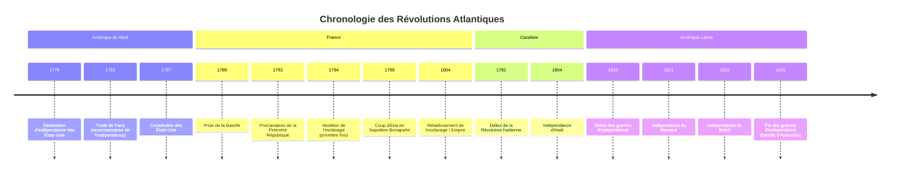

## Introduction : Contexte et enjeux de l'ère des révolutions
La fin du XVIIIe siècle et le début du XIXe siècle marquent une période charnière dans l'histoire mondiale, souvent désignée comme l'« ère des révolutions » (Hobsbawm, 1962). Ce cours se propose d'explorer les profondes transformations qui ont secoué l'espace atlantique – englobant l'Europe occidentale et les Amériques – entre environ 1770 et 1830. Il s'agit d'une période de ruptures majeures, où les structures politiques, sociales et économiques héritées de l'Ancien Régime sont remises en question, voire balayées, par des mouvements d'une ampleur inédite.

[[WIDGET:Mermaid:timeline_revolutions_atlantic]]
Chronologie indicative des principales révolutions atlantiques.

Au cœur de ces bouleversements se trouvent plusieurs concepts fondamentaux dont la signification est alors redéfinie. La [[WIDGET:ConceptLink:revolution:révolution]], au-delà d'un simple changement de régime, désigne désormais un processus radical de transformation politique et sociale, souvent violent, visant à refonder l'ordre existant sur de nouvelles bases idéologiques. L'idée de [[WIDGET:ConceptLink:nation:nation]] émerge comme une communauté politique et culturelle unie, détentrice de la légitimité du pouvoir, en opposition aux dynasties monarchiques. Cette nouvelle conception de la nation est intrinsèquement liée à celle de la [[WIDGET:ConceptLink:souverainete:souveraineté]], qui passe du monarque de droit divin au peuple ou à la nation elle-même. Enfin, la [[WIDGET:ConceptLink:citoyennete:citoyenneté]] se substitue progressivement au statut de sujet, conférant aux individus des droits et des devoirs au sein de la nouvelle entité politique, et impliquant une participation, même limitée, à la vie publique.

| Caractéristique | Ancien Régime (avant 1770) | Ère des Révolutions (1770-1830) |
| :-------------- | :-------------------------- | :------------------------------ |
| **Source de la légitimité** | Droit divin du monarque | Souveraineté du peuple/nation |
| **Structure sociale** | Sociétés d'ordres (clergé, noblesse, tiers état) avec privilèges | Idéal d'égalité juridique, fin des privilèges, émergence de classes sociales |
| **Forme de gouvernement** | Monarchie absolue ou tempérée | Républiques, monarchies constitutionnelles |
| **Statut des individus** | Sujets du roi | Citoyens avec droits et devoirs |
| **Économie** | Mercantilisme, corporatisme, agriculture dominante | Libéralisme économique, début de l'industrialisation |

[[WIDGET:Image:map_atlantic_revolutions]]
Carte de l'espace atlantique au tournant des XVIIIe et XIXe siècles, mettant en évidence les foyers révolutionnaires.

La problématique générale de ce cours sera d'analyser comment ces révolutions atlantiques ont profondément transformé les sociétés et les systèmes politiques de leur temps, donnant naissance à de nouvelles nations et redéfinissant durablement les rapports de pouvoir, tant à l'intérieur des États qu'entre eux. Comment ces idéaux de liberté et d'égalité ont-ils été mis en œuvre, et avec quelles limites ? Quelles furent les conséquences à long terme de cette ère de bouleversements sur la construction de l'État moderne et l'émergence d'une nouvelle géopolitique mondiale ?
## Les racines des bouleversements : Idées, crises et contestations
L'émergence de ces mouvements révolutionnaires n'est pas le fruit du hasard, mais la convergence de causes profondes, intellectuelles, économiques, sociales et politiques, qui ont sapé les fondements de l'[[WIDGET:Glossary:ancien_regime:Ancien Régime]].

L'héritage des ] constitue le terreau intellectuel de ces révolutions. Au XVIIIe siècle, des philosophes comme John Locke, Jean-Jacques Rousseau ou Montesquieu diffusent des idées nouvelles qui remettent en question l'absolutisme monarchique et les privilèges. Ils prônent la liberté individuelle, l'égalité des droits, la séparation des pouvoirs, la tolérance religieuse et la souveraineté du peuple. Ces concepts, largement diffusés par les livres, les salons et les gazettes, nourrissent une critique grandissante des institutions en place et offrent un cadre théorique aux aspirations réformatrices, puis révolutionnaires (Rémond, 1974-1977).

[[WIDGET:Biography:rousseau]]

| Penseur des Lumières | Idées Clés | Impact sur les Révolutions |
| :------------------ | :-------- | :------------------------ |
| **John Locke** | Droits naturels (vie, liberté, propriété), contrat social, droit de résistance à l'oppression | Influence majeure sur la Déclaration d'Indépendance américaine et les principes libéraux |
| **Montesquieu** | Séparation des pouvoirs (législatif, exécutif, judiciaire), équilibre des forces | Fondement des constitutions modernes, notamment américaine et française |
| **Jean-Jacques Rousseau** | Souveraineté populaire, volonté générale, égalité civile, contrat social | Inspiration pour la démocratie directe et la notion de nation souveraine |
| **Voltaire** | Tolérance religieuse, liberté d'expression, critique de l'absolutisme et de l'Église | Combat pour les libertés fondamentales, influence sur les droits de l'homme |

Parallèlement, les sociétés de l'époque sont traversées par de graves crises économiques et sociales. Les famines sont récurrentes, les prix des denrées alimentaires augmentent, et les inégalités sont criantes. La majeure partie de la population, notamment les paysans et les ouvriers urbains, vit dans la pauvreté, tandis que la noblesse et le clergé jouissent de privilèges fiscaux et sociaux exorbitants. Cette situation génère un profond ressentiment et une frustration croissante, particulièrement en France où la pression fiscale est lourde et inégalement répartie.

[[WIDGET:Image:ancien_regime_inegalites]]
Représentation allégorique des inégalités sociales sous l'Ancien Régime.

Enfin, les tensions politiques et fiscales sont exacerbées dans les empires coloniaux et les monarchies européennes. Au sein des colonies britanniques d'Amérique, la politique fiscale de Londres, perçue comme arbitraire (« no taxation without representation »), conduit à une rupture et à la Guerre d'Indépendance. En France, les dépenses excessives de la monarchie, notamment pour soutenir la guerre d'indépendance américaine, creusent un déficit abyssal. Les tentatives de réforme fiscale se heurtent à l'opposition des corps privilégiés, paralysant l'État et alimentant la contestation. Ces prémices de contestations, d'abord isolées, se transforment progressivement en mouvements collectifs, préparant le terrain aux explosions révolutionnaires.

[[WIDGET:Quiz:causes_revolutions]]

## La Révolution américaine : Un modèle républicain et ses limites

La Révolution américaine, souvent perçue comme le prélude aux grandes transformations politiques de la fin du XVIIIe siècle, est née d'un conflit entre les treize colonies britanniques d'Amérique du Nord et leur métropole. Les causes profondes résident dans la volonté de Londres d'accroître son contrôle et ses revenus sur les colonies après la guerre de Sept Ans (1756-1763), notamment par des taxes jugées illégitimes par les colons, qui n'étaient pas représentés au Parlement britannique. Le slogan « *No taxation without representation* » (pas d'impôts sans représentation) cristallise ce sentiment d'injustice, menant à des événements emblématiques comme le *Boston Tea Party* en 1773.

[[WIDGET:Mermaid:timeline_rev_americaine]]
Chronologie simplifiée des événements majeurs de la Révolution américaine.

Le conflit armé éclate en 1775. Malgré l'infériorité militaire initiale, les colons, menés par ], bénéficient du soutien crucial de la France, désireuse de prendre sa revanche sur la Grande-Bretagne. Le 4 juillet 1776, le Congrès continental adopte la ], rédigée principalement par Thomas Jefferson. Ce texte fondateur proclame des principes universels inspirés des Lumières : le droit à la vie, à la liberté et à la recherche du bonheur, ainsi que le droit des peuples à disposer d'eux-mêmes et à renverser un gouvernement tyrannique.

[[WIDGET:Image:declaration_independance]]
Représentation de la signature de la Déclaration d'indépendance des États-Unis.

Après la victoire décisive de Yorktown en 1781 et la signature du traité de Paris en 1783, les États-Unis d'Amérique deviennent la première ] indépendante. La Constitution de 1787 établit un système fédéral, avec une séparation stricte des pouvoirs (exécutif, législatif, judiciaire) et un équilibre entre les États et le gouvernement central. Ce modèle républicain, fondé sur la souveraineté populaire et les droits individuels, constitue une rupture majeure avec les monarchies européennes et devient une source d'inspiration pour de nombreux mouvements révolutionnaires à travers le monde <a href="#ref-1">[1]</a>.

Cependant, ce modèle républicain naissant est marqué par des limites et des contradictions profondes. L'[[WIDGET:Glossary:esclavage:esclavage]] des populations africaines, bien que dénoncé par certains Pères fondateurs, est maintenu et inscrit dans la Constitution, reflétant les intérêts économiques des États du Sud. Des millions d'individus sont ainsi privés des droits et libertés proclamés par la Déclaration d'indépendance. De même, les droits des Amérindiens sont largement ignorés ; la fondation de la nation américaine s'accompagne d'une expansion territoriale qui se fait au détriment des populations autochtones, souvent par la violence et la spoliation de leurs terres <a href="#ref-4">[4]</a>. Ces exclusions fondamentales révèlent les tensions inhérentes à la construction d'une nation fondée sur des idéaux de liberté tout en perpétuant des injustices systémiques.

[[WIDGET:Biography:george_washington]]

## La Révolution française et l'onde de choc napoléonienne

La Révolution française, débutant en 1789, représente une transformation politique et sociale d'une ampleur sans précédent en Europe, dont les échos se feront sentir pendant des décennies <a href="#ref-1">[1]</a>. Face à une crise financière et sociale aiguë, ] convoque les États généraux en mai 1789. Rapidement, les députés du ], rejoints par certains membres du clergé et de la noblesse, se proclament Assemblée nationale et prêtent le serment du Jeu de Paume, s'engageant à rédiger une Constitution.

[[WIDGET:Image:prise_bastille]]
La prise de la Bastille le 14 juillet 1789, événement symbolique du début de la Révolution française.

La prise de la Bastille le 14 juillet 1789 marque le début de la révolte populaire. En août, l'Assemblée nationale abolit les privilèges féodaux et adopte la [[WIDGET:ConceptLink:declaration_droits_homme:Déclaration des Droits de l'Homme et du Citoyen]] (DDHC), un texte universel qui proclame l'égalité de tous devant la loi, la liberté d'expression, la souveraineté de la nation et la séparation des pouvoirs.

[[WIDGET:Audio:declaration_droits]]
Extrait audio de la Déclaration des Droits de l'Homme et du Citoyen de 1789.

La Révolution traverse ensuite plusieurs phases de radicalisation. Après une période de monarchie constitutionnelle (1789-1792), la chute de la monarchie en 1792 conduit à la proclamation de la Première République. La Convention nationale, dominée par les Montagnards, instaure la [[WIDGET:ConceptLink:terreur:Terreur]] (1793-1794), une période de répression politique intense sous la houlette de figures comme [[WIDGET:RealPerson:robespierre:Maximilien de Robespierre]], visant à défendre la Révolution contre ses ennemis intérieurs et extérieurs. L'abolition de l'esclavage dans les colonies en 1794 témoigne de cette radicalisation des principes révolutionnaires.

[[WIDGET:Biography:robespierre]]

Après la chute de Robespierre en 1794, le Directoire (1795-1799) tente de stabiliser la situation, mais est marqué par l'instabilité politique et les difficultés économiques. C'est dans ce contexte qu'émerge ], qui prend le pouvoir par le coup d'État du 18 Brumaire (9 novembre 1799), instaurant le Consulat.

[[WIDGET:Biography:napoleon]]

Sous le Consulat puis l'Empire (1804-1815), Napoléon consolide et diffuse les acquis de la Révolution tout en établissant un régime autoritaire. Le [[WIDGET:Glossary:code_civil:Code Civil]] (1804), par exemple, systématise le droit de propriété, l'égalité civile et la laïcité de l'État, influençant durablement les législations européennes. Les guerres napoléoniennes, bien que destructrices, contribuent à l'expansion des idées révolutionnaires (liberté, égalité, nationalisme) à travers l'Europe, ébranlant les vieilles monarchies et stimulant des mouvements nationaux et libéraux. Cependant, cette expansion suscite également de fortes résistances, notamment en Espagne et en Russie, où l'occupation française alimente un sentiment national anti-français, posant les jalons des futurs mouvements nationalistes du XIXe siècle <a href="#ref-1">[1]</a>.

[[WIDGET:Video:revolution_francaise]]

## L'émergence des nations et les autres révolutions atlantiques
Les répercussions des révolutions américaine et française ne se limitent pas à l'Europe ou à l'Amérique du Nord. Elles se propagent à travers l'espace atlantique, inspirant d'autres mouvements de libération et de construction nationale, souvent dans des contextes sociaux et raciaux bien plus complexes.

Un cas emblématique est celui de la Révolution haïtienne (1791-1804), qui représente un tournant majeur dans l'histoire mondiale. Unique en son genre, elle est la seule révolte d'esclaves couronnée de succès, aboutissant à la création d'un État indépendant. Dans la colonie française de Saint-Domingue, la plus riche des Caraïbes, les idéaux de liberté et d'égalité de la Révolution française résonnent avec une force particulière parmi la population asservie. Sous la direction de figures charismatiques comme [[WIDGET:RealPerson:toussaint_louverture:Toussaint Louverture]], les esclaves se soulèvent en 1791, luttant non seulement pour l'indépendance mais aussi et surtout pour l'abolition de l'esclavage, un principe que la France révolutionnaire avait elle-même proclamé en 1794 avant de le rétablir sous [[WIDGET:RealPerson:napoleon_bonaparte:Napoléon]]. La victoire haïtienne en 1804, face aux armées coloniales françaises, espagnoles et britanniques, est une affirmation radicale de l'universalisme des droits humains, étendant la [[WIDGET:ConceptLink:citoyennete:citoyenneté]] et la liberté à tous, sans distinction de couleur ou de statut social.

[[WIDGET:Biography:toussaint_louverture]]

[[WIDGET:Image:haitian_revolution]]
La bataille de Vertières, dernière confrontation majeure de la Révolution haïtienne en 1803, symbolisant la victoire des esclaves révoltés.

Parallèlement, le début du XIXe siècle voit l'émergence de vastes mouvements d'indépendance en Amérique latine. L'affaiblissement de l'Espagne, occupée par les troupes napoléoniennes, crée un vide de pouvoir propice à l'éclosion des aspirations autonomistes des créoles, descendants d'Européens nés sur le continent américain. Inspirés par les Lumières et les exemples américain et français, des leaders comme [[WIDGET:RealPerson:simon_bolivar:Simón Bolívar]] au nord et [[WIDGET:RealPerson:jose_de_san_martin:José de San Martín]] au sud mènent des campagnes militaires épiques pour libérer les vice-royautés espagnoles. Entre 1810 et 1825, une mosaïque de nouvelles républiques voit le jour, de la Grande Colombie à l'Argentine, en passant par le Mexique et le Pérou.

[[WIDGET:Biography:simon_bolivar]]

Ces processus de construction nationale partagent des points communs, notamment l'affirmation de la [[WIDGET:ConceptLink:souverainete_nationale:souveraineté nationale]] et l'adoption de constitutions républicaines. Cependant, ils présentent aussi des spécificités marquées. La Révolution haïtienne se distingue par sa dimension profondément sociale et raciale, remettant en cause l'ordre colonial et esclavagiste dans ses fondements mêmes. En Amérique latine, si l'indépendance politique est acquise, les structures sociales héritées de la colonisation, notamment la domination des élites créoles et la persistance de l'exploitation des populations indigènes et métisses, sont souvent maintenues, voire renforcées. La fragmentation politique et les conflits internes qui suivent les indépendances témoignent des défis inhérents à la construction de nations stables et inclusives dans cette région. Ces révolutions atlantiques, bien qu'interconnectées par la circulation des idées et des événements, ont ainsi produit des trajectoires et des héritages distincts, façonnant durablement la géopolitique mondiale.

[[WIDGET:Mermaid:timeline_atlantic_revolutions]]

Chronologie des événements majeurs des révolutions atlantiques, mettant en lumière leurs simultanéités et décalages.

[[WIDGET:Quiz:atlantic_revolutions]]

## Conclusion
La période des révolutions atlantiques, s'étendant de la fin du XVIIIe au début du XIXe siècle, marque une rupture fondamentale avec l'[[WIDGET:ConceptLink:ancien_regime:Ancien Régime]] et jette les bases du monde contemporain. Ses apports majeurs sont indéniables : elle a consacré l'affirmation des principes de [[WIDGET:ConceptLink:souverainete_nationale:souveraineté nationale]] et de [[WIDGET:ConceptLink:citoyennete:citoyenneté]], déplaçant le pouvoir du monarque vers la nation et l'individu. La naissance de nouvelles entités étatiques, des États-Unis aux républiques latino-américaines en passant par Haïti, a remodelé la carte politique mondiale et popularisé l'idée de l'État-nation comme forme d'organisation politique légitime. Ces révolutions ont également diffusé des idéaux de liberté, d'égalité et de droits de l'homme, qui, malgré leurs limites initiales, ont continué à inspirer les mouvements sociaux et politiques des siècles suivants.

Cependant, l'héritage de ces révolutions est aussi profondément contradictoire. L'universalisme proclamé par la Déclaration des Droits de l'Homme et du Citoyen s'est souvent heurté à des exclusions flagrantes, notamment envers les femmes, les populations colonisées et les esclaves, dont la liberté n'a été acquise qu'au prix de luttes acharnées et sanglantes, comme en Haïti. Les idéaux de liberté ont été indissociables de périodes de violence intense, de guerres civiles et de conflits internationaux, soulignant la tension constante entre les aspirations démocratiques et les réalités du pouvoir. Ces contradictions, entre les promesses d'un monde nouveau et les persistances des inégalités, entre l'affirmation des droits et la brutalité des moyens, continuent de façonner les débats sur la démocratie, la justice sociale et l'identité nationale, témoignant de la portée durable de cette ère révolutionnaire sur l'histoire politique mondiale.

[[WIDGET:conclusionSummary]]
[[WIDGET:whatsNext]]
[[WIDGET:goingFurther]]
[[WIDGET:finalEvaluation]]
