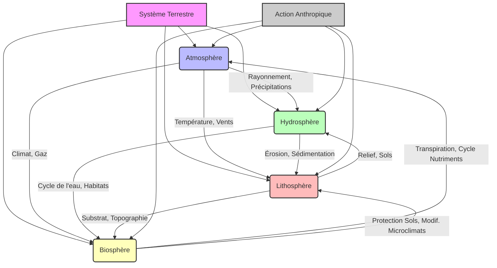
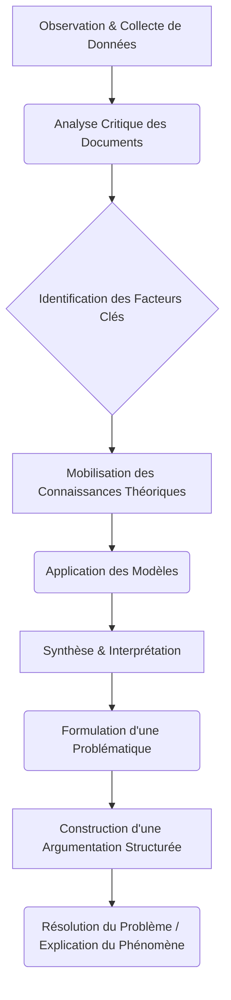

## Introduction à l'Évaluation Terminale

L'évaluation terminale du cours de Géographie physique et climatologie constitue une étape cruciale de votre parcours en Licence 3. Son objectif principal est de mesurer votre capacité à synthétiser et à appliquer les connaissances acquises tout au long du semestre, mais aussi à démontrer une compréhension approfondie des mécanismes et des interrelations qui façonnent notre environnement terrestre. Loin d'être une simple restitution de faits, cet examen vise à évaluer votre esprit critique, votre aptitude à l'analyse spatiale et temporelle, ainsi que votre maîtrise des concepts fondamentaux de la discipline.

Cette évaluation revêt une importance capitale pour plusieurs raisons. Premièrement, elle représente la culmination de vos apprentissages en géographie physique et climatologie, consolidant les bases nécessaires à la poursuite d'études en Master ou à l'intégration dans des parcours professionnels exigeant une expertise environnementale. Deuxièmement, elle vous prépare aux exigences méthodologiques et rédactionnelles des examens universitaires de haut niveau. Enfin, la réussite de cette épreuve atteste de votre capacité à appréhender la complexité des systèmes naturels et des enjeux environnementaux contemporains, compétences essentielles pour tout géographe.

Le format général de l'examen sera le suivant :
*   **Durée :** L'épreuve s'étendra sur une période de trois (3) heures.
*   **Types de questions :** L'examen combinera plusieurs types de questions pour évaluer différentes facettes de vos compétences :
    *   **Questions de synthèse (dissertation) :** Une question principale nécessitant une argumentation structurée, l'intégration de concepts variés et la mobilisation d'exemples pertinents.
    *   **Questions à réponses courtes :** Des questions ciblées pour vérifier la maîtrise de définitions, de mécanismes spécifiques ou de classifications.
    *   **Analyse de documents :** Il pourra s'agir d'une carte topographique, d'un profil en long, d'un diagramme climatique (climogramme), d'une image satellite, ou d'un texte scientifique, nécessitant une interprétation et une analyse critique.
    *   **Schémas ou croquis :** La réalisation de schémas explicatifs ou de croquis de synthèse pour illustrer des processus ou des organisations spatiales.
*   **Barème :** La répartition des points sera clairement indiquée sur le sujet. Généralement, la question de synthèse aura le poids le plus important, reflétant l'exigence de démonstration d'une compréhension globale et intégrée du cours.

Cette évaluation terminale est conçue pour synthétiser l'ensemble des apprentissages du cours de Géographie physique et climatologie. Elle vous demandera de tisser des liens entre les différentes composantes de la Terre – l'atmosphère, l'hydrosphère, la lithosphère et la biosphère – et de comprendre comment elles interagissent pour former des paysages et des climats variés. Il ne s'agit pas d'une simple juxtaposition de connaissances, mais bien d'une démonstration de votre capacité à adopter une [[WIDGET:ConceptLink:approche_systemique:approche systémique]] face aux phénomènes géographiques et environnementaux.

## Rappel des Concepts Fondamentaux et Thématiques Clés
Le cours de Géographie physique et climatologie a exploré les dynamiques complexes qui façonnent la surface de notre planète et son enveloppe gazeuse. L'évaluation terminale portera sur les grandes thématiques et les concepts essentiels abordés, en insistant sur les interconnexions entre ces notions pour une compréhension holistique et systémique.

### Géographie physique : Les Fondements de la Terre Solide et Liquide

La géographie physique se concentre sur l'étude des processus naturels qui modèlent le relief, l'hydrosphère et la biosphère.

*   **Géomorphologie : L'Architecture de la Terre**
    La géomorphologie est la science qui étudie les formes du relief terrestre et les processus qui les créent, les modifient et les détruisent <a href="#ref-3">[3]</a>, <a href="#ref-5">[5]</a>. Vous devrez maîtriser :
    *   **Les processus endogènes :** La tectonique des plaques (subduction, divergence, collision), le volcanisme et les séismes, responsables de la création des grandes structures du relief (chaînes de montagnes, fosses océaniques, rifts).
    *   **Les processus exogènes :** L'altération (physique, chimique, biologique) et l'érosion (fluviale, glaciaire, éolienne, marine). Comprendre comment ces agents sculptent les paysages, créent des vallées, des deltas, des dunes ou des falaises.
    *   **Les formes de relief :** Identification et explication de la genèse des principaux types de reliefs (montagnes, plateaux, plaines, littoraux, karsts).
    *   **La dynamique fluviale :** Le cycle d'érosion fluviale, les profils en long, les méandres, les terrasses alluviales, les deltas.
    *   **La dynamique glaciaire :** La formation des glaciers, l'érosion et l'accumulation glaciaires (cirques, vallées en U, moraines).

*   **Hydrologie : Le Cycle de l'Eau et ses Manifestations**
    L'hydrologie étudie la distribution, la circulation et les propriétés de l'eau sur Terre. Les concepts clés incluent :
    *   **Le cycle de l'eau :** Comprendre les étapes (évaporation, condensation, précipitations, ruissellement, infiltration, transpiration) et les réservoirs (océans, atmosphère, glaciers, eaux souterraines, lacs, rivières).
    *   **Les bassins versants :** Définition, délimitation et rôle dans l'organisation des réseaux hydrographiques.
    *   **Les régimes hydrologiques :** L'influence des facteurs climatiques et géomorphologiques sur le débit des cours d'eau.
    *   **Les eaux souterraines :** Aquifères, nappes phréatiques, leur rôle et leur vulnérabilité.
    *   **Les zones humides :** Leur importance écologique et hydrologique.

[[WIDGET:Image:cycle_eau_global]]
*Légende : Représentation schématique du cycle global de l'eau, illustrant les principaux réservoirs et flux entre l'atmosphère, les continents et les océans.*

*   **Biogéographie : La Vie et ses Milieux**
    La biogéographie examine la répartition des espèces et des écosystèmes à la surface du globe, ainsi que les facteurs qui l'influencent <a href="#ref-2">[2]</a>.
    *   **Les facteurs de répartition :** L'influence du climat (température, précipitations), du sol (édaphisme), du relief et de l'action anthropique sur la distribution de la flore et de la faune.
    *   **Les biomes terrestres et aquatiques :** Caractérisation des grandes zones biogéographiques (forêts tropicales, déserts, toundras, prairies, écosystèmes marins et d'eau douce).
    *   **La biodiversité :** Ses enjeux, les menaces (déforestation, changement climatique, pollution) et les stratégies de conservation.

### Climatologie : L'Enveloppe Atmosphérique et ses Variations

La climatologie est l'étude des climats, de leurs mécanismes, de leur répartition et de leurs évolutions.

*   **Dynamique Atmosphérique : Le Moteur du Climat**
    *   **Composition et structure de l'atmosphère :** Les différentes couches (troposphère, stratosphère, etc.) et leur rôle.
    *   **Bilan énergétique terrestre :** Le rayonnement solaire, l'albédo, l'effet de serre naturel et son rôle fondamental pour la vie.
    *   **Circulation générale atmosphérique :** Les cellules de Hadley, Ferrel et polaires, les courants-jets, les hautes et basses pressions. Comprendre comment ces mécanismes distribuent la chaleur et l'humidité à l'échelle planétaire <a href="#ref-1">[1]</a>, <a href="#ref-4">[4]</a>.
    *   **Masses d'air et fronts :** Leur formation, leurs caractéristiques et leur rôle dans la météorologie des régions tempérées.
    *   **Phénomènes météorologiques extrêmes :** Cyclones tropicaux, tornades, vagues de chaleur, inondations.

*   **Les Climats du Monde : Diversité et Classification**
    *   **Facteurs des climats :** Latitude, altitude, continentalité, courants marins, exposition.
    *   **Classifications climatiques :** Maîtrise des principes de la classification de [[WIDGET:RealPerson:koppen:Wladimir Köppen]] et des grands types de climats qu'elle identifie (climats tropicaux, arides, tempérés, froids, polaires).
    *   **Caractéristiques régionales :** Description des principaux climats (équatorial, désertique, méditerranéen, continental, océanique, montagnard, polaire) et de leurs spécificités.

*   **Changements Climatiques : Enjeux et Perspectives**
    *   **Causes naturelles et anthropiques :** Les variations orbitales, l'activité solaire, le volcanisme versus les émissions de gaz à effet de serre d'origine humaine.
    *   **L'effet de serre anthropique :** Les principaux gaz à effet de serre (CO2, CH4, N2O) et leurs sources.
    *   **Conséquences des changements climatiques :** Élévation du niveau marin, acidification des océans, intensification des événements météorologiques extrêmes, impact sur la biodiversité et les écosystèmes, sécurité alimentaire et migrations <a href="#ref-6">[6]</a>.
    *   **Le rôle du [[WIDGET:ConceptLink:giec:GIEC]] :** Comprendre le rôle de cette organisation dans l'évaluation scientifique du changement climatique.

### Interconnexions et Approche Systémique

Un aspect fondamental de cette évaluation sera votre capacité à démontrer les interconnexions entre ces différentes composantes. Par exemple :
*   Comment le climat influence-t-il les processus géomorphologiques (érosion glaciaire, éolienne) et la répartition de la végétation (biomes) ?
*   Comment la géomorphologie (relief, bassins versants) conditionne-t-elle l'hydrologie et les régimes fluviaux ?
*   Comment les changements climatiques impactent-ils l'hydrologie (fonte des glaciers, sécheresses) et la biogéographie (déplacement des aires de répartition, extinctions) ?
*   L'action humaine, en modifiant les paysages (déforestation, urbanisation) ou en altérant le climat, a des répercussions en cascade sur l'ensemble de ces systèmes.

[[WIDGET:Mermaid:interconnexions_geo_clim]]

*Légende : Diagramme conceptuel illustrant les interconnexions fondamentales entre les sphères du système terrestre (Atmosphère, Hydrosphère, Lithosphère, Biosphère) et l'influence de l'action anthropique.*

[[WIDGET:Quiz:concepts_fondamentaux_quiz]]

## Méthodologie d'Analyse et de Résolution de Problèmes

L'évaluation terminale de ce cours de Géographie physique et climatologie ne se limite pas à la restitution de connaissances. Elle vise avant tout à mesurer votre capacité à mobiliser et à intégrer un ensemble de compétences analytiques et critiques essentielles à la démarche scientifique en géographie. La complexité des systèmes terrestres et climatiques exige une approche rigoureuse, capable de déconstruire les phénomènes, d'en identifier les facteurs et d'en comprendre les dynamiques.

### Compétences d'Analyse Critique de Documents

Une part significative de l'évaluation portera sur votre aptitude à analyser de manière critique une diversité de documents géographiques et climatiques. Cette compétence est fondamentale pour tout géographe et climatologue.

1.  **Analyse de Cartes :**
    *   **Cartes topographiques et géologiques :** Lecture et interprétation des formes de relief, des réseaux hydrographiques, des structures géologiques. Identification des processus géomorphologiques (érosion, sédimentation, tectonique) à l'œuvre. Compréhension des échelles et des projections cartographiques.
    *   **Cartes climatiques :** Interprétation des classifications climatiques (par exemple, la classification de [[WIDGET:RealPerson:koppen:Wladimir Köppen]]) <a href="#ref-4">[4]</a>, des isohyètes, des isothermes, des zones de pression. Déduction des régimes de vents dominants, des zones d'influence océanique ou continentale.
    *   **Cartes thématiques :** Analyse de la répartition spatiale de phénomènes spécifiques (végétation, sols, risques naturels, impact anthropique).
    *   **Critique des sources :** Évaluation de la fiabilité, de la date de production, de la méthodologie de collecte des données et des biais potentiels des cartes.

2.  **Analyse de Graphiques et de Données :**
    *   **Séries chronologiques :** Interprétation de l'évolution temporelle de variables climatiques (température, précipitations, concentration de CO2 atmosphérique <a href="#ref-6">[6]</a>), hydrologiques (débits fluviaux) ou géomorphologiques (taux d'érosion). Identification des tendances, des cycles, des ruptures et des anomalies.
    *   **Diagrammes climatiques (ombrothermiques) :** Lecture des régimes thermiques et pluviométriques, détermination des saisons sèches et humides, caractérisation des types de climats.
    *   **Profils topographiques et coupes géologiques :** Analyse des pentes, des altitudes, des successions de couches géologiques et de leur relation avec les processus de surface.
    *   **Données satellitaires et télédétection :** Compréhension des principes de la [[WIDGET:Glossary:teledetection:Télédétection]] pour l'étude des surfaces terrestres, de la couverture végétale, de l'évolution des glaciers ou des zones urbaines.
    *   **Tableaux statistiques :** Extraction et interprétation de données brutes, calcul de moyennes, d'écarts-types, identification de corrélations.

3.  **Analyse de Textes Scientifiques :**
*   Lecture critique d'extraits d'articles scientifiques, de rapports (par exemple, ceux du ]) ou d'ouvrages de référence <a href="#ref-1">[1]</a>, <a href="#ref-2">[2]</a>.
    *   Identification des arguments principaux, des hypothèses, des méthodologies employées et des conclusions.
    *   Capacité à synthétiser des idées complexes et à en évaluer la pertinence dans un contexte donné.

[[WIDGET:Image:carte_koppen_exemple]]
*Légende : Exemple de carte de classification climatique de Köppen, un document clé pour l'analyse des régimes climatiques mondiaux.*

## Conclusion
Au-delà de l'analyse individuelle des documents, l'évaluation exigera une capacité à synthétiser des informations provenant de sources multiples et hétérogènes. Il s'agit de construire une compréhension cohérente et structurée d'une problématique donnée.

*   **Hiérarchisation et organisation :** Distinguer l'essentiel de l'accessoire, organiser les informations de manière logique et thématique.
*   **Établissement de liens :** Mettre en évidence les interrelations entre les différents facteurs (climatiques, géomorphologiques, hydrologiques, biogéographiques) et processus.
*   **Formulation d'une problématique :** Définir clairement l'enjeu central de l'étude de cas et les questions auxquelles il faut répondre.
*   **Construction d'un plan structuré :** Élaborer une argumentation claire et progressive, avec une introduction, des parties thématiques et une conclusion.

### Application de Modèles Théoriques pour la Résolution de Problèmes

La géographie physique et la climatologie s'appuient sur un corpus de modèles théoriques qui permettent d'expliquer et de prédire les phénomènes naturels. L'évaluation testera votre aptitude à mobiliser ces modèles pour analyser des situations concrètes.

*   **Modèles climatiques :** Application des principes de la circulation atmosphérique générale (cellules de Hadley, Ferrel, polaire), de l'effet de serre, des bilans énergétiques et hydriques pour comprendre la distribution des climats et leurs variations <a href="#ref-1">[1]</a>, <a href="#ref-4">[4]</a>.
*   **Modèles géomorphologiques :** Utilisation des concepts de l'équilibre dynamique des versants, des cycles d'érosion (par exemple, le cycle de l'érosion de ]), des processus fluviaux, glaciaires, éoliens ou littoraux pour interpréter la formation et l'évolution des paysages <a href="#ref-3">[3]</a>, <a href="#ref-5">[5]</a>.
*   **Modèles hydrologiques :** Compréhension du cycle de l'eau, des bilans hydrologiques, des régimes fluviaux et de l'influence du climat et de la géomorphologie sur les ressources en eau.
*   **Modèles biogéographiques :** Application des principes de la répartition des biomes en fonction du climat et des facteurs édaphiques, et de l'impact des changements environnementaux sur la biodiversité.

L'objectif est de ne pas simplement réciter ces modèles, mais de les utiliser comme des grilles de lecture pour interpréter des observations, expliquer des dynamiques et anticiper des évolutions.

[[WIDGET:Mermaid:methodologie_analyse_flux]]

    style A fill:#D4E6F1,stroke:#3498DB,stroke-width:2px
    style B fill:#D4E6F1,stroke:#3498DB,stroke-width:2px
    style C fill:#FADBD8,stroke:#E74C3C,stroke-width:2px
    style D fill:#D4E6F1,stroke:#3498DB,stroke-width:2px
    style E fill:#D4E6F1,stroke:#3498DB,stroke-width:2px
    style F fill:#FADBD8,stroke:#E74C3C,stroke-width:2px
    style G fill:#FADBD8,stroke:#E74C3C,stroke-width:2px
    style H fill:#D4E6F1,stroke:#3498DB,stroke-width:2px
    style I fill:#D1F2EB,stroke:#2ECC71,stroke-width:2px

*Légende : Diagramme de flux illustrant la méthodologie d'analyse et de résolution de problèmes attendue, depuis l'observation jusqu'à l'explication structurée.*

### Méthodes d'Argumentation Attendues

La qualité de votre argumentation sera un critère majeur d'évaluation. Une bonne argumentation en géographie physique et climatologie doit être :

*   **Claire et précise :** Utilisation d'un vocabulaire scientifique approprié et rigoureux. Chaque terme technique doit être employé à bon escient.
*   **Logique et cohérente :** Les idées doivent s'enchaîner de manière fluide, les liens de cause à effet doivent être clairement établis. Évitez les sauts logiques ou les affirmations non étayées.
*   **Fondée sur des preuves :** Chaque affirmation doit être justifiée par des éléments concrets tirés des documents analysés (données chiffrées, observations cartographiques, extraits textuels) ou par des références aux modèles théoriques et aux connaissances acquises <a href="#ref-2">[2]</a>.
*   **Structurée :** Une introduction présentant la problématique et le plan, un développement organisé en paragraphes thématiques (une idée par paragraphe, étayée par des preuves), et une conclusion synthétisant les résultats et ouvrant sur des perspectives.
*   **Nuancée :** Reconnaître la complexité des phénomènes, les incertitudes des modèles, les limites des données. Éviter les généralisations abusives et les jugements de valeur.
*   **Référencée :** Intégrer les concepts et les théories des auteurs clés du domaine, tels que [[WIDGET:RealPerson:tricart:Jean Tricart]] pour la géomorphologie <a href="#ref-3">[3]</a> ou [[WIDGET:RealPerson:strahler:Arthur N. Strahler]] pour la géographie physique <a href="#ref-2">[2]</a>.

[[WIDGET:Quiz:analyse_documents_quiz]]

## Scénarios d'Application et Études de Cas Complexes

L'évaluation terminale mettra en scène vos connaissances et compétences à travers des études de cas concrètes ou des scénarios problématiques. Ces exercices sont conçus pour simuler des situations réelles auxquelles un géographe ou un climatologue pourrait être confronté. Ils exigent une approche intégrative, où la simple restitution de faits ne suffit pas ; il s'agit de comprendre, d'expliquer et d'analyser des situations complexes en mobilisant l'ensemble des outils conceptuels et méthodologiques du cours.

### Nature des Études de Cas

Les études de cas proposées couvriront un large éventail de problématiques en géographie physique et climatologie, souvent à l'interface entre plusieurs sous-disciplines. Elles pourront porter sur :

*   **Les impacts du changement climatique :** Analyse des conséquences de l'élévation des températures, de la modification des régimes de précipitations, de la fonte des glaciers ou de l'élévation du niveau marin sur des régions spécifiques (par exemple, les zones côtières, les régions arctiques, les zones arides). Il s'agira d'intégrer les données du [[WIDGET:ConceptLink:giec:GIEC]] <a href="#ref-6">[6]</a> et les modèles de rétroaction climatique [[WIDGET:Glossary:retroaction_climatique:Rétroaction climatique]].
*   **Les risques naturels :** Étude de phénomènes tels que les inondations, les sécheresses, les glissements de terrain, l'érosion côtière, les tempêtes ou les vagues de chaleur. L'analyse portera sur les facteurs déclenchants (climatiques, géomorphologiques), les vulnérabilités des territoires et les stratégies d'adaptation.
*   **La dynamique des paysages :** Compréhension de l'évolution d'un paysage sous l'influence combinée des processus climatiques (altération, transport), géomorphologiques (érosion fluviale, glaciaire, éolienne) et anthropiques (déforestation, urbanisation). La [[WIDGET:ConceptLink:geomorphologie_climatique:Géomorphologie climatique]] sera un cadre d'analyse privilégié.
*   **La gestion des ressources :** Problématiques liées à l'eau (ressources en eau douce, gestion des bassins versants, impact des sécheresses), aux sols (érosion des sols, désertification) ou à la biodiversité (impact des changements climatiques sur les écosystèmes).

### Exemples de Scénarios Problématiques

Voici quelques exemples illustratifs de ce que vous pourriez rencontrer :

1.  **Analyse de la désertification au Sahel :** À partir de données climatiques (précipitations, températures), de cartes de l'évolution de la couverture végétale et d'images satellitaires, vous pourriez être amené à expliquer les processus de désertification, à identifier les facteurs naturels et anthropiques en jeu, et à discuter des stratégies d'adaptation des populations.
2.  **Impact de la fonte des glaciers sur les ressources en eau en montagne :** Un cas pourrait présenter des données sur l'évolution de la masse glaciaire dans une chaîne de montagnes, des débits fluviaux des rivières alimentées par ces glaciers, et des besoins en eau des populations en aval. L'objectif serait d'analyser les conséquences hydrologiques de la fonte glaciaire et de proposer des pistes pour la gestion future des ressources en eau.
3.  **Érosion côtière et élévation du niveau marin :** Une étude de cas pourrait fournir des cartes historiques de l'évolution du trait de côte, des données sur l'élévation du niveau marin et des informations sur les activités humaines dans une zone côtière. Vous devriez alors analyser les facteurs de l'érosion, évaluer les risques pour les infrastructures et les écosystèmes, et discuter des mesures de protection ou d'adaptation.

[[WIDGET:HistoricalAnecdote:paleoclimatologie_giacobini]]

### Compétences Mobilisées dans les Études de Cas

Ces scénarios exigent une intégration de toutes les compétences détaillées précédemment :

*   **Identification des facteurs clés :** Distinguer les causes profondes des symptômes, les facteurs directs des facteurs indirects.
*   **Analyse des interrelations :** Comprendre comment les différents composants du système terrestre (atmosphère, hydrosphère, lithosphère, biosphère) interagissent et s'influencent mutuellement dans la situation étudiée.
*   **Diagnostic de la situation :** Poser un diagnostic précis et argumenté du problème ou du phénomène.
*   **Explication des processus :** Détailler les mécanismes physiques et géographiques qui sont à l'œuvre.
*   **Analyse des impacts :** Évaluer les conséquences environnementales, sociales et économiques de la situation.
*   **Proposition de solutions ou de pistes de réflexion :** Formuler des recommandations ou des axes de recherche pertinents, basés sur une compréhension scientifique rigoureuse.

### Structure de la Réponse Attendue

Pour chaque étude de cas, une réponse structurée et argumentée est attendue, suivant généralement les étapes suivantes :

1.  **Introduction :** Présentation du contexte géographique et climatique de l'étude de cas, formulation claire de la problématique et annonce du plan d'analyse.
2.  **Analyse des données et des documents :** Exploitation critique de l'ensemble des documents fournis (cartes, graphiques, textes, images) pour extraire les informations pertinentes et les interpréter.
3.  **Explication des processus et des dynamiques :** Mobilisation des connaissances théoriques et des modèles pour expliquer les phénomènes observés. Par exemple, si l'on étudie une inondation, il faudra expliquer le régime hydrologique du cours d'eau, les facteurs météorologiques de l'événement, la géomorphologie du bassin versant et l'influence de l'aménagement humain.
4.  **Analyse des enjeux et des impacts :** Évaluation des conséquences environnementales (érosion, perte de biodiversité), socio-économiques (dommages aux infrastructures, impact sur l'agriculture) et humaines (déplacements de population, risques sanitaires).
5.  **Conclusion :** Synthèse des principaux résultats de l'analyse, réponse à la problématique initiale et ouverture sur des perspectives (gestion des risques, adaptation au changement climatique, recherches futures).

[[WIDGET:SolvedExercise:analyse_cas_desertification]]

### Consignes Finales et Critères d'Évaluation

L'examen terminal de Géographie physique et climatologie constitue une étape cruciale de votre parcours universitaire, visant à évaluer votre maîtrise des concepts fondamentaux, votre capacité d'analyse et de synthèse, ainsi que votre aptitude à mobiliser des connaissances pour résoudre des problématiques géographiques complexes. Cette épreuve n'est pas seulement une mesure de vos acquis, mais aussi une opportunité de démontrer votre pensée critique et votre rigueur scientifique. Pour aborder cet examen dans les meilleures conditions, il est impératif de comprendre précisément les consignes pratiques et les critères d'évaluation qui guideront la correction de vos copies.

#### Instructions Pratiques pour l'Examen

La réussite d'une épreuve ne dépend pas uniquement de la connaissance du cours, mais aussi de la bonne compréhension et application des règles formelles. Ces consignes sont établies pour garantir l'équité de l'évaluation et vous permettre de présenter votre travail de manière optimale.

**1. Matériel Autorisé et Interdit**

Afin d'assurer l'intégrité de l'évaluation et de tester vos connaissances et compétences intrinsèques, le matériel autorisé est strictement limité.

*   **Matériel Autorisé :**
    *   **Stylos :** Plusieurs stylos à encre bleue ou noire. L'utilisation de crayons de couleur est tolérée pour les schémas et croquis, à condition qu'ils soient clairs et ne masquent pas le texte.
    *   **Calculatrice non programmable :** Une calculatrice simple, sans capacité graphique ni de stockage de texte, est autorisée pour les éventuels calculs (par exemple, conversion d'unités, calculs de gradients, bilans énergétiques simplifiés). Les modèles scientifiques de base sont généralement acceptés. Il est de votre responsabilité de vérifier que votre modèle est conforme aux réglementations universitaires en vigueur.
    *   **Règle, équerre, compas :** Ces instruments sont essentiels pour la réalisation de schémas, de croquis ou de cartes, notamment dans le cadre des études de cas où la représentation spatiale peut être requise.
    *   **Montre simple :** Une montre analogique ou numérique sans fonctionnalités connectées (Bluetooth, Wi-Fi, etc.) est permise pour la gestion du temps. Les montres connectées (smartwatches) sont strictement interdites.
    *   **Bouteille d'eau transparente :** Sans étiquette, pour votre confort.

*   **Matériel Strictement Interdit :**
    *   **Téléphones portables, tablettes, ordinateurs portables et tout appareil électronique connecté :** Ces appareils doivent être éteints et rangés dans votre sac, qui sera déposé à l'endroit indiqué par les surveillants. Toute utilisation ou possession visible d'un tel appareil pendant l'épreuve sera considérée comme une tentative de fraude.
    *   **Documents :** Aucun document de cours, manuel, polycopié, feuille de notes, brouillon pré-rempli n'est autorisé. L'examen vise à évaluer vos connaissances mémorisées et votre capacité à les appliquer.
    *   **Montres connectées (smartwatches) :** Pour les raisons évoquées ci-dessus.
    *   **Correcteur liquide (Tipp-Ex) :** Son utilisation est fortement déconseillée car il peut rendre la copie illisible ou masquer des informations. Préférez barrer proprement une erreur.

**Conséquences de la Fraude :** Toute tentative de fraude ou de communication entre étudiants entraînera l'exclusion immédiate de l'épreuve et sera signalée aux autorités universitaires compétentes, pouvant mener à des sanctions disciplinaires sévères (annulation de l'épreuve, interdiction de passer des examens pour une durée déterminée, etc.). L'intégrité académique est une valeur fondamentale de l'enseignement supérieur.

**2. Gestion du Temps**

L'épreuve est conçue pour une durée limitée, nécessitant une gestion stratégique de votre temps. Une mauvaise répartition du temps est une cause fréquente d'échec, même pour les étudiants bien préparés.

*   **Durée de l'épreuve :** L'examen aura une durée de **3 heures**.
*   **Stratégie de répartition :**
    *   **Lecture attentive du sujet (15-20 minutes) :** Ne sous-estimez jamais cette étape. Lisez l'intégralité du sujet, y compris toutes les questions et les documents éventuels. Identifiez les mots-clés, les verbes d'action (analyser, expliquer, comparer, discuter), et les attentes spécifiques. Pour les études de cas, prenez le temps de parcourir tous les documents fournis.
    *   **Élaboration du plan détaillé et du brouillon (45-60 minutes) :** Pour chaque partie de l'examen (dissertation, étude de cas, questions de cours), consacrez un temps suffisant à la structuration de votre réponse. Un plan clair et logique est la colonne vertébrale de votre argumentation. Notez les idées principales, les exemples pertinents, les définitions clés et les références aux auteurs ou théories (par exemple, les travaux de [[WIDGET:RealPerson:stahler:Arthur N. Strahler]] sur la géographie physique <a href="#ref-2">[2]</a> ou ceux du [[WIDGET:RealPerson:giec:GIEC]] sur le changement climatique <a href="#ref-6">[6]</a>).
    *   **Rédaction (1h30 - 1h45) :** C'est le cœur de l'épreuve. Suivez votre plan, rédigez de manière claire, précise et argumentée. Veillez à la fluidité de votre expression et à la qualité de votre langue.
    *   **Relecture et correction (10-15 minutes) :** Relisez l'intégralité de votre copie. Corrigez les fautes d'orthographe, de grammaire, de syntaxe. Vérifiez la cohérence de votre argumentation, la pertinence de vos exemples et l'absence de contresens. Assurez-vous que toutes les questions ont été traitées.

**Conseil :** Si l'examen comporte plusieurs parties (par exemple, une dissertation et une étude de cas), allouez un temps proportionnel à la pondération de chaque partie dans la note finale. Ne passez pas trop de temps sur une seule question au détriment des autres.

**3. Présentation des Réponses**

La présentation de votre copie est le premier contact du correcteur avec votre travail. Une copie soignée et bien organisée facilite la lecture et la compréhension de votre argumentation, et témoigne de votre sérieux.

*   **Lisibilité :** Écrivez lisiblement. Si votre écriture est difficile à déchiffrer, le correcteur aura du mal à évaluer le fond de votre propos. Utilisez une encre foncée (bleue ou noire) qui contraste bien avec le papier.
*   **Structure Apparente :** Organisez votre texte en paragraphes distincts. Utilisez des alinéas pour marquer le début de chaque nouvelle idée. Si le sujet s'y prête, vous pouvez utiliser des titres et sous-titres clairs pour structurer votre développement, mais veillez à ce que cela ne nuise pas à la fluidité de la lecture.
*   **Propreté :** Évitez les ratures excessives. Si vous faites une erreur, barrez-la proprement d'un seul trait. Une copie propre et sans surcharge est plus agréable à lire.
*   **Schémas, Croquis et Cartes :** En géographie physique, l'illustration est souvent un atout majeur. Si vous choisissez d'inclure des schémas, des croquis ou des cartes (même si non explicitement demandés, mais pertinents pour votre démonstration), assurez-vous qu'ils sont :
    *   **Clairs et lisibles :** Réalisés au crayon de papier et à la règle, avec une légende explicite.
    *   **Pertinents :** Ils doivent illustrer ou renforcer un point de votre argumentation, et non être de simples remplissages.
    *   **Intégrés au texte :** Faites-y référence dans votre développement (ex: « comme l'illustre le schéma X ci-dessous... »).

[[WIDGET:Image:exam_preparation_desk]]
*Légende : Un espace de travail organisé et des outils appropriés sont essentiels pour une préparation et une exécution sereines de l'examen.*

**4. Structure Attendue des Dissertations ou Analyses**

Qu'il s'agisse d'une dissertation thématique ou d'une analyse d'étude de cas, une structure rigoureuse est fondamentale pour construire une argumentation cohérente et convaincante.

*   **Introduction (environ 10-15% de la longueur totale) :**
    *   **Accroche :** Commencez par une phrase générale qui introduit le sujet de manière large et pertinente.
*   **Définition des termes clés :** Précisez le sens des concepts géographiques et climatologiques majeurs du sujet. Par exemple, si le sujet porte sur les « mécanismes de la ] », il faudra définir ce concept et ses composantes essentielles.
    *   **Contextualisation spatiale et/ou temporelle :** Situez le sujet dans son cadre géographique et/ou historique.
    *   **Problématique :** C'est le cœur de votre introduction. Formulez une question claire et précise à laquelle votre développement va tenter de répondre. Cette problématique doit être ouverte et permettre une discussion nuancée.
    *   **Annonce du plan :** Présentez brièvement les grandes lignes de votre argumentation (les parties de votre développement).

*   **Développement (environ 70-75% de la longueur totale) :**
    *   **Structure en parties et sous-parties :** Généralement 2 ou 3 grandes parties, chacune divisée en 2 ou 3 sous-parties. Chaque partie doit correspondre à une idée majeure répondant à la problématique.
    *   **Cohérence et progression logique :** Les idées doivent s'enchaîner de manière fluide. Chaque paragraphe doit développer une idée unique, étayée par des arguments et des exemples concrets.
    *   **Transitions :** Des phrases de transition claires sont essentielles entre les paragraphes, les sous-parties et les parties pour assurer la fluidité du raisonnement. Elles doivent résumer ce qui vient d'être dit et annoncer ce qui va suivre.
    *   **Mobilisation des connaissances :** Intégrez vos connaissances théoriques (lois physiques, modèles climatiques, théories géomorphologiques comme celles de Tricart <a href="#ref-3">[3]</a>), factuelles (exemples de régions, de phénomènes spécifiques) et méthodologiques. N'hésitez pas à faire référence aux ouvrages de référence comme ceux de Barry et Chorley <a href="#ref-1">[1]</a> ou Viers <a href="#ref-4">[4]</a> pour appuyer vos arguments.
    *   **Analyse et argumentation :** Ne vous contentez pas de décrire. Analysez les processus, expliquez les causes et les conséquences, discutez les enjeux. Adoptez une démarche critique.

*   **Conclusion (environ 10-15% de la longueur totale) :**
    *   **Synthèse :** Résumez les principaux points de votre démonstration, en répondant clairement et directement à la problématique posée en introduction.
    *   **Ouverture :** Élargissez le sujet en proposant une nouvelle perspective, une question connexe, un enjeu futur (par exemple, les défis du changement climatique selon le [[WIDGET:RealPerson:giec:GIEC]] <a href="#ref-6">[6]</a>), ou une limite à votre analyse. L'ouverture doit être pertinente et ne pas introduire un nouveau sujet sans lien.

[[WIDGET:Mermaid:essay_structure_flowchart]]
*Légende : Organigramme illustrant la structure logique et les étapes clés d'une dissertation ou d'une analyse académique en géographie physique.*

#### Critères d'Évaluation Détaillés

L'évaluation de votre copie repose sur plusieurs piliers, chacun reflétant une compétence essentielle en géographie physique et climatologie. Comprendre ces critères vous permettra d'orienter votre préparation et votre rédaction.

**1. Précision des Connaissances (Pondération indicative : 30%)**

Ce critère évalue la justesse et la profondeur de votre savoir. Il ne s'agit pas seulement de réciter des faits, mais de démontrer une compréhension nuancée des concepts et des processus.

*   **Définitions exactes :** La capacité à définir avec précision les termes techniques et concepts clés de la géographie physique et de la climatologie. Par exemple, une définition correcte de l'[[WIDGET:Glossary:albedo:albédo]] doit inclure sa nature (rapport d'énergie réfléchie sur énergie incidente), son unité (sans dimension ou pourcentage), et sa variabilité selon les surfaces. De même, la description d'un [[WIDGET:Glossary:cyclone:cyclone tropical]] doit mentionner sa formation (eaux chaudes, force de Coriolis), sa structure (œil, mur de l'œil) et ses caractéristiques (vents violents, pluies intenses).
*   **Maîtrise des concepts fondamentaux :** Démontrer une compréhension approfondie des grands principes et théories. Par exemple, expliquer le [[WIDGET:ConceptLink:bilan_radiatif:bilan radiatif terrestre]] ne se limite pas à énoncer les flux entrants et sortants, mais à analyser l'équilibre dynamique entre l'énergie solaire absorbée et le rayonnement terrestre émis, et l'impact des gaz à effet de serre sur cet équilibre.
*   **Exactitude des faits et des chiffres :** Utilisation correcte des données géographiques (localisation, altitudes, débits fluviaux, températures moyennes) et climatologiques (valeurs de pression, précipitations). Il ne s'agit pas de mémoriser des chiffres exacts pour tout, mais de connaître les ordres de grandeur et les tendances significatives.
*   **Compréhension des processus :** Capacité à décrire et à expliquer les mécanismes physiques et géographiques à l'œuvre. Par exemple, pour l'érosion côtière, il faut détailler les rôles des vagues, des courants, des marées, de la nature des roches, et des facteurs anthropiques. Pour la formation des climats, il est essentiel de comprendre l'interaction entre l'énergie solaire, la circulation atmosphérique, les masses d'eau, les reliefs et la végétation.
*   **Références académiques :** Mentionner les auteurs ou les théories clés, comme les travaux de Jean Tricart sur la géomorphologie <a href="#ref-3">[3]</a> ou les rapports du GIEC sur le changement climatique <a href="#ref-6">[6]</a>, pour montrer une connaissance des fondements disciplinaires.

**2. Rigueur de l'Argumentation (Pondération indicative : 30%)**

Ce critère évalue votre capacité à construire un raisonnement logique, cohérent et étayé, caractéristique de la démarche scientifique.

*   **Logique interne de la démonstration :** Votre raisonnement doit progresser de manière logique, chaque idée découlant naturellement de la précédente. Évitez les sauts logiques ou les affirmations non justifiées.
*   **Cohérence entre les idées :** Toutes les parties de votre réponse doivent concourir à la démonstration de votre thèse et à la réponse à la problématique. Les arguments ne doivent pas se contredire.
*   **Capacité à construire un raisonnement géographique solide :** Cela implique de ne pas se contenter d'une juxtaposition de faits, mais de les organiser pour démontrer une relation de cause à effet, une interdépendance spatiale, ou une évolution temporelle. Par exemple, pour expliquer la désertification, il faut articuler les facteurs climatiques (sécheresse), géomorphologiques (érosion éolienne et hydrique), pédologiques (dégradation des sols) et anthropiques (surpâturage, déforestation).
*   **Utilisation de preuves et d'exemples pour étayer les affirmations :** Chaque affirmation majeure doit être soutenue par des faits, des données, des exemples concrets ou des références théoriques. Une affirmation sans preuve est une opinion, non un argument scientifique.
*   **Esprit critique :** Dans les études de cas, cela signifie évaluer la fiabilité des documents, identifier les biais éventuels, et discuter les différentes interprétations possibles d'un phénomène. Il s'agit aussi de nuancer vos propos et de reconnaître la complexité des systèmes naturels.

**3. Clarté et Qualité de l'Expression (Pondération indicative : 20%)**

La qualité de votre expression est primordiale pour que vos idées soient comprises et évaluées à leur juste valeur. Un contenu excellent peut être dévalorisé par une forme négligée.

*   **Qualité de la langue française :** Respect des règles d'orthographe, de grammaire, de syntaxe et de ponctuation. Un vocabulaire précis et adapté au domaine de la géographie physique est attendu. Évitez le langage familier ou les tournures imprécises.
*   **Fluidité du style :** Les phrases doivent être bien construites et s'enchaîner harmonieusement. Évitez les phrases trop longues et complexes qui peuvent nuire à la compréhension.
*   **Capacité à communiquer des idées complexes de manière compréhensible :** La géographie physique et la climatologie traitent de phénomènes complexes. Votre rôle est de les expliquer clairement, sans simplification excessive mais sans jargon inutile.
*   **Structure apparente et logique du discours :** Comme mentionné précédemment, l'organisation de votre texte (paragraphes, alinéas, transitions) doit guider le lecteur à travers votre raisonnement.

[[WIDGET:Quiz:exam_criteria_quiz]]

**4. Capacité à Mobiliser des Exemples Pertinents et à Illustrer (Pondération indicative : 20%)**

Les exemples ne sont pas de simples illustrations ; ils sont la preuve concrète de votre compréhension des concepts et de votre capacité à les appliquer à des situations réelles.

*   **Pertinence des exemples géographiques :** Choisissez des exemples précis et bien documentés (cas d'étude régionaux, phénomènes climatiques spécifiques, types de reliefs). Par exemple, pour illustrer l'érosion glaciaire, mentionnez des formes spécifiques (cirques, vallées en U) et des régions (Alpes, Patagonie). Pour les climats, citez des villes ou des régions emblématiques de types climatiques particuliers (climat méditerranéen en Californie, climat équatorial en Amazonie).
*   **Capacité à passer du général au particulier et inversement :** Démontrez que vous pouvez illustrer un concept général par un exemple spécifique, et qu'à partir d'un cas particulier, vous pouvez en extraire des principes généraux.
*   **Utilisation judicieuse de schémas, croquis, cartes :** Si vous intégrez des illustrations, elles doivent être pertinentes, claires et légendées. Elles doivent apporter une valeur ajoutée à votre explication et être intégrées logiquement à votre texte.
*   **Référence aux auteurs et théories clés :** Intégrer des références aux travaux de géographes et climatologues reconnus (par exemple, les classifications climatiques de Köppen, les théories de la dérive des continents de Wegener, ou les modèles de circulation océanique) enrichit votre argumentation et démontre une culture scientifique solide. Les ouvrages de référence comme « Atmosphere, Weather and Climate » de Barry et Chorley <a href="#ref-1">[1]</a> ou « La Terre: géographie physique » de Peltier <a href="#ref-5">[5]</a> sont des sources d'exemples et de théories à mobiliser.

En résumé, l'examen terminal de Géographie physique et climatologie est une épreuve exigeante qui requiert non seulement une solide base de connaissances, mais aussi une maîtrise des méthodes d'analyse et de rédaction académique. En respectant scrupuleusement les consignes et en visant l'excellence sur chacun des critères d'évaluation, vous maximiserez vos chances de succès. Une préparation méthodique, incluant la révision des concepts clés, l'entraînement à la rédaction de plans détaillés et la pratique d'études de cas, sera votre meilleur atout.

---

L'étude de la géographie physique et de la climatologie, telle qu'abordée dans ce cours de Licence 3, révèle la complexité et l'interdépendance des systèmes terrestres. De la dynamique atmosphérique aux processus géomorphologiques, en passant par l'hydrologie et la biogéographie, chaque composante de notre planète est intrinsèquement liée, façonnant des environnements variés et influençant directement les sociétés humaines. Les compétences développées tout au long de ce semestre – analyse critique de données, synthèse d'informations complexes, argumentation rigoureuse et capacité à proposer des solutions face aux défis environnementaux – sont fondamentales non seulement pour la réussite de cet examen, mais aussi pour une compréhension éclairée des enjeux contemporains, notamment ceux liés au changement climatique et à la gestion des ressources naturelles. L'examen terminal est ainsi une opportunité de consolider ces acquis et de démontrer votre aptitude à penser en géographe, en articulant les échelles spatiales et temporelles pour appréhender la Terre comme un système dynamique et intégré.

La maîtrise des concepts et des méthodes présentés dans ce cours vous équipe d'un cadre intellectuel robuste pour analyser les phénomènes naturels et leurs interactions avec les activités humaines. Que ce soit pour comprendre les mécanismes des catastrophes naturelles, évaluer l'impact de l'urbanisation sur les écosystèmes, ou anticiper les conséquences du réchauffement global, la géographie physique offre des outils d'analyse indispensables. Les références à des auteurs comme Barry et Chorley <a href="#ref-1">[1]</a>, Strahler <a href="#ref-2">[2]</a>, ou les rapports du GIEC <a href="#ref-6">[6]</a> ne sont pas de simples citations, mais des piliers conceptuels qui sous-tendent une compréhension scientifique et nuancée de notre environnement. En vous engageant pleinement dans cette évaluation, vous ne faites pas que valider un module ; vous affirmez votre capacité à contribuer à la réflexion et à l'action face aux défis environnementaux majeurs de notre siècle, en tant que citoyen éclairé et futur professionnel.

[[WIDGET:conclusionSummary]]

[[WIDGET:whatsNext]]

[[WIDGET:goingFurther]]

[[WIDGET:finalEvaluation]]
