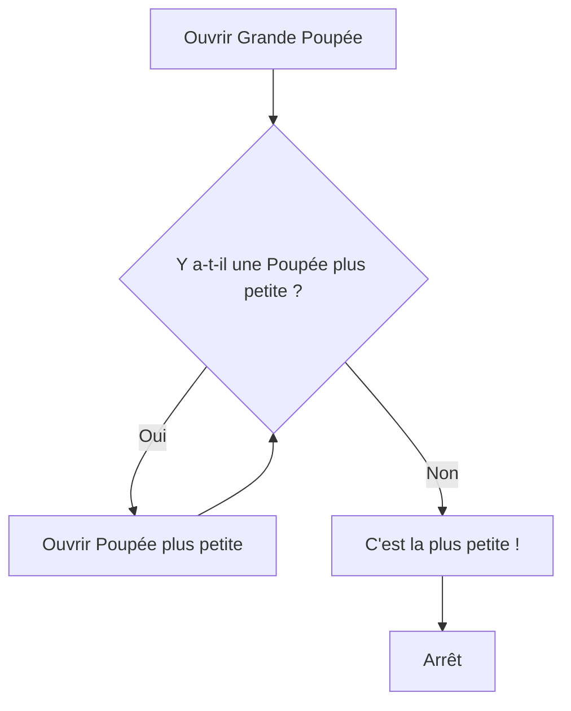

## Introduction: Le miroir de l'algorithme

Dans le vaste univers de l'informatique, la résolution de problèmes est une quête incessante d'efficacité et d'élégance. Parmi les outils conceptuels les plus puissants et les plus fascinants à la disposition du programmeur et de l'algorithmicien se trouve la *récursivité*. Loin d'être une simple curiosité académique, la récursivité est une technique fondamentale qui permet d'aborder des problèmes complexes en les décomposant en des instances plus petites et identiques à l'original. Au cœur de cette approche réside une idée simple mais profonde : une fonction ou une procédure qui s'appelle elle-même.

Imaginez un miroir reflétant un autre miroir : une image infinie se déploie, chaque reflet étant une version légèrement différente du précédent. C'est une métaphore visuelle saisissante de la récursivité, où chaque appel de fonction est un reflet de l'appel initial, travaillant sur une partie plus petite du problème jusqu'à atteindre un point où la solution est triviale. Cette capacité à se définir en termes de soi-même confère à la récursivité une élégance et une puissance inégalées pour exprimer des algorithmes qui seraient autrement complexes à formuler de manière itérative.

L'importance de la récursivité en informatique est multiforme. Elle est la pierre angulaire de nombreux algorithmes de tri (comme le tri fusion ou le tri rapide), de recherche (comme la recherche dichotomique), et de parcours de structures de données arborescentes ou graphiques. Des concepts fondamentaux en théorie des langages, en intelligence artificielle et même en cryptographie s'appuient sur des principes récursifs. Comprendre la récursivité n'est pas seulement apprendre une technique de programmation ; c'est acquérir une nouvelle façon de penser la structure des problèmes et la conception des solutions. Elle développe une intuition pour la décomposition et la composition, compétences essentielles pour tout informaticien.

Cette leçon, intitulée « Le miroir de l'algorithme », vous guidera à travers les méandres de la récursivité. Nous commencerons par définir formellement ce concept et explorerons ses principes fondamentaux, notamment les éléments cruciaux qui garantissent son bon fonctionnement et évitent les boucles infinies. Nous examinerons ensuite des exemples classiques et pratiques pour solidifier votre compréhension, avant d'aborder les avantages et les inconvénients de cette approche par rapport à l'itération. Enfin, nous discuterons des considérations de performance et de la manière dont la récursivité est gérée en mémoire. Préparez-vous à plonger dans un monde où les solutions se construisent en se référant à elles-mêmes, révélant la beauté et la puissance de l'auto-référence algorithmique.

## Principes Fondamentaux de la Récursivité

La récursivité, dans son essence, est une méthode de résolution de problèmes où la solution à un problème dépend de solutions à des instances plus petites du même problème. Formellement, on dit qu'une fonction ou une procédure est *récursive* si elle s'appelle elle-même, directement ou indirectement, pour accomplir sa tâche. Cette auto-référence est la caractéristique distinctive de la récursivité.

Pour qu'une fonction récursive soit correctement définie et qu'elle termine son exécution, deux composants essentiels doivent impérativement être présents :

1.  **Le Cas de Base (Condition d'Arrêt)** : C'est la condition qui spécifie quand la récursivité doit s'arrêter. Le cas de base est une instance du problème qui est suffisamment simple pour être résolue directement, sans nécessiter d'appels récursifs supplémentaires. Sans un cas de base clairement défini et atteignable, la fonction récursive s'appellerait indéfiniment, conduisant à une boucle infinie et, dans la plupart des environnements d'exécution, à un débordement de pile (stack overflow). Il est la « sortie » de la séquence d'appels récursifs.

2.  **L'Appel Récursif (Étape Récursive)** : C'est l'étape où la fonction s'appelle elle-même, mais avec des arguments modifiés de telle sorte que le nouveau problème soit une version plus petite ou plus simple du problème original. Chaque appel récursif doit progresser vers le cas de base. Si l'appel récursif ne simplifie pas le problème ou ne le rapproche pas du cas de base, la récursivité ne terminera jamais.

Pour illustrer ces principes, considérons une analogie simple : les poupées russes, ou *Matriochka*.

Imaginez que vous ayez une grande poupée russe. Votre tâche est de trouver la plus petite poupée à l'intérieur.
*   **Le problème initial** est de trouver la plus petite poupée dans la grande poupée que vous tenez.
*   **L'étape récursive** consiste à ouvrir la poupée que vous tenez. À l'intérieur, vous trouvez une poupée plus petite. Vous appliquez alors la même « règle » : trouver la plus petite poupée dans cette nouvelle poupée, qui est une instance plus petite du problème original.
*   **Le cas de base** est atteint lorsque vous ouvrez une poupée et qu'il n'y a plus de poupée à l'intérieur, ou que la poupée que vous tenez est déjà la plus petite. À ce moment-là, vous avez trouvé votre solution et vous pouvez arrêter.

[[WIDGET:Mermaid:recursive_matryoshka]]


*Légende: Diagramme illustrant l'analogie des poupées russes pour la récursivité. Chaque étape d'ouverture d'une poupée plus petite représente un appel récursif, jusqu'à ce que le cas de base (plus de poupée à l'intérieur) soit atteint.*

Une autre analogie est celle de la définition d'un ancêtre. Un ancêtre est soit un parent (cas de base), soit un ancêtre d'un parent (appel récursif). Pour trouver tous vos ancêtrès, vous demandez à vos parents qui sont leurs ancêtrès, et ils demandent à leurs parents, et ainsi de suite, jusqu'à ce que vous atteigniez des individus qui n'ont plus de parents connus (le cas de base).

Ces analogies mettent en lumière l'élégance de la récursivité : un problème complexe est résolu en appliquant la même logique à des sous-problèmes plus simples, jusqu'à ce qu'un point de résolution directe soit atteint. La clé est de s'assurer que chaque appel récursif réduit la complexité du problème et le rapproche du cas de base. Sans cette progression, la récursivité serait une impasse sans fin.

Ayant établi les principes fondamentaux de la récursivité, à savoir l'importance cruciale du cas de base et la nature de l'appel récursif, nous allons maintenant explorer des exemples algorithmiques classiques. Ces illustrations concrètes permettront de solidifier notre compréhension de la manière dont la récursivité est appliquée pour résoudre des problèmes de manière élégante et concise.

## Exemples Classiques de Récursivité

La récursivité trouve ses applications les plus directes dans des problèmes dont la définition mathématique ou logique est intrinsèquement récursive. Deux des exemples les plus emblématiques sont le calcul de la factorielle d'un nombre et la génération de la suite de Fibonacci.

### La Fonction Factorielle

La factorielle d'un entier naturel `n`, notée `n!`, est le produit de tous les entiers positifs inférieurs ou égaux à `n`. Sa définition mathématique est la suivante :
*   `n! = n × (n-1) × (n-2) × ... × 1` pour `n > 0`
*   `0! = 1` (par convention)

Cette définition peut être reformulée de manière récursive :
*   `n! = 1` si `n = 0` (Cas de base)
*   `n! = n × (n-1)!` si `n > 0` (Appel récursif)

Observons comment cette structure se traduit en code :

python
def factorielle(n):
    if n == 0:  # Cas de base
        return 1
    else:       # Appel récursif
        return n * factorielle(n - 1)

# Exemple d'utilisation
# print(factorielle(4))


Pour comprendre le fonctionnement, traçons l'exécution de `factorielle(4)` :
1.  `factorielle(4)` est appelée. `n` est 4, ce n'est pas le cas de base. Elle retourne `4 * factorielle(3)`.
2.  `factorielle(3)` est appelée. `n` est 3. Elle retourne `3 * factorielle(2)`.
3.  `factorielle(2)` est appelée. `n` est 2. Elle retourne `2 * factorielle(1)`.
4.  `factorielle(1)` est appelée. `n` est 1. Elle retourne `1 * factorielle(0)`.
5.  `factorielle(0)` est appelée. `n` est 0. C'est le cas de base ! Elle retourne `1`.
6.  L'exécution remonte :
    *   `factorielle(1)` reçoit `1` de `factorielle(0)`, calcule `1 * 1 = 1`.
    *   `factorielle(2)` reçoit `1` de `factorielle(1)`, calcule `2 * 1 = 2`.
    *   `factorielle(3)` reçoit `2` de `factorielle(2)`, calcule `3 * 2 = 6`.
    *   `factorielle(4)` reçoit `6` de `factorielle(3)`, calcule `4 * 6 = 24`.
Le résultat final est `24`. Chaque appel récursif (`n-1`) réduit le problème d'une unité, progressant inévitablement vers le cas de base `n=0`.

### La Suite de Fibonacci

La suite de Fibonacci est une séquence d'entiers où chaque nombre est la somme des deux précédents, commençant généralement par 0 et 1. Sa définition est la suivante :
*   `F(0) = 0` (Premier cas de base)
*   `F(1) = 1` (Deuxième cas de base)
*   `F(n) = F(n-1) + F(n-2)` pour `n > 1` (Appel récursif)

Voici son implémentation récursive :

python
def fibonacci(n):
    if n == 0:  # Premier cas de base
        return 0
    elif n == 1: # Deuxième cas de base
        return 1
    else:       # Appel récursif
        return fibonacci(n - 1) + fibonacci(n - 2)

# Exemple d'utilisation
# print(fibonacci(5))


L'exécution de `fibonacci(5)` est plus complexe car elle implique deux appels récursifs pour chaque étape, formant un arbre d'appels :
*   `fibonacci(5)` appelle `fibonacci(4)` et `fibonacci(3)`.
*   `fibonacci(4)` appelle `fibonacci(3)` et `fibonacci(2)`.
*   `fibonacci(3)` appelle `fibonacci(2)` et `fibonacci(1)`.
*   `fibonacci(2)` appelle `fibonacci(1)` et `fibonacci(0)`.
*   `fibonacci(1)` et `fibonacci(0)` sont les cas de base et retournent `1` et `0` respectivement.

Cette structure met en évidence un inconvénient majeur de la récursivité naïve pour Fibonacci : de nombreux calculs sont répétés (par exemple, `fibonacci(3)` est calculé plusieurs fois). Cela conduit à une complexité temporelle exponentielle, ce qui peut être très inefficace pour de grandes valeurs de `n`. Néanmoins, cet exemple illustre parfaitement la puissance expressive de la récursivité pour traduire directement une définition mathématique.

## La Récursivité en Action: Les Tours de Hanoï

Le problème des Tours de Hanoï est un puzzle mathématique ou un jeu de réflexion qui sert d'exemple classique pour illustrer la récursivité. Il a été inventé par le mathématicien français Édouard Lucas en 1883.

### Description du Problème

Le jeu se compose de trois piquets (tiges) et d'un certain nombre de disques de tailles différentes, qui peuvent glisser sur n'importe quel piquet. Au début du jeu, tous les disques sont empilés sur un piquet, par ordre de taille croissant (le plus grand disque en bas, le plus petit en haut), formant une tour conique. L'objectif est de déplacer toute la pile de disques du piquet de départ vers un autre piquet, en respectant les règles suivantes :
1.  Un seul disque peut être déplacé à la fois.
2.  Chaque mouvement consiste à prendre le disque supérieur d'une pile et à le placer sur le dessus d'une autre pile.
3.  Aucun disque ne peut être placé sur un disque plus petit que lui.

### La Solution Récursive

La beauté de ce problème réside dans la simplicité et l'élégance de sa solution récursive. Pour déplacer `n` disques d'un piquet source (A) vers un piquet destination (C), en utilisant un piquet auxiliaire (B), la stratégie est la suivante :

1.  **Cas de base** : Si `n = 1` (un seul disque à déplacer), il suffit de déplacer ce disque directement du piquet source au piquet destination. C'est la tâche la plus simple, résolue directement.

2.  **Appel récursif** : Si `n > 1` :
    a.  Déplacer les `n-1` disques supérieurs du piquet source (A) vers le piquet auxiliaire (B), en utilisant le piquet destination (C) comme auxiliaire temporaire.
    b.  Déplacer le plus grand disque (le `n`-ième disque) restant sur le piquet source (A) vers le piquet destination (C).
    c.  Déplacer les `n-1` disques du piquet auxiliaire (B) vers le piquet destination (C), en utilisant le piquet source (A) comme auxiliaire temporaire.

Cette approche décompose le problème complexe du déplacement de `n` disques en trois sous-problèmes plus petits, dont deux sont des instances du problème original avec `n-1` disques. Chaque appel récursif réduit le nombre de disques à déplacer, nous rapprochant du cas de base.

Voici une implémentation conceptuelle :

python
def tours_de_hanoi(n, source, destination, auxiliaire):
    if n == 1:  # Cas de base: un seul disque à déplacer
        print(f« Déplacer le disque 1 de &#123;source&#125; à &#123;destination&#125; »)
    else:       # Appel récursif
        # Étape 1: Déplacer n-1 disques de la source vers l'auxiliaire
        tours_de_hanoi(n - 1, source, auxiliaire, destination)
        # Étape 2: Déplacer le n-ième disque (le plus grand) de la source vers la destination
        print(f« Déplacer le disque &#123;n&#125; de &#123;source&#125; à &#123;destination&#125; »)
        # Étape 3: Déplacer les n-1 disques de l'auxiliaire vers la destination
        tours_de_hanoi(n - 1, auxiliaire, destination, source)

# Exemple d'utilisation pour 3 disques
# tours_de_hanoi(3, 'A', 'C', 'B')


Pour `n=3` disques, les étapes seraient les suivantes :
1.  `tours_de_hanoi(3, 'A', 'C', 'B')`
    a.  Appelle `tours_de_hanoi(2, 'A', 'B', 'C')`
        i.  Appelle `tours_de_hanoi(1, 'A', 'C', 'B')` -> Déplacer disque 1 de A à C
        ii. Déplacer disque 2 de A à B
        iii. Appelle `tours_de_hanoi(1, 'C', 'B', 'A')` -> Déplacer disque 1 de C à B
    b.  Déplacer disque 3 de A à C
    c.  Appelle `tours_de_hanoi(2, 'B', 'C', 'A')`
        i.  Appelle `tours_de_hanoi(1, 'B', 'A', 'C')` -> Déplacer disque 1 de B à A
        ii. Déplacer disque 2 de B à C
        iii. Appelle `tours_de_hanoi(1, 'A', 'C', 'B')` -> Déplacer disque 1 de A à C

Cette décomposition montre comment un problème apparemment complexe est résolu par une série de problèmes plus simples du même type, jusqu'à atteindre le cas trivial du déplacement d'un seul disque. La récursivité offre ici une solution d'une clarté et d'une concision remarquables.

[[WIDGET:Mermaid:hanoi_recursive_breakdown]]
```mermaid
graph TD
    A[Hanoi(N, A, C, B)] --> B{N == 1?}
    B -- Oui --> C[Déplacer Disque 1 de A à C]
    B -- Non --> D[Hanoi(N-1, A, B, C)]
    D --> E[Déplacer Disque N de A à C]
    E --> F[Hanoi(N-1, B, C, A)]
```

*Légende: Diagramme de flux illustrant la logique récursive de la résolution des Tours de Hanoï. Le problème de déplacer N disques est décomposé en deux sous-problèmes de déplacement de N-1 disques et un mouvement simple du plus grand disque.*

La récursivité, bien que puissante et élégante, n'est qu'une des deux grandes approches pour résoudre des problèmes répétitifs. Son alter ego est l'itération, et comprendre leurs différences, leurs forces et leurs faiblesses est fondamental pour tout informaticien.

## Récursivité vs Itération: Conversion et Comparaison

De nombreux problèmes algorithmiques peuvent être formulés et résolus de manière récursive ou itérative. Tandis que la récursivité exprime une solution en termes d'elle-même, l'itération s'appuie sur des boucles pour répéter une séquence d'opérations jusqu'à ce qu'une condition soit remplie.

### Distinction Fondamentale

*   **Approche Récursive**: Une fonction s'appelle elle-même, directement ou indirectement, pour résoudre des sous-problèmes plus petits. Elle nécessite un cas de base pour arrêter la chaîne d'appels. L'état de chaque appel est géré implicitement par la pile d'appels du système.
*   **Approche Itérative**: Une fonction utilise des structures de contrôle de flux comme les boucles (`for`, `while`) pour répéter un bloc de code. L'état du calcul est géré explicitement par des variables locales à la fonction.

### Conversion entre Récursivité et Itération

Théoriquement, tout algorithme récursif peut être converti en un algorithme itératif, et vice-versa. La conversion d'un algorithme récursif en itératif implique souvent de simuler la pile d'appels de manière explicite (par exemple, en utilisant une pile de données) pour stocker les états intermédiaires.

Prenons l'exemple classique du calcul de la factorielle d'un nombre `n` (notée `n!`), qui est le produit de tous les entiers positifs inférieurs ou égaux à `n`.

**Version Récursive de la Factorielle:**

python
def factorielle_recursive(n):
    if n == 0:  # Cas de base
        return 1
    else:       # Appel récursif
        return n * factorielle_recursive(n - 1)

# Exemple: factorielle_recursive(4)
# 4 * factorielle_recursive(3)
# 4 * (3 * factorielle_recursive(2))
# 4 * (3 * (2 * factorielle_recursive(1)))
# 4 * (3 * (2 * (1 * factorielle_recursive(0))))
# 4 * (3 * (2 * (1 * 1)))
# 24


Cette implémentation est concise et reflète directement la définition mathématique `n! = n * (n-1)!` avec `0! = 1`.

**Version Itérative de la Factorielle:**

python
def factorielle_iterative(n):
    resultat = 1
    for i in range(1, n + 1):
        resultat *= i
    return resultat

# Exemple: factorielle_iterative(4)
# i=1, resultat = 1 * 1 = 1
# i=2, resultat = 1 * 2 = 2
# i=3, resultat = 2 * 3 = 6
# i=4, resultat = 6 * 4 = 24
# Retourne 24


Dans la version itérative, nous utilisons une boucle `for` et une variable `resultat` pour accumuler le produit. Il n'y a pas d'appels de fonction successifs à gérer, seulement des mises à jour de variables dans un contexte unique.

### Avantages et Inconvénients

Le choix entre récursivité et itération dépend souvent de la nature du problème, de la clarté souhaitée et des contraintes de performance.

#### Lisibilité et Clarté

*   **Récursivité**:
    *   **Avantages**: Pour les problèmes intrinsèquement récursifs (comme les Tours de Hanoï, la traversée d'arbres, les algorithmes de tri comme <ConceptLink slug="quicksort">Quicksort</ConceptLink> ou <ConceptLink slug="mergesort">Mergesort</ConceptLink>), la solution récursive est souvent plus naturelle, plus élégante et plus facile à comprendre car elle correspond directement à la définition du problème. Elle peut rendre le code plus concis.
    *   **Inconvénients**: Pour les problèmes où la récursion est profonde ou complexe, il peut être difficile de suivre le flux d'exécution et de déboguer. Une récursion excessive peut masquer la logique sous-jacente pour les non-initiés.
*   **Itération**:
    *   **Avantages**: Le flux de contrôle est généralement plus linéaire et explicite, ce qui peut rendre le code plus facile à suivre pas à pas et à déboguer, surtout pour les débutants.
    *   **Inconvénients**: Pour des problèmes naturellement récursifs, la conversion en itératif peut rendre le code plus long, plus complexe et moins intuitif, nécessitant parfois la gestion manuelle d'une pile.

#### Performance

*   **Récursivité**:
    *   **Coût temporel**: Chaque appel de fonction entraîne un « overhead » (surcoût) lié à la création d'un nouveau cadre de pile (stack frame), au passage des paramètrès, à la gestion du retour, etc. Cet overhead peut rendre les algorithmes récursifs plus lents que leurs équivalents itératifs pour des problèmes simples.
    *   **Coût spatial**: Chaque appel récursif ajoute un cadre à la pile d'exécution. Si la profondeur de la récursion est grande, cela peut consommer une quantité significative de mémoire.
*   **Itération**:
    *   **Coût temporel**: Généralement plus efficace car elle n'implique pas l'overhead des appels de fonction répétés. Le processeur exécute simplement une séquence d'instructions dans une boucle.
    *   **Coût spatial**: Moins gourmande en mémoire car elle n'utilise pas la pile d'appels pour stocker les états intermédiaires des appels successifs. L'espace mémoire est principalement limité aux variables locales de la boucle.

En résumé, si la clarté et l'élégance sont primordiales pour un problème naturellement récursif, la récursivité est souvent privilégiée. Si la performance et l'optimisation des ressources sont critiques, l'itération est généralement le choix le plus judicieux.

## Analyse des Coûts et Optimisation

L'utilisation de la récursivité n'est pas sans conséquences, notamment en termes de consommation de ressources. Une compréhension approfondie de ces coûts est essentielle pour écrire des algorithmes robustes et efficaces.

### Complexité Temporelle et Spatiale des Algorithmes Récursifs

1.  **Complexité Temporelle**:
    Comme mentionné, les appels de fonction récursifs introduisent un surcoût. Chaque appel nécessite du temps pour :
    *   Sauvegarder l'état actuel de la fonction appelante.
    *   Allouer de l'espace pour les variables locales et les paramètrès de la fonction appelée.
    *   Transférer le contrôle à la fonction appelée.
    *   Restaurer l'état et retourner le contrôle après l'exécution.
    Pour des problèmes simples comme la factorielle, cet overhead peut rendre la version récursive plus lente que l'itérative. Pour des problèmes plus complexes, l'analyse de la complexité temporelle récursive implique souvent la résolution d'équations de récurrence (un sujet plus avancé, mais dont il faut connaître l'existence).

2.  **Complexité Spatiale (Pile d'Appels)**:
    C'est l'aspect le plus critique de la récursivité. Chaque fois qu'une fonction est appelée, un « cadre d'activation » (ou « stack frame ») est créé sur la pile d'exécution du programme. Ce cadre contient :
    *   L'adresse de retour (où le programme doit reprendre après l'appel).
    *   Les paramètrès passés à la fonction.
    *   Les variables locales de la fonction.
    Lors d'appels récursifs, ces cadres s'empilent les uns sur les autres. La profondeur de la récursion correspond au nombre de cadres empilés.

### Problèmes Potentiels: Le Débordement de Pile (Stack Overflow)

La pile d'exécution a une taille limitée, définie par le système d'exploitation ou le compilateur. Si un algorithme récursif effectue trop d'appels sans atteindre son cas de base, ou si le problème est trop grand, la pile peut déborder. C'est ce qu'on appelle un **débordement de pile (stack overflow)**.

Lorsqu'un débordement de pile se produit, le programme tente d'allouer de la mémoire sur la pile alors qu'il n'y en a plus de disponible, ce qui entraîne généralement une erreur fatale et l'arrêt brutal du programme. C'est un problème courant avec les récursions mal conçues ou pour des entrées de grande taille.

### Techniques d'Optimisation

Pour atténuer les inconvénients de la récursivité tout en conservant ses avantages de clarté, plusieurs techniques d'optimisation existent.

1.  **La Mémoïsation (Programmation Dynamique)**:
    Certains algorithmes récursifs souffrent de recalculs redondants de sous-problèmes identiques. L'exemple le plus frappant est la suite de Fibonacci, où `fib(n)` est défini comme `fib(n-1) + fib(n-2)` avec `fib(0)=0` et `fib(1)=1`.

    **Version Récursive Naïve de Fibonacci:**

    python
    def fib_naive(n):
        if n &lt;= 1:
            return n
        else:
            return fib_naive(n - 1) + fib_naive(n - 2)
    

    Pour calculer `fib_naive(5)`, la fonction `fib_naive(3)` est appelée deux fois, `fib_naive(2)` trois fois, etc. Ces sous-problèmes sont recalculés inutilement, ce qui conduit à une complexité temporelle exponentielle.

    [[WIDGET:Mermaid:fibonacci_naive_call_tree]]
    mermaid
    graph TD
        F5[fib(5)]
        F5 --> F4[fib(4)]
        F5 --> F3_1[fib(3)]
        F4 --> F3_2[fib(3)]
        F4 --> F2_1[fib(2)]
        F3_1 --> F2_2[fib(2)]
        F3_1 --> F1_1[fib(1)]
        F3_2 --> F2_3[fib(2)]
        F3_2 --> F1_2[fib(1)]
        F2_1 --> F1_3[fib(1)]
        F2_1 --> F0_1[fib(0)]
        F2_2 --> F1_4[fib(1)]
        F2_2 --> F0_2[fib(0)]
        F2_3 --> F1_5[fib(1)]
        F2_3 --> F0_3[fib(0)]

        subgraph Arbre d'appels Fibonacci Naïf
            F5
            F4
            F3_1
            F3_2
            F2_1
            F2_2
            F2_3
            F1_1
            F1_2
            F1_3
            F1_4
            F1_5
            F0_1
            F0_2
            F0_3
        end

        style F3_2 fill:#f9f,stroke:#333,stroke-width:2px
        style F2_2 fill:#f9f,stroke:#333,stroke-width:2px
        style F2_3 fill:#f9f,stroke:#333,stroke-width:2px
        style F1_2 fill:#f9f,stroke:#333,stroke-width:2px
        style F1_4 fill:#f9f,stroke:#333,stroke-width:2px
        style F1_5 fill:#f9f,stroke:#333,stroke-width:2px
        style F0_2 fill:#f9f,stroke:#333,stroke-width:2px
        style F0_3 fill:#f9f,stroke:#333,stroke-width:2px
    *Légende: Représentation de l'arbre d'appels pour le calcul de `fib_naive(5)`. Les nœuds en violet indiquent des sous-problèmes recalculés plusieurs fois.*

    La **mémoïsation** consiste à stocker les résultats des appels de fonction coûteux et à retourner le résultat stocké lorsque les mêmes entrées se présentent à nouveau. Cela transforme la complexité exponentielle en une complexité polynomiale (linéaire pour Fibonacci).

    **Version Récursive de Fibonacci avec Mémoïsation:**

    python
    memo = &#123;&#125; # Un dictionnaire pour stocker les résultats

    def fib_memoized(n):
        if n in memo: # Si le résultat est déjà calculé, le retourner
            return memo[n]
        if n &lt;= 1:
            result = n
        else:
            result = fib_memoized(n - 1) + fib_memoized(n - 2)
        memo[n] = result # Stocker le résultat avant de le retourner
        return result
    

    Cette technique est un pilier de la <ConceptLink slug="dynamic-programming">programmation dynamique</ConceptLink> et est cruciale pour optimiser de nombreux algorithmes récursifs.

2.  **La Récursivité Terminale (Tail Recursion)**:
    Un appel récursif est dit **terminal** si l'appel récursif est la *dernière* opération effectuée par la fonction avant de retourner. Cela signifie qu'après l'appel récursif, il n'y a plus d'opérations à effectuer dans le cadre d'activation actuel.

    **Exemple de Factorielle Non Terminale (vu précédemment):**
    `return n * factorielle_recursive(n - 1)`
    Ici, après l'appel à `factorielle_recursive(n - 1)`, il faut encore multiplier le résultat par `n`. Ce n'est pas un appel terminal.

    **Exemple de Factorielle avec Récursivité Terminale:**

    python
    def factorielle_terminale(n, accumulateur=1):
        if n == 0:
            return accumulateur
        else:
            # L'appel récursif est la dernière opération
            return factorielle_terminale(n - 1, accumulateur * n)
    

    Dans cette version, la valeur accumulée est passée comme paramètre. Lorsque `factorielle_terminale(n - 1, accumulateur * n)` est appelée, le résultat de cet appel est directement retourné sans autre traitement.

    L'intérêt majeur de la récursivité terminale est que certains compilateurs (notamment ceux des langages fonctionnels comme Scheme ou Haskell, mais aussi certains compilateurs C++ ou Python dans des cas spécifiques) peuvent appliquer une **optimisation de la récursivité terminale (tail call optimization - TCO)**. Cette optimisation permet de réutiliser le même cadre de pile pour les appels récursifs terminaux, transformant de fait la récursion en une itération au niveau du code machine. Cela élimine l'overhead de la pile et prévient les débordements de pile, rendant la récursivité aussi efficace que l'itération pour ces cas spécifiques. Il est important de noter que tous les langages ou compilateurs ne supportent pas cette optimisation par défaut.

En maîtrisant ces concepts, vous pouvez choisir l'approche la plus appropriée et optimiser vos algorithmes récursifs pour qu'ils soient à la fois clairs et performants.

## Conclusion
Nous avons parcouru ensemble les méandres de la récursivité, cette approche élégante et puissante qui permet de résoudre des problèmes complexes en les ramenant à des instances plus simples d'eux-mêmes. Au fil de cette leçon, nous avons démystifié le concept, passant de sa définition fondamentale à ses applications pratiques, en explorant ses avantages indéniables ainsi que les défis qu'elle peut poser. La récursivité, loin d'être une simple curiosité académique, est un pilier de l'informatique, offrant une perspective unique sur la structuration et la résolution algorithmique. Elle nous invite à penser de manière auto-référentielle, à voir le « miroir » du problème initial dans ses propres sous-composants, une compétence essentielle pour tout concepteur d'algorithmes.

L'essence de la pensée récursive réside dans la capacité à identifier un **cas de base** clair et non récursif, qui met fin à la chaîne d'appels, et une **étape récursive** qui décompose le problème en une ou plusieurs sous-instances du même problème, tout en progressant vers le cas de base. Cette dualité est la clé de voûte de tout algorithme récursif fonctionnel. Nous avons vu comment cette structure se manifeste naturellement dans des problèmes comme le calcul de la factorielle, la séquence de Fibonacci, ou la traversée de structures de données arborescentes. La beauté de la récursivité réside souvent dans la concision et la lisibilité du code qu'elle produit, reflétant directement la définition mathématique ou la structure intrinsèque du problème. Elle permet d'exprimer des solutions de manière intuitive pour des problèmes qui, abordés itérativement, pourraient s'avérer plus ardus à conceptualiser et à implémenter.

[[WIDGET:Mermaid:recursive_thinking_process]]

Cependant, la puissance de la récursivité s'accompagne de considérations importantes. Nous avons mis en lumière les pièges potentiels, notamment le risque de débordement de pile (stack overflow) dû à un nombre excessif d'appels de fonction imbriqués, et les inefficacités liées aux calculs redondants. Pour contrer ces défis, nous avons exploré des techniques d'optimisation cruciales. La **mémoïsation**, pierre angulaire de la programmation dynamique, nous a montré comment transformer des complexités exponentielles en complexités polynomiales en stockant et réutilisant les résultats des sous-problèmes déjà résolus. De même, la **récursivité terminale** et son optimisation potentielle par les compilateurs (TCO) ont révélé comment, dans certains contextes, la récursivité peut être rendue aussi efficace que l'itération, en évitant la surcharge de la pile d'appels. Ces techniques ne sont pas de simples astuces, mais des outils fondamentaux dans l'arsenal de l'ingénieur logiciel pour construire des systèmes robustes et performants.

La maîtrise de la récursivité ne se limite pas à la simple écriture de fonctions récursives ; elle implique une compréhension profonde de la manière dont les problèmes peuvent être décomposés et reconstruits. C'est une compétence cognitive qui affine votre capacité à modéliser des situations complexes. En tant qu'étudiants en première année, l'exposition à ce paradigme ouvre la porte à des concepts algorithmiques plus avancés, tels que les algorithmes de tri (comme le tri fusion ou le tri rapide), la recherche dans les graphes (DFS, BFS), et la conception d'algorithmes pour des structures de données sophistiquées comme les arbres et les graphes. La récursivité est omniprésente dans ces domaines, et une solide compréhension de ses principes vous préparera à aborder ces sujets avec confiance.

Pour véritablement « maîtriser le miroir » de l'algorithme, la pratique est indispensable. Ne vous contentez pas de comprendre les exemples ; essayez de les coder vous-même, de les modifier, et d'appliquer la pensée récursive à de nouveaux problèmes. Commencez par des exercices simples, puis progressez vers des défis plus complexes. Apprenez à identifier quand un problème se prête naturellement à une solution récursive et quand une approche itérative pourrait être plus appropriée ou plus performante. Cette capacité de discernement est le signe d'un algorithme expert. La récursivité n'est pas seulement un outil de programmation ; c'est une façon de penser, une lentille à travers laquelle vous pouvez observer et résoudre une vaste gamme de problèmes informatiques avec élégance et efficacité. En cultivant cette compétence, vous enrichirez considérablement votre boîte à outils d'ingénieur et développerez une intuition précieuse pour la conception algorithmique.

[[WIDGET:conclusionSummary]]
[[WIDGET:whatsNext]]
[[WIDGET:goingFurther]]
[[WIDGET:finalEvaluation]]
