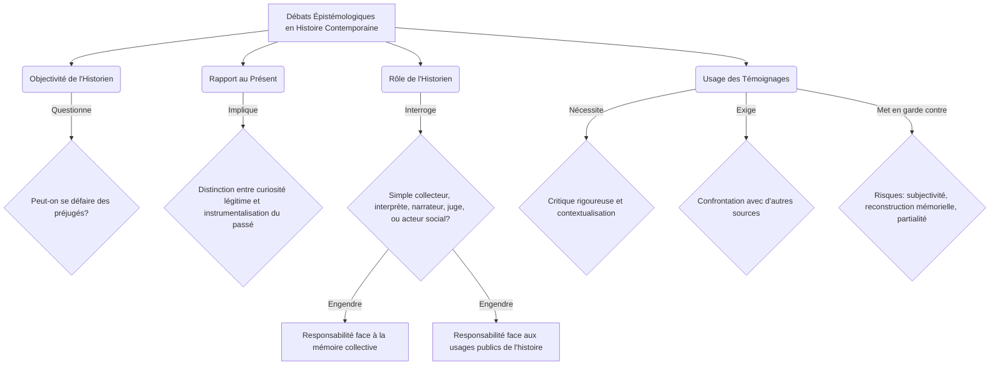

## Introduction : Pourquoi étudier l'Histoire contemporaine ?
Chers étudiantes et étudiants de première année de Licence, bienvenue dans ce cours d'Histoire contemporaine. Cette discipline, loin d'être une simple énumération de faits passés, constitue une clé essentielle pour déchiffrer les complexités de notre monde actuel. L'objectif de cette leçon inaugurale est de vous introduire aux fondements de l'Histoire contemporaine, en définissant son champ d'étude et en problématisant les défis méthodologiques qu'elle soulève.

Pourquoi, en effet, consacrer une année universitaire à l'étude d'une période si proche de nous ? L'histoire contemporaine n'est pas une relique lointaine ; elle est le terreau sur lequel nos sociétés, nos institutions, nos cultures et nos conflits se sont développés. Comprendre les origines des États-nations, des idéologies politiques, des systèmes économiques mondiaux, des mouvements sociaux ou encore des crises environnementales qui nous traversent, c'est se donner les moyens d'agir en citoyens éclairés. C'est aussi aiguiser son esprit critique face aux récits simplifiés et aux manipulations mémorielles.

L'étude de l'histoire la plus récente présente des particularités et des défis spécifiques. Contrairement aux périodes plus anciennes, l'historien du temps présent est souvent confronté à une surabondance de sources, à la proximité émotionnelle avec les événements, et à la forte influence de la mémoire collective et individuelle. Ces éléments exigent une approche particulièrement rigoureuse, critique et réflexive, afin de distinguer le fait de l'interprétation, le témoignage de l'analyse, et de construire un savoir historique qui ne soit pas un simple écho du présent.

Au cours de cette leçon, nous allons d'abord nous interroger sur la définition même de l'Histoire contemporaine, en explorant ses bornes chronologiques et ses spécificités thématiques. Puis, nous aborderons les enjeux méthodologiques propres à cette période, avant de conclure sur les grandes lignes de son historiographie.
## Définir l'Histoire contemporaine : Objets et spécificités
Le terme « contemporain » appliqué à l'histoire peut sembler paradoxal, voire tautologique. Comment l'histoire, par définition passée, peut-elle être « contemporaine », c'est-à-dire du même temps que nous ? Cette interrogation est au cœur de notre discipline et révèle ses spécificités.

Traditionnellement, l'Histoire contemporaine est bornée par la Révolution française de 1789, marquant le début de l'« Ère des révolutions » selon Eric Hobsbawm [[WIDGET:ref1]]. Cette date est conventionnelle et symbolise l'émergence de concepts fondateurs de notre modernité politique et sociale : la souveraineté populaire, les droits de l'homme, la nation, l'industrialisation. D'autres historiens préfèrent situer le début de cette période plus tard, par exemple avec l'« Ère des empires » (1875-1914) [[WIDGET:ref2]] ou même le « court XXe siècle » (1914-1991) [[WIDGET:ref3]], soulignant ainsi que la périodisation est toujours une construction historiographique. René Rémond, dans son « Introduction à l'histoire de notre temps » [[WIDGET:ref5]], a également contribué à structurer cette approche. Il est crucial de comprendre que ces découpages ne sont pas naturels, mais des outils heuristiques permettant d'organiser la compréhension du passé.

Au-delà de la chronologie, l'Histoire contemporaine se caractérise par un ensemble de traits distinctifs :

1.  **La proximité avec les événements :** L'historien peut être le contemporain des faits qu'il étudie, voire en être un acteur ou un témoin indirect. Cette proximité peut être un atout (accès à des témoignages oraux, à des archives encore vivantes) mais aussi un défi (difficulté à prendre du recul, risque de subjectivité).
2.  **L'abondance des sources :** La période contemporaine est marquée par une explosion documentaire. Aux archives traditionnelles s'ajoutent une multitude de sources médiatiques (presse écrite, radio, télévision, cinéma, internet), photographiques, sonores, ainsi que des témoignages oraux. Cette profusion exige de nouvelles méthodes de critique des sources et de gestion de l'information.
3.  **Le rôle central de la mémoire :** La mémoire collective et individuelle joue un rôle prépondérant. L'historien doit distinguer l'histoire, discipline scientifique basée sur la preuve et la critique, de la mémoire, construction sociale et souvent affective du passé. Les « lieux de mémoire » et les « guerres de mémoire » sont des objets d'étude à part entière.
4.  **L'accélération du temps et la globalisation :** Les transformations technologiques, économiques et sociales s'intensifient. Les événements ont une portée mondiale quasi immédiate, comme l'illustrent les processus de colonisation et de décolonisation [[WIDGET:ref4]] ou les relations internationales du XXe siècle [[WIDGET:ref6]].
5.  **L'émergence de nouveaux acteurs et objets d'étude :** L'histoire contemporaine ne se limite plus aux grands hommes et aux événements politiques. Elle s'intéresse aux masses, aux cultures populaires, aux médias [[WIDGET:ref7]], aux identités de genre, aux minorités, à l'environnement, aux phénomènes transnationaux, etc.

Les objets d'étude privilégiés par les historiens du temps présent sont donc multiples et en constante évolution : l'histoire politique des États-nations et des idéologies, l'histoire économique de l'industrialisation et du capitalisme mondialisé, l'histoire sociale des classes et des mouvements de contestation, l'histoire culturelle des masses et des médias, l'histoire des relations internationales et des conflits mondiaux [[WIDGET:ref6]], l'histoire des colonisations et des indépendances [[WIDGET:ref4]], et plus récemment, l'histoire environnementale ou l'histoire globale.

## Les enjeux de la périodisation : Quand commence le 'contemporain' ?
Si la définition de l'histoire contemporaine comme discipline est relativement consensuelle, la détermination de son point de départ précis demeure un sujet de vifs débats historiographiques. Les dates charnières proposées ne sont pas de simples repères chronologiques, mais des choix méthodologiques qui orientent la compréhension des processus historiques et la nature des continuités ou ruptures étudiées.

La Révolution française de **1789** est souvent avancée comme le seuil inaugural. Elle marque la fin de l'Ancien Régime, l'émergence des nations, la souveraineté populaire, et l'affirmation des droits de l'homme, posant les jalons politiques et idéologiques de la modernité. Eric Hobsbawm, avec son concept d'« Ère des révolutions » (1789-1848) [[WIDGET:ref1]], a magistralement démontré comment cette période a façonné le monde contemporain par ses transformations politiques et sociales profondes. D'autres historiens privilégient **1815**, fin des guerres napoléoniennes et Congrès de Vienne, comme le moment de la réorganisation de l'Europe, mais aussi de la cristallisation des forces nationalistes et libérales qui animeront le XIXe siècle.

Le milieu du XIXe siècle, avec les révolutions de **1848**, est parfois considéré comme un autre point de bascule, soulignant l'irruption des questions sociales et l'affirmation des idéologies modernes. Plus tard, **1870-1871** (guerre franco-prussienne, unification allemande, Commune de Paris) peut être vu comme le début d'une nouvelle ère impérialiste et de l'État-nation moderne. Eric Hobsbawm propose également **1875** comme point de départ de l'« Ère des empires » [[WIDGET:ref2]], mettant l'accent sur l'apogée de l'impérialisme, l'industrialisation et la mondialisation économique.

Cependant, une rupture plus radicale est souvent associée à **1914**, début de la Première Guerre mondiale. Ce conflit marque l'entrée dans l'« Âge des extrêmes » ou le « court XXe siècle » (1914-1991) selon Hobsbawm [[WIDGET:ref3]], caractérisé par les guerres totales, les idéologies de masse, les génocides et la bipolarisation du monde. Enfin, **1945**, fin de la Seconde Guerre mondiale, est une autre date clé, ouvrant sur la Guerre Froide, la décolonisation (analysée par Marc Ferro [[WIDGET:ref4]]), la construction européenne et l'émergence d'un ordre mondial nouveau.

Le choix de l'une ou l'autre de ces dates n'est jamais neutre. Il détermine les critères d'analyse : privilégie-t-on les mutations politiques, les transformations économiques et sociales, ou les ruptures culturelles et technologiques ? Il influence la perspective adoptée : une histoire centrée sur l'Europe ou une approche plus globale ? Ces découpages sont des constructions intellectuelles qui permettent de donner du sens au passé, de hiérarchiser les événements et de mettre en lumière certaines dynamiques plutôt que d'autres, façonnant ainsi notre compréhension des origines et de la nature du « temps présent ».

Pour synthétiser les principales propositions de périodisation, le tableau suivant met en lumière les dates clés et leurs justifications :

| Date Clé | Événement Marquant | Justification Historique Principale | Historiens / Concepts Associés |
| :------- | :----------------- | :--------------------------------- | :----------------------------- |
| **1789** | Révolution française | Fin de l'Ancien Régime, émergence des nations, droits de l'homme. | Eric Hobsbawm (« Ère des révolutions ») [[WIDGET:ref1]] |
| **1815** | Congrès de Vienne | Réorganisation de l'Europe, cristallisation des forces libérales et nationalistes. | |
| **1848** | Révolutions européennes | Irruption des questions sociales, affirmation des idéologies modernes. | |
| **1870-1871** | Guerre franco-prussienne, Unification allemande, Commune de Paris | Début d'une nouvelle ère impérialiste, État-nation moderne. | Eric Hobsbawm (« Ère des empires ») [[WIDGET:ref2]] |
| **1914** | Première Guerre mondiale | Entrée dans les guerres totales, idéologies de masse, « court XXe siècle ». | Eric Hobsbawm (« Âge des extrêmes ») [[WIDGET:ref3]] |
| **1945** | Fin de la Seconde Guerre mondiale | Guerre Froide, décolonisation, nouvel ordre mondial. | Marc Ferro (décolonisation) [[WIDGET:ref4]] |
## Courants historiographiques et débats épistémologiques
L'étude de l'histoire contemporaine n'est pas monolithique ; elle a été profondément marquée par l'émergence et l'évolution de divers courants historiographiques, chacun apportant ses méthodes, ses objets et ses questionnements. Ces approches ont enrichi la discipline tout en suscitant des débats épistémologiques fondamentaux sur la nature même de la connaissance historique.

L'**École des Annales**, fondée en France au début du XXe siècle (Lucien Febvre, Marc Bloch), puis renouvelée par Fernand Braudel et Emmanuel Le Roy Ladurie, a révolutionné l'historiographie en délaissant l'histoire événementielle et politique au profit de l'étude des structures sociales, des économies, des mentalités et de la longue durée. Elle a promu une histoire totale, interdisciplinaire, s'appuyant sur des méthodes quantitatives et l'analyse de sources variées.

Dans son sillage, l'**histoire culturelle** s'est développée, notamment avec des figures comme Roger Chartier ou, pour la France contemporaine, Jean-Pierre Rioux et Jean-François Sirinelli [[WIDGET:ref7]]. Elle s'intéresse aux représentations, aux pratiques, aux symboles, aux médias, aux identités et aux imaginaires collectifs, cherchant à comprendre comment les sociétés donnent sens à leur monde. Parallèlement, l'**histoire sociale** a continué d'explorer les classes, les groupes sociaux, les mouvements ouvriers et les inégalités, tandis que l'**histoire politique renouvelée** (incarnée par René Rémond [[WIDGET:ref5]]) a réinvesti le champ politique en l'analysant à travers ses cultures, ses acteurs et ses idéologies, au-delà des seuls événements.

Plus récemment, l'**histoire globale** ou **mondiale** a gagné en importance, cherchant à dépasser les cadres nationaux pour étudier les interconnexions, les circulations (personnes, biens, idées) et les phénomènes transnationaux, comme les processus de colonisation et de décolonisation [[WIDGET:ref4]]. Cette approche remet en question les récits eurocentrés et invite à une décentration des regards.

Ces évolutions historiographiques ont nourri des débats épistémologiques cruciaux. La question de l'**objectivité de l'historien** est centrale : l'historien peut-il se défaire de ses propres préjugés, de son époque, de sa culture pour restituer le passé tel qu'il fut ? Le **rapport au présent** est inévitable ; l'historien est un être de son temps, et ses interrogations sur le passé sont souvent influencées par les préoccupations de son époque. Il s'agit alors de distinguer la curiosité légitime pour les racines du présent de la projection anachronique ou de l'instrumentalisation du passé.

Le **rôle de l'historien** est également en constante discussion : est-il un simple collecteur de faits, un interprète, un narrateur, un juge, ou un acteur social ? Sa responsabilité face à la mémoire collective et aux usages publics de l'histoire est considérable. Enfin, l'**usage des témoignages**, particulièrement abondants en histoire contemporaine, pose des défis méthodologiques spécifiques. Si les témoignages oraux ou écrits sont des sources irremplaçables pour accéder à l'expérience vécue, ils nécessitent une critique rigoureuse, une contextualisation et une confrontation avec d'autres types de sources pour éviter les pièges de la subjectivité, de la reconstruction mémorielle ou de la partialité. L'historien doit ainsi constamment naviguer entre la quête de la vérité historique et la reconnaissance de la pluralité des interprétations du passé.

Pour une meilleure compréhension des principaux courants historiographiques :

| Courant Historiographique | Période / Figures Clés | Objets d'Étude Principaux | Apports Méthodologiques / Concepts |
| :----------------------- | :--------------------- | :-------------------------------- | :-------------------------------- |
| **École des Annales** | Début XXe siècle (Febvre, Bloch, Braudel, Le Roy Ladurie) | Structures sociales, économies, mentalités, longue durée. | Histoire totale, interdisciplinarité, analyse de sources variées. |
| **Histoire Culturelle** | (Chartier, Rioux, Sirinelli [[WIDGET:ref7]]) | Représentations, pratiques, symboles, médias, imaginaires collectifs. | Compréhension du sens social, des identités et des valeurs. |
| **Histoire Sociale** | (Continuité, divers auteurs) | Classes, groupes sociaux, mouvements ouvriers, inégalités. | Analyse des dynamiques de pouvoir, des conditions de vie et des luttes. |
| **Histoire Politique Renouvelée** | (René Rémond [[WIDGET:ref5]]) | Cultures politiques, acteurs, idéologies, systèmes de partis. | Au-delà de l'événementiel, analyse des systèmes et des mentalités politiques. |
| **Histoire Globale / Mondiale** | Plus récent (Marc Ferro [[WIDGET:ref4]], etc.) | Interconnexions, circulations (personnes, biens, idées), phénomènes transnationaux. | Décentration des regards, dépassement des cadres nationaux, histoire connectée. |

Les débats épistémologiques peuvent être modélisés comme suit :

## Textes fondateurs sur la notion de contemporanéité
La compréhension de l'histoire contemporaine, de ses bornes chronologiques et de ses spécificités méthodologiques, a été profondément façonnée par des œuvres fondatrices qui ont contribué à en définir les contours et les enjeux. Parmi les contributions majeures, celle d'Eric J. Hobsbawm est incontournable. Son œuvre monumentale, souvent qualifiée de « trilogie », a proposé une périodisation influente et une analyse structurelle des grandes dynamiques mondiales. Si « L'Ère des révolutions, 1789-1848 » <a href="#ref-1">[1]</a> et « L'Ère des empires, 1875-1914 » <a href="#ref-2">[2]</a> posent les jalons du long XIXe siècle, c'est surtout « L'Âge des extrêmes : Le court XXe siècle, 1914-1991 » <a href="#ref-3">[3]</a> qui a marqué les esprits. Hobsbawm y problématise la contemporanéité en proposant une rupture nette avec le siècle précédent, délimitant le XXe siècle non pas par des dates calendaires mais par des événements structurants : le début de la Première Guerre mondiale en 1914 et l'effondrement du bloc soviétique en 1991. Cette approche met en lumière l'idée d'un « court XXe siècle » caractérisé par des guerres mondiales, des idéologies extrêmes et une transformation radicale des sociétés, offrant ainsi une grille de lecture puissante pour l'étude du temps présent.

Un autre penseur essentiel pour l'introduction à l'histoire de notre temps est René Rémond. Son « Introduction à l'histoire de notre temps » <a href="#ref-5">[5]</a>, en plusieurs volumes, a non seulement servi de manuel de référence pour des générations d'étudiants, mais a aussi posé les bases d'une réflexion épistémologique sur la discipline. Rémond y aborde la question de la périodisation, des sources spécifiques à l'époque contemporaine et des défis méthodologiques liés à la proximité des événements. Il insiste sur la nécessité de distinguer l'histoire contemporaine de la simple chronique ou du journalisme, en soulignant l'importance de la distance critique et de l'analyse structurelle. Par ailleurs, des historiens comme Marc Ferro, avec son « Histoire des colonisations » <a href="#ref-4">[4]</a>, ont mis en évidence l'importance des phénomènes transnationaux et des interconnexions mondiales, un aspect fondamental de la contemporanéité qui dépasse les cadres nationaux traditionnels. Enfin, les travaux sur l'histoire culturelle, notamment ceux dirigés par Jean-Pierre Rioux et Jean-François Sirinelli dans l'« Histoire culturelle de la France » <a href="#ref-7">[7]</a>, ont souligné la spécificité de la période contemporaine par l'émergence des masses, des médias et des nouvelles formes de culture, enrichissant ainsi la compréhension des dynamiques sociales et politiques de notre époque.

## Conclusion
Au terme de cette exploration des fondements de l'histoire contemporaine, il apparaît que cette discipline se distingue par une définition et une périodisation fluctuantes, souvent sujettes à débat, mais toujours ancrées dans la volonté de comprendre notre monde immédiat à travers le prisme du passé récent. Nous avons vu que l'histoire contemporaine, loin d'être une simple prolongation du passé, constitue un champ d'étude à part entière, caractérisé par des sources spécifiques – abondantes mais complexes –, des enjeux mémoriels et un rapport particulier au présent. Les débats épistémologiques autour de l'objectivité, de la distance critique et du rôle de l'historien sont au cœur de sa pratique, soulignant la responsabilité intellectuelle et civique de ceux qui s'y consacrent.

Les défis auxquels est confronté l'historien du temps présent sont nombreux et en constante évolution. L'accélération de l'histoire, la numérisation massive des archives, l'émergence de nouvelles problématiques globales (environnement, migrations, pandémies) et la prolifération des « fausses nouvelles » ou des récits simplificateurs exigent une vigilance méthodologique accrue et une capacité d'adaptation. L'historien doit sans cesse affiner ses outils d'analyse pour décrypter des réalités complexes, confronter des témoignages multiples et parfois contradictoires, et restituer des récits nuancés. Dans un monde où le passé est souvent instrumentalisé, le rôle de l'historien est plus que jamais essentiel : il est celui qui, par sa rigueur scientifique et son sens critique, permet de démêler le vrai du faux, de contextualiser les événements et de fournir les clés de compréhension nécessaires à une citoyenneté éclairée. L'histoire contemporaine n'est pas seulement l'étude du passé ; elle est un outil indispensable pour penser le présent et anticiper l'avenir.

[[WIDGET:conclusionSummary]]

[[WIDGET:whatsNext]]

[[WIDGET:goingFurther]]

[[WIDGET:finalEvaluation]]
