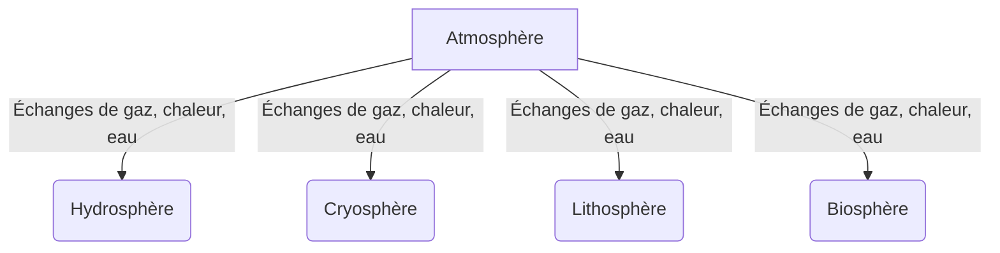
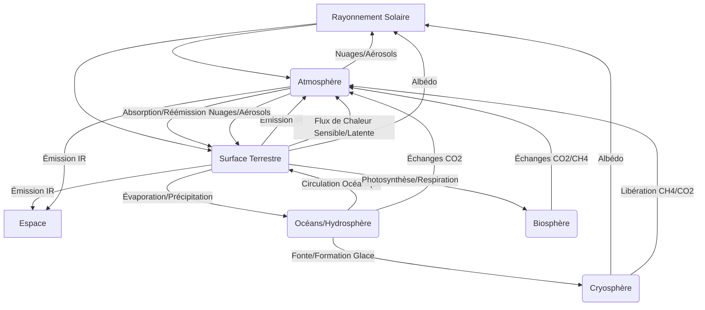

# Le système climatique terrestre: bilans énergétiques et composition atmosphérique

## Introduction au système climatique terrestre

Le [[WIDGET:Glossary:systeme_climatique:système climatique]] terrestre est une entité dynamique et complexe, fruit d'interactions incessantes entre diverses composantes physiques et biologiques de notre planète. Loin d'être une simple somme de ses parties, il fonctionne comme un système intégré où chaque élément influence et est influencé par les autres, régulant ainsi le climat global que nous connaissons. Comprendre ce système est fondamental pour appréhender les mécanismes naturels qui façonnent notre environnement, ainsi que les perturbations anthropiques qui menacent son équilibre.

Ce système peut être décomposé en cinq composantes principales, souvent désignées comme des « sphères » (Barry &amp; Chorley, 2009 [[WIDGET:Citation:1]]):

1.  **L'Atmosphère**: Il s'agit de l'enveloppe gazeuse qui entoure la Terre. Composée principalement d'azote (N₂), d'oxygène (O₂), d'argon (Ar) et de traces d'autres gaz (dont les gaz à effet de serre comme le dioxyde de carbone (CO₂) et la vapeur d'eau (H₂O)), l'atmosphère joue un rôle crucial dans la régulation thermique de la planète. Elle absorbe une partie du rayonnement solaire, réfléchit une autre, et piège le rayonnement infrarouge émis par la surface terrestre, créant ainsi l'effet de serre naturel essentiel à la vie. Elle est également le siège des phénomènes météorologiques.

2.  **L'Hydrosphère**: Cette composante englobe toutes les formes d'eau sur Terre, qu'elle soit liquide (océans, mers, lacs, rivières, eaux souterraines), solide (glaciers, calottes polaires, neige, pergélisol – formant la cryosphère, souvent considérée comme une composante distincte) ou gazeuse (vapeur d'eau dans l'atmosphère). Les océans, en particulier, représentent un réservoir de chaleur et de carbone colossal, influençant les courants marins et atmosphériques à l'échelle planétaire.

3.  **La Cryosphère**: Bien que souvent incluse dans l'hydrosphère, la cryosphère mérite une mention spécifique en raison de son rôle distinctif dans le système climatique. Elle comprend toutes les surfaces gelées de la Terre: les calottes glaciaires (Antarctique, Groenland), les glaciers de montagne, la neige saisonnière, la glace de mer et le pergélisol. Sa forte capacité à réfléchir le rayonnement solaire (albédo élevé) en fait un régulateur thermique majeur.

4.  **La Lithosphère**: Représentant la partie solide externe de la Terre, la lithosphère inclut la croûte terrestre et la partie supérieure du manteau. Les continents, les reliefs, les sols et les roches influencent les flux d'énergie et de matière. La géomorphologie des surfaces terrestres affecte l'absorption du rayonnement solaire, la circulation atmosphérique et la distribution de l'eau. Les processus géologiques, tels que le volcanisme, peuvent également injecter des gaz et des particules dans l'atmosphère, modifiant temporairement le climat.

5.  **La Biosphère**: Cette composante regroupe l'ensemble des organismes vivants (plantes, animaux, micro-organismes) et leurs environnements. La végétation, par exemple, influence l'albédo de la surface, le cycle de l'eau (évapotranspiration) et les échanges de gaz (photosynthèse et respiration) avec l'atmosphère, notamment le CO₂. Les écosystèmes marins jouent également un rôle crucial dans le cycle du carbone.

Ces composantes ne sont pas isolées; elles interagissent constamment à travers des boucles de rétroaction complexes. Par exemple, l'océan échange chaleur et humidité avec l'atmosphère, la végétation modifie la composition atmosphérique et le bilan hydrique des sols, tandis que la fonte des glaces (cryosphère) impacte le niveau marin (hydrosphère) et l'albédo (lithosphère/atmosphère).

[[WIDGET:Mermaid:climate_system_components]]


    B -->|Échanges de chaleur, humidité| A
    B -->|Échanges de masse, énergie| C
    B -->|Érosion, sédimentation| D
    B -->|Support de vie, cycles biogéochimiques| E

    C -->|Réflexion solaire (albédo)| A
    C -->|Fonte, niveau marin| B
    C -->|Érosion, modelage des paysages| D
    C -->|Habitat, adaptation des espèces| E

    D -->|Émission de gaz volcaniques, poussières| A
    D -->|Cycle de l'eau, érosion| B
    D -->|Support des glaciers| C
    D -->|Support de la vie, cycles biogéochimiques| E

    E -->|Photosynthèse, respiration, évapotranspiration| A
    E -->|Cycles biogéochimiques, productivité marine| B
    E -->|Adaptation aux conditions glaciaires| C
    E -->|Formation des sols, altération des roches| D

    subgraph Système Climatique Terrestre
        A
        B
        C
        D
        E
    end

*Caption: Diagramme des interactions entre les principales composantes du système climatique terrestre.*

Au cœur de la régulation du système climatique se trouvent les **bilans énergétiques** et la **composition atmosphérique**. Le bilan énergétique global de la Terre, dicté principalement par le rayonnement solaire entrant et le rayonnement terrestre sortant, détermine la température moyenne de la planète. Toute modification de ce bilan, qu'elle soit due à des variations naturelles ou à des activités humaines, peut entraîner des changements climatiques significatifs. La composition atmosphérique, notamment la concentration des gaz à effet de serre, joue un rôle prépondérant dans la capacité de l'atmosphère à retenir la chaleur, modulant ainsi l'effet de serre naturel.

**Objectifs du cours**:
À l'issue de cette leçon, vous serez capable de:
*   Définir le système climatique terrestre et identifier ses composantes principales.
*   Expliquer les interactions fondamentales entre ces composantes.
*   Décrire les mécanismes des bilans énergétiques de la Terre et de l'atmosphère.
*   Appliquer les lois physiques fondamentales (Stefan-Boltzmann, Wien) pour comprendre les transferts d'énergie.
*   analyser le rôle de la composition atmosphérique, en particulier des gaz à effet de serre, dans la régulation thermique de la planète.
*   Distinguer les différents flux d'énergie (radiatif, sensible, latent) et leur importance dans le système climatique.

## Les bilans énergétiques du système Terre-atmosphère

Le climat de la Terre est fondamentalement régi par l'énergie. L'énergie solaire est la principale force motrice du système climatique, déterminant la température de surface, les mouvements atmosphériques et océaniques, et le cycle de l'eau. Comprendre comment cette énergie est reçue, distribuée, transformée et réémise est essentiel pour saisir la dynamique climatique.

### 1. Sources d'énergie: Le rayonnement solaire

La quasi-totalité de l'énergie qui alimente le système climatique terrestre provient du Soleil sous forme de [[WIDGET:Glossary:rayonnement_electromagnetique:rayonnement électromagnétique]]. Le Soleil, une étoile de type G2V, émet un spectre continu de longueurs d'onde, allant des rayons gamma aux ondes radio, mais l'essentiel de son énergie est concentré dans le visible, l'ultraviolet (UV) et le proche infrarouge.

L'énergie solaire incidente à la limite supérieure de l'atmosphère terrestre est appelée la **constante solaire**. Sa valeur moyenne est d'environ 1361 W/m² (Watts par mètre carré). Cependant, en raison de la forme sphérique de la Terre et de son mouvement de rotation, l'énergie moyenne reçue par unité de surface terrestre est un quart de cette valeur, soit environ 340-342 W/m² (GIEC, 2021 [[WIDGET:Citation:6]]). Cette valeur est une moyenne annuelle et globale, et elle varie avec la latitude, l'heure du jour et la saison.

Le rayonnement solaire est principalement un rayonnement à ondes courtes (longueurs d'onde courtes), avec un pic d'émission dans le spectre visible (environ 0,5 micromètre). Ceci est en accord avec la [[WIDGET:ConceptLink:loi_de_wien:loi de Wien]], qui stipule que la longueur d'onde du maximum d'émission (λ_max) d'un corps noir est inversement proportionnelle à sa température absolue (T):

$$ \lambda_{max} = \frac{b}{T} $$

où `b` est la constante de déplacement de Wien (environ 2,898 x 10⁻³ m·K). La température de surface du Soleil étant d'environ 5778 K, son pic d'émission se situe bien dans le visible.

### 2. Mécanismes d'absorption, de réflexion et d'émission

Une fois que le rayonnement solaire atteint la Terre, il subit une série de transformations:

#### a) Absorption

L'absorption est le processus par lequel l'énergie radiante est convertie en énergie thermique par une substance.
*   **Dans l'atmosphère**: Une partie du rayonnement solaire est absorbée par les gaz atmosphériques (ozone pour l'UV, vapeur d'eau et CO₂ pour certaines bandes infrarouges) et par les aérosols (particules en suspension). Cette absorption réchauffe directement l'atmosphère.
*   **À la surface terrestre**: La majeure partie du rayonnement solaire qui n'a pas été réfléchi ou absorbé par l'atmosphère atteint la surface terrestre (océans, continents, végétation). Cette énergie est absorbée, entraînant un réchauffement de la surface. La quantité d'énergie absorbée dépend de la nature de la surface (couleur, texture, humidité).

#### b) Réflexion (Albédo)

La réflexion est le processus par lequel le rayonnement est renvoyé dans l'espace sans être absorbé. L'[[WIDGET:ConceptLink:albedo:albédo]] est une mesure de la réflectivité d'une surface, exprimée comme le rapport entre le rayonnement réfléchi et le rayonnement incident. Sa valeur varie de 0 (absorption totale, corps noir parfait) à 1 (réflexion totale, miroir parfait).

*   **Albédo de l'atmosphère**: Les nuages, les aérosols et les molécules de gaz diffusent et réfléchissent une partie du rayonnement solaire vers l'espace. Les nuages sont particulièrement efficaces pour réfléchir le rayonnement solaire, contribuant significulièrement à l'albédo planétaire.
*   **Albédo de la surface terrestre**:
    *   Neige fraîche et glace: Albédo très élevé (0,7 à 0,9).
    *   Déserts de sable: Albédo modéré à élevé (0,3 à 0,45).
    *   Forêts: Albédo faible (0,1 à 0,2).
    *   Océans: Albédo très faible (0,03 à 0,1) pour les angles d'incidence élevés (Soleil haut dans le ciel), mais peut augmenter considérablement pour les angles faibles (Soleil bas).

L'albédo moyen de la Terre est d'environ 0,3 (ou 30%), ce qui signifie qu'environ 30% du rayonnement solaire incident est réfléchi directement vers l'espace. Cette valeur est cruciale pour le bilan énergétique global.

#### c) Émission (Rayonnement terrestre ou infrarouge)

Toute substance ayant une température supérieure au zéro absolu (0 K ou -273,15 °C) émet du rayonnement électromagnétique. La Terre, ayant une température moyenne de surface d'environ 15 °C (288 K), émet du rayonnement dans la gamme de l'infrarouge lointain, appelé **rayonnement terrestre** ou **rayonnement à ondes longues**.

La quantité d'énergie émise par une surface est régie par la [[WIDGET:ConceptLink:loi_de_stefan_boltzmann:loi de Stefan-Boltzmann]], qui stipule que la puissance totale rayonnée par unité de surface d'un corps noir est directement proportionnelle à la quatrième puissance de sa température absolue:

$$ E = \sigma T^4 $$

où `E` est la puissance émise (W/m²), `σ` est la constante de Stefan-Boltzmann (5,67 x 10⁻⁸ W·m⁻²·K⁻⁴), et `T` est la température absolue (K). Pour un corps gris (comme la Terre), on introduit l'émissivité (ε), un facteur compris entre 0 et 1: `E = εσT⁴`. La surface terrestre a une émissivité proche de 1 dans l'infrarouge.

[[WIDGET:RealPerson:stefan_boltzmann:Josef Stefan et Ludwig Boltzmann]] ont formulé cette loi à la fin du XIXe siècle, jetant les bases de la compréhension du transfert radiatif de chaleur.

Le rayonnement terrestre est absorbé par les gaz à effet de serre (vapeur d'eau, CO₂, méthane, etc.) et les nuages dans l'atmosphère. Cette absorption réchauffe l'atmosphère, qui à son tour réémet du rayonnement infrarouge dans toutes les directions, y compris vers la surface terrestre. C'est ce processus qui est à l'origine de l'**effet de serre naturel**, essentiel pour maintenir la Terre à une température habitable. Sans cet effet, la température moyenne de la Terre serait d'environ -18 °C.

### 3. Le bilan radiatif global de la Terre

Le bilan radiatif global représente l'équilibre entre l'énergie solaire entrante et l'énergie sortante (réfléchie et émise par la Terre). Pour que la température moyenne de la Terre reste stable sur de longues périodes, l'énergie entrante doit être égale à l'énergie sortante.

En moyenne, sur une année et à l'échelle planétaire, le rayonnement solaire incident à la limite supérieure de l'atmosphère est d'environ 342 W/m².
*   Environ 107 W/m² (soit 31%) sont réfléchis vers l'espace par les nuages, l'atmosphère et la surface terrestre (albédo planétaire).
*   Les 235 W/m² restants (342 - 107) sont absorbés par le système Terre-atmosphère.
    *   Environ 77 W/m² sont absorbés directement par l'atmosphère (ozone, vapeur d'eau, nuages).
    *   Environ 158 W/m² sont absorbés par la surface terrestre (océans, continents, végétation).

La Terre et son atmosphère émettent également du rayonnement à ondes longues vers l'espace. Pour maintenir l'équilibre, cette émission doit être égale aux 235 W/m² absorbés. Ce processus est plus complexe en raison de l'effet de serre. La surface terrestre émet en moyenne environ 398 W/m² de rayonnement infrarouge. Cependant, une grande partie de ce rayonnement est absorbée par l'atmosphère et réémise. Au final, environ 235 W/m² sont émis vers l'espace depuis la haute atmosphère.

[[WIDGET:Image:earth_energy_balance]]
*Caption: Schéma simplifié du bilan énergétique global de la Terre, illustrant les flux de rayonnement solaire entrant, de rayonnement réfléchi, et de rayonnement terrestre sortant. Les valeurs sont des moyennes globales annuelles en W/m².*

Ce bilan est un équilibre dynamique. Des déséquilibres, même minimes, peuvent entraîner des changements climatiques. Par exemple, une augmentation des gaz à effet de serre réduit la capacité de la Terre à émettre du rayonnement à ondes longues vers l'espace pour une température donnée, ce qui conduit à un réchauffement du système jusqu'à ce qu'un nouvel équilibre soit atteint à une température plus élevée (GIEC, 2021 [[WIDGET:Citation:6]]).

### 4. Flux d'énergie entre la surface et l'atmosphère

Outre le rayonnement, l'énergie est échangée entre la surface terrestre et l'atmosphère par des processus non radiatifs: les flux de chaleur sensible et latente.

#### a) Flux de chaleur sensible

Le flux de chaleur sensible (ou chaleur sèche) est le transfert d'énergie thermique par conduction et convection, résultant d'une différence de température entre la surface et l'air au-dessus.
*   **Conduction**: Transfert de chaleur par contact direct entre molécules. La surface terrestre réchauffée par le soleil transfère de la chaleur à la couche d'air immédiatement adjacente.
*   **Convection**: Transfert de chaleur par le mouvement de fluides (ici, l'air). L'air réchauffé près de la surface devient moins dense et s'élève, transportant la chaleur vers des couches plus froides de l'atmosphère. Ce processus est responsable de la formation des thermiques et des mouvements verticaux de l'air.

Le flux de chaleur sensible est particulièrement important dans les régions arides et semi-arides où l'humidité est faible, et dans les zones urbaines où les surfaces absorbent beaucoup de chaleur. Il contribue au réchauffement de la basse atmosphère.

#### b) Flux de chaleur latente

Le flux de chaleur latente (ou chaleur humide) est l'énergie transférée lors des changements de phase de l'eau, principalement l'évaporation et la condensation.
*   **Évaporation**: Lorsque l'eau liquide à la surface (océans, lacs, sols humides, végétation par évapotranspiration) se transforme en vapeur d'eau, elle absorbe une grande quantité d'énergie thermique de l'environnement sans que sa température n'augmente. Cette énergie est appelée **chaleur latente de vaporisation**. La vapeur d'eau ainsi formée est transportée dans l'atmosphère.
*   **Condensation**: Lorsque la vapeur d'eau se condense pour former des nuages ou des précipitations, elle libère cette chaleur latente dans l'atmosphère. Cette libération de chaleur est une source d'énergie majeure pour les systèmes météorologiques, notamment les tempêtes et les cyclones tropicaux.

Le flux de chaleur latente est un mécanisme de transport d'énergie extrêmement efficace, en particulier dans les régions tropicales et océaniques. Il est un élément clé du cycle hydrologique et joue un rôle fondamental dans la distribution de la chaleur sur la planète. Par exemple, l'énergie absorbée par l'évaporation dans les tropiques est transportée sous forme de vapeur d'eau vers des latitudes plus élevées, où elle est libérée lors de la condensation, contribuant ainsi à l'équilibre thermique global.

En résumé, le bilan énergétique de la Terre est un équilibre délicat entre le rayonnement solaire entrant, le rayonnement réfléchi, le rayonnement terrestre émis, et les transferts de chaleur sensible et latente. Ces processus sont interdépendants et régissent la température et la dynamique du système climatique. Toute perturbation de cet équilibre, qu'elle soit naturelle ou anthropique, a des répercussions profondes sur le climat de notre planète.

Le bilan énergétique de la Terre, bien que fondamental, ne peut être pleinement compris sans une exploration approfondie de l'acteur central de ces échanges : l'atmosphère. C'est en son sein que se déroulent la plupart des processus météorologiques et climatiques, et c'est elle qui régule de manière cruciale la température de surface de notre planète.

## Composition et structure de l'atmosphère: rôle des gaz à effet de serre

L'atmosphère terrestre est une enveloppe gazeuse dynamique qui entoure notre planète, essentielle au maintien de la vie. Sa composition chimique et sa structure verticale déterminent ses propriétés physiques et son rôle dans le système climatique [[WIDGET:Citation:1]].

### Composition chimique de l'atmosphère

L'atmosphère est un mélange de gaz, dont la proportion varie selon qu'ils sont permanents ou variables.

#### Gaz permanents (ou à proportion constante)

Ces gaz constituent la majeure partie de l'atmosphère et leur concentration reste relativement stable jusqu'à environ 80 km d'altitude.
*   **Azote (N₂)**: Représente environ 78,08% du volume de l'air sec. Bien qu'inerte pour la plupart des processus atmosphériques directs, il est vital pour les cycles biogéochimiques terrestres via la fixation de l'azote par certains organismes.
*   **Oxygène (O₂)**: Constitue environ 20,95% du volume de l'air sec. Indispensable à la respiration des organismes aérobies et à la combustion. Sa présence est le résultat de la photosynthèse.
*   **Argon (Ar)**: Environ 0,93% du volume de l'air sec. C'est un gaz noble, chimiquement inerte, sans rôle direct dans les processus climatiques ou biologiques.

#### Gaz variables (ou à proportion fluctuante)

Ces gaz, bien que présents en quantités moindres, jouent un rôle disproportionné dans la régulation du climat, notamment en raison de leur capacité à absorber le rayonnement infrarouge. Leur concentration varie dans le temps et dans l'espace.

*   **Vapeur d'eau (H₂O)**:
    *   **Concentration**: Extrêmement variable, de près de 0% dans les régions polaires et les hautes altitudes à 4% du volume dans les tropiques humides. C'est le gaz à effet de serre naturel le plus abondant et le plus puissant [[WIDGET:Citation:6]].
    *   **Sources**: Évaporation des océans, lacs, rivières, sols humides et évapotranspiration de la végétation.
    *   **Puits**: Condensation (formation de nuages, précipitations).
    *   **Cycle biogéochimique**: La vapeur d'eau est au cœur du cycle hydrologique. L'énergie absorbée lors de l'évaporation (chaleur latente) est libérée lors de la condensation, jouant un rôle majeur dans le transport d'énergie à travers le globe et la dynamique des systèmes météorologiques.
    *   **Capacité d'absorption du rayonnement infrarouge**: La vapeur d'eau possède de nombreuses bandes d'absorption dans le spectre infrarouge, ce qui en fait le principal contributeur à l'effet de serre naturel. Son cycle rapide (temps de résidence de quelques jours) signifie que sa concentration atmosphérique est principalement contrôlée par la température de l'air (plus l'air est chaud, plus il peut contenir de vapeur d'eau), agissant comme une rétroaction positive majeure dans le système climatique.

*   **Dioxyde de carbone (CO₂)**:
    *   **Concentration**: Actuellement autour de 420 parties par million (ppm) et en augmentation constante. Bien que sa concentration soit faible, son impact est considérable.
    *   **Sources naturelles**: Respiration des organismes vivants, décomposition de la matière organique, éruptions volcaniques, échanges océan-atmosphère.
    *   **Sources anthropiques**: Combustion des combustibles fossiles (charbon, pétrole, gaz naturel), déforestation, production de ciment.
    *   **Puits naturels**: Photosynthèse par les plantes terrestres et le phytoplancton marin, absorption par les océans (formation d'acide carbonique), altération des roches silicatées.
    *   **Cycle biogéochimique**: Le [[WIDGET:ConceptLink:cycle_carbone:cycle du carbone]] est complexe et implique des échanges entre l'atmosphère, les océans, la biosphère terrestre et la lithosphère. Les activités humaines ont perturbé cet équilibre, entraînant une accumulation nette de CO₂ dans l'atmosphère.
    *   **Capacité d'absorption du rayonnement infrarouge**: Le CO₂ absorbe efficacement le rayonnement infrarouge dans des bandes spécifiques, notamment autour de 15 micromètrès, contribuant significativement à l'effet de serre. Son temps de résidence atmosphérique est long (plusieurs décennies à des siècles), ce qui signifie que les émissions passées continuent d'influencer le climat actuel et futur [[WIDGET:Citation:6]].

*   **Méthane (CH₄)**:
    *   **Concentration**: Environ 1900 parties par milliard (ppb), en forte augmentation.
    *   **Sources naturelles**: Zones humides (marais, rizières naturelles), termites, hydrates de méthane (sous les océans et dans le pergélisol).
    *   **Sources anthropiques**: Agriculture (élevage de ruminants, rizières), exploitation des combustibles fossiles (fuites de gaz naturel), décharges, combustion de biomasse.
    *   **Puits**: Réaction chimique avec le radical hydroxyle (OH) dans la troposphère, absorption par les sols.
    *   **Cycle biogéochimique**: Le méthane est produit par des processus anaérobies. Son temps de résidence atmosphérique est plus court que celui du CO₂ (environ 12 ans), mais son [[WIDGET:Glossary:prg:potentiel de réchauffement global (PRG)]] est beaucoup plus élevé sur une période de 100 ans (environ 28 fois celui du CO₂) [[WIDGET:Citation:6]].
    *   **Capacité d'absorption du rayonnement infrarouge**: Le CH₄ est un puissant absorbeur d'infrarouges, avec des bandes d'absorption distinctes qui le rendent très efficace pour piéger la chaleur.

*   **Oxyde nitreux (N₂O)**:
    *   **Concentration**: Environ 330 ppb, en augmentation.
    *   **Sources naturelles**: Processus microbiens dans les sols et les océans (nitrification et dénitrification).
    *   **Sources anthropiques**: Utilisation d'engrais azotés en agriculture, processus industriels, combustion de combustibles fossiles, traitement des eaux usées.
    *   **Puits**: Destruction photochimique dans la stratosphère.
    *   **Cycle biogéochimique**: Le N₂O est un sous-produit du cycle de l'azote. Son temps de résidence atmosphérique est d'environ 120 ans, et son PRG est d'environ 265 fois celui du CO₂ sur 100 ans [[WIDGET:Citation:6]].
    *   **Capacité d'absorption du rayonnement infrarouge**: Le N₂O absorbe fortement dans la région infrarouge, contribuant de manière significative à l'effet de serre.

*   **Ozone (O₃)**:
    *   **Concentration**: Variable.
    *   **Sources/Puits**: L'ozone est un gaz particulier car il joue des rôles différents selon son altitude.
        *   **Ozone stratosphérique**: Formé naturellement par l'action du rayonnement UV sur l'oxygène (O₂ + UV → O + O, puis O + O₂ → O₃). Il absorbe la majeure partie du rayonnement UV solaire nocif, protégeant la vie sur Terre. Il est détruit par des réactions catalytiques impliquant des composés chlorés et bromés (CFCs, halons).
        *   **Ozone troposphérique**: Considéré comme un polluant et un gaz à effet de serre. Il est formé par des réactions photochimiques impliquant des oxydes d'azote (NOx) et des composés organiques volatils (COV) en présence de lumière solaire. Ses puits incluent la destruction par contact avec la surface terrestre et des réactions chimiques.
    *   **Capacité d'absorption du rayonnement infrarouge**: L'ozone troposphérique est un gaz à effet de serre efficace, absorbant le rayonnement infrarouge. L'ozone stratosphérique, bien que jouant un rôle thermique important en réchauffant la stratosphère, n'est pas directement considéré comme un moteur de l'effet de serre de surface de la même manière que les autres GES.

*   **Autres gaz à effet de serre**: Incluent les halocarbures (CFCs, HCFCs, HFCs, PFCs, SF₆). Ces gaz sont entièrement anthropiques, ont des durées de vie atmosphériques très longues et des PRG extrêmement élevés, parfois des milliers de fois supérieurs à celui du CO₂ [[WIDGET:Citation:6]]. Leur concentration est faible mais leur impact par molécule est considérable.

[[WIDGET:Mermaid:ghg_cycles_diagram]]
```mermaid
graph TD
    subgraph Atmosphère
        A[Vapeur d'eau (H₂O)]
        B[Dioxyde de Carbone (CO₂)]
        C[Méthane (CH₄)]
        D[Oxyde Nitreux (N₂O)]
        E[Ozone (O₃)]
    end
```

    subgraph Biosphère Terrestre
        F[Végétation &amp; Sols]
        G[Animaux &amp; Microbes]
    end

    subgraph Océans
        H[Surface Océanique]
        I[Profondeurs Océaniques]
    end

    subgraph Lithosphère
        J[Roches &amp; Sédiments]
        K[Combustibles Fossiles]
    end

    subgraph Activités Humaines
        L[Combustion Fossile]
        M[Agriculture &amp; Élevage]
        N[Déforestation &amp; Usage des Sols]
        O[Industrie]
    end

    A -- Évaporation --> Atmosphère
    Atmosphère -- Condensation/Précipitation --> A

    B -- Respiration/Décomposition --> Atmosphère
    F -- Photosynthèse --> B
    H -- Échanges CO₂ --> B
    B -- Absorption --> H
    L -- Émissions --> B
    N -- Émissions/Absorption --> B

    C -- Zones Humides Naturelles --> Atmosphère
    M -- Émissions (Ruminants, Rizières) --> C
    L -- Fuites de gaz --> C
    Atmosphère -- Réactions OH --> C

    D -- Processus Microbiens (Sols/Océans) --> Atmosphère
    M -- Engrais Azotés --> D
    O -- Processus Industriels --> D
    Atmosphère -- Photolyse Stratosphérique --> D

    E -- Formation Photochimique --> Atmosphère (Troposphère)
    E -- Destruction UV --> Atmosphère (Stratosphère)
    O -- Précurseurs (NOx, COV) --> E

    K -- Extraction --> L
    J -- Altération --> B

    style A fill:#e0f2f7,stroke:#3498db,stroke-width:2px
    style B fill:#e0f7e0,stroke:#2ecc71,stroke-width:2px
    style C fill:#fff3e0,stroke:#f39c12,stroke-width:2px
    style D fill:#fbe9e7,stroke:#e74c3c,stroke-width:2px
    style E fill:#f3e5f5,stroke:#9b59b6,stroke-width:2px
    style F fill:#e8f5e9,stroke:#4caf50,stroke-width:1px
    style G fill:#e8f5e9,stroke:#4caf50,stroke-width:1px
    style H fill:#e3f2fd,stroke:#2196f3,stroke-width:1px
    style I fill:#e3f2fd,stroke:#2196f3,stroke-width:1px
    style J fill:#f5f5f5,stroke:#757575,stroke-width:1px
    style K fill:#f5f5f5,stroke:#757575,stroke-width:1px
    style L fill:#ffebee,stroke:#c62828,stroke-width:1px
    style M fill:#fffde7,stroke:#ffeb3b,stroke-width:1px
    style N fill:#f1f8e9,stroke:#8bc34a,stroke-width:1px
    style O fill:#fce4ec,stroke:#e91e63,stroke-width:1px

*Diagramme simplifié des cycles biogéochimiques des principaux gaz à effet de serre et de leurs interactions avec les réservoirs terrestres et les activités humaines.*

### Structure verticale de l'atmosphère

L'atmosphère n'est pas homogène ; elle est stratifiée en plusieurs couches distinctes, définies par leurs profils de température et leurs compositions chimiques [[WIDGET:Citation:2]].

1.  **Troposphère**:
    *   **Altitude**: De la surface terrestre jusqu'à environ 8-15 km (variable selon la latitude et la saison, plus épaisse aux tropiques).
    *   **Caractéristiques**: C'est la couche la plus basse et la plus dense, contenant environ 80% de la masse atmosphérique et presque toute la vapeur d'eau. La température diminue avec l'altitude (gradient thermique moyen d'environ 6,5°C par km). C'est là que se produisent la plupart des phénomènes météorologiques (nuages, précipitations, vents). La turbulence y est importante.
    *   **Rôle pour les GES**: C'est dans la troposphère que la concentration des gaz à effet de serre est la plus élevée, et c'est donc ici que leur absorption du rayonnement infrarouge a le plus grand impact sur la température de surface.

2.  **Stratosphère**:
    *   **Altitude**: De la tropopause (limite supérieure de la troposphère) jusqu'à environ 50 km.
    *   **Caractéristiques**: La température augmente avec l'altitude, principalement en raison de l'absorption du rayonnement ultraviolet (UV) par la couche d'ozone. Cette inversion de température rend la stratosphère très stable, avec peu de mélange vertical.
    *   **Rôle pour les GES**: La [[WIDGET:ConceptLink:couche_ozone:couche d'ozone]] (O₃) est située principalement dans cette couche, protégeant la Terre des UV nocifs. Les gaz à effet de serre à longue durée de vie peuvent atteindre la stratosphère, mais leur effet de réchauffement direct est principalement ressenti dans la troposphère.

3.  **Mésosphère**:
    *   **Altitude**: De 50 km à environ 80-85 km.
    *   **Caractéristiques**: La température diminue à nouveau avec l'altitude, atteignant les valeurs les plus froides de l'atmosphère (jusqu'à -90°C à la mésopause). C'est dans cette couche que la plupart des météores brûlent en entrant dans l'atmosphère.

4.  **Thermosphère**:
    *   **Altitude**: De 85 km jusqu'à environ 600 km.
    *   **Caractéristiques**: La température augmente fortement avec l'altitude, atteignant des milliers de degrés Celsius, en raison de l'absorption du rayonnement solaire de haute énergie par les molécules d'oxygène et d'azote. Cependant, en raison de la très faible densité de l'air, cette température élevée ne correspond pas à une chaleur ressentie. C'est ici que se produisent les aurores polaires.

5.  **Exosphère**:
    *   **Altitude**: Au-delà de 600 km, c'est la couche la plus externe de l'atmosphère, où les molécules de gaz s'échappent progressivement dans l'espace.

La concentration des gaz à effet de serre est prédominante dans la troposphère, la couche la plus proche de la surface. C'est pourquoi les processus d'absorption et de réémission du rayonnement infrarouge par ces gaz ont un impact direct et significatif sur la température que nous expérimentons à la surface de la Terre.

[[WIDGET:Image:atmospheric_layers_diagram]]
*Diagramme illustrant les différentes couches de l'atmosphère terrestre et les variations de température avec l'altitude.*

## L'effet de serre naturel et sa modélisation simplifiée

L'atmosphère, par sa composition et sa structure, agit comme une couverture thermique pour la Terre, un phénomène connu sous le nom d'[[WIDGET:Glossary:effet_serre:effet de serre]]. Ce mécanisme est fondamental pour le maintien d'une température propice à la vie sur notre planète [ref1, ref6].

### Le mécanisme de l'effet de serre naturel

Sans atmosphère, la température moyenne à la surface de la Terre serait d'environ -18°C, bien trop froide pour permettre l'existence de l'eau liquide et, par conséquent, de la vie telle que nous la connaissons. L'effet de serre naturel réchauffe la surface terrestre d'environ 33°C, portant la température moyenne à environ +15°C.

Le mécanisme peut être décrit en plusieurs étapes clés :

1.  **Rayonnement solaire entrant**: Le soleil émet un rayonnement électromagnétique principalement dans le spectre visible et ultraviolet (ondes courtes). L'atmosphère est largement transparente à ce rayonnement, permettant à une grande partie d'atteindre la surface terrestre.
2.  **Absorption par la surface terrestre**: La surface de la Terre (océans, continents) absorbe ce rayonnement solaire, ce qui la réchauffe.
3.  **Émission de rayonnement infrarouge par la Terre**: Conformément à la loi de Stefan-Boltzmann, tout corps chauffé émet un rayonnement. La Terre, ayant une température bien plus basse que le Soleil, émet un rayonnement de plus grande longueur d'onde, principalement dans le spectre infrarouge (ondes longues).
4.  **Absorption par les gaz à effet de serre**: Certains gaz présents dans l'atmosphère, appelés gaz à effet de serre (GES), ont la propriété d'absorber spécifiquement ce rayonnement infrarouge émis par la surface terrestre. Les principaux GES sont la vapeur d'eau (H₂O), le dioxyde de carbone (CO₂), le méthane (CH₄), l'oxyde nitreux (N₂O) et l'ozone (O₃).
5.  **Réémission du rayonnement infrarouge**: Une fois absorbé, ce rayonnement infrarouge est réémis par les molécules de GES dans toutes les directions, y compris vers la surface terrestre.
6.  **Réchauffement de la basse atmosphère et de la surface**: Cette réémission d'énergie vers le bas entraîne un réchauffement supplémentaire de la surface terrestre et de la basse atmosphère, piégeant ainsi la chaleur et augmentant la température moyenne de la planète.

Il est crucial de distinguer l'effet de serre naturel, qui est un processus vital, de l'[[WIDGET:ConceptLink:effet_serre_renforce:effet de serre renforcé]] (ou anthropique), qui résulte de l'augmentation des concentrations de GES due aux activités humaines et conduit à un réchauffement climatique excessif [[WIDGET:Citation:6]].

[[WIDGET:HistoricalAnecdote:fourier_tyndall]]
**Une Brève Histoire de l'Effet de Serre**
L'idée de l'effet de serre a été proposée pour la première fois par le mathématicien et physicien français [[WIDGET:RealPerson:joseph_fourier:Joseph Fourier]] en 1824. Il a suggéré que l'atmosphère agissait comme une vitre de serre, piégeant la chaleur. Plus tard, dans les années 1850, la scientifique américaine Eunice Newton Foote a mené des expériences montrant que le dioxyde de carbone et la vapeur d'eau pouvaient absorber la chaleur du soleil. Indépendamment, le physicien irlandais [[WIDGET:RealPerson:john_tyndall:John Tyndall]] a démontré en 1859 que la vapeur d'eau, le dioxyde de carbone et le méthane étaient de puissants absorbeurs de rayonnement infrarouge, confirmant ainsi le mécanisme physique de l'effet de serre. Ces travaux pionniers ont jeté les bases de notre compréhension du rôle de l'atmosphère dans la régulation du climat terrestre.

### Modélisation simplifiée de l'effet de serre: le modèle à une couche

Pour comprendre quantitativement comment les gaz à effet de serre influencent la température de surface, des modèles simplifiés peuvent être utilisés. Le modèle à une couche est un excellent outil pédagogique pour illustrer les principes fondamentaux [[WIDGET:Citation:2]].

#### Hypothèses du modèle à une couche:

1.  **Le système Terre-atmosphère est en équilibre radiatif**: L'énergie reçue du Soleil est égale à l'énergie réémise vers l'espace.
2.  **L'atmosphère est représentée par une seule couche homogène**: Cette couche est transparente au rayonnement solaire (ondes courtes) mais opaque au rayonnement infrarouge terrestre (ondes longues).
3.  **La surface terrestre se comporte comme un corps noir parfait**: Elle absorbe tout le rayonnement incident et émet un rayonnement infrarouge selon la loi de Stefan-Boltzmann.
4.  **La couche atmosphérique émet un rayonnement infrarouge de manière isotrope**: Elle émet la même quantité de rayonnement vers le haut (vers l'espace) et vers le bas (vers la surface terrestre).
5.  **L'albédo planétaire est constant**: Une fraction du rayonnement solaire est réfléchie vers l'espace.

#### Dérivation du modèle:

Soit :
*   $S_0$ : Constante solaire (environ 1361 W/m²).
*   $A$ : Albédo planétaire (environ 0,3 pour la Terre).
*   $\sigma$ : Constante de Stefan-Boltzmann (5,67 x 10⁻⁸ W/m²K⁴).
*   $T_s$ : Température de surface de la Terre (en Kelvin).
*   $T_a$ : Température de la couche atmosphérique (en Kelvin).

**1. Bilan énergétique au sommet de l'atmosphère (TOA - Top Of Atmosphere):**

L'énergie solaire incidente moyenne sur la Terre est $S_0/4$ (car la Terre est une sphère et intercepte un disque de rayonnement). Une fraction $A$ est réfléchie. L'énergie absorbée par le système Terre-atmosphère est donc $(1-A)S_0/4$.
En équilibre, cette énergie absorbée doit être égale à l'énergie infrarouge émise vers l'espace par le système. Dans notre modèle, c'est la couche atmosphérique qui émet vers l'espace.

Énergie absorbée = Énergie émise vers l'espace
$(1-A)\frac{S_0}{4} = \sigma T_a^4$ (Émission de la couche atmosphérique vers l'espace)

D'où, la température de la couche atmosphérique :
$T_a = \left[ \frac{(1-A)S_0}{4\sigma} \right]^{1/4}$

En substituant les valeurs :
$T_a = \left[ \frac{(1-0.3) \times 1361}{4 \times 5.67 \times 10^{-8}} \right]^{1/4} \approx 255 \text{ K}$ ou $-18^\circ\text{C}$.

Cette température de 255 K est la température radiative effective de la Terre vue de l'espace. C'est la température que la Terre aurait sans atmosphère absorbante.

**2. Bilan énergétique à la surface terrestre:**

La surface terrestre reçoit du rayonnement solaire (après réflexion par l'albédo de surface, mais pour simplifier on considère l'énergie solaire nette absorbée par la surface comme une fraction de l'énergie solaire incidente) et du rayonnement infrarouge descendant de la couche atmosphérique. Elle émet du rayonnement infrarouge vers le haut.

Énergie solaire absorbée par la surface + Énergie IR descendante de l'atmosphère = Énergie IR émise par la surface
$(1-A)\frac{S_0}{4} + \sigma T_a^4 = \sigma T_s^4$

Substituons la valeur de $\sigma T_a^4$ de l'équation du TOA :
$(1-A)\frac{S_0}{4} + (1-A)\frac{S_0}{4} = \sigma T_s^4$
$2 \times (1-A)\frac{S_0}{4} = \sigma T_s^4$
$2 \sigma T_a^4 = \sigma T_s^4$
$T_s^4 = 2 T_a^4$
$T_s = (2)^{1/4} T_a$

En substituant $T_a = 255 \text{ K}$ :
$T_s = (2)^{1/4} \times 255 \text{ K} \approx 1.189 \times 255 \text{ K} \approx 303 \text{ K}$ ou $30^\circ\text{C}$.

Ce résultat de 30°C est une surestimation de la température moyenne réelle de la Terre (environ 15°C). Cependant, il démontre clairement que la présence d'une atmosphère absorbante d'IR conduit à une température de surface significativement plus élevée (303 K) que la température radiative effective (255 K). La différence de 48°C (30°C - (-18°C)) illustre l'ampleur de l'effet de serre dans ce modèle simplifié.

#### Limitations du modèle à une couche:

*   **Simplification de l'atmosphère**: Une seule couche ne représente pas la complexité de la structure verticale de l'atmosphère, ni les variations de concentration des GES.
*   **Transparence/Opacité binaire**: L'atmosphère n'est pas parfaitement transparente au solaire ni parfaitement opaque à l'infrarouge. L'absorption dépend des longueurs d'onde et des concentrations des gaz.
*   **Absence de transport d'énergie non radiatif**: Le modèle ignore les flux de chaleur sensible et latente, qui sont cruciaux dans le bilan énergétique réel.
*   **Pas de nuages**: Les nuages ont un effet complexe, à la fois réfléchissant le rayonnement solaire (refroidissement) et absorbant/réémettant l'infrarouge (réchauffement).
*   **Pas de rétroactions**: Le modèle ne prend pas en compte les rétroactions climatiques (ex: vapeur d'eau, albédo de la glace).

Malgré ces limitations, le modèle à une couche est un outil puissant pour illustrer le principe fondamental de l'effet de serre et la manière dont une atmosphère absorbante peut réchauffer la surface planétaire. Des modèles plus complexes, avec plusieurs couches atmosphériques et des propriétés radiatives plus réalistes, sont utilisés en climatologie pour des prévisions plus précises [[WIDGET:Citation:6]].

[[WIDGET:SolvedExercise:one_layer_model_calculation]]

## Conclusion
Au terme de cette exploration des bilans énergétiques et de la composition atmosphérique, il est impératif de synthétiser les connaissances acquises pour appréhender la dynamique complexe du système climatique terrestre. Nous avons d'abord établi que la Terre est un système ouvert à l'énergie solaire, dont le bilan radiatif global détermine la température moyenne de surface. L'équilibre entre le rayonnement solaire absorbé et le rayonnement infrarouge émis vers l'espace est fondamental, mais il est profondément modulé par la présence d'une atmosphère. Le concept d'[[WIDGET:ConceptLink:albedo_planetaire:albédo planétaire]] a souligné l'importance de la fraction du rayonnement solaire réfléchie, influencée par des surfaces comme les glaces, les nuages ou les déserts, et jouant un rôle crucial dans la quantité d'énergie disponible pour le système.

Le rôle des gaz à effet de serre (GES) est apparu comme la pierre angulaire de la régulation thermique planétaire. Des gaz tels que la vapeur d'eau (H₂O), le dioxyde de carbone (CO₂), le méthane (CH₄) et le protoxyde d'azote (N₂O) possèdent la capacité unique d'absorber et de réémettre le rayonnement infrarouge émis par la surface terrestre, créant ainsi l'[[WIDGET:Glossary:effet_de_serre:effet de serre]] naturel. Sans cet effet, la température moyenne de la Terre serait d'environ -18°C, rendant la vie telle que nous la connaissons impossible. Le modèle simplifié à une couche atmosphérique, bien que présentant des limitations évidentes, a permis de démontrer de manière didactique comment une atmosphère absorbante peut significativement élever la température de surface par rapport à un corps noir en équilibre radiatif avec le soleil. Cette démonstration mathématique a mis en lumière la puissance explicative de la physique de l'atmosphère, même dans ses représentations les plus rudimentaires.

[[WIDGET:Mermaid:climate_system_interconnections]]


    subgraph Système Climatique
        B
        C
        E
        F
        G
    end

    style A fill:#f9f,stroke:#333,stroke-width:2px
    style D fill:#f9f,stroke:#333,stroke-width:2px
    style B fill:#ccf,stroke:#333,stroke-width:2px
    style C fill:#cfc,stroke:#333,stroke-width:2px
    style E fill:#cff,stroke:#333,stroke-width:2px
    style F fill:#ffc,stroke:#333,stroke-width:2px
    style G fill:#fcc,stroke:#333,stroke-width:2px

*Description: Diagramme illustrant l'interconnexion des différentes composantes du système climatique terrestre et les flux d'énergie et de matière qui les lient.*

L'un des enseignements majeurs de cette leçon est l'interconnexion intrinsèque des processus au sein du système climatique. L'atmosphère, les océans, la cryosphère, la biosphère et la lithosphère ne sont pas des entités isolées, mais des composantes dynamiques qui interagissent constamment à travers des flux d'énergie et de matière. Par exemple, la capacité des océans à absorber une grande partie de la chaleur excédentaire et du dioxyde de carbone atmosphérique modifie non seulement leur propre chimie (acidification), mais influence également la dynamique atmosphérique et la capacité de la Terre à réguler sa température. De même, la fonte des glaces et des neiges (cryosphère) réduit l'albédo de surface, entraînant une absorption accrue du rayonnement solaire et un réchauffement amplifié, un exemple classique de [[WIDGET:ConceptLink:retroaction_positive:rétroaction positive]]. Comprendre ces boucles de rétroaction est essentiel pour modéliser et prévoir l'évolution future du climat.

L'importance de saisir ces mécanismes fondamentaux est d'autant plus cruciale que le système climatique est aujourd'hui soumis à des perturbations anthropiques sans précédent. Depuis l'ère industrielle, les activités humaines, principalement la combustion des énergies fossiles, la déforestation et l'agriculture intensive, ont entraîné une augmentation rapide et significative des concentrations de GES dans l'atmosphère, en particulier le CO₂ et le CH₄. Cette augmentation intensifie l'effet de serre naturel, conduisant à un réchauffement global observé et documenté par des organismes scientifiques mondiaux comme le [[WIDGET:RealPerson:giec:GIEC]] (Groupe d'experts intergouvernemental sur l'évolution du climat) [[WIDGET:Citation:6]]. Les conséquences de ce réchauffement, telles que l'élévation du niveau marin, la multiplication des événements météorologiques extrêmes, la perturbation des écosystèmes et la modification des régimes hydrologiques, sont déjà perceptibles et menacent la stabilité des sociétés humaines et des environnements naturels [[WIDGET:Citation:6]].

Les enjeux futurs sont colossaux. La recherche en climatologie continue d'affiner notre compréhension des processus complexes, d'améliorer les modèles climatiques pour des projections plus précises à différentes échelles spatiales et temporelles, et d'explorer les interactions entre les différentes composantes du système Terre [ref1, ref2]. Des défis subsistent, notamment la quantification précise des rétroactions climatiques, la compréhension des points de basculement potentiels du système, et l'évaluation des impacts régionaux du changement climatique. Au-delà de la recherche fondamentale, la compréhension de la dynamique du système climatique est indispensable pour éclairer les décisions politiques, économiques et sociétales en matière d'atténuation (réduction des émissions de GES) et d'adaptation (ajustement aux changements inévitables). En tant que géographes, notre rôle est de traduire cette science complexe en connaissances actionnables, en soulignant l'interdépendance entre les systèmes naturels et les sociétés humaines face à l'un des plus grands défis du XXIe siècle.

[[WIDGET:Quiz:conclusion_quiz_climate_system]]

[[WIDGET:conclusionSummary]]

[[WIDGET:whatsNext]]

[[WIDGET:goingFurther]]

[[WIDGET:finalEvaluation]]
