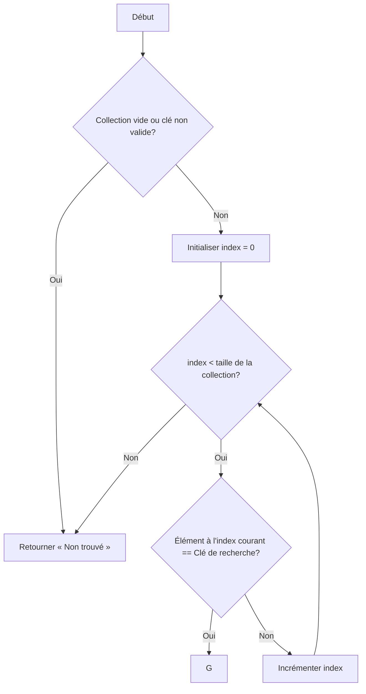

## Introduction: L'art de trouver l'aiguille dans la botte de foin

Dans le vaste univers de l'informatique et de la science des données, la capacité à localiser rapidement une information spécifique au sein d'un ensemble potentiellement gigantesque est une compétence fondamentale. Que ce soit pour retrouver un contact dans un annuaire téléphonique numérique, un fichier sur un disque dur, un article sur le web, ou une transaction particulière dans une base de données financière, nous sommes constamment confrontés à des problèmes de recherche. Cette quête de l'élément désiré, souvent comparée à la recherche d'une aiguille dans une botte de foin, est au cœur de nombreuses applications et systèmes que nous utilisons quotidiennement.

L'efficacité de cette recherche n'est pas une simple commodité ; elle est une nécessité absolue. Imaginez un moteur de recherche qui prendrait plusieurs minutes pour afficher des résultats, ou une base de données bancaire qui mettrait des heures à valider une transaction. De tels systèmes seraient inutilisables. À mesure que les volumes de données augmentent de manière exponentielle – nous parlons désormais de téraoctets, pétaoctets, voire exaoctets d'informations – la conception d'algorithmes de recherche performants devient un enjeu majeur. Un algorithme inefficace peut transformer une opération triviale en un goulot d'étranglement paralysant l'ensemble d'un système.

C'est précisément l'objectif de cette leçon : vous initier aux principes fondamentaux de la recherche d'informations et à l'évaluation de l'efficacité des algorithmes qui la sous-tendent. Nous explorerons diverses méthodes, des plus simples aux plus sophistiquées, en analysant leurs mécanismes internes, leurs forces et leurs faiblesses. Vous apprendrez non seulement comment ces algorithmes fonctionnent, mais aussi comment quantifier leur performance, une compétence essentielle pour tout informaticien. Comprendre la <ConceptLink slug="complexite-algorithmique">complexité algorithmique</ConceptLink> vous permettra de choisir l'outil le plus adapté à chaque situation, d'optimiser vos propres programmes et de concevoir des solutions robustes et évolutives face aux défis du monde numérique.

Au terme de cette leçon, vous serez capable de :
*   Décrire les principes de plusieurs algorithmes de recherche courants.
*   analyser la performance de ces algorithmes en termes de temps et d'espace.
*   Identifier les conditions sous lesquelles un algorithme de recherche est plus approprié qu'un autre.
*   Apprécier l'impact du choix algorithmique sur l'efficacité globale d'un système.

Nous commencerons notre exploration par la méthode la plus intuitive et la plus directe : la recherche séquentielle.

## La Recherche Séquentielle: Pas à pas

La recherche séquentielle, également connue sous le nom de recherche linéaire, est l'algorithme de recherche le plus simple et le plus élémentaire. Son principe est d'une clarté désarmante : pour trouver un élément spécifique (la « clé de recherche ») dans une collection de données, il suffit de parcourir cette collection élément par élément, dans l'ordre, jusqu'à ce que l'élément soit trouvé ou que la fin de la collection soit atteinte.

Imaginez que vous cherchiez un livre précis dans une bibliothèque où les ouvrages ne sont pas rangés par ordre alphabétique ou par catégorie. Votre seule option serait de regarder chaque livre, l'un après l'autre, jusqu'à ce que vous trouviez celui que vous cherchez, ou que vous ayez examiné tous les livres sans succès. C'est exactement le fonctionnement de la recherche séquentielle.

**Fonctionnement étape par étape :**

1.  **Initialisation :** On commence par le premier élément de la collection.
2.  **Comparaison :** On compare l'élément courant avec la clé de recherche.
3.  **Succès :** Si l'élément courant est égal à la clé de recherche, l'algorithme s'arrête et signale que l'élément a été trouvé, retournant généralement sa position (son index).
4.  **Progression :** Si l'élément courant n'est pas égal à la clé de recherche, on passe à l'élément suivant de la collection.
5.  **Échec :** Si tous les éléments de la collection ont été examinés et que la clé de recherche n'a pas été trouvée, l'algorithme s'arrête et signale que l'élément n'est pas présent dans la collection.

Cet algorithme peut être appliqué à n'importe quel type de collection de données, qu'il s'agisse d'un tableau (liste), d'une liste chaînée, ou même d'un fichier texte, tant que les éléments peuvent être accédés séquentiellement.

Voici une représentation schématique du processus de recherche séquentielle :

[[WIDGET:Mermaid:sequential_search_flowchart]]


Description: Diagramme de flux illustrant les étapes de l'algorithme de recherche séquentielle, de l'initialisation à la décision de trouver ou non l'élément.

**Avantages de la Recherche Séquentielle :**

*   **Simplicité :** C'est l'un des algorithmes les plus faciles à comprendre et à implémenter. Il ne nécessite que quelques lignes de code dans la plupart des langages de programmation.
*   **Pas de prérequis sur les données :** Contrairement à d'autres algorithmes de recherche plus avancés (que nous verrons plus tard), la recherche séquentielle ne nécessite pas que la collection de données soit triée. Les éléments peuvent être dans n'importe quel ordre.
*   **Applicabilité universelle :** Elle fonctionne sur n'importe quel type de structure de données linéaire (tableaux, listes chaînées, etc.) et pour n'importe quel type d'éléments comparables.

**Inconvénients de la Recherche Séquentielle :**

Malgré sa simplicité, la recherche séquentielle souffre d'un inconvénient majeur qui limite son utilisation dans de nombreux contextes : sa performance.

*   **Performance sur de grands ensembles de données :** C'est là que la recherche séquentielle montre ses limites.
    *   **Meilleur cas :** Si la clé de recherche est le tout premier élément de la collection, une seule comparaison est nécessaire. C'est le scénario le plus rapide.
    *   **Pire cas :** Si la clé de recherche est le dernier élément de la collection, ou si elle n'est pas présente du tout, l'algorithme doit parcourir *tous* les éléments de la collection. Si la collection contient `N` éléments, cela signifie `N` comparaisons.
    *   **Cas moyen :** En moyenne, si l'élément est présent et sa position est aléatoire, l'algorithme effectuera environ `N/2` comparaisons.

Pour une petite collection de quelques dizaines ou centaines d'éléments, cette différence n'est pas perceptible. Cependant, pour des collections de millions, de milliards, ou même de milliers de milliards d'éléments (comme c'est le cas dans les bases de données modernes ou sur le web), `N` comparaisons devient un nombre astronomiquement grand. Un algorithme qui nécessite `N` opérations pour une collection de `N` éléments est dit avoir une <ConceptLink slug="complexite-temporelle">complexité temporelle</ConceptLink> linéaire, notée `O(N)`. Cela signifie que le temps d'exécution augmente proportionnellement à la taille de l'entrée. Pour des applications exigeant des réponses rapides sur de vastes ensembles de données, la recherche séquentielle est donc inadaptée.

En résumé, bien que la recherche séquentielle soit un excellent point de départ pour comprendre les principes de la recherche algorithmique, sa faible performance sur de grands volumes de données nous pousse à explorer des méthodes plus sophistiquées et efficaces, qui seront le sujet de nos prochaines discussions.

La performance limitée de la recherche séquentielle sur des volumes de données importants nous contraint à explorer des approches plus ingénieuses. L'une des méthodes les plus fondamentales et efficaces pour la recherche est la recherche dichotomique, également connue sous le nom de recherche binaire.

## La Recherche Dichotomique: Diviser pour régner

Contrairement à la recherche séquentielle qui parcourt les éléments un par un, la **recherche dichotomique** adopte une stratégie radicalement différente, inspirée du principe « diviser pour régner ». Son efficacité repose sur une condition préalable essentielle et non négociable : les données dans lesquelles la recherche est effectuée doivent impérativement être **triées**. Sans cette condition, l'algorithme ne peut garantir ni sa correction ni son efficacité.

Imaginez que vous cherchiez un mot dans un dictionnaire. Vous n'allez pas feuilleter page par page depuis le début (recherche séquentielle). Au lieu de cela, vous ouvrez le dictionnaire approximativement au milieu. Si le mot que vous cherchez est alphabétiquement avant la page ouverte, vous ignorez toute la seconde moitié du dictionnaire et vous concentrez sur la première moitié. Si le mot est après, vous ignorez la première moitié. Vous répétez ce processus, divisant à chaque fois l'espace de recherche par deux, jusqu'à trouver le mot ou déterminer qu'il n'est pas présent. C'est précisément le principe de la recherche dichotomique.

**Mécanisme de l'algorithme :**

1.  **Initialisation :** L'algorithme commence par définir un intervalle de recherche qui couvre l'intégralité du tableau trié. Cet intervalle est délimité par un indice `début` (généralement 0) et un indice `fin` (la taille du tableau moins 1).
2.  **Calcul du Milieu :** À chaque étape, l'algorithme calcule l'indice du milieu de l'intervalle courant : `milieu = (début + fin) / 2` (en prenant la partie entière).
3.  **Comparaison :** L'élément à l'indice `milieu` est comparé à la clé de recherche.
    *   **Cas 1 :** Si l'élément au `milieu` est égal à la clé de recherche, l'élément est trouvé, et l'algorithme retourne l'indice `milieu`.
    *   **Cas 2 :** Si l'élément au `milieu` est **plus petit** que la clé de recherche, cela signifie que la clé, si elle existe, doit se trouver dans la **seconde moitié** de l'intervalle (puisque le tableau est trié). L'algorithme ajuste alors l'intervalle de recherche en déplaçant `début` à `milieu + 1`.
    *   **Cas 3 :** Si l'élément au `milieu` est **plus grand** que la clé de recherche, la clé, si elle existe, doit se trouver dans la **première moitié** de l'intervalle. L'algorithme ajuste l'intervalle de recherche en déplaçant `fin` à `milieu - 1`.
4.  **Réduction de l'Espace de Recherche :** Le processus est répété tant que l'intervalle de recherche est valide (c'est-à-dire tant que `début <= fin`). À chaque itération, l'espace de recherche est divisé par deux.
5.  **Échec de la Recherche :** Si l'intervalle de recherche devient vide (`début > fin`), cela signifie que la clé de recherche n'est pas présente dans le tableau, et l'algorithme se termine en indiquant un échec.

Cette division systématique de l'intervalle de recherche permet une réduction extrêmement rapide de l'espace de recherche. Pour un tableau de `N` éléments, après une comparaison, il reste `N/2` éléments potentiels. Après deux comparaisons, il en reste `N/4`, et ainsi de suite. Le nombre d'étapes nécessaires pour trouver un élément (ou déterminer son absence) est proportionnel au logarithme de `N` (base 2), noté `log₂N`. C'est une amélioration spectaculaire par rapport à la recherche séquentielle, surtout pour de très grands ensembles de données.

Par exemple, pour un tableau de 1 million d'éléments (`N = 1 000 000`), la recherche séquentielle pourrait nécessiter jusqu'à 1 million de comparaisons. La recherche dichotomique, en revanche, ne nécessiterait qu'environ `log₂(1 000 000)` comparaisons, soit environ 20 comparaisons (`2^19 ≈ 500 000`, `2^20 ≈ 1 000 000`). L'écart de performance est colossal et justifie pleinement l'effort de trier les données si de multiples recherches doivent être effectuées.

[[WIDGET:Mermaid:binary_search_flowchart]]
```mermaid
graph TD
    A[Début] --> B{Tableau trié et Clé de recherche};
    B --> C[Initialiser: début = 0, fin = taille_tableau - 1];
    C --> D{début <= fin ?};
    D -- Oui --> E[milieu = (début + fin) / 2];
    E --> F{Tableau[milieu] == Clé ?};
F -- Oui --> G;
    F -- Non --> H{Tableau[milieu] < Clé ?};
    H -- Oui --> I[début = milieu + 1];
    I --> D;
    H -- Non --> J[fin = milieu - 1];
    J --> D;
    D -- Non --> K[Retourner « Non trouvé »];
    K --> L[Fin];
    G --> L;
```

Description: Diagramme de flux illustrant les étapes de l'algorithme de recherche dichotomique, mettant en évidence la division de l'intervalle de recherche à chaque itération.

La recherche dichotomique est un exemple éloquent de la manière dont une conception algorithmique astucieuse, exploitant les propriétés des données (ici, le tri), peut transformer radicalement l'efficacité d'une opération. Cependant, cette efficacité accrue s'accompagne d'un coût initial : le tri des données, qui lui-même est une opération dont la complexité doit être prise en compte. Pour comprendre et comparer ces « coûts », nous devons formaliser la notion de complexité algorithmique.

## Mesurer l'efficacité: Introduction à la Complexité Algorithmique

L'efficacité d'un algorithme est une préoccupation centrale en informatique. Un algorithme « correct » qui prendrait des années à s'exécuter pour des données de taille raisonnable serait considéré comme inutile. Pour évaluer cette efficacité de manière objective et indépendante de la machine ou du langage de programmation, nous utilisons la notion de **complexité algorithmique**.

La complexité algorithmique mesure la quantité de ressources (temps ou espace mémoire) qu'un algorithme nécessite pour s'exécuter en fonction de la taille de son entrée. On distingue principalement deux types de complexité :

1.  **Complexité Temporelle :** Elle quantifie le temps d'exécution de l'algorithme. Ce n'est pas une mesure en secondes (qui dépendrait du processeur), mais plutôt une estimation du nombre d'opérations élémentaires (comparaisons, affectations, opérations arithmétiques) effectuées par l'algorithme. L'objectif est de comprendre comment ce nombre d'opérations croît à mesure que la taille des données d'entrée (`N`) augmente.
2.  **Complexité Spatiale :** Elle quantifie la quantité de mémoire (RAM) utilisée par l'algorithme pendant son exécution. Cela inclut l'espace pour stocker les données d'entrée, les variables auxiliaires, les structures de données temporaires, et la pile d'appels de fonctions. Comme pour la complexité temporelle, on s'intéresse à la croissance de cet espace en fonction de `N`.

Pour exprimer cette croissance de manière standardisée, les informaticiens utilisent la **notation Grand O (O-notation)**, également appelée notation de Landau. La notation Grand O fournit une borne supérieure asymptotique sur la croissance d'une fonction. En termes plus simples, elle décrit comment le temps d'exécution (ou l'espace mémoire) d'un algorithme se comporte dans le pire des cas lorsque la taille de l'entrée (`N`) devient très grande. Elle ignore les facteurs constants et les termes d'ordre inférieur, car ce qui importe le plus pour de grandes valeurs de `N` est le terme qui croît le plus rapidement.

Par exemple, si un algorithme effectue `3N² + 2N + 5` opérations, la notation Grand O se concentrera sur `N²`, car pour un `N` très grand, `3N²` dominera largement `2N` et `5`. On écrirait alors `O(N²)`.

Voici quelques exemples courants de complexité temporelle, classés par ordre croissant d'inefficacité pour de grandes valeurs de `N` :

*   **O(1) - Complexité Constante :** Le temps d'exécution est indépendant de la taille de l'entrée. Le nombre d'opérations reste le même, quelle que soit la valeur de `N`.
    *   *Exemple :* Accéder à un élément spécifique d'un tableau par son index (ex: `tableau[5]`). Quelle que soit la taille du tableau, cette opération prend un temps constant.
*   **O(log N) - Complexité Logarithmique :** Le temps d'exécution croît très lentement avec la taille de l'entrée. C'est le cas de la recherche dichotomique. Doubler la taille de l'entrée n'augmente le temps d'exécution que d'une petite quantité constante.
    *   *Exemple :* Recherche dichotomique dans un tableau trié.
*   **O(N) - Complexité Linéaire :** Le temps d'exécution croît proportionnellement à la taille de l'entrée. Si `N` double, le temps d'exécution double également.
    *   *Exemple :* Recherche séquentielle dans un tableau non trié. Parcourir une liste pour trouver le maximum.
*   **O(N log N) - Complexité Linéarithmique :** Le temps d'exécution croît un peu plus vite que linéaire, mais beaucoup moins vite que quadratique. C'est une complexité très courante pour les algorithmes de tri efficaces.
    *   *Exemple :* Algorithmes de tri comme le tri fusion (Merge Sort) ou le tri rapide (Quick Sort) dans le cas moyen.
*   **O(N²) - Complexité Quadratique :** Le temps d'exécution croît proportionnellement au carré de la taille de l'entrée. Si `N` double, le temps d'exécution est multiplié par quatre. Ces algorithmes deviennent rapidement impraticables pour de grandes valeurs de `N`.
    *   *Exemple :* Algorithmes de tri simples comme le tri à bulles (Bubble Sort) ou le tri par sélection (Selection Sort), qui impliquent souvent des boucles imbriquées parcourant `N` éléments `N` fois.
*   **O(2^N) - Complexité Exponentielle :** Le temps d'exécution croît de manière exponentielle avec la taille de l'entrée. Ces algorithmes sont généralement inutilisables pour `N` supérieur à une vingtaine ou une trentaine.
    *   *Exemple :* Calcul récursif naïf de la suite de Fibonacci, ou résolution de certains problèmes par force brute.

Comprendre la complexité algorithmique est fondamental pour tout informaticien. Cela permet de choisir l'algorithme le plus adapté à un problème donné, en fonction des contraintes de performance et de la taille attendue des données. La notation Grand O nous offre un langage commun et rigoureux pour discuter et comparer l'efficacité des solutions algorithmiques.

## Performance Comparée: Séquentielle vs. Dichotomique

La notation Grand O, ou complexité asymptotique, est l'outil fondamental pour évaluer et comparer l'efficacité des algorithmes. Appliquée aux algorithmes de recherche, elle révèle une différence de performance majeure entre la recherche séquentielle et la recherche dichotomique. La recherche séquentielle affiche une complexité temporelle de `O(N)`, tandis que la recherche dichotomique, sous certaines conditions, atteint une performance bien supérieure de `O(log N)`. Cette distinction est cruciale pour comprendre leur pertinence selon la taille des données et les exigences de performance.

**Comparaison Théorique des Performances**

*   **Recherche Séquentielle (O(N)) :** Cet algorithme examine chaque élément de la collection, un par un, jusqu'à ce que l'élément recherché soit trouvé ou que toute la collection ait été parcourue. Dans le pire des cas (l'élément est le dernier ou absent), le nombre d'opérations est directement proportionnel à la taille `N` de la collection. Si la taille de la collection double, le temps de recherche double également. Sa performance est linéaire.
*   **Recherche Dichotomique (O(log N)) :** Cet algorithme opère sur le principe de « diviser pour régner ». À chaque étape, il élimine la moitié de l'espace de recherche restant. Le nombre d'opérations est proportionnel au logarithme (généralement en base 2) de la taille `N` de la collection. Cela implique une croissance très lente du temps d'exécution par rapport à `N`. Par exemple, pour une collection de 1 024 éléments, la recherche dichotomique nécessitera au maximum 10 comparaisons (`log₂1024 = 10`). Pour un million d'éléments, elle n'en nécessitera qu'une vingtaine (`log₂1 000 000 ≈ 19.9`).

L'écart de performance entre `O(N)` et `O(log N)` devient exponentiellement plus grand à mesure que `N` augmente. Pour de petites collections, les constantes de temps d'exécution peuvent masquer cette différence, mais pour des `N` élevés, la recherche dichotomique est incomparablement plus rapide.

**Impact du Tri Préalable**

La performance exceptionnelle de la recherche dichotomique est conditionnée par une exigence stricte : la collection de données doit impérativement être **triée**. Si les données ne sont pas déjà dans un ordre croissant ou décroissant, elles doivent être triées avant d'appliquer l'algorithme de recherche dichotomique.

Le coût d'un tri efficace est généralement `O(N log N)` (par exemple, avec le tri fusion ou le tri rapide). Si l'on ne doit effectuer qu'une seule recherche sur une collection non triée, le coût total serait `O(N log N)` (pour le tri) + `O(log N)` (pour la recherche), ce qui est asymptotiquement dominé par `O(N log N)`. Dans ce scénario, une recherche séquentielle en `O(N)` serait plus efficace, car `N` est asymptotiquement inférieur à `N log N`.

Cependant, si la collection est triée une fois et que de nombreuses recherches (`M` recherches) sont effectuées par la suite, le coût total devient `O(N log N)` (tri initial) + `M * O(log N)` (recherches). Si `M` est suffisamment grand, ce coût sera largement inférieur à `M * O(N)` (le coût de `M` recherches séquentielles). C'est pourquoi la recherche dichotomique est le choix privilégié pour les collections statiques ou peu modifiées qui sont soumises à de multiples requêtes de recherche.

**Scénarios de Préférence**

*   **La recherche séquentielle est préférable quand :**
    *   La collection de données est de **petite taille** (`N` est faible). Les frais généraux (constantes) de la recherche dichotomique peuvent alors rendre la séquentielle plus rapide en pratique.
    *   La collection n'est **pas triée** et ne sera recherchée qu'un **petit nombre de fois** (le coût du tri n'est pas amorti).
    *   La structure de données sous-jacente ne permet pas un **accès aléatoire** aux éléments (par exemple, une liste chaînée simple), rendant la dichotomique inapplicable.
    *   L'élément recherché est souvent susceptible d'être trouvé au **début de la collection**.
*   **La recherche dichotomique est préférable quand :**
    *   La collection de données est de **grande taille** (`N` est élevé). L'avantage asymptotique de `O(log N)` devient alors prépondérant.
    *   La collection est **déjà triée** ou sera triée une fois pour être soumise à de **nombreuses recherches** ultérieures.
    *   La **performance de recherche** est une contrainte critique de l'application.

[[WIDGET:Mermaid:binary_vs_sequential_perf]]
```mermaid
graph TD
    A[Démarrer] --> B{Données triées ?};
    B -- Oui --> C{Nombre de recherches élevé ?};
    B -- Non --> D{Taille de la collection N est petite ?};
    C -- Oui --> E[Recherche Dichotomique (O(log N))];
    C -- Non --> F[Recherche Séquentielle (O(N))];
    D -- Oui --> F;
    D -- Non --> G{Coût du tri amorti par recherches futures ?};
    G -- Oui --> H[Trier (O(N log N)) puis Recherche Dichotomique];
    G -- Non --> F;
```


## Cas Pratiques et Limitations

La décision d'utiliser la recherche séquentielle ou dichotomique ne repose pas uniquement sur leur complexité théorique, mais aussi sur des considérations pratiques liées aux caractéristiques des données, aux contraintes de performance et aux opérations attendues.

**Scénarios d'Application Concrets**

*   **Recherche Séquentielle :**
    *   **Parcours de fichiers de configuration :** Dans un petit fichier où les paramètrès ne sont pas triés, chercher une clé spécifique.
    *   **Vérification d'existence dans une liste temporaire :** Par exemple, vérifier si un élément nouvellement généré existe déjà dans une liste courte et non ordonnée.
    *   **Recherche dans une liste chaînée simple :** Par nature, ces structures ne permettent pas l'accès direct par index, forçant un parcours séquentiel.
*   **Recherche Dichotomique :**
    *   **Annuaire téléphonique ou dictionnaire numérique :** La recherche d'un nom ou d'un mot dans une liste alphabétique est l'exemple classique.
    *   **Index de base de données :** Les systèmes de gestion de bases de données utilisent des structures arborescentes (comme les B-arbres) qui s'appuient sur des principes de recherche dichotomique pour localiser rapidement des enregistrements.
    *   **Recherche de pages dans un livre :** Utiliser la table des matières ou l'index pour trouver une information spécifique.
    *   **Débogage par dichotomie (binary search debugging) :** Une technique pour isoler rapidement la version d'un logiciel où un bug a été introduit, en testant des points médians dans l'historique des versions.

**Compromis : Coût du Tri vs. Rapidité de Recherche**

Le compromis central est l'investissement initial dans le tri. Si une collection de `N` éléments doit être triée (en `O(N log N)`) avant d'effectuer `M` recherches (chacune en `O(log N)`), le coût total est `O(N log N + M log N)`. En comparaison, `M` recherches séquentielles sur une collection non triée coûtent `O(M * N)`.

*   Si `M` est très petit (par exemple, `M=1`), le coût `O(N log N)` du tri est généralement plus élevé que `O(N)` pour une recherche séquentielle directe.
*   Si `M` est grand, `M log N` devient rapidement beaucoup plus petit que `M N`, rendant l'investissement initial dans le tri très rentable. Le seuil de rentabilité dépend de la taille `N` et des constantes d'exécution, mais l'avantage de la dichotomique pour de nombreuses recherches est indéniable.

**Limitations des Algorithmes de Recherche Séquentielle et Dichotomique**

Ces algorithmes, bien que fondamentaux, ont des limitations importantes :

*   **Recherche Séquentielle :** Son inefficacité pour les grandes collections est sa principale faiblesse, la rendant impraticable pour des volumes de données importants.
*   **Recherche Dichotomique :**
    *   **Exigence de données triées :** C'est une condition *sine qua non*. Maintenir une collection triée lors d'insertions ou de suppressions fréquentes peut être coûteux, car cela pourrait nécessiter de décaler de nombreux éléments ou de re-trier.
    *   **Accès aléatoire :** Nécessite une structure de données permettant un accès direct et rapide à n'importe quel élément par son index (comme un tableau ou un vecteur). Elle n'est pas adaptée aux structures comme les listes chaînées simples où l'accès au `k`-ième élément prend `O(k)` temps.
    *   **Non-adaptée aux données dynamiques :** Si la collection est fréquemment modifiée (ajouts, suppressions), le coût de re-tri ou de maintien de l'ordre peut annuler les bénéfices de la recherche rapide.

**Quand d'Autres Approches ou Structures de Données Sont Plus Appropriées**

Lorsque les limitations des recherches séquentielle et dichotomique deviennent des obstacles majeurs, d'autres structures de données et algorithmes sont nécessaires :

*   **Tables de hachage (Hash Tables) :** Offrent des recherches, insertions et suppressions en temps `O(1)` en moyenne, sans exigence d'ordre. Elles sont idéales lorsque l'on a besoin d'une performance quasi-constante pour ces opérations.
*   **Arbres binaires de recherche (Binary Search Trees - BST) :** Permettent des recherches, insertions et suppressions en `O(log N)` en moyenne, tout en maintenant les données dans un ordre logique. Des variantes auto-équilibrées (comme les arbres AVL ou Rouge-Noir) garantissent cette complexité même dans le pire des cas.
*   **B-Arbres :** Spécifiquement conçus pour optimiser les accès disque dans les bases de données, où le coût d'une opération d'E/S est bien plus élevé que celui d'une opération en mémoire.
*   **Tries (Arbres préfixes) :** Particulièrement efficaces pour la recherche de chaînes de caractères avec des préfixes communs, comme dans les dictionnaires ou les systèmes de complétion automatique.

Ces structures avancées offrent des compromis différents en termes de complexité temporelle, spatiale et de flexibilité, permettant de répondre à un éventail plus large de problèmes informatiques complexes.

## Conclusion
Au terme de cette exploration des fondements de la recherche algorithmique, nous avons mis en lumière deux approches cardinales : la recherche séquentielle et la recherche dichotomique. La première, d'une simplicité conceptuelle déconcertante, procède par examen exhaustif des éléments, se traduisant par une complexité temporelle linéaire en `O(N)`. Elle est la méthode de prédilection pour les collections de petite taille ou les scénarios où l'ordre des données est indifférent ou non maintenu. La seconde, la recherche dichotomique, incarne l'élégance de la division pour régner. En exploitant l'ordre intrinsèque des données, elle réduit drastiquement l'espace de recherche à chaque itération, atteignant une efficacité logarithmique en `O(log N)`. Cette performance supérieure la positionne comme un choix incontournable pour les ensembles de données volumineux et statiques, où le coût initial du tri est amorti par la fréquence des requêtes.

L'analyse de la complexité algorithmique, exprimée par la notation Grand O, s'est révélée être le fil rouge de notre démarche. Plus qu'une simple métrique théorique, elle constitue un outil prédictif indispensable pour évaluer la performance et la scalabilité d'un algorithme face à des volumes de données croissants. Comprendre qu'une différence entre `O(N)` et `O(log N)` peut signifier des secondes contre des années d'exécution pour des `N` suffisamment grands, c'est saisir l'enjeu fondamental de l'ingénierie logicielle. Cette discipline nous permet de comparer objectivement des solutions, de justifier des choix de conception et d'anticiper les goulots d'étranglement potentiels. Elle est la boussole qui guide le développeur vers des solutions robustes et efficaces, capables de s'adapter aux exigences fluctuantes des systèmes informatiques modernes.

Cependant, notre étude a également souligné que même les algorithmes fondamentaux, aussi optimisés soient-ils, ne sont pas universellement applicables. Les limitations inhérentes à la recherche séquentielle (inefficacité sur de grands ensembles) et à la recherche dichotomique (nécessité de données triées, accès aléatoire, inadaptation aux données dynamiques) nous ont conduits à entrevoir la nécessité d'approches plus sophistiquées. C'est dans ce contexte que des structures de données avancées comme les tables de hachage, les arbres binaires de recherche (et leurs variantes auto-équilibrées), les B-arbres ou les Tries prennent tout leur sens. Elles représentent des réponses ingénieuses aux défis posés par la gestion de données dynamiques, les contraintes de performance spécifiques ou les particularités des types de données (comme les chaînes de caractères).

Il devient alors évident qu'il n'existe pas d'algorithme de recherche universellement « meilleur ». Le choix de l'algorithme le plus adapté est une décision contextuelle, dictée par une analyse rigoureuse des caractéristiques du problème à résoudre. Cette analyse doit prendre en compte plusieurs facteurs cruciaux : la taille des données (`N`), la fréquence relative des opérations (recherches, insertions, suppressions), la nature des données (statiques ou dynamiques, triées ou non), les contraintes de mémoire et les exigences de performance (temps de réponse moyen, pire des cas). Chaque algorithme et chaque structure de données représente un compromis entre la complexité temporelle, la complexité spatiale et la facilité d'implémentation. Un algorithme optimal pour un scénario donné pourrait être catastrophique pour un autre, soulignant l'importance de la pensée critique et de la modélisation avant toute implémentation.

[[WIDGET:Mermaid:decision_search_algo]]
Diagramme de décision simplifié pour le choix d'un algorithme ou d'une structure de données de recherche.

Les principes que nous avons explorés dans cette leçon ne sont que la pointe de l'iceberg de l'algorithmique. Au-delà des recherches d'éléments dans des collections linéaires ou arborescentes, le domaine de la recherche s'étend à des problématiques bien plus vastes. Les algorithmes de recherche sur les graphes, tels que la recherche en largeur d'abord (BFS) ou en profondeur d'abord (DFS), ainsi que des algorithmes plus sophistiqués comme Dijkstra ou A*, sont fondamentaux pour la résolution de problèmes de cheminement, de connectivité ou de planification dans des réseaux complexes. La recherche de motifs dans des chaînes de caractères, avec des algorithmes comme Knuth-Morris-Pratt ou Boyer-Moore, est essentielle pour le traitement de texte et la bio-informatique. Enfin, les techniques de recherche heuristique et d'optimisation, souvent rencontrées en intelligence artificielle, visent à trouver des solutions acceptables (sinon optimales) dans des espaces de recherche gigantesques. L'étude de ces domaines avancés révélera la richesse et la diversité des stratégies algorithmiques disponibles pour aborder des défis informatiques toujours plus complexes.

Il est impératif de souligner une fois de plus la symbiose indissociable entre les algorithmes et les structures de données. Un algorithme n'est jamais isolé ; son efficacité est intrinsèquement liée à la manière dont les données qu'il manipule sont organisées. Choisir la bonne structure de données, c'est souvent pré-optimiser le problème, en rendant certaines opérations triviales ou en réduisant drastiquement la complexité d'un algorithme. Une structure de données bien pensée peut transformer un problème apparemment insoluble en une tâche gérable, en exploitant les propriétés inhérentes aux données et aux opérations requises. C'est cette interaction subtile et puissante qui constitue le cœur de l'ingénierie logicielle performante.

En conclusion, cette leçon sur la recherche et la complexité algorithmique n'est pas seulement une introduction à des techniques spécifiques, mais une invitation à développer une véritable « pensée algorithmique ». Face à tout nouveau problème, l'ingénieur en informatique doit se poser les questions fondamentales : quelles sont les caractéristiques des données ? Quelles opérations seront les plus fréquentes ? Quelles sont les exigences de performance et de scalabilité ? Y a-t-il des compromis à faire entre le temps d'exécution et l'utilisation de la mémoire ? La maîtrise de ces concepts fondamentaux et la capacité à choisir l'outil algorithmique le plus approprié sont des compétences essentielles qui distingueront les professionnels capables de concevoir des systèmes efficaces et durables. Le cheminement dans le monde de l'algorithmique est un apprentissage continu, riche en découvertes et en défis intellectuels, qui ne fait que commencer avec cette première immersion.

[[WIDGET:conclusionSummary]]
[[WIDGET:whatsNext]]
[[WIDGET:goingFurther]]
[[WIDGET:finalEvaluation]]
