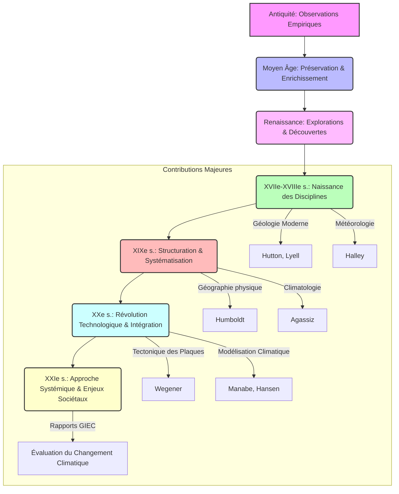

## Introduction : Cadre épistémologique et historique
Ce cours, « Genèse et évolution des sciences de la Terre et du climat », se propose d'explorer les fondements historiques et épistémologiques de deux disciplines scientifiques majeures : la géographie physique et la climatologie. Loin d'être une simple énumération de faits et de découvertes, notre démarche vise à comprendre comment ces champs de savoirs se sont constitués, ont évolué, et continuent de se transformer sous l'impulsion de nouvelles observations, de paradigmes théoriques émergents et d'avancées technologiques. L'objectif est de retracer cette genèse complexe, depuis les premières interrogations humaines face aux phénomènes naturels jusqu'aux modèles sophistiqués de la science contemporaine, en passant par les ruptures conceptuelles et les continuités intellectuelles qui ont jalonné leur parcours.

La [[WIDGET:ConceptLink:geographie_physique:géographie physique]] est la branche de la géographie qui étudie les processus et les formes naturelles de la surface terrestre. Elle englobe des sous-disciplines telles que la géomorphologie (étude des reliefs), l'hydrologie (étude de l'eau), la biogéographie (étude de la répartition des espèces), la pédologie (étude des sols) et, bien sûr, la climatologie. Son champ d'investigation est vaste, allant de l'analyse des dynamiques fluviales et glaciaires à la compréhension de la formation des montagnes et des océans, en passant par l'étude des écosystèmes terrestres. Comme le soulignent Strahler et Strahler (2006) [[WIDGET:Citation:2]], la géographie physique cherche à expliquer la distribution spatiale des phénomènes naturels et leurs interactions, offrant une perspective holistique sur l'environnement terrestre.

La [[WIDGET:ConceptLink:climatologie:climatologie]], quant à elle, est la science qui étudie le climat, c'est-à-dire l'ensemble des conditions météorologiques moyennes et extrêmes caractérisant une région donnée sur une longue période. Elle s'intéresse aux processus atmosphériques, aux bilans énergétiques, aux cycles de l'eau et du carbone, ainsi qu'aux interactions complexes entre l'atmosphère, les océans, les surfaces continentales et la biosphère. Viers (1990) [[WIDGET:Citation:4]] met en évidence la nécessité de distinguer la climatologie de la météorologie, cette dernière se concentrant sur les phénomènes atmosphériques à court terme. La climatologie, en revanche, analyse les régimes climatiques, leurs variations naturelles et anthropiques, et leurs impacts sur les systèmes terrestres et humains. Dans le contexte actuel, la compréhension du changement climatique global, tel que documenté par le GIEC (2021) [[WIDGET:Citation:6]], place la climatologie au cœur des préoccupations scientifiques et sociétales.

Notre approche sera résolument épistémologique et historique. L'[[WIDGET:Glossary:epistemologie:épistémologie]], ou philosophie des sciences, nous permettra d'examiner comment les connaissances en géographie physique et en climatologie ont été construites, validées et parfois remises en question. Nous nous interrogerons sur la nature des preuves, la validité des méthodes, l'influence des cadres conceptuels et des instruments sur la production du savoir. Il ne s'agit pas seulement de savoir *ce* qui a été découvert, mais *comment* cela a été découvert et *pourquoi* certaines idées ont prévalu sur d'autres à des moments donnés de l'histoire. Cette perspective critique est essentielle pour comprendre la robustesse et les limites de nos connaissances actuelles. L'approche historique, quant à elle, nous plongera dans le contexte social, culturel et technologique dans lequel ces sciences ont émergé et se sont développées. Elle montrera que la science n'est jamais un processus linéaire et isolé, mais qu'elle est profondément ancrée dans son époque, influencée par les visions du monde, les besoins des sociétés et les outils disponibles. En retraçant cette trajectoire, nous mettrons en lumière les continuités, les ruptures, les erreurs et les géniales intuitions qui ont façonné notre compréhension de la Terre et de son climat.

Ce cours est donc une invitation à une réflexion profonde sur la nature de la connaissance scientifique elle-même, à travers le prisme des sciences de la Terre et du climat. Il s'adresse aux étudiants de L3 en géographie, leur offrant les clés pour appréhender la complexité de leur discipline et les défis qu'elle doit relever face aux enjeux environnementaux contemporains.
## Des Premières Observations aux Savoirs Antiques et Médiévaux

L'histoire de la compréhension des phénomènes terrestres et climatiques est aussi ancienne que l'humanité elle-même. Dès l'aube des civilisations, les sociétés humaines ont cherché à interpréter les rythmes de la nature – les crues des fleuves, les cycles des saisons, les mouvements des astres, les tremblements de terre – pour assurer leur survie, organiser l'agriculture et donner un sens au monde qui les entourait. Ces premières tentatives, souvent mêlées de mythes et de croyances religieuses, constituent les prémices de ce qui deviendra plus tard la géographie physique et la climatologie.

Dans les civilisations de la **Mésopotamie** et de l'**Égypte ancienne**, l'observation des phénomènes naturels était intrinsèquement liée aux impératifs agricoles et à l'organisation sociale. Les crues annuelles du Nil, par exemple, étaient d'une importance capitale pour l'agriculture égyptienne. Les prêtrès et les scribes développèrent des systèmes d'observation précis pour prédire ces crues, établissant des calendriers basés sur les cycles lunaires et solaires. Bien que ces connaissances fussent empiriques et pragmatiques, elles démontrent une capacité d'observation systématique et une tentative de corrélation entre les événements célestes et terrestres. Les Mésopotamiens, quant à eux, ont laissé des milliers de tablettes d'argile documentant des observations astronomiques détaillées, qui servaient également à des fins divinatoires et calendaires, mais qui posaient les bases d'une compréhension des cycles naturels.

C'est avec la **Grèce antique** que l'on assiste à l'émergence d'une pensée plus systématique et rationnelle, cherchant à expliquer le monde par des principes naturels plutôt que par des interventions divines. Les philosophes présocratiques, tels que [[WIDGET:RealPerson:thales:Thalès de Milet]] (VIe siècle av. J.-C.), sont souvent considérés comme les premiers à avoir tenté d'expliquer les phénomènes naturels sans recourir au surnaturel. Thalès aurait postulé que l'eau était l'élément primordial de toutes choses, une première tentative d'unification des phénomènes naturels. [[WIDGET:RealPerson:anaximandre:Anaximandre]] (VIe siècle av. J.-C.), son disciple, proposa une cosmologie où la Terre était un cylindre flottant dans l'espace, et tenta d'expliquer les phénomènes météorologiques comme le tonnerre et les éclairs.

[[WIDGET:RealPerson:herodote:Hérodote]] (Ve siècle av. J.-C.), souvent appelé le « père de l'histoire », fut aussi un géographe avant l'heure. Ses « Histoires » contiennent de nombreuses descriptions de paysages, de climats et de peuples, notamment une analyse détaillée du Nil et de ses crues, qu'il attribue à des causes naturelles (vents égyptiens empêchant l'eau de la mer de remonter le fleuve) plutôt qu'à des interventions divines. Il décrit également les variations climatiques entre différentes régions, posant les bases d'une géographie descriptive.

Cependant, c'est [[WIDGET:RealPerson:aristote:Aristote]] (IVe siècle av. J.-C.) qui a eu l'impact le plus profond et durable sur la pensée occidentale concernant les sciences de la Terre et du climat. Son œuvre « Météorologiques » (ou « Météorologie ») est considérée comme le premier traité systématique sur les phénomènes atmosphériques et terrestres. Dans cet ouvrage, Aristote aborde une multitude de sujets : la formation des nuages et de la pluie, le vent, la foudre, les tremblements de terre, les comètes, les rivières et les mers. Il y développe une vision du monde basée sur quatre éléments (terre, eau, air, feu) et quatre qualités (chaud, froid, sec, humide), qui interagissent pour produire les phénomènes naturels. Il postule l'existence de zones climatiques (torride, tempérées, froides) basées sur l'inclinaison des rayons solaires, une idée qui perdurera pendant des siècles. Bien que beaucoup de ses explications fussent erronées au regard de la science moderne (par exemple, sa théorie des exhalaisons terrestres pour expliquer les vents et les tremblements de terre), son approche systématique et sa tentative de classification ont marqué un tournant. Son influence fut telle qu'elle domina la pensée scientifique pendant près de deux millénaires.

[[WIDGET:HistoricalAnecdote:aristote_meteorologica]]
Aristote, dans sa « Météorologie », ne se contentait pas d'observations. Il tentait d'expliquer des phénomènes complexes comme la formation des arcs-en-ciel, la rosée ou la grêle. Il pensait que les tremblements de terre étaient causés par des vents emprisonnés sous la terre, cherchant à s'échapper. Bien que cette explication soit fausse, elle illustre sa volonté de trouver des causes naturelles et mécaniques aux événements, plutôt que de les attribuer à la colère des dieux.

Un autre géant de l'Antiquité grecque fut [[WIDGET:RealPerson:eratosthene:Ératosthène]] (IIIe siècle av. J.-C.), qui est célèbre pour avoir calculé la circonférence de la Terre avec une précision remarquable pour son époque. En utilisant la géométrie et des observations de l'ombre du soleil à Syène (Assouan) et Alexandrie, il démontra non seulement que la Terre était sphérique, mais il en estima la taille, une avancée majeure pour la cartographie et la compréhension de la planète. Ses travaux, bien que plus géodésiques que purement géographiques physiques, ont jeté les bases d'une représentation plus exacte de la Terre.

La **Rome antique**, bien que moins portée sur la spéculation philosophique que la Grèce, a excellé dans l'ingénierie et l'application pratique des connaissances géographiques. Les Romains étaient d'excellents arpenteurs, constructeurs de routes, d'aqueducs et de villes, nécessitant une connaissance approfondie du terrain, de l'hydrologie et des ressources naturelles. Des auteurs comme Pline l'Ancien (Ier siècle ap. J.-C.) dans son « Histoire naturelle » ont compilé une somme considérable de connaissances sur la géographie, la zoologie, la botanique et la minéralogie, bien que souvent sans esprit critique et en mélangeant faits et légendes. Leurs contributions furent plus dans la description et l'organisation du territoire que dans l'élaboration de théories fondamentales sur les processus terrestres.

Parallèlement, d'autres civilisations développaient leurs propres corpus de savoirs. En **Chine**, les observations astronomiques et météorologiques étaient d'une précision étonnante et d'une continuité inégalée. Dès le IIe siècle av. J.-C., des registres détaillés des phénomènes météorologiques (pluie, neige, vent, sécheresse) étaient tenus. Les Chinois ont développé des instruments sophistiqués, comme le sismographe de Zhang Heng (IIe siècle ap. J.-C.), capable de détecter la direction des tremblements de terre. Ils comprenaient les mécanismes des moussons et l'influence des cycles climatiques sur l'agriculture. Leurs cartes étaient souvent très détaillées et précises, intégrant des informations topographiques et hydrologiques. La pensée chinoise, avec des concepts comme le *Feng Shui*, intégrait également une compréhension des interactions entre l'homme et son environnement, bien que sous une forme différente de la science occidentale.

[[WIDGET:Image:ancient_chinese_seismograph]]
Sismographe de Zhang Heng (IIe siècle ap. J.-C.), un exemple précoce d'instrumentation scientifique pour l'étude des phénomènes terrestres.

Avec le déclin de l'Empire romain en Occident, une grande partie des savoirs grecs fut perdue ou oubliée en Europe. Cependant, ces connaissances furent préservées, traduites et enrichies dans le **monde arabe** durant l'Âge d'or islamique (du VIIIe au XIIIe siècle). Les savants musulmans, héritiers des traditions grecques, persanes et indiennes, ont apporté des contributions majeures à l'astronomie, à la géographie et aux sciences de la Terre.
Des figures comme Al-Khwarizmi (IXe siècle) ont systématisé la géographie mathématique. Al-Biruni (Xe-XIe siècle) fut un polymathe exceptionnel, dont les travaux en géodésie lui permirent de calculer le rayon de la Terre avec une grande précision. Il a également développé des théories sur la formation des montagnes et l'érosion, reconnaissant la lenteur des processus géologiques et l'ancienneté de la Terre. Il a même suggéré que certaines terres avaient été autrefois des mers, une idée révolutionnaire pour l'époque.
Al-Idrisi (XIIe siècle), géographe et cartographe, a créé l'une des cartes du monde les plus complètes et précises de son temps, le « Tabula Rogeriana », basée sur des informations recueillies auprès de voyageurs et de marchands. Ces savants ne se contentaient pas de traduire ; ils critiquaient, corrigeaient et ajoutaient de nouvelles observations et théories, jetant les bases de l'approche scientifique moderne.

Le **Moyen Âge européen** (Ve-XVe siècle) est souvent perçu comme une période de stagnation scientifique en Occident, en particulier après la chute de l'Empire romain. La pensée était dominée par la théologie chrétienne, et les explications des phénomènes naturels étaient souvent subordonnées aux doctrines religieuses. Cependant, il serait erroné de parler d'une absence totale de savoirs. Les monastères ont joué un rôle crucial dans la préservation des textes antiques, et la scolastique a tenté de concilier la raison et la foi, intégrant parfois des éléments de la science aristotélicienne.
Les connaissances géographiques étaient principalement descriptives, basées sur les récits de pèlerins et de marchands, et souvent déformées par des considérations religieuses (par exemple, les cartes *Mappa Mundi* plaçant Jérusalem au centre du monde). La sphéricité de la Terre, bien que connue des érudits, n'était pas une idée universellement acceptée ou même jugée pertinente par tous.
Cependant, à partir du XIIe siècle, la traduction des textes arabes et grecs (souvent via l'Espagne musulmane) a progressivement réintroduit en Europe les savoirs antiques, y compris les œuvres d'Aristote et d'Ératosthène. Cette redécouverte a stimulé un renouveau intellectuel, posant les jalons pour les développements ultérieurs de la Renaissance. Les limites des connaissances de l'époque étaient principalement dues à l'absence d'instruments de mesure précis, à la difficulté des voyages et de la communication, et à un cadre conceptuel souvent contraint par des interprétations religieuses ou philosophiques dogmatiques. Néanmoins, la curiosité humaine et le besoin de comprendre le monde n'ont jamais cessé, jetant les bases, même modestes, des futures révolutions scientifiques.

[[WIDGET:Mermaid:timeline_ancient_medieval_geo_clima]]
mermaid
timeline
    title Évolution des Savoirs Géo-Climatiques (Antiquité à Moyen Âge)
    section Antiquité
        -600: Thalès de Milet (Eau comme principe)
        -580: Anaximandre (Cosmologie, Terre cylindrique)
        -450: Hérodote (Géographie descriptive, Nil)
        -350: Aristote (Météorologiques, Zones climatiques)
        -250: Ératosthène (Circonférence de la Terre)
        100: Pline l'Ancien (Histoire Naturelle)
        150: Zhang Heng (Sismographe en Chine)
    section Moyen Âge
        820: Al-Khwarizmi (Géographie mathématique)
        1000: Al-Biruni (Géodésie, Géologie)
        1154: Al-Idrisi (Tabula Rogeriana)
        1200: Redécouverte d'Aristote en Europe
        1400: Début de la Renaissance

Chronologie des figures et des contributions majeures aux sciences de la Terre et du climat de l'Antiquité au Moyen Âge.

En somme, cette période, des premières observations aux savoirs antiques et médiévaux, est caractérisée par une transition progressive de l'explication mythologique à une approche plus rationnelle et systématique. Les civilisations antiques ont posé les premières pierres de l'observation et de la classification, tandis que le monde arabe a agi comme un pont essentiel, préservant et enrichissant ces savoirs avant leur réintroduction en Europe. Les limites étaient évidentes – manque d'instruments, de méthodes expérimentales rigoureuses, et de cadres théoriques unifiés – mais la soif de connaissance et la capacité d'observation ont jeté les bases sur lesquelles les futures générations de savants allaient bâtir.

## La Révolution Scientifique et l'Émergence de la Géographie physique et de la Climatologie

Le passage du Moyen Âge à la Renaissance marque une rupture épistémologique fondamentale, jetant les bases de ce que l'on nommera plus tard la Révolution Scientifique. Cette période est caractérisée par un abandon progressif des dogmes et des spéculations métaphysiques au profit de l'observation systématique, de l'expérimentation et de la théorisation. La redécouverte des textes antiques, notamment ceux de Ptolémée, combinée aux grandes explorations maritimes, a stimulé un besoin impérieux de cartographie précise et de compréhension des phénomènes naturels. Les voyages de découverte ont non seulement élargi l'horizon géographique, mais ont aussi confronté les savants à une diversité de climats, de paysages et de faunes, remettant en question les classifications héritées et encourageant une approche empirique.

Au XVIIe et XVIIIe siècles, l'esprit des Lumières, avec son culte de la raison et de l'empirisme, a profondément influencé le développement des sciences de la Terre et du climat. Des figures emblématiques ont émergé, dont les travaux ont structuré les disciplines naissantes.

[[WIDGET:Mermaid:scientific_revolution_timeline]]
mermaid
timeline
    title Jalons de la Révolution Scientifique en Géographie et Climatologie
    section Renaissance &amp; Grandes Découvertes
        1569: Mercator (Projection cartographique)
        1620: Bacon (Empirisme, Novum Organum)
        1687: Newton (Principes mathématiques de la philosophie naturelle)
    section Lumières &amp; XVIIIe Siècle
        1749-1788: Buffon (Histoire Naturelle)
        1755: Kant (Théorie de la formation de la Terre)
        1785: Hutton (Théorie de la Terre, uniformitarisme)
    section XIXe Siècle
        1807-1862: Humboldt (Kosmos, Isothermes)
        1830-1833: Lyell (Principes de Géologie, uniformitarisme)
        1840: Agassiz (Théorie des glaciations)
        1860: Köppen (Début de la classification des climats)

Chronologie des figures et des contributions majeures aux sciences de la Terre et du climat de la Renaissance au XIXe siècle.

[[WIDGET:RealPerson:buffon:Georges-Louis Leclerc, Comte de Buffon]] (1707-1788), naturaliste et encyclopédiste français, est une figure centrale de cette période. Son œuvre monumentale, l'«Histoire Naturelle, générale et particulière», a tenté de synthétiser toutes les connaissances de son temps sur le monde naturel. Buffon a été l'un des premiers à proposer une histoire de la Terre basée sur des processus naturels, estimant son âge à des dizaines de milliers d'années, bien au-delà des chronologies bibliques. Ses travaux ont mis en lumière l'importance de l'érosion, de la sédimentation et des forces internes dans la formation des paysages, posant les prémices de la géomorphologie. Il a également abordé la question de l'influence du climat sur la distribution des espèces.

Un autre géant de cette époque est [[WIDGET:RealPerson:humboldt:Alexander von Humboldt]] (1769-1859). Considéré comme le père de la géographie physique moderne et de la climatologie, Humboldt a mené des explorations scientifiques sans précédent en Amérique du Sud. Son approche était holistique, cherchant à comprendre les interconnexions entre les phénomènes géologiques, climatiques, botaniques et zoologiques. Il a introduit le concept d'isothermes, des lignes reliant les points de même température moyenne, révolutionnant la représentation et l'analyse des climats à l'échelle mondiale. Son œuvre majeure, «Kosmos», est une tentative ambitieuse de décrire l'univers physique dans son ensemble, soulignant l'unité de la nature. [[WIDGET:Citation:2]]

[[WIDGET:Image:humboldt_isotherms]]
Carte des isothermes de Humboldt (reconstitution ou exemple typique).

[[WIDGET:HistoricalAnecdote:humboldt_chimborazo]]
Lors de son expédition en Amérique du Sud, Alexander von Humboldt a tenté l'ascension du volcan Chimborazo en 1802, atteignant une altitude alors inégalée de 5 900 mètrès. Au cours de cette ascension, il a méticuleusement enregistré les changements de végétation, de température et de pression atmosphérique avec l'altitude, démontrant l'existence de zones climatiques et écologiques distinctes le long des pentes de la montagne. Cette observation pionnière a jeté les bases de l'écologie végétale et de la biogéographie, illustrant sa vision intégrée des systèmes naturels.

Enfin, [[WIDGET:RealPerson:lyell:Charles Lyell]] (1797-1875), géologue britannique, a consolidé le principe de l'[[WIDGET:ConceptLink:uniformitarianism:Uniformitarianisme]]. Son œuvre «Principles of Geology» (1830-1833) a postulé que les processus géologiques observables aujourd'hui (érosion, volcanisme, sédimentation) ont agi de la même manière et avec la même intensité tout au long de l'histoire de la Terre. Cette idée s'opposait au catastrophisme dominant et a fourni un cadre temporel et conceptuel essentiel pour comprendre la formation des paysages et des structures géologiques. L'uniformitarisme de Lyell a eu une influence profonde sur la géomorphologie, permettant d'interpréter les formes du relief comme le résultat de processus continus et lents sur de très longues périodes. [[WIDGET:Citation:3]]

Ces figures ont contribué à l'émergence de concepts fondateurs qui ont structuré la géographie physique et la climatologie:
*   **[[WIDGET:Glossary:geomorphology:Géomorphologie]]**: L'étude des formes du relief terrestre, de leur genèse et de leur évolution. Elle s'est développée en analysant les processus d'érosion (fluviale, glaciaire, éolienne), de transport et de sédimentation.
*   **Hydrologie**: La science de l'eau, de son cycle et de sa distribution sur Terre. Les observations sur les bassins versants, le débit des rivières et les précipitations ont permis de mieux comprendre le rôle de l'eau dans le modelé du paysage.
*   **Climatologie**: Au-delà des isothermes de Humboldt, des tentatives de classification des climats ont vu le jour, notamment avec Wladimir Köppen au XIXe siècle, qui a développé un système basé sur la végétation et les données de température et de précipitations. La compréhension de la circulation atmosphérique a également progressé, avec des modèles rudimentaires des vents et des pressions. [[WIDGET:Citation:4]]

En somme, cette période a transformé la géographie d'une discipline descriptive en une science analytique, basée sur des principes d'observation, de mesure et de causalité, posant les fondations des disciplines modernes des sciences de la Terre et du climat.

## Le XXe Siècle : Spécialisation, Intégration et Défis Contemporains

Le XXe siècle a été une période de transformation radicale pour les sciences de la Terre et du climat, marquée par une double dynamique de spécialisation poussée et d'intégration croissante. Les avancées technologiques (satellites, ordinateurs, capteurs) et l'augmentation des moyens de recherche ont permis d'explorer des domaines auparavant inaccessibles et de développer des théories unificatrices.

La **spécialisation** a conduit à l'émergence de sous-disciplines distinctes et hautement techniques:
*   **Tectonique des plaques**: La théorie de la [[WIDGET:ConceptLink:plate_tectonics:Tectonique des plaques]], formulée dans les années 1960, a révolutionné la géologie et la géophysique. Elle a expliqué la distribution des séismes, des volcans, la formation des chaînes de montagnes et l'ouverture des océans par le mouvement de grandes plaques lithosphériques. Cette théorie a fourni un cadre unifié pour comprendre la dynamique interne de la Terre.
*   **Océanographie**: L'exploration des fonds marins, grâce aux sonars et aux submersibles, a révélé la complexité des dorsales médio-océaniques, des fosses et des courants marins profonds. L'océanographie physique, chimique, biologique et géologique s'est développée, mettant en lumière le rôle crucial des océans dans la régulation du climat et la biodiversité.
*   **Glaciologie**: L'étude des glaciers et des calottes polaires a pris une importance capitale, notamment avec la découverte des cycles glaciaires-interglaciaires et l'analyse des carottes de glace qui fournissent des archives climatiques remontant sur des centaines de milliers d'années.
*   **Météorologie et sciences atmosphériques**: Le développement des modèles numériques de prévision météorologique, l'utilisation des satellites et des radars ont transformé la météorologie en une science prédictive sophistiquée. La compréhension de la circulation atmosphérique générale, des phénomènes extrêmes et de la composition de l'atmosphère a considérablement progressé. [[WIDGET:Citation:1]]

Parallèlement à cette spécialisation, une tendance à l'**intégration** s'est affirmée, reconnaissant l'interdépendance des différents compartiments de la Terre. Le concept de [[WIDGET:ConceptLink:earth_system_models:Modèles du Système Terre]] (ESM) en est l'illustration la plus frappante. Ces modèles informatiques complexes simulent les interactions entre l'atmosphère, les océans, la cryosphère, la biosphère et la lithosphère, permettant de comprendre comment les changements dans un composant affectent les autres.

[[WIDGET:BrilliantIdea:interconnected_earth]]
L'idée brillante du XXe siècle est la compréhension de la Terre comme un « Système Terre » intégré, où l'atmosphère, les océans, la terre, la glace et la vie sont interconnectés et s'influencent mutuellement. Ce changement de paradigme a permis de passer d'une étude fragmentée des disciplines à une approche holistique, essentielle pour aborder les défis environnementaux complexes.

[[WIDGET:InteractiveDiagram:earth_system_components]]
Un diagramme interactif montrant les interconnexions entre l'atmosphère, l'hydrosphère, la lithosphère, la biosphère et la cryosphère, avec des flèches indiquant les flux d'énergie et de matière.

Cette intégration est devenue impérative face aux **défis contemporains**, au premier rang desquels figure le **changement climatique**. Les observations scientifiques accumulées au cours du XXe siècle ont mis en évidence une augmentation rapide des températures mondiales et des perturbations des régimes climatiques, largement attribuées aux activités humaines et à l'émission de gaz à effet de serre. [[WIDGET:Citation:6]]

[[WIDGET:DataChart:global_temp_anomaly]]
Un graphique montrant l'évolution de l'anomalie de température moyenne globale depuis la fin du XIXe siècle jusqu'à nos jours, avec une nette tendance à la hausse.

Le rôle des sciences de la Terre et du climat est devenu central dans la compréhension et la gestion de ces risques. Des organismes comme le Groupe d'experts intergouvernemental sur l'évolution du climat (GIEC) synthétisent les connaissances scientifiques pour informer les décideurs politiques et le grand public sur l'état du climat, ses impacts et les options d'atténuation et d'adaptation. [[WIDGET:Citation:6]]

[[WIDGET:Video:earth_system_overview]]
Une courte vidéo explicative sur le concept de Système Terre et les principaux processus qui le régissent, ainsi que les impacts du changement climatique.

Les sciences de la Terre et du climat sont désormais à l'avant-garde de la recherche sur les risques naturels (séismes, tsunamis, inondations, sécheresses), la gestion des ressources (eau, sols, énergie) et la protection de l'environnement. Elles fournissent les outils et les connaissances nécessaires pour anticiper les changements, évaluer les vulnérabilités et développer des stratégies de résilience.

[[WIDGET:ComparisonSlider:climate_map_evolution]]
Un curseur de comparaison montrant d'un côté une carte des zones climatiques de Köppen du début du XXe siècle et de l'autre une carte des projections climatiques pour la fin du XXIe siècle, illustrant les changements attendus.

[[WIDGET:Quiz:climate_change_concepts]]
Un quiz à choix multiples pour tester la compréhension des concepts clés liés au changement climatique et aux sciences de la Terre du XXe siècle.

[[WIDGET:UnsolvedExercise:climate_data_analysis]]
**Exercice non résolu : Analyse de données climatiques**
Considérez les données de température moyenne annuelle pour une région donnée sur les 50 dernières années.
1.  Décrivez la tendance observée dans ces données.
2.  Proposez au moins deux facteurs (naturels ou anthropiques) qui pourraient expliquer cette tendance.
3.  Quelles pourraient être les conséquences de cette tendance sur les écosystèmes locaux et les activités humaines ?
4.  Quelles mesures d'adaptation ou d'atténuation pourraient être envisagées pour cette région ?
(Les données brutes seraient fournies dans un contexte réel d'exercice.)

En conclusion, le XXe siècle a transformé les sciences de la Terre et du climat en des disciplines matures, dotées de cadres théoriques robustes et d'outils technologiques avancés. Elles sont désormais au cœur des enjeux sociétaux majeurs, offrant des perspectives cruciales pour naviguer dans un monde en rapide évolution environnementale.

## Conclusion
L'odyssée des sciences de la Terre et du climat, depuis les premières observations empiriques jusqu'aux modélisations complexes du Système Terre, est un témoignage éloquent de la curiosité humaine et de sa quête incessante de compréhension du monde. Cette exploration, débutée dans l'Antiquité par des penseurs comme [[WIDGET:RealPerson:aristote:Aristote]] qui tentaient d'expliquer les phénomènes météorologiques et géologiques par la philosophie et l'observation rudimentaire, a progressivement évolué vers une approche scientifique rigoureuse. Les premières tentatives de cartographie du monde et de description des paysages, bien que souvent entachées de mythes et de spéculations, ont jeté les bases d'une géographie descriptive. Au Moyen Âge, les savoirs antiques furent préservés et enrichis dans le monde islamique, tandis qu'en Europe, la pensée scolastique intégrait les phénomènes naturels dans un cadre théologique. La Renaissance marqua un tournant avec la redécouverte des textes classiques, l'essor de l'observation directe et les grandes explorations qui révélèrent la diversité géographique et climatique de la planète, stimulant la collecte de données et la remise en question des dogmes établis.

Le XVIIe et le XVIIIe siècles furent cruciaux pour la naissance des disciplines modernes. La géologie commença à se structurer avec des figures comme [[WIDGET:RealPerson:james_hutton:James Hutton]] (théorie de l'uniformitarisme) et [[WIDGET:RealPerson:charles_lyell:Charles Lyell]] (principes de géologie), tandis que la météorologie et l'océanographie posaient leurs premiers jalons scientifiques. Le XIXe siècle vit l'émergence de la géographie physique moderne, avec des explorateurs et des scientifiques comme [[WIDGET:RealPerson:alexander_von_humboldt:Alexander von Humboldt]] qui systématisèrent l'étude des interrelations entre les climats, la végétation et les formes du relief [[WIDGET:Citation:5]]. Le XXe siècle, quant à lui, fut marqué par des avancées technologiques majeures (satellites, ordinateurs) et l'intégration des disciplines, menant à la compréhension de concepts fondamentaux comme la tectonique des plaques et le changement climatique anthropique [[WIDGET:Citation:6]].

### Jalons majeurs dans l'évolution des sciences de la Terre et du Climat

| Période / Siècle | Caractéristiques Principales | Contributions Clés | Figures Emblématiques |
| :---------------- | :--------------------------- | :----------------- | :-------------------- |
| Antiquité         | Observations empiriques, philosophie naturelle | Premières classifications des vents, notions de cycles hydrologiques | Aristote, Théophraste |
| Moyen Âge         | Préservation et enrichissement des savoirs antiques (monde islamique) | Cartographie, description des climats régionaux | Al-Biruni, Ibn Battuta |
| Renaissance       | Redécouverte des classiques, grandes explorations, début de l'observation systématique | Cartographie mondiale, reconnaissance de la diversité climatique | Mercator, Léonard de Vinci |
| XVIIe-XVIIIe s.   | Naissance des disciplines scientifiques (géologie, météorologie) | Théorie de l'uniformitarisme, lois de la physique atmosphérique | James Hutton, Edmond Halley |
| XIXe s.           | Structuration de la géographie physique, développement de la climatologie | Systématisation des études climatiques, premières théories glaciaires | Alexander von Humboldt, Louis Agassiz |
| XXe s.            | Révolution technologique, intégration des disciplines, modélisation | Tectonique des plaques, modélisation climatique, découverte du réchauffement anthropique | Alfred Wegener, Syukuro Manabe |
| XXIe s.           | Approche systémique, science du climat intégrée, données massives | Modèles couplés Terre-Climat, science de l'attribution, solutions d'adaptation | GIEC, équipes de recherche internationales |

[[WIDGET:Block:evolution_sciences_terre_climat_resume:Résumé des étapes clés]]

Les défis actuels, notamment le changement climatique, la gestion des ressources naturelles et la prévision des risques géologiques et météorologiques, exigent une approche toujours plus intégrée et interdisciplinaire. Les sciences de la Terre et du climat sont désormais au cœur des enjeux sociétaux, guidant les politiques publiques et la sensibilisation du grand public.

[[WIDGET:Block:defis_futurs_terre_climat:Défis et Perspectives]]

En conclusion, l'évolution des sciences de la Terre et du climat est une illustration parfaite de la démarche scientifique, passant de l'observation isolée à la modélisation complexe des systèmes interconnectés. L'avenir de ces disciplines réside dans l'approfondissement de notre compréhension des rétroactions complexes du Système Terre, l'amélioration de la prévision des événements extrêmes et le développement de solutions durables face aux pressions anthropiques croissantes. La collaboration internationale et l'interdisciplinarité seront les piliers de cette progression, garantissant que ces sciences continuent de jouer un rôle essentiel dans la protection de notre planète et de ses habitants.
