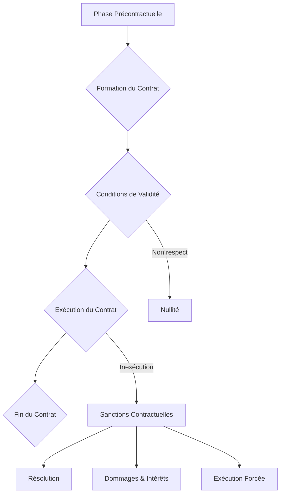

## Introduction à la théorie générale du contrat

Le contrat constitue la pierre angulaire du [[WIDGET:ConceptLink:droit_obligations:droit des obligations]] et, plus largement, du droit civil français. Il est l'instrument privilégié par lequel les individus et les personnes morales organisent leurs relations juridiques et économiques. Sa prééminence découle du principe fondamental de l'[[WIDGET:Glossary:autonomie_volonte:autonomie de la volonté]], selon lequel les parties sont libres de s'engager et de déterminer le contenu de leurs engagements, pourvu qu'elles respectent l'ordre public et les bonnes mœurs.

Dans le [Code civil](https://www.legifrance.gouv.fr/codes/id/LEGITEXT000006070721/), le contrat est défini à l'[article 1101 du Code civil](https://www.legifrance.gouv.fr/codes/article_lc/LEGIARTI000032040713) comme « un accord de volontés entre deux ou plusieurs personnes destiné à créer, modifier, transmettre ou éteindre des obligations ». Cette définition, issue de la réforme de 2016, souligne la fonction créatrice d'obligations du contrat. Le droit des contrats est principalement régi par le Titre III du Livre III du Code civil, intitulé « Des sources d'obligations ».

Ce chapitre a pour objectif de fournir une compréhension approfondie des mécanismes régissant la vie du contrat, de sa naissance à son extinction. Nous explorerons les conditions de sa validité, les effets qu'il produit entre les parties et à l'égard des tiers, ainsi que les différentes causes de son extinction.

L'étude du droit des contrats a été profondément marquée par l'[WIDGET:ConceptLink:reforme_droit_contrats:Ordonnance n° 2016-131 du 10 février 2016](https://www.legifrance.gouv.fr/eli/ordonnance/2016/2/10/JUSC1522466R/jo/texte) portant réforme du droit des contrats, du régime général et de la preuve des obligations, ratifiée par la [WIDGET:ConceptLink:loi_ratification_2018:Loi n° 2018-287 du 20 avril 2018](https://www.legifrance.gouv.fr/eli/loi/2018/4/20/JUSC1727785L/jo/texte). Avant cette réforme, le droit des contrats reposait sur des dispositions datant de 1804, complétées par une jurisprudence abondante et parfois complexe [[WIDGET:Reference:1]]. La réforme visait à moderniser le droit français des contrats, à le rendre plus lisible, plus accessible et plus attractif sur la scène internationale, en codifiant de nombreuses solutions jurisprudentielles et en introduisant de nouvelles règles. Elle a ainsi refondu l'intégralité du Titre III du Livre III du Code civil, modifiant la numérotation des articles et le contenu de nombreuses dispositions, comme l'[article 1102 du Code civil](https://www.legifrance.gouv.fr/codes/article_lc/LEGIARTI000032040715) sur la liberté contractuelle.

[[WIDGET:Mermaid:evolution_droit_contrats:Schéma simplifié de l'évolution du droit des contrats en France]]
```mermaid
graph TD
    A[Droit des Contrats avant 2016] --> B{Code Civil de 1804};
    B --> C[Jurisprudence Abondante et Correctrice];
    C --> D[Manque de Lisibilité et d'Accessibilité];
    D --> E[Besoin de Modernisation];
    E --> F[Ordonnance n° 2016-131 du 10 février 2016];
    F --> G[Loi n° 2018-287 du 20 avril 2018 (Ratification)];
    G --> H[Nouveau Droit des Contrats (Post-2016)];
    H --> I[Plus de Sécurité Juridique];
    H --> J[Plus d'Attractivité Internationale];
    H --> K[Codification de la Jurisprudence];
```


## La formation du contrat : Rencontre des volontés

La formation du contrat est un processus essentiel qui conduit à la naissance de l'acte juridique. En droit français, le principe est celui du [[WIDGET:ConceptLink:consensualisme:consensualisme]], ce qui signifie que le contrat est formé par le seul échange des consentements, sans qu'aucune forme particulière ne soit requise pour sa validité (sauf exceptions légales). Ce principe est affirmé par l'[article 1172 du Code civil](https://www.legifrance.gouv.fr/codes/article_lc/LEGIARTI000032040857).

Le processus de conclusion du contrat repose traditionnellement sur la rencontre d'une [[WIDGET:Glossary:offre_contrat:offre de contrat]] et d'une [[WIDGET:Glossary:acceptation_contrat:acceptation du contrat]]. Cette rencontre des volontés est le point de départ de l'engagement contractuel, comme le prévoit l'[article 1113 du Code civil](https://www.legifrance.gouv.fr/codes/article_lc/LEGIARTI000032040733) : « Le contrat est formé par la rencontre d'une offre et d'une acceptation par lesquelles les parties manifestent leur volonté de s'engager. »

### L'Offre

L'offre, ou pollicitation, est la proposition de contracter. Pour être qualifiée d'offre au sens juridique, elle doit revêtir deux caractéristiques essentielles, conformément à l'[article 1114 du Code civil](https://www.legifrance.gouv.fr/codes/article_lc/LEGIARTI000032040735) :
*   **Précise**: L'offre doit contenir tous les éléments essentiels du contrat envisagé. Par exemple, dans un contrat de vente, elle doit indiquer la chose et le prix.
*   **Ferme**: L'offre doit exprimer la volonté de son auteur d'être lié en cas d'acceptation. Elle ne doit pas être assortie de réserves qui laisseraient à l'offrant la liberté de ne pas contracter (par exemple, « sous réserve de confirmation »).

Une proposition qui ne remplit pas ces conditions ne constitue qu'une invitation à entrer en pourparlers ou un appel d'offres.

L'offre peut être assortie d'un délai exprès ou tacite. Pendant ce délai, l'offrant ne peut en principe pas la révoquer. Si l'offre est révoquée avant l'expiration du délai ou avant l'acceptation, la rétractation est fautive et engage la responsabilité extracontractuelle de son auteur, mais elle n'empêche pas la formation du contrat (art. [1115](https://www.legifrance.gouv.fr/codes/article_lc/LEGIARTI000032040737) et [1116 du Code civil](https://www.legifrance.gouv.fr/codes/article_lc/LEGIARTI000032040739)). L'offre devient caduque à l'expiration du délai ou, à défaut, à l'issue d'un délai raisonnable, ou encore en cas d'incapacité ou de décès de son auteur (art. [1117 du Code civil](https://www.legifrance.gouv.fr/codes/article_lc/LEGIARTI000032040741)).

### L'Acceptation

L'acceptation est la manifestation de volonté du destinataire de l'offre d'être lié dans les termes de celle-ci. Pour être valable, l'acceptation doit être :
*   **Pure et simple**: Elle doit correspondre exactement à l'offre. Toute modification ou adjonction par le destinataire de l'offre constitue une contre-proposition, qui équivaut à un refus de l'offre initiale et à l'émission d'une nouvelle offre (art. [1118 al. 3 du Code civil](https://www.legifrance.gouv.fr/codes/article_lc/LEGIARTI000032040743)).
*   **Extériorisée**: L'acceptation doit être exprimée. Le silence ne vaut pas acceptation, sauf exceptions prévues par la loi, les usages, les relations d'affaires ou des circonstances particulières (art. [1120 du Code civil](https://www.legifrance.gouv.fr/codes/article_lc/LEGIARTI000032040747)).

### Moment et lieu de formation du contrat

La détermination du moment et du lieu de la formation du contrat est cruciale car elle permet de fixer la loi applicable, le point de départ des délais de prescription, ou encore le transfert de propriété et des risques.

Avant la réforme de 2016, la jurisprudence était divisée entre la théorie de l'émission (le contrat est formé dès que l'acceptation est émise) et la théorie de la réception (le contrat est formé lorsque l'offrant reçoit l'acceptation). L'Ordonnance de 2016 a clarifié cette question en consacrant la **théorie de la réception** à l'[article 1121 du Code civil](https://www.legifrance.gouv.fr/codes/article_lc/LEGIARTI000032040749) : « Le contrat est conclu dès que l'acceptation parvient à l'offrant. Il est réputé l'être au lieu où l'acceptation est parvenue. »

[[WIDGET:Mermaid:formation_contrat_flowchart:Processus schématique de la formation du contrat]]
```mermaid
graph TD
    A[Offre (Précise et Ferme)] --> B{Réception par le Destinataire};
    B --> C{Acceptation (Pure et Simple)};
    C --> D{Envoi de l'Acceptation};
D --> E;
    E --> F[Contrat Formé];
```

## Les conditions de validité du contrat : Les piliers de l'engagement

Pour qu'un contrat soit valablement formé et produise ses effets juridiques, il ne suffit pas qu'une offre rencontre une acceptation. Il doit également remplir des conditions de fond essentielles, énumérées par l'[article 1128 du Code civil](https://www.legifrance.gouv.fr/codes/article_lc/LEGIARTI000032040755) tel qu'issu de la réforme de 2016. Ces conditions sont au nombre de trois : le consentement des parties, leur capacité de contracter, et un contenu licite et certain.

### Le consentement : Intégrité et absence de vices

Le consentement est la pierre angulaire de l'engagement contractuel. Il doit être réel, libre et éclairé. L'absence de l'une de ces qualités entache l'[[WIDGET:ConceptLink:integrite_consentement:intégrité du consentement]] et peut entraîner la nullité du contrat. Les vices du consentement, traditionnellement au nombre de trois, sont l'erreur, le dol et la violence.

#### L'Erreur

L'erreur est une fausse représentation de la réalité. Pour vicier le consentement et entraîner la nullité relative du contrat, elle doit être déterminante, c'est-à-dire que sans elle, la partie n'aurait pas contracté ou aurait contracté à des conditions substantiellement différentes ([article 1130 du Code civil](https://www.legifrance.gouv.fr/codes/article_lc/LEGIARTI000032040759)). L'erreur doit porter sur les qualités essentielles de la prestation due ou sur celles du cocontractant dans les contrats conclus *intuitu personae* ([article 1132 du Code civil](https://www.legifrance.gouv.fr/codes/article_lc/LEGIARTI000032040761) et [article 1134 du Code civil](https://www.legifrance.gouv.fr/codes/article_lc/LEGIARTI000032040767)). En revanche, l'erreur sur un simple motif étranger aux qualités essentielles ou sur la valeur n'est pas, en principe, une cause de nullité ([article 1135 du Code civil](https://www.legifrance.gouv.fr/codes/article_lc/LEGIARTI000032040769)). L'erreur doit également être excusable, c'est-à-dire que la partie qui l'invoque n'aurait pas dû pouvoir la déceler en faisant preuve d'une diligence normale.

#### Le Dol

Le [[WIDGET:Glossary:dol:dol]] est une erreur provoquée par des manœuvres frauduleuses du cocontractant. Il s'agit d'un comportement déloyal visant à tromper l'autre partie. Selon l'[article 1137 du Code civil](https://www.legifrance.gouv.fr/codes/article_lc/LEGIARTI000032040773), le dol peut résulter de manœuvres, de mensonges ou d'une réticence dolosive (le fait de cacher intentionnellement une information déterminante). Pour être sanctionné, le dol doit être intentionnel et avoir été déterminant du consentement de la victime. Il doit émaner du cocontractant ou d'un tiers de connivence. Le dol rend toujours l'erreur excusable.

#### La Violence

La violence est une contrainte exercée sur une partie pour l'obliger à contracter. Elle peut être physique ou morale. L'[article 1140 du Code civil](https://www.legifrance.gouv.fr/codes/article_lc/LEGIARTI000032040779) dispose qu'il y a violence lorsqu'une partie s'engage sous la pression d'une contrainte qui lui inspire la crainte d'exposer sa personne, sa fortune ou celles de ses proches à un mal considérable. La violence doit être illégitime, c'est-à-dire qu'elle ne doit pas résulter de l'exercice légitime d'un droit. La réforme de 2016 a introduit la notion de violence économique, prévue à l'[article 1143 du Code civil](https://www.legifrance.gouv.fr/codes/article_lc/LEGIARTI000032040785), qui sanctionne l'abus de l'état de dépendance dans lequel se trouve le cocontractant pour obtenir de lui un engagement qu'il n'aurait pas souscrit en l'absence d'une telle contrainte.

[[WIDGET:Mermaid:vices_consentement:Schéma des vices du consentement et leurs effets]]
```mermaid
graph TD
    A[Consentement] --> B{Intègre ?};
    B -- Non --> C[Vices du Consentement];
    C --> C1[Erreur];
    C1 --> C1a[Déterminante];
    C1 --> C1b[Excusable];
    C1 --> C1c[Sur qualités essentielles ou personne];
    C --> C2[Dol];
    C2 --> C2a[Manœuvres, mensonges ou réticence];
    C2 --> C2b[Intentionnel et Déterminant];
    C2 --> C2c[Émanant du cocontractant];
    C --> C3[Violence];
    C3 --> C3a[Contrainte illégitime];
    C3 --> C3b[Crainte d'un mal considérable];
    C3 --> C3c[Violence économique (abus de dépendance)];
    C -- Oui --> D[Nullité relative du contrat];
    B -- Oui --> E[Consentement Valable];
```

### La capacité des parties

La [[WIDGET:Glossary:capacite_juridique:capacité juridique]] est l'aptitude d'une personne à être titulaire de droits et d'obligations (capacité de jouissance) et à les exercer elle-même (capacité d'exercice). En droit des contrats, la capacité d'exercice est primordiale. L'[article 1145 du Code civil](https://www.legifrance.gouv.fr/codes/article_lc/LEGIARTI000032040791) pose le principe selon lequel toute personne physique peut contracter, sauf en cas d'incapacité prévue par la loi. Les principales incapacités d'exercice concernent les mineurs non émancipés et les majeurs protégés (sous tutelle, curatelle ou sauvegarde de justice) [[WIDGET:Reference:3]]. Ces personnes doivent être représentées ou assistées pour la conclusion d'actes juridiques, afin de protéger leurs intérêts ([article 1146 du Code civil](https://www.legifrance.gouv.fr/codes/article_lc/LEGIARTI000032040793)). L'incapacité est également une cause de nullité relative du contrat.

### Le contenu licite et certain du contrat

La réforme de 2016 a modernisé les notions d'objet et de cause, les regroupant sous l'appellation de « contenu du contrat » ([article 1162 du Code civil](https://www.legifrance.gouv.fr/codes/article_lc/LEGIARTI000032040815)). Ce contenu doit être licite et certain.

#### La licéité du contenu

Le contrat ne peut déroger à l'[[WIDGET:ConceptLink:ordre_public:ordre public]] ni aux bonnes mœurs ([article 6 du Code civil](https://www.legifrance.gouv.fr/codes/article_lc/LEGIARTI000006419280)). Cela signifie que ni les stipulations contractuelles, ni le but poursuivi par les parties (même si non exprimé) ne doivent être contraires à la loi impérative ou aux principes fondamentaux de la société. Par exemple, un contrat ayant pour objet la vente de produits illicites ou un contrat de mère porteuse (en droit français) serait nul pour illicéité de son contenu.

#### La certitude du contenu

La prestation, qu'elle soit l'objet d'une obligation de donner, de faire ou de ne pas faire, doit être possible et déterminée ou déterminable ([article 1163 du Code civil](https://www.legifrance.gouv.fr/codes/article_lc/LEGIARTI000032040817)).
*   **Déterminée ou déterminable**: La nature et la quantité de la prestation doivent être précisées ou pouvoir l'être sans nouvel accord des parties. Le prix, notamment, doit être fixé ou pouvoir l'être selon des critères objectifs ([article 1164 du Code civil](https://www.legifrance.gouv.fr/codes/article_lc/LEGIARTI000032040819) et [article 1165 du Code civil](https://www.legifrance.gouv.fr/codes/article_lc/LEGIARTI000032040821)).
*   **Possibilité**: La prestation doit être réalisable. Un contrat portant sur une chose qui n'existe pas et ne peut exister est nul.

#### L'équilibre contractuel

Bien que le droit français n'exige pas un équilibre parfait des prestations (la lésion n'étant sanctionnée que dans des cas limitativement prévus par la loi), la réforme de 2016 a introduit des mécanismes de contrôle de l'équilibre dans certaines situations. L'[article 1171 du Code civil](https://www.legifrance.gouv.fr/codes/article_lc/LEGIARTI000032040829) permet de réputer non écrite toute clause non négociable, déterminée à l'avance par l'une des parties (contrat d'adhésion), qui crée un déséquilibre significatif entre les droits et obligations des parties. Cette disposition vise à protéger la partie la plus faible dans les contrats d'adhésion, sans pour autant remettre en cause l'équilibre économique global du contrat [[WIDGET:Reference:4]].

## L'exécution et les sanctions de l'inexécution contractuelle

Une fois valablement formé, le contrat devient une source d'obligations pour les parties. Son exécution est régie par des principes fondamentaux, et son inexécution peut entraîner diverses sanctions.

### Les principes de l'exécution du contrat

L'exécution du contrat repose sur deux piliers essentiels : la force obligatoire et la bonne foi.

#### La force obligatoire du contrat

Le principe de la [[WIDGET:ConceptLink:force_obligatoire:force obligatoire du contrat]], consacré par l'[article 1103 du Code civil](https://www.legifrance.gouv.fr/codes/article_lc/LEGIARTI000032040715), stipule que « les contrats légalement formés tiennent lieu de loi à ceux qui les ont faits ». Cela signifie que les parties sont tenues de respecter leurs engagements comme s'il s'agissait d'une loi. Le contrat ne peut être modifié ou révoqué que d'un commun accord des parties, ou pour les causes que la loi autorise. La réforme de 2016 a toutefois introduit une exception notable à ce principe avec la théorie de l'imprévision à l'[article 1195 du Code civil](https://www.legifrance.gouv.fr/codes/article_lc/LEGIARTI000032040847), permettant au juge de réviser ou de mettre fin au contrat en cas de changement de circonstances imprévisible rendant l'exécution excessivement onéreuse pour une partie.

#### La bonne foi

L'[article 1104 du Code civil](https://www.legifrance.gouv.fr/codes/article_lc/LEGIARTI000032040717) énonce que « les contrats doivent être négociés, formés et exécutés de bonne foi ». Ce principe général de bonne foi impose aux parties un devoir de loyauté et de coopération à toutes les étapes de la vie contractuelle. Il ne s'agit pas seulement d'éviter la fraude, mais d'agir de manière honnête et de ne pas abuser de ses droits contractuels. La bonne foi est une notion évolutive, souvent précisée par la jurisprudence, qui imprègne l'ensemble du droit des obligations [[WIDGET:Reference:5]].

### Les sanctions de l'inexécution contractuelle

En cas d'inexécution des obligations par l'une des parties, le créancier dispose de plusieurs options, prévues à l'[article 1217 du Code civil](https://www.legifrance.gouv.fr/codes/article_lc/LEGIARTI000032040861), qu'il peut combiner si elles ne sont pas incompatibles.

#### L'exception d'inexécution

L'exception d'inexécution permet à une partie de refuser d'exécuter sa propre obligation si l'autre partie n'exécute pas la sienne et si cette inexécution est suffisamment grave ([article 1219 du Code civil](https://www.legifrance.gouv.fr/codes/article_lc/LEGIARTI000032040865)). C'est un moyen de pression provisoire qui suspend l'exécution du contrat. L'[article 1220 du Code civil](https://www.legifrance.gouv.fr/codes/article_lc/LEGIARTI000032040865) prévoit même une exception d'inexécution par anticipation, si une partie est manifestement en passe de ne pas exécuter son obligation.

#### L'exécution forcée en nature

Le créancier peut demander au débiteur d'exécuter son obligation telle que prévue au contrat ([article 1221 du Code civil](https://www.legifrance.gouv.fr/codes/article_lc/LEGIARTI000032040867)). Cette exécution forcée est le mode de sanction privilégié, sauf si elle est impossible (matériellement ou juridiquement) ou si son coût est manifestement déraisonnable par rapport à l'intérêt du créancier. Le créancier peut également, après mise en demeure, faire exécuter l'obligation par un tiers aux frais du débiteur ([article 1222 du Code civil](https://www.legifrance.gouv.fr/codes/article_lc/LEGIARTI000032040869)).

#### La réduction du prix

Nouvelle sanction introduite par la réforme, la réduction du prix permet au créancier d'une prestation imparfaitement exécutée d'accepter l'exécution imparfaite et de solliciter une réduction proportionnelle du prix ([article 1223 du Code civil](https://www.legifrance.gouv.fr/codes/article_lc/LEGIARTI000032040871)). Cette réduction peut être unilatérale, après mise en demeure, ou demandée en justice.

#### La résolution du contrat

La [[WIDGET:Glossary:resolution_contrat:résolution du contrat]] met fin au contrat en raison de l'inexécution d'une obligation essentielle par l'une des parties ([article 1224 du Code civil](https://www.legifrance.gouv.fr/codes/article_lc/LEGIARTI000032040873)). Elle peut être :
*   **Judiciaire**: Prononcée par le juge.
*   **Unilatérale**: Par notification du créancier au débiteur, après mise en demeure et si l'inexécution est suffisamment grave ([article 1226 du Code civil](https://www.legifrance.gouv.fr/codes/article_lc/LEGIARTI000032040877)).
*   **Par clause résolutoire**: Si le contrat contient une clause prévoyant sa résolution de plein droit en cas d'inexécution ([article 1225 du Code civil](https://www.legifrance.gouv.fr/codes/article_lc/LEGIARTI000032040875)).
La résolution a généralement un effet rétroactif, anéantissant le contrat et entraînant la restitution des prestations déjà exécutées.

#### La responsabilité contractuelle (dommages et intérêts)

Indépendamment des autres sanctions, le créancier peut toujours demander des dommages et intérêts en réparation du préjudice subi du fait de l'inexécution ([article 1231-1 du Code civil](https://www.legifrance.gouv.fr/codes/article_lc/LEGIARTI000032040885)). Pour cela, trois conditions doivent être réunies :
*   Une faute contractuelle (l'inexécution ou la mauvaise exécution).
*   Un préjudice (matériel, moral, corporel).
*   Un lien de causalité direct entre la faute et le préjudice.
Les dommages et intérêts visent à compenser la perte subie (dommage émergent) et le gain manqué (lucrum cessans) par le créancier.

[[WIDGET:Mermaid:sanctions_inexecution:Diagramme des sanctions de l'inexécution contractuelle]]
```mermaid
graph TD
    A[Inexécution Contractuelle] --> B{Mise en Demeure};
    B --> C{Sanctions possibles (Art. 1217 C. civ.)};
    C --> C1[Exception d'inexécution];
    C1 --> C1a[Suspension de l'exécution];
    C --> C2[Exécution forcée en nature];
    C2 --> C2a[Demande au juge];
    C2 --> C2b[Faire exécuter par un tiers];
    C --> C3[Réduction du prix];
    C3 --> C3a[Unilatérale ou Judiciaire];
    C --> C4[Résolution du contrat];
    C4 --> C4a[Judiciaire];
    C4 --> C4b[Unilatérale];
    C4 --> C4c[Clause résolutoire];
    C --> C5[Dommages et Intérêts];
    C5 --> C5a[Réparation du préjudice];
    C5 --> C5b[Cumulable avec d'autres sanctions];
```

## Conclusion
Le parcours à travers la théorie générale du contrat, de sa formation à son exécution, révèle la complexité et la richesse d'une matière fondamentale du droit civil. Nous avons d'abord exploré les conditions essentielles à la naissance d'un engagement juridique, soulignant l'importance du consentement libre et éclairé, de la capacité des parties, d'un contenu licite et certain, et d'une cause valable, conformément aux articles [1128](https://www.legifrance.gouv.fr/codes/article_lc/LEGIARTI000032040742) et suivants du Code civil. La rencontre des volontés, matérialisée par l'offre et l'acceptation, constitue le socle de l'accord, tandis que l'intégrité du consentement est protégée par la théorie des vices (erreur, dol, violence), dont la présence peut entraîner la nullité du contrat.

La validité du contrat, une fois formé, est une condition *sine qua non* à sa force obligatoire. Un contrat valablement formé devient la loi des parties, principe consacré par l'[[WIDGET:ConceptLink:force_obligatoire:article 1103 du Code civil]] ([anciennement 1134](https://www.legifrance.gouv.fr/juri/id/JURITEXT000007019623/)) et illustrant l'[[WIDGET:ConceptLink:autonomie_volonte:autonomie de la volonté]] comme pierre angulaire du droit des contrats français [[WIDGET:Reference:1]]. Cette force contraignante implique que les parties doivent exécuter leurs obligations de bonne foi, comme le stipule l'article [1104 du Code civil](https://www.legifrance.gouv.fr/codes/article_lc/LEGIARTI000032040717). L'exécution du contrat, qu'elle soit spontanée ou forcée, est l'aboutissement de cet engagement. En cas d'inexécution, le droit offre un éventail de sanctions, allant de l'exception d'inexécution à la résolution du contrat, en passant par l'exécution forcée en nature et l'octroi de dommages et intérêts, conformément aux dispositions de l'article [1217 du Code civil](https://www.legifrance.gouv.fr/codes/article_lc/LEGIARTI000032040857). Ces mécanismes visent à restaurer l'équilibre contractuel et à réparer le préjudice subi par la partie lésée, reflétant la vision d'auteurs comme [[WIDGET:RealPerson:rene_demogue:René Demogue]] sur la fonction sociale du contrat [[WIDGET:Reference:2]].

[[WIDGET:Mermaid:cycle_vie_contrat:Cycle de vie d'un contrat]]


Les enjeux contemporains du droit des contrats sont multiples et en constante évolution. La digitalisation des échanges a transformé la manière dont les contrats sont formés et exécutés, soulevant des questions nouvelles concernant le consentement électronique, la preuve des contrats en ligne et la protection des données personnelles [[WIDGET:Reference:4]]. La montée en puissance du droit de la consommation a également renforcé la protection de la partie faible, introduisant des règles spécifiques en matière d'information précontractuelle, de délais de rétractation et de clauses abusives, notamment sous l'influence du droit européen. Par ailleurs, la [[WIDGET:Glossary:bonne_foi:bonne foi]], principe cardinal du droit des contrats, continue d'être interprétée et appliquée de manière dynamique par la jurisprudence, notamment dans les phases de négociation et d'exécution, comme en témoignent les arrêts récents de la Cour de cassation sur l'obligation de loyauté [[WIDGET:Reference:3]]. Le droit des contrats, loin d'être statique, s'adapte ainsi aux mutations économiques et sociales, cherchant un équilibre entre la liberté contractuelle et la justice commutative.

[[WIDGET:conclusionSummary]]
[[WIDGET:whatsNext]]
[[WIDGET:goingFurther]]
[[WIDGET:finalEvaluation]]
