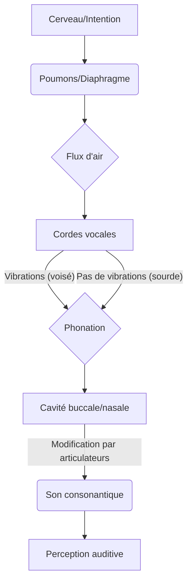

<Prerequisites itemsBase64="W10=" />

<DiagnosticQuiz question="Quelle est l'origine principale du vocabulaire espagnol moderne ?" options="Arabe|||Latin vulgaire|||Grec ancien|||Langues pré-romaines" correctIndex="1" targetSectionId="1-les-racines-historiques-et-geographiques-de-lespagnol-une-architecture-linguistique" sectionTitle="Les Racines Historiques et Géographiques de l'Espagnol" />

## Introduction : L'Espagnol comme Système Ingénierique

Bienvenue dans ce module fondamental dédié à l'espagnol, une langue parlée par plus de 500 millions de personnes à travers le monde, ce qui en fait la deuxième langue maternelle la plus parlée après le mandarin. Aborder l'apprentissage d'une nouvelle langue peut sembler une tâche ardue, mais nous l'aborderons ici avec la rigueur et la méthodologie propres aux <ConceptLink name="Ingénierie_systèmes" lang="fr" description="Discipline interdisciplinaire qui se concentre sur la conception et la gestion de systèmes complexes sur leur cycle de vie, intégrant des principes d'ingénierie, de gestion et de sciences sociales." unresolved={true}>sciences de l'ingénierie des systèmes</ConceptLink>. En effet, une langue n'est pas qu'un ensemble de mots ; c'est un système complexe, une architecture sophistiquée de sons, de règles et de significations, conçue pour la communication et l'échange d'informations.

Dans cette leçon inaugurale, nous allons déconstruire l'espagnol pour en comprendre les fondations, comme un ingénieur analyse les spécifications d'un nouveau projet. Nous commencerons par explorer ses racines historiques et géographiques, qui constituent le « cahier des charges » initial ayant façonné sa structure et ses particularités. Ensuite, nous nous pencherons sur l'alphabet et les sons fondamentaux, les « composants de base » de notre système linguistique. Enfin, nous aborderons les principes d'accentuation et d'intonation, essentiels pour l'optimisation du « flux de données » verbales et la clarté de la transmission du message. Notre objectif est de vous fournir une compréhension claire et structurée, vous permettant de construire une prononciation solide et intelligible dès le départ, élément crucial pour une communication efficace.

<CustomFigure src="https://cayylzaasyqqpvuezufy.supabase.co/storage/v1/object/public/course-media/img_068f5fe376b78b73b67b465d57aabea6.jpeg" alt="Language as an engineering system" caption="Figure 1: Illustration conceptuelle: La langue comme système d'ingénierie complexe, où les symboles linguistiques s'intègrent dans une structure mécanique et numérique, reflétant l'interconnexion de ses composants. Source: Généré par IA." />

> « Apprendre une nouvelle langue, c'est comme construire un pont vers une nouvelle culture. Chaque mot est un pilier, chaque règle grammaticale une poutre, et la prononciation la fondation qui assure sa stabilité. » — <RealPerson name="Noam_Chomsky" lang="fr" bio="Linguiste, philosophe, scientifique cognitiviste, activiste politique et auteur américain, souvent considéré comme le père de la linguistique moderne pour sa théorie de la grammaire générative.">Noam Chomsky</RealPerson>, *Aspects de la théorie syntaxique*, Éditions du Seuil, Paris, 1965, p. 5.

Cette citation de Chomsky illustre parfaitement notre approche. Elle souligne l'importance des fondations (la prononciation) et des composants (mots, règles) dans la construction d'un système linguistique robuste et fonctionnel. En adoptant une perspective d'ingénierie, nous chercherons à identifier les exigences fonctionnelles et non fonctionnelles, les contraintes techniques, à concevoir des solutions articulatoires et à valider leur implémentation pour garantir une communication efficace et sans ambiguïté.

<Objectives>
  <Knowledge>
    <ul className="list-disc pl-4 space-y-1">
      <li>Décrire les influences historiques et géographiques majeures sur le développement de l'espagnol.</li>
      <li>Identifier les lettres de l'alphabet espagnol, y compris la ñ, et leurs prononciations de base.</li>
      <li>Expliquer les règles fondamentales d'accentuation et d'intonation en espagnol.</li>
    </ul>
  </Knowledge>
  <Skills>
    <ul className="list-disc pl-4 space-y-1">
      <li>Prononcer correctement les voyelles espagnoles avec leur son pur et stable.</li>
      <li>Articuler les consonnes espagnoles clés (c, g, j, ll, ñ, r, rr, v, z) en respectant leurs spécificités phonétiques.</li>
      <li>Appliquer les règles d'accentuation pour placer correctement l'accent tonique dans les mots espagnols.</li>
    </ul>
  </Skills>
  <Attitudes>
    <ul className="list-disc pl-4 space-y-1">
      <li>Développer une appréciation pour la richesse et la complexité de l'espagnol en tant que système linguistique.</li>
      <li>Adopter une approche méthodique et rigoureuse pour l'apprentissage de la prononciation espagnole.</li>
      <li>Cultiver la patience et la persévérance dans la pratique des sons et des intonations pour améliorer la fluidité.</li>
    </ul>
  </Attitudes>
</Objectives>

## 1. Les Racines Historiques et Géographiques de l'Espagnol : Une Architecture Linguistique

Pour comprendre un système complexe, il est impératif d'en connaître la genèse et l'environnement dans lequel il a évolué. L'espagnol, ou castillan, est une langue romane, ce qui signifie qu'il est un descendant direct du <ConceptLink name="Latin_vulgaire" lang="fr" description="Forme parlée du latin, par opposition au latin classique écrit, qui a donné naissance aux langues romanes. Il était le latin quotidien des soldats, des colons et des commerçants de l'Empire romain.">latin vulgaire</ConceptLink> parlé par les soldats, les colons et les commerçants de l'Empire romain sur la <Location name="Péninsule_Ibérique" lang="fr" description="Péninsule située à l'extrémité sud-ouest de l'Europe, comprenant l'Espagne et le Portugal, et bordée par la mer Méditerranée et l'océan Atlantique.">péninsule Ibérique</Location> [1](#ref-1). Cette origine latine constitue la première couche architecturale de la langue, lui conférant une grande partie de son lexique, de sa morphologie et de sa structure grammaticale fondamentale.

### 1.1. L'Héritage Romain et les Influences Pré-Romaines

Avant l'arrivée des Romains en 218 av. J.-C., la péninsule Ibérique était habitée par divers peuples, dont les Ibères, les Celtes, les Tartessiens et les Basques. Leurs langues, bien que largement supplantées par le latin, ont laissé des substrats linguistiques. Le basque, par exemple, est une langue isolée qui n'est pas d'origine indo-européenne et a résisté à la romanisation, offrant un aperçu des « contraintes techniques » préexistantes à l'implémentation du latin et des phénomènes de contact linguistique [2](#ref-2). Des toponymes et quelques éléments lexicaux dans l'espagnol moderne peuvent être attribués à ces langues pré-romaines.

<CustomFigure src="https://upload.wikimedia.org/wikipedia/commons/4/46/Hispania_Tarraconensis_%28Imperium_Romanum%29.png" alt="Roman Hispania map" caption="Figure 2: Les provinces romaines d'Hispanie en 27 av. J.-C., illustrant l'étendue de l'influence latine sur la péninsule Ibérique et la fondation de la future architecture linguistique romane. Source: Wikimedia Commons." />

### 1.2. L'Apport Arabe : Une Ingénierie Lexicale et Phonétique

L'invasion musulmane de 711 a marqué un tournant majeur dans l'histoire de la péninsule Ibérique. Pendant près de huit siècles, une grande partie de la péninsule fut sous domination arabe, donnant naissance à <Location name="Al-Andalus" lang="fr" description="Nom donné aux territoires de la péninsule Ibérique sous domination musulmane du VIIIe au XVe siècle, caractérisé par une riche culture et une coexistence de différentes religions.">Al-Andalus</Location>. Cette période a profondément influencé le castillan naissant, enrichissant son lexique de milliers de mots d'origine arabe, particulièrement dans les domaines de l'agriculture (ex: *aceituna* (olive), *azúcar* (sucre), *naranja* (orange)), de l'architecture (ex: *albañil* (maçon), *alcázar* (forteresse), *azotea* (terrasse)) et de la science (ex: *álgebra* (algèbre), *cero* (zéro)). Environ 8% du vocabulaire espagnol actuel est d'origine arabe, ce qui représente une « intégration de modules externes » significative et réussie dans l'architecture linguistique [3](#ref-3).

<CustomFigure src="https://upload.wikimedia.org/wikipedia/commons/a/ac/Al_Andalus_%26_Christian_Kingdoms-ar.png" alt="Al-Andalus map" caption="Figure 3: Carte d'Al-Andalus entre 750 et 1031, montrant l'étendue de la domination musulmane et son impact culturel et linguistique profond sur la péninsule Ibérique. Source: Wikimedia Commons." />

L'influence arabe sur l'espagnol est si profonde que de nombreux mots commencent par « al- » (l'article défini arabe « al- »). Par exemple, *álgebra* (algèbre), *algodón* (coton), *almohada* (oreiller). Ces mots ne sont pas de simples emprunts, mais des intégrations complètes qui témoignent d'une période de coexistence et d'échanges culturels et scientifiques intenses, où les connaissances arabes étaient à la pointe de la civilisation médiévale. Cette intégration lexicale est un exemple frappant de l'adaptabilité et de la capacité d'enrichissement des systèmes linguistiques.

### 1.3. La Reconquista et l'Expansion Castillane : Standardisation et Déploiement

La <EventLink name="Reconquista" lang="fr" description="Période de l'histoire de la péninsule Ibérique (du VIIIe au XVe siècle) durant laquelle les royaumes chrétiens ont reconquis progressivement les territoires sous domination musulmane.">Reconquista</EventLink>, achevée en 1492 avec la chute de <Location name="Grenade" lang="fr" description="Ville historique en Andalousie, dernier bastion musulman en Espagne, dont la prise en 1492 marqua la fin de la Reconquista.">Grenade</Location>, a vu le <ConceptLink name="Royaume_de_Castille" lang="fr" description="Un des royaumes médiévaux les plus importants de la péninsule Ibérique, qui a joué un rôle central dans la Reconquista et la formation de l'Espagne moderne.">Royaume de Castille</ConceptLink> devenir la puissance dominante. Le dialecte castillan s'est alors imposé comme la langue officielle du nouveau royaume unifié d'Espagne. La même année, l'arrivée de <RealPerson name="Christophe_Colomb" lang="fr" bio="Navigateur et explorateur d'origine génoise, souvent crédité de la découverte de l'Amérique en 1492, ouvrant la voie à la colonisation européenne du Nouveau Monde.">Christophe Colomb</RealPerson> en Amérique a marqué le début d'une expansion coloniale massive, « déployant » l'espagnol sur un nouveau continent et le transformant en une langue globale.

Aujourd'hui, l'espagnol est la langue officielle de 20 pays et une langue co-officielle dans plusieurs autres, avec des communautés hispanophones significatives dans de nombreux autres pays, notamment aux États-Unis. Cette vaste distribution géographique a naturellement conduit à des variations dialectales et phonétiques, mais la structure fondamentale reste remarquablement cohérente, témoignant d'une « architecture de base » robuste et d'une intelligibilité mutuelle élevée entre les différentes variantes.

<CustomFigure src="https://upload.wikimedia.org/wikipedia/commons/f/fd/Distribution_of_Spanish.svg" alt="Spanish language distribution map" caption="Figure 4: Carte de la distribution de la langue espagnole dans le monde, indiquant les pays où l'espagnol est langue officielle ou largement parlé. Source: Wikimedia Commons." />

<Video id="5mD8jS5yZec" url="https://www.youtube.com/watch?v=5mD8jS5yZec" provider="youtube" title="L'histoire de l'espagnol en 5 minutes : De Rome à l'Amérique" duration="5:10" />

## 2. L'Alphabet Espagnol : Le Cahier des Charges Phonétique

Le premier « composant » essentiel de notre système linguistique est l'alphabet. L'alphabet espagnol moderne est basé sur l'alphabet latin et se compose de 27 lettres, incluant la lettre `ñ` qui est unique et emblématique de la langue. Comprendre cet alphabet et les sons qu'il représente est le « cahier des charges phonétique » fondamental pour toute implémentation correcte de la prononciation.

### 2.1. Les Lettres et Leur Prononciation de Base

Voici l'alphabet espagnol, avec une prononciation approximative en français pour les lettres dont le nom diffère significativement. Il est crucial de noter que la prononciation des lettres individuelles peut varier en fonction de leur position dans un mot et des lettres adjacentes, mais cette liste fournit la base nominale.

*   **A** (a)
*   **B** (be)
*   **C** (ce)
*   **D** (de)
*   **E** (e)
*   **F** (efe)
*   **G** (ge)
*   **H** (hache) - *toujours muette en espagnol standard*
*   **I** (i)
*   **J** (jota)
*   **K** (ka) - *rare, principalement dans les mots d'origine étrangère*
*   **L** (ele)
*   **M** (eme)
*   **N** (ene)
*   **Ñ** (eñe)
*   **O** (o)
*   **P** (pe)
*   **Q** (cu)
*   **R** (erre)
*   **S** (ese)
*   **T** (te)
*   **U** (u)
*   **V** (uve)
*   **W** (uve doble) - *rare, principalement dans les mots d'origine étrangère*
*   **X** (equis)
*   **Y** (ye ou i griega)
*   **Z** (zeta)

Jusqu'en 2010, les digrammes `ch` et `ll` étaient considérés comme des lettres à part entière de l'alphabet espagnol, possédant leurs propres entrées dans les dictionnaires. Cependant, l'<InstitutionLink name="Real_Academia_Española" lang="fr" description="Institution culturelle espagnole fondée en 1713, chargée de veiller à la régularité et à la pureté de la langue espagnole, et de fixer ses normes.">Real Academia Española</InstitutionLink> (RAE) a décidé de les retirer de l'alphabet officiel pour s'aligner sur les normes internationales des autres langues romanes, les considérant désormais comme des combinaisons de deux lettres. Elles conservent néanmoins des sons distincts et importants dans la phonologie espagnole.

### 2.2. Les Voyelles : Les Fondations Sonores

Les cinq voyelles espagnoles (`a`, `e`, `i`, `o`, `u`) sont la pierre angulaire de la prononciation. Contrairement au français, où les voyelles peuvent avoir de multiples sons (ouverts, fermés, nasalisés, etc.), les voyelles espagnoles sont remarquablement stables et pures. Elles ont un son unique, court et clair, quelle que soit leur position dans le mot. C'est une « spécification technique » cruciale pour la clarté et la prévisibilité de la communication.

*   **A** : se prononce comme le « a » de « papa » en français, toujours ouvert et clair. Ex: *casa* (maison), *hablar* (parler).
*   **E** : se prononce comme le « é » de « café » en français, jamais muet ou nasal. Ex: *mesa* (table), *verde* (vert).
*   **I** : se prononce comme le « i » de « lit » en français, toujours tendu et bref. Ex: *libro* (livre), *cine* (cinéma).
*   **O** : se prononce comme le « o » de « moto » en français, toujours fermé et rond. Ex: *sol* (soleil), *rojo* (rouge).
*   **U** : se prononce comme le « ou » de « loup » en français, toujours fermé et non nasalisé. Ex: *luna* (lune), *azul* (bleu).

Il est essentiel de s'entraîner à prononcer ces voyelles de manière constante et sans variation. C'est la base d'une prononciation espagnole authentique et intelligible, réduisant considérablement les ambiguïtés phonétiques.

<CustomFigure src="https://upload.wikimedia.org/wikipedia/commons/5/52/Gram%C3%A1tica_de_la_lengua_castellana.jpg" alt="Gramática de la lengua castellana" caption="Figure 5: Page de titre de la *Gramática de la lengua castellana* d'Antonio de Nebrija (1492), la première grammaire d'une langue romane, qui a codifié l'alphabet et les règles du castillan, jetant les bases de sa standardisation. Source: Wikimedia Commons." />

## 3. Les Sons Fondamentaux de l'Espagnol : Conception et Implémentation Articulatoire

Après avoir examiné le « cahier des charges » de l'alphabet, nous passons à la « conception et implémentation articulatoire » des sons spécifiques de l'espagnol. Certains sons sont similaires au français, d'autres requièrent un ajustement précis de l'appareil phonatoire pour être produits correctement.

### 3.1. Les Consonnes Clés et Leurs Spécificités

La maîtrise des consonnes espagnoles est cruciale pour une prononciation authentique. Voici les spécificités des sons les plus distinctifs ou délicats pour les locuteurs francophones :

*   **C** :
    *   Devant `a`, `o`, `u` ou une consonne : son « k » (comme en français). Ex: *casa* (maison), *cosa* (chose), *cruz* (croix).
    *   Devant `e`, `i` : son « th » anglais (comme dans *think*) en Espagne péninsulaire (phénomène de <ConceptLink name="Céceo" lang="fr" description="Phénomène linguistique où les sons /s/ et /θ/ sont prononcés de la même manière, comme le 'th' anglais, typique de certaines régions d'Espagne." unresolved={true}>céceo</ConceptLink>), ou son « s » (comme dans *serpent*) en Amérique latine et dans certaines régions d'Espagne (Andalousie, Canaries) (phénomène de <ConceptLink name="Seseo" lang="fr" description="Phénomène linguistique où les sons /s/ et /θ/ sont prononcés de la même manière, comme un 's' français, typique de l'Amérique latine et de certaines régions d'Espagne." unresolved={true}>seseo</ConceptLink>). Ex: *cena* (dîner), *cine* (cinéma).
*   **G** :
    *   Devant `a`, `o`, `u` ou une consonne : son « g » dur (comme dans *gâteau*). Ex: *gato* (chat), *gorro* (bonnet), *gusto* (goût).
    *   Devant `e`, `i` : son « j » espagnol (un « r » raclé, vélaire fricatif sourd, similaire au « ch » allemand dans *Bach*). Ex: *gente* (gens), *gitano* (gitan).
*   **H** : Toujours muette. Elle n'a aucune valeur phonétique en espagnol standard. Ex: *hola* (bonjour), *hablar* (parler).
*   **J** : Toujours le son « r » raclé (vélaire fricatif sourd), comme le « ch » allemand dans *Bach*. Ex: *jamón* (jambon), *ojo* (œil).
*   **LL** : Traditionnellement un son palatal latéral (/ʎ/), mais aujourd'hui majoritairement prononcé comme un « y » (comme dans *yaourt*) en Espagne et dans la plupart de l'Amérique latine (phénomène de <ConceptLink name="Yeísmo" lang="fr" description="Phénomène linguistique où le son /ʎ/ (correspondant à 'll') est prononcé comme /ʝ/ (y) ou /ʒ/ (j français)." unresolved={true}>yeísmo</ConceptLink>). Dans certaines régions (Argentine, Uruguay), il peut sonner comme le « j » français (comme dans *jour*), c'est le *yeísmo rehilado*. Ex: *llamar* (appeler), *calle* (rue).
*   **Ñ** : Son « gn » (comme dans *agneau*), un son nasal palatal unique. Ex: *niño* (enfant), *España* (Espagne).
*   **R** :
    *   En début de mot ou après `n`, `l`, `s` : « r » roulé fort (plusieurs vibrations de la langue contre les alvéoles, vibrante alvéolaire multiple). Ex: *ratón* (souris), *enriquecer* (enrichir).
    *   Entre deux voyelles (`rr`) : « r » roulé fort. Ex: *perro* (chien), *carro* (voiture).
    *   Ailleurs (entre voyelles, après consonne autre que `n`, `l`, `s`) : « r » doux (une seule vibration de la langue, vibrante alvéolaire simple). Ex: *pero* (mais), *cara* (visage).
*   **V** : Se prononce comme un « b » en espagnol standard. Il n'y a pas de distinction phonétique entre `b` et `v` (sauf dans des contextes très formels ou régionaux). Ex: *vaca* (vache), *vino* (vin).
*   **Z** : Son « th » anglais (comme dans *think*) en Espagne péninsulaire (céceo), ou son « s » (comme dans *serpent*) en Amérique latine (seseo). Ex: *zapato* (chaussure), *azul* (bleu).

<AudioPlayer url="https://w.rfi.fr/actu/articles/100/article_100063.mp3" title="Discours de Juan Carlos Ier sur la transition démocratique (1975)" duration="3:45" />
Cet enregistrement historique du discours de Juan Carlos Ier lors de son accession au trône en 1975 offre un exemple authentique de la prononciation de l'espagnol castillan dans un contexte formel. Écoutez attentivement l'articulation des consonnes et la mélodie générale de la langue.

### 3.2. Le Schéma Phonétique et Articulatoire

Pour visualiser la production de ces sons, nous pouvons utiliser un diagramme de l'appareil phonatoire. Cela nous aide à comprendre comment l'air est modulé par la langue, les dents, les lèvres et le palais pour produire les différentes phonèmes. La précision de la position des articulateurs est la clé de la distinction phonétique.

<CustomFigure src="https://upload.wikimedia.org/wikipedia/commons/9/92/Adultvocaltract.jpeg" alt="Human vocal tract diagram" caption="Figure 6: Diagramme schématique de l'appareil phonatoire humain, illustrant les principaux articulateurs (langue, palais, lèvres, dents, cordes vocales) impliqués dans la production des sons de la parole. Source: Wikimedia Commons." />

Ce diagramme Mermaid représente un flux simplifié de la production d'un son consonantique en espagnol. Il illustre les étapes clés, de l'initiation du flux d'air à la modification par les articulateurs. Vous pouvez imaginer how la position de la langue change pour produire un `r` roulé (vibrations de la pointe de la langue contre les alvéoles) par rapport à un `j` (constriction à l'arrière du palais, vélaire).

<Epistemology title="La controverse du Seseo et du Ceceo : Uniformité vs. Diversité Phonétique">
La distinction entre le céceo (prononciation de 'c' devant 'e/i' et 'z' comme le 'th' anglais interdental) et le seseo (prononciation de ces mêmes lettres comme un 's' français alvéolaire) est un débat linguistique majeur. En Espagne péninsulaire, le céceo est la norme dans la majeure partie du pays, tandis que le seseo est universel en Amérique latine et prédominant dans le sud de l'Espagne (Andalousie, Canaries). Certains puristes ont longtemps considéré le seseo comme une déviation, mais la linguistique moderne reconnaît ces deux variantes comme des réalisations phonétiques légitimes et fonctionnelles. Cette divergence illustre que même au sein d'un système linguistique, des « implémentations » différentes peuvent coexister tout en assurant la même « fonctionnalité » de communication, enrichissant la diversité phonétique de la langue.
</Epistemology>

<Alert type="biography">
**Antonio de Nebrija (1444-1522)** fut un humaniste, pédagogue et grammairien espagnol dont l'œuvre la plus célèbre est la *Gramática de la lengua castellana*, publiée en 1492. Ce fut la première grammaire d'une langue romane, codifiant et standardisant le castillan à un moment crucial de son expansion mondiale. Son travail a jeté les bases de l'étude systématique de la langue, fournissant un véritable « manuel d'ingénierie » pour sa structure et son usage. Il a ainsi contribué de manière décisive à l'établissement de l'espagnol comme langue de culture, de science et de pouvoir, et à sa diffusion. [Read more on Wikipedia](https://fr.wikipedia.org/wiki/Antonio_de_Nebrija)
</Alert>

## 4. L'Accentuation et l'Intonation : L'Optimisation du Flux de Communication

La prononciation ne se limite pas aux sons individuels ; elle englobe également la mélodie de la langue, c'est-à-dire l'accentuation et l'intonation. Ces éléments sont cruciaux pour l'« optimisation du flux de communication », car ils permettent de distinguer les mots, de marquer le sens des phrases et d'exprimer des émotions, agissant comme des métadonnées phonétiques.

### 4.1. Les Règles d'Accentuation : La Priorité des Syllabes

En espagnol, l'accent tonique (la syllabe prononcée avec plus de force et une hauteur légèrement plus élevée) est régulier et suit des règles précises. La présence ou l'absence d'un accent écrit (la *tilde*, toujours un accent aigu `´`) est une « spécification » qui indique une dérogation à ces règles générales, ou une distinction sémantique.

1.  **Mots terminés par une voyelle, `n` ou `s`** : L'accent tonique tombe sur l'avant-dernière syllabe (mots *graves* ou *llanas*).
    *   Ex: *ca**sa* (maison), *ha**blan* (ils parlent), *li**bros* (livres).
2.  **Mots terminés par une consonne (sauf `n` ou `s`)** : L'accent tonique tombe sur la dernière syllabe (mots *agudos*).
    *   Ex: *ciud**ad* (ville), *pap**el* (papier), *com**er* (manger).
3.  **Mots avec un accent écrit (tilde)** : L'accent tonique tombe sur la syllabe marquée par la *tilde*, quelle que soit la règle générale. Ces mots sont dits *esdrújulos* (accent sur l'antépénultième) ou *sobresdrújulos* (accent avant l'antépénultième).
    *   Ex: *caf**é* (café), *tel**éfono* (téléphone), *fác**il* (facile).

La *tilde* est également utilisée pour distinguer des homographes (mots écrits pareil mais ayant des sens différents) ou pour marquer l'interrogation/exclamation. Ex: *tu* (ton, adjectif possessif) vs. *tú* (toi, pronom personnel) ; *que* (que, conjonction) vs. *qué* (quoi, pronom interrogatif).

<CustomFigure src="https://upload.wikimedia.org/wikipedia/commons/thumb/e/e0/Spanish_accent_marks_examples.svg/800px-Spanish_accent_marks_examples.svg.png" alt="Spanish accent marks examples" caption="Figure 6: Exemples visuels de l'utilisation de la *tilde* (accent aigu) en espagnol pour marquer l'accent tonique irrégulier ou distinguer des homographes, essentiels pour la clarté sémantique. Source: Wikimedia Commons."  unresolved={true}/>

### 4.2. L'Intonation : La Mélodie de la Phrase

L'intonation est la variation de la hauteur de la voix au cours d'une phrase. Elle joue un rôle essentiel dans la transmission du sens et de l'intention, agissant comme un indicateur prosodique.

*   **Phrases déclaratives** : L'intonation descend généralement à la fin de la phrase, signalant la complétude de l'énoncé. Ex: *Ella habla español.* (Elle parle espagnol.)
*   **Questions fermées (oui/non)** : L'intonation monte à la fin de la phrase, indiquant une attente de réponse. Ex: *¿Hablas español?* (Parles-tu espagnol ?)
*   **Questions ouvertes (avec mot interrogatif)** : L'intonation monte sur le mot interrogatif puis descend à la fin, focalisant l'attention sur l'information demandée. Ex: *¿Dónde vives?* (Où habites-tu ?)
*   **Exclamations** : L'intonation est généralement plus élevée et plus marquée, exprimant une émotion forte. Ex: *¡Qué bonito!* (Comme c'est beau !)

Une intonation correcte est une « validation » de la compréhension et de l'expression des nuances émotionnelles. Elle permet d'éviter les malentendus et de rendre la communication plus naturelle et plus efficace.

<PointOfView perspectives='[
  {"author": "Dr. Elena Rodríguez, Linguiste Computationnelle", "view": "From a computational linguistics standpoint, accentuation and intonation are critical metadata for parsing and semantic disambiguation. They function as high-level control signals, guiding the listener\&apos;s interpretation of syntactic structures and emotional states, much like protocols in data transmission ensure correct packet assembly and interpretation. Neglecting these prosodic features can lead to significant parsing errors in automated speech processing."},
  {"author": "Prof. Marc Dubois, Ingénieur en Traitement du Signal", "view": "In signal processing, prosodic features like pitch, duration, and intensity are fundamental for robust speech recognition and synthesis. The Spanish accentuation rules, for instance, provide a robust algorithm for identifying the stressed syllable, which significantly reduces the search space for lexical access in real-time communication. Intonation contours, similarly, encode pragmatic information, transforming a simple sequence of phonemes into a meaningful communicative act, akin to modulating a carrier wave with complex data."},
  {"author": "Dr. Sofia Vargas, Didacticienne des Langues", "view": "For language acquisition, mastering accentuation and intonation is paramount for achieving native-like fluency and intelligibility. Learners often focus on segmental phonemes, but prosodic errors can lead to miscommunication or a strong foreign accent, even with perfect individual sounds. It\&apos;s the \&apos;operating system\&apos; that makes the \&apos;hardware\&apos; (phonemes) function effectively in a communicative \&apos;network\&apos;, ensuring not just grammatical correctness but also socio-pragmatic appropriateness."}
]' />

Ces perspectives académiques soulignent l'importance multifacette de l'accentuation et de l'intonation, non seulement pour la clarté linguistique mais aussi pour l'efficacité de la communication dans des contextes variés, de l'interaction humaine aux systèmes de traitement automatique du langage.

## Conclusion

Nous avons entrepris une exploration des fondations de l'espagnol en adoptant une perspective d'ingénierie des systèmes, décomposant la langue en ses éléments constitutifs et analysant leur fonctionnement interconnecté. Nous avons vu que l'espagnol est une architecture linguistique riche, façonnée par des siècles d'histoire et d'influences culturelles, depuis ses racines latines profondes jusqu'aux apports arabes significatifs et aux variations régionales qui témoignent de sa vitalité. L'alphabet, avec ses 27 lettres et la particularité du `ñ`, constitue le « cahier des charges » de ses sons. Les voyelles stables et les consonnes spécifiques, comme le `r` roulé ou le `jota` guttural, sont les « composants fondamentaux » qui exigent une « implémentation articulatoire » précise pour une production correcte. Enfin, les règles d'accentuation et les schémas d'intonation sont les « mécanismes d'optimisation » qui garantissent la clarté, l'expressivité et l'efficacité du flux de communication.

En comprenant ces fondations structurelles et fonctionnelles, vous avez désormais les outils conceptuels pour aborder la prononciation espagnole avec méthode et rigueur. La pratique régulière des sons, l'attention aux accents toniques et l'imitation des intonations natives seront vos « phases de test et d'amélioration continue ». L'objectif n'est pas seulement de parler, mais de communiquer avec précision et authenticité, en construisant un pont solide vers le monde hispanophone et ses cultures diverses. La maîtrise de la prononciation est la première étape vers une intégration linguistique réussie.

<CustomFigure src="https://image.pollinations.ai/prompt/Abstract_representation_of_communication_flow_with_sound_waves_and_data_streams_connecting_different_cultures_global_network_abstract_art?width=640&amp;amp%3Bamp%3Bamp%3Bamp%3Bheight=480&amp;amp%3Bamp%3Bamp%3Bamp%3Bnologo=true&amp;amp%3Bamp%3Bamp%3Bamp%3Bprivate=true&amp;amp%3Bamp%3Bamp%3Bheight=480&amp;amp%3Bamp%3Bamp%3Bnologo=true&amp;amp%3Bamp%3Bamp%3Bprivate=true&amp;amp%3Bamp%3Bheight=480&amp;amp%3Bamp%3Bnologo=true&amp;amp%3Bamp%3Bprivate=true&amp;amp%3Bheight=480&amp;amp%3Bnologo=true&amp;amp%3Bprivate=true&amp;height=480&amp;nologo=true&amp;private=true" alt="Optimized communication flow" caption="Illustration conceptuelle: L'optimisation du flux de communication linguistique, symbolisant la connexion des idées et des cultures à travers des ondes sonores et des réseaux d'information. Source: Généré par IA."  unresolved={true}/>

<WhatsNext itemsBase64="W10=" />
### Glossaire
<References itemsBase64="W3sibnVtIjoxLCJ0ZXh0IjoiTWVuw6luZGV6IFBpZGFsLCBSYW3Ds24uIDE5NjguIMKrIE9yw61nZW5lcyBkZWwgZXNwYcOxb2w6IEVzdGFkbyBsaW5nw7zDrXN0aWNvIGRlIGxhIFBlbsOtbnN1bGEgSWLDqXJpY2EgaGFzdGEgZWwgc2lnbG8gWEkgwrsuIE1hZHJpZjogRXNwYXNhLUNhbHBlLiAqLiIsInNjaG9sYXJVcmwiOiJodHRwczovL2Jvb2tzLmdvb2dsZS5jb20vYm9va3M/cT1NZW4lQzMlQTluZGV6JTIwUGlkYWwlMjAlMjJPciVDMyVBRGdlbmVzJTIwZGVsJTIwZXNwYSVDMyVCMW9sJTIyJTIwMTk2OCIsInNjaG9sYXJUZXh0IjoiR29vZ2xlIEJvb2tzIiwiaXNVbnVzZWQiOmZhbHNlfSx7Im51bSI6MiwidGV4dCI6IkNvcm9taW5hcywgSm9hbi4gMTk3My4gwqsgQnJldmUgZGljY2lvbmFyaW8gZXRpbW9sw7NnaWNvIGRlIGxhIGxlbmd1YSBjYXN0ZWxsYW5hIMK7LiBNYWRyaWQ6IEdyZWRvcy4gKi4iLCJzY29sYXJVcmwiOiJodHRwczovL2Jvb2tzLmdvb2dsZS5jb20vYm9va3M/cT1Db3JvbWluYXMlMjAlMjJCcmV2ZSUyMGRpY2Npb25hcmlvJTIwZXRpbW9sJUMzJUIzZ2ljbyUyMGRlJTIwbGVuZ3VhJTIwY2FzdGVsbGFuYSUyMiUyMDE5NzMiLCJzY29sYXJUZXh0IjoiR29vZ2xlIEJvb2tzIiwiaXNVbnVzZWQiOmZhbHNlfSx7Im51bSI6MywidGV4dCI6IkxhcGVzYSwgUmFmYWVsLiAxOTgxLiDCqCBIaXN0b3JpYSBkZSBsYSBsZW5ndWEgZXNwYcOxb2xhIMK7LiBNYWRyaWQ6IEdyZWRvcy4gKi4iLCJzY29sYXJVcmwiOiJodHRwczovL2Jvb2tzLmdvb2dsZS5jb20vYm9va3M/cT1MYXBlc2ElMjAlMjJIaXN0b3JpYSUyMGRlJTIwbGVuZ3VhJTIwZXNwYSUyM0Jxb2xhJTIyJTIwMTk4MSIsInNjaG9sYXJUZXh0IjoiR29vZ2xlIEJvb2tzIiwiaXNVbnVzZWQiOmZhbHNlfV0=" />

