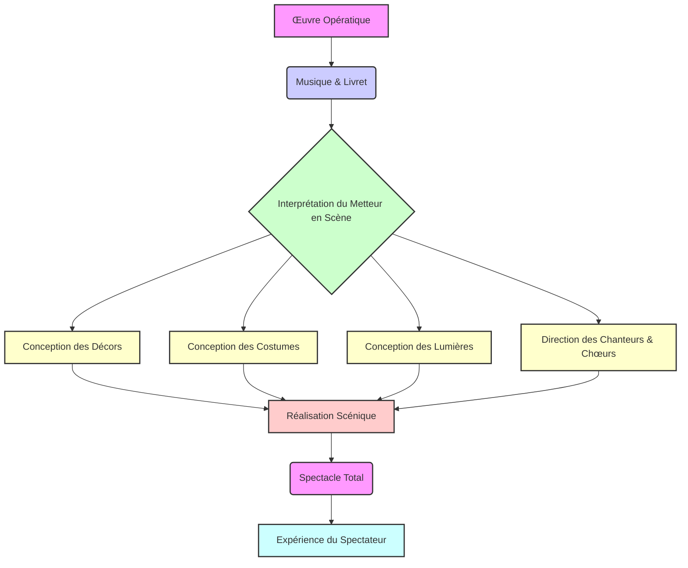

<Prerequisites itemsBase64="W3sidGl0bGUiOiJJbnRyb2R1Y3Rpb24gw6AgbCdIaXN0b2lyZSBkZSBsJ09ww6lyYSIsInNsdWciOiJpbnRyb2R1Y3Rpb24taGlzdG9pcmUtb3BlcmEiLCJsZXZlbCI6IlVuaXZlcnNpdHkgWWVhciAxIC8gQmFjaGVsb3IgMXN0IFllYXIgKEwxKSIsInN1YmplY3QiOiJNdXNpcXVlIn0seyJ0aXRsZSI6IkxlcyBGb25kZW1lbnRzIGRlIGxhIERyYW1hdHVyZ2llIE11c2ljYWxlIiwic2x1ZyI6ImZvbmRlbWVudHMtZHJhbWF0dXJnaWUtbXVzaWNhbGUiLCJsZXZlbCI6IlVuaXZlcnNpdHkgWWVhciAxIC8gQmFjaGVsb3IgMXN0IFllYXIgKEwxKSIsInN1YmplY3QiOiJUaMOpw6J0cmUifV0=" />

<DiagnosticQuiz question="Quel concept esthétique, popularisé par Richard Wagner, décrit l'opéra comme une fusion de tous les arts (musique, poésie, danse, arts visuels) en une œuvre d'art totale ?" options="L'Opéra Seria|||Le Bel Canto|||Le Gesamtkunstwerk|||L'Opéra Bouffe" correctIndex="2" targetSectionId="1-l-évolution-historique-de-la-scenographie-operatique-des-machineries-baroques-aux-concepts-modernes" sectionTitle="L'évolution historique de la scénographie opératique : des machineries baroques aux concepts modernes" />

<CustomFigure type="image" description="Image illustrant une scénographie d'opéra classique, mettant en évidence les décors et les costumes somptueux." alt="Scénographie d'opéra classique" caption="Exemple de scénographie élaborée pour une production d'opéra du XVIIIe siècle, soulignant l'importance du visuel dans l'expérience lyrique. — Source: Photo by [Tanya Prodaan](https://unsplash.com/@tannnpro?utm_source=OpenPrimer&utm_medium=referral) on [Unsplash](https://unsplash.com/?utm_source=OpenPrimer&utm_medium=referral)" title="Image illustrant une scénographie d'opéra classique, mettant en évidence les décors et les costumes somptueux." src="https://images.unsplash.com/photo-1613912399892-15a00703a947?crop=entropy&cs=tinysrgb&fit=max&fm=jpg&ixid=M3w5ODcyMjJ8MHwxfHNlYXJjaHwxfHxTYyVDMyVBOW5vZ3JhcGhpZSUyMGQlMjdvcCVDMyVBOXJhJTIwY2xhc3NpcXVlfGVufDB8fHx8MTc4MzI4MDc1N3ww&ixlib=rb-4.1.0&q=80&w=1080" isIllustration={true} />

## Introduction : L'Opéra, une Synthèse des Arts et le Concept de *Gesamtkunstwerk*

L'opéra, forme d'art hybride par excellence, est depuis ses origines à la fin du XVIe siècle, une manifestation spectaculaire où convergent et dialoguent de multiples disciplines artistiques. Cette convergence lui a valu d'être fréquemment désigné comme un « spectacle total », une expression qui encapsule sa nature intrinsèquement pluridisciplinaire. Le concept de *Gesamtkunstwerk*, ou « œuvre d'art totale », popularisé par le compositeur et théoricien allemand <RealPerson name="Richard Wagner" description="Compositeur, chef d'orchestre, théoricien de la musique et essayiste allemand (1813-1883), célèbre pour ses opéras monumentaux et sa conception de l'œuvre d'art totale.">Richard Wagner (1813-1883)</RealPerson>, bien que spécifiquement formulé pour ses propres drames musicaux, résonne avec cette aspiration originelle de l'opéra à fusionner musique, chant, théâtre, danse, poésie et, de manière cruciale, les arts visuels. Pour Wagner, le *Gesamtkunstwerk* était une tentative de restaurer l'unité des arts telle qu'il l'imaginait dans la tragédie grecque antique, où tous les éléments concouraient à une expression dramatique unifiée et immersive. Il s'agissait de dépasser la simple juxtaposition des arts pour atteindre une véritable symbiose, où chaque composante renforce et est renforcée par les autres, créant une expérience esthétique et émotionnelle d'une intensité inégalée.

Dans ce cadre, la scénographie – l'art de la conception et de la réalisation des décors, des costumes et des lumières – n'est pas un simple embellissement ou un arrière-plan passif. Elle constitue un langage à part entière, un vecteur de sens et d'émotion qui interagit dynamiquement avec la musique et le livret. Les choix esthétiques visuels façonnent l'expérience du spectateur, enrichissent la narration dramatique, et contribuent de manière fondamentale à l'immersion émotionnelle et intellectuelle. L'opéra est, par essence, une forme d'art qui sollicite simultanément l'ouïe et la vue, et l'impact de l'un est indissociable de l'autre.

Cette leçon se propose d'**analyser** en profondeur la fonction et l'évolution de la scénographie et de l'esthétique visuelle dans l'opéra. Nous explorerons comment ces composantes ont évolué au fil des siècles, depuis les machineries baroques jusqu'aux technologies numériques contemporaines. Nous examinerons les fonctions dramatiques et sémiologiques qu'elles remplissent, en montrant comment elles contribuent à la création d'atmosphère, à la caractérisation des personnages, au symbolisme et au rythme visuel du spectacle. Enfin, nous aborderons les défis et les opportunités qu'offrent les nouvelles technologies pour la scénographie opératique, tout en considérant les débats qu'elles suscitent. L'objectif est de démontrer que la dimension visuelle est un pilier essentiel de l'opéra, indispensable à sa compréhension et à son appréciation en tant qu'œuvre d'art totale.

<Objectives>
  <Knowledge>
    <ul className="list-disc pl-4 space-y-1">
      <li>analyser les notions fondamentales de la scénographie et de l'esthétique visuelle de l'opéra.</li>
    </ul>
  </Knowledge>
  <Skills>
    <ul className="list-disc pl-4 space-y-1">
      <li>Évaluer l'impact des choix scénographiques sur la réception et l'interprétation d'une œuvre lyrique.</li>
    </ul>
  </Skills>
  <Attitudes>
    <ul className="list-disc pl-4 space-y-1">
      <li>Développer un esprit critique face aux différentes approches de la mise en scène opératique.</li>
    </ul>
  </Attitudes>
</Objectives>

## 1. L'Évolution Historique de la Scénographie Opératique : Des Machineries Baroques aux Concepts Modernes

L'histoire de l'opéra est intrinsèquement liée à celle de sa mise en scène visuelle, témoignant d'une quête constante d'émerveillement et d'expression dramatique. Dès ses balbutiements, la dimension spectaculaire a été au cœur de cette nouvelle forme artistique.

### 1.1. Les Origines Baroques et l'Âge d'Or des Machineries (Fin XVIe - XVIIIe siècle)

L'opéra est né à la fin du XVIe siècle en <Location name="Florence" description="Ville italienne, berceau de la Renaissance et lieu de naissance de l'opéra.">Florence</Location>, au sein de la Camerata de' Bardi, avec l'ambition de recréer le drame grec antique. Cependant, très rapidement, il s'est distingué par son faste visuel. Les premiers opéras, tels que l'*Euridice* de <RealPerson name="Jacopo Peri" description="Compositeur italien (1561-1633), often considéré comme l'un des inventeurs de l'opéra.">Jacopo Peri (1600)</RealPerson> ou l'*Orfeo* de <RealPerson name="Claudio Monteverdi" description="Compositeur italien (1567-1643), figure majeure de la transition entre la musique de la Renaissance et celle de l'époque baroque, considéré comme l'un des pères de l'opéra.">Claudio Monteverdi (1607)</RealPerson>, étaient des productions de cour, destinées à impressionner par leur magnificence. Les décors étaient souvent peints en trompe-l'œil, créant des illusions de profondeur et de perspective, et les machineries scéniques étaient d'une ingéniosité remarquable. Elles permettaient des transformations spectaculaires : dieux descendant des cieux sur des nuages, mers agitées avec des navires, palais enchantés surgissant du sol. L'objectif était de transporter le public dans un monde mythologique ou héroïque, en accord avec l'esthétique baroque qui valorisait le grandiose, le merveilleux et le spectaculaire, cherchant à susciter l'étonnement et l'admiration (*meraviglia*) <a href="#ref-8">[8]</a>. Des ingénieurs comme <RealPerson name="Giacomo Torelli" description="Ingénieur et scénographe italien (1608-1678), surnommé le 'Grand Sorcier' pour ses machineries théâtrales révolutionnaires.">Giacomo Torelli</RealPerson> ont révolutionné les changements de décors à vue, permettant des transitions fluides et rapides qui renforçaient l'illusion.

Au XVIIIe siècle, l'opéra se démocratise et passe des cours aux théâtrès publics. La scénographie continue d'évoluer, notamment sous l'influence de la célèbre <RealPerson name="Famille Bibiena" description="Célèbre famille d'architectes, de peintres et de scénographes italiens des XVIIe et XVIIIe siècles, reconnue pour ses décors baroques et rococo spectaculaires." unresolved={true}>Famille Bibiena</RealPerson>. Cette dynastie d'architectes, peintres et scénographes italiens a marqué son époque par l'introduction de la *scena per angolo* (scène en angle), qui remplaçait la perspective centrale unique par des points de fuite multiples, créant des espaces scéniques plus dynamiques et complexes. Leurs décors, souvent des architectures monumentales et des ruines grandioses, transformaient l'espace en une œuvre d'art à part entière, renforçant le caractère dramatique et émotionnel des opéras *seria* et *buffa*. Ces innovations visaient à immerger davantage le spectateur dans le récit, en offrant un cadre visuel somptueux et crédible aux récits musicaux.

### 1.2. Le Romantisme et l'Apogée du Grand Opéra (XIXe siècle)

Le XIXe siècle, avec l'avènement du grand opéra romantique, a vu la scénographie atteindre des sommets de réalisme et de magnificence. Des compositeurs comme <RealPerson name="Giacomo Meyerbeer" description="Compositeur allemand (1791-1864), figure de proue du grand opéra français, connu pour ses œuvres spectaculaires et historiquement ambitieuses." unresolved={true}>Giacomo Meyerbeer</RealPerson>, <RealPerson name="Giuseppe Verdi" description="Compositeur italien (1813-1901), l'un des plus grands compositeurs d'opéra de tous les temps, dont les œuvres sont jouées dans le monde entier." unresolved={true}>Giuseppe Verdi</RealPerson> et Richard Wagner (dans ses premières œuvres) exigeaient des décors massifs, historiquement précis et visuellement impressionnants. Les scènes devaient dépeindre fidèlement des lieux exotiques, des batailles épiques, des tempêtes déchaînées ou des scènes de foule grandioses. L'introduction de l'éclairage au gaz, puis électrique, a permis une plus grande subtilité dans la création d'ambiances et d'effets spéciaux, rendant les scènes plus dynamiques et immersives. Les changements de scène devinrent de plus en plus complexes, nécessitant une coordination minutieuse et des équipes techniques importantes.

C'est à cette époque que la fonction du metteur en scène, ou *régisseur*, a commencé à prendre une importance capitale. Auparavant, les productions étaient souvent coordonnées par le compositeur, le chef d'orchestre ou le directeur de théâtre. Mais la complexité croissante des mises en scène a rendu nécessaire une figure centrale capable de coordonner tous les aspects visuels et dramatiques – décors, costumes, lumières, mouvements des chanteurs, effets spéciaux – pour garantir une vision cohérente et unifiée du spectacle. La scénographie n'était plus seulement un arrière-plan, mais un acteur à part entière de la narration, contribuant activement à l'expression des émotions et à la progression de l'intrigue.

### 1.3. La Révolution de la Scénographie Moderne (XXe siècle)

Le XXe siècle a marqué un tournant radical avec l'émergence de la scénographie moderne, en réaction contre le réalisme parfois excessif du XIXe siècle. Des figures visionnaires comme <RealPerson name="Adolphe Appia" description="Théoricien et scénographe suisse (1862-1928), pionnier de la scénographie moderne, qui a révolutionné la conception de l'espace théâtral et l'utilisation de la lumière." unresolved={true}>Adolphe Appia</RealPerson> et <RealPerson name="Edward Gordon Craig" description="Acteur, metteur en scène, scénographe et théoricien du théâtre anglais (1872-1966), partisan d'un théâtre symbolique et stylisé, et inventeur du concept de 'surmarionnette'." unresolved={true}>Edward Gordon Craig</RealPerson> ont prôné une simplification des décors, une utilisation symbolique de la lumière et une importance accrue du mouvement des interprètes dans l'espace tridimensionnel. Appia, en particulier, a insisté sur le rôle unificateur de la lumière, capable de sculpter l'espace et de révéler la plasticité du corps de l'acteur, rejetant les toiles peintes bidimensionnelles au profit de volumes et de niveaux. Craig, quant à lui, a développé l'idée de la « surmarionnette » et de décors abstraits et modulables, privilégiant l'évocation et le symbolisme plutôt que la reproduction fidèle de la réalité.

Ces approches ont ouvert la voie à une grande diversité de styles scénographiques : du minimalisme au réalisme stylisé, en passant par l'abstraction, le constructivisme ou le symbolisme. L'influence de mouvements artistiques comme le Bauhaus, l'Expressionnisme ou le Surréalisme s'est fait sentir sur les scènes d'opéra. Après la Seconde Guerre mondiale, le concept de *Regietheater* (théâtre de metteur en scène) s'est développé, particulièrement en Allemagne, où le metteur en scène est devenu l'interprète principal de l'œuvre, n'hésitant pas à proposer des relectures audacieuses, voire provocatrices, des opéras classiques. Cette approche a mis l'accent sur l'essence émotionnelle et psychologique de l'œuvre, cherchant à créer une atmosphère plutôt qu'une reproduction littérale, et à interroger le public sur le sens profond de l'opéra dans le contexte contemporain.

### Tableau Comparatif : Scénographie Baroque vs. Scénographie Moderne

| Caractéristique Principale | Scénographie Baroque (XVIIe-XVIIIe siècles) | Scénographie Moderne (XXe-XXIe siècles) |
| :------------------------- | :------------------------------------------ | :--------------------------------------- |
| **Objectif Esthétique**    | Émerveillement, illusion, grandeur, *meraviglia* | Évocation, symbolisme, abstraction, interprétation |
| **Décors**                 | Peints en trompe-l'œil, perspective centrale, machineries complexes, changements à vue | Volumes, niveaux, éléments modulables, projections, minimalisme, abstraction |
| **Lumière**                | Éclairage fonctionnel (bougies, gaz), peu de subtilité | Rôle dramatique et symbolique, sculpture de l'espace, création d'ambiances, haute technologie (LEDs, lyres) |
| **Rapport au Texte/Musique** | Illustration littérale, renforcement du faste | Interprétation, parfois déconstruction, dialogue critique, mise en tension |
| **Rôle du Metteur en Scène** | Coordinateur technique, garant de la fidélité | Interprète principal, créateur d'une vision artistique cohérente et souvent originale (*Regietheater*) |
| **Impact sur le Spectateur** | Admiration, immersion dans un monde fantastique | Réflexion, émotion, parfois provocation, questionnement |

## 2. Les Composantes de l'Esthétique Visuelle : Décors, Costumes, Lumières et Mise en Scène

L'esthétique visuelle de l'opéra est le résultat d'une alchimie complexe entre plusieurs éléments fondamentaux, chacun contribuant de manière significative à la signification, à l'impact émotionnel et à la cohérence artistique du spectacle. <ConceptLink name="Sémiologie du spectacle" description="Discipline qui étudie les signes et les systèmes de signification dans le spectacle vivant, y compris le théâtre et l'opéra." unresolved={true}>La sémiologie du spectacle nous offre les outils pour </ConceptLink>**analyser** comment ces signes visuels sont construits, perçus et interprétés par le public, révélant leur polysémie et leur capacité à communiquer des informations au-delà du texte et de la musique [ref3, ref7].

### 2.1. Les Décors : Créateurs d'Espace et d'Atmosphère

Les décors sont la première composante visuelle qui définit l'environnement physique et symbolique de l'action. Ils peuvent être conçus de manière réaliste, cherchant à recréer un lieu spécifique (un palais vénitien, une forêt enchantée, une place de village), ou de manière abstraite, créant une atmosphère générale, un paysage émotionnel ou un univers stylisé. La conception d'un décor implique des choix architecturaux (structures, volumes), des palettes de couleurs (chaudes, froides, vives, ternes), des textures (bois, métal, tissu, projections) et des matériaux qui contribuent à l'ambiance générale. Un décor peut être fixe, évoluer au cours de l'opéra grâce à des changements de scène à vue (par exemple, des coulisses tirées, des éléments qui montent ou descendent) ou à des machineries complexes. L'objectif principal est de créer un environnement qui soutient la musique et le drame, qui ancre l'action dans un contexte crédible ou symbolique, sans jamais les éclipser. Le décor est un personnage silencieux qui interagit avec les chanteurs et le récit, influençant la perception du temps et de l'espace par le spectateur.

### 2.2. Les Costumes : Révélateurs de Caractère et de Statut

Les costumes sont des éléments essentiels de la caractérisation des personnages. Ils ne sont pas de simples vêtements, mais des signes visuels qui communiquent instantanément des informations cruciales au spectateur : le statut social d'un personnage (royauté, paysan, soldat), son époque historique, sa personnalité (austère, excentrique, séducteur) et même ses émotions (une robe déchirée pour la détresse, des couleurs vives pour la joie). La couleur, la coupe, le tissu, les accessoires (bijoux, armes, coiffes) – chaque détail est choisi avec soin pour renforcer l'identité du personnage et son rôle dans l'intrigue. Les costumes peuvent également avoir une fonction symbolique, représentant des idées abstraites, des archétypes (le héros, le traître, l'innocente) ou des affiliations culturelles. Ils interagissent avec le mouvement des chanteurs, soulignant la gestuelle et la dynamique scénique. Le travail du costumier est donc fondamental pour donner corps et crédibilité aux personnages, tout en respectant la vision d'ensemble du metteur en scène <a href="#ref-1">[1]</a>.

### 2.3. Les Lumières : Sculptrices d'Espace et d'Émotion

L'éclairage est sans doute l'élément le plus subtil mais aussi le plus puissant de la scénographie. Sa fonction dépasse largement la simple illumination de la scène. La lumière sculpte l'espace, crée des ambiances, dirige l'attention du spectateur vers des points précis, souligne les moments dramatiques et peut même symboliser des états psychologiques ou des forces invisibles. Les variations d'intensité (du clair au sombre), de couleur (chaude, froide, saturée), de direction (contre-jour, latéral, zénithal) et de mouvement peuvent transformer radicalement la perception d'un décor ou d'un personnage. Une lumière bleutée et diffuse peut évoquer la mélancolie ou le mystère, tandis qu'un éclairage vif et contrasté peut suggérer la tension ou la violence. L'évolution technologique, des bougies aux lampes à gaz, puis à 
l'électricite et aux projecteurs informatisés (lyres, LEDs), a considérablement élargi les possibilités expressives de la lumière scénique, permettant des transitions fluides, des effets spéciaux complexes et une réactivité instantanée à la musique. Le concepteur lumière est un véritable artiste qui « peint » avec la lumière, créant des tableaux vivants qui évoluent avec le drame.

### 2.4. La Mise en Scène (Regie) : L'Art de l'Orchestration Visuelle

La mise en scène, ou *Regie* en allemand, est l'art d'organiser tous les éléments visuels et performatifs sur scène dans une vision cohérente et interprétative de l'œuvre. Le metteur en scène est le chef d'orchestre de la dimension visuelle du spectacle. Il interprète le livret et la partition, et décide de la manière dont l'histoire sera racontée visuellement. Cela inclut le mouvement des chanteurs (leur *blocking*), leur positionnement dans l'espace, leurs gestes, l'utilisation des accessoires, et l'intégration harmonieuse des décors, des costumes et des lumières. Une mise en scène peut être traditionnelle, respectant les conventions historiques et l'intention supposée du compositeur, ou moderne, proposant une relecture audacieuse, parfois anachronique ou déconstructiviste, de l'œuvre pour la rendre pertinente aux sensibilités contemporaines. La mise en scène est le fil conducteur qui lie toutes les composantes du spectacle total, assurant que chaque élément visuel contribue à la narration dramatique et à l'expression artistique globale. C'est par la mise en scène que l'œuvre prend vie sur scène, transformant un texte et une partition en une expérience sensorielle et intellectuelle complète.

Voici un diagramme Mermaid illustrant l'interdépendance des éléments visuels dans la création d'un spectacle opératique, sous la direction du metteur en scène:

## 3. Fonction Dramatique et Sémiologie du Visuel : Le Langage des Signes Scéniques

Au-delà de leur beauté intrinsèque et de leur rôle esthétique, les éléments visuels de l'opéra remplissent des fonctions dramatiques et sémiologiques essentielles. Ils ne sont pas de simples ornements, mais des vecteurs de sens qui participent activement à la narration, à la caractérisation et à l'expression émotionnelle. <ConceptLink name="La sémiologie théâtrale" description="L'étude des signes et des systèmes de signification dans le contexte du théâtre, y compris les éléments visuels, sonores et gestuels." unresolved={true}>La sémiologie théâtrale</ConceptLink>, développée par des chercheurs comme <RealPerson name="Patrice Pavis" description="Théoricien du théâtre français (né en 1947), spécialiste de la sémiologie du spectacle et de l'interculturalité théâtrale." unresolved={true}>Patrice Pavis</RealPerson>, nous apprend que chaque élément présent sur scène – un décor, un costume, une lumière, un geste – est un signe qui produit du sens et qui est interprété par le spectateur en fonction de son contexte culturel, historique et personnel. Ces signes visuels interagissent avec les signes sonores (musique, chant) et verbaux (livret) pour construire une signification globale et complexe.

### 3.1. Création d'Atmosphère et d'Ambiance

La scénographie est un puissant outil pour établir l'atmosphère et l'ambiance d'une scène ou d'un acte entier. Un décor sombre et labyrinthique, combiné à un éclairage bleuté et des costumes déchirés, peut instantanément évoquer un sentiment de désespoir ou de menace. À l'inverse, des couleurs vives, des décors ouverts et une lumière chaleureuse peuvent suggérer la joie, l'espoir ou la légèreté. Ces choix ne sont pas arbitraires ; ils sont délibérément conçus pour préparer le spectateur émotionnellement à ce qui va se dérouler, renforçant l'impact de la musique et du drame. L'ambiance visuelle peut également souligner les contrastes dramatiques, comme le passage d'une scène intime et sombre à un grand ensemble lumineux et festif, créant un rythme émotionnel pour le public.

### 3.2. Caractérisation des Personnages et Symbolisme

Les éléments visuels contribuent de manière significative à la caractérisation des personnages. Un costume peut révéler le statut social, l'âge, la profession, la personnalité ou même l'état psychologique d'un personnage. Par exemple, un roi sera paré de riches étoffes et de symboles de pouvoir, tandis qu'un personnage en deuil portera des couleurs sombres. Au-delà de la simple représentation, la scénographie peut être hautement symbolique. Un arbre solitaire sur scène peut symboliser la solitude, un miroir brisé la fragmentation de l'âme, ou une couleur dominante (le rouge pour la passion ou le danger, le blanc pour la pureté ou la mort) peut porter des significations profondes qui enrichissent la narration. Ces symboles visuels, souvent universels mais parfois spécifiques à une culture ou à une production, ajoutent des couches de sens qui peuvent être interprétées consciemment ou inconsciemment par le public.

### 3.3. Rythme Visuel et Dynamique Scénique

La scénographie participe également au rythme et à la dynamique du spectacle. Les changements de décors, les variations d'éclairage, l'entrée et la sortie des personnages, les mouvements de foule – tous ces éléments créent un flux visuel qui peut accélérer ou ralentir la perception du temps dramatique. Un changement de scène rapide peut marquer une ellipse temporelle ou un changement radical de lieu, tandis qu'un décor statique et oppressant peut accentuer la stagnation ou l'enfermement d'un personnage. La chorégraphie des mouvements des chanteurs et des chœurs, orchestrée par le metteur en scène, est également une composante essentielle du rythme visuel, créant des tableaux vivants qui évoluent en harmonie avec la musique.

### 3.4. La Scénographie comme Métaphore et Interprétation

Dans les productions contemporaines, la scénographie va souvent au-delà de la simple illustration pour devenir une métaphore visuelle de l'œuvre. Elle peut proposer une interprétation conceptuelle, parfois éloignée de l'époque ou du lieu original de l'opéra, pour en souligner des thèmes universels ou des résonances contemporaines. Par exemple, une production de *Don Giovanni* se déroulant dans un club berlinois moderne peut utiliser les codes visuels de cet environnement pour explorer les thèmes de la séduction, de la transgression et de la chute dans un contexte actuel. Cette approche invite le spectateur à une réflexion plus profonde sur le sens de l'œuvre, en lui offrant une nouvelle perspective visuelle qui dialogue avec la musique et le livret.

## 4. L'Opéra face aux Technologies Contemporaines : Défis et Opportunités

Le XXIe siècle a vu l'émergence de nouvelles technologies qui transforment radicalement les possibilités de la scénographie opératique. Ces innovations offrent des opportunités inédites pour la création visuelle, mais posent également des défis esthétiques et techniques.

### 4.1. Projections Vidéo et Mapping

L'une des avancées les plus significatives est l'utilisation généralisée des projections vidéo et du *video mapping*. Plutôt que de construire des décors physiques complexes, les scénographes peuvent désormais projeter des images statiques ou animées sur des surfaces, créant des environnements dynamiques et changeants. Le *video mapping* permet de projeter des images avec une précision millimétrique sur des objets en trois dimensions, transformant des structures simples en paysages urbains, forêts enchantées ou intérieurs grandioses en un instant. Cette technologie offre une flexibilité et une rapidité de transformation inégalées, permettant des transitions fluides entre les scènes et la création d'effets visuels spectaculaires qui étaient auparavant impossibles. Elle peut également interagir en temps réel avec la musique ou les mouvements des interprètes, créant une expérience immersive et interactive.

### 4.2. Réalité Augmentée et Virtuelle

Bien que moins

<CustomFigure type="image" description="Image représentant l'esthétique visuelle d'une mise en scène d'opéra moderne, avec un éclairage dramatique et des projections." alt="Esthétique visuelle opéra moderne" caption="Figure 1: L'esthétique visuelle contemporaine dans l'opéra utilise souvent des technologies avancées pour créer des ambiances immersives et symboliques. — Source: [Wikimedia Commons](https://commons.wikimedia.org/wiki/File:Werff_Homage_to_the_Arts.jpg)" title="Image représentant l'esthétique visuelle d'une mise en scène d'opéra moderne, avec un éclairage dramatique et des projections." src="https://upload.wikimedia.org/wikipedia/commons/d/df/Werff_Homage_to_the_Arts.jpg" fallbackUrl="https://commons.wikimedia.org/wiki/File:Werff_Homage_to_the_Arts.jpg" />

<Video id="dZTvpifyWkQ" url="https://www.youtube.com/watch?v=dZTvpifyWkQ" title="Extrait vidéo d'une scène d'opéra illustrant le concept de 'spectacle total', où musique, chant, danse, décors et costumes fusionnent." />

<CustomFigure type="image" description="Image comparative de l'évolution de la scénographie opératique, d'une scène baroque à une scène contemporaine." alt="Évolution scénographie opéra" caption="Figure 2: L'évolution de la scénographie opératique reflète les changements esthétiques et technologiques à travers les siècles. — Source: [Wikimedia Commons](https://commons.wikimedia.org/wiki/File:Paris_Palais_Garnier_2010-04-06_16.55.07.jpg)" title="Image comparative de l'évolution de la scénographie opératique, d'une scène baroque à une scène contemporaine." src="https://upload.wikimedia.org/wikipedia/commons/6/6d/Paris_Palais_Garnier_2010-04-06_16.55.07.jpg" fallbackUrl="https://commons.wikimedia.org/wiki/File:Paris_Palais_Garnier_2010-04-06_16.55.07.jpg" />

## Conclusion

<WhatsNext itemsBase64="W10=" />
## Évaluation Finale
<Option text="Le drame musical" correct={false} />
  <Option text="L'opéra-ballet" correct={false} />
  <Option text="Le spectacle total" correct={true} />
  <Option text="Le mélodrame" correct={false} />

### Glossaire

- **Esthétique visuelle** : L'étude des principes de beauté et d'appréciation artistique appliqués aux éléments visuels d'une œuvre, tels que la composition, la couleur, la forme et la lumière dans le contexte de l'opéra.
- **Gesamtkunstwerk** : Terme allemand signifiant 'œuvre d'art totale', popularisé par Richard Wagner pour décrire un idéal où toutes les formes d'art (musique, poésie, danse, arts visuels) sont unifiées dans une seule œuvre dramatique.
- **La sémiologie du spectacle nous offre les outils pour** : Discipline qui étudie les signes et les systèmes de signification dans le spectacle vivant, y compris le théâtre et l'opéra.
- **La sémiologie théâtrale, développée par des chercheurs comme** : L'étude des signes et des systèmes de signification dans le contexte du théâtre, y compris les éléments visuels, sonores et gestuels.
- **Scénographie** : L'art de l'organisation de l'espace scénique, incluant les décors, les lumières, les costumes et les accessoires, pour créer l'environnement visuel d'une production d'opéra.

### Références

<References itemsBase64="W3sibnVtIjoxLCJ0ZXh0IjoiQmFydGhlcywgUm9sYW5kLiAxOTcwLiDCqyBMJ09idmllIGV0IGwnT2J0dXMgOiBFc3NhaXMgY3JpdGlxdWVzIElJSSDCuy4gw4lkaXRpb25zIGR1IFNldWlsLiIsInNjaG9sYXJVcmwiOiJodHRwczovL2Jvb2tzLmdvb2dsZS5jb20vYm9va3M/cT1CYXJ0aGVzJTIwJTIyTCdPYnZpZSUyMGV0JTIwbCdPYnR1cyUyMiUyMDE5NzAiLCJzY2hvbGFyVGV4dCI6Ikdvb2dsZSBCb29rcyIsImlzVW51c2VkIjpmYWxzZX0seyJudW0iOjIsInRleHQiOiJDYXJsc29uLCBNYXJ2aW4uIDE5OTMuIMKrIHRow6lvcmllcyBvZiB0aGUgVGhlYXRyZTogQSBIaXN0b3JpY2FsIGFuZCBDcml0aWNhbCBTdXJ2ZXksIGZyb20gdGhlIEdyZWVrcyB0byB0aGUgUHJlc2VudCDCuy4gQ29ybmVsbCBVbml2ZXJzaXR5IFByZXNzLiIsInNjaG9sYXJVcmwiOiJodHRwczovL2Jvb2tzLmdvb2dsZS5jb20vYm9va3M/cT1DYXJsc29uJTIwJTIydGglQzMlQTlvcmllcyUyMG9mJTIwdGhlJTIwVGhlYXRyZSUyMiUyMDE5OTMiLCJzY2hvbGFyVGV4dCI6Ikdvb2dsZSBCb29rcyIsImlzVW51c2VkIjp0cnVlfSx7Im51bSI6MywidGV4dCI6IkRlIE1hcmluaXMsIE1hcmNvLiAxOTkzLiDCqyBUaGUgU2VtaW90aWNzIG9mIFBlcmZvcm1hbmNlIMK7LiBJbmRpYW5hIFVuaXZlcnNpdHkgUHJlc3MuIiwic2Nob2xhclVybCI6Imh0dHBzOi8vYm9va3MuZ29vZ2xlLmNvbS9ib29rcz9xPURlJTIwTWFyaW5pcyUyMCUyMlRoZSUyMFNlbWlvdGljcyUyMG9mJTIwUGVyZm9ybWFuY2UlMjIlMjAxOTkzIiwic2Nob2xhclRleHQiOiJHb29nbGUgQm9va3MiLCJpc1VudXNlZCI6dHJ1ZX0seyJudW0iOjQsInRleHQiOiJXYWduZXIsIFJpY2hhcmQuIDE4NTEuIMKrIE9ww6lyYSBldCBEcmFtZSDCuy4gVHJhZHVjdGlvbiBmcmFuw6dhaXNlIHBhciBKYWNxdWVzLUdhYnJpZWwgUHJvZCdob21tZSwgMTkwNy4gTGlicmFpcmllIEZpc2NoYmFjaGVyLiIsInNjaG9sYXJVcmwiOiJodHRwczovL2Jvb2tzLmdvb2dsZS5jb20vYm9va3M/cT1XYWduZXIlMjAlMjJPcCVDMyVBOXJhJTIwZXQlMjBEcmFtZSUyMiUyMDE4NTEiLCJzY2hvbGFyVGV4dCI6Ikdvb2dsZSBCb29rcyIsImlzVW51c2VkIjp0cnVlfV0=" />

