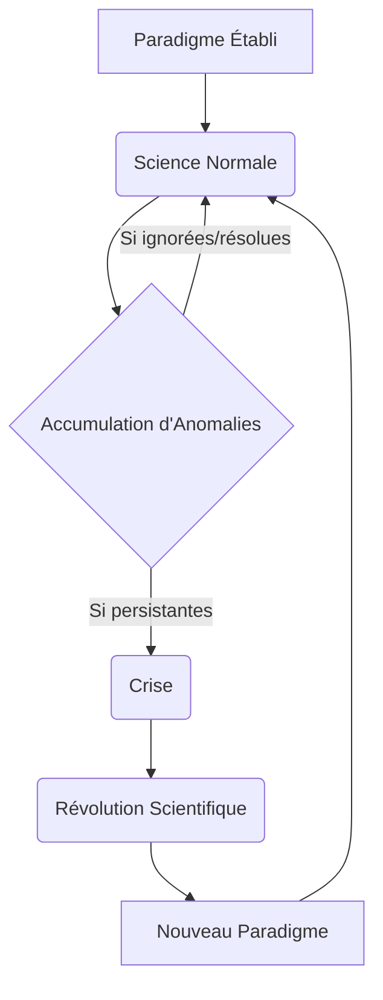

<Prerequisites itemsBase64="W3sidGl0bGUiOiJJbnRyb2R1Y3Rpb24gw6AgbGEgcGhpbG9zb3BoaWUiLCJzbHVnIjoiaW50cm9kdWN0aW9uLXBoaWxvc29waGllIiwibGV2ZWwiOiJVbml2ZXJzaXR5IFllYXIgMSIsInN1YmplY3QiOiJQaGlsb3NvcGhpZSJ9LHsidGl0bGUiOiJQZW5zw6llIGNyaXRpcXVlIGV0IGFyZ3VtZW50YXRpb24iLCJzbHVnIjoicGVuc2VlLWNyaXRpcXVlLWFyZ3VtZW50YXRpb24iLCJsZXZlbCI6IlVuaXZlcnNpdHkgWWVhciAxIiwic3ViamVjdCI6Ik3DqXRob2RvbG9naWUifV0=" />

<DiagnosticQuiz question="Quelle est la principale caracteristique qui distingue une approche scientifique d'une approche non scientifique, selon une perspective philosophique générale ?" options="L'utilisation de technologies avancées.|||La recherche de la vérité absolue.|||La capacité à être falsifiée par l'expérience.|||L'adhésion à des dogmes établis." correctIndex="2" targetSectionId="introduction-demarcation" sectionTitle="Introduction au probleme de la demarcation" />

## Introduction : Le problème de la démarcation en philosophie des sciences

La question fondamentale qui sous-tend toute réflexion sur la nature de la connaissance scientifique est celle de la **démarcation**. Comment distinguer ce qui relève de la science de ce qui n'en relève pas ? Cette interrogation, loin d'être une simple querelle sémantique, constitue un enjeu crucial pour la philosophie des sciences et, plus largement, pour la société. Il s'agit de comprendre les critères qui permettent de séparer les théories scientifiques des doctrines métaphysiques, des pseudo-sciences (comme l'astrologie ou certaines formes de psychanalyse), ou même des simples croyances.

Les enjeux de cette problématique sont multiples. Pour la philosophie des sciences, elle permet de définir son objet d'étude et de comprendre les mécanismes de production et de validation des connaissances. Pour la société, une distinction claire est essentielle pour évaluer la crédibilité des affirmations, orienter les politiques publiques basées sur des preuves, et promouvoir une pensée critique face aux discours non fondés. En effet, la science est souvent perçue comme la forme de connaissance la plus fiable et la plus objective, d'où l'importance de pouvoir identifier ce qui mérite cette appellation.

Au cours de cette leçon, nous explorerons les réponses apportées par plusieurs figures majeures de l'épistémologie du XXe siècle. Nous commencerons par la proposition influente de **Karl Popper** et son critère de falsifiabilité. Nous examinerons ensuite les perspectives de **Thomas Kuhn** et de **Paul Feyerabend**, qui ont remis en question la possibilité d'un critère de démarcation universel et intemporel, ouvrant la voie à une compréhension plus complexe et historicisée de la science.

<Objectives>
  <Knowledge>
    <ul className="list-disc pl-4 space-y-1">
      <li>analyser les principales caractéristiques et les enjeux historiques du problème de la démarcation en philosophie des sciences.</li>
      <li>Évaluer la pertinence et les limites des critères de scientificité proposés par différents épistémologues.</li>
      <li>Distinguer les approches scientifiques des approches pseudo-scientifiques ou non-scientifiques en s'appuyant sur des cadres théoriques.</li>
    </ul>
  </Knowledge>
  <Skills>
    <ul className="list-disc pl-4 space-y-1">
      <li>Appliquer des critères épistémologiques pour évaluer la scientificité d'une théorie ou d'une pratique donnée.</li>
      <li>analyser des textes philosophiques traitant du problème de la démarcation pour en extraire les arguments clés.</li>
      <li>Développer une argumentation critique sur les défis contemporains posés par la pseudo-science.</li>
    </ul>
  </Skills>
  <Attitudes>
    <ul className="list-disc pl-4 space-y-1">
      <li>Développer une curiosité intellectuelle pour les fondements et les méthodes de la connaissance scientifique.</li>
      <li>Adopter une posture critique et réflexive face aux affirmations non vérifiées ou pseudo-scientifiques.</li>
      <li>Valoriser la rigueur méthodologique et l'honnêteté intellectuelle dans la recherche de la vérité.</li>
    </ul>
  </Attitudes>
</Objectives>

## Karl Popper et le critère de falsifiabilité
La réflexion de Karl Popper (1902-1994) sur la démarcation est née de son insatisfaction face aux critères de scientificité dominants de son époque, notamment l'inductivisme et le vérificationnisme. L'**inductivisme** postule que les théories scientifiques sont dérivées d'un grand nombre d'observations particulières, qui permettent ensuite de généraliser des lois universelles. Cependant, comme l'avait déjà souligné David Hume, aucune quantité d'observations singulières ne peut logiquement garantir la vérité d'une loi universelle : le soleil s'est levé tous les jours jusqu'à présent, mais cela ne prouve pas qu'il se lèvera demain.

Le **vérificationnisme**, promu notamment par le Cercle de Vienne et les positivistes logiques, proposait que le sens d'une proposition réside dans sa méthode de vérification empirique. Une théorie serait scientifique si elle pouvait être confirmée par l'expérience. Popper a critiqué cette approche en soulignant que de nombreuses théories, y compris des pseudo-sciences comme l'astrologie ou la psychanalyse freudienne, pouvaient toujours trouver des « preuves » ou des « confirmations » *a posteriori* pour étayer leurs affirmations. Ces théories semblaient expliquer tout événement, rendant impossible leur réfutation et, paradoxalement, les privant de tout contenu scientifique réel.

Face à ces limites, Popper a proposé le **critère de falsifiabilité** (ou réfutabilité) comme principe de démarcation. Pour qu'une théorie soit scientifique, elle doit être formulée de telle manière qu'il soit possible de la tester empiriquement et, potentiellement, de la réfuter. Autrement dit, une théorie scientifique doit prendre des risques : elle doit faire des prédictions précises et audacieuses qui, si elles s'avèrent fausses, entraîneraient l'abandon ou la modification de la théorie. La falsifiabilité n'est pas un critère de vérité, mais un critère de scientificité. Une théorie falsifiable n'est pas nécessairement fausse, mais elle est *testable*.

Popper illustre cette idée avec des exemples frappants. L'**astrologie**, selon lui, n'est pas falsifiable car ses prédictions sont souvent vagues ou peuvent être réinterprétées pour s'adapter à n'importe quel événement. De même, la **psychanalyse** de Freud ou le **marxisme** dans certaines de ses formulations étaient critiqués par Popper pour leur capacité à expliquer tout comportement ou tout événement historique *après coup*, sans jamais pouvoir être mis en défaut par une observation contraire. En revanche, la **théorie de la relativité d'Einstein** est un exemple de théorie scientifique car elle a fait des prédictions très spécifiques (comme la déviation de la lumière des étoiles par le champ gravitationnel du soleil) qui auraient pu être falsifiées par l'observation. Le fait que ces prédictions aient été confirmées a renforcé la théorie, mais ce qui la rend scientifique est sa *capacité à être falsifiée*.

Les implications de cette approche pour la méthode scientifique sont profondes. La science, pour Popper, ne progresse pas par l'accumulation de vérités vérifiées, mais par l'**élimination d'erreurs**. Le scientifique ne cherche pas à confirmer sa théorie, mais à la soumettre aux tests les plus rigoureux possibles, cherchant activement à la réfuter. Ce processus de « conjectures et réfutations » (ou d'essais et erreurs) est le moteur du progrès scientifique. Les théories scientifiques sont donc toujours provisoires, des hypothèses qui n'ont pas encore été falsifiées, mais qui pourraient l'être à tout moment par une nouvelle expérience ou observation.

Après avoir exploré la perspective de Karl Popper sur la démarcation scientifique par la falsifiabilité, il est essentiel de se tourner vers d'autres approches qui ont profondément remis en question cette vision, notamment en intégrant des dimensions historiques et sociologiques.

## Thomas Kuhn et la notion de paradigme
Thomas Kuhn, dans son ouvrage majeur *La structure des révolutions scientifiques*, propose une vision radicalement différente du développement scientifique, s'éloignant de l'idée d'un progrès linéaire et cumulatif. Pour Kuhn, la science ne progresse pas uniquement par l'accumulation de découvertes ou la réfutation d'hypothèses isolées, mais par des périodes de stabilité ponctuées de ruptures majeures.

Au cœur de sa théorie se trouve la notion de **paradigme**. Un paradigme n'est pas simplement une théorie ou un ensemble de lois ; c'est une matrice disciplinaire partagée par une communauté scientifique à un moment donné. Il englobe un ensemble de théories, de lois, de techniques expérimentales, de valeurs, de problèmes jugés pertinents et de solutions exemplaires qui servent de modèles. C'est un cadre conceptuel et méthodologique qui guide la recherche et définit ce qui est considéré comme de la « bonne science ».

La majeure partie de l'activité scientifique se déroule sous le régime de la **science normale**. Durant cette période, les scientifiques travaillent *à l'intérieur* d'un paradigme établi. Leur tâche consiste à résoudre des « énigmes » ou des « puzzles » que le paradigme a lui-même définis, en utilisant les outils et les concepts qu'il fournit. La science normale est une activité de résolution de problèmes, non de remise en question des fondements. Les anomalies, c'est-à-dire les observations qui ne s'accordent pas avec les prédictions du paradigme, sont généralement ignorées, expliquées par des ajustements mineurs, ou considérées comme des échecs de l'expérimentateur plutôt que du paradigme lui-même.

Cependant, l'accumulation d'anomalies persistantes et de plus en plus difficiles à ignorer peut mener à une **crise**. Lorsque la confiance dans la capacité du paradigme à résoudre les problèmes fondamentaux s'érode, la communauté scientifique entre dans une période d'incertitude et de débat intense. Cette crise peut finalement déboucher sur une **révolution scientifique**. Une révolution scientifique est un changement de paradigme, un basculement complet de la vision du monde et des pratiques scientifiques. Ce n'est pas un processus cumulatif où l'ancien est simplement amélioré ; c'est plutôt une « conversion » ou un « changement de Gestalt », où les anciens problèmes sont vus sous un jour nouveau, et de nouveaux problèmes émergent.

La notion de paradigme et de révolution scientifique remet en question la démarcation poppérienne et l'idée de progrès linéaire de plusieurs manières. Premièrement, la science normale, telle que décrite par Kuhn, n'est pas principalement axée sur la falsification. Au contraire, les scientifiques s'efforcent de faire correspondre la réalité au paradigme, et non de le réfuter. La falsification, si elle se produit, est d'abord traitée comme une anomalie, et c'est seulement son accumulation qui peut potentiellement déclencher une crise. Deuxièmement, les paradigmes sont souvent **incommensurables** : ils ne peuvent pas être comparés directement sur un terrain neutre, car ils définissent leurs propres critères de validité, leurs propres problèmes et leurs propres solutions. Cela signifie que le passage d'un paradigme à un autre n'est pas nécessairement un progrès vers une « vérité » plus grande ou une meilleure approximation de la réalité, mais plutôt un changement dans la manière de voir et d'interroger le monde. Le progrès scientifique, pour Kuhn, est donc plus une succession de « meilleures » résolutions d'énigmes au sein de cadres changeants qu'une marche continue vers la vérité objective.

Pour mieux comprendre la dynamique du développement scientifique selon Kuhn, voici une comparaison entre la science normale et la révolution scientifique, suivie d'un diagramme illustrant le cycle paradigmatique.

| Caractéristique             | Science Normale                                     | Révolution Scientifique                               |
| :-------------------------- | :-------------------------------------------------- | :---------------------------------------------------- |
| **Objectif Principal**      | Résoudre des « énigmes » au sein du paradigme existant | Remplacer un paradigme par un nouveau                 |
| **Nature de l'activité**    | Cumulatif, résolution de problèmes, « puzzle-solving » | Non cumulatif, rupture, « changement de Gestalt »       |
| **Attitude face aux anomalies** | Ignorées, expliquées par des ajustements mineurs, ou considérées comme des échecs de l'expérimentateur | Accumulation d'anomalies persistantes, source de crise |
| **Rôle du paradigme**       | Cadre conceptuel et méthodologique stable           | Remise en question et remplacement du cadre           |
| **Progrès**                 | Progrès au sein du paradigme (résolution d'énigmes) | Progrès par changement de perspective (incommensurabilité) |

## Paul Feyerabend : Contre la méthode et l'anarchisme épistémologique
Poussant la critique de la rationalité scientifique et de la démarcation à son paroxysme, Paul Feyerabend, dans son œuvre provocatrice *Contre la méthode*, développe une position d'**anarchisme épistémologique**. Feyerabend rejette l'idée même qu'il puisse exister une méthode scientifique universelle et rationnelle qui garantirait le progrès de la connaissance. Pour lui, toute tentative de définir des règles fixes et universelles pour la science est non seulement futile, mais aussi nuisible à la créativité et à l'avancement de la connaissance.

Son slogan célèbre, « tout est bon » (*anything goes*), résume sa critique radicale. Feyerabend soutient qu'historiquement, les avancées scientifiques majeures n'ont pas respecté une méthode rigoureuse, mais ont souvent procédé par des violations audacieuses des règles établies, par l'opportunisme, l'intuition, voire l'irrationalité. Il cite des exemples comme Galilée, qui a utilisé des arguments rhétoriques et des théories non confirmées pour défendre sa vision du monde, ou la coexistence de l'astrologie et de l'astronomie à certaines époques. Pour Feyerabend, imposer une méthode unique reviendrait à étouffer l'innovation et à limiter la liberté intellectuelle des scientifiques.

L'**anarchisme épistémologique** de Feyerabend implique que la science n'est pas supérieure aux autres formes de connaissance (mythes, religions, arts, savoirs traditionnels) en vertu d'une méthode intrinsèquement plus rationnelle ou plus efficace. Il la considère comme une tradition parmi d'autres, avec ses propres dogmes, ses propres préjugés et ses propres limites. Il plaide pour une séparation de la science et de l'État, afin d'éviter que la science ne devienne une idéologie dominante et oppressive.

Les implications de cette position pour la rationalité scientifique et le problème de la démarcation sont profondes. Si « tout est bon », alors il n'y a plus de critère distinctif pour séparer la science de la non-science. La démarcation devient un problème illusoire, car il n'y a pas de frontière fixe ou de méthode universelle à défendre. La rationalité scientifique, loin d'être une entité monolithique, est déconstruite en une multitude de pratiques contextuelles et souvent contradictoires. Feyerabend nous invite à embrasser un pluralisme méthodologique et théorique, où la liberté et la créativité priment sur la conformité à des règles arbitraires. Sa pensée est une invitation à la prudence face à toute forme de dogmatisme, y compris celui qui se parerait des atours de la science.

Pour mieux situer la position radicale de Feyerabend, voici une comparaison avec une vision plus traditionnelle de la science.

| Caractéristique             | Vision Traditionnelle de la Science (ex: Popper)     | Anarchisme Épistémologique (Feyerabend)               |
| :-------------------------- | :--------------------------------------------------- | :---------------------------------------------------- |
| **Méthode Scientifique**    | Unique, universelle, rationnelle (ex: falsification) | Aucune méthode universelle, « tout est bon »            |
| **Progrès Scientifique**    | Linéaire, cumulatif, par élimination des erreurs     | Non linéaire, opportuniste, par violations des règles |
| **Rapport Science/Autres Savoirs** | Science supérieure par sa méthode et sa rationalité | Science est une tradition parmi d'autres, pas de supériorité intrinsèque |
| **Critère de Démarcation**  | Existent (ex: falsifiabilité)                       | Illusoire, pas de frontière fixe ou de méthode universelle |
| **Rôle de la Rationalité**  | Fondamentale, guide la recherche                     | Souvent entravante, la créativité prime               |

## Débats contemporains et limites du problème de la démarcation
La confrontation des thèses de Popper, Kuhn et Feyerabend révèle l'ampleur et la complexité du problème de la démarcation, transformant la quête d'un critère unique en un débat philosophique profond sur la nature même de la connaissance scientifique. Karl Popper, avec sa proposition de falsifiabilité, a cherché à établir une ligne de partage claire et logique, distinguant la science par sa capacité à être réfutée. Pour lui, le progrès scientifique est rationnel et cumulatif, procédant par l'élimination des théories fausses. Thomas Kuhn, en revanche, a introduit une perspective historique et sociologique, montrant que la science progresse non pas par une accumulation linéaire, mais par des « révolutions scientifiques » qui voient le remplacement d'un « paradigme » par un autre. Cette vision met en lumière l'incommensurabilité des théories et le rôle des facteurs non purement logiques (sociaux, psychologiques) dans le changement scientifique, rendant la démarcation plus contextuelle et moins universelle. Enfin, Paul Feyerabend, en poussant la critique à son paroxysme, a contesté l'existence même d'une méthode scientifique universelle et supérieure, prônant un « anarchisme épistémologique » où « tout est bon ». Pour Feyerabend, la science est une tradition parmi d'autres, et la recherche d'un critère de démarcation est une entreprise illusoire et potentiellement dogmatique.

Pour mieux appréhender les nuances de ces approches, le tableau suivant compare leurs positions sur la démarcation scientifique :

| Philosophe | Critère de Démarcation | Nature du Progrès Scientifique | Limites/Implications |
| :--------- | :--------------------- | :----------------------------- | :------------------- |
| Karl Popper | Falsifiabilité (réfutabilité) | Rationnel, cumulatif, par élimination des erreurs | Peine à rendre compte de la « science normale » ; idéalisation de la pratique scientifique. |
| Thomas Kuhn | Changement de paradigme (révolution) | Non linéaire, discontinu, par ruptures (révolutions scientifiques) | Relativisme potentiel ; difficulté à expliquer le progrès inter-paradigmatique. |
| Paul Feyerabend | Aucun critère universel (« tout est bon ») | Anarchique, créatif, sans méthode unique | Risque de confusion entre science et non-science ; critique radicale de la rationalité scientifique. |

Ces divergences fondamentales soulignent les limites et les difficultés inhérentes à la recherche d'un critère de démarcation unique et universel. La pratique scientifique est trop diverse, historiquement contingente et contextuellement dépendante pour être enfermée dans une définition rigide. Les tentatives de définir la science par un ensemble de conditions nécessaires et suffisantes se heurtent à des contre-exemples historiques ou à l'exclusion arbitraire de disciplines légitimes. Par exemple, la falsifiabilité poppérienne peine à rendre compte de la science normale kuhnienne, où les scientifiques travaillent à résoudre des énigmes au sein d'un paradigme établi plutôt qu'à le réfuter. De même, l'approche de Kuhn, bien que plus nuancée, a été critiquée pour son relativisme potentiel et la difficulté à expliquer le progrès inter-paradigmatique. La position radicale de Feyerabend, bien que provocatrice, a le mérite de nous rappeler que la créativité et la liberté intellectuelle sont des moteurs essentiels de la découverte, souvent au-delà des cadres méthodologiques prescrits.

Les perspectives actuelles sur la nature de la science tendent à s'éloigner de la quête d'un critère de démarcation strict au profit d'une compréhension plus nuancée et pluraliste. Plutôt que de chercher une « essence » de la science, de nombreux épistémologues contemporains adoptent une approche plus pragmatique et descriptive. Ils reconnaissent la pluralité des méthodes scientifiques, adaptées aux objets d'étude et aux contextes disciplinaires variés. La science est désormais souvent comprise comme une entreprise complexe, caractérisée par un ensemble de « ressemblances familiales » (pour reprendre une analogie wittgensteinienne) plutôt que par des propriétés définies et exclusives. Ces ressemblances incluent l'engagement envers l'observation empirique, la formulation d'hypothèses testables, la révisabilité des théories, la discussion critique au sein de communautés de pairs, et une certaine forme de rationalité, même si celle-ci n'est pas toujours celle d'une logique pure. L'accent est mis sur la dynamique des pratiques scientifiques, leur évolution, et leur interaction avec les contextes sociaux, technologiques et éthiques. Le problème de la démarcation ne disparaît pas, mais il se transforme : il s'agit moins de tracer une ligne infranchissable que de comprendre les mécanismes par lesquels certaines formes de savoir acquièrent une autorité épistémique et une fiabilité reconnue, tout en restant ouvertes à la critique et à la révision.

## Conclusion
Ce parcours à travers les théories de Popper, Kuhn et Feyerabend a mis en lumière la complexité et les défis persistants posés par la question « Qu'est-ce que la science ? ». Initialement formulé comme un problème de démarcation visant à distinguer la science de la pseudoscience par un critère logique et universel, ce problème s'est progressivement enrichi et complexifié. De la falsifiabilité poppérienne, qui offrait une solution élégante mais parfois réductrice, nous sommes passés à la vision historiciste et sociologique de Kuhn, qui a révélé l'importance des paradigmes, des révolutions et des facteurs non strictement rationnels. Enfin, l'anarchisme épistémologique de Feyerabend a radicalement remis en question l'idée même d'une méthode scientifique unique et supérieure, plaidant pour un pluralisme méthodologique et une liberté créatrice. Ces différentes approches, bien que contradictoires, convergent pour montrer qu'il n'existe pas de définition simple ou monolithique de la science, et que sa nature est intrinsèquement dynamique et évolutive.

La définition de la science reste donc un débat ouvert et dynamique, essentiel pour comprendre son rôle et ses limites dans le monde contemporain. À l'ère de l'information et de la désinformation, la capacité à distinguer les connaissances scientifiques fiables des affirmations non fondées est plus cruciale que jamais. Cependant, cette distinction ne peut plus reposer sur un critère unique et intemporel, mais doit s'appuyer sur une compréhension nuancée des pratiques scientifiques, de leurs contextes, de leurs méthodes plurielles et de leurs mécanismes d'auto-correction. La science est une entreprise humaine, sujette à l'erreur, à l'influence des valeurs et aux contraintes sociales, mais aussi dotée d'une capacité unique à générer des connaissances fiables et à transformer notre compréhension du monde. Reconnaître cette complexité, c'est aussi reconnaître la nécessité d'une vigilance critique constante, tant à l'égard des prétentions pseudoscientifiques qu'à l'égard de tout dogmatisme qui se parerait des atours de la science.

<WhatsNext itemsBase64="W3sidGl0bGUiOiJMYSBMb2dpcXVlIGRlIGxhIGRlY291dmVydGUgc2NpZW50aWZpcXVlIiwiZGVzY3JpcHRpb24iOiJMJ291dnJhZ2UgZm9uZGFtZW50YWwgZGUgS2FybCBQb3BwZXIgb3UgaWwgaW50cm9kdWl0IGxlIGNyaXRlcmUgZGUgZmFsc2lmaWFiaWxpdGUgY29tbWUgc29sdXRpb24gYXUgcHJvYmxlbWUgZGUgbGEgZGVtYXJjYXRpb24gZXQgZGV2ZWxvcHBlIHNhIHBoaWxvc29waGllIGRlcyBzY2llbmNlcy4iLCJzbHVnIjoibGEtbG9naXF1ZS1kZS1sYS1kZWNvdXZlcnRlLXNjaWVudGlmaXF1ZSIsInN1YmplY3QiOiIiLCJsZXZlbCI6IiJ9XQ==" />
## Auto-évaluation

<Quiz durationLimit={600}>
    <Question q="Quel est le probleme central de la demarcation en philosophie des sciences ?" explanation="Le probleme de la demarcation vise a etablir un critere permettant de distinguer ce qui releve de la science de ce qui n'en releve pas, notamment les pseudo-sciences ou les systèmes metaphysiques.">
  <Option text="Distinguer la science de la technologie." correct={false} />
  <Option text="Distinguer la science de la non-science (y compris la pseudo-science et la metaphysique)." correct={true} />
  <Option text="Determiner la validite des théories scientifiques." correct={false} />
  <Option text="Separer les sciences naturelles des sciences humaines." correct={false} />
</Question>
    <Question q="Selon Karl Popper, quel est le critere principal qui distingue une théorie scientifique d'une théorie non scientifique ?" explanation="Karl Popper a propose la falsifiabilite comme critere de demarcation. Une théorie est scientifique si elle peut etre potentiellement refutee par l'experience.">
  <Option text="Sa verifiabilite empirique." correct={false} />
  <Option text="Sa capacite a etre confirmee par de nombreuses observations." correct={false} />
  <Option text="Sa falsifiabilite (ou refutabilite)." correct={true} />
  <Option text="Sa coherence logique interne." correct={false} />
</Question>
    <Question q="Qu'est-ce qu'un 'paradigme' selon Thomas Kuhn ?" explanation="Pour Kuhn, un paradigme est une matrice disciplinaire qui englobe les théories, les méthodes, les valeurs et les exemples de problemes resolus qui sont partages par une communaute scientifique.">
  <Option text="Une hypothese scientifique isolee." correct={false} />
  <Option text="Un ensemble de lois fondamentales et de théories acceptees par une communaute scientifique a un moment donne, incluant des méthodes et des valeurs." correct={true} />
  <Option text="Une experience cruciale qui valide une théorie." correct={false} />
  <Option text="Un modele mathematique pour predire des phenomenes." correct={false} />
</Question>
    <Question q="Quelle est la principale critique adressee a l'inductivisme comme fondement de la science ?" explanation="Le probleme de l'induction, mis en evidence par Hume, est qu'il est impossible de justifier logiquement le passage d'observations particulieres a des lois generales universelles.">
  <Option text="Il ne permet pas de formuler des lois universelles." correct={false} />
  <Option text="Il est trop couteux en termes d'experimentation." correct={false} />
  <Option text="Le probleme de l'induction : aucune quantite finie d'observations ne peut garantir la verite d'une generalisation universelle." correct={true} />
  <Option text="Il est incompatible avec la logique deductive." correct={false} />
</Question>
    <Question q="Parmi les propositions suivantes, laquelle est un exemple de pseudo-science selon les criteres de Popper ?" explanation="L'astrologie est souvent citee par Popper comme un exemple de pseudo-science car ses predictions sont formulees de maniere a etre irrefutables, ou sont si vagues qu'elles peuvent toujours etre interpretees comme vraies.">
  <Option text="La théorie de la relativite d'Einstein." correct={false} />
  <Option text="L'astrologie." correct={true} />
  <Option text="La biologie evolutionniste." correct={false} />
  <Option text="La physique quantique." correct={false} />
</Question>
    <Question q="Quel role jouent les 'revolutions scientifiques' dans la théorie de Thomas Kuhn ?" explanation="Les revolutions scientifiques sont des episodes de developpement non cumulatif au cours desquels un ancien paradigme est remplace en totalite ou en partie par un nouveau, incompatible avec l'ancien.">
  <Option text="Elles sont des ajustements mineurs au sein d'un paradigme existant." correct={false} />
  <Option text="Elles representent un changement radical de paradigme, souvent non cumulatif." correct={true} />
  <Option text="Elles confirment la validite d'un paradigme." correct={false} />
  <Option text="Elles sont des periodes de stagnation de la recherche." correct={false} />
</Question>
    <Question q="Les positivistes logiques du Cercle de Vienne mettaient l'accent sur quel critere pour la signification des enonces scientifiques ?" explanation="Les positivistes logiques soutenaient que la signification d'un enonce scientifique reside dans sa méthode de verification empirique. Si un enonce ne peut etre verifie (meme en principe) par l'experience, il est considere comme denue de sens cognitif.">
  <Option text="La coherence narrative." correct={false} />
  <Option text="La verifiabilite empirique." correct={true} />
  <Option text="L'intuition philosophique." correct={false} />
  <Option text="L'accord avec les textes sacres." correct={false} />
</Question>
    <Question q="Laquelle de ces affirmations est la plus proche de la position de Popper concernant la 'verite' en science ?" explanation="Popper croyait que la science ne peut jamais prouver la verite d'une théorie, mais qu'elle progresse en eliminant les fausses théories par la falsification, se rapprochant ainsi de la verite sans jamais l'atteindre definitivement.">
  <Option text="La science vise a prouver la verite absolue de ses théories." correct={false} />
  <Option text="La science ne peut jamais atteindre la verite, seulement des théories de plus en plus falsifiables et non encore falsifiees." correct={true} />
  <Option text="La verite est subjective et depend du scientifique." correct={false} />
  <Option text="La verite est determinee par le consensus de la communaute scientifique." correct={false} />
</Question>
</Quiz>

### Glossaire

- **Épistémologie** : Branche de la philosophie qui étudie la connaissance scientifique, ses méthodes, ses fondements, sa nature et sa portée. Elle s'interroge sur ce que nous pouvons savoir et comment nous le savons.
- **Falsifiabilité** : Critère proposé par Karl Popper, selon lequel une théorie est scientifique si elle peut être potentiellement réfutée ou invalidée par l'observation ou l'expérimentation. Une théorie non falsifiable n'est pas considérée comme scientifique.
- **Paradigme** : Concept introduit par Thomas Kuhn, désignant un ensemble de théories, de méthodes, de valeurs et de pratiques partagées par une communauté scientifique à une époque donnée, qui guide la recherche et la résolution de problèmes.
- **Positivisme logique** : Courant philosophique du début du XXe siècle, notamment le Cercle de Vienne, qui soutenait que seules les propositions vérifiables empiriquement ou analytiquement sont significatives. Ils proposaient la vérifiabilité comme critère de démarcation.
- **Problème de la démarcation** : Question fondamentale en philosophie des sciences qui vise à établir un critère permettant de distinguer la science de la non-science, de la pseudoscience ou de la métaphysique.

### Références

<References itemsBase64="W3sibnVtIjoxLCJ0ZXh0IjoiUG9wcGVyLCBLYXJsIFIuIExvZ2lxdWUgZGUgbGEgZMOpY291dmVydGUgc2NpZW50aWZpcXVlLiBUcmFkdWl0IGRlIGwnYW5nbGFpcyBwYXIgUGhpbGlwcGUgRGV2YXV4LiBQYXJpczogUGF5b3QsIDE5NzMuIiwic2Nob2xhclVybCI6Imh0dHBzOi8vYm9va3MuZ29vZ2xlLmNvbS9ib29rcz9xPVBvcHBlciUyMCUyMlRyYWR1aXQlMjBkZSUyMGwnYW5nbGFpcyUyMHBhciUyMFBoaWxpcHBlJTIwRGV2YXV4JTIyJTIwMTk3MyIsInNjaG9sYXJUZXh0IjoiR29vZ2xlIEJvb2tzIiwiaXNVbnVzZWQiOnRydWV9LHsibnVtIjoyLCJ0ZXh0IjoiS3VobiwgVGhvbWFzIFMuIExhIFN0cnVjdHVyZSBkZXMgcsOpdm9sdXRpb25zIHNjaWVudGlmaXF1ZXMuIFRyYWR1aXQgZGUgbCdhbmdsYWlzIHBhciBMYXVyZSBNZXllci4gUGFyaXM6IEZsYW1tYXJpb24sIDE5ODMuIiwic2Nob2xhclVybCI6Imh0dHBzOi8vYm9va3MuZ29vZ2xlLmNvbS9ib29rcz9xPUt1aG4lMjAlMjJMYSUyMFN0cnVjdHVyZSUyMGRlcyUyMHIlQzMlQTl2b2x1dGlvbnMlMjBzY2llbnRpZmlxdWVzJTIyJTIwMTk4MyIsInNjaG9sYXJUZXh0IjoiR29vZ2xlIEJvb2tzIiwiaXNVbnVzZWQiOnRydWV9LHsibnVtIjozLCJ0ZXh0IjoiQ2hhbG1lcnMsIEFsYW4gRi4gUXUnZXN0LWNlIHF1ZSBsYSBzY2llbmNlID8gUG9wcGVyLCBLdWhuLCBGZXllcmFiZW5kLiBUcmFkdWl0IGRlIGwnYW5nbGFpcyBwYXIgTWljaGVsIEJpZXp1bnNraS4gUGFyaXM6IExhIETDqWNvdXZlcnRlLCAxOTg3LiIsInNjaG9sYXJVcmwiOiJodHRwczovL2Jvb2tzLmdvb2dsZS5jb20vYm9va3M/cT1DaGFsbWVycyUyMCUyMlF1J2VzdCUyMiUyMDE5ODciLCJzY2hvbGFyVGV4dCI6Ikdvb2dsZSBCb29rcyIsImlzVW51c2VkIjp0cnVlfSx7Im51bSI6NCwidGV4dCI6Ikxha2F0b3MsIEltcmUuIEhpc3RvaXJlIGV0IG3DqXRob2RvbG9naWUgZGVzIHByb2dyYW1tZXMgZGUgcmVjaGVyY2hlIHNjaWVudGlmaXF1ZS4gVHJhZHVpdCBkZSBsJ2FuZ2xhaXMgcGFyIENhdGhlcmluZSBNYWxhbW91ZC4gUGFyaXM6IFByZXNzZXMgVW5pdmVyc2l0YWlyZXMgZGUgRnJhbmNlLCAxOTk0LiIsInNjaG9sYXJVcmwiOiJodHRwczovL2Jvb2tzLmdvb2dsZS5jb20vYm9va3M/cT1MYWthdG9zJTIwJTIySGlzdG9pcmUlMjBldCUyMG0lQzMlQTl0aG9kb2xvZ2llJTIwZGVzJTIwcHJvZ3JhbW1lcyUyMGRlJTIwcmVjaGVyY2hlJTIwc2NpZW50aSUyMiUyMDE5OTQiLCJzY2hvbGFyVGV4dCI6Ikdvb2dsZSBCb29rcyIsImlzVW51c2VkIjp0cnVlfSx7Im51bSI6NSwidGV4dCI6IkhlbXBlbCwgQ2FybCBHLiDDiWzDqW1lbnRzIGQnw6lwaXN0w6ltb2xvZ2llLiBUcmFkdWl0IGRlIGwnYW5nbGFpcyBwYXIgQmVydHJhbmQgU2FpbnQtU2VybmluLiBQYXJpczogQXJtYW5kIENvbGluLCAyMDAyLiIsInNjaG9sYXJVcmwiOiJodHRwczovL2Jvb2tzLmdvb2dsZS5jb20vYm9va3M/cT1IZW1wZWwlMjAlMjJUcmFkdWl0JTIwZGUlMjBsJ2FuZ2xhaXMlMjBwYXIlMjBCZXJ0cmFuZCUyMFNhaW50JTIyJTIwMjAwMiIsInNjaG9sYXJUZXh0IjoiR29vZ2xlIEJvb2tzIiwiaXNVbnVzZWQiOnRydWV9LHsibnVtIjo2LCJ0ZXh0IjoiS2FybCBQb3BwZXIuIDE5NTkuIMKrIExhIExvZ2lxdWUgZGUgbGEgZMOpY291dmVydGUgc2NpZW50aWZpcXVlIMK7LiIsInNjaG9sYXJVcmwiOiJodHRwczovL2Jvb2tzLmdvb2dsZS5jb20vYm9va3M/cT1LYXJsJTIwUG9wcGVyJTIwJTIyTGElMjBMb2dpcXVlJTIwZGUlMjBsYSUyMGQlQzMlQTljb3V2ZXJ0ZSUyMHNjaWVudGlmaXF1ZSUyMiUyMDE5NTkiLCJzY2hvbGFyVGV4dCI6Ikdvb2dsZSBCb29rcyIsImlzVW51c2VkIjp0cnVlfSx7Im51bSI6NywidGV4dCI6IlRob21hcyBTLiBLdWhuLiAxOTYyLiDCqyBMYSBTdHJ1Y3R1cmUgZGVzIHLDqXZvbHV0aW9ucyBzY2llbnRpZmlxdWVzIMK7LiIsInNjaG9sYXJVcmwiOiJodHRwczovL2Jvb2tzLmdvb2dsZS5jb20vYm9va3M/cT1UaG9tYXMlMjBLdWhuJTIwJTIyTGElMjBTdHJ1Y3R1cmUlMjBkZXMlMjByJUMzJUE5dm9sdXRpb25zJTIwc2NpZW50aWZpcXVlcyUyMiUyMDE5NjIiLCJzY2hvbGFyVGV4dCI6Ikdvb2dsZSBCb29rcyIsImlzVW51c2VkIjp0cnVlfSx7Im51bSI6OCwidGV4dCI6IkVuY3ljbG9ww6lkaWUgZGUgcGhpbG9zb3BoaWUgZGUgU3RhbmZvcmQuIDIwMTcuIMKrIFByb2Jsw6htZSBkZSBsYSBkw6ltYXJjYXRpb24gwrsuIiwic2Nob2xhclVybCI6Imh0dHBzOi8vYm9va3MuZ29vZ2xlLmNvbS9ib29rcz9xPUVuY3ljbG9wJUMzJUE5ZGllJTIwZGUlMjBwaGlsb3NvcGhpZSUyMGRlJTIwU3RhbmZvcmQlMjAlMjJQcm9ibCVDMyVBOG1lJTIwZGUlMjBsYSUyMGQlQzMlQTltYXJjYXRpb24lMjIlMjAyMDE3Iiwic2Nob2xhclRleHQiOiJHb29nbGUgQm9va3MiLCJpc1VudXNlZCI6dHJ1ZX0seyJudW0iOjksInRleHQiOiJNb25zaWV1ciBQaGkuIDIwMTguIMKrIFF1J2VzdC1jZSBxdWUgbGEgc2NpZW5jZSA/ICh2aWTDqW8pIMK7LiIsInNjaG9sYXJVcmwiOiJodHRwczovL2Jvb2tzLmdvb2dsZS5jb20vYm9va3M/cT1Nb25zaWV1ciUyMFBoaSUyMCUyMlF1J2VzdCUyMiUyMDIwMTgiLCJzY2hvbGFyVGV4dCI6Ikdvb2dsZSBCb29rcyIsImlzVW51c2VkIjp0cnVlfV0=" />

