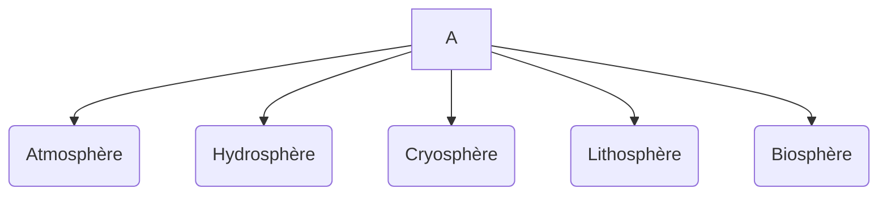
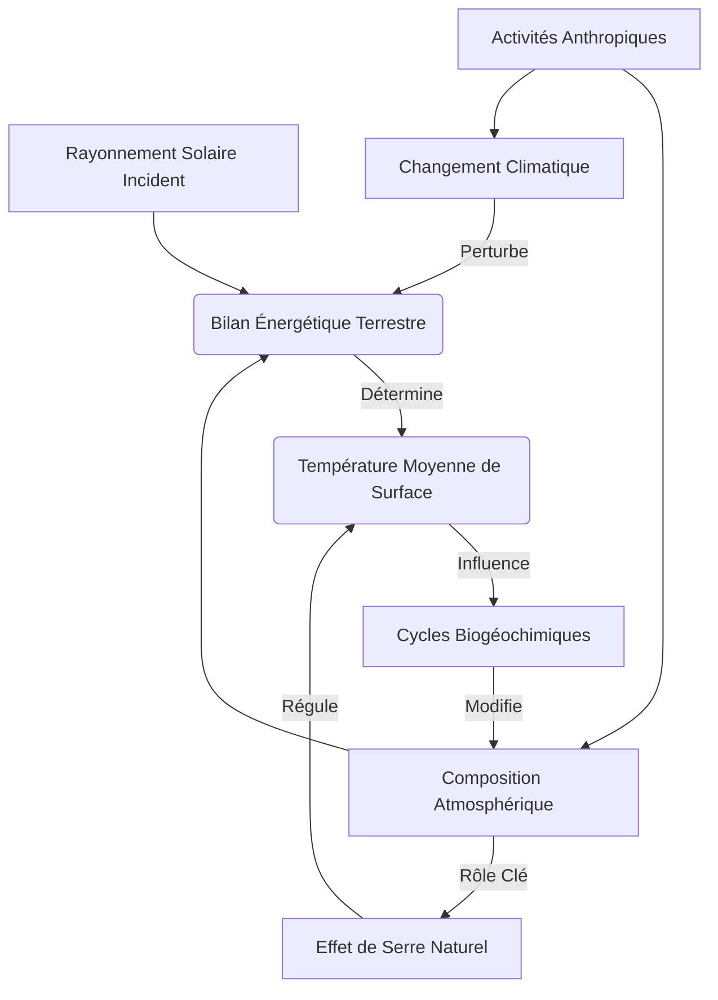

<Prerequisites itemsBase64="W3sidGl0bGUiOiJQcmluY2lwZXMgZGUgYmFzZSBkZSBsYSB0aGVybW9keW5hbWlxdWUiLCJzbHVnIjoidGhlcm1vZHluYW1pcXVlLWJhc2UiLCJsZXZlbCI6IkwyIiwic3ViamVjdCI6InBoeXNpcXVlIn0seyJ0aXRsZSI6IlN0cnVjdHVyZSBldCBjb21wb3NpdGlvbiBkZSBsJ2F0bW9zcGjDqHJlIiwic2x1ZyI6InN0cnVjdHVyZS1jb21wb3NpdGlvbi1hdG1vc3BoZXJlIiwibGV2ZWwiOiJMMSIsInN1YmplY3QiOiJHw6lvZ3JhcGhpZSBwaHlzaXF1ZSJ9LHsidGl0bGUiOiJSYXlvbm5lbWVudCDDqWxlY3Ryb21hZ27DqXRpcXVlIGV0IGludGVyYWN0aW9ucyBtYXRpw6hyZSIsInNsdWciOiJyYXlvbm5lbWVudC1lbGVjdHJvbWFnbmV0aXF1ZSIsImxldmVsIjoiTDIiLCJzdWJqZWN0IjoicGh5c2lxdWUifV0=" />

<DiagnosticQuiz question="Quel est le principal mecanisme par lequel les gaz a effet de serre contribuent au rechauffement de l'atmosphere terrestre?" options="Absorber le rayonnement solaire direct.|||Reflechir le rayonnement ultraviolet.|||Absorber et reemettre le rayonnement infrarouge terrestre.|||Augmenter la vitesse des vents atmospheriques." correctIndex="2" targetSectionId="introduction-bilan-energetique" sectionTitle="Introduction au bilan energetique terrestre" />


## Introduction au système climatique terrestre
Le climat de la Terre n'est pas une entité statique ou isolée, mais plutôt la manifestation dynamique d'un <ConceptLink id="systeme_climatique" name="système climatique" term="système climatique">système climatique</ConceptLink> complexe et interconnecté. Ce système englobe l'ensemble des interactions entre cinq composantes majeures: l'atmosphère, l'hydrosphère, la cryosphère, la lithosphère et la biosphère. Chacune de ces sphères joue un rôle crucial dans la régulation et la variation du climat global, et leurs interactions mutuelles déterminent les conditions météorologiques et climatiques que nous observons <sup id="cite-1" class="scroll-mt-24"><a href="#ref-1">[1]</a></sup>.

L'**atmosphère**, cette enveloppe gazeuse qui entoure notre planète, est le moteur principal des phénomènes météorologiques et le régulateur thermique essentiel. L'**hydrosphère** comprend toutes les formes d'eau sur Terre – océans, lacs, rivières, eaux souterraines – et agit comme un gigantesque réservoir de chaleur et un acteur majeur du cycle de l'eau. La **cryosphère**, quant à elle, regroupe les glaces et neiges permanentes (calottes polaires, glaciers, pergélisol), influençant l'albédo planétaire et le niveau des mers. La **lithosphère**, la couche solide externe de la Terre (continents et fonds océaniques), façonne les reliefs, influence les circulations atmosphériques et océaniques, et participe aux cycles biogéochimiques. Enfin, la **biosphère**, l'ensemble des êtrès vivants, modifie la composition atmosphérique (photosynthèse, respiration), influence les cycles de l'eau et de l'énergie, et altère les surfaces terrestres <sup id="cite-2" class="scroll-mt-24"><a href="#ref-2">[2]</a></sup>.

Comprendre le climat de la Terre et ses variations, qu'elles soient naturelles ou anthropiques, nécessite une approche systémique. Au cœur de cette compréhension se trouvent les bilans énergétiques et la composition atmosphérique. Le flux d'énergie solaire entrant et la manière dont il est absorbé, réfléchi et réémis par la Terre, ainsi que la présence de gaz à effet de serre dans l'atmosphère, sont les déterminants fondamentaux du régime thermique de notre planète. Les déséquilibres dans ces bilans peuvent entraîner des changements climatiques significatifs, comme l'illustrent les rapports du <RealPerson id="giec" name="GIEC" term="GIEC">GIEC</RealPerson> <sup id="cite-6" class="scroll-mt-24"><a href="#ref-6">[6]</a></sup>.

<Mermaid caption="Figure 1 : " chart={`graph TD
    A[Atmosphère] --/> B(Hydrosphère)
    A --> C(Cryosphère)
    A --> D(Lithosphère)
    A --> E(Biosphère)
    B --> A
    B --> C
    C --> A
    C --> B
    D --> A
    D --> E
    E --> A
    E --> B
    E --> D
    subgraph Système Climatique
        A
        B
        C
        D
        E
    end`} />


    B -- Échanges de chaleur et d'humidité --> C
    C -- Échanges de chaleur et de masse --> D
    D -- Influence sur l'albédo --> B
    E -- Topographie, cycles géochimiques --> B
    F -- Photosynthèse, respiration --> B
    B -- Précipitations, vents --> E
    C -- Évaporation, courants --> B
    D -- Fonte, accumulation --> C
    E -- Érosion, sédimentation --> C
    F -- Végétation, cycles biogéochimiques --> E
    B -- Composition chimique --> F
    C -- Habitat, régulation thermique --> F
    D -- Habitat, régulation thermique --> F
    E -- Substrat, nutriments --> F

*Diagramme conceptuel des interactions entre les composantes du système climatique terrestre.*

<Objectives>
  <Knowledge>
    <ul className="list-disc pl-4 space-y-1">
      <li>analyser les composantes du bilan énergétique terrestre et leurs interactions.</li>
      <li>Évaluer l'impact des gaz à effet de serre sur le système climatique global.</li>
      <li>Créer des schémas conceptuels représentant les cycles biogéochimiques majeurs influençant la composition atmosphérique.</li>
    </ul>
  </Knowledge>
  <Skills>
    <ul className="list-disc pl-4 space-y-1">
      <li>analyser des données climatiques complexes pour identifier les tendances du bilan radiatif et les anomalies thermiques.</li>
      <li>Évaluer la pertinence et les limites de différents modèles climatiques pour simuler les interactions atmosphériques.</li>
      <li>Créer des arguments étayés sur les mécanismes de régulation naturelle et anthropique du climat.</li>
    </ul>
  </Skills>
  <Attitudes>
    <ul className="list-disc pl-4 space-y-1">
      <li>Évaluer de manière critique les implications éthiques et sociétales des changements climatiques.</li>
      <li>analyser la complexité des interactions entre les activités humaines et le système climatique pour formuler des jugements éclairés.</li>
      <li>Créer des propositions argumentées pour une gestion durable des ressources atmosphériques, en intégrant les dimensions scientifiques et éthiques.</li>
    </ul>
  </Attitudes>
</Objectives>

## Le bilan énergétique terrestre: flux et transferts
Le moteur principal de l'ensemble du système climatique terrestre est l'énergie solaire. Le Soleil émet un <ConceptLink id="rayonnement_solaire" name="rayonnement solaire" term="rayonnement solaire">rayonnement solaire</ConceptLink> sous forme d'ondes électromagnétiques, dont une partie atteint la Terre. Ce rayonnement incident est la source quasi exclusive de l'énergie qui anime les processus atmosphériques, océaniques et biosphériques <sup id="cite-4" class="scroll-mt-24"><a href="#ref-4">[4]</a></sup>. Cependant, toute l'énergie solaire n'est pas absorbée par la Terre. Une fraction est réfléchie vers l'espace, tandis que le reste est absorbé par l'atmosphère, les océans et les surfaces terrestres.

Le concept d'<Glossary id="albedo" name="albedo" term="albedo">albédo</Glossary> est crucial pour comprendre ce processus. L'albédo représente la proportion de rayonnement solaire incident qui est réfléchie par une surface. Les surfaces claires, comme les calottes glaciaires et les nuages, ont un albédo élevé (réfléchissent beaucoup d'énergie), tandis que les surfaces sombres, comme les océans ou les forêts, ont un albédo faible (absorbent beaucoup d'énergie). L'albédo moyen de la Terre est d'environ 30%, ce qui signifie que 30% du rayonnement solaire est directement renvoyé vers l'espace <sup><a href="#ref-2">[2]</a></sup>.

L'énergie solaire absorbée par la Terre (environ 70%) réchauffe la surface et l'atmosphère. En réponse à ce réchauffement, la Terre émet à son tour de l'énergie sous forme de rayonnement terrestre (ou infrarouge) vers l'espace. Cet équilibre entre l'énergie solaire entrante et le rayonnement terrestre sortant est fondamental pour maintenir une température moyenne relativement stable à la surface de la planète. C'est ce que l'on appelle l'équilibre radiatif global.

Cependant, ce processus est modulé par la présence de certains gaz dans l'atmosphère, connus sous le nom de gaz à <Glossary id="effet_de_serre" name="effet de serre" term="effet de serre">effet de serre</Glossary>. Ces gaz absorbent une partie du rayonnement infrarouge émis par la Terre et le réémettent dans toutes les directions, y compris vers la surface terrestre. Ce phénomène naturel est essentiel pour la vie sur Terre, car il maintient la température moyenne à environ +15°C, au lieu de -18°C sans cet effet <sup id="cite-5" class="scroll-mt-24"><a href="#ref-5">[5]</a></sup>.

Outre le rayonnement, l'énergie est également transférée au sein du système climatique par des flux de chaleur latente et sensible. Le **flux de chaleur latente** est lié aux changements d'état de l'eau (évaporation, condensation). Lorsque l'eau s'évapore de la surface, elle absorbe de l'énergie (chaleur latente de vaporisation) qui est transportée dans l'atmosphère. Cette énergie est libérée lorsque la vapeur d'eau se condense pour former des nuages et des précipitations. Le **flux de chaleur sensible** correspond au transfert direct de chaleur par conduction et convection entre la surface terrestre et l'atmosphère, sans changement d'état de l'eau. Ces flux jouent un rôle majeur dans la redistribution de l'énergie thermique à l'échelle planétaire, influençant les circulations atmosphériques et océaniques <sup><a href="#ref-1">[1]</a></sup>.

<Image description="Un diagramme scientifique detaille illustrant le bilan energetique de la Terre. Il devrait montrer le rayonnement solaire entrant a ondes courtes, sa reflexion partielle par les nuages et la surface (albedo), et l'absorption par l'atmosphere et la surface. Il doit egalement representer le rayonnement infrarouge sortant a ondes longues de la surface terrestre et de l'atmosphere, y compris l'effet de serre ou une partie du rayonnement infrarouge est reemise vers la surface. Inclure des valeurs numeriques pour les flux d'énergie en W/m afin de representer le bilan." alt="Diagramme du bilan energetique de la Terre montrant le rayonnement solaire incident et le rayonnement thermique sortant." caption="Figure 1: Ce diagramme illustre l'interaction complexe du rayonnement solaire incident et du rayonnement terrestre sortant qui regit le climat terrestre. Il met en evidence le role de l'absorption atmospherique, de la reflexion de surface (albedo) et de l'effet de serre dans le maintien de l'equilibre thermique de la planete, ce qui est fondamental pour comprendre le changement climatique. — Source: [Wikimedia Commons](https://commons.wikimedia.org/wiki/File:NPP_Ceres_Shortwave_Radiation.ogv)" title="Bilan Energetique Terrestre" src="https://upload.wikimedia.org/wikipedia/commons/b/b9/NPP_Ceres_Shortwave_Radiation.ogv" fallbackUrl="https://commons.wikimedia.org/wiki/File:NPP_Ceres_Shortwave_Radiation.ogv" />
*Représentation schématique du bilan énergétique de la Terre, montrant les flux de rayonnement solaire incident, de rayonnement réfléchi, de rayonnement terrestre émis et l'influence de l'atmosphère.*

## Composition atmosphérique et rôle des gaz à effet de serre

L'atmosphère terrestre est une enveloppe gazeuse essentielle à la vie, dont la composition est relativement stable dans ses proportions principales. Elle est principalement constituée d'azote (N₂) à environ 78%, d'oxygène (O₂) à 21%, et d'argon (Ar) à près de 0,9% <sup><a href="#ref-1">[1]</a></sup>. Ces gaz permanents sont chimiquement inertes ou peu réactifs et n'interagissent pas significativement avec le rayonnement infrarouge terrestre. Le 0,1% restant est composé de gaz traces, dont certains jouent un rôle disproportionné dans la régulation thermique de la planète : les <Glossary id="ges" name="gaz a effet de serre" term="gaz a effet de serre">gaz à effet de serre</Glossary> (GES).

<Mermaid caption="Figure 3 : " chart={`graph TD
    N[Azote (N2) 78%] --/> A(Atmosphère)
    O[Oxygène (O2) 21%] --> A
    Ar[Argon (Ar) 0.9%] --> A
    CO2[Dioxyde de Carbone (CO2) 0.04%] --> A
    Autres[Autres gaz traces et vapeur d'eau] --> A`} />


*Répartition des principaux gaz constituant l'atmosphère terrestre sèche, hors vapeur d'eau.*

Les principaux GES sont la vapeur d'eau (H₂O), le dioxyde de carbone (CO₂), le méthane (CH₄), le protoxyde d'azote (N₂O) et l'ozone (O₃). Ces gaz ont la particularité d'être transparents au rayonnement solaire de courte longueur d'onde, mais d'absorber et de réémettre le ] de grande longueur d'onde émis par la surface terrestre chauffée <sup><a href="#ref-5">[5]</a></sup>. Ce processus est fondamental pour l'effet de serre naturel.

La vapeur d'eau est le GES le plus abondant et le plus puissant, contribuant à environ 60-70% de l'effet de serre naturel. Sa concentration varie considérablement dans l'atmosphère (de 0 à 4%) et est directement liée à la température de l'air. Le dioxyde de carbone (CO₂) est le deuxième contributeur majeur, responsable d'environ 20-25% de l'effet de serre naturel. Bien que sa concentration soit faible (environ 0,04% ou 400 ppm), il est particulièrement préoccupant en raison de son augmentation rapide due aux activités humaines (combustion de combustibles fossiles, déforestation) <sup><a href="#ref-6">[6]</a></sup>. Le méthane (CH₄), bien que moins abondant que le CO₂, a un pouvoir de réchauffement global (PRG) par molécule bien plus élevé sur une période de 100 ans. Il est émis par des processus naturels (zones humides) et anthropiques (agriculture, élevage, fuites de gaz) <sup><a href="#ref-6">[6]</a></sup>. Le protoxyde d'azote (N₂O) provient principalement de l'agriculture et des processus industriels, tandis que l'ozone (O₃) stratosphérique est bénéfique (filtre les UV), mais l'ozone troposphérique est un polluant et un GES.

Outre ces GES naturels, des gaz d'origine purement anthropique, comme les chlorofluorocarbures (CFCs) et les hydrofluorocarbures (HFCs), ont été introduits par l'industrie. Bien que leurs concentrations soient faibles, leur pouvoir de réchauffement est extrêmement élevé, et ils contribuent également à la destruction de la couche d'ozone stratosphérique <sup><a href="#ref-6">[6]</a></sup>. La capacité de ces gaz à absorber et réémettre le rayonnement infrarouge est due à la structure de leurs molécules, qui peuvent vibrer à des fréquences correspondant à celles du rayonnement thermique terrestre. Ce phénomène a été compris dès le XIXe siècle, notamment par ] qui a été le premier à décrire le principe de l'effet de serre <sup><a href="#ref-5">[5]</a></sup>.

## Modélisation simplifiée de l'effet de serre

Pour comprendre le mécanisme fondamental de l'effet de serre, des modèles conceptuels simplifiés sont souvent utilisés. Ces modèles permettent de calculer une température d'équilibre théorique de la Terre dans différentes configurations.

### Modèle du corps noir (Terre sans atmosphère)

Le modèle le plus simple considère la Terre comme un <Glossary id="corps_noir" name="corps noir" term="corps noir">corps noir</Glossary> parfait en équilibre radiatif avec le Soleil, sans atmosphère. Dans ce scénario, la Terre absorbe le rayonnement solaire et émet son propre rayonnement infrarouge vers l'espace. La température d'équilibre peut être calculée en utilisant la <ConceptLink id="loi_stefan_boltzmann" name="loi de Stefan-Boltzmann" term="loi de Stefan-Boltzmann">loi de Stefan-Boltzmann</ConceptLink>, qui relie la puissance rayonnée par un corps noir à sa température.

En supposant un albédo moyen de la Terre (environ 0,3) et une constante solaire (environ 1361 W/m²), la température d'équilibre théorique de la Terre sans atmosphère serait d'environ -18°C (255 K) <sup><a href="#ref-2">[2]</a></sup>. Cette valeur est significativement inférieure à la température moyenne observée de +15°C, ce qui met en évidence l'importance de l'atmosphère et de l'effet de serre naturel.

### Modèle à une couche atmosphérique

Pour illustrer l'effet de serre, un modèle conceptuel plus élaboré est le modèle à une couche atmosphérique. Ce modèle simplifie l'atmosphère en une seule couche gazeuse qui est transparente au rayonnement solaire incident mais opaque au rayonnement infrarouge terrestre.

Dans ce modèle, la surface terrestre absorbe le rayonnement solaire et émet du rayonnement infrarouge. La couche atmosphérique absorbe tout le rayonnement infrarouge émis par la surface et réémet à son tour du rayonnement infrarouge à la fois vers l'espace et vers la surface terrestre. Pour maintenir l'équilibre énergétique, la surface doit se réchauffer davantage pour compenser le rayonnement infrarouge réémis par l'atmosphère vers le bas. Ce modèle simple prédit une température de surface terrestre d'environ +30°C, ce qui est supérieur à la température observée.

<Mermaid caption="Figure 4 : " chart={`graph TD
Sol[Soleil] -- Rayonnement Solaire --/> Terre
    Terre -- Rayonnement Infrarouge --> Atm[Couche Atmosphérique]
    Atm -- Réémission Infrarouge --> Espace[Espace]
    Atm -- Réémission Infrarouge --> Terre
    Terre -- Absorption --> Chaleur(Chaleur)
    Atm -- Absorption --> Chaleur`} />
```mermaid
graph TD
    A[Rayonnement Solaire Incident] --> B{Surface Terrestre}
    B -- Rayonnement IR Émis --> C[Couche Atmosphérique (GES)]
    C -- Rayonnement IR vers l'Espace --> D(Espace)
    C -- Rayonnement IR vers la Surface --> B
    B -- Chaleur Latente/Sensible --> C
```


*Diagramme conceptuel du modèle à une couche atmosphérique, illustrant les flux d'énergie et le rôle de la couche de gaz à effet de serre.*

### Limites des modèles simplifiés

Ces modèles, bien qu'utiles pour illustrer le principe de l'effet de serre, présentent des limites importantes :
*   **Simplification excessive:** Ils ne tiennent pas compte de la structure verticale complexe de l'atmosphère, des variations de concentration des GES, de la présence de nuages, des transferts de chaleur par convection et évaporation, ni des cycles biogéochimiques <sup><a href="#ref-1">[1]</a></sup>.
*   **Homogénéité:** Ils supposent une Terre et une atmosphère homogènes, sans variations géographiques ou saisonnières.
*   **Absence de dynamique:** Ils ignorent les mouvements atmosphériques et océaniques qui redistribuent l'énergie.

Malgré ces simplifications, ils démontrent clairement que la présence de gaz absorbant le rayonnement infrarouge dans l'atmosphère est indispensable pour maintenir la Terre à une température propice à la vie, et que toute modification de la concentration de ces gaz peut altérer cet équilibre thermique <sup><a href="#ref-6">[6]</a></sup>.

## Conclusion
Ce parcours à travers les mécanismes du système climatique terrestre a mis en lumière la complexité et la délicatesse du <ConceptLink id="bilan_energetique" name="bilan energetique" term="bilan energetique" unresolved={true}>bilan énergétique</ConceptLink> planétaire. Nous avons exploré comment l'énergie solaire incidente est absorbée et réémise, et comment cette dynamique est fondamentalement modulée par la <ConceptLink id="composition_atmospherique" name="composition atmospherique" term="composition atmospherique" unresolved={true}>composition atmosphérique</ConceptLink>. La présence de certains gaz à effet de serre (GES) tels que le dioxyde de carbone et la vapeur d'eau est apparue comme un facteur déterminant, permettant à la Terre de maintenir une température moyenne de surface propice à la vie, bien au-delà de la température théorique d'équilibre sans atmosphère <sup><a href="#ref-2">[2]</a></sup>.

L'interdépendance entre ces éléments est cruciale : le rayonnement solaire fournit l'énergie, l'atmosphère régule sa distribution et sa rétention, et les processus terrestres et océaniques redistribuent la chaleur. Toute perturbation de cette harmonie, notamment par une augmentation des concentrations de GES d'origine anthropique, peut entraîner un déséquilibre du bilan énergétique et, par conséquent, un réchauffement global, phénomène au cœur du <ConceptLink id="changement_climatique" name="changement climatique" term="changement climatique">changement climatique</ConceptLink> actuel <sup><a href="#ref-6">[6]</a></sup>. La compréhension approfondie de ces concepts fondamentaux est donc indispensable non seulement pour analyser les défis environnementaux contemporains, mais aussi pour anticiper les évolutions futures et élaborer des stratégies d'atténuation et d'adaptation efficaces. Ces bases constituent un socle essentiel pour toute étude ultérieure en géographie physique, en climatologie et en sciences de l'environnement.

<Mermaid caption="Figure 5 : " chart={`graph LR
    A[Rayonnement Solaire] --/> B(Température Terrestre)
    B --> C(Évaporation / Humidité)
    C --> D(Nuages)
    D -- Réflexion --> A
    D -- Effet de Serre --> B
    B --> E(Fonte des Glaces)
    E -- Diminution Albédo --> B
    B --> F(Cycle du Carbone)
    F -- Émission CO2 --> G(Concentration GES)
    G -- Effet de Serre Accru --> B
    B --> H(Courants Océaniques)
    H -- Distribution Chaleur --> B`} />



*Diagramme conceptuel illustrant l'interdépendance des composantes du système climatique et l'impact des activités humaines.*


<Summary itemsString="Ce cours a explore les fondements du système climatique terrestre, en mettant en lumiere l'importance cruciale des bilans energetiques.|||Nous avons analyse comment l'énergie solaire est recue, reflechie et reemise par la Terre, soulignant le role de l'albedo et du rayonnement infrarouge.|||La composition atmospherique, notamment la présence des gaz a effet de serre, a ete identifiee comme un facteur determinant dans la regulation de la temperature planetaire.|||La comprehension de ces mecanismes est essentielle pour apprehender la stabilite et les variations du climat.|||En somme, le système climatique est un equilibre dynamique complexe, ou chaque composant joue un role vital dans la distribution de l'énergie et la maintenance des conditions propices a la vie." />

<WhatsNext itemsBase64="W10=" />
## Auto-évaluation

<Quiz durationLimit={600}>
    <Question q="Quel est le principal moteur du système climatique terrestre?" explanation="L'énergie solaire est la source d'énergie quasi exclusive qui alimente le système climatique terrestre, determinant les temperatures et les mouvements atmospheriques et oceaniques.">
  <Option text="énergie geothermique" correct={false} />
  <Option text="énergie solaire" correct={true} />
  <Option text="énergie maremotrice" correct={false} />
  <Option text="énergie eolienne" correct={false} />
</Question>
    <Question q="Quels sont les deux gaz les plus abondants dans l'atmosphere terrestre seche?" explanation="L'atmosphere terrestre est composee d'environ 78% d'azote (N2) et 21% d'oxygene (O2), les autres gaz ne representant qu'environ 1%.">
  <Option text="Oxygene et dioxyde de carbone" correct={false} />
  <Option text="Azote et oxygene" correct={true} />
  <Option text="Argon et azote" correct={false} />
  <Option text="Vapeur d'eau et oxygene" correct={false} />
</Question>
    <Question q="Quel est le role principal des gaz a effet de serre dans le bilan energetique terrestre?" explanation="Les gaz a effet de serre (GES) absorbent et reemettent le rayonnement infrarouge terrestre, ce qui rechauffe la basse atmosphere et la surface de la Terre, un phenomene essentiel a la vie.">
  <Option text="Reflechir toute l'énergie solaire incidente" correct={false} />
  <Option text="Absorber le rayonnement ultraviolet" correct={false} />
  <Option text="Pieger une partie du rayonnement infrarouge emis par la Terre" correct={true} />
  <Option text="Produire de l'oxygene" correct={false} />
</Question>
    <Question q="Qu'est-ce que l'albedo terrestre?" explanation="L'albedo est la mesure de la reflectivite d'une surface. Un albedo eleve signifie qu'une grande partie du rayonnement solaire est reflechie, tandis qu'un albedo faible signifie qu'une grande partie est absorbee.">
  <Option text="La quantite de chaleur emise par la Terre" correct={false} />
  <Option text="La proportion de rayonnement solaire absorbee par la Terre" correct={false} />
  <Option text="La proportion de rayonnement solaire reflechie par la Terre" correct={true} />
  <Option text="La temperature moyenne de la surface terrestre" correct={false} />
</Question>
    <Question q="Comment le forcage radiatif est-il defini dans le contexte du système climatique?" explanation="Le forcage radiatif est une mesure de l'influence d'un facteur donne sur la modification du bilan energetique Terre-atmosphere. Un forcage radiatif positif tend a rechauffer la surface, tandis qu'un forcage negatif tend a la refroidir.">
  <Option text="La quantite d'énergie solaire atteignant la surface terrestre" correct={false} />
  <Option text="Le changement net dans le bilan energetique de la Terre du a un facteur externe" correct={true} />
  <Option text="La capacite de l'atmosphere a retenir la chaleur" correct={false} />
  <Option text="La vitesse a laquelle les oceans absorbent le CO2" correct={false} />
</Question>
    <Question q="Quel est le role principal des oceans dans le cycle global du carbone?" explanation="Les oceans absorbent une grande quantite de CO2 atmospherique (puits) mais peuvent aussi en relacher (source), jouant un role crucial dans la regulation de sa concentration atmospherique.">
  <Option text="Emettre principalement du methane" correct={false} />
  <Option text="Agir comme un puits et une source de dioxyde de carbone" correct={true} />
  <Option text="Produire de l'oxygene par photosynthese" correct={false} />
  <Option text="Refleter le rayonnement solaire" correct={false} />
</Question>
</Quiz>

### Glossaire

- **Albédo** : Mesure de la réflectivité d'une surface ou d'un corps. Il s'agit du rapport entre l'énergie lumineuse réfléchie et l'énergie lumineuse incidente. Un albédo élevé signifie une forte réflexion (ex: neige), un albédo faible une forte absorption (ex: océan).
- **Bilan énergétique terrestre** : Représente l'équilibre entre l'énergie solaire reçue par la Terre et l'énergie réémise vers l'espace. Il détermine la température moyenne de la planète et est influencé par l'albédo et l'effet de serre.
- **Effet de serre** : Phénomène naturel par lequel certains gaz présents dans l'atmosphère (gaz à effet de serre) absorbent et réémettent le rayonnement infrarouge terrestre, piégeant ainsi une partie de la chaleur et maintenant une température propice à la vie.
- **Forçage radiatif** : Mesure de l'influence d'un facteur donné (ex: augmentation d'un gaz à effet de serre, changement d'albédo) sur l'équilibre énergétique du système Terre-atmosphère. Un forçage radiatif positif tend à réchauffer le système, un forçage négatif à le refroidir.


### Références

<References itemsBase64="W3sibnVtIjoxLCJ0ZXh0IjoiR3JvdXBlIGQnZXhwZXJ0cyBpbnRlcmdvdXZlcm5lbWVudGFsIHN1ciBsJ8Opdm9sdXRpb24gZHUgY2xpbWF0IChHSUVDKS4gMjAyMy4gwqsgUmFwcG9ydCBkZSBzeW50aMOoc2UgZHUgR0lFQyAoQVI2KSDCuy4iLCJzY2hvbGFyVXJsIjoiaHR0cHM6Ly9ib29rcy5nb29nbGUuY29tL2Jvb2tzP3E9R3JvdXBlJTIwZCdleHBlcnRzJTIwaW50ZXJnb3V2ZXJuZW1lbnRhbCUyMHN1ciUyMGwnJUMzJUE5dm9sdXRpb24lMjBkdSUyMGNsaW1hdCUyMCUyMlJhcHBvcnQlMjBkZSUyMHN5bnRoJUMzJUE4c2UlMjBkdSUyMEdJRUMlMjBBUjYlMjIlMjAyMDIzIiwic2Nob2xhclRleHQiOiJHb29nbGUgQm9va3MiLCJpc1VudXNlZCI6ZmFsc2V9XQ==" />

