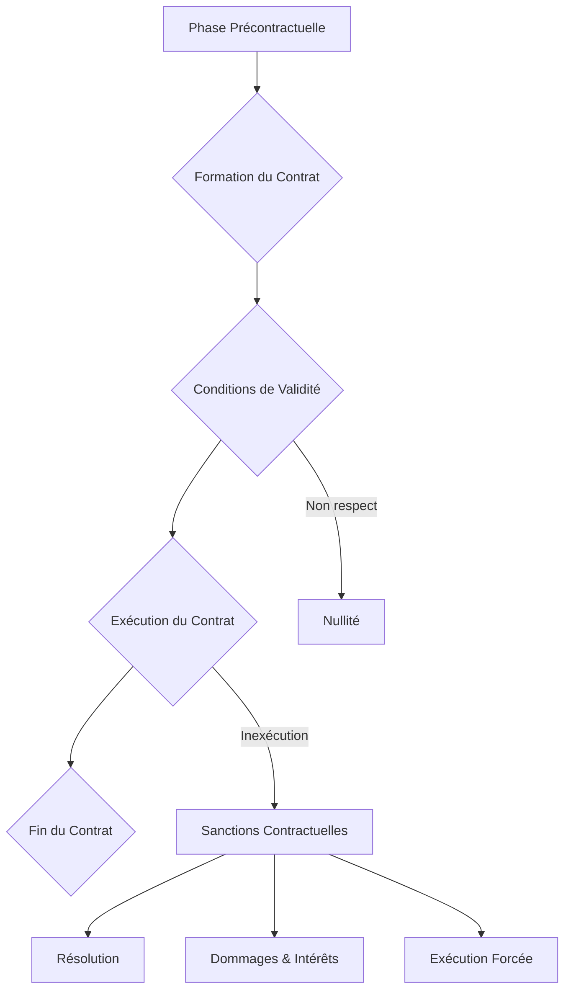

<DiagnosticQuiz question="Quelle est la caracteristique essentielle qui distingue un acte juridique d'un fait juridique en droit francais?" options="L'acte juridique est toujours ecrit, contrairement au fait juridique.|||L'acte juridique resulte d'une volonte deliberee de produire des effets de droit, tandis que le fait juridique produit des effets de droit independamment de la volonte.|||Le fait juridique est toujours illicite, alors que l'acte juridique est licite.|||L'acte juridique necessite l'intervention d'un juge pour etre valide." correctIndex="1" targetSectionId="section-1-1" sectionTitle="Distinction entre acte juridique et fait juridique" />


## Introduction à la théorie générale du contrat

Le contrat constitue la pierre angulaire du <ConceptLink id="droit_obligations" name="droit des obligations" term="droit des obligations">droit des obligations</ConceptLink> et, plus largement, du droit civil français. Il est l'instrument privilégié par lequel les individus et les personnes morales organisent leurs relations juridiques et économiques. Sa prééminence découle du principe fondamental de l'<Glossary id="autonomie_volonte" name="autonomie de la volonte" term="autonomie de la volonte">autonomie de la volonté</Glossary>, selon lequel les parties sont libres de s'engager et de déterminer le contenu de leurs engagements, pourvu qu'elles respectent l'ordre public et les bonnes mœurs.

Dans le [Code civil](https://fr.wikipedia.org/wiki/Code_civil), le contrat est défini à l'article 1101 du Code civil comme « un accord de volontés entre deux ou plusieurs personnes destiné à créer, modifier, transmettre ou éteindre des obligations ». Cette définition, issue de la réforme de 2016, souligne la fonction créatrice d'obligations du contrat. Le droit des contrats est principalement régi par le Titre III du Livre III du Code civil, intitulé « Des sources d'obligations ».

Ce chapitre a pour objectif de fournir une compréhension approfondie des mécanismes régissant la vie du contrat, de sa naissance à son extinction. Nous explorerons les conditions de sa validité, les effets qu'il produit entre les parties et à l'égard des tiers, ainsi que les différentes causes de son extinction.

L'étude du droit des contrats a été profondément marquée par l'WIDGET:ConceptLink:reforme_droit_contrats:Ordonnance n° 2016-131 du 10 février 2016 portant réforme du droit des contrats, du régime général et de la preuve des obligations, ratifiée par la WIDGET:ConceptLink:loi_ratification_2018:Loi n° 2018-287 du 20 avril 2018. Avant cette réforme, le droit des contrats reposait sur des dispositions datant de 1804, complétées par une jurisprudence abondante et parfois complexe <Reference id="1" name="1" term="1">1</Reference>. La réforme visait à moderniser le droit français des contrats, à le rendre plus lisible, plus accessible et plus attractif sur la scène internationale, en codifiant de nombreuses solutions jurisprudentielles et en introduisant de nouvelles règles. Elle a ainsi refondu l'intégralité du Titre III du Livre III du Code civil, modifiant la numérotation des articles et le contenu de nombreuses dispositions, comme l'article 1102 du Code civil sur la liberté contractuelle.

<Mermaid caption="Figure 1 : " chart={``} />
```mermaid
graph TD
    A[Droit des Contrats avant 2016] --> B{Code Civil de 1804};
    B --> C[Jurisprudence Abondante et Correctrice];
    C --> D[Manque de Lisibilité et d'Accessibilité];
    D --> E[Besoin de Modernisation];
    E --> F[Ordonnance n° 2016-131 du 10 février 2016];
    F --> G[Loi n° 2018-287 du 20 avril 2018 (Ratification)];
    G --> H[Nouveau Droit des Contrats (Post-2016)];
    H --> I[Plus de Sécurité Juridique];
    H --> J[Plus d'Attractivité Internationale];
    H --> K[Codification de la Jurisprudence];
```


<Objectives>
  <Knowledge>
    <ul className="list-disc pl-4 space-y-1">
      <li>analyser les conditions de validité et de formation du contrat en droit français.</li>
      <li>Évaluer les différentes classifications des contrats et leurs régimes juridiques spécifiques.</li>
      <li>Distinguer les effets juridiques du contrat entre les parties et à l'égard des tiers. &#123;/* [FIX A3] */&#125;</li>
    </ul>
  </Knowledge>
  <Skills>
    <ul className="list-disc pl-4 space-y-1">
      <li>Appliquer les principes de la théorie générale du contrat à la résolution de cas pratiques.</li>
      <li>Rédiger des clauses contractuelles simples en respectant les exigences légales et jurisprudentielles.</li>
      <li>analyser la jurisprudence relative à l'exécution et à l'inexécution des obligations contractuelles.</li>
    </ul>
  </Skills>
  <Attitudes>
    <ul className="list-disc pl-4 space-y-1">
      <li>Développer un esprit critique face aux enjeux éthiques et économiques du droit des contrats.</li>
      <li>Adopter une rigueur juridique dans l'interprétation des textes et des situations contractuelles.</li>
      <li>Manifester de l'autonomie dans la recherche et l'analyse des sources du droit des contrats.</li>
    </ul>
  </Attitudes>
</Objectives>

## La formation du contrat : Rencontre des volontés

La formation du contrat est un processus essentiel qui conduit à la naissance de l'acte juridique. En droit français, le principe est celui du <ConceptLink id="consensualisme" name="consensualisme" term="consensualisme">consensualisme</ConceptLink>, ce qui signifie que le contrat est formé par le seul échange des consentements, sans qu'aucune forme particulière ne soit requise pour sa validité (sauf exceptions légales). Ce principe est affirmé par l'article 1172 du Code civil.

Le processus de conclusion du contrat repose traditionnellement sur la rencontre d'une <Glossary id="offre_contrat" name="offre de contrat" term="offre de contrat">offre de contrat</Glossary> et d'une <Glossary id="acceptation_contrat" name="acceptation du contrat" term="acceptation du contrat">acceptation du contrat</Glossary>. Cette rencontre des volontés est le point de départ de l'engagement contractuel, comme le prévoit l'article 1113 du Code civil : « Le contrat est formé par la rencontre d'une offre et d'une acceptation par lesquelles les parties manifestent leur volonté de s'engager. »

### L'Offre

L'offre, ou pollicitation, est la proposition de contracter. Pour être qualifiée d'offre au sens juridique, elle doit revêtir deux caractéristiques essentielles, conformément à l'article 1114 du Code civil :
*   **Précise**: L'offre doit contenir tous les éléments essentiels du contrat envisagé. Par exemple, dans un contrat de vente, elle doit indiquer la chose et le prix.
*   **Ferme**: L'offre doit exprimer la volonté de son auteur d'être lié en cas d'acceptation. Elle ne doit pas être assortie de réserves qui laisseraient à l'offrant la liberté de ne pas contracter (par exemple, « sous réserve de confirmation »).

Une proposition qui ne remplit pas ces conditions ne constitue qu'une invitation à entrer en pourparlers ou un appel d'offres.

L'offre peut être assortie d'un délai exprès ou tacite. Pendant ce délai, l'offrant ne peut en principe pas la révoquer. Si l'offre est révoquée avant l'expiration du délai ou avant l'acceptation, la rétractation est fautive et engage la responsabilité extracontractuelle de son auteur, mais elle n'empêche pas la formation du contrat (art. 1115 et 1116 du Code civil). L'offre devient caduque à l'expiration du délai ou, à défaut, à l'issue d'un délai raisonnable, ou encore en cas d'incapacité ou de décès de son auteur (art. 1117 du Code civil).

### L'Acceptation

L'acceptation est la manifestation de volonté du destinataire de l'offre d'être lié dans les termes de celle-ci. Pour être valable, l'acceptation doit être :
*   **Pure et simple**: Elle doit correspondre exactement à l'offre. Toute modification ou adjonction par le destinataire de l'offre constitue une contre-proposition, qui équivaut à un refus de l'offre initiale et à l'émission d'une nouvelle offre (art. 1118 al. 3 du Code civil).
*   **Extériorisée**: L'acceptation doit être exprimée. Le silence ne vaut pas acceptation, sauf exceptions prévues par la loi, les usages, les relations d'affaires ou des circonstances particulières (art. 1120 du Code civil).

### Moment et lieu de formation du contrat

La détermination du moment et du lieu de la formation du contrat est cruciale car elle permet de fixer la loi applicable, le point de départ des délais de prescription, ou encore le transfert de propriété et des risques.

Avant la réforme de 2016, la jurisprudence était divisée entre la théorie de l'émission (le contrat est formé dès que l'acceptation est émise) et la théorie de la réception (le contrat est formé lorsque l'offrant reçoit l'acceptation). L'Ordonnance de 2016 a clarifié cette question en consacrant la **théorie de la réception** à l'article 1121 du Code civil : « Le contrat est conclu dès que l'acceptation parvient à l'offrant. Il est réputé l'être au lieu où l'acceptation est parvenue. »

<Mermaid caption="Figure 2 : " chart={``} />
```mermaid
graph TD
    A[Offre (Précise et Ferme)] --> B{Réception par le Destinataire};
    B --> C{Acceptation (Pure et Simple)};
    C --> D{Envoi de l'Acceptation};
D --> E;
    E --> F[Contrat Formé];
```


## Les conditions de validité du contrat : Les piliers de l'engagement

Pour qu'un contrat soit valablement formé et produise ses effets juridiques, il ne suffit pas qu'une offre rencontre une acceptation. Il doit également remplir des conditions de fond essentielles, énumérées par l'article 1128 du Code civil tel qu'issu de la réforme de 2016. Ces conditions sont au nombre de trois : le consentement des parties, leur capacité de contracter, et un contenu licite et certain.

### Le consentement : Intégrité et absence de vices

Le consentement est la pierre angulaire de l'engagement contractuel. Il doit être réel, libre et éclairé. L'absence de l'une de ces qualités entache l'<ConceptLink id="integrite_consentement" name="integrite du consentement" term="integrite du consentement" unresolved={true}>intégrité du consentement</ConceptLink> et peut entraîner la nullité du contrat. Les vices du consentement, traditionnellement au nombre de trois, sont l'erreur, le dol et la violence.

#### L'Erreur

L'erreur est une fausse représentation de la réalité. Pour vicier le consentement et entraîner la nullité relative du contrat, elle doit être déterminante, c'est-à-dire que sans elle, la partie n'aurait pas contracté ou aurait contracté à des conditions substantiellement différentes (article 1130 du Code civil). L'erreur doit porter sur les qualités essentielles de la prestation due ou sur celles du cocontractant dans les contrats conclus *intuitu personae* (article 1132 du Code civil et article 1134 du Code civil). En revanche, l'erreur sur un simple motif étranger aux qualités essentielles ou sur la valeur n'est pas, en principe, une cause de nullité (article 1135 du Code civil). L'erreur doit également être excusable, c'est-à-dire que la partie qui l'invoque n'aurait pas dû pouvoir la déceler en faisant preuve d'une diligence normale.

#### Le Dol

Le <Glossary id="dol" name="dol" term="dol">dol</Glossary> est une erreur provoquée par des manœuvres frauduleuses du cocontractant. Il s'agit d'un comportement déloyal visant à tromper l'autre partie. Selon l'article 1137 du Code civil, le dol peut résulter de manœuvres, de mensonges ou d'une réticence dolosive (le fait de cacher intentionnellement une information déterminante). Pour être sanctionné, le dol doit être intentionnel et avoir été déterminant du consentement de la victime. Il doit émaner du cocontractant ou d'un tiers de connivence. Le dol rend toujours l'erreur excusable.

#### La Violence

La violence est une contrainte exercée sur une partie pour l'obliger à contracter. Elle peut être physique ou morale. L'article 1140 du Code civil dispose qu'il y a violence lorsqu'une partie s'engage sous la pression d'une contrainte qui lui inspire la crainte d'exposer sa personne, sa fortune ou celles de ses proches à un mal considérable. La violence doit être illégitime, c'est-à-dire qu'elle ne doit pas résulter de l'exercice légitime d'un droit. La réforme de 2016 a introduit la notion de violence économique, prévue à l'article 1143 du Code civil, qui sanctionne l'abus de l'état de dépendance dans lequel se trouve le cocontractant pour obtenir de lui un engagement qu'il n'aurait pas souscrit en l'absence d'une telle contrainte.

<Mermaid caption="Figure 3 : " chart={``} />
```mermaid
graph TD
    A[Consentement] --> B{Intègre ?};
    B -- Non --> C[Vices du Consentement];
    C --> C1[Erreur];
    C1 --> C1a[Déterminante];
    C1 --> C1b[Excusable];
    C1 --> C1c[Sur qualités essentielles ou personne];
    C --> C2[Dol];
    C2 --> C2a[Manœuvres, mensonges ou réticence];
    C2 --> C2b[Intentionnel et Déterminant];
    C2 --> C2c[Émanant du cocontractant];
    C --> C3[Violence];
    C3 --> C3a[Contrainte illégitime];
    C3 --> C3b[Crainte d'un mal considérable];
    C3 --> C3c[Violence économique (abus de dépendance)];
    C -- Oui --> D[Nullité relative du contrat];
    B -- Oui --> E[Consentement Valable];
```


### La capacité des parties

La <Glossary id="capacite_juridique" name="capacite juridique" term="capacite juridique">capacité juridique</Glossary> est l'aptitude d'une personne à être titulaire de droits et d'obligations (capacité de jouissance) et à les exercer elle-même (capacité d'exercice). En droit des contrats, la capacité d'exercice est primordiale. L'article 1145 du Code civil pose le principe selon lequel toute personne physique peut contracter, sauf en cas d'incapacité prévue par la loi. Les principales incapacités d'exercice concernent les mineurs non émancipés et les majeurs protégés (sous tutelle, curatelle ou sauvegarde de justice) <Reference id="3" name="3" term="3">3</Reference>. Ces personnes doivent être représentées ou assistées pour la conclusion d'actes juridiques, afin de protéger leurs intérêts (article 1146 du Code civil). L'incapacité est également une cause de nullité relative du contrat.

### Le contenu licite et certain du contrat

La réforme de 2016 a modernisé les notions d'objet et de cause, les regroupant sous l'appellation de « contenu du contrat » (article 1162 du Code civil). Ce contenu doit être licite et certain.

#### La licéité du contenu

Le contrat ne peut déroger à l'<ConceptLink id="ordre_public" name="ordre public" term="ordre public">ordre public</ConceptLink> ni aux bonnes mœurs (article 6 du Code civil). Cela signifie que ni les stipulations contractuelles, ni le but poursuivi par les parties (même si non exprimé) ne doivent être contraires à la loi impérative ou aux principes fondamentaux de la société. Par exemple, un contrat ayant pour objet la vente de produits illicites ou un contrat de mère porteuse (en droit français) serait nul pour illicéité de son contenu.

#### La certitude du contenu

La prestation, qu'elle soit l'objet d'une obligation de donner, de faire ou de ne pas faire, doit être possible et déterminée ou déterminable (article 1163 du Code civil).
*   **Déterminée ou déterminable**: La nature et la quantité de la prestation doivent être précisées ou pouvoir l'être sans nouvel accord des parties. Le prix, notamment, doit être fixé ou pouvoir l'être selon des critères objectifs (article 1164 du Code civil et article 1165 du Code civil).
*   **Possibilité**: La prestation doit être réalisable. Un contrat portant sur une chose qui n'existe pas et ne peut exister est nul.

#### L'équilibre contractuel

Bien que le droit français n'exige pas un équilibre parfait des prestations (la lésion n'étant sanctionnée que dans des cas limitativement prévus par la loi), la réforme de 2016 a introduit des mécanismes de contrôle de l'équilibre dans certaines situations. L'article 1171 du Code civil permet de réputer non écrite toute clause non négociable, déterminée à l'avance par l'une des parties (contrat d'adhésion), qui crée un déséquilibre significatif entre les droits et obligations des parties. Cette disposition vise à protéger la partie la plus faible dans les contrats d'adhésion, sans pour autant remettre en cause l'équilibre économique global du contrat <Reference id="4" name="4" term="4">4</Reference>.

## L'exécution et les sanctions de l'inexécution contractuelle

Une fois valablement formé, le contrat devient une source d'obligations pour les parties. Son exécution est régie par des principes fondamentaux, et son inexécution peut entraîner diverses sanctions.

### Les principes de l'exécution du contrat

L'exécution du contrat repose sur deux piliers essentiels : la force obligatoire et la bonne foi.

#### La force obligatoire du contrat

Le principe de la <ConceptLink id="force_obligatoire" name="force obligatoire du contrat" term="force obligatoire du contrat">force obligatoire du contrat</ConceptLink>, consacré par l'article 1103 du Code civil, stipule que « les contrats légalement formés tiennent lieu de loi à ceux qui les ont faits ». Cela signifie que les parties sont tenues de respecter leurs engagements comme s'il s'agissait d'une loi. Le contrat ne peut être modifié ou révoqué que d'un commun accord des parties, ou pour les causes que la loi autorise. La réforme de 2016 a toutefois introduit une exception notable à ce principe avec la théorie de l'imprévision à l'article 1195 du Code civil, permettant au juge de réviser ou de mettre fin au contrat en cas de changement de circonstances imprévisible rendant l'exécution excessivement onéreuse pour une partie.

#### La bonne foi

L'article 1104 du Code civil énonce que « les contrats doivent être négociés, formés et exécutés de bonne foi ». Ce principe général de bonne foi impose aux parties un devoir de loyauté et de coopération à toutes les étapes de la vie contractuelle. Il ne s'agit pas seulement d'éviter la fraude, mais d'agir de manière honnête et de ne pas abuser de ses droits contractuels. La bonne foi est une notion évolutive, souvent précisée par la jurisprudence, qui imprègne l'ensemble du droit des obligations <Reference id="5" name="5" term="5">5</Reference>.

### Les sanctions de l'inexécution contractuelle

En cas d'inexécution des obligations par l'une des parties, le créancier dispose de plusieurs options, prévues à l'article 1217 du Code civil, qu'il peut combiner si elles ne sont pas incompatibles.

#### L'exception d'inexécution

L'exception d'inexécution permet à une partie de refuser d'exécuter sa propre obligation si l'autre partie n'exécute pas la sienne et si cette inexécution est suffisamment grave (article 1219 du Code civil). C'est un moyen de pression provisoire qui suspend l'exécution du contrat. L'article 1220 du Code civil prévoit même une exception d'inexécution par anticipation, si une partie est manifestement en passe de ne pas exécuter son obligation.

#### L'exécution forcée en nature

Le créancier peut demander au débiteur d'exécuter son obligation telle que prévue au contrat (article 1221 du Code civil). Cette exécution forcée est le mode de sanction privilégié, sauf si elle est impossible (matériellement ou juridiquement) ou si son coût est manifestement déraisonnable par rapport à l'intérêt du créancier. Le créancier peut également, après mise en demeure, faire exécuter l'obligation par un tiers aux frais du débiteur (article 1222 du Code civil).

#### La réduction du prix

Nouvelle sanction introduite par la réforme, la réduction du prix permet au créancier d'une prestation imparfaitement exécutée d'accepter l'exécution imparfaite et de solliciter une réduction proportionnelle du prix (article 1223 du Code civil). Cette réduction peut être unilatérale, après mise en demeure, ou demandée en justice.

#### La résolution du contrat

La <Glossary id="resolution_contrat" name="resolution du contrat" term="resolution du contrat">résolution du contrat</Glossary> met fin au contrat en raison de l'inexécution d'une obligation essentielle par l'une des parties (article 1224 du Code civil). Elle peut être :
*   **Judiciaire**: Prononcée par le juge.
*   **Unilatérale**: Par notification du créancier au débiteur, après mise en demeure et si l'inexécution est suffisamment grave (article 1226 du Code civil).
*   **Par clause résolutoire**: Si le contrat contient une clause prévoyant sa résolution de plein droit en cas d'inexécution (article 1225 du Code civil).
La résolution a généralement un effet rétroactif, anéantissant le contrat et entraînant la restitution des prestations déjà exécutées.

#### La responsabilité contractuelle (dommages et intérêts)

Indépendamment des autres sanctions, le créancier peut toujours demander des dommages et intérêts en réparation du préjudice subi du fait de l'inexécution (article 1231-1 du Code civil). Pour cela, trois conditions doivent être réunies :
*   Une faute contractuelle (l'inexécution ou la mauvaise exécution).
*   Un préjudice (matériel, moral, corporel).
*   Un lien de causalité direct entre la faute et le préjudice.
Les dommages et intérêts visent à compenser la perte subie (dommage émergent) et le gain manqué (lucrum cessans) par le créancier.

<Mermaid caption="Figure 4 : " chart={``} />
```mermaid
graph TD
    A[Inexécution Contractuelle] --> B{Mise en Demeure};
    B --> C{Sanctions possibles (Art. 1217 C. civ.)};
    C --> C1[Exception d'inexécution];
    C1 --> C1a[Suspension de l'exécution];
    C --> C2[Exécution forcée en nature];
    C2 --> C2a[Demande au juge];
    C2 --> C2b[Faire exécuter par un tiers];
    C --> C3[Réduction du prix];
    C3 --> C3a[Unilatérale ou Judiciaire];
    C --> C4[Résolution du contrat];
    C4 --> C4a[Judiciaire];
    C4 --> C4b[Unilatérale];
    C4 --> C4c[Clause résolutoire];
    C --> C5[Dommages et Intérêts];
    C5 --> C5a[Réparation du préjudice];
    C5 --> C5b[Cumulable avec d'autres sanctions];
```

## Conclusion
Le parcours à travers la théorie générale du contrat, de sa formation à son exécution, révèle la complexité et la richesse d'une matière fondamentale du droit civil. Nous avons d'abord exploré les conditions essentielles à la naissance d'un engagement juridique, soulignant l'importance du consentement libre et éclairé, de la capacité des parties, d'un contenu licite et certain, et d'une cause valable, conformément aux articles 1128 et suivants du Code civil. La rencontre des volontés, matérialisée par l'offre et l'acceptation, constitue le socle de l'accord, tandis que l'intégrité du consentement est protégée par la théorie des vices (erreur, dol, violence), dont la présence peut entraîner la nullité du contrat.

La validité du contrat, une fois formé, est une condition *sine qua non* à sa force obligatoire. Un contrat valablement formé devient la loi des parties, principe consacré par l'<ConceptLink id="force_obligatoire" name="article 1103 du Code civil" term="article 1103 du Code civil" unresolved={true}>article 1103 du Code civil</ConceptLink> (anciennement 1134) et illustrant l'<ConceptLink id="autonomie_volonte" name="autonomie de la volonte" term="autonomie de la volonte" unresolved={true}>autonomie de la volonté</ConceptLink> comme pierre angulaire du droit des contrats français <Reference id="1" name="1" term="1">1</Reference>. Cette force contraignante implique que les parties doivent exécuter leurs obligations de bonne foi, comme le stipule l'article 1104 du Code civil. L'exécution du contrat, qu'elle soit spontanée ou forcée, est l'aboutissement de cet engagement. En cas d'inexécution, le droit offre un éventail de sanctions, allant de l'exception d'inexécution à la résolution du contrat, en passant par l'exécution forcée en nature et l'octroi de dommages et intérêts, conformément aux dispositions de l'article 1217 du Code civil. Ces mécanismes visent à restaurer l'équilibre contractuel et à réparer le préjudice subi par la partie lésée, reflétant la vision d'auteurs comme <RealPerson id="rene_demogue" name="Rene Demogue" term="Rene Demogue" unresolved={true}>René Demogue</RealPerson> sur la fonction sociale du contrat <Reference id="2" name="2" term="2">2</Reference>.

<Mermaid caption="Figure 5 : " chart={``} />



Les enjeux contemporains du droit des contrats sont multiples et en constante évolution. La digitalisation des échanges a transformé la manière dont les contrats sont formés et exécutés, soulevant des questions nouvelles concernant le consentement électronique, la preuve des contrats en ligne et la protection des données personnelles <Reference id="4" name="4" term="4">4</Reference>. La montée en puissance du droit de la consommation a également renforcé la protection de la partie faible, introduisant des règles spécifiques en matière d'information précontractuelle, de délais de rétractation et de clauses abusives, notamment sous l'influence du droit européen. Par ailleurs, la <Glossary id="bonne_foi" name="bonne foi" term="bonne foi">bonne foi</Glossary>, principe cardinal du droit des contrats, continue d'être interprétée et appliquée de manière dynamique par la jurisprudence, notamment dans les phases de négociation et d'exécution, comme en témoignent les arrêts récents de la Cour de cassation sur l'obligation de loyauté <Reference id="3" name="3" term="3">3</Reference>. Le droit des contrats, loin d'être statique, s'adapte ainsi aux mutations économiques et sociales, cherchant un équilibre entre la liberté contractuelle et la justice commutative.


<Summary itemsString="Le contrat est un accord de volontes entre deux ou plusieurs personnes destine a créer, modifier, transmettre ou eteindre des obligations juridiques, fonde sur les principes fondamentaux de l'autonomie de la volonte et de la force obligatoire.|||Sa formation est subordonnee a des conditions de validite essentielles : un consentement libre et eclaire, la capacite juridique des parties, un contenu licite et certain, et une cause licite, dont l'absence peut entrainer la nullite de l'acte.|||Le processus de formation du contrat implique generalement une offre et une acceptation concordantes, pouvant etre precede de negociations precontractuelles ou d'avant-contrats qui engagent déjà les parties.|||L'execution du contrat doit imperativement se faire de bonne foi, conformement aux stipulations convenues par les parties et aux exigences legales, sous peine de sanctions.|||En cas d'inexecution contractuelle, le creancier dispose de plusieurs recours, tels que l'execution forcee en nature, la reduction du prix, la resolution du contrat, la suspension de l'execution ou l'octroi de dommages et interets.|||La reforme du droit des contrats de 2016 a modernise et clarifie de nombreux aspects de la théorie générale du contrat en droit francais, renforcant la securite juridique et l'equilibre contractuel." />

<WhatsNext itemsBase64="W10=" />
## Auto-évaluation

<Quiz durationLimit={600}>
    <Question q="Quelle est la condition essentielle pour la validite du consentement dans la formation d'un contrat ?" explanation="En droit francais, le consentement est une condition de validite du contrat. Il doit etre exempt de vices (erreur, dol, violence) pour etre considere comme libre et eclaire.">
  <Option text="Le consentement doit etre ecrit." correct={false} />
  <Option text="Le consentement doit etre libre et eclaire." correct={true} />
  <Option text="Le consentement doit etre donne devant notaire." correct={false} />
  <Option text="Le consentement doit etre tacite." correct={false} />
</Question>
    <Question q="Qu'est-ce qu'un dol en droit des contrats ?" explanation="Le dol est un vice du consentement caracterise par des manuvres, des mensonges ou une reticence dolosive ayant pour but de provoquer une erreur chez le cocontractant et de le pousser a conclure le contrat.">
  <Option text="Une erreur commise par l'une des parties." correct={false} />
  <Option text="Une violence physique exercee pour obtenir le consentement." correct={false} />
  <Option text="Une manuvre frauduleuse visant a tromper l'autre partie pour l'inciter a contracter." correct={true} />
  <Option text="Un cas de force majeure empechant l'execution du contrat." correct={false} />
</Question>
    <Question q="Quelle est la sanction principale d'un contrat dont le consentement est vicie ?" explanation="Les vices du consentement (erreur, dol, violence) entrainent la nullite relative du contrat, qui ne peut etre invoquee que par la partie protegee.">
  <Option text="La resolution du contrat." correct={false} />
  <Option text="La caducite du contrat." correct={false} />
  <Option text="La nullite relative du contrat." correct={true} />
  <Option text="L'inopposabilite du contrat." correct={false} />
</Question>
    <Question q="Selon le principe de la force obligatoire des contrats (article 1103 du Code civil), que signifie &quot;les contrats legalement formes tiennent lieu de loi a ceux qui les ont faits&quot; ?" explanation="Ce principe fondamental signifie que les parties sont liees par les engagements qu'elles ont pris et ne peuvent s'en delier unilateralement, sauf exceptions prevues par la loi ou le contrat.">
  <Option text="Les contrats doivent etre rediges par un juriste." correct={false} />
  <Option text="Les parties sont obligees de respecter les termes du contrat comme si c'etait une loi." correct={true} />
  <Option text="Les contrats peuvent etre modifies unilateralement par l'une des parties." correct={false} />
  <Option text="Les contrats n'ont de valeur que s'ils sont homologues par un juge." correct={false} />
</Question>
    <Question q="Qu'est-ce que la resolution d'un contrat ?" explanation="La resolution sanctionne l'inexecution d'une obligation contractuelle. Elle entraine l'aneantissement retroactif du contrat, remettant les parties dans l'etat ou elles se trouvaient avant la conclusion du contrat.">
  <Option text="La modification des termes du contrat par accord mutuel." correct={false} />
  <Option text="L'annulation retroactive du contrat en raison d'un vice de formation." correct={false} />
  <Option text="La disparition retroactive du contrat en cas d'inexecution grave." correct={true} />
  <Option text="La suspension de l'execution du contrat." correct={false} />
</Question>
    <Question q="Quel est le principe de la relativite des contrats ?" explanation="Le principe de la relativite des contrats (article 1199 du Code civil) signifie que le contrat ne cree d'obligations qu'entre les parties. Il ne peut ni nuire ni profiter aux tiers, sauf exceptions legales (ex: stipulation pour autrui).">
  <Option text="Les contrats ne produisent d'effets qu'entre les parties contractantes." correct={true} />
  <Option text="Les contrats peuvent toujours etre remis en question par des tiers." correct={false} />
  <Option text="Les contrats sont toujours opposables aux tiers." correct={false} />
  <Option text="Les contrats sont relatifs a la situation economique du moment." correct={false} />
</Question>
    <Question q="Dans quel cas un contrat peut-il etre frappe de nullite absolue ?" explanation="La nullite absolue sanctionne la violation d'une regle d'ordre public protegeant l'interet général (ex: illiceite de l'objet ou de la cause). Elle peut etre invoquee par toute personne ayant un interet, ou par le ministere public.">
  <Option text="En cas de vice du consentement." correct={false} />
  <Option text="En cas d'incapacite d'une partie." correct={false} />
  <Option text="Lorsque la regle violee protege l'interet général." correct={true} />
  <Option text="Lorsque la regle violee protege l'interet particulier d'une partie." correct={false} />
</Question>
    <Question q="Qu'est-ce que l'offre de contracter doit contenir pour etre valable ?" explanation="Pour etre qualifiee d'offre, la proposition doit etre ferme (volonte de s'engager) et précise (contenir les éléments essentiels du futur contrat).">
  <Option text="Uniquement le prix du bien ou service." correct={false} />
  <Option text="Les éléments essentiels du contrat envisage et la volonte de son auteur d'etre lie en cas d'acceptation." correct={true} />
  <Option text="Une duree de validite illimitee." correct={false} />
  <Option text="La signature des deux parties." correct={false} />
</Question>
    <Question q="Quelle est la difference entre la nullite et la caducite d'un contrat ?" explanation="La nullite sanctionne un defaut de validite du contrat au moment de sa formation. La caducite intervient lorsqu'un élément essentiel a la validite du contrat, regulierement forme, disparait apres sa conclusion.">
  <Option text="La nullite sanctionne un defaut de formation, la caducite une disparition ulterieure d'un élément essentiel." correct={true} />
  <Option text="La nullite est toujours retroactive, la caducite jamais." correct={false} />
  <Option text="La nullite est prononcee par le juge, la caducite est automatique." correct={false} />
  <Option text="La nullite concerne les contrats a duree indeterminee, la caducite les contrats a duree determinee." correct={false} />
</Question>
    <Question q="En cas d'inexecution contractuelle, quelle est la premiere sanction que le creancier peut demander, si elle est possible ?" explanation="L'execution forcee en nature est la sanction de droit commun de l'inexecution contractuelle. Le creancier peut en demander l'execution, sauf si elle est impossible ou si son cout est manifestement deraisonnable.">
  <Option text="La resolution du contrat." correct={false} />
  <Option text="L'execution forcee en nature." correct={true} />
  <Option text="La reduction du prix." correct={false} />
  <Option text="La suspension de sa propre obligation." correct={false} />
</Question>
</Quiz>

### Glossaire
#

- **Acceptation** : Manifestation de volonté du destinataire de l'offre d'être lié dans les termes de l'offre. Elle doit être pure et simple.
- **Autonomie de la volonté** : Principe selon lequel les individus sont libres de s'engager par contrat et de déterminer son contenu, sous réserve du respect de l'ordre public et des bonnes mœurs.
- **Bonne foi** : Exigence légale imposant aux parties d'agir avec loyauté et honnêteté lors de la négociation, la formation et l'exécution du contrat.
- **Capacité juridique** : Aptitude d'une personne à être titulaire de droits et d'obligations (capacité de jouissance) et à les exercer elle-même (capacité d'exercice).
- **Cause du contrat** : La raison pour laquelle les parties s'engagent. Elle doit être licite et morale. Depuis la réforme de 2016, on parle de 'contenu licite et certain'.
- **Consentement** : Manifestation de volonté libre et éclairée des parties de s'engager. Il doit être exempt de vices (erreur, dol, violence).
- **Contrat** : Accord de volontés entre deux ou plusieurs personnes destiné à créer, modifier, transmettre ou éteindre des obligations.
- **Dommages et intérêts** : Somme d'argent allouée par le juge en réparation du préjudice subi par une partie du fait de l'inexécution ou de la mauvaise exécution d'une obligation contractuelle.
- **Force obligatoire du contrat** : Principe selon lequel les contrats légalement formés tiennent lieu de loi à ceux qui les ont faits et ne peuvent être révoqués que de leur consentement mutuel ou pour les causes que la loi autorise.
- **Objet du contrat** : La prestation promise par l'une des parties à l'autre. Il doit être déterminé ou déterminable, possible et licite.
- **Offre de contracter** : Proposition ferme et précise de conclure un contrat, contenant les éléments essentiels du contrat envisagé, et manifestant la volonté de son auteur d'être lié en cas d'acceptation.
- **Résolution du contrat** : Sanction de l'inexécution contractuelle qui met fin au contrat et tend à anéantir rétroactivement ses effets, comme s'il n'avait jamais existé.


#

### Références

<References itemsBase64="W3sibnVtIjoxLCJ0ZXh0IjoiTGVzIG51aXNhbmNlcyDDoCBs4oCZb3V2cmFnZSBldCBwYXIgbOKAmW91dnJhZ2UgYnkgVGVycsOpLiIsInNjaG9sYXJVcmwiOiJodHRwczovL2RvaS5vcmcvMTAuMzQwNi9kcmV2aS4xOTk1LjE2MDkiLCJzY2hvbGFyVGV4dCI6Ikdvb2dsZSBTY2hvbGFyIiwiaXNVbnVzZWQiOmZhbHNlfSx7Im51bSI6MiwidGV4dCI6IkwnaW1wcsOpdmlzaW9uIGV0IGxlIG5vdXZlYXUgZHJvaXQgZGVzIG9ibGlnYXRpb25zIGJ5IFBpY29kLiIsInNjaG9sYXJVcmwiOiJodHRwczovL2Jvb2tzLmdvb2dsZS5jb20vYm9va3M/cT1MJ2ltcHIlQzMlQTl2aXNpb24lMjBldCUyMGxlJTIwbm91dmVhdSUyMGRyb2l0JTIwZGVzJTIwb2JsaWdhdGlvbnMlMjBieSUyMFBpY29kJTIwJTIyTCdpbXByJUMzJUE5dmlzaW9uJTIwZXQlMjBsZSUyMG5vdXZlYXUlMjBkcm9pdCUyMGRlcyUyMG9ibGlnYXRpb25zJTIwYnklMjBQaWNvZC4lMjIiLCJzY2hvbGFyVGV4dCI6Ikdvb2dsZSBCb29rcyIsImlzVW51c2VkIjpmYWxzZX0seyJudW0iOjMsInRleHQiOiJKZWFuIENhcmJvbm5pZXIsIHJlc3RhdXJhdGV1ciBkdSBjb2RlIGNpdmlsIGJ5IENvcm51LiIsInNjaG9sYXJVcmwiOiJodHRwczovL2RvaS5vcmcvMTAuNDAwMC9ib29rcy5wdXRjLjE2NDYiLCJzY2hvbGFyVGV4dCI6Ikdvb2dsZSBTY2hvbGFyIiwiaXNVbnVzZWQiOmZhbHNlfSx7Im51bSI6NCwidGV4dCI6IkxhIHLDqWZvcm1lIGR1IGRyb2l0IGRlcyBvYmxpZ2F0aW9ucyBlbiBGcmFuY2UgYnkgTWF6ZWF1ZC4iLCJzY2hvbGFyVXJsIjoiaHR0cHM6Ly9ib29rcy5nb29nbGUuY29tL2Jvb2tzP3E9TGElMjByJUMzJUE5Zm9ybWUlMjBkdSUyMGRyb2l0JTIwZGVzJTIwb2JsaWdhdGlvbnMlMjBlbiUyMEZyYW5jZSUyMGJ5JTIwTWF6ZWF1ZCUyMCUyMkxhJTIwciVDMyVBOWZvcm1lJTIwZHUlMjBkcm9pdCUyMGRlcyUyMG9ibGlnYXRpb25zJTIwZW4lMjBGcmFuY2UlMjBieSUyME1hemVhdWQuJTIyIiwic2Nob2xhclRleHQiOiJHb29nbGUgQm9va3MiLCJpc1VudXNlZCI6ZmFsc2V9LHsibnVtIjo1LCJ0ZXh0IjoiTGEgwqsgbG9pIENhcmJvbm5pZXIgwrsgYnkgQmVuYWJlbnQuIiwic2Nob2xhclVybCI6Imh0dHBzOi8vZG9pLm9yZy8xMC40MDAwL2Jvb2tzLnB1YW0uMjM0MiIsInNjaG9sYXJUZXh0IjoiR29vZ2xlIFNjaG9sYXIiLCJpc1VudXNlZCI6ZmFsc2V9LHsibnVtIjo2LCJ0ZXh0IjoiVGVybWluYXRpb24gb2YgQ29udHJhY3Q6IEEgTWlzc2VkIE9wcG9ydHVuaXR5IGZvciBSZWZvcm0gYnkgRmFicmUtTWFnbmFuLiIsInNjaG9sYXJVcmwiOiJodHRwczovL2RvaS5vcmcvMTAuNTA0MC85NzgxNDcyNTYwNDM4LmNoLTAwOCIsInNjaG9sYXJUZXh0IjoiR29vZ2xlIFNjaG9sYXIiLCJpc1VudXNlZCI6dHJ1ZX0seyJudW0iOjcsInRleHQiOiJUcmFpdMOpIGRlIGRyb2l0IGNpdmlsLCBzb3VzIGxhIGRpcmVjdGlvbiBkZSBKYWNxdWVzIEdIRVNUSU4sIEludHJvZHVjdGlvbiBnw6luw6lyYWxlIHBhciBKYWNxdWVzIEdIRVNUSU4gZXQgR2lsbGVzIEdPVUJFQVVYLCBQYXJpcywgTC5HLkQuSi4sIDE5NzcsIDcxNCBwYWdlcywgMTUwIGZyYW5jcy4gYnkgVGFuY2VsaW4uIiwic2Nob2xhclVybCI6Imh0dHBzOi8vZG9pLm9yZy8xMC43MjAyLzA0MjI2OWFyIiwic2Nob2xhclRleHQiOiJHb29nbGUgU2Nob2xhciIsImlzVW51c2VkIjp0cnVlfSx7Im51bSI6OCwidGV4dCI6IkNvbnRyYXQgZXQgcmVzcG9uc2FiaWxpdMOpIGNpdmlsZSA6IHBvdXIgdW4gc3lzdMOobWUganVzdGUgZW4gZHJvaXQgZGVzIG9ibGlnYXRpb25zIGJ5IEJlbGxpcy4iLCJzY2hvbGFyVXJsIjoiaHR0cHM6Ly9kb2kub3JnLzEwLjMxMjM1L29zZi5pby9xZ3V4NiIsInNjaG9sYXJUZXh0IjoiR29vZ2xlIFNjaG9sYXIiLCJpc1VudXNlZCI6dHJ1ZX0seyJudW0iOjksInRleHQiOiJEZXMgcGFydGFnZXMgZCdhc2NlbmRhbnRzIGF1eCBsaWLDqXJhbGl0w6lzLXBhcnRhZ2VzIDogQXBwcm9jaGUgaGlzdG9yaXF1ZSBkZXMgYXJ0aWNsZXMgMTA3NSBldCBzdWl2YW50cyBkdSBDb2RlIGNpdmlsLiIsInNjaG9sYXJVcmwiOiJodHRwczovL2RvaS5vcmcvMTAuNzA2NzUvZDE1NTkwY2J6Y2Q2MHo0ODI4ejgyZWJ6MDA5Y2RkZjBkNzUwIiwic2Nob2xhclRleHQiOiJHb29nbGUgU2Nob2xhciIsImlzVW51c2VkIjp0cnVlfSx7Im51bSI6MTAsInRleHQiOiJM4oCZYXZhbnQtcHJvamV0IGRlIHLDqWZvcm1lIGR1IGRyb2l0IGRlcyBvYmxpZ2F0aW9ucyBieSBTaW1sZXIuIiwic2Nob2xhclVybCI6Imh0dHBzOi8vZG9pLm9yZy8xMC41NzcxLzk3ODM4NDUyMjI2MTUtMTAxIiwic2Nob2xhclRleHQiOiJHb29nbGUgU2Nob2xhciIsImlzVW51c2VkIjp0cnVlfSx7Im51bSI6MTEsInRleHQiOiJMZSBkcm9pdCBkZXMgY29udHJhdHMgYnkgRmFicmUtTWFnbmFuLiIsInNjaG9sYXJVcmwiOiJodHRwczovL2Jvb2tzLmdvb2dsZS5jb20vYm9va3M/cT1MZSUyMGRyb2l0JTIwZGVzJTIwY29udHJhdHMlMjBieSUyMEZhYnJlLU1hZ25hbiUyMCUyMkxlJTIwZHJvaXQlMjBkZXMlMjBjb250cmF0cyUyMGJ5JTIwRmFicmUlMjIiLCJzY2hvbGFyVGV4dCI6Ikdvb2dsZSBCb29rcyIsImlzVW51c2VkIjp0cnVlfV0=" />

