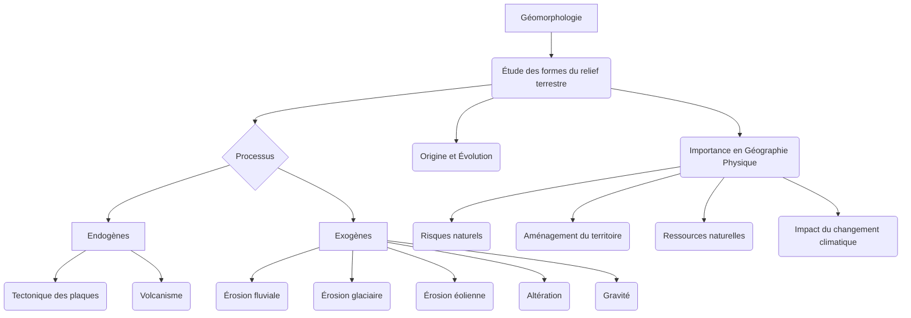

You are the Narrative Critic Agent (Agent 4A). Review the generated block of text for the lesson:
---

## Introduction à la Géomorphologie
La géomorphologie, du grec *gê* (Terre), *morphê* (forme) et *logos* (étude), est la science qui étudie les formes du relief terrestre, leur origine, leur évolution et les processus qui les façonnent. Elle se positionne au carrefour de la géographie physique, de la géologie et des sciences de l'environnement, cherchant à comprendre la dynamique complexe des paysages qui nous entourent. Loin d'être une simple description des formes, la géomorphologie analyse les interactions entre les forces internes de la Terre (endogènes) et les agents externes (exogènes) qui sculptent continuellement la surface de notre planète [ref5].

L'objet d'étude de la géomorphologie est vaste et englobe toutes les échelles spatiales et temporelles, des microformes (comme les rides de sable) aux macroformes (chaînes de montagnes, bassins océaniques). Elle s'intéresse non seulement aux formes actuelles, mais aussi à leur histoire passée (géomorphologie historique) et à leur évolution future, souvent en lien avec les changements climatiques et les activités humaines (géomorphologie appliquée et environnementale) [ref2].

L'importance de la géomorphologie en géographie physique est fondamentale. Elle fournit les clés pour comprendre la répartition des ressources naturelles, les risques géologiques (séismes, éruptions volcaniques, glissements de terrain, inondations), l'aménagement du territoire, et même l'évolution des écosystèmes. La connaissance des processus géomorphologiques est indispensable pour la gestion des littoraux, la planification urbaine, l'ingénierie civile et la prévision des impacts du changement climatique sur les paysages (GIEC, 2021) [ref6].

Ce cours de géomorphologie, destiné aux étudiants de Licence 3, a pour objectifs principaux de :
* Maîtriser les concepts fondamentaux et le vocabulaire spécifique de la géomorphologie.
* Comprendre les principaux processus endogènes et exogènes qui modèlent le relief terrestre.
* Identifier et analyser les grandes formes de relief associées à ces processus.
* Développer une approche systémique de l'étude des paysages, intégrant les interactions entre les différentes composantes du système Terre.
* Acquérir les outils méthodologiques pour l'analyse géomorphologique sur le terrain et à partir de données cartographiques ou satellitaires.

Nous aborderons dans un premier temps les forces internes de la Terre, responsables de la construction et de la déformation majeure du relief. Ces [[WIDGET:ConceptLink:processus_endogenes:processus endogènes]], tels que la tectonique des plaques et le volcanisme, sont les architectes des grandes structures topographiques. Dans un second temps, nous explorerons les processus externes, ou [[WIDGET:Glossary:processus_exogenes:processus exogènes]], comme l'érosion par l'eau, le vent, la glace et la gravité, qui sculptent et modifient ces structures initiales, créant une diversité infinie de paysages.

[[WIDGET:Mermaid:geomorphologie_overview]]

*Aperçu des domaines d'étude et des processus clés en géomorphologie.*
## Les Processus Endogènes et la Construction du Relief
Les processus endogènes sont les forces motrices internes de la Terre qui génèrent et modifient le relief à grande échelle. Ils sont alimentés par l'énergie thermique interne de la planète, issue de la désintégration radioactive d'éléments dans le manteau et le noyau, ainsi que de la chaleur résiduelle de la formation de la Terre. Ces mécanismes sont responsables de la création des continents, des océans, des chaînes de montagnes et des grandes fosses océaniques, constituant ainsi l'ossature fondamentale sur laquelle les processus exogènes viendront ensuite agir [ref5].

### La Tectonique des Plaques

La théorie de la [[WIDGET:ConceptLink:tectonique_plaques:tectonique des plaques]] est le paradigme unificateur de la géologie moderne. Elle postule que la lithosphère terrestre est fragmentée en un certain nombre de plaques rigides (environ une douzaine de plaques majeures et de nombreuses plaques mineures) qui flottent et se déplacent lentement sur l'asthénosphère, une couche plus ductile du manteau supérieur. Ces mouvements, de l'ordre de quelques centimètres par an, sont entraînés par les courants de convection du manteau [ref2].

L'idée d'une dérive des continents fut initialement proposée par [[WIDGET:RealPerson:wegener:Alfred Wegener]] au début du XXe siècle, mais ne fut largement acceptée qu'à partir des années 1960 avec l'accumulation de preuves géophysiques (paléomagnétisme, expansion des fonds océaniques, répartition des séismes et volcans).

[[WIDGET:HistoricalAnecdote:wegener_drift]]
*L'hypothèse de la dérive des continents d'Alfred Wegener, publiée en 1912, fut initialement accueillie avec scepticisme par la communauté scientifique. L'une des principales critiques était l'absence d'un mécanisme plausible pour expliquer le mouvement des continents. Ce n'est qu'avec les découvertes de l'expansion des fonds océaniques et des zones de subduction dans les années 1950 et 1960 que la théorie de la tectonique des plaques, offrant ce mécanisme manquant, a pu s'imposer, révolutionnant notre compréhension de la dynamique terrestre.*

Les interactions entre ces plaques sont à l'origine de la majeure partie de l'activité géologique et géomorphologique de notre planète. On distingue trois principaux types de frontières de plaques :

1.  **Les zones de divergence (ou dorsales médio-océaniques) :**
    *   Dans ces zones, les plaques s'écartent l'une de l'autre. Le magma provenant du manteau remonte, crée de la nouvelle croûte océanique et forme des chaînes de montagnes sous-marines appelées dorsales océaniques.
    *   Ce processus, appelé [[WIDGET:Glossary:expansion_oceanique:expansion des fonds océaniques]], est associé à un volcanisme effusif (basaltique) et à une sismicité modérée.
    *   Exemple : La dorsale médio-atlantique, où l'Islande est une manifestation émergée de cette activité.

2.  **Les zones de convergence (ou zones de subduction et de collision) :**
    *   Ici, les plaques se rapprochent. Selon la nature des croûtes impliquées (océanique ou continentale), les phénomènes diffèrent :
        *   **Subduction océanique-océanique ou océanique-continentale :** Une plaque océanique, plus dense, plonge sous une autre plaque (océanique ou continentale) dans le manteau. Ce processus génère des fosses océaniques profondes, un volcanisme explosif (arcs insulaires ou chaînes volcaniques continentales) et une sismicité intense et profonde.
            *   Exemples : La fosse des Mariannes (océanique-océanique), la cordillère des Andes (océanique-continentale).
        *   **Collision continentale-continentale :** Lorsque deux plaques continentales entrent en collision, aucune ne peut subduire significativement en raison de leur faible densité. Il en résulte un plissement et un épaississement considérable de la croûte, formant de vastes chaînes de montagnes (orogenèse). Le volcanisme est rare, mais la sismicité est très forte.
            *   Exemple : La chaîne de l'Himalaya, résultant de la collision entre la plaque indienne et la plaque eurasienne.

3.  **Les zones de coulissage (ou failles transformantes) :**
    *   Les plaques glissent horizontalement l'une par rapport à l'autre, sans création ni destruction significative de croûte.
    *   Ces zones sont caractérisées par une forte sismicité superficielle et l'absence de volcanisme.
    *   Exemple : La faille de San Andreas en Californie.

Pour mieux appréhender les spécificités de chaque type de frontière, le tableau comparatif ci-dessous en synthétise les caractéristiques principales :

| Caractéristique | Zone de Divergence (Dorsale) | Zone de Convergence (Subduction/Collision) | Zone de Coulissage (Faille Transformante) |
| :-------------- | :---------------------------- | :---------------------------------------- | :---------------------------------------- |
| **Mouvement**   | Écartement des plaques        | Rapprochement des plaques                 | Glissement latéral des plaques            |
| **Forces**      | Extension                     | Compression                               | Cisaillement                              |
| **Croûte**      | Création (océanique)          | Destruction (subduction) / Épaississement (collision) | Ni création, ni destruction             |
| **Formes de Relief** | Dorsales océaniques, rifts, volcans effusifs | Fosses océaniques, arcs insulaires, chaînes de montagnes (volcaniques ou collision) | Failles linéaires, décalages de relief |
| **Volcanisme**  | Fréquent (effusif)            | Fréquent (explosif, subduction) / Rare (collision) | Absent                                    |
| **Sismicité**   | Modérée, superficielle        | Intense, profonde (subduction) / Très forte (collision) | Forte, superficielle                      |
| **Exemples**    | Dorsale médio-atlantique      | Fosse des Mariannes, Andes, Himalaya      | Faille de San Andreas                     |

[[WIDGET:Image:tectonic_plates_map]]
*Carte mondiale des principales plaques tectoniques et des types de frontières associées. On observe clairement la corrélation entre ces frontières et la distribution des volcans et des séismes.*

#### Manifestations de la Tectonique des Plaques sur le Relief

Les mouvements des plaques tectoniques sont les principaux moteurs de la [[WIDGET:ConceptLink:orogenese:orogenèse]], c'est-à-dire la formation des chaînes de montagnes.
*   **Orogenèse de subduction :** Les chaînes de montagnes volcaniques (arcs volcaniques) se forment au-dessus des zones de subduction. Le magma généré par la fusion partielle de la plaque subduite remonte à la surface, créant des volcans et des massifs intrusifs. Les contraintes compressives entraînent également le plissement et le chevauchement des roches.
*   **Orogenèse de collision :** C'est le type d'orogenèse le plus spectaculaire, produisant les plus hautes montagnes du monde. La collision continentale entraîne un raccourcissement et un épaississement crustal intense, avec des plis, des failles inverses et des nappes de charriage.

Les **failles** sont des fractures de la croûte terrestre le long desquelles il y a eu un mouvement relatif des blocs rocheux. Elles sont omniprésentes et peuvent être classées selon le sens du mouvement :
*   **Failles normales :** Résultent d'une extension (divergence), le bloc supérieur (toit) s'affaisse par rapport au bloc inférieur (mur).
*   **Failles inverses :** Résultent d'une compression (convergence), le bloc supérieur remonte par rapport au bloc inférieur. Les chevauchements sont des failles inverses à faible pendage.
*   **Failles décrochantes (ou transformantes) :** Résultent d'un cisaillement, les blocs glissent horizontalement l'un par rapport à l'autre.

Les **séismes** (ou tremblements de terre) sont des libérations brusques d'énergie accumulée le long des failles, sous forme d'ondes sismiques. Ils sont particulièrement fréquents et intenses aux frontières de plaques, mais peuvent aussi survenir à l'intérieur des plaques (sismicité intraplaque). L'intensité d'un séisme est mesurée par des échelles comme la magnitude de Richter ou de moment, et ses effets par l'échelle de Mercalli modifiée. Les séismes peuvent provoquer des glissements de terrain, des tsunamis et des modifications importantes du relief.

[[WIDGET:DataChart:earthquake_frequency]]
*Ce graphique illustre la distribution mondiale de la fréquence et de la magnitude des séismes sur une période donnée, mettant en évidence la concentration de l'activité sismique le long des frontières de plaques tectoniques.*

### Le Volcanisme et son Rôle dans la Formation des Paysages

Le volcanisme est l'ensemble des phénomènes liés à la remontée de magma (roche en fusion) depuis l'intérieur de la Terre vers la surface, où il est appelé lave. C'est un processus géomorphologique majeur qui crée des formes de relief distinctives et contribue à la formation de nouvelles terres.

#### Types d'Éruptions Volcaniques

Les types d'éruptions sont principalement contrôlés par la composition du magma, en particulier sa teneur en silice et en gaz dissous, qui détermine sa viscosité :
1.  **Éruptions effusives (ou hawaïennes) :**
    *   Magma basaltique, pauvre en silice, très fluide et peu chargé en gaz.
    *   La lave s'écoule facilement, formant de vastes coulées.
    *   Volcans de type bouclier, aux pentes douces.
    *   Exemple : Les volcans d'Hawaï.

2.  **Éruptions explosives (ou péléennes, vulcaniennes, pliniennes) :**
    *   Magma andésitique ou rhyolitique, riche en silice, visqueux et très chargé en gaz.
    *   Les gaz s'échappent difficilement, provoquant des explosions violentes qui projettent des cendres, des lapilli et des bombes volcaniques.
    *   Volcans de type stratovolcan (ou volcan composite), aux pentes raides et coniques.
    *   Exemple : Le Vésuve, le Mont Saint Helens.

3.  **Éruptions phréatomagmatiques :**
    *   Interaction entre le magma et l'eau (nappe phréatique, lac, mer), entraînant des explosions particulièrement violentes dues à la vaporisation rapide de l'eau.
    *   Peut former des maars (cratères d'explosion).

#### Formes Volcaniques

Le volcanisme crée une grande variété de formes de relief, des plus imposantes aux plus discrètes :
*   **Volcans boucliers :** Vastes édifices aux pentes douces, formés par l'accumulation de coulées de lave très fluides. Ex : Mauna Loa (Hawaï).
*   **Stratovolcans (ou volcans composites) :** Volcans coniques aux pentes raides, construits par l'alternance de coulées de lave visqueuses et de dépôts pyroclastiques (cendres, ponces). Ex : Fuji-yama, Etna.
*   **Caldeiras :** Vastes dépressions circulaires résultant de l'effondrement du toit d'une chambre magmatique vidée après une éruption majeure. Ex : Santorin.
*   **Dômes de lave :** Masses de lave très visqueuse qui s'accumulent au-dessus de la cheminée volcanique, formant un dôme.
*   **Maars :** Cratères d'explosion peu profonds, souvent remplis d'eau, formés par des éruptions phréatomagmatiques.
*   **Plateaux basaltiques (ou trapps) :** Vastes étendues de lave fluide qui s'épanchent par des fissures, recouvrant de grandes surfaces. Ex : Trapps du Deccan (Inde).
*   **Intrusions volcaniques :** Formes créées par la solidification du magma sous la surface, qui peuvent être exposées par l'érosion ultérieure (dykes, sills, laccolites, batholites).

Le volcanisme joue un rôle crucial dans le cycle géochimique de la Terre, libérant des gaz dans l'atmosphère et apportant de nouveaux matériaux à la surface, contribuant ainsi à la fertilité des sols volcaniques.

[[WIDGET:Quiz:endogenous_processes_quiz]]
*Vérifiez votre compréhension des processus endogènes avec ce quiz interactif.*

[[WIDGET:SolvedExercise:plate_velocity_calculation]]
*Exercice résolu : Calcul de la vitesse de déplacement d'une plaque tectonique.*
**Problème :** La dorsale médio-atlantique s'étend à un taux moyen de 2,5 cm par an. Estimez la distance totale dont l'Amérique du Sud s'est éloignée de l'Afrique depuis le début de l'ouverture de l'océan Atlantique il y a environ 180 millions d'années.
**Solution :**
1.  **Convertir le temps en années :** 180 millions d'années = 180 000 000 ans.
2.  **Convertir le taux d'expansion en kilomètres par an :** 2,5 cm/an = 0,025 m/an = 0,000025 km/an.
3.  **Calculer la distance totale :** Distance = Taux d'expansion × Temps
    Distance = 0,000025 km/an × 180 000 000 ans = 4500 km.
**Réponse :** L'Amérique du Sud s'est éloignée de l'Afrique d'environ 4500 km depuis le début de l'ouverture de l'Atlantique.

[[WIDGET:UnsolvedExercise:volcanic_landforms]]
*Exercice non résolu : Identification des formes volcaniques.*
**Question :** Observez attentivement une carte topographique ou une image satellite d'une région volcanique (par exemple, la Chaîne des Puys en France ou la région des Cascades aux États-Unis). Identifiez et décrivez au moins trois formes de relief volcaniques distinctes (par exemple, un stratovolcan, un dôme de lave, un maar, une coulée de lave, une caldeira) et expliquez brièvement les processus éruptifs qui ont pu les former.
---

Check checkpoints:
1. Zero-placeholders.
2. Accurate academic density and level-appropriate language.
3. Strict MDX/JSX safety (absolutely no raw custom component or custom JSX/HTML tags like <ConceptLink>, <RealPerson>, <Glossary>, etc. inline in prose. All interactive elements and special links must strictly use the [[WIDGET:id]] anchor format).
4. No figure prefixes like "Figure 1:" in visual captions.
5. Presence of pedagogical widgets: Check that the block contains:
   - At least 3 inline hover-cards (ConceptLink, Glossary, RealPerson, etc.) as anchors.
   - At least 2 block widgets (Image, Mermaid, ComparisonSlider, InteractiveDiagram, DataChart, Video, HistoricalAnecdote, BrilliantIdea, etc.) as anchors.
   - If any mandated widget types (HistoricalAnecdote, Quiz, Image, Mermaid, SolvedExercise, UnsolvedExercise, DataChart) are missing or any discouraged widget types () are overused, point it out and reject the block if they are not respected.


Your audit must be in dual-mode:
- **"isGlobalRevision" MUST ONLY be set to true if the issues are widespread and catastrophic** (completely unparseable structure, severe length deficiency, or total failure of the block narrative requiring a complete full-text rewrite). If so, provide a comprehensive "globalCritique".
- **For standard, localized, or section-specific mistakes, you MUST set "isGlobalRevision": false**, and list ONLY the rejected sections requiring localized repair in the "sections" array.

Return ONLY a valid JSON object matching blockNarrativeAuditSchema:
```json
{
  "approved": boolean,
  "isGlobalRevision": boolean,
  "globalCritique": "detailed feedback explaining what to fix globally, or empty if approved/local repair",
  "sections": [
    // If approved is false and isGlobalRevision is false, list ONLY the specific sections that are rejected. Do NOT include approved sections.
    {
      "heading": "heading of the rejected section",
      "approved": false,
      "critique": "detailed feedback explaining what to fix in this specific section"
    }
  ]
}
```

[REJECT-ONLY REPORTING MANDATE]
1. If approved is true: approved MUST be true, isGlobalRevision MUST be false, globalCritique MUST be "", and sections MUST be empty.
2. If isGlobalRevision is true: approved MUST be false, isGlobalRevision MUST be true, globalCritique MUST describe the global issues, and sections MUST be empty.
3. If approved is false and isGlobalRevision is false: sections MUST ONLY contain sections that are rejected (with approved set to false). Any approved section MUST be strictly omitted from the array.