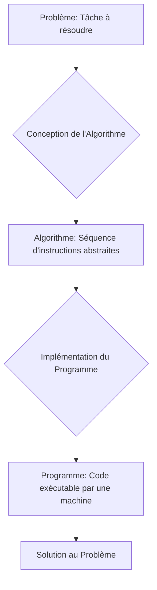

You are the Narrative Critic Agent (Agent 4A). Review the generated block of text for the lesson:
---
Ainsi, de la simple recherche du PGCD à la complexité des systèmes d'intelligence artificielle actuels, l'algorithmique a parcouru un long chemin, évoluant d'une série d'étapes mathématiques spécifiques à une discipline fondamentale qui sous-tend toute la technologie numérique. Comprendre cette genèse est essentiel pour apprécier la profondeur et la portée de l'algorithmique aujourd'hui.

## L'algorithmique: Pilier de l'informatique et méthode de pensée structurée
L'algorithmique n'est pas seulement une branche de l'informatique; elle en est le cœur battant, le pilier sur lequel repose l'intégralité du monde numérique contemporain. Chaque interaction avec un appareil électronique, chaque requête sur internet, chaque application mobile, et chaque système complexe, des réseaux de communication aux simulations scientifiques, est le fruit d'algorithmes méticuleusement conçus et exécutés.

Sa place est centrale dans des domaines aussi variés que le développement logiciel (systèmes d'exploitation, applications bureautiques, jeux vidéo), l'intelligence artificielle (apprentissage automatique, traitement du langage naturel, vision par ordinateur), la science des données (analyse, prédiction, visualisation), la cybersécurité, les systèmes embarqués, et bien d'autres. Sans algorithmes efficaces, les ordinateurs ne seraient que des machines inertes, incapables de transformer des données brutes en informations utiles ou de résoudre des problèmes complexes. Les avancées en IA, par exemple, sont intrinsèquement liées à la conception d'algorithmes sophistiqués capables d'apprendre et de s'adapter.

Au-delà de son rôle technique indispensable, l'algorithmique est également un outil puissant pour le développement d'une pensée logique et structurée. Elle nous enseigne à décomposer un problème complexe en sous-problèmes plus petits et gérables, à identifier les étapes nécessaires pour passer d'un état initial à un état final désiré, et à anticiper les différentes situations possibles. Cette approche systématique de la résolution de problèmes, bien que formalisée pour les machines, est une compétence transférable et précieuse dans de nombreux domaines non informatiques, tels que la gestion de projet, la recherche scientifique, la logistique, la finance, et même la prise de décision quotidienne. Elle cultive la rigueur, la précision et la capacité à raisonner de manière déductive.

Pour mieux appréhender cette dualité fondamentale, le tableau suivant synthétise les rôles et bénéfices de l'algorithmique:

| Aspect de l'Algorithmique | Rôle Technique Central                                       | Bénéfice pour la Pensée Structurée                               |
| :------------------------ | :----------------------------------------------------------- | :--------------------------------------------------------------- |
| **Domaines d'Application** | Développement logiciel, IA, Science des données, Cybersécurité, Systèmes embarqués, Réseaux | Gestion de projet, Recherche scientifique, Logistique, Finance, Prise de décision |
| **Fonction Principale**   | Résoudre des problèmes complexes, traiter des données, automatiser des tâches, optimiser des processus | Décomposer des problèmes, identifier des étapes clés, anticiper des situations, modéliser la réalité |
| **Impact**                | Rend les machines "intelligentes" et utiles, moteur de l'innovation numérique et technologique | Développe la rigueur, la précision, le raisonnement déductif, la logique et la créativité dans la résolution |
| **Nature**                | Ensemble d'instructions formelles exécutables par une machine | Méthodologie systématique et transférable de résolution de problèmes |
## Définition des concepts clés: Problème, Algorithme et Programme
Pour naviguer dans le monde de l'algorithmique, il est impératif de comprendre la distinction fondamentale entre trois concepts interdépendants: le problème, l'algorithme et le programme.

Un **problème**, du point de vue algorithmique, est une tâche bien définie pour laquelle on cherche une solution. Il est caractérisé par un ensemble d'entrées (données initiales) et un ensemble de sorties (résultats attendus). La spécification d'un problème doit être précise et non ambiguë, décrivant *ce qui* doit être accompli, sans indiquer *comment*. Par exemple, "trier une liste de nombres entiers" est un problème: l'entrée est une liste non ordonnée, et la sortie est la même liste, mais ordonnée. La clarté de la définition du problème est la première étape cruciale vers sa résolution.

Un **algorithme** est une séquence finie et ordonnée d'instructions claires, non ambiguës et exécutables, conçues pour résoudre un problème spécifique ou une classe de problèmes. Pour qu'une séquence d'étapes soit considérée comme un algorithme, elle doit satisfaire plusieurs propriétés essentielles:
*   **Finitude:** L'algorithme doit se terminer après un nombre fini d'étapes pour toutes les entrées valides.
*   **Définition précise:** Chaque étape doit être définie sans ambiguïté, ne laissant aucune place à l'interprétation.
*   **Entrées:** L'algorithme doit accepter zéro ou plusieurs entrées.
*   **Sorties:** L'algorithme doit produire une ou plusieurs sorties.
*   **Efficacité:** Chaque instruction doit être suffisamment simple pour être exécutée en un temps fini par une entité (humaine ou machine) capable de suivre les instructions.

Un algorithme est une description abstraite de la logique de résolution. Il est indépendant de tout langage de programmation ou machine spécifique. Un même algorithme peut être décrit en langage naturel, sous forme de pseudo-code, ou à l'aide de diagrammes. Par exemple, l'algorithme de tri par insertion est une méthode conceptuelle pour trier une liste, quelle que soit la manière dont elle sera finalement codée.

Enfin, un **programme** est l'implémentation concrète d'un algorithme dans un langage de programmation spécifique (comme Python, C++, Java, etc.). C'est la traduction des étapes abstraites de l'algorithme en un code exécutable par un ordinateur. Alors que l'algorithme est le "quoi faire" (la recette), le programme est le "comment le faire" (la mise en œuvre de la recette avec des ingrédients et des outils spécifiques). Un algorithme donné peut être implémenté par de nombreux programmes différents, chacun utilisant un langage ou une approche de codage particulière, mais tous réalisant la même tâche fondamentale définie par l'algorithme. Le programme est donc la forme tangible et exécutable de l'algorithme.

Pour synthétiser ces concepts fondamentaux, voici un tableau comparatif:

| Caractéristique       | Problème                                   | Algorithme                                       | Programme                                      |
| :-------------------- | :----------------------------------------- | :----------------------------------------------- | :--------------------------------------------- |
| **Nature**            | Tâche à résoudre, défi abstrait            | Méthode abstraite de résolution                  | Implémentation concrète de la méthode          |
| **Description**       | *Ce qui* doit être accompli (entrées/sorties) | *Comment* accomplir la tâche (séquence d'étapes) | *Comment* l'ordinateur l'exécute (code)        |
| **Indépendance**      | Indépendant de la solution                 | Indépendant du langage/machine                   | Dépendant du langage/machine                   |
| **Format**            | Langage naturel, spécification             | Langage naturel, pseudo-code, diagramme          | Code source dans un langage de programmation   |
| **Exemple**           | "Trier une liste de nombres"               | Algorithme de tri par insertion                  | Code Python pour le tri par insertion          |
| **Objectif Principal** | Définir la cible                           | Fournir la logique de résolution                 | Rendre la logique exécutable par une machine   |

La relation entre ces trois concepts peut être visualisée comme un processus séquentiel:


---

Check checkpoints:
1. Zero-placeholders.
2. Accurate academic density and level-appropriate language.
3. Strict MDX/JSX safety (absolutely no raw custom component or custom JSX/HTML tags like <ConceptLink>, <RealPerson>, <Glossary>, etc. inline in prose. All interactive elements and special links must strictly use the [[WIDGET:id]] anchor format).
4. No figure prefixes like "Figure 1:" in visual captions.


Your audit must be in dual-mode:
- **"isGlobalRevision" MUST ONLY be set to true if the issues are widespread and catastrophic** (completely unparseable structure, severe length deficiency, or total failure of the block narrative requiring a complete full-text rewrite). If so, provide a comprehensive "globalCritique".
- **For standard, localized, or section-specific mistakes, you MUST set "isGlobalRevision": false**, and list ONLY the rejected sections requiring localized repair.

Return ONLY a valid JSON object matching blockNarrativeAuditSchema:
```json
{
  "approved": boolean,
  "isGlobalRevision": boolean,
  "globalCritique": "detailed feedback explaining what to fix globally, or empty if approved/local repair",
  "sections": [
    // If approved is false and isGlobalRevision is false, list ONLY the specific sections that are rejected. Do NOT include approved sections.
    {
      "heading": "heading of the rejected section",
      "approved": false,
      "critique": "detailed feedback explaining what to fix in this specific section"
    }
  ]
}
```
Do NOT wrap your JSON response in markdown code blocks.