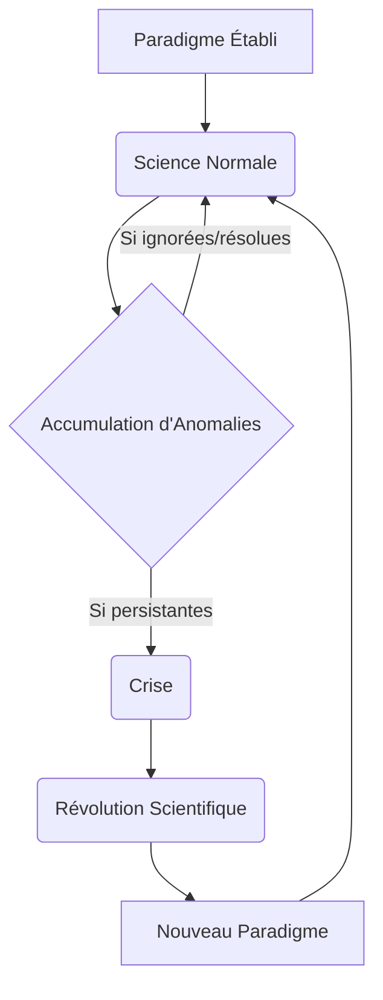

You are the Narrative Critic Agent (Agent 4A). Review the generated block of text for the lesson:
---
Après avoir exploré la perspective de Karl Popper sur la démarcation scientifique par la falsifiabilité, il est essentiel de se tourner vers d'autres approches qui ont profondément remis en question cette vision, notamment en intégrant des dimensions historiques et sociologiques.

## Thomas Kuhn et la notion de paradigme
Thomas Kuhn, dans son ouvrage majeur *La structure des révolutions scientifiques*, propose une vision radicalement différente du développement scientifique, s'éloignant de l'idée d'un progrès linéaire et cumulatif. Pour Kuhn, la science ne progresse pas uniquement par l'accumulation de découvertes ou la réfutation d'hypothèses isolées, mais par des périodes de stabilité ponctuées de ruptures majeures.

Au cœur de sa théorie se trouve la notion de **paradigme**. Un paradigme n'est pas simplement une théorie ou un ensemble de lois ; c'est une matrice disciplinaire partagée par une communauté scientifique à un moment donné. Il englobe un ensemble de théories, de lois, de techniques expérimentales, de valeurs, de problèmes jugés pertinents et de solutions exemplaires qui servent de modèles. C'est un cadre conceptuel et méthodologique qui guide la recherche et définit ce qui est considéré comme de la "bonne science".

La majeure partie de l'activité scientifique se déroule sous le régime de la **science normale**. Durant cette période, les scientifiques travaillent *à l'intérieur* d'un paradigme établi. Leur tâche consiste à résoudre des "énigmes" ou des "puzzles" que le paradigme a lui-même définis, en utilisant les outils et les concepts qu'il fournit. La science normale est une activité de résolution de problèmes, non de remise en question des fondements. Les anomalies, c'est-à-dire les observations qui ne s'accordent pas avec les prédictions du paradigme, sont généralement ignorées, expliquées par des ajustements mineurs, ou considérées comme des échecs de l'expérimentateur plutôt que du paradigme lui-même.

Cependant, l'accumulation d'anomalies persistantes et de plus en plus difficiles à ignorer peut mener à une **crise**. Lorsque la confiance dans la capacité du paradigme à résoudre les problèmes fondamentaux s'érode, la communauté scientifique entre dans une période d'incertitude et de débat intense. Cette crise peut finalement déboucher sur une **révolution scientifique**. Une révolution scientifique est un changement de paradigme, un basculement complet de la vision du monde et des pratiques scientifiques. Ce n'est pas un processus cumulatif où l'ancien est simplement amélioré ; c'est plutôt une "conversion" ou un "changement de Gestalt", où les anciens problèmes sont vus sous un jour nouveau, et de nouveaux problèmes émergent.

La notion de paradigme et de révolution scientifique remet en question la démarcation poppérienne et l'idée de progrès linéaire de plusieurs manières. Premièrement, la science normale, telle que décrite par Kuhn, n'est pas principalement axée sur la falsification. Au contraire, les scientifiques s'efforcent de faire correspondre la réalité au paradigme, et non de le réfuter. La falsification, si elle se produit, est d'abord traitée comme une anomalie, et c'est seulement son accumulation qui peut potentiellement déclencher une crise. Deuxièmement, les paradigmes sont souvent **incommensurables** : ils ne peuvent pas être comparés directement sur un terrain neutre, car ils définissent leurs propres critères de validité, leurs propres problèmes et leurs propres solutions. Cela signifie que le passage d'un paradigme à un autre n'est pas nécessairement un progrès vers une "vérité" plus grande ou une meilleure approximation de la réalité, mais plutôt un changement dans la manière de voir et d'interroger le monde. Le progrès scientifique, pour Kuhn, est donc plus une succession de "meilleures" résolutions d'énigmes au sein de cadres changeants qu'une marche continue vers la vérité objective.

Pour mieux comprendre la dynamique du développement scientifique selon Kuhn, voici une comparaison entre la science normale et la révolution scientifique, suivie d'un diagramme illustrant le cycle paradigmatique.

| Caractéristique             | Science Normale                                     | Révolution Scientifique                               |
| :-------------------------- | :-------------------------------------------------- | :---------------------------------------------------- |
| **Objectif Principal**      | Résoudre des "énigmes" au sein du paradigme existant | Remplacer un paradigme par un nouveau                 |
| **Nature de l'activité**    | Cumulatif, résolution de problèmes, "puzzle-solving" | Non cumulatif, rupture, "changement de Gestalt"       |
| **Attitude face aux anomalies** | Ignorées, expliquées par des ajustements mineurs, ou considérées comme des échecs de l'expérimentateur | Accumulation d'anomalies persistantes, source de crise |
| **Rôle du paradigme**       | Cadre conceptuel et méthodologique stable           | Remise en question et remplacement du cadre           |
| **Progrès**                 | Progrès au sein du paradigme (résolution d'énigmes) | Progrès par changement de perspective (incommensurabilité) |


## Paul Feyerabend : Contre la méthode et l'anarchisme épistémologique
Poussant la critique de la rationalité scientifique et de la démarcation à son paroxysme, Paul Feyerabend, dans son œuvre provocatrice *Contre la méthode*, développe une position d'**anarchisme épistémologique**. Feyerabend rejette l'idée même qu'il puisse exister une méthode scientifique universelle et rationnelle qui garantirait le progrès de la connaissance. Pour lui, toute tentative de définir des règles fixes et universelles pour la science est non seulement futile, mais aussi nuisible à la créativité et à l'avancement de la connaissance.

Son slogan célèbre, "tout est bon" (*anything goes*), résume sa critique radicale. Feyerabend soutient qu'historiquement, les avancées scientifiques majeures n'ont pas respecté une méthode rigoureuse, mais ont souvent procédé par des violations audacieuses des règles établies, par l'opportunisme, l'intuition, voire l'irrationalité. Il cite des exemples comme Galilée, qui a utilisé des arguments rhétoriques et des théories non confirmées pour défendre sa vision du monde, ou la coexistence de l'astrologie et de l'astronomie à certaines époques. Pour Feyerabend, imposer une méthode unique reviendrait à étouffer l'innovation et à limiter la liberté intellectuelle des scientifiques.

L'**anarchisme épistémologique** de Feyerabend implique que la science n'est pas supérieure aux autres formes de connaissance (mythes, religions, arts, savoirs traditionnels) en vertu d'une méthode intrinsèquement plus rationnelle ou plus efficace. Il la considère comme une tradition parmi d'autres, avec ses propres dogmes, ses propres préjugés et ses propres limites. Il plaide pour une séparation de la science et de l'État, afin d'éviter que la science ne devienne une idéologie dominante et oppressive.

Les implications de cette position pour la rationalité scientifique et le problème de la démarcation sont profondes. Si "tout est bon", alors il n'y a plus de critère distinctif pour séparer la science de la non-science. La démarcation devient un problème illusoire, car il n'y a pas de frontière fixe ou de méthode universelle à défendre. La rationalité scientifique, loin d'être une entité monolithique, est déconstruite en une multitude de pratiques contextuelles et souvent contradictoires. Feyerabend nous invite à embrasser un pluralisme méthodologique et théorique, où la liberté et la créativité priment sur la conformité à des règles arbitraires. Sa pensée est une invitation à la prudence face à toute forme de dogmatisme, y compris celui qui se parerait des atours de la science.

Pour mieux situer la position radicale de Feyerabend, voici une comparaison avec une vision plus traditionnelle de la science.

| Caractéristique             | Vision Traditionnelle de la Science (ex: Popper)     | Anarchisme Épistémologique (Feyerabend)               |
| :-------------------------- | :--------------------------------------------------- | :---------------------------------------------------- |
| **Méthode Scientifique**    | Unique, universelle, rationnelle (ex: falsification) | Aucune méthode universelle, "tout est bon"            |
| **Progrès Scientifique**    | Linéaire, cumulatif, par élimination des erreurs     | Non linéaire, opportuniste, par violations des règles |
| **Rapport Science/Autres Savoirs** | Science supérieure par sa méthode et sa rationalité | Science est une tradition parmi d'autres, pas de supériorité intrinsèque |
| **Critère de Démarcation**  | Existent (ex: falsifiabilité)                       | Illusoire, pas de frontière fixe ou de méthode universelle |
| **Rôle de la Rationalité**  | Fondamentale, guide la recherche                     | Souvent entravante, la créativité prime               |
---

Check checkpoints:
1. Zero-placeholders.
2. Accurate academic density and level-appropriate language.
3. Strict MDX/JSX safety (absolutely no raw custom component or custom JSX/HTML tags like <ConceptLink>, <RealPerson>, <Glossary>, etc. inline in prose. All interactive elements and special links must strictly use the [[WIDGET:id]] anchor format).
4. No figure prefixes like "Figure 1:" in visual captions.


Your audit must be in dual-mode:
- **"isGlobalRevision" MUST ONLY be set to true if the issues are widespread and catastrophic** (completely unparseable structure, severe length deficiency, or total failure of the block narrative requiring a complete full-text rewrite). If so, provide a comprehensive "globalCritique".
- **For standard, localized, or section-specific mistakes, you MUST set "isGlobalRevision": false**, and list ONLY the rejected sections requiring localized repair.

Return ONLY a valid JSON object matching blockNarrativeAuditSchema:
```json
{
  "approved": boolean,
  "isGlobalRevision": boolean,
  "globalCritique": "detailed feedback explaining what to fix globally, or empty if approved/local repair",
  "sections": [
    // If approved is false and isGlobalRevision is false, list ONLY the specific sections that are rejected. Do NOT include approved sections.
    {
      "heading": "heading of the rejected section",
      "approved": false,
      "critique": "detailed feedback explaining what to fix in this specific section"
    }
  ]
}
```
Do NOT wrap your JSON response in markdown code blocks.