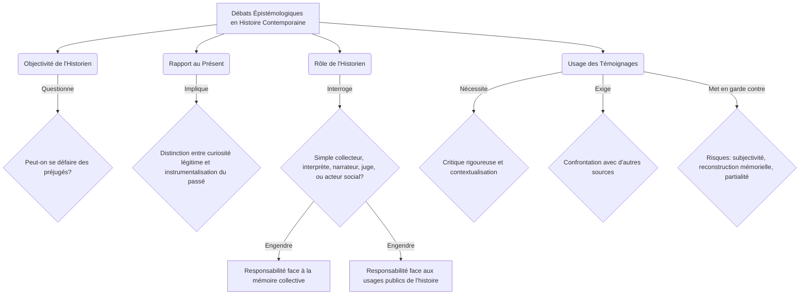

You are the Narrative Critic Agent (Agent 4A). Review the generated block of text for the lesson:
---

## Les enjeux de la périodisation : Quand commence le 'contemporain' ?
Si la définition de l'histoire contemporaine comme discipline est relativement consensuelle, la détermination de son point de départ précis demeure un sujet de vifs débats historiographiques. Les dates charnières proposées ne sont pas de simples repères chronologiques, mais des choix méthodologiques qui orientent la compréhension des processus historiques et la nature des continuités ou ruptures étudiées.

La Révolution française de **1789** est souvent avancée comme le seuil inaugural. Elle marque la fin de l'Ancien Régime, l'émergence des nations, la souveraineté populaire, et l'affirmation des droits de l'homme, posant les jalons politiques et idéologiques de la modernité. Eric Hobsbawm, avec son concept d'« Ère des révolutions » (1789-1848) [[WIDGET:ref1]], a magistralement démontré comment cette période a façonné le monde contemporain par ses transformations politiques et sociales profondes. D'autres historiens privilégient **1815**, fin des guerres napoléoniennes et Congrès de Vienne, comme le moment de la réorganisation de l'Europe, mais aussi de la cristallisation des forces nationalistes et libérales qui animeront le XIXe siècle.

Le milieu du XIXe siècle, avec les révolutions de **1848**, est parfois considéré comme un autre point de bascule, soulignant l'irruption des questions sociales et l'affirmation des idéologies modernes. Plus tard, **1870-1871** (guerre franco-prussienne, unification allemande, Commune de Paris) peut être vu comme le début d'une nouvelle ère impérialiste et de l'État-nation moderne. Eric Hobsbawm propose également **1875** comme point de départ de l'« Ère des empires » [[WIDGET:ref2]], mettant l'accent sur l'apogée de l'impérialisme, l'industrialisation et la mondialisation économique.

Cependant, une rupture plus radicale est souvent associée à **1914**, début de la Première Guerre mondiale. Ce conflit marque l'entrée dans l'« Âge des extrêmes » ou le "court XXe siècle" (1914-1991) selon Hobsbawm [[WIDGET:ref3]], caractérisé par les guerres totales, les idéologies de masse, les génocides et la bipolarisation du monde. Enfin, **1945**, fin de la Seconde Guerre mondiale, est une autre date clé, ouvrant sur la Guerre Froide, la décolonisation (analysée par Marc Ferro [[WIDGET:ref4]]), la construction européenne et l'émergence d'un ordre mondial nouveau.

Le choix de l'une ou l'autre de ces dates n'est jamais neutre. Il détermine les critères d'analyse : privilégie-t-on les mutations politiques, les transformations économiques et sociales, ou les ruptures culturelles et technologiques ? Il influence la perspective adoptée : une histoire centrée sur l'Europe ou une approche plus globale ? Ces découpages sont des constructions intellectuelles qui permettent de donner du sens au passé, de hiérarchiser les événements et de mettre en lumière certaines dynamiques plutôt que d'autres, façonnant ainsi notre compréhension des origines et de la nature du « temps présent ».

Pour synthétiser les principales propositions de périodisation, le tableau suivant met en lumière les dates clés et leurs justifications :

| Date Clé | Événement Marquant | Justification Historique Principale | Historiens / Concepts Associés |
| :------- | :----------------- | :--------------------------------- | :----------------------------- |
| **1789** | Révolution française | Fin de l'Ancien Régime, émergence des nations, droits de l'homme. | Eric Hobsbawm ("Ère des révolutions") [[WIDGET:ref1]] |
| **1815** | Congrès de Vienne | Réorganisation de l'Europe, cristallisation des forces libérales et nationalistes. | |
| **1848** | Révolutions européennes | Irruption des questions sociales, affirmation des idéologies modernes. | |
| **1870-1871** | Guerre franco-prussienne, Unification allemande, Commune de Paris | Début d'une nouvelle ère impérialiste, État-nation moderne. | Eric Hobsbawm ("Ère des empires") [[WIDGET:ref2]] |
| **1914** | Première Guerre mondiale | Entrée dans les guerres totales, idéologies de masse, "court XXe siècle". | Eric Hobsbawm ("Âge des extrêmes") [[WIDGET:ref3]] |
| **1945** | Fin de la Seconde Guerre mondiale | Guerre Froide, décolonisation, nouvel ordre mondial. | Marc Ferro (décolonisation) [[WIDGET:ref4]] |
## Courants historiographiques et débats épistémologiques
L'étude de l'histoire contemporaine n'est pas monolithique ; elle a été profondément marquée par l'émergence et l'évolution de divers courants historiographiques, chacun apportant ses méthodes, ses objets et ses questionnements. Ces approches ont enrichi la discipline tout en suscitant des débats épistémologiques fondamentaux sur la nature même de la connaissance historique.

L'**École des Annales**, fondée en France au début du XXe siècle (Lucien Febvre, Marc Bloch), puis renouvelée par Fernand Braudel et Emmanuel Le Roy Ladurie, a révolutionné l'historiographie en délaissant l'histoire événementielle et politique au profit de l'étude des structures sociales, des économies, des mentalités et de la longue durée. Elle a promu une histoire totale, interdisciplinaire, s'appuyant sur des méthodes quantitatives et l'analyse de sources variées.

Dans son sillage, l'**histoire culturelle** s'est développée, notamment avec des figures comme Roger Chartier ou, pour la France contemporaine, Jean-Pierre Rioux et Jean-François Sirinelli [[WIDGET:ref7]]. Elle s'intéresse aux représentations, aux pratiques, aux symboles, aux médias, aux identités et aux imaginaires collectifs, cherchant à comprendre comment les sociétés donnent sens à leur monde. Parallèlement, l'**histoire sociale** a continué d'explorer les classes, les groupes sociaux, les mouvements ouvriers et les inégalités, tandis que l'**histoire politique renouvelée** (incarnée par René Rémond [[WIDGET:ref5]]) a réinvesti le champ politique en l'analysant à travers ses cultures, ses acteurs et ses idéologies, au-delà des seuls événements.

Plus récemment, l'**histoire globale** ou **mondiale** a gagné en importance, cherchant à dépasser les cadres nationaux pour étudier les interconnexions, les circulations (personnes, biens, idées) et les phénomènes transnationaux, comme les processus de colonisation et de décolonisation [[WIDGET:ref4]]. Cette approche remet en question les récits eurocentrés et invite à une décentration des regards.

Ces évolutions historiographiques ont nourri des débats épistémologiques cruciaux. La question de l'**objectivité de l'historien** est centrale : l'historien peut-il se défaire de ses propres préjugés, de son époque, de sa culture pour restituer le passé tel qu'il fut ? Le **rapport au présent** est inévitable ; l'historien est un être de son temps, et ses interrogations sur le passé sont souvent influencées par les préoccupations de son époque. Il s'agit alors de distinguer la curiosité légitime pour les racines du présent de la projection anachronique ou de l'instrumentalisation du passé.

Le **rôle de l'historien** est également en constante discussion : est-il un simple collecteur de faits, un interprète, un narrateur, un juge, ou un acteur social ? Sa responsabilité face à la mémoire collective et aux usages publics de l'histoire est considérable. Enfin, l'**usage des témoignages**, particulièrement abondants en histoire contemporaine, pose des défis méthodologiques spécifiques. Si les témoignages oraux ou écrits sont des sources irremplaçables pour accéder à l'expérience vécue, ils nécessitent une critique rigoureuse, une contextualisation et une confrontation avec d'autres types de sources pour éviter les pièges de la subjectivité, de la reconstruction mémorielle ou de la partialité. L'historien doit ainsi constamment naviguer entre la quête de la vérité historique et la reconnaissance de la pluralité des interprétations du passé.

Pour une meilleure compréhension des principaux courants historiographiques :

| Courant Historiographique | Période / Figures Clés | Objets d'Étude Principaux | Apports Méthodologiques / Concepts |
| :----------------------- | :--------------------- | :-------------------------------- | :-------------------------------- |
| **École des Annales** | Début XXe siècle (Febvre, Bloch, Braudel, Le Roy Ladurie) | Structures sociales, économies, mentalités, longue durée. | Histoire totale, interdisciplinarité, analyse de sources variées. |
| **Histoire Culturelle** | (Chartier, Rioux, Sirinelli [[WIDGET:ref7]]) | Représentations, pratiques, symboles, médias, imaginaires collectifs. | Compréhension du sens social, des identités et des valeurs. |
| **Histoire Sociale** | (Continuité, divers auteurs) | Classes, groupes sociaux, mouvements ouvriers, inégalités. | Analyse des dynamiques de pouvoir, des conditions de vie et des luttes. |
| **Histoire Politique Renouvelée** | (René Rémond [[WIDGET:ref5]]) | Cultures politiques, acteurs, idéologies, systèmes de partis. | Au-delà de l'événementiel, analyse des systèmes et des mentalités politiques. |
| **Histoire Globale / Mondiale** | Plus récent (Marc Ferro [[WIDGET:ref4]], etc.) | Interconnexions, circulations (personnes, biens, idées), phénomènes transnationaux. | Décentration des regards, dépassement des cadres nationaux, histoire connectée. |

Les débats épistémologiques peuvent être modélisés comme suit :


---

Check checkpoints:
1. Zero-placeholders.
2. Accurate academic density and level-appropriate language.
3. Strict MDX/JSX safety (absolutely no raw custom component or custom JSX/HTML tags like <ConceptLink>, <RealPerson>, <Glossary>, etc. inline in prose. All interactive elements and special links must strictly use the [[WIDGET:id]] anchor format).
4. No figure prefixes like "Figure 1:" in visual captions.


Your audit must be in dual-mode:
- **"isGlobalRevision" MUST ONLY be set to true if the issues are widespread and catastrophic** (completely unparseable structure, severe length deficiency, or total failure of the block narrative requiring a complete full-text rewrite). If so, provide a comprehensive "globalCritique".
- **For standard, localized, or section-specific mistakes, you MUST set "isGlobalRevision": false**, and list ONLY the rejected sections requiring localized repair in the "sections" array.

Return ONLY a valid JSON object matching blockNarrativeAuditSchema:
```json
{
  "approved": boolean,
  "isGlobalRevision": boolean,
  "globalCritique": "detailed feedback explaining what to fix globally, or empty if approved/local repair",
  "sections": [
    // If approved is false and isGlobalRevision is false, list ONLY the specific sections that are rejected. Do NOT include approved sections.
    {
      "heading": "heading of the rejected section",
      "approved": false,
      "critique": "detailed feedback explaining what to fix in this specific section"
    }
  ]
}
```

[REJECT-ONLY REPORTING MANDATE]
1. If approved is true: approved MUST be true, isGlobalRevision MUST be false, globalCritique MUST be "", and sections MUST be empty.
2. If isGlobalRevision is true: approved MUST be false, isGlobalRevision MUST be true, globalCritique MUST describe the global issues, and sections MUST be empty.
3. If approved is false and isGlobalRevision is false: sections MUST ONLY contain sections that are rejected (with approved set to false). Any approved section MUST be strictly omitted from the array.