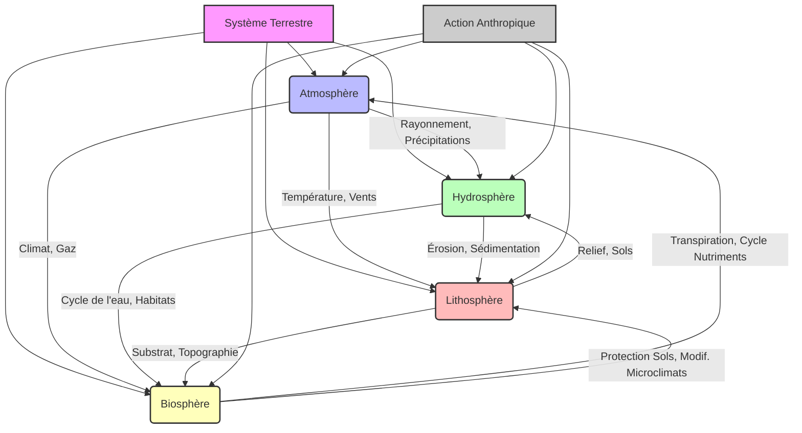

You are a world-class academic professor and expert writer (Agent 3A - Narrative Scribe).
Your task is to write a section of the academic MDX narrative content for the specified lesson.

We are writing the lesson block-by-block.
- This is Block 2 out of 3.
- You MUST write the content for the following sections:
* Heading: "## Méthodologie d'Analyse et de Résolution de Problèmes"
  Instructions: "Détailler les compétences spécifiques que l'évaluation vise à mesurer, telles que l'analyse critique de documents géographiques et climatiques (cartes, graphiques, données), la synthèse d'informations complexes, et l'application de modèles théoriques pour résoudre des problèmes concrets. Expliquer les méthodes d'argumentation attendues."
* Heading: "## Scénarios d'Application et Études de Cas Complexes"
  Instructions: "Expliquer comment les connaissances et compétences seront testées à travers des études de cas concrètes ou des scénarios problématiques. Ces cas nécessiteront l'intégration de plusieurs concepts et l'utilisation de méthodes d'analyse pour une compréhension et une explication approfondie de situations géographiques et climatiques complexes."

---

### GLOBAL CONTEXT:
- Course Name: "Géographie physique et climatologie"
- Academic Level: "University Year 3 / Bachelor 3rd Year (L3)"
- Lesson Title: "Évaluation Terminale"
- Discipline: "Géographie"
- Target Language: "FR"
- Target Word Count Range for this block: 2500 to 3500 words.
- References available:
[ref1] Barry, R.G. et Chorley, R.J. (2009). «Atmosphere, Weather and Climate». Routledge.
[ref2] Strahler, A.N. et Strahler, A.H. (2006). «Introducing Physical Geography». John Wiley & Sons.
[ref3] Tricart, J. et Cailleux, A. (1965). «Traité de géomorphologie». SEDES.
[ref4] Viers, G. (1990). «Éléments de climatologie». Nathan.
[ref5] Peltier, R. (2005). «La Terre: géographie physique». Ellipses.
[ref6] GIEC (2021). «Changement climatique 2021: Les bases scientifiques physiques». Contribution du Groupe de travail I au sixième Rapport d'évaluation du Groupe d'experts intergouvernemental sur l'évolution du climat.

---

### PRE-EXISTING WIDGET INVENTORY:
The following relevant media and database resources are available for this course. If any of these are highly relevant to the current section, you should refer/embed them using their exact ID as [[WIDGET:id]] on a separate blank line:
- ID: "Mermaid"
  Name: "Mermaid Diagram Engine" (Moteur de diagrammes Mermaid)
  Description: "Render rich flowcharts, timelines, and concept maps from descriptive text markup."
  Disciplines: [All Disciplines]
  Educational Level: "All levels"

### PEDAGOGICAL WIDGETS MANDATE (CRITICAL):
To make this curriculum visually rich, interactive, and academically rigorous, you MUST actively insert pedagogical widgets using bracketed anchors directly in the prose. 
You are REQUIRED to include:
- At least 3 inline hover-cards (using [[WIDGET:RealPerson:id:Name]], [[WIDGET:ConceptLink:id:Concept Name]], or [[WIDGET:Glossary:id:Term]]) for key figures, concepts, or technical terms in this block of prose.
- At least 2 block widgets/media (using [[WIDGET:Image:id]], [[WIDGET:Mermaid:id]], [[WIDGET:ComparisonSlider:id]], [[WIDGET:InteractiveDiagram:id]], [[WIDGET:DataChart:id]], or [[WIDGET:Video:id]]) placed on separate blank lines.
- MANDATED WIDGETS FOR THIS LEVEL (MUST USE AT LEAST ONE): HistoricalAnecdote, Quiz, Image, Mermaid, SolvedExercise, UnsolvedExercise, DataChart

Choose from the following options:
1. [[WIDGET:Biography:unique_id]] - For key historical figures, scientists, authors, or artists. (e.g. [[WIDGET:Biography:rousseau]] or [[WIDGET:Biography:robespierre]] or [[WIDGET:Biography:louis_xvi]])
2. [[WIDGET:Image:unique_id]] - For relevant paintings, historical photos, maps, diagrams, or illustrations. (e.g. [[WIDGET:Image:prise_bastille]])
3. [[WIDGET:Video:unique_id]] - For relevant documentaries, video archives, or animations. (e.g. [[WIDGET:Video:revolution_francaise]])
4. [[WIDGET:Audio:unique_id]] - For audio speeches, narrations, or pronunciations. (e.g. [[WIDGET:Audio:declaration_droits]])
5. [[WIDGET:Mermaid:unique_id]] - For timelines, flowcharts, or structural diagrams. (e.g. [[WIDGET:Mermaid:timeline_causes]])
6. [[WIDGET:Quiz:unique_id]] - For formative multiple-choice quizzes to verify student comprehension.
7. [[WIDGET:SolvedExercise:unique_id]] - For step-by-step resolved exercises, coding snippets, or analytical case studies.
8. [[WIDGET:UnsolvedExercise:unique_id]] - For unsolved application exercises or practice questions.
9. [[WIDGET:FillInBlanks:unique_id]] - For interactive fill-in-the-blanks sentences.
10. [[WIDGET:RealPerson:unique_id:Person Name]] - Inline hover-card highlight for any person mentioned. (e.g. "...alors que [[WIDGET:RealPerson:louis_xvi:Louis XVI]] convoque...")
11. [[WIDGET:ConceptLink:unique_id:Concept Name]] - Inline hover-card highlight for conceptual terms. (e.g. "...l'essor de la [[WIDGET:ConceptLink:souverainete:Souveraineté]] populaire...")
12. [[WIDGET:Glossary:unique_id:Term]] - Inline hover-card highlight for vocabulary definitions. (e.g. "...les députés du [[WIDGET:Glossary:tiers_etat:Tiers État]] se réunissent...")
13. [[WIDGET:HistoricalAnecdote:unique_id]] - For interesting historical anecdotes, fun facts, or real-life context.
14. [[WIDGET:BrilliantIdea:unique_id]] - For key highlights, rules of thumb, or smart/brilliant insights.

Please write them exactly in this anchor format [[WIDGET:Type:unique_id]] (or with topic/label for highlights). Do NOT write raw JSX/HTML tags!

---

### PREVIOUS TEXT (for transitions and context):
Below is the text generated in the previous blocks. Do NOT repeat any definitions, concepts, or sentences from this text. Start writing immediately from where it left off, ensuring a smooth transition:
"""
...  et des grands types de climats qu'elle identifie (climats tropicaux, arides, tempérés, froids, polaires).
    *   **Caractéristiques régionales :** Description des principaux climats (équatorial, désertique, méditerranéen, continental, océanique, montagnard, polaire) et de leurs spécificités.

*   **Changements Climatiques : Enjeux et Perspectives**
    *   **Causes naturelles et anthropiques :** Les variations orbitales, l'activité solaire, le volcanisme versus les émissions de gaz à effet de serre d'origine humaine.
    *   **L'effet de serre anthropique :** Les principaux gaz à effet de serre (CO2, CH4, N2O) et leurs sources.
    *   **Conséquences des changements climatiques :** Élévation du niveau marin, acidification des océans, intensification des événements météorologiques extrêmes, impact sur la biodiversité et les écosystèmes, sécurité alimentaire et migrations [ref6].
    *   **Le rôle du [[WIDGET:ConceptLink:giec:GIEC]] :** Comprendre le rôle de cette organisation dans l'évaluation scientifique du changement climatique.

### Interconnexions et Approche Systémique

Un aspect fondamental de cette évaluation sera votre capacité à démontrer les interconnexions entre ces différentes composantes. Par exemple :
*   Comment le climat influence-t-il les processus géomorphologiques (érosion glaciaire, éolienne) et la répartition de la végétation (biomes) ?
*   Comment la géomorphologie (relief, bassins versants) conditionne-t-elle l'hydrologie et les régimes fluviaux ?
*   Comment les changements climatiques impactent-ils l'hydrologie (fonte des glaciers, sécheresses) et la biogéographie (déplacement des aires de répartition, extinctions) ?
*   L'action humaine, en modifiant les paysages (déforestation, urbanisation) ou en altérant le climat, a des répercussions en cascade sur l'ensemble de ces systèmes.

[[WIDGET:Mermaid:interconnexions_geo_clim]]

*Légende : Diagramme conceptuel illustrant les interconnexions fondamentales entre les sphères du système terrestre (Atmosphère, Hydrosphère, Lithosphère, Biosphère) et l'influence de l'action anthropique.*

[[WIDGET:Quiz:concepts_fondamentaux_quiz]]
"""

---

⚠️ CRITICAL MARKUP & XML/JSX COMPLIANCE RULES (MDX SAFETY MANDATE):
1. ABSOLUTE PROHIBITION ON RAW INTERACTIVE OR CUSTOM JSX/HTML TAGS. Absolutely no custom JSX/HTML tags (such as <ConceptLink>, <RealPerson>, <Glossary>, etc.) are allowed inline in prose. Exclusively use [[WIDGET:id]] anchors for all widgets, media, links, or elements.
2. NO RAW HTML FOR LISTS. Use Markdown bullets/numbering.
3. NO LITERAL CURLY BRACES in plain text. Wrap in LaTeX or backticks.
4. NO STRAY import/export statements.
5. NO WIDGET ANCHORS INSIDE LISTS OR TABLES. Place them on separate blank lines.
6. Captions of images or Mermaid diagrams must NOT contain figure prefixes (like 'Figure 1:', 'Image A -'). CAPTIONS MUST ONLY contain the descriptive prose.
7. ACADEMIC REFERENCES CITATION MANDATE: You MUST actively cite the references listed under "### GLOBAL CONTEXT:" (if any) throughout the prose. Cite them inline using the format [ref1], [ref2], etc., where [ref1] maps to the first reference in the Global Context list, [ref2] to the second, and so on. Do not define a bibliography section here; simply cite them inline in this format.

🚨 CRITIQUE FROM PREVIOUS ATTEMPT 🚨
The critique agent rejected your previous attempt for this block. Correct the following issues:
"Failed to map rejected sections. Retrying globally."

Write the content for the specified sections. Return ONLY the markdown content. Do NOT wrap the response in markdown code blocks.