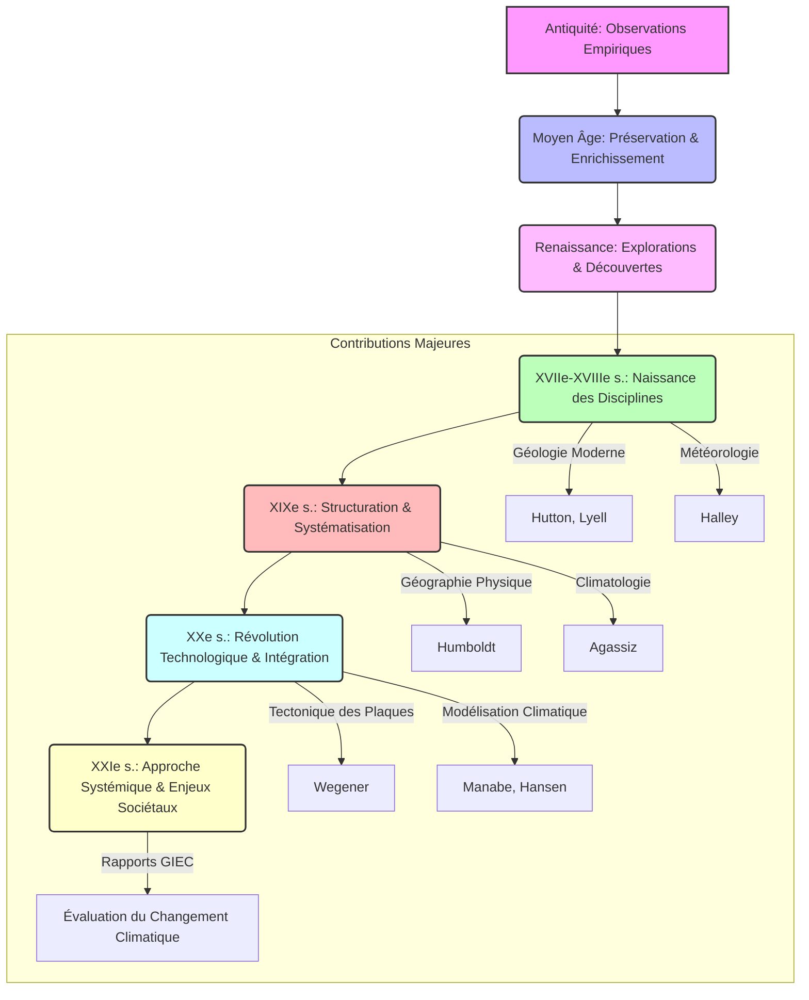

You are the Narrative Critic Agent (Agent 4A). Review the generated block of text for the lesson:
---

## Conclusion : Bilan et Perspectives d'Avenir
L'odyssée des sciences de la Terre et du climat, depuis les premières observations empiriques jusqu'aux modélisations complexes du Système Terre, est un témoignage éloquent de la curiosité humaine et de sa quête incessante de compréhension du monde. Cette exploration, débutée dans l'Antiquité par des penseurs comme [[WIDGET:RealPerson:aristote:Aristote]] qui tentaient d'expliquer les phénomènes météorologiques et géologiques par la philosophie et l'observation rudimentaire, a progressivement évolué vers une approche scientifique rigoureuse. Les premières tentatives de cartographie du monde et de description des paysages, bien que souvent entachées de mythes et de spéculations, ont jeté les bases d'une géographie descriptive. Au Moyen Âge, les savoirs antiques furent préservés et enrichis dans le monde islamique, tandis qu'en Europe, la pensée scolastique intégrait les phénomènes naturels dans un cadre théologique. La Renaissance marqua un tournant avec la redécouverte des textes classiques, l'essor de l'observation directe et les grandes explorations qui révélèrent la diversité géographique et climatique de la planète, stimulant la collecte de données et la remise en question des dogmes établis.

Le XVIIe et le XVIIIe siècles furent cruciaux pour la naissance des disciplines modernes. La géologie commença à se structurer avec des figures comme [[WIDGET:RealPerson:james_hutton:James Hutton]] (théorie de l'uniformitarisme) et [[WIDGET:RealPerson:charles_lyell:Charles Lyell]] (principes de géologie), tandis que la météorologie et l'océanographie posaient leurs premiers jalons scientifiques. Le XIXe siècle vit l'émergence de la géographie physique moderne, avec des explorateurs et des scientifiques comme [[WIDGET:RealPerson:alexander_von_humboldt:Alexander von Humboldt]] qui systématisèrent l'étude des interrelations entre les climats, la végétation et les formes du relief [ref5]. Le XXe siècle, quant à lui, fut marqué par des avancées technologiques majeures (satellites, ordinateurs) et l'intégration des disciplines, menant à la compréhension de concepts fondamentaux comme la tectonique des plaques et le changement climatique anthropique [ref6].

### Jalons majeurs dans l'évolution des sciences de la Terre et du Climat

| Période / Siècle | Caractéristiques Principales | Contributions Clés | Figures Emblématiques |
| :---------------- | :--------------------------- | :----------------- | :-------------------- |
| Antiquité         | Observations empiriques, philosophie naturelle | Premières classifications des vents, notions de cycles hydrologiques | Aristote, Théophraste |
| Moyen Âge         | Préservation et enrichissement des savoirs antiques (monde islamique) | Cartographie, description des climats régionaux | Al-Biruni, Ibn Battuta |
| Renaissance       | Redécouverte des classiques, grandes explorations, début de l'observation systématique | Cartographie mondiale, reconnaissance de la diversité climatique | Mercator, Léonard de Vinci |
| XVIIe-XVIIIe s.   | Naissance des disciplines scientifiques (géologie, météorologie) | Théorie de l'uniformitarisme, lois de la physique atmosphérique | James Hutton, Edmond Halley |
| XIXe s.           | Structuration de la géographie physique, développement de la climatologie | Systématisation des études climatiques, premières théories glaciaires | Alexander von Humboldt, Louis Agassiz |
| XXe s.            | Révolution technologique, intégration des disciplines, modélisation | Tectonique des plaques, modélisation climatique, découverte du réchauffement anthropique | Alfred Wegener, Syukuro Manabe |
| XXIe s.           | Approche systémique, science du climat intégrée, données massives | Modèles couplés Terre-Climat, science de l'attribution, solutions d'adaptation | GIEC, équipes de recherche internationales |

[[WIDGET:Block:evolution_sciences_terre_climat_resume:Résumé des étapes clés]]

Les défis actuels, notamment le changement climatique, la gestion des ressources naturelles et la prévision des risques géologiques et météorologiques, exigent une approche toujours plus intégrée et interdisciplinaire. Les sciences de la Terre et du climat sont désormais au cœur des enjeux sociétaux, guidant les politiques publiques et la sensibilisation du grand public.



[[WIDGET:Block:defis_futurs_terre_climat:Défis et Perspectives]]

En conclusion, l'évolution des sciences de la Terre et du climat est une illustration parfaite de la démarche scientifique, passant de l'observation isolée à la modélisation complexe des systèmes interconnectés. L'avenir de ces disciplines réside dans l'approfondissement de notre compréhension des rétroactions complexes du Système Terre, l'amélioration de la prévision des événements extrêmes et le développement de solutions durables face aux pressions anthropiques croissantes. La collaboration internationale et l'interdisciplinarité seront les piliers de cette progression, garantissant que ces sciences continuent de jouer un rôle essentiel dans la protection de notre planète et de ses habitants.
---

Check checkpoints:
1. Zero-placeholders.
2. Accurate academic density and level-appropriate language.
3. Strict MDX/JSX safety (absolutely no raw custom component or custom JSX/HTML tags like <ConceptLink>, <RealPerson>, <Glossary>, etc. inline in prose. All interactive elements and special links must strictly use the [[WIDGET:id]] anchor format).
4. No figure prefixes like "Figure 1:" in visual captions.
5. Presence of pedagogical widgets: Check that the block contains:
   - At least 3 inline hover-cards (ConceptLink, Glossary, RealPerson, etc.) as anchors.
   - At least 2 block widgets (Image, Mermaid, ComparisonSlider, InteractiveDiagram, DataChart, Video, HistoricalAnecdote, BrilliantIdea, etc.) as anchors.
   - If any mandated widget types (HistoricalAnecdote, Quiz, Image, Mermaid, SolvedExercise, UnsolvedExercise, DataChart) are missing or any discouraged widget types () are overused, point it out and reject the block if they are not respected.
6. Valid ## Conclusion section with at least two paragraphs and the required conclusion widgets.

Your audit must be in dual-mode:
- **"isGlobalRevision" MUST ONLY be set to true if the issues are widespread and catastrophic** (completely unparseable structure, severe length deficiency, or total failure of the block narrative requiring a complete full-text rewrite). If so, provide a comprehensive "globalCritique".
- **For standard, localized, or section-specific mistakes, you MUST set "isGlobalRevision": false**, and list ONLY the rejected sections requiring localized repair in the "sections" array.

Return ONLY a valid JSON object matching blockNarrativeAuditSchema:
```json
{
  "approved": boolean,
  "isGlobalRevision": boolean,
  "globalCritique": "detailed feedback explaining what to fix globally, or empty if approved/local repair",
  "sections": [
    // If approved is false and isGlobalRevision is false, list ONLY the specific sections that are rejected. Do NOT include approved sections.
    {
      "heading": "heading of the rejected section",
      "approved": false,
      "critique": "detailed feedback explaining what to fix in this specific section"
    }
  ]
}
```

[REJECT-ONLY REPORTING MANDATE]
1. If approved is true: approved MUST be true, isGlobalRevision MUST be false, globalCritique MUST be "", and sections MUST be empty.
2. If isGlobalRevision is true: approved MUST be false, isGlobalRevision MUST be true, globalCritique MUST describe the global issues, and sections MUST be empty.
3. If approved is false and isGlobalRevision is false: sections MUST ONLY contain sections that are rejected (with approved set to false). Any approved section MUST be strictly omitted from the array.