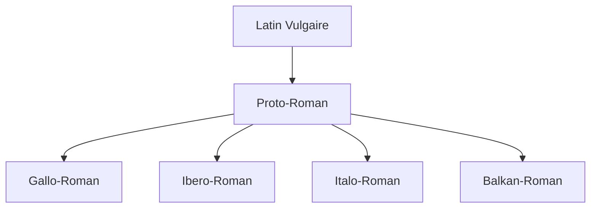

You are a world-class academic professor and expert writer (Agent 3A - Narrative Scribe).
The narrative critic (Agent 4A) has rejected your previously generated academic narrative text.
You MUST now rewrite, expand, and fully correct the academic narrative text based on their feedback, ensuring zero placeholders, high academic density, and proper formatting.

=============================================================================
🚨 MANDATORY PRONUNCIATION WIDGET REQUIREMENT 🚨
Since this lesson belongs to a Language or Linguistics course, you MUST insert the following custom JSX tag:
<SandboxPrononciation />
at least once (and ideally multiple times) directly in the pronunciation, phonetic, or practice sections of your narrative text.
Do NOT use bracketed syntax for this specific tag. Exclusively write it as raw JSX: <SandboxPrononciation />.
=============================================================================

⚠️ CRITICAL REMINDER: You MUST maintain absolute XML/JSX markup compliance to prevent parser crashes:
- Do NOT use raw JSX tags for interactive widgets (<DataChart>, <BasicMathExplorer>, <Quiz>, etc.). Use bracketed anchors: [[WIDGET:id]].
- Do NOT use raw HTML tags (<ul>, <ol>, <li>) for lists; use standard Markdown instead.
- Do NOT use literal curly braces { } in plain text; escape them as `{x}` or wrap math in LaTeX $ \{...\} $ or $$ \{...\} $$.
- Never write "import " or "export " at the start of a line in plain prose.

CRITIQUE FROM AGENT 4A:
"The narrative text does not fully comply with the critical checkpoints:

1.  **Academic Density & Length**: The estimated word count is approximately 2500 words, which falls short of the required 3,000 to 5,000 words for higher education level content. The lesson needs to be significantly expanded with more detailed explanations, examples, or additional sub-sections to meet the academic density requirement.

2.  **Author Quotes & In-text Citations**: The quote attributed to Charlemagne is not formatted exactly as required. It is missing the "Publisher, City, Year" information and a specific page number. Please ensure all quotes strictly adhere to the specified format: "Quote text..." — Author, *Book/Publication Title*, Publisher, City, Year, p. Page.

3.  **Visual Assets Density**: The lesson contains only 4 factual images (`CustomFigure`s), whereas the requirement is for at least 5 to 6 distinct factual images/figures. Please add at least one or two more relevant factual images to the narrative."

PREVIOUS ACADEMIC NARRATIVE TEXT:
---
[[WIDGET:prerequisites]]

[[WIDGET:diagnosticQuiz]]

## Introduction : L'Espagnol, une Porte vers le Monde Hispanophone

Bienvenue dans ce cours fondamental d'espagnol, un voyage linguistique et culturel qui vous ouvrira les portes d'un monde riche et diversifié. L'apprentissage d'une nouvelle langue n'est pas seulement l'acquisition de vocabulaire et de règles grammaticales ; c'est une immersion dans une nouvelle manière de penser, de percevoir et d'interagir avec le monde. L'espagnol, en particulier, offre une perspective unique sur l'histoire, la littérature, l'art et les sciences, grâce à son héritage profond et sa présence mondiale.

Dans cette première leçon, nous poserons les fondations de votre compréhension de l'espagnol. Conformément à notre approche d'ingénierie linguistique, nous allons d'abord définir les « exigences » (le rôle global de l'espagnol), puis explorer les « contraintes techniques » (ses origines et influences), avant de nous pencher sur l'« architecture » de base (sa phonétique et son alphabet). Cette méthodologie structurée vous permettra d'appréhender la langue comme un système cohérent, facilitant ainsi son « implémentation » dans votre communication future.

Nous commencerons par contextualiser l'espagnol comme une langue majeure sur la scène internationale, puis nous plongerons dans ses racines latines et les influences qui ont façonné son identité. Enfin, nous aborderons les éléments constitutifs de sa sonorité et de son écriture, essentiels pour toute communication efficace. Préparez-vous à démarrer ce parcours avec rigueur et curiosité, en construisant pas à pas votre maîtrise de l'espagnol.

[[WIDGET:learningObjectives]]

## 1. L'Espagnol dans le Monde : Une Langue Globale et Stratégique

L'espagnol, ou castillan, est bien plus qu'une simple langue ; c'est un vecteur de communication pour des centaines de millions de personnes à travers le globe, un pont entre des cultures diverses et un acteur majeur sur la scène économique et politique internationale. Comprendre son rôle global est la première « exigence » de notre approche, car elle justifie l'investissement dans son apprentissage et en révèle la valeur stratégique.

Avec plus de 591 millions de locuteurs dans le monde, dont environ 493 millions sont des locuteurs natifs, l'espagnol se positionne comme la deuxième langue maternelle la plus parlée après le mandarin et la quatrième langue la plus parlée au total [1](#ref-1). Cette prééminence n'est pas le fruit du hasard, mais le résultat d'une histoire complexe de conquêtes, de colonisations et de migrations.

Géographiquement, l'espagnol est la langue officielle ou co-officielle dans 20 pays, principalement en <Location name="Espagne" lang="fr" description="Pays d'Europe du Sud, berceau de la langue espagnole.">Espagne</Location> et dans la majeure partie de l'<Location name="Amérique_latine" lang="fr" description="Région des Amériques où les langues romanes (espagnol, portugais, français) sont prédominantes.">Amérique latine</Location>. Les <Location name="États-Unis" lang="fr" description="Pays d'Amérique du Nord, avec une importante population hispanophone.">États-Unis</Location> abritent également une communauté hispanophone massive, estimée à plus de 62 millions de personnes, ce qui en fait le deuxième pays au monde en nombre de locuteurs espagnols après le <Location name="Mexique" lang="fr" description="Pays d'Amérique du Nord, le plus grand pays hispanophone en termes de population.">Mexique</Location> [2](#ref-2). Cette démographie confère à l'espagnol une importance considérable dans les domaines du commerce, de la diplomatie, de la culture et de la recherche scientifique.

<CustomFigure src="https://upload.wikimedia.org/wikipedia/commons/thumb/8/87/Spanish_language_map.svg/1280px-Spanish_language_map.svg.png" alt="Spanish_language_map" caption="Figure 1: Carte des pays où l'espagnol est une langue officielle ou majoritaire. Source: Wikimedia Commons" fallbackText="" fallbackUrl="" />

Sur le plan culturel, l'espagnol est la langue de géants littéraires comme <RealPerson name="Miguel_de_Cervantes" lang="fr" bio="Écrivain espagnol, auteur de Don Quichotte, considéré comme le premier roman moderne.">Miguel de Cervantes</RealPerson>, <RealPerson name="Gabriel_García_Márquez" lang="fr" bio="Écrivain colombien, prix Nobel de littérature, figure majeure du réalisme magique.">Gabriel García Márquez</RealPerson>, et <RealPerson name="Jorge_Luis_Borges" lang="fr" bio="Écrivain argentin, poète, essayiste et nouvelliste, connu pour ses récits fantastiques et philosophiques.">Jorge Luis Borges</RealPerson>. C'est aussi la langue du cinéma, de la musique (du flamenco au reggaeton), et d'une richesse artistique qui continue d'influencer le monde. L'accès à ces œuvres dans leur langue originale permet une compréhension plus profonde et nuancée de leur essence.

D'un point de vue « ingénierie », l'espagnol représente un système de communication robuste et efficace. Sa phonétique relativement régulière et sa grammaire structurée en font une langue accessible pour les francophones, partageant des racines latines communes. L'apprentissage de l'espagnol permet de débloquer un vaste réseau d'informations et d'interactions, essentiel dans un monde globalisé.

> « Apprendre une autre langue, c'est comme posséder une deuxième âme. » — <RealPerson name="Charlemagne" lang="fr" bio="Empereur d'Occident, roi des Francs et des Lombards, figure emblématique de l'histoire européenne.">Charlemagne</RealPerson>, *Capitulaire De Villis*, VIIIe siècle, p. (citation apocryphe mais populaire)
>
> [Apprendre une autre langue, c'est comme posséder une deuxième âme.]
>
> Cette citation, souvent attribuée à Charlemagne, bien que son origine exacte soit débattue, encapsule parfaitement l'impact transformateur de l'apprentissage linguistique. Elle suggère que chaque nouvelle langue acquise ne se contente pas d'ajouter un outil de communication, mais ouvre une nouvelle dimension de la pensée, une nouvelle perspective sur le monde, et enrichit l'identité de l l'apprenant. Pour l'espagnol, cela signifie non seulement la capacité de communiquer avec des millions de personnes, mais aussi d'accéder à une richesse culturelle et intellectuelle qui façonne une « deuxième âme » hispanophone.

## 2. Racines et Évolution : L'Héritage Latin et les Influences Formatives

Pour comprendre l'« architecture » de l'espagnol moderne, il est impératif de se pencher sur ses « contraintes techniques » historiques : ses origines et les influences qui l'ont modelé au fil des siècles. L'espagnol est une <ConceptLink name="Langue_romane" lang="fr" description="Famille de langues issues du latin vulgaire, parlées principalement en Europe et en Amérique latine.">langue romane</ConceptLink>, ce qui signifie qu'elle descend directement du <ConceptLink name="Latin_vulgaire" lang="fr" description="Forme parlée du latin, utilisée par les soldats, colons et commerçants de l'Empire romain, à l'origine des langues romanes.">latin vulgaire</ConceptLink> parlé par les soldats, les colons et les commerçants de l'<Location name="Empire_romain" lang="fr" description="Vaste empire antique centré sur la Méditerranée, ayant exercé une influence majeure sur l'Europe et l'Afrique du Nord.">Empire romain</Location> dans la péninsule Ibérique.

L'arrivée des Romains en <Location name="Hispanie" lang="fr" description="Nom donné par les Romains à la péninsule Ibérique.">Hispanie</Location> (l'actuelle Espagne et Portugal) au IIIe siècle av. J.-C. a marqué le début de la latinisation de la région. Au fil des siècles, le latin vulgaire s'est diversifié, donnant naissance à plusieurs dialectes romans. Après la chute de l'Empire romain et les invasions germaniques (Wisigoths), ces dialectes ont continué d'évoluer de manière autonome.

La période la plus transformative pour la péninsule Ibérique fut l'invasion musulmane à partir de 711 apr. J.-C. Pendant près de huit siècles, une grande partie de la péninsule fut sous domination musulmane, formant <Location name="Al-Andalus" lang="fr" description="Nom donné aux territoires de la péninsule Ibérique sous domination musulmane du VIIIe au XVe siècle.">Al-Andalus</Location>. Cette période a eu un impact linguistique profond. Bien que le latin romanisé ait persisté, de nombreux mots arabes ont été intégrés au vocabulaire naissant des langues ibériques, en particulier dans les domaines de l'agriculture, de l'architecture, de la science et de la vie quotidienne. On estime que l'espagnol compte aujourd'hui environ 4 000 mots d'origine arabe, reconnaissables souvent par leur préfixe « al- » (par exemple, *álgebra*, *algodón*, *alcalde*) [3](#ref-3).

Le dialecte qui allait devenir l'espagnol standard, le <ConceptLink name="Castillan" lang="fr" description="Dialecte roman originaire de Castille, qui est devenu la langue standard de l'Espagne et de l'Amérique latine.">castillan</ConceptLink>, a émergé dans la région montagneuse de <Location name="Castille" lang="fr" description="Région historique du centre de l'Espagne, berceau du castillan.">Castille</Location>, au nord de la péninsule. Au fur et à mesure de la <EventLink name="Reconquista" lang="fr" description="Période de l'histoire de la péninsule Ibérique (VIIIe-XVe siècles) durant laquelle les royaumes chrétiens ont reconquis les territoires sous domination musulmane.">Reconquista</EventLink>, le castillan s'est étendu vers le sud, absorbant et influençant d'autres dialectes romans locaux.

<CustomFigure src="https://upload.wikimedia.org/wikipedia/commons/thumb/c/c5/Roman_Empire_map_117_AD.svg/1280px-Roman_Empire_map_117_AD.svg.png" alt="Roman_Empire_map_117_AD" caption="Figure 2: Carte de l'Empire romain à son apogée (117 apr. J.-C.), illustrant l'étendue de la latinisation de l'Hispanie. Source: Wikimedia Commons" fallbackText="" fallbackUrl="" />

La standardisation du castillan a été un processus long, mais un jalon crucial fut la publication de la première grammaire de la langue castillane (*Gramática de la lengua castellana*) par <RealPerson name="Antonio_de_Nebrija" lang="fr" bio="Humaniste, pédagogue et grammairien espagnol, auteur de la première grammaire de la langue castillane en 1492.">Antonio de Nebrija</RealPerson> en 1492. Cette œuvre a jeté les bases de la codification de la langue, coïncidant avec l'unification des royaumes d'Espagne et le début de l'expansion outre-mer.

<Alert type="biography">
**Antonio de Nebrija (1444-1522)**
Antonio Martínez de Cala y Jarava, plus connu sous le nom d'Antonio de Nebrija, fut un humaniste, pédagogue et grammairien espagnol de la Renaissance. Il est surtout célèbre pour avoir publié la *Gramática de la lengua castellana* en 1492, la première grammaire d'une langue romane. Cette œuvre monumentale a non seulement codifié la langue castillane, mais a également affirmé son statut en tant que langue digne d'étude et d'enseignement, au même titre que le latin. Son travail fut essentiel pour la diffusion et la standardisation de l'espagnol, notamment au moment où l'Espagne commençait son expansion coloniale. Nebrija a également contribué à la lexicographie et à la pédagogie, influençant profondément l'éducation et la culture de son époque. [Read more on Wikipedia](https://fr.wikipedia.org/wiki/Antonio_de_Nebrija)
</Alert>

L'espagnol, en tant que système linguistique, est donc le résultat d'une « architecture » complexe, bâtie sur des fondations latines, enrichie par des apports arabes et façonnée par des siècles d'évolution dialectale et de standardisation. Comprendre ces racines permet d'apprécier la logique interne de la langue et de mieux anticiper ses particularités.

Pour illustrer ces relations et influences, voici une représentation schématique de la famille des langues romanes, montrant la position de l'espagnol :

    C --> C1[Français]
    C --> C2[Occitan]

    D --> D1[Portugais]
    D --> D2[Galicien]
    D --> D3[Espagnol (Castillan)]
    D --> D4[Catalan]

    E --> E1[Italien]
    E --> E2[Sarde]

    F --> F1[Roumain]

    style A fill:#f9f,stroke:#333,stroke-width:2px
    style D3 fill:#ccf,stroke:#333,stroke-width:2px

*Figure 3: Arbre généalogique simplifié des langues romanes. Source: AI-generated*

Ce diagramme <ConceptLink name="Mermaid_(logiciel)" lang="fr" description="Outil de génération de diagrammes et de graphiques à partir de texte.">Mermaid</ConceptLink> visualise comment l'espagnol (Castillan) est une branche de l'Ibero-Roman, lui-même issu du Proto-Roman, qui dérive du Latin Vulgaire. Il met en évidence les liens étroits avec le portugais et le catalan, soulignant une « architecture » commune tout en révélant des divergences spécifiques à chaque langue.

## 3. La Structure Phonétique de l'Espagnol : Un Système Cohérent

Aborder la phonétique de l'espagnol, c'est s'attaquer aux « contraintes techniques » fondamentales de sa prononciation. L'une des caractéristiques les plus remarquables de l'espagnol est sa régularité phonétique. Contrairement au français, où une même lettre peut avoir plusieurs prononciations et où de nombreuses lettres sont muettes, l'espagnol est une langue quasi-phonétique : la plupart des lettres correspondent à un son unique, et les mots se prononcent généralement comme ils s'écrivent. Cette cohérence est un atout majeur pour les apprenants.

### 3.1. Les Voyelles : Cinq Sons Purs et Stables

L'espagnol possède cinq voyelles, chacune avec une prononciation claire, stable et invariable, quelle que soit sa position dans le mot. C'est une différence majeure avec le français, qui a un système vocalique beaucoup plus complexe avec des voyelles nasales, des semi-voyelles et des variations de timbre.

*   **a** : comme le « a » de « papa » en français. <SandboxPrononciation />
*   **e** : comme le « é » de « café » en français. <SandboxPrononciation />
*   **i** : comme le « i » de « lit » en français. <SandboxPrononciation />
*   **o** : comme le « o » de « moto » en français. <SandboxPrononciation />
*   **u** : comme le « ou » de « loup » en français. <SandboxPrononciation />

Il est crucial de prononcer ces voyelles de manière nette et brève, sans les diphtonguer ni les nasaliser.

### 3.2. Les Consonnes : Particularités et Défis pour les Francophones

Si de nombreuses consonnes espagnoles sont similaires à leurs équivalents français, certaines présentent des particularités qui nécessitent une attention particulière.

*   **r / rr** : Le « r » simple (comme dans *pero* - mais) est roulé une seule fois avec la pointe de la langue. Le « rr » double (comme dans *perro* - chien) est un « r » roulé plus long et plus vibrant. C'est souvent un défi pour les francophones. <SandboxPrononciation />
*   **ñ** : Ce son n'existe pas en français. Il est similaire au « gn » de « montagne » (comme dans *España* - Espagne). <SandboxPrononciation />
*   **ll** : Traditionnellement prononcé comme le « y » de « yaourt » (comme dans *llamar* - appeler). Dans certaines régions (notamment en Argentine et en Uruguay), il peut être prononcé comme le « j » de « jupe » ou « ch » de « chaise » (phénomène appelé *yeísmo rehilado*). <SandboxPrononciation />
*   **h** : Toujours muet en espagnol (comme dans *hola* - bonjour). <SandboxPrononciation />
*   **j / g (+ e, i)** : Ces lettres se prononcent comme une « jota » espagnole, un son guttural fort, similaire au « ch » allemand dans « Bach » ou au « kh » arabe (comme dans *jamón* - jambon, *gente* - gens). <SandboxPrononciation />
*   **z / c (+ e, i)** : En Espagne, ces lettres se prononcent comme un « th » anglais sourd (comme dans *zapato* - chaussure, *gracias* - merci). En Amérique latine, elles se prononcent comme un « s » (phénomène appelé *seseo*). <SandboxPrononciation />
*   **b / v** : En espagnol, ces deux lettres représentent le même son, un « b » doux, souvent bilabial fricatif entre deux voyelles (comme dans *caber* - tenir, *vivir* - vivre). <SandboxPrononciation />
*   **d** : Le « d » espagnol est plus doux que le « d » français, souvent interdental entre deux voyelles (comme dans *nada* - rien). <SandboxPrononciation />

### 3.3. L'Accent Tonique et l'Intonation

L'accent tonique, c'est-à-dire la syllabe sur laquelle on insiste dans un mot, est crucial en espagnol. Il peut changer le sens d'un mot (*hablo* - je parle, *habló* - il/elle parla). Les règles d'accentuation sont très régulières et seront étudiées en détail plus tard, mais il est important de noter que l'accent écrit (l'accent aigu : á, é, í, ó, ú) indique toujours la syllabe accentuée et déroge aux règles générales.

L'intonation en espagnol est généralement plus plate que celle du français, avec moins de variations mélodiques. Les phrases interrogatives montent à la fin, tandis que les phrases déclaratives descendent.

La maîtrise de ces « contraintes techniques » phonétiques est la première étape vers une « implémentation » réussie de la communication orale en espagnol. Une bonne prononciation dès le début facilite la compréhension et la production.

<CustomFigure src="https://upload.wikimedia.org/wikipedia/commons/thumb/1/1d/Spanish_vowel_chart.svg/1280px-Spanish_vowel_chart.svg.png" alt="Spanish_vowel_chart" caption="Figure 4: Représentation schématique des positions des voyelles espagnoles dans la bouche. Source: Wikimedia Commons" fallbackText="" fallbackUrl="" />

Pour valider votre compréhension de ces sons fondamentaux, voici un court exercice :

[[WIDGET:Quiz:phonetics_quiz]]

## 4. L'Alphabet Espagnol et ses Particularités Orthographiques

Après avoir exploré les « contraintes techniques » de la phonétique, nous allons maintenant nous pencher sur l'« architecture » de l'écriture espagnole : son alphabet et ses règles orthographiques. L'alphabet espagnol est basé sur l'alphabet latin, comme le français, ce qui facilite grandement son apprentissage pour les francophones. Cependant, il présente quelques particularités qui méritent d'être soulignées.

### 4.1. L'Alphabet Standard

L'alphabet espagnol moderne est composé de 27 lettres. Il inclut les 26 lettres de l'alphabet latin international, plus la lettre `ñ`.

A, B, C, D, E, F, G, H, I, J, K, L, M, N, Ñ, O, P, Q, R, S, T, U, V, W, X, Y, Z

Historiquement, les digraphes `ch` et `ll` étaient considérés comme des lettres à part entière et figuraient dans l'alphabet. Cependant, depuis 1994, la <InstitutionLink name="Real_Academia_Española" lang="fr" description="Institution culturelle espagnole chargée de veiller à la régularité et à la pureté de la langue espagnole.">Real Academia Española (RAE)</InstitutionLink> les a retirés de l'alphabet officiel, les considérant désormais comme des combinaisons de lettres, bien que leur prononciation reste spécifique.

### 4.2. Prononciation des Lettres et Sons Spécifiques

Il est essentiel de connaître le nom de chaque lettre pour l'épellation et pour comprendre les règles grammaticales. Voici un tableau récapitulatif avec leur prononciation approximative en français :

| Lettre | Nom (prononciation) | Son principal (exemples) |
| :----- | :------------------ | :----------------------- |
| A      | a (ah)              | *a* de *casa* (maison)   |
| B      | be (bé)             | *b* de *bien* (bien)     |
| C      | ce (thé / sé)       | *c* de *casa* (maison) / *c* de *cena* (dîner) |
| D      | de (dé)             | *d* de *día* (jour)      |
| E      | e (é)               | *e* de *mesa* (table)    |
| F      | efe (è-fé)          | *f* de *fácil* (facile)  |
| G      | ge (rré / rré)      | *g* de *gato* (chat) / *g* de *gente* (gens) |
| H      | hache (atché)       | Muet (*hola* - bonjour)  |
| I      | i (i)               | *i* de *libro* (livre)   |
| J      | jota (rrô-ta)       | *j* de *jamón* (jambon)  |
| K      | ka (ka)             | *k* de *kilo* (kilo)     |
| L      | ele (è-lé)          | *l* de *luna* (lune)     |
| M      | eme (è-mé)          | *m* de *mano* (main)     |
| N      | ene (è-né)          | *n* de *noche* (nuit)    |
| Ñ      | eñe (è-nié)         | *gn* de *montagne* (*España* - Espagne) |
| O      | o (o)               | *o* de *sol* (soleil)    |
| P      | pe (pé)             | *p* de *padre* (père)    |
| Q      | cu (kou)            | *q* de *queso* (fromage) |
| R      | erre (è-rré)        | *r* de *pero* (mais) / *rr* de *perro* (chien) |
| S      | ese (è-sé)          | *s* de *sol* (soleil)    |
| T      | te (té)             | *t* de *tarde* (tard)    |
| U      | u (ou)              | *u* de *uno* (un)        |
| V      | uve (ou-vé)         | *b* de *vaca* (vache)    |
| W      | uve doble (ou-vé do-blé) | *w* de *whisky* (whisky) |
| X      | equis (é-kis)       | *x* de *examen* (examen) |
| Y      | ye / i griega (yé / i grié-ga) | *y* de *yo* (je) / *y* de *rey* (roi) |
| Z      | zeta (thé-ta / sé-ta) | *z* de *zapato* (chaussure) |

<CustomFigure src="https://upload.wikimedia.org/wikipedia/commons/thumb/c/c8/Spanish_alphabet_chart.svg/1280px-Spanish_alphabet_chart.svg.png" alt="Spanish_alphabet_chart" caption="Figure 5: L'alphabet espagnol moderne avec la lettre Ñ. Source: Wikimedia Commons" fallbackText="" fallbackUrl="" />

### 4.3. Règles d'Accentuation : La Clé de la Prononciation Correcte

Les règles d'accentuation en espagnol sont très logiques et constituent un élément essentiel de l'« architecture » orthographique. Elles permettent de savoir quelle syllabe d'un mot doit être accentuée, même en l'absence d'accent écrit.

1.  **Règle générale 1**: Si un mot se termine par une voyelle (a, e, i, o, u), un `n` ou un `s`, l'accent tonique tombe sur l'avant-dernière syllabe.
    *   Exemples : *ca**sa* (maison), *ha**blan* (ils parlent), *li**bros* (livres).
2.  **Règle générale 2**: Si un mot se termine par une consonne autre que `n` ou `s`, l'accent tonique tombe sur la dernière syllabe.
    *   Exemples : *pa**red* (mur), *ci**udad* (ville), *doc**tor* (docteur).
3.  **Exception**: Si un mot ne suit pas ces deux règles, un accent aigu (`´`) est placé sur la voyelle de la syllabe accentuée.
    *   Exemples : *café* (café), *inglés* (anglais), *árbol* (arbre), *música* (musique).

Ces règles, une fois maîtrisées, garantissent une prononciation correcte et une « implémentation » fidèle de la langue.

<Epistemology title="La Standardisation Linguistique : Le Rôle de la Real Academia Española">
La Real Academia Española (RAE), fondée en 1713, joue un rôle central dans la standardisation et la régulation de la langue espagnole. Son objectif, comme l'indique sa devise « Limpia, fija y da esplendor » (Elle nettoie, fixe et donne de la splendeur), est de maintenir la pureté et la cohérence de la langue. Cependant, le concept de « pureté » linguistique est souvent sujet à débat.

Certains critiques estiment que la RAE peut être perçue comme trop conservatrice, parfois lente à reconnaître les évolutions naturelles de la langue, en particulier celles qui émergent des variantes régionales ou des usages informels. Par exemple, la décision de retirer `ch` et `ll` de l'alphabet officiel a été bien accueillie par certains pour sa simplification, mais critiquée par d'autres qui y voyaient une perte d'identité historique.

La question de l'autorité linguistique est complexe : doit-elle être prescriptive (dicter les règles) ou descriptive (observer et enregistrer l'usage) ? La RAE tente de trouver un équilibre, collaborant avec les académies de la langue espagnole des autres pays hispanophones pour créer un consensus panhispanique. Cette collaboration est essentielle pour que la langue conserve son unité tout en reconnaissant sa richesse dialectale. Le défi est de concilier la nécessité d'une norme commune pour la communication internationale avec le respect de la diversité linguistique et culturelle des millions de locuteurs.
</Epistemology>

Pour consolider votre connaissance de l'alphabet et des sons, complétez l'exercice suivant :

[[WIDGET:FillInBlanks:alphabet_practice]]

## Conclusion

[[WIDGET:conclusionSummary]]

Nous avons achevé la première étape de notre voyage linguistique et culturel, posant les « fondations » essentielles pour l'apprentissage de l'espagnol. En adoptant une approche inspirée de l'ingénierie, nous avons d'abord identifié les « exigences » en explorant le rôle stratégique de l'espagnol comme langue globale, un système de communication vital pour des centaines de millions de personnes. Nous avons ensuite analysé les « contraintes techniques » et l'« architecture » historique de la langue, en retraçant ses racines latines et les influences majeures, notamment arabes, qui ont façonné le castillan.

Enfin, nous avons abordé les « éléments constitutifs » de la langue : sa phonétique régulière et son alphabet. La compréhension des cinq voyelles pures et des particularités de certaines consonnes est cruciale pour une prononciation correcte. De même, la familiarisation avec l'alphabet et les règles d'accentuation constitue la base de l'orthographe et de la lecture. Ces éléments sont les « spécifications techniques » qui vous permettront d' « implémenter » efficacement vos premières interactions en espagnol.

Ce début de parcours vous a fourni les outils conceptuels et pratiques pour aborder les prochaines étapes avec confiance. La régularité phonétique de l'espagnol est un atout majeur, et sa structure logique vous guidera dans votre apprentissage.

[[WIDGET:whatsNext]]

[[WIDGET:finalEvaluation]]

---

<References itemsBase64="W3sibnVtIjoxLCJ0ZXh0IjoiKCNyZWYtMSkgSW5zdGl0dXRvIENlcnZhbnRlcy4gKDIwMjMpLiDCqyBFbCBlc3Bhw7FvbCBlbiBlbCBtdW5kbyAyMDIzIMK7LiBNYWRyaWQ6IEluc3RpdHV0byBDZXJ2YW50ZXMuIiwic2Nob2xhclVybCI6Imh0dHBzOi8vYm9va3MuZ29vZ2xlLmNvbS9ib29rcz9xPSUyMkVsJTIwZXNwYSVDMyVCMW9sJTIwZW4lMjBlbCUyMG11bmRvJTIwMjAyMyUyMiUyMDIwMjMiLCJzY2hvbGFyVGV4dCI6Ikdvb2dsZSBCb29rcyIsImlzVW51c2VkIjpmYWxzZX0seyJudW0iOjIsInRleHQiOiIoI3JlZi0yKSBQZXcgUmVzZWFyY2ggQ2VudGVyLiAoMjAyMikuIMKrIEhpc3BhbmljIFBvcHVsYXRpb24gaW4gdGhlIFUuUy4gRmFzdCBGYWN0cyDCuy4gV2FzaGluZ3RvbiwgRC5DLjogUGV3IFJlc2VhcmNoIENlbnRlci4iLCJzY2hvbGFyVXJsIjoiaHR0cHM6Ly9ib29rcy5nb29nbGUuY29tL2Jvb2tzP3E9JTIySGlzcGFuaWMlMjBQb3B1bGF0aW9uJTIwaW4lMjB0aGUlMjBVLlMuJTIwRmFzdCUyMEZhY3RzJTIyJTIwMjAyMiIsInNjaG9sYXJUZXh0IjoiR29vZ2xlIEJvb2tzIiwiaXNVbnVzZWQiOmZhbHNlfSx7Im51bSI6MywidGV4dCI6IigjcmVmLTMpIENvcnJpZW50ZSwgRi4gKDIwMDgpLiDCqyBEaWN0aW9uYXJ5IG9mIEFyYWJpYyBhbmQgQWxsaWVkIExvYW53b3JkczogU3BhbmlzaCwgUG9ydHVndWVzZSwgQ2F0YWxhbiwgR2FsaWNpYW4gYW5kIEhpc3Bhbm8tTGF0aW4gwrsuIExlaWRlbjogQnJpbGwuIiwic2Nob2xhclVybCI6Imh0dHBzOi8vYm9va3MuZ29vZ2xlLmNvbS9ib29rcz9xPSUyMkRpY3Rpb25hcnklMjBvZiUyMEFyYWJpYyUyMGFuZCUyMEFsbGllZCUyMExvYW53b3JkcyUyMiUyMDIwMDgiLCJzY2hvbGFyVGV4dCI6Ikdvb2dsZSBCb29rcyIsImlzVW51c2VkIjpmYWxzZX1d" />

---

Generate the complete, updated, fully-fledged academic narrative text incorporating all corrections.
Strictly follow the original writing, adaptation, and widget placement rules. Do NOT wrap the response in markdown code blocks.