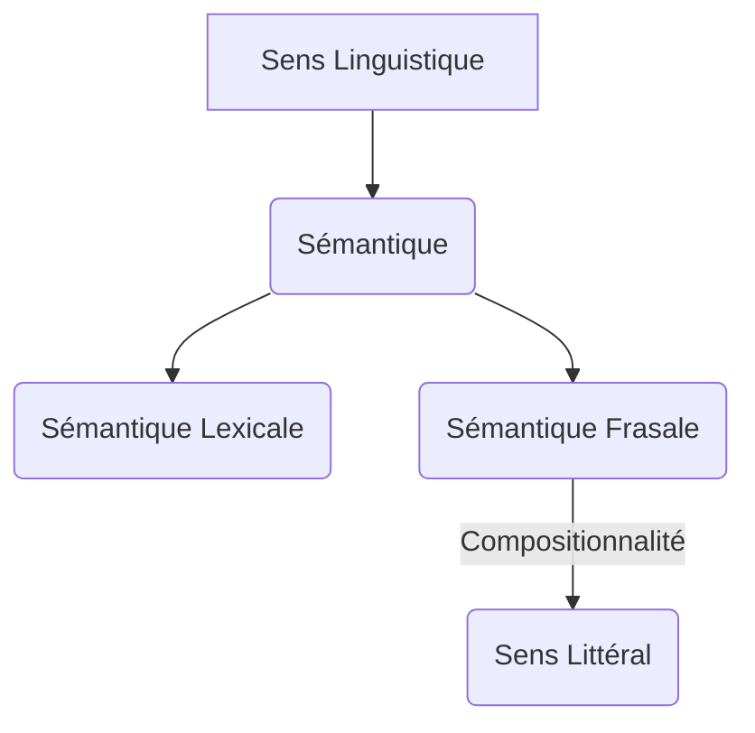

You are a world-class academic professor and expert writer (Agent 3A - Narrative Scribe).
The narrative critic (Agent 4A) has rejected your previously generated academic narrative text.
You MUST now rewrite, expand, and fully correct the academic narrative text based on their feedback, ensuring zero placeholders, high academic density, and proper formatting.

=============================================================================
🚨 MANDATORY PRONUNCIATION WIDGET REQUIREMENT 🚨
Since this lesson belongs to a Language or Linguistics course, you MUST insert the following custom JSX tag:
<SandboxPrononciation />
at least once (and ideally multiple times) directly in the pronunciation, phonetic, or practice sections of your narrative text.
Do NOT use bracketed syntax for this specific tag. Exclusively write it as raw JSX: <SandboxPrononciation />.
=============================================================================

⚠️ CRITICAL REMINDER: You MUST maintain absolute XML/JSX markup compliance to prevent parser crashes:
- Do NOT use raw JSX tags for interactive widgets (<DataChart>, <BasicMathExplorer>, <Quiz>, etc.). Use bracketed anchors: [[WIDGET:id]].
- Do NOT use raw HTML tags (<ul>, <ol>, <li>) for lists; use standard Markdown instead.
- Do NOT use literal curly braces { } in plain text; escape them as `{x}` or wrap math in LaTeX $ \{...\} $ or $$ \{...\} $$.
- Never write "import " or "export " at the start of a line in plain prose.

CRITIQUE FROM AGENT 4A:
"The narrative text does not fully comply with the academic density and visual assets policies. 

1.  **Academic Density & Length**: The text is approximately 2300 words, which falls short of the required 3,000 to 5,000 words for an L1 academic level lesson. The content, while rigorous, needs to be expanded with more detailed explanations, additional examples, or deeper dives into sub-topics to meet the length requirement.

2.  **Visual Assets Density, Sourcing & Captions**: The lesson currently includes only one figure (the Mermaid diagram). It is required to have at least 5 to 6 distinct factual images/figures and 1 to 2 decorative AI illustrations. Please add more relevant images or diagrams, ensuring each factual image uses an English Wikipedia page title as its Alt Text and has an italicized figure caption directly below it, including the source."

PREVIOUS ACADEMIC NARRATIVE TEXT:
---
[[WIDGET:prerequisites]]

[[WIDGET:diagnosticQuiz]]

## Introduction : Du Mot à l'Énoncé, le Voyage du Sens

La sémantique, en tant que discipline linguistique, s'attache à l'étude du sens. Si les leçons précédentes nous ont permis d'explorer la sémantique lexicale (le sens des mots) et la sémantique phrastique (le sens des phrases en tant qu'entités grammaticales), il est impératif de reconnaître que le sens ne se limite pas à la somme des significations de ses composants. Le langage est un phénomène dynamique, intrinsèquement lié à son usage et au contexte dans lequel il est produit. Une phrase, même grammaticalement correcte et sémantiquement cohérente, peut véhiculer des significations multiples, implicites, voire contradictoires, selon la situation de communication, les intentions du locuteur et les attentes de l'auditeur.

Cette leçon se propose d'élargir notre compréhension du sens en nous plongeant dans les domaines de la sémantique frasale et de la pragmatique. Nous passerons de l'analyse du sens « en soi » (tel qu'il est encodé dans la langue) à l'étude du sens « en usage » (tel qu'il est construit et interprété dans l'interaction). Nous verrons comment la structure des phrases contribue à la construction du sens, comment les locuteurs accomplissent des actions par le langage, et comment les principes de coopération guident nos échanges conversationnels, permettant la transmission d'informations non dites mais inférées.

Comprendre ces mécanismes est fondamental pour toute personne souhaitant **analyser** en profondeur la communication humaine, **évaluer** la complexité des interactions linguistiques et, potentiellement, **créer** des messages plus efficaces et nuancés.

[[WIDGET:learningObjectives]]

## 1. La Sémantique Frasale : La Construction du Sens au Niveau de la Phrase

La sémantique frasale, parfois appelée sémantique compositionnelle, s'intéresse à la manière dont le sens des phrases est construit à partir du sens de leurs mots et de la manière dont ces mots sont combinés syntaxiquement. C'est le domaine où le <ConceptLink name="Principe_de_compositionnalité" lang="fr" description="Principe selon lequel le sens d'une expression complexe est déterminé par le sens de ses parties et la manière dont elles sont combinées.">principe de compositionnalité</ConceptLink> joue un rôle central. Ce principe stipule que le sens d'une expression complexe est une fonction du sens de ses parties et de la manière dont ces parties sont syntaxiquement combinées [1](#ref-1).

### 1.1. Le Principe de Compositionnalité

Considérons une phrase simple comme « Le chat dort ».
*   Le mot « chat » réfère à une entité spécifique ou à une classe d'entités félines.
*   Le mot « dort » réfère à une action ou un état.
*   La structure syntaxique (Nom + Verbe) indique que l'entité « chat » est le sujet qui accomplit l'action « dort ».

Le sens de la phrase n'est pas simplement l'addition du sens de « chat » et « dort », mais leur combinaison selon les règles grammaticales du français. Le principe de compositionnalité est intuitif, mais sa mise en œuvre formelle est complexe, notamment face aux ambiguïtés et aux expressions idiomatiques.

### 1.2. Ambiguïtés Sémantiques et Syntaxiques

Les phrases peuvent présenter différents types d'ambiguïtés qui mettent à l'épreuve le principe de compositionnalité :

*   **Ambiguïté lexicale** : Un mot possède plusieurs sens.
    *   Exemple : « Il a posé sa *banque*. » (Banque = siège ou établissement financier ?)
    *   Le contexte extra-linguistique est souvent nécessaire pour lever cette ambiguïté.

*   **Ambiguïté syntaxique (ou structurelle)** : La structure grammaticale d'une phrase peut être interprétée de plusieurs manières.
    *   Exemple : « Il a vu l'homme avec le télescope. »
        1.  L'homme avait le télescope et il l'a vu.
        2.  Il a utilisé le télescope pour voir l'homme.
    *   Dans ce cas, la même séquence de mots peut correspondre à deux structures syntaxiques sous-jacentes différentes, chacune générant un sens distinct. La préposition « avec » peut modifier soit le verbe « voir », soit le nom « homme ».

*   **Ambiguïté scope (portée)** : Liée à la portée des opérateurs logiques ou des quantificateurs.
    *   Exemple : « Chaque étudiant n'a pas lu un livre. »
        1.  Il n'est pas vrai que chaque étudiant a lu un livre (certains n'en ont pas lu).
        2.  Pour chaque étudiant, il n'y a pas un livre qu'il ait lu (chaque étudiant n'a lu aucun livre).
    *   L'ordre des quantificateurs (« chaque », « un ») et de la négation (« pas ») peut changer radicalement le sens de la phrase.

La sémantique frasale utilise des outils formels, souvent inspirés de la logique, pour représenter ces structures et leurs interprétations. Elle cherche à modéliser comment le système linguistique lui-même contraint et guide l'interprétation du sens.

<Alert type="biography">
**Richard Montague (1930-1971)** fut un logicien et mathématicien américain dont les travaux ont révolutionné la sémantique linguistique. Il a soutenu que la sémantique des langues naturelles pouvait être traitée avec la même rigueur formelle que la sémantique des langages logiques. Sa « grammaire de Montague » propose un système unifié pour la syntaxe et la sémantique, où chaque règle syntaxique est associée à une règle sémantique correspondante, permettant de calculer le sens d'une phrase de manière compositionnelle. Son approche a jeté les bases de la sémantique formelle moderne.
[Read more on Wikipedia](https://fr.wikipedia.org/wiki/Richard_Montague)
</Alert>

### 1.3. Le Rôle de la Structure Syntaxique

La syntaxe n'est pas un simple arrangement de mots ; elle est une architecture qui organise le sens. La position d'un mot, la présence d'une virgule, l'ordre des constituants, tout cela peut altérer l'interprétation sémantique.
*   « Le chien mord l'homme. » vs. « L'homme mord le chien. » (Changement de sujet/objet)
*   « Les petits enfants et les bébés. » (Les enfants sont petits, mais les bébés sont-ils petits ?) vs. « Les petits, enfants et bébés. » (Les petits sont des enfants et des bébés). La virgule change la portée de l'adjectif.

Ces exemples illustrent que le sens d'une phrase est profondément ancré dans sa structure. Cependant, même avec une analyse sémantique frasale rigoureuse, une part significative du sens échappe encore. C'est là qu'intervient la pragmatique.

## 2. Introduction à la Pragmatique : Le Sens en Usage et les Actes de Langage

La pragmatique est la branche de la linguistique qui étudie l'usage du langage en contexte. Contrairement à la sémantique qui se concentre sur le sens littéral ou conventionnel des expressions linguistiques, la pragmatique s'intéresse à la manière dont les locuteurs utilisent ces expressions pour accomplir des actions et communiquer des significations implicites, en tenant compte du contexte, des intentions et des connaissances partagées [2](#ref-2).

### 2.1. Sémantique vs. Pragmatique : Une Distinction Cruciale

La distinction entre sémantique et pragmatique est fondamentale :
*   **Sémantique** : Le sens *des mots et des phrases* indépendamment de leur usage. C'est le sens conventionnel, ce qui est encodé dans la langue elle-même.
    *   Exemple : La phrase « Il fait chaud » signifie littéralement que la température ambiante est élevée.
*   **Pragmatique** : Le sens *des énoncés* en situation. C'est le sens que le locuteur *entend communiquer* et que l'auditeur *interprète*, en tenant compte du contexte.
    *   Exemple : Si « Il fait chaud » est dit dans une pièce fermée, cela peut être une requête implicite pour ouvrir la fenêtre.

Le contexte est l'élément clé qui permet de passer du sens sémantique au sens pragmatique. Le contexte inclut non seulement la situation physique, mais aussi les connaissances partagées entre les interlocuteurs, leurs relations sociales, leurs intentions, et l'historique de leur interaction.

### 2.2. La Théorie des Actes de Langage : Faire des Choses avec des Mots

L'une des contributions majeures à la pragmatique est la <ConceptLink name="Acte_de_langage" lang="fr" description="Théorie selon laquelle le langage n'est pas seulement descriptif, mais aussi performatif, accomplissant des actions.">théorie des actes de langage</ConceptLink>, développée par le philosophe britannique <RealPerson name="John_Langshaw_Austin" lang="fr" bio="Philosophe du langage britannique, pionnier de la théorie des actes de langage.">J.L. Austin</RealPerson> dans son ouvrage posthume *Quand dire, c'est faire* (1962) [3](#ref-3). Austin a contesté l'idée que le langage sert principalement à décrire la réalité. Il a montré que, par le langage, nous *faisons* des choses.

Austin a distingué trois types d'actes simultanés lors de la production d'un énoncé :

1.  **Acte locutoire** : L'acte de dire quelque chose. C'est la production d'une séquence de sons, de mots, et de phrases grammaticalement correctes avec un sens et une référence. C'est l'acte de prononcer des mots.
    *   Exemple : Dire « Je te promets de venir. » (Produire les sons et les mots de cette phrase).

2.  **Acte illocutoire** : L'acte accompli *en disant* quelque chose. C'est l'intention communicative du locuteur, la force de l'énoncé. Il peut s'agir d'une promesse, d'un ordre, d'une question, d'une affirmation, d'une menace, etc.
    *   Exemple : En disant « Je te promets de venir », l'acte illocutoire est de *faire une promesse*.

3.  **Acte perlocutoire** : L'acte accompli *par le fait de dire* quelque chose. Ce sont les effets produits sur l'auditeur ou sur la situation. Ces effets peuvent être intentionnels ou non.
    *   Exemple : En disant « Je te promets de venir », l'acte perlocutoire peut être de *rassurer* l'auditeur, de le *convaincre* de quelque chose, ou de le *décevoir* s'il ne voulait pas que vous veniez.

La théorie d'Austin a été affinée par <RealPerson name="John_Searle" lang="fr" bio="Philosophe américain, a développé la théorie des actes de langage d'Austin.">John Searle</RealPerson>, qui a proposé une classification des actes illocutoires en cinq catégories principales [4](#ref-4) :
*   **Assertifs (ou Représentatifs)** : Engagent le locuteur sur la vérité de la proposition (affirmer, décrire, conclure). Ex: « Il pleut. »
*   **Directifs** : Visent à faire faire quelque chose à l'auditeur (ordonner, demander, conseiller). Ex: « Ouvre la porte ! »
*   **Commissifs** : Engagent le locuteur à faire quelque chose (promettre, jurer, s'engager). Ex: « Je viendrai demain. »
*   **Expressifs** : Expriment un état psychologique du locuteur (remercier, s'excuser, féliciter). Ex: « Je suis désolé. »
*   **Déclaratifs** : Créent une nouvelle réalité par le fait même d'être prononcés (baptiser, marier, déclarer la guerre). Ex: « Je vous déclare mari et femme. »

La compréhension des actes de langage est essentielle pour **analyser** la fonction communicative des énoncés et **évaluer** les intentions sous-jacentes à la parole.

## 3. La Coopération Conversationnelle et les Implicatures

Au-delà des actes de langage, la pragmatique explore comment les interlocuteurs collaborent pour donner du sens à leurs échanges. <RealPerson name="Paul_Grice" lang="fr" bio="Philosophe du langage britannique, célèbre pour sa théorie des implicatures conversationnelles.">H.P. Grice</RealPerson>, un autre philosophe britannique, a proposé une théorie influente sur la manière dont les participants à une conversation s'attendent mutuellement à un certain niveau de rationalité et de coopération [5](#ref-5).

### 3.1. Le Principe de Coopération de Grice

Grice a postulé que les échanges conversationnels ne sont pas une succession de remarques décousues, mais des efforts de coopération. Il a formulé le <ConceptLink name="Principe_de_coopération" lang="fr" description="Principe selon lequel les participants à une conversation s'efforcent de rendre leur contribution pertinente et informative.">Principe de Coopération</ConceptLink> :

> « Que votre contribution conversationnelle soit telle qu'elle est requise, au stade où elle a lieu, par l'objectif ou la direction acceptée de l'échange de conversation dans lequel vous êtes engagé. »
> — H.P. Grice, *Logic and Conversation*, Harvard University Press, Cambridge, MA, 1975, p. 45

[Traduction] : « Faites en sorte que votre contribution à la conversation soit, au moment où elle intervient, celle que requiert l'objectif ou l'orientation acceptée de l'échange dans lequel vous êtes engagé. »

Ce principe sous-tend l'idée que les locuteurs et les auditeurs s'attendent à ce que chacun contribue de manière significative et pertinente à la conversation. Pour faciliter cette coopération, Grice a identifié quatre catégories de <ConceptLink name="Maxime_conversationnelle" lang="fr" description="Règles tacites qui guident les échanges conversationnels selon H.P. Grice.">maximes conversationnelles</ConceptLink> :

1.  **Maxime de Quantité** :
    *   Faites en sorte que votre contribution contienne autant d'informations que nécessaire.
    *   Ne faites pas en sorte que votre contribution contienne plus d'informations que nécessaire.
2.  **Maxime de Qualité** :
    *   N'affirmez pas ce que vous croyez faux.
    *   N'affirmez pas ce pour quoi vous manquez de preuves.
3.  **Maxime de Relation (ou Pertinence)** :
    *   Soyez pertinent.
4.  **Maxime de Manière** :
    *   Évitez l'obscurité d'expression.
    *   Évitez l'ambiguïté.
    *   Soyez bref (évitez la prolixité inutile).
    *   Soyez ordonné.

Ces maximes ne sont pas des règles prescriptives, mais des descriptions de ce que les participants *s'attendent* les uns des autres dans une interaction coopérative.

### 3.2. Les Implicatures Conversationnelles

L'intérêt majeur des maximes de Grice réside dans leur capacité à expliquer les <ConceptLink name="Implicature_conversationnelle" lang="fr" description="Sens implicite communiqué par un locuteur sans être explicitement dit, en s'appuyant sur le principe de coopération.">implicatures conversationnelles</ConceptLink>. Une implicature est une signification implicite, non dite explicitement, mais que l'auditeur peut inférer en supposant que le locuteur respecte (ou viole de manière ostentatoire) le principe de coopération et ses maximes.

Les implicatures surviennent souvent lorsque le locuteur semble « flouter » (violer) une maxime, mais le fait de manière délibérée et reconnaissable, invitant l'auditeur à chercher un sens sous-jacent.

*   **Violation de la Maxime de Quantité** :
    *   A : « Où habite Jean ? »
    *   B : « Quelque part dans le sud de la France. »
    *   Implicature : B ne sait pas l'adresse exacte de Jean, ou ne veut pas la donner. Si B savait et ne disait rien, il violerait la maxime de quantité.
*   **Violation de la Maxime de Qualité (Ironie, Métaphore)** :
    *   « Quel temps magnifique ! » (Dit sous une pluie battante).
    *   Implicature : Le locuteur pense que le temps est horrible (ironie). L'auditeur comprend que la maxime de qualité est violée intentionnellement.
*   **Violation de la Maxime de Relation** :
    *   A : « Peux-tu me prêter 10 euros ? »
    *   B : « Je n'ai pas d'argent sur moi. »
    *   Implicature : B ne peut pas prêter 10 euros. Bien que la réponse de B ne réponde pas directement à la question, elle est pertinente car elle explique pourquoi il ne peut pas satisfaire la demande.
*   **Violation de la Maxime de Manière** :
    *   « Le professeur a produit une série de sons articulés qui ressemblaient à une conférence. »
    *   Implicature : La conférence était ennuyeuse ou inintelligible. Le locuteur aurait pu dire « Le professeur a fait une conférence », mais a choisi une formulation alambiquée pour exprimer son jugement négatif.

L'intonation et le ton de voix peuvent également signaler une violation des maximes, notamment celle de Qualité pour l'ironie.
<SandboxPrononciation />
Par exemple, prononcer « Quel temps *magnifique* ! » avec un ton sarcastique ou une intonation montante sur « magnifique » indique clairement que le sens littéral n'est pas le sens voulu. L'auditeur utilise ces indices prosodiques pour calculer l'implicature.

Les implicatures sont calculables, annulables (on peut les nier sans contradiction), et non détachables (elles sont liées au contenu sémantique, pas à la forme exacte). Elles sont un mécanisme puissant pour la communication efficace et économique.

### 3.3. Exercice d'Analyse d'Implicatures

Pour mieux comprendre la dynamique des implicatures, nous allons **analyser** un scénario conversationnel.

[[WIDGET:Quiz:implicature_analysis]]

*Instructions pour le quiz :*
Le quiz présentera un court dialogue. Pour chaque énoncé clé, les étudiants devront identifier l'implicature potentielle et la maxime de Grice qui semble être violée (ou exploitée) pour générer cette implicature. Des options multiples seront proposées pour les maximes et les implicatures.

## 4. Au-delà de Grice : Critiques et Développements de la Pragmatique

Bien que la théorie de Grice ait été révolutionnaire et reste un pilier de la pragmatique, elle a également fait l'objet de critiques et a inspiré de nombreux développements.

<Epistemology title="La Portée Universelle des Maximes de Grice : Un Débat Culturel">
Les maximes de Grice sont-elles universelles ou culturellement spécifiques ? C'est une question qui a animé de nombreux débats en pragmatique interculturelle. Certains chercheurs ont soutenu que si le principe de coopération est probablement universel (toute communication efficace repose sur une forme de collaboration), la manière dont les maximes sont interprétées et appliquées peut varier considérablement d'une culture à l'autre. Par exemple, la maxime de Quantité peut être perçue différemment dans des cultures où la concision est valorisée par rapport à celles où la politesse exige des circonlocutions. De même, la maxime de Qualité peut être modulée par des considérations de « face » ou d'harmonie sociale dans certaines sociétés, où dire la vérité brute pourrait être considéré comme impoli. Cette controverse souligne l'importance de contextualiser les théories linguistiques et de ne pas les considérer comme des vérités absolues applicables uniformément à toutes les formes de communication humaine.
</Epistemology>

### 4.1. La Théorie de la Pertinence

L'une des théories les plus influentes post-Grice est la <ConceptLink name="Théorie_de_la_pertinence" lang="fr" description="Approche pragmatique qui explique la communication comme un processus de reconnaissance d'intentions, guidé par le principe de pertinence.">théorie de la pertinence</ConceptLink>, développée par <RealPerson name="Dan_Sperber" lang="fr" bio="Linguiste et anthropologue français, co-fondateur de la théorie de la pertinence.">Dan Sperber</RealPerson> et <RealPerson name="Deirdre_Wilson" lang="fr" bio="Linguiste britannique, co-fondatrice de la théorie de la pertinence.">Deirdre Wilson</RealPerson> [6](#ref-6). Cette théorie propose une approche plus unifiée de la communication, remplaçant les multiples maximes de Grice par un unique principe de pertinence.

Selon Sperber et Wilson, la communication est un processus de reconnaissance d'intentions. Chaque énoncé est une « preuve » de l'intention communicative du locuteur. L'auditeur, en cherchant à interpréter l'énoncé, est guidé par le principe de pertinence : tout énoncé communique une présomption de sa propre pertinence optimale.

Un énoncé est d'autant plus pertinent qu'il génère un maximum d'effets cognitifs (nouvelles informations, renforcement ou révision de croyances) pour un coût de traitement minimal. L'auditeur choisit l'interprétation qui lui semble la plus pertinente, c'est-à-dire celle qui offre le meilleur équilibre entre les effets cognitifs et l'effort de traitement.

*   **Effets cognitifs** : Changements dans l'environnement cognitif de l'auditeur (ajout de nouvelles informations, renforcement de croyances existantes, suppression de croyances fausses).
*   **Coût de traitement** : L'effort mental nécessaire pour interpréter l'énoncé (complexité syntaxique, ambiguïté lexicale, distance contextuelle).

La théorie de la pertinence explique comment les implicatures sont calculées non pas par la violation de maximes, mais par la recherche de l'interprétation la plus pertinente dans un contexte donné. L'ironie, par exemple, n'est pas une violation de la maxime de qualité, mais une utilisation du langage pour exprimer une attitude dissociative, qui est pertinente car elle communique plus que la simple négation du sens littéral.

### 4.2. L'Importance du Contexte Mutuellement Manifeste

La théorie de la pertinence met également l'accent sur le concept de « contexte mutuellement manifeste ». Pour qu'une communication réussisse, il n'est pas nécessaire que les interlocuteurs partagent exactement les mêmes connaissances, mais plutôt que certaines informations soient mutuellement manifestes, c'est-à-dire qu'elles soient accessibles aux deux parties et que chaque partie sache que l'autre y a accès.

Ceci est crucial pour la compréhension des implicatures. Lorsque A dit à B « Il fait chaud » en espérant que B ouvre la fenêtre, A suppose que le fait qu'il fait chaud, que la fenêtre est fermée, et que B peut l'ouvrir sont des informations mutuellement manifestes. Si B ne peut pas ouvrir la fenêtre (par exemple, elle est bloquée), l'implicature échoue.

### 4.3. Exemples Concrets et Études de Cas

Considérons un exemple simple pour illustrer la différence d'approche entre Grice et la pertinence :

*   **Scénario** : A et B discutent d'un film.
    *   A : « As-tu aimé le nouveau film de Dupont ? »
    *   B : « Les acteurs étaient très professionnels. »

*   **Analyse Gricéenne** :
    *   B semble violer la maxime de Quantité (ne donne pas une réponse directe « oui » ou « non ») et potentiellement la maxime de Relation (ne répond pas directement à la question sur l'appréciation).
    *   Implicature : B n'a pas aimé le film, ou du moins, n'a pas grand-chose de positif à en dire au-delà de la performance technique des acteurs.

*   **Analyse par la Théorie de la Pertinence** :
    *   L'énoncé de B est pertinent car il fournit une information qui, bien que non directement évaluative, est la plus forte information positive que B puisse donner sur le film. Si B avait aimé le film, il aurait fourni des informations plus positives et directes.
    *   Le coût de traitement est faible. Les effets cognitifs sont que A infère que B n'a pas aimé le film, car si B l'avait aimé, il aurait dit quelque chose de plus pertinent et positif. L'absence d'une évaluation positive directe est elle-même une information pertinente.

La théorie de la pertinence offre une explication plus économique et cognitivement plausible de la manière dont les implicatures sont calculées, en se basant sur des mécanismes inférentiels plutôt que sur la reconnaissance de violations de règles.

Pour **évaluer** votre compréhension de ces concepts, nous allons **analyser** un diagramme conceptuel qui synthétise les relations entre sémantique, pragmatique, et les théories de Grice et Sperber/Wilson.

    A --> C(Pragmatique)
    C -- Contexte &amp; Intention --> C1(Sens en Usage)
    C1 --> C1a(Actes de Langage)
    C1a -- Austin &amp; Searle --> C1a1(Locutoire, Illocutoire, Perlocutoire)

    C1 --> C1b(Implicatures Conversationnelles)
    C1b -- H.P. Grice --> C1b1(Principe de Coopération)
    C1b1 --> C1b2(Maximes: Quantité, Qualité, Relation, Manière)
    C1b2 -- Exploitation/Violation --> C1b3(Calcul d'Implicatures)

    C1b -- Sperber &amp; Wilson --> C1b4(Théorie de la Pertinence)
    C1b4 -- Principe de Pertinence --> C1b5(Effets Cognitifs vs. Coût de Traitement)

    B2a -- Contexte &amp; Inférence --> C1
    C1a1 -- Effets sur l'Auditeur --> C1a2(Perlocutoire)

*Figure 1: Diagramme Conceptuel de la Sémantique et de la Pragmatique - Ce diagramme illustre les interrelations entre la sémantique (lexicale et frasale) et la pragmatique, en détaillant les contributions majeures des théories des actes de langage et des implicatures conversationnelles. Source: AI-generated*

[[WIDGET:Mermaid:semantique_pragmatique_map]]

*Instructions pour le diagramme Mermaid :*
Le diagramme ci-dessus représente les concepts clés que nous avons abordés. Prenez le temps de le parcourir attentivement. Identifiez les liens entre les différentes branches de la sémantique et de la pragmatique. **Analysez** comment la Théorie de la Pertinence et le Principe de Coopération de Grice se positionnent par rapport aux actes de langage. Réfléchissez à la manière dont ce schéma pourrait être enrichi pour inclure d'autres aspects de la communication.

## Conclusion

[[WIDGET:conclusionSummary]]

Cette leçon nous a permis de franchir une étape cruciale dans notre compréhension du sens linguistique, en passant de l'analyse des unités minimales (mots) et des structures grammaticales (phrases) à l'étude du langage en action, dans son contexte d'usage. Nous avons vu que la sémantique frasale, avec son principe de compositionnalité, nous aide à déchiffrer le sens littéral des énoncés, tout en reconnaissant les défis posés par les ambiguïtés.

Ensuite, nous avons plongé dans le vaste domaine de la pragmatique, où le sens est non seulement interprété mais aussi construit par les interlocuteurs. La théorie des actes de langage d'Austin et Searle nous a montré que « dire, c'est faire », révélant les dimensions locutoire, illocutoire et perlocutoire de chaque énoncé.

Enfin, la contribution fondamentale de H.P. Grice avec son Principe de Coopération et ses maximes conversationnelles a éclairé le mécanisme des implicatures conversationnelles, ces significations implicites que nous inférons constamment dans nos interactions. Nous avons également exploré la théorie de la pertinence de Sperber et Wilson comme une alternative puissante pour expliquer ces phénomènes.

La capacité à **analyser** le sens au-delà des mots, à **évaluer** les intentions communicatives et à **créer** des messages qui exploitent la richesse des implicatures est une compétence essentielle pour tout linguiste et communicant. La pragmatique nous rappelle que le langage est avant tout un outil social, un moyen d'interagir, d'influencer et de construire du sens ensemble.

[[WIDGET:whatsNext]]

[[WIDGET:finalEvaluation]]

---
**Références**

[1](#ref-1) Partee, B. H. (1984). Compositionality. In F. Landman &amp; F. Veltman (Eds.), *Varieties of Formal Semantics* (pp. 281-311). Foris.
[2](#ref-2) Levinson, S. C. (1983). *Pragmatics*. Cambridge University Press.
[3](#ref-3) Austin, J. L. (1962). *How to Do Things with Words*. Harvard University Press.
[4](#ref-4) Searle, J. R. (1969). *Speech Acts: An Essay in the Philosophy of Language*. Cambridge University Press.
[5](#ref-5) Grice, H. P. (1975). Logic and Conversation. In P. Cole &amp; J. L. Morgan (Eds.), *Syntax and Semantics, Vol. 3: Speech Acts* (pp. 41-58). Academic Press. (Réédité dans *Studies in the Way of Words*, Harvard University Press, 1989).
[6](#ref-6) Sperber, D., &amp; Wilson, D. (1986). *Relevance: Communication and Cognition*. Blackwell.

---

Generate the complete, updated, fully-fledged academic narrative text incorporating all corrections.
Strictly follow the original writing, adaptation, and widget placement rules. Do NOT wrap the response in markdown code blocks.